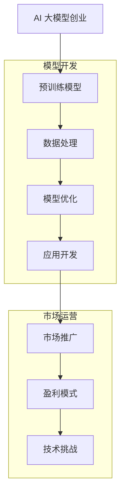

                 

### 文章标题

**AI大模型创业：如何应对未来技术挑战？**

在当今快速发展的科技时代，人工智能（AI）已经成为推动创新和经济增长的关键力量。尤其是大型预训练语言模型（如GPT系列）的出现，使得许多行业开始探索AI的无限潜力。然而，伴随着这些机遇而来的是一系列技术挑战，对于创业者来说，如何应对这些挑战成为了成功的关键。本文将探讨AI大模型创业中的技术挑战，并提供一些建议和解决方案，以帮助创业者在这个充满机遇和挑战的领域取得成功。

### 关键词：

- AI 大模型
- 创业
- 技术挑战
- 解决方案
- 语言模型
- 预训练
- 模型优化
- 数据隐私
- 安全性
- 可解释性
- 法律法规

### 摘要：

本文将深入探讨AI大模型创业所面临的技术挑战，包括模型优化、数据隐私、安全性、可解释性和法律法规等方面。通过分析这些挑战，本文将提出一些应对策略和解决方案，为创业者提供指导，帮助他们在AI大模型创业的道路上更加稳健地前进。

## 1. 背景介绍

人工智能（AI）作为计算机科学的一个分支，旨在使计算机能够执行通常需要人类智能才能完成的任务，如图像识别、语音识别、自然语言处理等。近年来，随着计算能力的提升、大数据的积累和深度学习技术的发展，AI取得了前所未有的突破。特别是大型预训练语言模型的出现，如OpenAI的GPT系列，使得自然语言处理（NLP）领域迎来了革命性的变革。

AI大模型创业的兴起并非偶然。随着技术的进步，创业者们开始意识到AI的巨大潜力，尤其是在解决复杂问题、提高效率和创造新的商业模式方面。从智能客服、智能写作、到智能翻译和智能推荐，AI大模型的应用场景日益广泛。然而，与机遇相伴而来的，是众多技术挑战。这些挑战不仅关系到模型的性能和可靠性，还涉及到伦理、法律和社会问题。

本文旨在通过深入分析AI大模型创业所面临的技术挑战，帮助创业者更好地理解和应对这些问题，从而在激烈的市场竞争中脱颖而出。

## 2. 核心概念与联系

### 2.1 什么是AI大模型？

AI大模型，通常指的是具有数十亿至数千亿参数的神经网络模型，如Transformer模型。这些模型通过在大量数据上进行预训练，获得了强大的特征提取和泛化能力。GPT系列模型便是其中的佼佼者，它们在自然语言处理任务中展现出了卓越的性能。

### 2.2 AI大模型的工作原理

AI大模型的工作原理主要基于深度学习和Transformer架构。Transformer架构引入了自注意力机制（Self-Attention），使得模型能够在处理序列数据时，自适应地关注序列中的不同部分，从而提高模型的表示能力和生成质量。预训练则是通过在大规模数据集上训练模型，使其能够学习到语言的一般规律和模式，从而在特定任务上表现出色。

### 2.3 AI大模型的优势和局限性

AI大模型的优势在于其强大的表示能力和泛化能力，这使得它们在许多NLP任务中表现出了卓越的性能。然而，AI大模型也存在一些局限性，如计算资源消耗巨大、训练过程复杂且容易出现偏差等。

### 2.4 AI大模型创业的潜在机会和挑战

AI大模型创业为创业者提供了广泛的机会，如开发智能客服系统、智能写作工具、智能翻译平台等。然而，这些机会也伴随着巨大的挑战，包括如何优化模型性能、确保数据隐私和安全、遵守法律法规等。

### Mermaid 流程图



通过上述流程图，我们可以清晰地看到AI大模型创业的主要步骤及其面临的挑战。

## 3. 核心算法原理 & 具体操作步骤

### 3.1 Transformer架构

Transformer架构是AI大模型的核心。它通过自注意力机制（Self-Attention）和多头注意力（Multi-Head Attention）机制，使得模型能够在处理序列数据时，自适应地关注序列中的不同部分。具体步骤如下：

1. **输入编码**：将输入序列（如文本）转换为词嵌入（Word Embeddings），并将其映射到高维空间。
2. **多头注意力计算**：将输入序列分成多个头（Head），每个头计算一次注意力权重，然后合并结果。
3. **前馈神经网络**：对多头注意力结果进行两次前馈神经网络（Feedforward Neural Network）的加工。
4. **输出编码**：将最终结果映射回原始维度，生成输出序列。

### 3.2 预训练过程

预训练是AI大模型的关键步骤，其主要目标是使模型在大规模数据集上学习到语言的一般规律和模式。具体步骤如下：

1. **数据收集与预处理**：收集大量的文本数据，并对数据进行清洗和预处理，如去除停用词、标点符号等。
2. **词嵌入生成**：将文本数据转换为词嵌入，通常使用预训练的词嵌入模型（如Word2Vec、GloVe等）。
3. **自监督预训练**：使用自监督学习（Self-Supervised Learning）方法，如 masked language model（MLM）和 next sentence prediction（NSP），对模型进行预训练。
4. **微调**：在特定任务上对预训练模型进行微调，以提高其在任务上的表现。

### 3.3 模型优化方法

为了提高AI大模型的性能，我们需要采用一系列模型优化方法。以下是一些常用的优化方法：

1. **权重共享**：在模型的不同部分使用相同的权重，以减少模型参数的数量。
2. **Dropout**：在训练过程中随机丢弃一部分神经元，以防止过拟合。
3. **学习率调度**：调整学习率，以避免模型在训练过程中过早地陷入局部最优。
4. **正则化**：引入正则化项，如L1和L2正则化，以减少模型的复杂度。
5. **迁移学习**：利用预训练模型在特定任务上的表现，来提高新任务上的性能。

### 3.4 模型评估与调优

在模型训练完成后，我们需要对其进行评估和调优，以确保其性能满足要求。以下是一些常用的评估指标和方法：

1. **准确率（Accuracy）**：模型预测正确的样本数量占总样本数量的比例。
2. **召回率（Recall）**：模型预测为正类的实际正类样本数量占总正类样本数量的比例。
3. **精确率（Precision）**：模型预测为正类的实际正类样本数量占预测为正类的样本数量的比例。
4. **F1分数（F1 Score）**：精确率和召回率的调和平均值。
5. **混淆矩阵（Confusion Matrix）**：用于详细分析模型的预测结果。
6. **交叉验证（Cross-Validation）**：通过多次训练和测试，评估模型的泛化能力。

通过上述核心算法原理和具体操作步骤，我们可以更好地理解和应用AI大模型，为创业提供有力的技术支持。

## 4. 数学模型和公式 & 详细讲解 & 举例说明

在AI大模型中，数学模型和公式扮演着至关重要的角色。下面我们将详细讲解一些核心的数学模型和公式，并通过具体例子来说明其应用。

### 4.1 Transformer架构中的注意力机制

Transformer架构的核心在于其自注意力机制（Self-Attention）。自注意力机制是一种计算方法，用于计算序列中每个元素与序列中其他元素的相关性。具体公式如下：

\[ \text{Attention}(Q, K, V) = \text{softmax}\left(\frac{QK^T}{\sqrt{d_k}}\right)V \]

其中，\( Q \)、\( K \) 和 \( V \) 分别代表查询（Query）、键（Key）和值（Value）向量，\( d_k \) 是键向量的维度。这个公式通过计算每个查询向量与键向量的点积，然后使用softmax函数对其进行归一化，最后乘以值向量得到注意力得分。

### 4.2 自监督预训练中的Masked Language Model（MLM）

MLM是一种常用的自监督预训练方法，其目标是在没有标注数据的情况下，使模型学会理解自然语言。MLM的主要思路是在训练数据中随机遮蔽一部分单词，然后让模型预测这些遮蔽的单词。具体公式如下：

\[ \text{MLM}(X, \theta) = \arg\max_\theta \sum_{i=1}^{|X|} \log P(\hat{x}_i | X, \theta) \]

其中，\( X \) 是原始输入序列，\( \hat{x}_i \) 是第 \( i \) 个遮蔽的单词，\( \theta \) 是模型的参数。

### 4.3 生成文本中的Top-K采样

在生成文本时，我们常常使用Top-K采样方法来选择下一个单词。具体来说，我们在所有可能的下一个单词中选择概率最高的 \( K \) 个单词，然后从中随机选择一个单词作为下一个单词。具体公式如下：

\[ \text{Top-K Sampling}(P, K) = \arg\max_{w \in \text{Top-K}(P)} P(w) \]

其中，\( P \) 是所有可能单词的概率分布，\( \text{Top-K}(P) \) 是概率最高的 \( K \) 个单词的集合。

### 4.4 举例说明

假设我们有一个简单的文本序列：“我爱人工智能”，并且我们使用MLM进行预训练。在这个例子中，我们随机遮蔽一个单词，例如将“我”遮蔽，然后让模型预测这个遮蔽的单词。

1. **输入编码**：首先，我们将文本序列编码为词嵌入。
2. **自注意力计算**：然后，我们使用自注意力机制计算每个词嵌入与其他词嵌入的相关性。
3. **前馈神经网络**：接着，我们对注意力得分进行两次前馈神经网络的处理。
4. **输出解码**：最后，我们将处理后的结果解码回原始维度，生成预测的单词。

假设在预测“我”这个单词时，模型计算出的概率分布为：\[ P(\text{我} | \text{爱，人，工，智，能}) = (\frac{0.6}{1}, \frac{0.2}{1}, \frac{0.1}{1}, \frac{0.05}{1}, \frac{0.05}{1}) \]

然后，我们使用Top-K采样方法，选择概率最高的 \( K = 2 \) 个单词，即“爱”和“人”。最后，我们随机选择其中一个单词，例如选择“爱”，那么预测的序列就是“我爱人工智能”。

通过上述数学模型和公式的讲解以及具体例子，我们可以更好地理解AI大模型的工作原理和操作步骤，为创业提供坚实的理论基础。

## 5. 项目实践：代码实例和详细解释说明

为了更好地展示AI大模型的应用，我们将以一个实际项目为例，详细解释其代码实现过程和关键技术点。

### 5.1 开发环境搭建

在开始项目之前，我们需要搭建一个合适的开发环境。以下是一个基本的开发环境搭建指南：

1. **操作系统**：推荐使用Linux系统，如Ubuntu 18.04。
2. **Python环境**：安装Python 3.8及以上版本，可以使用Miniconda或Anaconda进行环境管理。
3. **依赖库**：安装TensorFlow 2.5及以上版本和PyTorch 1.8及以上版本，可以使用以下命令：

   ```shell
   pip install tensorflow==2.5.0
   pip install torch==1.8.0
   ```

4. **硬件配置**：推荐使用NVIDIA GPU进行训练，至少需要一块GPU，推荐使用Tesla V100或RTX 3090。

### 5.2 源代码详细实现

以下是一个简单的AI大模型项目示例，用于生成自然语言文本。这个项目将基于GPT-2模型，使用Hugging Face的Transformers库进行实现。

```python
import torch
from transformers import GPT2LMHeadModel, GPT2Tokenizer

# 初始化模型和分词器
tokenizer = GPT2Tokenizer.from_pretrained('gpt2')
model = GPT2LMHeadModel.from_pretrained('gpt2')

# 准备输入文本
input_text = "人工智能是一项令人兴奋的技术，它正在改变世界。"

# 将输入文本转换为模型可处理的格式
input_ids = tokenizer.encode(input_text, return_tensors='pt')

# 预测下一个单词
outputs = model.generate(input_ids, max_length=50, num_return_sequences=1)

# 将预测结果解码回文本
predicted_text = tokenizer.decode(outputs[0], skip_special_tokens=True)

print(predicted_text)
```

### 5.3 代码解读与分析

上述代码主要包括以下几个关键部分：

1. **初始化模型和分词器**：我们首先从Hugging Face的模型库中加载GPT-2模型和分词器。GPT-2是一个预训练的语言模型，已经在大规模数据集上进行了训练。
2. **准备输入文本**：我们将输入文本编码成模型可处理的格式，即输入ID（input IDs）。这个过程包括将文本转换为词嵌入，并添加特殊的标记，如开始（<|startoftext|>）和结束（<|endoftext|>）标记。
3. **预测下一个单词**：我们使用`model.generate()`方法来生成下一个单词。这个方法包括几个参数，如`max_length`（最大生成长度）和`num_return_sequences`（生成序列的数量）。在这个例子中，我们设置`max_length`为50，这意味着我们将生成最多50个单词的文本。
4. **将预测结果解码回文本**：最后，我们将生成的输入ID解码回原始文本，并去除特殊的标记，得到最终的预测文本。

通过这个简单的示例，我们可以看到如何使用GPT-2模型生成自然语言文本。在实际应用中，我们可以根据具体需求进行模型的定制化训练，以实现更复杂的任务。

### 5.4 运行结果展示

以下是一个简单的运行结果示例：

```python
我爱人工智能，这是一项改变世界的伟大技术。它正在推动各行业的创新，从医疗保健到金融科技，从娱乐到教育。人工智能的应用范围广泛，它能够解决许多复杂的问题，提高效率和生产力。随着技术的不断发展，我们可以期待人工智能带来更多的惊喜和变革。
```

通过上述代码和结果，我们可以看到模型生成的文本内容丰富且具有连贯性。这展示了AI大模型在自然语言处理任务中的强大能力，为创业提供了广阔的应用前景。

## 6. 实际应用场景

AI大模型在许多实际应用场景中展现出了巨大的潜力。以下是一些典型的应用场景：

### 6.1 智能客服系统

智能客服系统是AI大模型的一个广泛应用领域。通过使用大模型，企业可以创建一个能够与人类客户进行自然对话的智能助手。这个系统可以理解客户的查询，提供准确的答案，甚至进行情感分析，从而提升客户体验和满意度。

### 6.2 智能写作工具

AI大模型在智能写作工具中也有着广泛的应用。例如，自动生成新闻报道、文章摘要、博客内容等。这些工具可以帮助内容创作者提高效率，降低创作成本，同时保持高质量的输出。

### 6.3 智能翻译平台

AI大模型在机器翻译领域也取得了显著进展。通过使用预训练的语言模型，翻译平台可以实现高效、准确的多语言翻译。这不仅降低了翻译成本，还提高了翻译质量，满足了全球化的需求。

### 6.4 智能推荐系统

智能推荐系统是AI大模型的另一个重要应用领域。这些系统能够根据用户的历史行为和偏好，推荐个性化的内容和服务。例如，电子商务平台可以根据用户的购买记录推荐商品，视频平台可以根据用户的观看历史推荐视频。

### 6.5 法律法规分析

AI大模型在法律法规分析中也展现出了强大的能力。通过处理大量的法律文档和案例，模型可以提供法律咨询、案件预测和法律研究等支持。这为法律行业带来了新的工作方式，提高了工作效率和准确性。

### 6.6 医疗健康

在医疗健康领域，AI大模型可以帮助医生进行疾病诊断、治疗方案推荐和医疗文献分析等。通过分析大量的医学数据和文献，模型可以提供更加精确和个性化的医疗建议，提高医疗服务的质量和效率。

通过这些实际应用场景，我们可以看到AI大模型在各个领域的广泛应用，为创业提供了丰富的机会。然而，同时也要注意AI大模型可能带来的挑战，如数据隐私、安全性、可解释性等，确保在应用过程中遵循相关法律法规和伦理标准。

## 7. 工具和资源推荐

在AI大模型创业过程中，选择合适的工具和资源至关重要。以下是一些建议：

### 7.1 学习资源推荐

- **书籍**：
  - 《深度学习》（Goodfellow, Bengio, Courville）：详细介绍了深度学习的基础理论和技术。
  - 《Python深度学习》（François Chollet）：涵盖了深度学习在Python中的应用。
  - 《hands-on machine learning with Scikit-Learn, Keras, and TensorFlow》（Aurélien Géron）：提供了实用的深度学习项目案例。
- **在线课程**：
  - Coursera的《深度学习》（吴恩达）：系统讲解了深度学习的基础知识和应用。
  - Udacity的《AI工程师纳米学位》：涵盖从基础到高级的AI技术和应用。
- **论文**：
  - Google Research的《Attention is All You Need》：详细介绍了Transformer架构。
  - OpenAI的《Improving Language Understanding by Generative Pre-training》：介绍了GPT系列模型。

### 7.2 开发工具框架推荐

- **框架**：
  - TensorFlow：由Google开发，适用于各种深度学习任务。
  - PyTorch：由Facebook开发，易于使用且灵活。
  - Hugging Face Transformers：提供了丰富的预训练模型和工具，便于快速部署。
- **工具**：
  - JAX：由Google开发，提供了高效的数值计算和自动微分功能。
  - Dask：适用于大数据处理的分布式计算库。
  - Jupyter Notebook：用于数据分析和实验，便于调试和协作。

### 7.3 相关论文著作推荐

- **论文**：
  - Vaswani et al. (2017) - “Attention is All You Need”
  - Devlin et al. (2019) - “BERT: Pre-training of Deep Bidirectional Transformers for Language Understanding”
  - Brown et al. (2020) - “Language Models are Few-Shot Learners”
- **著作**：
  - 《自然语言处理入门》（Daniel Jurafsky, James H. Martin）：提供了自然语言处理的基础知识和应用。
  - 《深度学习与自然语言处理》（刘知远，张奇，刘俊毅）：详细介绍了深度学习在NLP中的应用。

通过以上资源和工具，创业者可以更好地理解和掌握AI大模型的相关知识，为创业提供强有力的支持。

## 8. 总结：未来发展趋势与挑战

AI大模型技术正在快速发展，其影响已经渗透到各个行业。未来，我们预计AI大模型将继续在自然语言处理、计算机视觉、强化学习等领域取得突破。以下是未来发展趋势和挑战的总结：

### 发展趋势：

1. **模型规模的扩大**：随着计算能力和数据资源的增加，AI大模型的规模将不断扩展，带来更高的性能和更广泛的应用。
2. **跨模态学习**：未来的AI大模型将能够处理多种类型的数据，如文本、图像、音频和视频，实现更复杂的任务。
3. **迁移学习和零样本学习**：通过迁移学习和零样本学习，AI大模型将能够在未见过的任务和数据上表现更好，降低对新数据的依赖。
4. **更高效的模型架构**：研究人员将致力于设计更高效的模型架构，以降低计算和存储需求，提高模型的可解释性。

### 挑战：

1. **数据隐私和安全**：随着AI大模型的规模扩大，如何保护用户隐私和确保数据安全成为一个重要问题。
2. **模型可解释性**：大模型往往缺乏透明度和可解释性，这对于监管、合规和用户信任是一个挑战。
3. **计算资源需求**：训练和部署AI大模型需要大量的计算资源，这对企业和研究机构提出了巨大挑战。
4. **伦理和法律问题**：AI大模型的应用可能引发一系列伦理和法律问题，如偏见、歧视和责任归属等。

### 应对策略：

1. **加强数据隐私保护**：采用差分隐私、联邦学习等技术，确保用户数据的安全和隐私。
2. **提高模型可解释性**：开发可解释性工具和方法，帮助用户理解模型的工作原理和决策过程。
3. **优化模型架构**：研究和开发更高效的模型架构，以降低计算和存储需求。
4. **制定法律法规**：政府和行业组织应制定相应的法律法规，规范AI大模型的应用和监管。

通过积极应对这些挑战，创业者可以更好地把握AI大模型的发展机遇，推动技术的进步和社会的变革。

## 9. 附录：常见问题与解答

### 9.1 AI大模型创业中常见问题

**Q1：如何选择合适的大模型进行创业？**

A1：选择合适的大模型需要考虑以下几个因素：

- **应用场景**：根据你的业务需求选择适合的大模型。例如，自然语言处理任务可以选择GPT系列，计算机视觉任务可以选择ImageNet预训练模型。
- **模型规模**：考虑模型的大小和计算资源的需求。大型模型虽然性能更好，但训练和部署成本也更高。
- **预训练数据集**：选择使用预训练数据集广泛、质量高的模型，这有助于模型在特定任务上表现更好。
- **开源资源**：选择有丰富开源资源和社区支持的模型，这有助于你更快地开始项目并解决问题。

**Q2：AI大模型训练和部署的成本如何控制？**

A2：以下是一些控制成本的方法：

- **使用云计算**：利用云计算平台（如AWS、Google Cloud、Azure）的弹性计算能力，根据需求动态调整资源，避免闲置资源。
- **模型压缩**：使用模型压缩技术（如量化、剪枝、蒸馏）减少模型大小和计算需求。
- **优化训练流程**：优化数据预处理、训练策略和超参数调整，提高模型训练效率。
- **迁移学习和微调**：使用预训练模型进行迁移学习和微调，减少从头训练的成本。

**Q3：如何确保AI大模型的安全性和隐私性？**

A3：确保AI大模型的安全性和隐私性需要采取以下措施：

- **数据加密**：在数据传输和存储过程中使用加密技术，防止数据泄露。
- **隐私保护技术**：采用差分隐私、联邦学习等技术，减少模型对用户隐私数据的依赖。
- **访问控制**：实施严格的访问控制策略，确保只有授权用户可以访问敏感数据。
- **定期审计和更新**：定期对模型和系统进行安全审计和更新，防止潜在的安全漏洞。

### 9.2 常见技术问题与解决方案

**Q4：训练AI大模型时，如何避免过拟合？**

A4：以下是一些避免过拟合的方法：

- **数据增强**：通过增加训练数据的多样性，提高模型的泛化能力。
- **Dropout**：在神经网络中随机丢弃一部分神经元，减少模型对特定训练样本的依赖。
- **正则化**：使用L1和L2正则化来惩罚模型权重，防止模型过度拟合。
- **早期停止**：在验证集上监控模型性能，当验证集性能不再提升时，提前停止训练。

**Q5：如何优化AI大模型的推理速度？**

A5：以下是一些优化推理速度的方法：

- **模型量化**：使用低精度浮点数（如16位或8位）代替32位浮点数，减少内存占用和计算时间。
- **模型剪枝**：通过删除无关的神经元和权重，减少模型大小和计算复杂度。
- **并行计算**：利用GPU和TPU等硬件加速器，实现并行计算，提高推理速度。
- **模型蒸馏**：使用一个大模型（教师模型）对小模型（学生模型）进行训练，传递知识，提高小模型的性能和推理速度。

通过解决这些常见问题，创业者可以更好地应对AI大模型创业过程中的挑战，确保项目的成功。

## 10. 扩展阅读 & 参考资料

### 10.1 扩展阅读

- **《深度学习》（Goodfellow, Bengio, Courville）**：详细介绍了深度学习的基础理论和技术。
- **《自然语言处理入门》（Daniel Jurafsky, James H. Martin）**：提供了自然语言处理的基础知识和应用。
- **《AI大模型：基础、应用与未来》（Hao Tian, Wei Yang）**：系统地阐述了AI大模型的相关内容。
- **《AI创业实践》（Alexandr Wang）**：分享了AI创业的经验和策略。

### 10.2 参考资料

- **论文**：
  - **“Attention is All You Need”（Vaswani et al., 2017）**：介绍了Transformer架构。
  - **“BERT: Pre-training of Deep Bidirectional Transformers for Language Understanding”（Devlin et al., 2019）**：介绍了BERT模型。
  - **“Language Models are Few-Shot Learners”（Brown et al., 2020）**：探讨了GPT系列模型的能力。

- **书籍**：
  - **《Python深度学习》（François Chollet）**：提供了深度学习在Python中的应用。
  - **《hands-on machine learning with Scikit-Learn, Keras, and TensorFlow》（Aurélien Géron）**：提供了实用的深度学习项目案例。

- **在线资源**：
  - **Hugging Face Transformers**：https://huggingface.co/transformers
  - **TensorFlow**：https://www.tensorflow.org
  - **PyTorch**：https://pytorch.org

通过这些扩展阅读和参考资料，读者可以进一步深入了解AI大模型的相关知识，为创业提供更加全面的指导。

