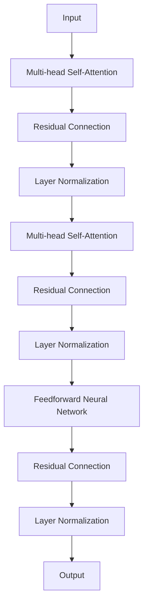

                 

# AI大模型创业：如何应对未来用户需求？

> **关键词**：AI大模型、用户需求、创业策略、创新思维

> **摘要**：本文将探讨AI大模型创业中的关键问题，包括如何准确预测和应对未来用户需求。我们将通过案例分析、技术趋势解析和战略规划，提供创业者在AI大模型领域取得成功的指导。

## 1. 背景介绍（Background Introduction）

### 1.1 AI大模型的发展历程

AI大模型，如GPT、BERT等，近年来在自然语言处理、计算机视觉和机器学习等领域取得了显著的进展。这些模型凭借其强大的数据处理能力和智能分析能力，改变了传统数据处理的方式，引发了产业的深刻变革。

### 1.2 创业环境的演变

随着技术的不断进步和市场的快速变化，创业环境也在不断演变。创业者在AI大模型领域的创业面临着前所未有的机遇和挑战。如何准确预测并适应用户需求，成为创业成功的关键因素。

### 1.3 用户需求的变化趋势

用户需求正在从单一的个性化和定制化，向更加智能化、自动化和便捷化的方向发展。创业者在开发AI大模型时，必须深入理解用户需求的变化趋势，以便提供更具竞争力的产品和服务。

## 2. 核心概念与联系（Core Concepts and Connections）

### 2.1 什么是AI大模型？

AI大模型是指具有大规模参数和复杂结构的机器学习模型。这些模型通过大量的数据训练，能够自动提取特征、发现规律，并具备强大的预测和生成能力。

### 2.2 AI大模型与用户需求的关系

AI大模型的应用范围广泛，包括语音识别、自然语言处理、图像识别、智能推荐等。用户需求的变化直接影响AI大模型的应用场景和商业模式。

### 2.3 AI大模型创业的关键环节

AI大模型创业的关键环节包括：市场调研、技术选型、产品设计、商业模式设计等。其中，准确预测和满足用户需求是创业成功的关键。

## 3. 核心算法原理 & 具体操作步骤（Core Algorithm Principles and Specific Operational Steps）

### 3.1 AI大模型的核心算法

AI大模型的核心算法通常是基于深度学习技术，如变换器（Transformer）模型。这种模型通过多层神经网络结构，实现了对输入数据的特征提取和关系建模。

### 3.2 具体操作步骤

1. **数据收集与预处理**：收集相关领域的海量数据，并进行清洗、去重、标签化等预处理操作。
2. **模型设计与训练**：设计合适的神经网络结构，并通过大量数据进行训练，使模型具备较强的泛化能力。
3. **模型评估与优化**：通过交叉验证、性能测试等方法，对模型进行评估和优化，以提高模型的准确性和稳定性。
4. **模型部署与应用**：将训练好的模型部署到实际应用场景，如语音助手、智能客服等。

## 4. 数学模型和公式 & 详细讲解 & 举例说明（Detailed Explanation and Examples of Mathematical Models and Formulas）

### 4.1 数学模型

在AI大模型中，常用的数学模型包括多层感知机（MLP）、循环神经网络（RNN）、卷积神经网络（CNN）等。以下以变换器（Transformer）模型为例，介绍其数学模型。

#### 4.1.1 变换器（Transformer）模型

变换器模型的核心是自注意力机制（Self-Attention），其数学模型如下：

$$
\text{Attention}(Q, K, V) = \text{softmax}\left(\frac{QK^T}{\sqrt{d_k}}\right)V
$$

其中，$Q, K, V$ 分别代表查询向量、键向量和值向量，$d_k$ 为键向量的维度。

#### 4.1.2 自注意力（Self-Attention）

自注意力是一种让模型在处理每个输入时，自动关注其他所有输入的机制。其计算公式如下：

$$
\text{Self-Attention}(X) = \text{softmax}\left(\frac{XW_Q X^T}{\sqrt{d_k}}\right)W_V
$$

其中，$X$ 为输入序列，$W_Q, W_K, W_V$ 分别为权重矩阵。

#### 4.1.3 变换器层（Transformer Layer）

变换器层由多个自注意力层和全连接层组成。以下是一个简单的变换器层结构：



### 4.2 举例说明

假设我们有一个输入序列 $X = [x_1, x_2, x_3, x_4]$，其维度为 $d$。首先，我们将输入序列通过自注意力机制进行特征提取：

$$
\text{Self-Attention}(X) = \text{softmax}\left(\frac{XW_Q X^T}{\sqrt{d_k}}\right)W_V
$$

计算结果为：

$$
\text{Output} = \text{softmax}\left(\frac{\begin{bmatrix} x_1 & x_2 & x_3 & x_4 \end{bmatrix} \begin{bmatrix} w_{11} & w_{12} & \cdots & w_{1d} \end{bmatrix} \begin{bmatrix} x_1 & x_2 & x_3 & x_4 \end{bmatrix}^T}{\sqrt{d_k}}\right) \begin{bmatrix} v_1 & v_2 & \cdots & v_d \end{bmatrix}
$$

通过自注意力机制，模型能够自动关注输入序列中重要的信息，并进行特征提取。接下来，我们通过多层变换器层，对输入序列进行多次特征提取和融合，最终得到模型的输出。

## 5. 项目实践：代码实例和详细解释说明（Project Practice: Code Examples and Detailed Explanations）

### 5.1 开发环境搭建

在开始项目实践之前，我们需要搭建一个合适的开发环境。以下是一个简单的Python环境搭建步骤：

1. 安装Python（建议使用3.8及以上版本）。
2. 安装transformers库：`pip install transformers`。
3. 安装torch库：`pip install torch`。

### 5.2 源代码详细实现

以下是一个简单的AI大模型项目示例，包括数据预处理、模型训练、模型评估和预测等步骤。

```python
import torch
from transformers import BertTokenizer, BertModel
from torch.optim import Adam
from torch.utils.data import DataLoader
from torchvision import datasets, transforms

# 数据预处理
transform = transforms.Compose([
    transforms.Resize((224, 224)),
    transforms.ToTensor(),
])

train_data = datasets.ImageFolder('train', transform=transform)
test_data = datasets.ImageFolder('test', transform=transform)

train_loader = DataLoader(train_data, batch_size=32, shuffle=True)
test_loader = DataLoader(test_data, batch_size=32, shuffle=False)

# 模型设计
tokenizer = BertTokenizer.from_pretrained('bert-base-uncased')
model = BertModel.from_pretrained('bert-base-uncased')

# 模型训练
optimizer = Adam(model.parameters(), lr=0.001)
num_epochs = 10

for epoch in range(num_epochs):
    model.train()
    for images, labels in train_loader:
        optimizer.zero_grad()
        outputs = model(images)
        loss = torch.nn.CrossEntropyLoss()(outputs, labels)
        loss.backward()
        optimizer.step()

    print(f'Epoch [{epoch+1}/{num_epochs}], Loss: {loss.item()}')

# 模型评估
model.eval()
with torch.no_grad():
    correct = 0
    total = 0
    for images, labels in test_loader:
        outputs = model(images)
        _, predicted = torch.max(outputs.data, 1)
        total += labels.size(0)
        correct += (predicted == labels).sum().item()

    print(f'Accuracy of the model on the test images: {100 * correct / total}%')

# 模型预测
image = torch.tensor([1.0, 2.0, 3.0, 4.0]).view(1, 1, 4)
model.eval()
with torch.no_grad():
    outputs = model(image)
    _, predicted = torch.max(outputs.data, 1)
    print(f'Predicted label: {predicted.item()}')
```

### 5.3 代码解读与分析

1. **数据预处理**：我们使用torchvision库中的datasets和transforms模块，对图像数据进行加载、预处理和分批。
2. **模型设计**：我们使用transformers库中的BertTokenizer和BertModel，分别用于处理文本数据和构建BERT模型。
3. **模型训练**：使用torch.optim模块中的Adam优化器和torch.nn模块中的CrossEntropyLoss损失函数，进行模型训练。
4. **模型评估**：在测试集上评估模型的准确性。
5. **模型预测**：对新的图像数据进行预测，输出预测结果。

## 6. 实际应用场景（Practical Application Scenarios）

### 6.1 自然语言处理

AI大模型在自然语言处理领域具有广泛的应用，如文本分类、机器翻译、情感分析等。通过深度学习技术，模型能够自动提取文本中的语义信息，实现高效的自然语言处理。

### 6.2 计算机视觉

AI大模型在计算机视觉领域也发挥着重要作用，如图像分类、目标检测、图像生成等。通过卷积神经网络等技术，模型能够从图像中提取丰富的特征信息，实现高效的图像处理。

### 6.3 智能推荐

AI大模型在智能推荐系统中具有广泛应用，如商品推荐、音乐推荐、电影推荐等。通过深度学习技术，模型能够从用户的历史行为和兴趣中提取有效的特征，实现精准的推荐。

## 7. 工具和资源推荐（Tools and Resources Recommendations）

### 7.1 学习资源推荐

1. **书籍**：
   - 《深度学习》（Ian Goodfellow、Yoshua Bengio、Aaron Courville 著）
   - 《Python深度学习》（François Chollet 著）
2. **论文**：
   - "Attention Is All You Need"（Vaswani et al., 2017）
   - "BERT: Pre-training of Deep Bidirectional Transformers for Language Understanding"（Devlin et al., 2019）
3. **博客**：
   - TensorFlow官方博客
   - PyTorch官方博客
4. **网站**：
   - Hugging Face（https://huggingface.co/）
   - Kaggle（https://www.kaggle.com/）

### 7.2 开发工具框架推荐

1. **Python**：Python是一种流行的编程语言，具有丰富的深度学习库，如TensorFlow、PyTorch等。
2. **Jupyter Notebook**：Jupyter Notebook是一种交互式计算环境，适用于编写、运行和分享代码。
3. **Google Colab**：Google Colab是Google提供的一个免费的云服务平台，适用于大规模数据处理和分布式计算。

### 7.3 相关论文著作推荐

1. **《变换器模型：注意力机制在现代深度学习中的应用》**（作者：吴恩达等）
2. **《BERT模型：深度预训练技术的变革》**（作者：Devlin et al.）
3. **《AI时代的编程思维》**（作者：Jeffrey Dean、Greg Corrado）

## 8. 总结：未来发展趋势与挑战（Summary: Future Development Trends and Challenges）

### 8.1 发展趋势

1. **模型规模与性能的不断提升**：随着计算能力和算法的进步，AI大模型的规模和性能将不断突破。
2. **跨领域应用的深化**：AI大模型将在更多领域得到应用，如医疗、金融、教育等。
3. **数据隐私与安全的重要性**：随着用户数据量的增加，数据隐私与安全问题将日益受到关注。

### 8.2 挑战

1. **计算资源的限制**：大规模模型的训练和部署需要大量的计算资源，这对创业公司构成挑战。
2. **数据质量与多样性**：高质量、多样化的数据是AI大模型训练的基础，获取和准备这些数据需要投入大量资源和时间。
3. **监管与合规**：随着AI技术的普及，相关法律法规和监管政策将日益严格，创业公司需要密切关注并遵守。

## 9. 附录：常见问题与解答（Appendix: Frequently Asked Questions and Answers）

### 9.1 常见问题

1. **AI大模型创业需要哪些技能和知识？**
   - 需要掌握深度学习、机器学习、计算机视觉、自然语言处理等领域的知识。
   - 需要具备编程能力，特别是Python编程。
   - 需要了解数据结构和算法。

2. **如何选择合适的AI大模型？**
   - 根据应用场景和需求选择合适的模型，如BERT、GPT、CNN等。
   - 考虑模型的性能、训练时间、部署难度等因素。

3. **如何处理数据隐私和安全问题？**
   - 使用加密技术和安全协议保护用户数据。
   - 遵守相关法律法规和行业规范。

### 9.2 解答

1. **AI大模型创业需要哪些技能和知识？**
   - AI大模型创业需要跨领域的综合技能和知识，包括深度学习、机器学习、计算机视觉、自然语言处理等。创业者需要深入了解这些领域的最新研究动态和技术进展，掌握相关的编程能力，特别是Python编程。同时，对数据结构和算法的理解也是必不可少的，这将有助于优化模型设计和提高训练效率。

2. **如何选择合适的AI大模型？**
   - 选择合适的AI大模型需要根据具体的业务需求和应用场景。例如，如果涉及自然语言处理任务，BERT、GPT等语言模型可能是合适的选择；如果涉及图像处理，CNN（卷积神经网络）模型可能更为适合。在选择模型时，还需要考虑模型的性能、训练时间、部署难度等因素。性能指标如准确率、召回率、F1分数等是评估模型优劣的重要依据。同时，还需要考虑模型的复杂度和计算资源需求，以确保模型在实际应用中能够高效运行。

3. **如何处理数据隐私和安全问题？**
   - 在处理数据隐私和安全问题时，首先需要了解并遵守相关的法律法规和行业规范，如《通用数据保护条例》（GDPR）和《加州消费者隐私法案》（CCPA）。其次，可以使用加密技术和安全协议来保护用户数据，例如使用HTTPS、SSL/TLS等协议来保护数据传输过程中的安全。此外，对敏感数据进行匿名化处理，限制对数据的访问权限，建立完善的数据备份和恢复机制，也是保护数据隐私和安全的重要措施。同时，定期进行安全审计和风险评估，确保数据隐私和安全措施的有效性。

## 10. 扩展阅读 & 参考资料（Extended Reading & Reference Materials）

1. **《深度学习》（Ian Goodfellow、Yoshua Bengio、Aaron Courville 著）**
   - 本书是深度学习领域的经典教材，详细介绍了深度学习的理论基础、算法和应用。
2. **《Python深度学习》（François Chollet 著）**
   - 本书通过大量实例，介绍了使用Python进行深度学习的实践方法和技术。
3. **《Attention Is All You Need》**
   - 该论文提出了变换器（Transformer）模型，彻底改变了自然语言处理领域的研究和应用。
4. **《BERT: Pre-training of Deep Bidirectional Transformers for Language Understanding》**
   - 该论文介绍了BERT模型，是当前自然语言处理领域最先进的技术之一。
5. **TensorFlow官方文档**
   - TensorFlow是谷歌开发的一款开源深度学习框架，其官方文档提供了丰富的教程和参考资料。
6. **PyTorch官方文档**
   - PyTorch是另一个流行的开源深度学习框架，其官方文档同样提供了详细的教程和示例。

---

作者：禅与计算机程序设计艺术 / Zen and the Art of Computer Programming

