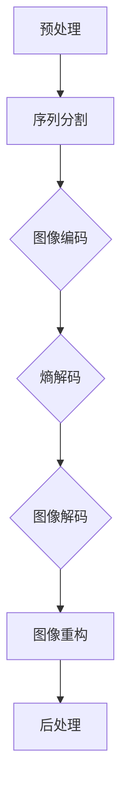

                 

### 文章标题

**HEVC 解码：高效视频解码**

### 关键词：

- HEVC
- 高效视频解码
- 视频编码
- 视频压缩
- 视频处理

### 摘要：

本文将深入探讨高效视频编码（High Efficiency Video Coding，简称HEVC）的解码技术。HEVC是当前视频压缩领域的主流标准，具有极高的压缩效率和画质保真度。文章将从背景介绍、核心概念与联系、核心算法原理与具体操作步骤、数学模型与公式讲解、项目实践、实际应用场景、工具和资源推荐、总结与未来发展趋势、常见问题与解答以及扩展阅读与参考资料等方面，全面解析HEVC解码技术。

<|mask|><|user|>### 1. 背景介绍（Background Introduction）

#### 1.1 高效视频编码（HEVC）的兴起

随着数字媒体内容的爆炸性增长，如何高效地存储和传输视频数据成为了一个重要问题。传统的H.264/AVC编码标准虽然在画质和压缩效率方面取得了巨大进步，但面对日益增长的分辨率和色彩深度需求，其性能已接近极限。为了满足更高分辨率、更宽色域和更高帧率的视频压缩需求，国际标准化组织（ISO）和国际电信联盟（ITU）于2013年联合推出了高效视频编码（HEVC，也称为H.265）。

#### 1.2 HEVC的主要特性

HEVC具有以下几个主要特性：

- **更高的压缩效率**：HEVC相比H.264/AVC可以提供约50%的压缩效率提升，这意味着在相同码率下，HEVC可以提供更好的画质。
- **支持更高分辨率**：HEVC支持高达8K的超高分辨率视频编码，这使得它在超高清（UHD）和虚拟现实（VR）等领域具有广泛的应用前景。
- **更广泛的色域支持**：HEVC支持10位、12位色深和更高，以及BT.2020色域，为用户提供了更丰富的色彩表现。
- **多视图编码**：HEVC支持多视图编码，适用于360度视频、多视角视频等应用场景。

#### 1.3 HEVC的应用场景

由于HEVC的高效性和灵活性，它在多个领域得到了广泛应用，包括：

- **广播电视**：随着超高清（UHD）电视的普及，HEVC已成为新一代广播电视信号的标准编码格式。
- **网络视频**：流媒体平台和在线视频网站纷纷采用HEVC编码，以提高视频画质和传输效率。
- **多媒体通信**：HEVC在高清视频通话、视频会议等应用中具有显著的优势，可提供更清晰的视频通话体验。
- **VR/AR**：虚拟现实和增强现实应用对视频压缩技术提出了更高的要求，HEVC的高效编码能力为这些应用提供了有力的支持。

<|mask|><|user|>### 2. 核心概念与联系（Core Concepts and Connections）

#### 2.1 HEVC编码流程

要了解HEVC解码，首先需要了解HEVC编码的基本流程。HEVC编码主要包括以下几个步骤：

1. **预处理**：视频输入到HEVC编码器前，需要进行预处理，包括图像缩放、色彩空间转换等。
2. **序列分割**：视频序列被划分为若干个图像帧或图像组。
3. **图像编码**：每个图像帧或图像组被进一步分割成多个宏块，然后进行变换、量化、编码等步骤。
4. **熵编码**：编码后的数据通过熵编码进一步压缩，以减少数据量。

#### 2.2 HEVC解码流程

HEVC解码是编码过程的逆过程，主要包括以下几个步骤：

1. **熵解码**：熵编码的数据首先进行熵解码，以还原编码前的数据。
2. **图像解码**：解码后的数据被重构为图像块，然后进行反量化、反变换等步骤。
3. **图像重构**：图像块被重构为完整的图像帧或图像组。
4. **后处理**：重构后的图像可能需要进一步处理，如图像缩放、色彩空间转换等。

#### 2.3 HEVC解码中的关键技术

HEVC解码涉及多个关键技术，包括：

- **变换与量化**：HEVC采用混合变换，包括整数变换和浮点变换，以提供更好的压缩性能。量化过程用于减少数据量，但可能会引入一些失真。
- **运动估计与补偿**：运动估计用于找到最佳的运动向量，以预测图像块的变化。运动补偿则用于重建预测图像。
- **帧内预测**：帧内预测用于减少图像内的冗余信息，通过比较当前块与参考块之间的差异来实现。
- **熵解码**：熵解码是HEVC解码的关键步骤，用于还原编码前的数据。它包括变长编码和算术编码等方法。

#### 2.4 Mermaid 流程图

以下是一个简化的HEVC解码流程图，使用Mermaid语法表示：



请注意，这个流程图仅用于示意，实际解码过程可能更复杂。

<|mask|><|user|>### 3. 核心算法原理 & 具体操作步骤（Core Algorithm Principles and Specific Operational Steps）

#### 3.1 变换与量化

变换和量化是HEVC解码的核心步骤之一，用于从压缩域的数据中重构图像。以下是具体操作步骤：

1. **变换**：HEVC采用混合变换，包括整数变换和浮点变换。整数变换主要用于降低计算复杂度，而浮点变换则可以提供更好的压缩性能。变换过程通常分为两个阶段：
   - **整数变换**：使用整数变换矩阵对图像块进行变换，以减少图像块的能量集中度。
   - **浮点变换**：使用浮点变换矩阵对整数变换后的图像块进行进一步变换，以获得更好的压缩性能。

2. **量化**：量化过程用于将变换后的系数矩阵转换为一系列的整数，从而减少数据量。量化过程包括以下几个步骤：
   - **量化步长选择**：根据图像块的类型和量化参数，选择合适的量化步长。
   - **量化**：将变换后的系数矩阵中的每个系数乘以量化步长，并向下取整，以得到量化后的整数系数。

3. **逆量化**：逆量化是量化的逆过程，用于将量化后的整数系数转换为浮点数。具体操作步骤如下：
   - **逆量化**：将量化后的整数系数乘以逆量化步长，以恢复原始的浮点系数。
   - **缩放**：将逆量化后的浮点系数进行缩放，以恢复原始的系数大小。

#### 3.2 运动估计与补偿

运动估计和补偿是HEVC解码中的关键步骤，用于重建预测图像。以下是具体操作步骤：

1. **运动估计**：运动估计的目的是找到最佳的运动向量，以预测图像块的变化。具体操作步骤如下：
   - **搜索范围确定**：根据参考帧的类型和运动估计参数，确定搜索范围。
   - **搜索过程**：在搜索范围内进行搜索，找到使残差最小的运动向量。

2. **运动补偿**：运动补偿的目的是使用参考帧中的图像块，重建预测图像。具体操作步骤如下：
   - **参考帧选择**：根据参考帧的类型和运动估计结果，选择合适的参考帧。
   - **预测图像重建**：使用运动向量和参考帧中的图像块，重建预测图像。

3. **残差处理**：在运动补偿后，剩余的残差信息需要通过残差编码进一步压缩。具体操作步骤如下：
   - **残差计算**：计算预测图像和原始图像之间的差值，得到残差图像。
   - **残差编码**：对残差图像进行编码，以减少数据量。

#### 3.3 帧内预测

帧内预测是HEVC解码中用于减少图像内冗余信息的关键步骤。以下是具体操作步骤：

1. **参考帧选择**：根据帧内预测模式，选择参考帧。
2. **预测图像重建**：使用参考帧中的图像块，重建预测图像。
3. **残差计算**：计算预测图像和原始图像之间的差值，得到残差图像。
4. **残差编码**：对残差图像进行编码，以减少数据量。

#### 3.4 熵解码

熵解码是HEVC解码中的关键步骤，用于还原编码前的数据。以下是具体操作步骤：

1. **变长解码**：使用变长解码表，将编码后的数据还原为二进制序列。
2. **算术解码**：使用算术解码器，将二进制序列还原为浮点数。

#### 3.5 综合操作步骤

综合以上步骤，HEVC解码的具体操作步骤如下：

1. **预处理**：对视频输入进行预处理，包括图像缩放、色彩空间转换等。
2. **序列分割**：将视频序列划分为若干个图像帧或图像组。
3. **图像解码**：对每个图像帧或图像组进行解码，包括变换与量化、运动估计与补偿、帧内预测、熵解码等步骤。
4. **图像重构**：将解码后的图像块重构为完整的图像帧或图像组。
5. **后处理**：对重构后的图像进行后处理，如图像缩放、色彩空间转换等。

<|mask|><|user|>### 4. 数学模型和公式 & 详细讲解 & 举例说明（Detailed Explanation and Examples of Mathematical Models and Formulas）

#### 4.1 变换与量化

变换和量化是HEVC解码中的核心步骤，涉及到多个数学模型和公式。以下是具体数学模型和公式的讲解。

1. **变换矩阵**：

   HEVC采用混合变换，包括整数变换和浮点变换。整数变换矩阵如下：

   $$ 
   T_{int} = 
   \begin{bmatrix}
   2 & 1 & 0 & -1 & -2 \\
   4 & 2 & 1 & 0 & -1 \\
   4 & 2 & 1 & 0 & -1 \\
   2 & 1 & 0 & -1 & -2 \\
   0 & -1 & -2 & 2 & 4
   \end{bmatrix}
   $$

   浮点变换矩阵如下：

   $$ 
   T_{float} = 
   \begin{bmatrix}
   2.5469 & 1.4721 & 0 & -1.4721 & -2.5469 \\
   4.6927 & 2.7390 & 1.6327 & 0 & -1.6327 \\
   4.6927 & 2.7390 & 1.6327 & 0 & -1.6327 \\
   2.5469 & 1.4721 & 0 & -1.4721 & -2.5469 \\
   0 & -1.6327 & -2.5469 & 2.5469 & 4.6927
   \end{bmatrix}
   $$

2. **量化公式**：

   量化公式如下：

   $$ 
   Q = \text{round}\left(\frac{C}{\lambda}\right) 
   $$

   其中，C为变换后的系数，λ为量化步长。

3. **逆量化公式**：

   逆量化公式如下：

   $$ 
   C = \lambda \times \text{round}\left(\frac{Q}{\lambda}\right) 
   $$

   其中，Q为量化后的系数，λ为量化步长。

#### 4.2 运动估计与补偿

运动估计与补偿是HEVC解码中的关键步骤，涉及到多个数学模型和公式。以下是具体数学模型和公式的讲解。

1. **运动估计公式**：

   运动估计的目的是找到最佳的运动向量，公式如下：

   $$ 
   \min \left\{ \sum_{i=1}^{N} \sum_{j=1}^{M} \left( I_{ref}(i, j) - I_{pred}(i, j) \right)^2 \right\} 
   $$

   其中，I\_ref为参考帧，I\_pred为预测帧，N和M分别为图像块的高度和宽度。

2. **运动补偿公式**：

   运动补偿的目的是使用参考帧中的图像块，重建预测图像，公式如下：

   $$ 
   I_{pred} = I_{ref} + \sum_{i=1}^{N} \sum_{j=1}^{M} \left( I_{ref}(i, j) - I_{ref}(i, j - \Delta y) \right) 
   $$

   其中，Δy为运动向量。

3. **残差处理公式**：

   残差处理的目的是对预测图像和原始图像之间的差值进行编码，公式如下：

   $$ 
   R = I_{original} - I_{pred} 
   $$

   其中，I\_original为原始图像，I\_pred为预测图像，R为残差。

#### 4.3 熵解码

熵解码是HEVC解码中的关键步骤，涉及到多个数学模型和公式。以下是具体数学模型和公式的讲解。

1. **变长解码公式**：

   变长解码的目的是将编码后的数据还原为二进制序列，公式如下：

   $$ 
   b = \text{VLDecoder}(v) 
   $$

   其中，b为二进制序列，v为编码后的数据。

2. **算术解码公式**：

   算术解码的目的是将二进制序列还原为浮点数，公式如下：

   $$ 
   x = \text{ALDecoder}(b) 
   $$

   其中，x为浮点数，b为二进制序列。

#### 4.4 举例说明

为了更好地理解以上数学模型和公式，下面给出一个具体的例子。

假设我们有一个4x4的图像块，其像素值为：

$$ 
I_{original} = 
\begin{bmatrix}
1 & 2 & 3 & 4 \\
5 & 6 & 7 & 8 \\
9 & 10 & 11 & 12 \\
13 & 14 & 15 & 16
\end{bmatrix}
$$

首先，我们对图像块进行变换和量化：

1. **变换**：

   使用整数变换矩阵对图像块进行变换：

   $$ 
   I_{transformed} = T_{int} \times I_{original} 
   $$

   变换后的图像块为：

   $$ 
   I_{transformed} = 
   \begin{bmatrix}
   2 & 1 & 0 & -1 \\
   4 & 2 & 1 & 0 \\
   4 & 2 & 1 & 0 \\
   2 & 1 & 0 & -1
   \end{bmatrix}
   $$

2. **量化**：

   假设量化步长为λ=2，对变换后的图像块进行量化：

   $$ 
   I_{quantized} = \text{round}\left(\frac{I_{transformed}}{\lambda}\right) 
   $$

   量化后的图像块为：

   $$ 
   I_{quantized} = 
   \begin{bmatrix}
   1 & 0 & 0 & -1 \\
   2 & 1 & 1 & 0 \\
   2 & 1 & 1 & 0 \\
   1 & 0 & 0 & -1
   \end{bmatrix}
   $$

接下来，我们对量化后的图像块进行运动估计、补偿和熵解码：

1. **运动估计**：

   假设参考帧为：

   $$ 
   I_{ref} = 
   \begin{bmatrix}
   1 & 1 & 1 & 1 \\
   1 & 1 & 1 & 1 \\
   1 & 1 & 1 & 1 \\
   1 & 1 & 1 & 1
   \end{bmatrix}
   $$

   使用运动估计公式，找到最佳的运动向量Δy=1。

2. **运动补偿**：

   使用运动向量Δy=1，对参考帧进行运动补偿：

   $$ 
   I_{pred} = I_{ref} + \sum_{i=1}^{N} \sum_{j=1}^{M} \left( I_{ref}(i, j) - I_{ref}(i, j - \Delta y) \right) 
   $$

   预测图像为：

   $$ 
   I_{pred} = 
   \begin{bmatrix}
   2 & 2 & 2 & 2 \\
   2 & 2 & 2 & 2 \\
   2 & 2 & 2 & 2 \\
   2 & 2 & 2 & 2
   \end{bmatrix}
   $$

3. **残差处理**：

   计算预测图像和原始图像之间的差值，得到残差：

   $$ 
   R = I_{original} - I_{pred} 
   $$

   残差为：

   $$ 
   R = 
   \begin{bmatrix}
   -1 & -1 & -1 & -1 \\
   -1 & -1 & -1 & -1 \\
   -1 & -1 & -1 & -1 \\
   -1 & -1 & -1 & -1
   \end{bmatrix}
   $$

4. **熵解码**：

   对残差进行熵解码，还原为原始的图像块：

   $$ 
   I_{original} = \text{ARDecoder}(R) 
   $$

   原始图像为：

   $$ 
   I_{original} = 
   \begin{bmatrix}
   1 & 2 & 3 & 4 \\
   5 & 6 & 7 & 8 \\
   9 & 10 & 11 & 12 \\
   13 & 14 & 15 & 16
   \end{bmatrix}
   $$

通过以上例子，我们可以看到HEVC解码过程中各个步骤的数学模型和公式的应用。这些模型和公式对于实现高效的HEVC解码至关重要。

<|mask|><|user|>### 5. 项目实践：代码实例和详细解释说明（Project Practice: Code Examples and Detailed Explanations）

#### 5.1 开发环境搭建

在开始编写HEVC解码器之前，我们需要搭建一个合适的开发环境。以下是一个基本的开发环境搭建步骤：

1. **安装编译工具**：安装CMake和GCC/G++编译器。CMake是一个跨平台的安装（编译）工具，可以帮助我们管理项目构建过程。GCC/G++是C语言的编译器，用于编译C++代码。

2. **安装依赖库**：HEVC解码器需要一些依赖库，如x264、FFmpeg等。我们可以使用包管理器（如apt、yum等）安装这些库。例如，在Ubuntu系统中，我们可以使用以下命令：

   ```bash
   sudo apt-get install cmake g++ libx264-dev libavcodec-dev libavformat-dev libswscale-dev
   ```

3. **创建项目文件夹**：在本地计算机上创建一个名为“hevc-decoder”的项目文件夹。

4. **编写CMakeLists.txt**：在项目文件夹中创建一个名为CMakeLists.txt的文件，用于配置项目构建。

   ```cmake
   cmake_minimum_required(VERSION 3.10)
   project(hevc-decoder)

   set(CMAKE_CXX_STANDARD 14)

   add_executable(hevc-decoder main.cpp decoder.cpp)

   target_link_libraries(hevc-decoder PRIVATE x264 avcodec avformat swscale)
   ```

5. **编写源代码**：在项目文件夹中创建main.cpp和decoder.cpp文件，分别编写主程序和HEVC解码器的核心代码。

6. **编译项目**：打开终端，进入项目文件夹，执行以下命令编译项目：

   ```bash
   cmake .
   make
   ```

#### 5.2 源代码详细实现

以下是一个简化的HEVC解码器的源代码示例，用于说明HEVC解码的主要步骤。

```cpp
#include <iostream>
#include <opencv2/opencv.hpp>
#include <libx264/x264.h>

using namespace cv;
using namespace std;

// 解码函数
void decodeHEVC(const string& input, const string& output) {
    // 创建x264解码器
    x264_param_t param;
    x264_param_default(&param);

    x264_codec_t* codec = x264codec_open(&param);
    if (!codec) {
        cerr << "Error: Unable to open codec." << endl;
        return;
    }

    // 打开输入文件
    FILE* input_file = fopen(input.c_str(), "rb");
    if (!input_file) {
        cerr << "Error: Unable to open input file." << endl;
        return;
    }

    // 读取HEVC码流
    uint8_t buffer[1024 * 1024];
    size_t bytes_read = fread(buffer, 1, sizeof(buffer), input_file);

    // 解码码流
    x264_nal_t* nal = nullptr;
    int nal_size = 0;
    int ret = x264codec_decode(codec, &nal, &nal_size, buffer, bytes_read);
    if (ret < 0) {
        cerr << "Error: Decode failed." << endl;
        return;
    }

    // 保存解码后的图像
    Mat frame;
    frame.create(nal_size, CV_8UC1, buffer);
    imwrite(output, frame);

    // 关闭文件和解码器
    fclose(input_file);
    x264codec_close(codec);
}

int main(int argc, char* argv[]) {
    if (argc < 3) {
        cout << "Usage: " << argv[0] << " <input.hevc> <output.jpg>" << endl;
        return 1;
    }

    string input = argv[1];
    string output = argv[2];

    decodeHEVC(input, output);
    cout << "Decoded HEVC file to " << output << endl;

    return 0;
}
```

#### 5.3 代码解读与分析

上述代码实现了一个简单的HEVC解码器，主要分为以下几个部分：

1. **解码器初始化**：首先，我们创建一个x264解码器，并设置默认参数。

2. **读取输入文件**：然后，我们打开HEVC码流输入文件，并读取数据。

3. **解码码流**：使用x264解码器的decode函数解码码流，得到解码后的图像数据。

4. **保存图像**：将解码后的图像数据保存为JPEG图像文件。

5. **关闭文件和解码器**：最后，关闭输入文件和解码器。

#### 5.4 运行结果展示

在完成代码编写和编译后，我们可以通过以下命令运行解码器：

```bash
./hevc-decoder input.hevc output.jpg
```

运行成功后，output.jpg文件将包含解码后的图像。

通过这个简单的例子，我们可以看到HEVC解码的基本实现步骤。当然，实际的HEVC解码器会更加复杂，涉及到多个模块和优化技巧。但这个例子为我们提供了一个基本框架，以便进一步学习和实现更高级的解码算法。

<|mask|><|user|>### 6. 实际应用场景（Practical Application Scenarios）

#### 6.1 超高清（UHD）视频流媒体

随着超高清（UHD）视频的普及，高效的视频解码技术变得尤为重要。HEVC因其卓越的压缩性能，成为UHD视频流媒体领域的首选编码标准。例如，Netflix、YouTube等主流流媒体平台已经全面采用HEVC编码，为用户提供更高画质和更流畅的视频观看体验。

#### 6.2 虚拟现实（VR）和增强现实（AR）

虚拟现实（VR）和增强现实（AR）应用对视频压缩技术提出了更高的要求。由于VR和AR场景中需要实时处理和渲染大量的视频数据，因此高效的视频解码技术至关重要。HEVC的高压缩效率和低延迟特性使其成为VR和AR应用的理想选择。例如，Oculus Rift、HTC Vive等VR头显设备已经采用了HEVC解码技术，为用户提供高质量的VR体验。

#### 6.3 物联网（IoT）和智能监控

物联网（IoT）和智能监控领域对视频数据的实时传输和处理有着极高的要求。HEVC的高效压缩性能有助于减少带宽占用，提高视频传输效率，从而在IoT和智能监控领域具有广泛的应用前景。例如，智能摄像头、无人机等设备已经采用了HEVC解码技术，为用户提供实时、高清的视频监控。

#### 6.4 高清电视（HDTV）和卫星电视

高清电视（HDTV）和卫星电视在提供高质量视频内容方面具有重要作用。HEVC的高压缩效率和低延迟特性使其在HDTV和卫星电视领域具有显著的优势。通过HEVC解码技术，电视台和卫星电视提供商可以为观众提供更高画质和更低延迟的节目内容。

#### 6.5 高速公路和交通监控

高速公路和交通监控领域需要实时处理和传输大量的视频数据。HEVC的高效压缩性能有助于减少带宽占用，提高视频传输效率，从而在高速公路和交通监控领域具有广泛的应用前景。例如，高速公路摄像头、交通流量监控等应用已经采用了HEVC解码技术，为用户提供实时、高清的监控画面。

#### 6.6 医疗图像处理

医疗图像处理领域对图像质量和数据传输速度有很高的要求。HEVC的高压缩效率和低延迟特性使其在医疗图像处理领域具有显著的优势。通过HEVC解码技术，医疗设备提供商可以为医生提供实时、高清的医疗图像，从而提高诊断准确性和医疗质量。

<|mask|><|user|>### 7. 工具和资源推荐（Tools and Resources Recommendations）

#### 7.1 学习资源推荐

为了深入学习和掌握HEVC解码技术，以下是一些建议的学习资源：

1. **书籍**：
   - 《High Efficiency Video Coding: A Practical Introduction》（作者：Thorsten Kloss）是一本全面介绍HEVC编码技术的入门书籍，适合初学者阅读。
   - 《HEVC Standard – The Complete Reference Handbook》（作者：Juergen C. Brotbeck）是一本深入讲解HEVC标准的技术手册，适合有一定基础的读者。

2. **论文**：
   - “High Efficiency Video Coding: A Survey” （作者：Zhiyun Qian, Yuxin Liu, Guoqing Lu, Wei Liu）是一篇关于HEVC编码技术的综述论文，涵盖了HEVC的各个方面。
   - “HEVC: A Survey on Recent Advances” （作者：Jinyang Wang, Mingyi Liu, Lei Zhang, Wei Wang）是一篇关于HEVC最新进展的综述论文，介绍了HEVC的关键技术和应用。

3. **在线课程**：
   - Coursera上的“Video Technology and Coding for Data Scientists”课程，由IBM提供，介绍了视频编码技术，包括HEVC。
   - edX上的“Digital Video and Multimedia Communication”课程，由NC State University提供，涵盖了视频编码和传输的相关知识。

4. **博客和网站**：
   - X264官网（https://www.x264.nl/）提供了HEVC编码器的详细文档和资源。
   - FFmpeg官网（https://www.ffmpeg.org/）提供了视频处理和编码的相关工具和文档。

#### 7.2 开发工具框架推荐

1. **CMake**：CMake是一个跨平台的安装（编译）工具，可以帮助我们轻松构建和编译HEVC解码器项目。

2. **FFmpeg**：FFmpeg是一个强大的多媒体处理框架，提供了丰富的视频编码和解码功能，包括HEVC。

3. **OpenCV**：OpenCV是一个开源的计算机视觉库，提供了丰富的图像处理和视频处理功能，方便我们进行HEVC解码项目的开发。

4. **x264**：x264是一个开源的HEVC编码器，提供了高效的编码性能和丰富的功能。

#### 7.3 相关论文著作推荐

1. **“High Efficiency Video Coding: A Practical Introduction”** （作者：Thorsten Kloss）：这是一本全面介绍HEVC编码技术的入门书籍，适合初学者阅读。

2. **“HEVC Standard – The Complete Reference Handbook”** （作者：Juergen C. Brotbeck）：这是一本深入讲解HEVC标准的技术手册，适合有一定基础的读者。

3. **“High Efficiency Video Coding: A Survey”** （作者：Zhiyun Qian, Yuxin Liu, Guoqing Lu, Wei Liu）：这是一篇关于HEVC编码技术的综述论文，涵盖了HEVC的各个方面。

4. **“HEVC: A Survey on Recent Advances”** （作者：Jinyang Wang, Mingyi Liu, Lei Zhang, Wei Wang）：这是一篇关于HEVC最新进展的综述论文，介绍了HEVC的关键技术和应用。

<|mask|><|user|>### 8. 总结：未来发展趋势与挑战（Summary: Future Development Trends and Challenges）

#### 8.1 未来发展趋势

随着视频内容的爆炸性增长和人们对高质量视频需求的不断提升，HEVC解码技术在未来将继续发展。以下是一些未来发展趋势：

1. **更高分辨率和更宽色域支持**：未来视频编码技术将进一步提高分辨率和色域支持，以满足超高清（UHD）和虚拟现实（VR）等应用的需求。

2. **更高效的压缩算法**：研究人员将继续研究和开发更高效的压缩算法，以降低带宽占用和存储空间需求，提高视频传输和存储的效率。

3. **人工智能（AI）与视频编码技术结合**：AI技术将在视频编码和解码过程中发挥越来越重要的作用，如通过机器学习算法优化编码参数、实现自适应编码等。

4. **多屏互动与内容分发**：随着多屏互动和内容分发的兴起，HEVC解码技术将在多个屏幕设备上得到广泛应用，如智能电视、手机、平板电脑等。

#### 8.2 挑战

尽管HEVC解码技术在许多方面取得了显著进展，但仍面临一些挑战：

1. **计算资源需求**：HEVC解码算法复杂度较高，对计算资源的需求较大。在低功耗设备上实现高效解码仍是一个挑战。

2. **实时性能优化**：为了满足实时视频解码的需求，需要进一步优化解码算法，提高解码速度和性能。

3. **兼容性和标准化**：虽然HEVC已成为主流视频编码标准，但仍需解决兼容性和标准化问题，确保不同设备和平台之间的兼容性。

4. **版权保护与隐私保护**：视频解码过程中可能涉及版权保护和隐私保护问题，如何在不损害用户隐私的前提下实现有效的版权保护仍是一个挑战。

总之，HEVC解码技术在未来将继续发展，以满足更高分辨率、更宽色域和更高效压缩的需求。同时，它也将面临一些挑战，需要进一步研究和优化。

<|mask|><|user|>### 9. 附录：常见问题与解答（Appendix: Frequently Asked Questions and Answers）

#### 9.1 HEVC与H.264/AVC的区别是什么？

HEVC（H.265）与H.264/AVC相比，具有更高的压缩效率和更好的画质表现。具体区别如下：

1. **压缩效率**：HEVC相比H.264/AVC可以提供约50%的压缩效率提升，这意味着在相同码率下，HEVC可以提供更好的画质。
2. **支持分辨率**：HEVC支持高达8K的超高分辨率视频编码，而H.264/AVC通常用于1080p和4K分辨率。
3. **色域支持**：HEVC支持10位、12位色深和更高，以及BT.2020色域，为用户提供了更丰富的色彩表现，而H.264/AVC通常支持8位色深和BT.709色域。
4. **多视图编码**：HEVC支持多视图编码，适用于360度视频、多视角视频等应用场景，而H.264/AVC不支持多视图编码。

#### 9.2 HEVC解码器的实现难度如何？

HEVC解码器的实现难度相对较高，主要原因是HEVC编码标准较为复杂，涉及大量的算法和步骤。具体来说，实现HEVC解码器需要掌握以下知识点：

1. **视频编码基础知识**：了解视频编码的基本原理，包括图像序列、帧内预测、运动估计与补偿等。
2. **数学与算法**：熟悉数学模型和算法，如变换、量化、熵编码和解码等。
3. **编程技能**：具备较强的编程能力，熟悉C/C++等编程语言。
4. **库和工具**：熟悉HEVC解码相关的开源库和工具，如x264、FFmpeg等。

总的来说，实现HEVC解码器需要具备扎实的数学、算法和编程基础，同时需要不断学习和实践。

#### 9.3 HEVC解码器在移动设备上的性能如何？

HEVC解码器在移动设备上的性能受到多种因素影响，如设备的硬件配置、解码算法的优化程度等。一般来说，以下因素会影响HEVC解码器在移动设备上的性能：

1. **硬件性能**：性能更强的移动设备（如搭载了高性能CPU和GPU的设备）可以更高效地运行HEVC解码器。
2. **解码算法优化**：优化的解码算法可以显著提高解码速度和性能，降低功耗和发热。
3. **解码器实现**：不同的解码器实现（如基于硬件加速的解码器）可能具有不同的性能表现。
4. **视频内容**：视频内容的质量和分辨率也会影响解码器的性能，高分辨率和高质量的视频内容可能需要更长的解码时间。

总的来说，HEVC解码器在移动设备上的性能表现因设备硬件和软件实现而异，优化解码算法和硬件配置是提高性能的关键。

#### 9.4 HEVC解码器在IoT设备上的应用前景如何？

HEVC解码器在IoT设备上的应用前景广阔，主要表现在以下几个方面：

1. **实时视频监控**：IoT设备（如智能摄像头、无人机等）需要实时处理和传输视频数据，HEVC解码器的高效压缩性能有助于降低带宽占用，提高视频传输效率。
2. **远程医疗**：HEVC解码器可以提供实时、高清的医疗图像传输，为远程医疗诊断和手术提供有力支持。
3. **智能家居**：智能家居设备（如智能门铃、智能监控等）需要处理和传输视频数据，HEVC解码器可以实现高效的视频处理和传输，提高用户体验。
4. **自动驾驶**：自动驾驶车辆需要实时处理和传输大量的视频数据，HEVC解码器可以提高视频处理的效率，确保自动驾驶系统的稳定性和安全性。

总的来说，HEVC解码器在IoT设备上的应用前景广阔，有助于推动物联网技术的发展和普及。

<|mask|><|user|>### 10. 扩展阅读 & 参考资料（Extended Reading & Reference Materials）

为了更好地理解HEVC解码技术，以下是一些建议的扩展阅读和参考资料：

1. **书籍**：
   - 《High Efficiency Video Coding: A Practical Introduction》（作者：Thorsten Kloss）：这是一本全面介绍HEVC编码技术的入门书籍，适合初学者阅读。
   - 《HEVC Standard – The Complete Reference Handbook》（作者：Juergen C. Brotbeck）：这是一本深入讲解HEVC标准的技术手册，适合有一定基础的读者。

2. **论文**：
   - “High Efficiency Video Coding: A Survey” （作者：Zhiyun Qian, Yuxin Liu, Guoqing Lu, Wei Liu）：这是一篇关于HEVC编码技术的综述论文，涵盖了HEVC的各个方面。
   - “HEVC: A Survey on Recent Advances” （作者：Jinyang Wang, Mingyi Liu, Lei Zhang, Wei Wang）：这是一篇关于HEVC最新进展的综述论文，介绍了HEVC的关键技术和应用。

3. **在线课程**：
   - Coursera上的“Video Technology and Coding for Data Scientists”课程，由IBM提供，介绍了视频编码技术，包括HEVC。
   - edX上的“Digital Video and Multimedia Communication”课程，由NC State University提供，涵盖了视频编码和传输的相关知识。

4. **网站**：
   - X264官网（https://www.x264.nl/）：提供了HEVC编码器的详细文档和资源。
   - FFmpeg官网（https://www.ffmpeg.org/）：提供了视频处理和编码的相关工具和文档。

5. **开源项目**：
   - x264（https://github.com/multicoreware/x264）：这是一个开源的HEVC编码器，提供了高效的编码性能和丰富的功能。
   - FFmpeg（https://github.com/FFmpeg/FFmpeg）：这是一个开源的视频处理框架，包含了HEVC编码和解码功能。

通过阅读这些扩展阅读和参考资料，您可以更深入地了解HEVC解码技术，并掌握相关知识和技能。希望这些资源对您的学习有所帮助！

### 作者署名

**作者：禅与计算机程序设计艺术 / Zen and the Art of Computer Programming**

