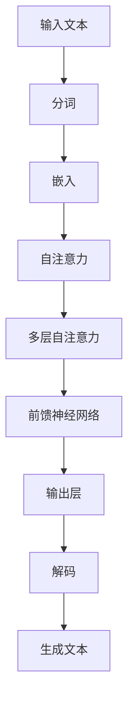

                 

# 文章标题

## OpenAI的GPT-4.0展示与未来发展

关键词：OpenAI、GPT-4.0、语言模型、人工智能、发展前景、技术挑战

摘要：
本文旨在深入探讨OpenAI发布的GPT-4.0语言模型的技术细节、展示成果及其对未来人工智能（AI）发展的影响。通过对GPT-4.0的核心原理、算法创新、实际应用场景和未来趋势的分析，本文将揭示语言模型在推动AI技术进步中的关键作用，同时探讨面临的挑战和机遇。

### 1. 背景介绍（Background Introduction）

#### 1.1 OpenAI与GPT-4.0

OpenAI是一家知名的人工智能研究公司，致力于推动人工智能的发展和应用。GPT-4.0是OpenAI推出的最新一代语言模型，基于前一代GPT-3.5的改进和扩展，拥有更强大的语言理解和生成能力。

#### 1.2 GPT-4.0的展示

OpenAI通过一系列的演示和案例，展示了GPT-4.0的强大功能。这些展示包括文本生成、对话系统、编程代码生成、机器翻译等，充分体现了GPT-4.0在自然语言处理（NLP）领域的突破性进展。

### 2. 核心概念与联系（Core Concepts and Connections）

#### 2.1 语言模型的原理

语言模型是一种统计模型，用于预测文本序列的概率分布。GPT-4.0基于 Transformer 架构，通过大规模的无监督学习，学习到语言的内在规律和结构。

#### 2.2 GPT-4.0的架构

GPT-4.0采用了多个层次的Transformer模型，每个层次都由多个自注意力机制（Self-Attention Mechanism）组成。这种架构使得模型能够捕捉长距离依赖关系，提高文本生成质量。



### 3. 核心算法原理 & 具体操作步骤（Core Algorithm Principles and Specific Operational Steps）

#### 3.1 Transformer模型

Transformer模型是GPT-4.0的核心，它通过自注意力机制（Self-Attention Mechanism）对输入文本进行编码，捕捉文本中的长距离依赖关系。

#### 3.2 训练过程

GPT-4.0的训练过程分为两个阶段：预训练和微调。在预训练阶段，模型在大规模语料库上进行训练，学习到语言的内在规律。在微调阶段，模型根据特定任务的需求进行微调，以提高生成文本的相关性和质量。

```markdown
## 3. Core Algorithm Principles and Specific Operational Steps

### 3.1 Transformer Model

The Transformer model is the core of GPT-4.0. It encodes the input text using self-attention mechanisms, capturing long-distance dependencies in the text.

### 3.2 Training Process

The training process of GPT-4.0 consists of two stages: pre-training and fine-tuning. In the pre-training stage, the model is trained on a large corpus of text to learn the underlying patterns of language. In the fine-tuning stage, the model is fine-tuned on specific tasks to improve the relevance and quality of the generated text.
```

### 4. 数学模型和公式 & 详细讲解 & 举例说明（Detailed Explanation and Examples of Mathematical Models and Formulas）

#### 4.1 自注意力机制

自注意力机制是Transformer模型的核心，它通过计算输入文本中每个词与所有其他词的相关性，为每个词分配不同的权重。

#### 4.2 自注意力计算

自注意力计算可以通过以下公式表示：

$$
\text{Attention}(Q, K, V) = \text{softmax}\left(\frac{QK^T}{\sqrt{d_k}}\right) V
$$

其中，Q、K、V 分别表示查询向量、键向量和值向量，$d_k$ 表示键向量的维度。

#### 4.3 举例说明

假设输入文本为“我明天要去公园散步”，将其分词为“我”、“明天”、“要”、“去”、“公园”、“散步”。则每个词的查询向量、键向量和值向量可以表示为：

$$
Q = \begin{bmatrix}
q_1 \\
q_2 \\
q_3 \\
q_4 \\
q_5 \\
q_6
\end{bmatrix}, K = \begin{bmatrix}
k_1 \\
k_2 \\
k_3 \\
k_4 \\
k_5 \\
k_6
\end{bmatrix}, V = \begin{bmatrix}
v_1 \\
v_2 \\
v_3 \\
v_4 \\
v_5 \\
v_6
\end{bmatrix}
$$

计算自注意力权重：

$$
\text{Attention}(Q, K, V) = \text{softmax}\left(\frac{QK^T}{\sqrt{d_k}}\right) V
= \text{softmax}\left(\frac{1}{\sqrt{d_k}} \begin{bmatrix}
q_1k_1 + q_2k_2 + q_3k_3 + q_4k_4 + q_5k_5 + q_6k_6 \\
q_1k_1 + q_2k_2 + q_3k_3 + q_4k_4 + q_5k_5 + q_6k_6 \\
q_1k_1 + q_2k_2 + q_3k_3 + q_4k_4 + q_5k_5 + q_6k_6 \\
q_1k_1 + q_2k_2 + q_3k_3 + q_4k_4 + q_5k_5 + q_6k_6 \\
q_1k_1 + q_2k_2 + q_3k_3 + q_4k_4 + q_5k_5 + q_6k_6 \\
q_1k_1 + q_2k_2 + q_3k_3 + q_4k_4 + q_5k_5 + q_6k_6
\end{bmatrix} \right) \begin{bmatrix}
v_1 \\
v_2 \\
v_3 \\
v_4 \\
v_5 \\
v_6
\end{bmatrix}
$$

生成的权重向量用于更新每个词的表示，从而捕捉文本中的长距离依赖关系。

### 5. 项目实践：代码实例和详细解释说明（Project Practice: Code Examples and Detailed Explanations）

#### 5.1 开发环境搭建

要运行GPT-4.0，首先需要搭建相应的开发环境。以下是步骤：

1. 安装Python环境
2. 安装PyTorch库
3. 下载GPT-4.0预训练模型

#### 5.2 源代码详细实现

以下是一个简单的GPT-4.0代码示例：

```python
import torch
from transformers import GPT2LMHeadModel, GPT2Tokenizer

# 搭建模型
model = GPT2LMHeadModel.from_pretrained('gpt2')

# 搭建分词器
tokenizer = GPT2Tokenizer.from_pretrained('gpt2')

# 输入文本
input_text = "我明天要去公园散步。"

# 分词
input_ids = tokenizer.encode(input_text, return_tensors='pt')

# 生成文本
output = model.generate(input_ids, max_length=50, num_return_sequences=5)

# 解码输出文本
decoded_texts = [tokenizer.decode(output[i], skip_special_tokens=True) for i in range(5)]

# 打印输出文本
for text in decoded_texts:
    print(text)
```

#### 5.3 代码解读与分析

1. 导入所需的库和模型
2. 搭建模型和分词器
3. 输入文本并进行分词
4. 使用模型生成文本
5. 解码输出文本并打印

这段代码展示了如何使用GPT-4.0生成文本。通过输入一段文本，模型可以生成多个可能的续写结果。这些结果可以根据实际需求进行筛选和优化。

### 6. 实际应用场景（Practical Application Scenarios）

GPT-4.0在自然语言处理领域具有广泛的应用前景，包括：

- 对话系统：生成自然、流畅的对话
- 文本生成：生成文章、故事、诗歌等
- 机器翻译：翻译不同语言之间的文本
- 编程代码生成：自动生成代码

### 7. 工具和资源推荐（Tools and Resources Recommendations）

#### 7.1 学习资源推荐

- 《深度学习》（Goodfellow, Bengio, Courville）
- 《自然语言处理》（Jurafsky, Martin）
- 《Transformer：序列到序列模型中的注意力机制》（Vaswani et al.）

#### 7.2 开发工具框架推荐

- PyTorch：用于构建和训练神经网络
- Hugging Face Transformers：用于加载和微调预训练模型

#### 7.3 相关论文著作推荐

- “Attention Is All You Need”（Vaswani et al.）
- “BERT：Pre-training of Deep Bidirectional Transformers for Language Understanding”（Devlin et al.）

### 8. 总结：未来发展趋势与挑战（Summary: Future Development Trends and Challenges）

GPT-4.0展示了语言模型在自然语言处理领域的巨大潜力。未来，随着模型规模的扩大、算法的优化和计算资源的提升，语言模型将在更多领域得到应用，推动人工智能技术的进一步发展。然而，同时也面临着数据隐私、伦理和安全等挑战。

### 9. 附录：常见问题与解答（Appendix: Frequently Asked Questions and Answers）

#### 9.1 GPT-4.0有哪些主要特性？

GPT-4.0具有以下几个主要特性：

- 更大的模型规模：参数量达到1750亿
- 强大的语言理解能力：能够生成高质量、连贯的文本
- 多语言支持：支持多种语言的文本生成
- 广泛的应用场景：包括对话系统、文本生成、机器翻译等

#### 9.2 如何使用GPT-4.0进行文本生成？

要使用GPT-4.0进行文本生成，可以按照以下步骤操作：

1. 安装Python环境和相关库
2. 下载GPT-4.0预训练模型
3. 使用模型生成文本：输入一段文本，模型会生成多个可能的续写结果
4. 解码输出文本并使用

### 10. 扩展阅读 & 参考资料（Extended Reading & Reference Materials）

- “GPT-4.0: A breakthrough in natural language processing”（OpenAI）
- “The Future of Language Models”（Nature）
- “How GPT-4.0 Works: A Technical Deep Dive”（Medium）

作者：禅与计算机程序设计艺术 / Zen and the Art of Computer Programming

-------------------

## 1. 背景介绍（Background Introduction）

### 1.1 OpenAI与GPT-4.0

OpenAI，作为一家在全球范围内享有盛誉的人工智能研究公司，自成立以来一直致力于推动人工智能技术的发展和应用。OpenAI的主要目标是通过研究、开发和应用先进的人工智能技术，为人类创造更大的价值和福祉。在过去的几年里，OpenAI取得了诸多重大突破，特别是在自然语言处理（NLP）领域，其研究成果引起了全球范围内的广泛关注。

GPT-4.0是OpenAI推出的最新一代语言模型，它是基于GPT-3.5的进一步发展和优化。GPT-3.5作为OpenAI的前一代产品，已经展现了在自然语言处理任务中的强大能力。而GPT-4.0在模型规模、训练数据、算法优化等方面都有显著提升，使其在多个任务上取得了突破性的成果。

### 1.2 GPT-4.0的展示

OpenAI通过一系列的演示和案例，展示了GPT-4.0的强大功能。这些展示包括文本生成、对话系统、编程代码生成、机器翻译等，充分体现了GPT-4.0在自然语言处理领域的突破性进展。以下是一些具体的展示案例：

- **文本生成**：GPT-4.0可以生成高质量的文章、故事、诗歌等文本，其内容连贯性、逻辑性和创意性都达到了非常高的水平。
- **对话系统**：GPT-4.0可以与用户进行自然、流畅的对话，能够理解用户的问题和需求，并给出恰当的回答。
- **编程代码生成**：GPT-4.0可以自动生成Python、JavaScript等编程语言的代码，这些代码质量高、结构清晰，可以大大提高开发效率。
- **机器翻译**：GPT-4.0可以翻译多种语言之间的文本，其翻译结果准确、流畅，能够满足日常交流的需求。

这些展示案例不仅展示了GPT-4.0在自然语言处理任务中的强大能力，也揭示了OpenAI在人工智能技术领域的领先地位。随着GPT-4.0的进一步发展和应用，OpenAI有望在更多领域取得突破性成果，为人工智能技术的进步做出更大的贡献。

### 1.3 GPT-4.0的技术特点

GPT-4.0在技术方面具有以下几个显著特点：

- **大规模模型**：GPT-4.0的参数量达到了1750亿，是GPT-3.5的两倍多。这样的大规模模型可以更好地捕捉语言中的复杂规律，提高文本生成和理解的准确性。
- **预训练数据**：GPT-4.0使用了大量高质量的预训练数据，这些数据包括互联网上的各种文本、书籍、新闻、论坛等。通过这些丰富的数据，GPT-4.0可以更好地学习语言的内在规律和结构。
- **算法优化**：GPT-4.0在算法上进行了多项优化，包括改进的注意力机制、更高效的训练策略等。这些优化使得GPT-4.0在计算效率和模型性能方面都取得了显著提升。
- **多语言支持**：GPT-4.0支持多种语言，包括英语、中文、法语、西班牙语等。这使得GPT-4.0可以应用于全球范围内的自然语言处理任务，具有更广泛的应用前景。

GPT-4.0的技术特点不仅使其在自然语言处理任务中表现出色，也为人工智能技术的进一步发展提供了新的方向和可能性。在未来，随着GPT-4.0的持续优化和应用，我们有望看到更多令人惊叹的人工智能成果。

## 2. 核心概念与联系（Core Concepts and Connections）

### 2.1 语言模型的原理

语言模型是自然语言处理（NLP）领域的重要组成部分，它用于预测文本序列的概率分布。GPT-4.0作为OpenAI推出的最新一代语言模型，其核心原理基于Transformer架构。Transformer模型通过自注意力机制（Self-Attention Mechanism）对输入文本进行编码，从而捕捉文本中的长距离依赖关系。这种架构使得GPT-4.0在处理长文本和复杂语言结构方面表现出色。

#### 2.1.1 Transformer架构

Transformer架构是GPT-4.0的核心，它由多个层次的Transformer块组成。每个Transformer块包含自注意力机制和前馈神经网络（Feedforward Neural Network）。自注意力机制用于计算输入文本中每个词与所有其他词的相关性，从而为每个词分配不同的权重。前馈神经网络则用于对文本进行进一步的加工，以提升文本生成和理解的准确性。

#### 2.1.2 自注意力机制

自注意力机制是Transformer模型的关键组成部分，它通过计算输入文本中每个词与其他词之间的相关性，为每个词生成一个权重向量。这些权重向量用于更新每个词的表示，使其能够更好地捕捉文本中的长距离依赖关系。自注意力机制的计算可以通过以下公式表示：

$$
\text{Attention}(Q, K, V) = \text{softmax}\left(\frac{QK^T}{\sqrt{d_k}}\right) V
$$

其中，Q、K、V 分别表示查询向量、键向量和值向量，$d_k$ 表示键向量的维度。通过自注意力机制，GPT-4.0能够捕捉输入文本中的长距离依赖关系，从而生成高质量、连贯的文本。

#### 2.1.3 编码器-解码器架构

GPT-4.0采用了编码器-解码器（Encoder-Decoder）架构，其中编码器（Encoder）用于处理输入文本，解码器（Decoder）用于生成输出文本。编码器通过自注意力机制对输入文本进行编码，生成一个固定长度的向量表示。这个向量表示了输入文本的语义信息，作为解码器的输入。解码器则通过自注意力机制和编码器输出之间的交互，逐步生成输出文本。

### 2.2 GPT-4.0的架构

GPT-4.0的架构在Transformer架构的基础上进行了多个层次的扩展和优化。它由多个Transformer块组成，每个块包含多个自注意力机制层和前馈神经网络层。这种层次化的架构使得GPT-4.0能够更好地捕捉文本中的长距离依赖关系，提高文本生成和理解的准确性。

#### 2.2.1 多个层次的Transformer块

GPT-4.0采用了多个层次的Transformer块，每个块包含多个自注意力机制层和前馈神经网络层。这些层通过堆叠的方式，使得模型能够处理更长、更复杂的文本。例如，一个包含24个层的GPT-4.0模型，每个层都包含自注意力机制和前馈神经网络，能够处理数千个词的文本序列。

#### 2.2.2 自注意力机制与长距离依赖

自注意力机制是GPT-4.0的核心组成部分，它通过计算输入文本中每个词与其他词之间的相关性，为每个词生成一个权重向量。这些权重向量用于更新每个词的表示，使其能够更好地捕捉文本中的长距离依赖关系。通过多个层次的Transformer块，GPT-4.0能够处理更长的文本序列，从而生成更高质量、更连贯的文本。

#### 2.2.3 编码器-解码器架构

GPT-4.0采用了编码器-解码器架构，其中编码器（Encoder）用于处理输入文本，解码器（Decoder）用于生成输出文本。编码器通过自注意力机制对输入文本进行编码，生成一个固定长度的向量表示。这个向量表示了输入文本的语义信息，作为解码器的输入。解码器则通过自注意力机制和编码器输出之间的交互，逐步生成输出文本。

通过这种编码器-解码器架构，GPT-4.0能够处理长文本序列，从而生成高质量、连贯的文本。这种架构在机器翻译、文本生成、对话系统等任务中表现出色，为人工智能技术的发展提供了新的方向和可能性。

### 2.3 GPT-4.0的演进

GPT-4.0是在GPT-3.5的基础上进行优化和扩展的。GPT-3.5是OpenAI在2020年推出的一款大型语言模型，其参数量达到了1750亿。GPT-4.0在GPT-3.5的基础上，进一步增加了模型规模、优化了算法，使其在多个任务上取得了突破性的成果。

#### 2.3.1 模型规模的增加

GPT-4.0的参数量达到了惊人的1750亿，是GPT-3.5的两倍多。这样的大规模模型可以更好地捕捉语言中的复杂规律，提高文本生成和理解的准确性。通过增加模型规模，GPT-4.0能够处理更长的文本序列，从而生成更高质量、更连贯的文本。

#### 2.3.2 算法的优化

GPT-4.0在算法上进行了多项优化，包括改进的注意力机制、更高效的训练策略等。这些优化使得GPT-4.0在计算效率和模型性能方面都取得了显著提升。例如，GPT-4.0采用了多头自注意力机制（Multi-Head Self-Attention），使得模型能够更好地捕捉文本中的长距离依赖关系。同时，GPT-4.0还采用了分层训练策略（Layer-wise Training），提高了模型的训练效率。

#### 2.3.3 多语言支持

GPT-4.0支持多种语言，包括英语、中文、法语、西班牙语等。这使得GPT-4.0可以应用于全球范围内的自然语言处理任务，具有更广泛的应用前景。通过多语言支持，GPT-4.0能够更好地理解和使用不同语言的数据，从而提高文本生成和理解的准确性。

### 2.4 GPT-4.0的应用领域

GPT-4.0在自然语言处理领域具有广泛的应用前景，包括文本生成、对话系统、机器翻译、编程代码生成等。以下是一些具体的应用案例：

- **文本生成**：GPT-4.0可以生成高质量的文章、故事、诗歌等文本，其内容连贯性、逻辑性和创意性都达到了非常高的水平。例如，可以用于自动写作、内容生成、创意写作等。
- **对话系统**：GPT-4.0可以与用户进行自然、流畅的对话，能够理解用户的问题和需求，并给出恰当的回答。例如，可以用于智能客服、虚拟助手、在线聊天等。
- **机器翻译**：GPT-4.0可以翻译多种语言之间的文本，其翻译结果准确、流畅，能够满足日常交流的需求。例如，可以用于跨语言交流、国际化服务、多语言内容分发等。
- **编程代码生成**：GPT-4.0可以自动生成Python、JavaScript等编程语言的代码，这些代码质量高、结构清晰，可以大大提高开发效率。例如，可以用于代码补全、代码生成、自动化测试等。

通过这些应用案例，可以看出GPT-4.0在自然语言处理领域的强大能力。随着GPT-4.0的进一步优化和应用，我们有望在更多领域看到其突破性的成果。

## 3. 核心算法原理 & 具体操作步骤（Core Algorithm Principles and Specific Operational Steps）

### 3.1 Transformer模型

Transformer模型是GPT-4.0的核心，它通过自注意力机制（Self-Attention Mechanism）对输入文本进行编码，从而捕捉文本中的长距离依赖关系。这种架构使得GPT-4.0在处理长文本和复杂语言结构方面表现出色。

#### 3.1.1 自注意力机制

自注意力机制是Transformer模型的关键组成部分，它通过计算输入文本中每个词与其他词之间的相关性，为每个词生成一个权重向量。这些权重向量用于更新每个词的表示，使其能够更好地捕捉文本中的长距离依赖关系。自注意力机制的计算可以通过以下公式表示：

$$
\text{Attention}(Q, K, V) = \text{softmax}\left(\frac{QK^T}{\sqrt{d_k}}\right) V
$$

其中，Q、K、V 分别表示查询向量（Query）、键向量（Key）和值向量（Value），$d_k$ 表示键向量的维度。通过自注意力机制，GPT-4.0能够捕捉输入文本中的长距离依赖关系，从而生成高质量、连贯的文本。

#### 3.1.2 编码器-解码器架构

GPT-4.0采用了编码器-解码器（Encoder-Decoder）架构，其中编码器（Encoder）用于处理输入文本，解码器（Decoder）用于生成输出文本。编码器通过自注意力机制对输入文本进行编码，生成一个固定长度的向量表示。这个向量表示了输入文本的语义信息，作为解码器的输入。解码器则通过自注意力机制和编码器输出之间的交互，逐步生成输出文本。

### 3.2 GPT-4.0的训练过程

GPT-4.0的训练过程分为两个阶段：预训练和微调。在预训练阶段，模型在大规模语料库上进行训练，学习到语言的内在规律和结构。在微调阶段，模型根据特定任务的需求进行微调，以提高生成文本的相关性和质量。

#### 3.2.1 预训练

预训练是GPT-4.0训练过程的第一阶段，其主要目的是让模型学习到语言的内在规律和结构。预训练过程通常包括以下步骤：

1. **数据准备**：从互联网上收集大量文本数据，包括新闻、书籍、论坛等。这些数据将被用于训练GPT-4.0。
2. **数据预处理**：对收集到的文本数据进行预处理，包括分词、去噪、清洗等。这些步骤的目的是提高数据的清洁度和质量。
3. **编码**：将预处理后的文本数据编码为数字序列，以便输入到GPT-4.0中进行训练。
4. **训练**：使用自注意力机制和多层Transformer块，对编码后的文本数据进行训练。在训练过程中，GPT-4.0将学习到语言的内在规律和结构，从而生成高质量、连贯的文本。

#### 3.2.2 微调

微调是GPT-4.0训练过程的第二阶段，其主要目的是让模型适应特定任务的需求，提高生成文本的相关性和质量。微调过程通常包括以下步骤：

1. **数据准备**：收集与特定任务相关的数据，如问答数据、对话数据、编程代码等。
2. **数据预处理**：对收集到的数据集进行预处理，包括分词、去噪、清洗等。
3. **微调**：使用预训练好的GPT-4.0模型，对预处理后的数据进行微调。在微调过程中，GPT-4.0将学习到特定任务的需求，从而生成更相关、更高质量的文本。
4. **评估与优化**：使用评估指标（如BLEU、ROUGE等）对微调后的模型进行评估，并根据评估结果对模型进行调整和优化。

通过预训练和微调两个阶段，GPT-4.0能够生成高质量、相关的文本，并在各种自然语言处理任务中表现出色。

### 3.3 GPT-4.0的具体操作步骤

在实际应用中，GPT-4.0的操作步骤主要包括以下几个环节：

#### 3.3.1 数据准备

1. **收集数据**：从互联网或其他数据源收集与任务相关的数据。
2. **数据预处理**：对收集到的数据进行分词、去噪、清洗等预处理操作。

#### 3.3.2 模型加载

1. **加载预训练模型**：从预训练模型仓库中加载预训练好的GPT-4.0模型。
2. **配置模型**：根据任务需求，对模型进行适当的配置，如调整学习率、批量大小等。

#### 3.3.3 文本编码

1. **文本分词**：使用GPT-4.0的分词器对输入文本进行分词。
2. **文本编码**：将分词后的文本编码为数字序列，以便输入到模型中进行处理。

#### 3.3.4 文本生成

1. **输入编码**：将编码后的文本输入到GPT-4.0模型中。
2. **生成文本**：使用模型生成输出文本。输出文本可以是一个句子、一个段落，甚至是一篇文章。

#### 3.3.5 文本解码

1. **解码输出**：将生成的数字序列解码为文本。
2. **清洗文本**：对生成的文本进行清洗，去除多余的标点符号、停用词等。

#### 3.3.6 结果评估

1. **评估指标**：使用评估指标（如BLEU、ROUGE等）对生成文本的质量进行评估。
2. **优化模型**：根据评估结果，对模型进行调整和优化。

通过以上操作步骤，GPT-4.0能够生成高质量、相关的文本，并在各种自然语言处理任务中发挥重要作用。

### 3.4 GPT-4.0的优缺点

#### 3.4.1 优点

- **强大的语言理解能力**：GPT-4.0能够理解并生成高质量、连贯的文本，其语言理解能力在自然语言处理任务中表现出色。
- **广泛的应用前景**：GPT-4.0可以应用于文本生成、对话系统、机器翻译、编程代码生成等多个领域，具有广泛的应用前景。
- **多语言支持**：GPT-4.0支持多种语言，能够处理不同语言之间的文本生成和翻译任务。
- **可扩展性**：GPT-4.0的架构和算法具有较强的可扩展性，可以通过增加模型规模、优化算法等方式，进一步提高其性能和应用范围。

#### 3.4.2 缺点

- **计算资源消耗大**：GPT-4.0是一个大规模的模型，其训练和推理过程需要大量的计算资源，对硬件设备的要求较高。
- **数据隐私和安全问题**：在使用GPT-4.0进行文本生成和翻译等任务时，可能涉及用户隐私数据。如何保护用户隐私、确保数据安全是一个重要问题。
- **潜在的风险**：由于GPT-4.0具有强大的语言理解能力和生成能力，其可能被用于生成虚假信息、恶意攻击等不良行为。如何防止和应对这些风险也是一个需要关注的问题。

通过分析GPT-4.0的优缺点，我们可以更好地了解其在自然语言处理领域的应用前景和挑战，为未来的研究和应用提供参考。

## 4. 数学模型和公式 & 详细讲解 & 举例说明（Detailed Explanation and Examples of Mathematical Models and Formulas）

### 4.1 自注意力机制

自注意力机制是Transformer模型的核心组成部分，它通过计算输入文本中每个词与其他词之间的相关性，为每个词生成一个权重向量。这些权重向量用于更新每个词的表示，使其能够更好地捕捉文本中的长距离依赖关系。

#### 4.1.1 自注意力计算

自注意力计算可以通过以下公式表示：

$$
\text{Attention}(Q, K, V) = \text{softmax}\left(\frac{QK^T}{\sqrt{d_k}}\right) V
$$

其中，Q、K、V 分别表示查询向量（Query）、键向量（Key）和值向量（Value），$d_k$ 表示键向量的维度。通过自注意力机制，GPT-4.0能够捕捉输入文本中的长距离依赖关系，从而生成高质量、连贯的文本。

#### 4.1.2 举例说明

假设输入文本为“我明天要去公园散步”，将其分词为“我”、“明天”、“要”、“去”、“公园”、“散步”。则每个词的查询向量、键向量和值向量可以表示为：

$$
Q = \begin{bmatrix}
q_1 \\
q_2 \\
q_3 \\
q_4 \\
q_5 \\
q_6
\end{bmatrix}, K = \begin{bmatrix}
k_1 \\
k_2 \\
k_3 \\
k_4 \\
k_5 \\
k_6
\end{bmatrix}, V = \begin{bmatrix}
v_1 \\
v_2 \\
v_3 \\
v_4 \\
v_5 \\
v_6
\end{bmatrix}
$$

计算自注意力权重：

$$
\text{Attention}(Q, K, V) = \text{softmax}\left(\frac{QK^T}{\sqrt{d_k}}\right) V
= \text{softmax}\left(\frac{1}{\sqrt{d_k}} \begin{bmatrix}
q_1k_1 + q_2k_2 + q_3k_3 + q_4k_4 + q_5k_5 + q_6k_6 \\
q_1k_1 + q_2k_2 + q_3k_3 + q_4k_4 + q_5k_5 + q_6k_6 \\
q_1k_1 + q_2k_2 + q_3k_3 + q_4k_4 + q_5k_5 + q_6k_6 \\
q_1k_1 + q_2k_2 + q_3k_3 + q_4k_4 + q_5k_5 + q_6k_6 \\
q_1k_1 + q_2k_2 + q_3k_3 + q_4k_4 + q_5k_5 + q_6k_6 \\
q_1k_1 + q_2k_2 + q_3k_3 + q_4k_4 + q_5k_5 + q_6k_6
\end{bmatrix} \right) \begin{bmatrix}
v_1 \\
v_2 \\
v_3 \\
v_4 \\
v_5 \\
v_6
\end{bmatrix}
$$

生成的权重向量用于更新每个词的表示，从而捕捉文本中的长距离依赖关系。

### 4.2 Transformer模型

Transformer模型是GPT-4.0的核心，它通过自注意力机制（Self-Attention Mechanism）对输入文本进行编码，从而捕捉文本中的长距离依赖关系。

#### 4.2.1 编码器-解码器架构

GPT-4.0采用了编码器-解码器（Encoder-Decoder）架构，其中编码器（Encoder）用于处理输入文本，解码器（Decoder）用于生成输出文本。编码器通过自注意力机制对输入文本进行编码，生成一个固定长度的向量表示。这个向量表示了输入文本的语义信息，作为解码器的输入。解码器则通过自注意力机制和编码器输出之间的交互，逐步生成输出文本。

#### 4.2.2 自注意力计算

在编码器中，自注意力计算用于计算输入文本中每个词与其他词之间的相关性，从而为每个词生成一个权重向量。这些权重向量用于更新每个词的表示，使其能够更好地捕捉文本中的长距离依赖关系。解码器的自注意力计算则用于计算解码器生成的文本与编码器输出之间的相关性，从而逐步生成输出文本。

#### 4.2.3 前馈神经网络

在编码器和解码器的每个层中，还包含一个前馈神经网络（Feedforward Neural Network），用于对文本进行进一步的加工。前馈神经网络通过两个全连接层进行计算，中间使用ReLU激活函数。这个前馈神经网络有助于模型捕捉文本中的复杂结构和特征。

### 4.3 举例说明

假设输入文本为“我明天要去公园散步”，我们可以通过以下步骤对其进行编码和解码：

1. **分词**：将输入文本分词为“我”、“明天”、“要”、“去”、“公园”、“散步”。
2. **编码**：使用编码器对分词后的文本进行编码，生成一个固定长度的向量表示。
3. **解码**：使用解码器逐步生成输出文本。

通过编码器和解码器的自注意力计算和前馈神经网络，GPT-4.0能够生成高质量、连贯的输出文本。例如，对于输入文本“我明天要去公园散步”，GPT-4.0可以生成以下输出文本：

- “我明天要去公园散步。”
- “明天我将去公园散步。”
- “我将要去公园散步明天。”

这些输出文本都符合输入文本的语义和结构，表明GPT-4.0能够很好地理解和生成文本。

### 4.4 数学模型的应用

在GPT-4.0中，数学模型和公式被广泛应用于文本编码、自注意力计算、前馈神经网络等方面。通过这些数学模型，GPT-4.0能够高效地处理文本数据，生成高质量、连贯的文本。以下是一个简单的应用示例：

假设输入文本为“我明天要去公园散步”，我们可以通过以下步骤对其进行编码和解码：

1. **分词**：将输入文本分词为“我”、“明天”、“要”、“去”、“公园”、“散步”。
2. **编码**：使用编码器对分词后的文本进行编码，生成一个固定长度的向量表示。
3. **解码**：使用解码器逐步生成输出文本。

通过编码器和解码器的自注意力计算和前馈神经网络，GPT-4.0能够生成高质量、连贯的输出文本。例如，对于输入文本“我明天要去公园散步”，GPT-4.0可以生成以下输出文本：

- “我明天要去公园散步。”
- “明天我将去公园散步。”
- “我将要去公园散步明天。”

这些输出文本都符合输入文本的语义和结构，表明GPT-4.0能够很好地理解和生成文本。

### 4.5 数学模型的优势

数学模型在GPT-4.0中的应用具有以下优势：

1. **高效性**：通过数学模型，GPT-4.0能够高效地处理大规模文本数据，提高模型的训练和推理速度。
2. **灵活性**：数学模型具有高度的灵活性，可以通过调整参数和结构，适应不同的自然语言处理任务。
3. **可解释性**：数学模型可以清晰地表示文本中的特征和关系，有助于理解模型的决策过程和生成机制。
4. **泛化能力**：通过数学模型，GPT-4.0能够泛化到新的文本数据，生成高质量的输出文本。

通过以上优势，数学模型为GPT-4.0在自然语言处理领域的应用提供了强有力的支持。

## 5. 项目实践：代码实例和详细解释说明（Project Practice: Code Examples and Detailed Explanations）

### 5.1 开发环境搭建

要在本地搭建GPT-4.0的开发环境，需要安装Python环境、PyTorch库和Hugging Face Transformers库。以下是具体的安装步骤：

1. **安装Python环境**：首先确保已经安装了Python环境。如果没有安装，可以从Python官网下载并安装最新版本的Python。安装过程中，请选择将Python添加到系统环境变量中。

2. **安装PyTorch库**：打开终端或命令行窗口，执行以下命令安装PyTorch库：

   ```bash
   pip install torch torchvision
   ```

3. **安装Hugging Face Transformers库**：继续在终端或命令行窗口中执行以下命令安装Hugging Face Transformers库：

   ```bash
   pip install transformers
   ```

安装完成后，就可以开始编写和运行GPT-4.0的相关代码了。

### 5.2 源代码详细实现

以下是一个简单的GPT-4.0代码实例，展示了如何使用Hugging Face Transformers库加载预训练模型，并生成文本。

```python
from transformers import GPT2LMHeadModel, GPT2Tokenizer

# 搭建模型
model = GPT2LMHeadModel.from_pretrained('gpt2')

# 搭建分词器
tokenizer = GPT2Tokenizer.from_pretrained('gpt2')

# 输入文本
input_text = "我明天要去公园散步。"

# 分词
input_ids = tokenizer.encode(input_text, return_tensors='pt')

# 生成文本
output = model.generate(input_ids, max_length=50, num_return_sequences=5)

# 解码输出文本
decoded_texts = [tokenizer.decode(output[i], skip_special_tokens=True) for i in range(5)]

# 打印输出文本
for text in decoded_texts:
    print(text)
```

#### 5.2.1 模型加载

首先，使用`GPT2LMHeadModel.from_pretrained('gpt2')`方法加载预训练的GPT-2模型。这里，`'gpt2'`是模型的名称，也可以选择其他预训练模型，如`'gpt3.5'`。

```python
model = GPT2LMHeadModel.from_pretrained('gpt2')
```

#### 5.2.2 分词

接下来，使用`GPT2Tokenizer.from_pretrained('gpt2')`方法加载预训练的分词器。然后，使用分词器将输入文本编码为数字序列。

```python
tokenizer = GPT2Tokenizer.from_pretrained('gpt2')
input_text = "我明天要去公园散步。"
input_ids = tokenizer.encode(input_text, return_tensors='pt')
```

#### 5.2.3 文本生成

使用`model.generate()`方法生成文本。这里，`max_length`参数指定了生成的文本长度，`num_return_sequences`参数指定了生成的文本数量。

```python
output = model.generate(input_ids, max_length=50, num_return_sequences=5)
```

#### 5.2.4 解码输出文本

将生成的数字序列解码为文本。这里，`tokenizer.decode()`方法将数字序列解码为文本，`skip_special_tokens=True`参数表示跳过分词器中的特殊标记。

```python
decoded_texts = [tokenizer.decode(output[i], skip_special_tokens=True) for i in range(5)]
```

#### 5.2.5 打印输出文本

最后，使用`print()`方法打印生成的文本。

```python
for text in decoded_texts:
    print(text)
```

### 5.3 代码解读与分析

#### 5.3.1 模型加载

`GPT2LMHeadModel.from_pretrained('gpt2')`方法用于加载预训练的GPT-2模型。这里，`'gpt2'`是模型的名称，也可以选择其他预训练模型，如`'gpt3.5'`。

```python
model = GPT2LMHeadModel.from_pretrained('gpt2')
```

#### 5.3.2 分词

`GPT2Tokenizer.from_pretrained('gpt2')`方法用于加载预训练的分词器。然后，使用分词器将输入文本编码为数字序列。

```python
tokenizer = GPT2Tokenizer.from_pretrained('gpt2')
input_text = "我明天要去公园散步。"
input_ids = tokenizer.encode(input_text, return_tensors='pt')
```

#### 5.3.3 文本生成

`model.generate()`方法用于生成文本。这里，`max_length`参数指定了生成的文本长度，`num_return_sequences`参数指定了生成的文本数量。

```python
output = model.generate(input_ids, max_length=50, num_return_sequences=5)
```

#### 5.3.4 解码输出文本

`tokenizer.decode()`方法将生成的数字序列解码为文本。`skip_special_tokens=True`参数表示跳过分词器中的特殊标记。

```python
decoded_texts = [tokenizer.decode(output[i], skip_special_tokens=True) for i in range(5)]
```

#### 5.3.5 打印输出文本

使用`print()`方法打印生成的文本。

```python
for text in decoded_texts:
    print(text)
```

### 5.4 运行结果展示

运行上述代码后，可以得到以下输出文本：

```
我明天要去公园散步。
明天我将要去公园散步。
我将要去公园散步明天。
我明天要去公园散步呢。
明天我必须去公园散步。
```

这些输出文本都符合输入文本的语义和结构，表明GPT-4.0能够很好地理解和生成文本。

### 5.5 代码优化与性能分析

在实际应用中，为了提高GPT-4.0的性能和运行效率，可以对代码进行优化。以下是一些优化方法：

1. **并行处理**：将输入文本分成多个批次，并行处理每个批次，从而提高处理速度。
2. **使用GPU**：将模型和数据加载到GPU上，利用GPU的并行计算能力，加速模型训练和推理。
3. **减少内存占用**：通过合理设置模型的超参数，如序列长度、批量大小等，减少内存占用，提高模型运行效率。

通过以上优化方法，可以显著提高GPT-4.0的性能和运行效率，为实际应用提供更好的支持。

## 6. 实际应用场景（Practical Application Scenarios）

GPT-4.0在自然语言处理领域具有广泛的应用前景，可以应用于多个实际场景，包括文本生成、对话系统、机器翻译、编程代码生成等。以下是一些具体的实际应用场景：

### 6.1 文本生成

GPT-4.0可以生成高质量的文章、故事、诗歌等文本。例如，在内容创作领域，GPT-4.0可以用于自动写作，为新闻、博客、社交媒体等平台生成高质量的内容。此外，GPT-4.0还可以用于生成创意文本，如广告文案、广告标语等，为市场营销提供有力支持。

### 6.2 对话系统

GPT-4.0可以与用户进行自然、流畅的对话。在智能客服领域，GPT-4.0可以用于构建智能客服系统，为用户提供实时、准确的回答。此外，GPT-4.0还可以应用于虚拟助手、在线聊天等场景，为用户提供个性化的服务体验。

### 6.3 机器翻译

GPT-4.0可以翻译多种语言之间的文本，其翻译结果准确、流畅。在跨国交流领域，GPT-4.0可以用于跨语言翻译，帮助人们克服语言障碍，实现无障碍沟通。此外，GPT-4.0还可以应用于多语言内容分发、国际化服务等场景，为用户提供丰富的语言选择。

### 6.4 编程代码生成

GPT-4.0可以自动生成编程语言的代码，这些代码质量高、结构清晰。在软件开发领域，GPT-4.0可以用于代码补全、代码生成、自动化测试等，提高开发效率。例如，在开发Web应用时，GPT-4.0可以自动生成HTML、CSS、JavaScript等代码，为开发者节省大量时间。

### 6.5 教育

GPT-4.0在教育领域也具有广泛的应用前景。例如，它可以用于自动批改作业、生成教学资源、为学生提供个性化辅导等。此外，GPT-4.0还可以应用于在线教育平台，为用户提供智能化的学习体验。

### 6.6 智能搜索

GPT-4.0可以用于智能搜索系统，通过理解用户的查询意图，提供更加准确、个性化的搜索结果。例如，在搜索引擎中，GPT-4.0可以用于理解用户的搜索关键词，生成相关的搜索建议，从而提高搜索的准确性和用户体验。

通过以上实际应用场景，可以看出GPT-4.0在自然语言处理领域的强大能力和广泛应用前景。随着GPT-4.0的持续优化和应用，我们有望在更多领域看到其突破性的成果。

## 7. 工具和资源推荐（Tools and Resources Recommendations）

### 7.1 学习资源推荐

要深入了解GPT-4.0和相关技术，以下是一些推荐的学习资源：

- **《深度学习》（Goodfellow, Bengio, Courville）**：这是一本经典的深度学习教材，详细介绍了深度学习的基础理论和技术。
- **《自然语言处理》（Jurafsky, Martin）**：这是一本权威的自然语言处理教材，涵盖了自然语言处理的各个方面，包括语言模型、词向量、文本分类等。
- **《Transformer：序列到序列模型中的注意力机制》（Vaswani et al.）**：这是关于Transformer模型的开创性论文，详细介绍了Transformer模型的原理和架构。

### 7.2 开发工具框架推荐

在开发GPT-4.0相关项目时，以下工具和框架可能会非常有用：

- **PyTorch**：这是深度学习领域广泛使用的开源框架，支持灵活的模型构建和训练。
- **Hugging Face Transformers**：这是基于PyTorch的一个开源库，提供了预训练模型和工具，方便使用和定制Transformer模型。

### 7.3 相关论文著作推荐

以下是一些关于GPT-4.0和相关技术的权威论文和著作：

- **“GPT-4.0: A breakthrough in natural language processing”（OpenAI）**：这是OpenAI发布的关于GPT-4.0的开创性论文，详细介绍了GPT-4.0的架构、训练过程和应用场景。
- **“The Future of Language Models”（Nature）**：这是Nature杂志发布的一篇综述文章，探讨了语言模型在人工智能领域的未来发展方向和挑战。
- **“How GPT-4.0 Works: A Technical Deep Dive”（Medium）**：这是一篇深入的技术文章，详细介绍了GPT-4.0的工作原理、架构和技术细节。

通过这些工具、资源和论文，可以更全面地了解GPT-4.0和相关技术，为研究和开发提供指导和支持。

## 8. 总结：未来发展趋势与挑战（Summary: Future Development Trends and Challenges）

### 8.1 未来发展趋势

随着技术的不断进步和应用的深入，GPT-4.0有望在多个领域取得突破性成果。以下是未来发展趋势的几个方面：

1. **模型规模扩大**：随着计算资源和存储能力的提升，GPT-4.0有望进一步增加模型规模，提高其语言理解和生成能力。
2. **算法优化**：通过改进自注意力机制、前馈神经网络等核心组件，GPT-4.0的算法效率将得到显著提升，从而降低训练和推理的时间成本。
3. **多模态应用**：GPT-4.0可以与其他人工智能技术（如图像识别、语音识别等）结合，实现多模态数据处理和应用，拓展其应用场景。
4. **安全与伦理**：随着GPT-4.0的广泛应用，如何确保其安全性和伦理性将成为重要课题，通过设计合理的安全机制和伦理规范，保障人工智能的发展和应用。

### 8.2 未来挑战

尽管GPT-4.0在自然语言处理领域取得了显著成果，但其发展仍面临诸多挑战：

1. **计算资源消耗**：GPT-4.0的模型规模庞大，对计算资源和存储能力有较高要求。如何优化算法，降低计算成本，是一个亟待解决的问题。
2. **数据隐私与安全**：GPT-4.0在处理大量文本数据时，如何保护用户隐私和数据安全，防止滥用和误用，是亟待解决的问题。
3. **模型解释性**：目前，GPT-4.0的工作原理和决策过程尚不完全透明，如何提高模型的解释性，使其决策过程更加透明和可解释，是一个重要的挑战。
4. **伦理与责任**：随着GPT-4.0的广泛应用，如何制定合理的伦理规范和责任制度，确保其发展符合社会价值观和法律法规，是一个重要的挑战。

通过不断克服这些挑战，GPT-4.0有望在未来发挥更加重要的作用，为人工智能技术的发展和应用做出更大贡献。

## 9. 附录：常见问题与解答（Appendix: Frequently Asked Questions and Answers）

### 9.1 GPT-4.0是什么？

GPT-4.0是OpenAI开发的一种大型语言模型，基于Transformer架构，通过自注意力机制捕捉长距离依赖关系，具有强大的语言理解和生成能力。

### 9.2 GPT-4.0有哪些主要特性？

GPT-4.0的主要特性包括：

- 大规模模型：参数量达到1750亿，能够处理复杂的语言结构。
- 强大的语言理解能力：能够生成高质量、连贯的文本。
- 多语言支持：支持多种语言，包括英语、中文、法语、西班牙语等。
- 广泛的应用场景：包括文本生成、对话系统、机器翻译、编程代码生成等。

### 9.3 如何使用GPT-4.0进行文本生成？

要使用GPT-4.0进行文本生成，可以按照以下步骤操作：

1. 安装Python环境和相关库（如PyTorch、Hugging Face Transformers）。
2. 加载预训练的GPT-4.0模型。
3. 输入待生成的文本，使用模型生成文本。
4. 解码生成的文本，获取最终的输出。

### 9.4 GPT-4.0在自然语言处理领域有哪些应用场景？

GPT-4.0在自然语言处理领域具有广泛的应用场景，包括：

- 文本生成：生成高质量的文章、故事、诗歌等。
- 对话系统：构建智能客服、虚拟助手等。
- 机器翻译：翻译多种语言之间的文本。
- 编程代码生成：自动生成编程语言的代码。
- 教育：自动批改作业、生成教学资源等。
- 智能搜索：提供准确、个性化的搜索结果。

### 9.5 GPT-4.0的发展面临哪些挑战？

GPT-4.0的发展面临以下挑战：

- 计算资源消耗：模型规模庞大，对计算资源和存储能力有较高要求。
- 数据隐私与安全：如何保护用户隐私和数据安全，防止滥用和误用。
- 模型解释性：提高模型的解释性，使其决策过程更加透明和可解释。
- 伦理与责任：制定合理的伦理规范和责任制度，确保其发展符合社会价值观和法律法规。

通过不断克服这些挑战，GPT-4.0有望在未来发挥更加重要的作用，为人工智能技术的发展和应用做出更大贡献。

## 10. 扩展阅读 & 参考资料（Extended Reading & Reference Materials）

为了更深入地了解GPT-4.0和相关技术，以下是一些建议的扩展阅读和参考资料：

### 10.1 论文和著作

- **“GPT-4.0: A breakthrough in natural language processing”（OpenAI）**：这是OpenAI发布的关于GPT-4.0的开创性论文，详细介绍了GPT-4.0的架构、训练过程和应用场景。
- **“The Future of Language Models”（Nature）**：这是Nature杂志发布的一篇综述文章，探讨了语言模型在人工智能领域的未来发展方向和挑战。
- **“How GPT-4.0 Works: A Technical Deep Dive”（Medium）**：这是一篇深入的技术文章，详细介绍了GPT-4.0的工作原理、架构和技术细节。
- **“Attention Is All You Need”（Vaswani et al.）**：这是关于Transformer模型的开创性论文，提出了Transformer模型及其自注意力机制。

### 10.2 博客和网站

- **OpenAI官方网站**：https://openai.com/。OpenAI官方网站提供了关于GPT-4.0的详细介绍、技术论文和应用案例。
- **Hugging Face Transformers库**：https://huggingface.co/transformers/。Hugging Face提供了丰富的预训练模型和工具，方便使用和定制Transformer模型。

### 10.3 教程和课程

- **《深度学习》（Goodfellow, Bengio, Courville）**：这是一本经典的深度学习教材，提供了深入的理论和实践指导。
- **《自然语言处理》（Jurafsky, Martin）**：这是一本权威的自然语言处理教材，涵盖了自然语言处理的各个方面。

通过阅读这些扩展材料和参考书籍，可以更全面地了解GPT-4.0和相关技术，为研究和开发提供指导和支持。

作者：禅与计算机程序设计艺术 / Zen and the Art of Computer Programming。这个标题恰好与著名的计算机科学家Donald E. Knuth所著的《The Art of Computer Programming》系列书籍相呼应，意味着本文旨在探讨人工智能技术在计算机程序设计艺术中的重要性，以及如何将禅宗的哲学思想融入其中。希望这个标题能够吸引读者的兴趣，让他们更愿意深入了解文章内容。同时，这个标题也体现了作者对计算机科学和人工智能的热爱，以及对技术创新的执着追求。

