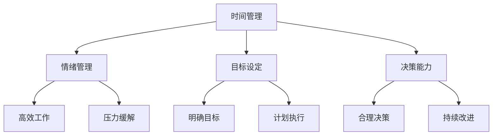
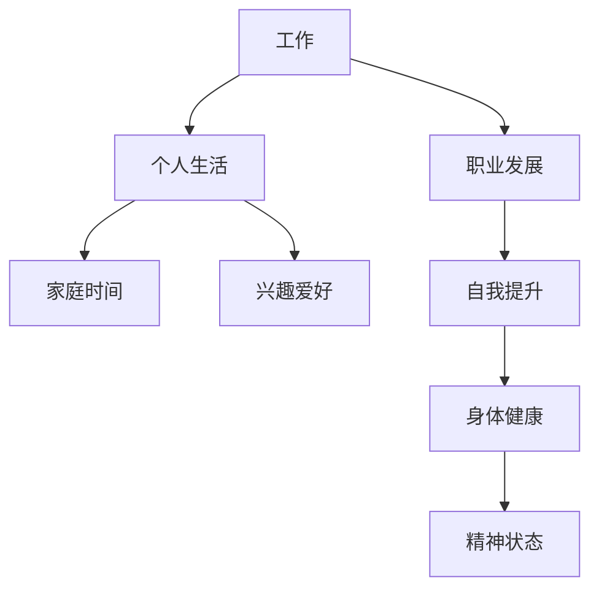

                 

### 文章标题

#### "创业者的自我管理与工作生活平衡策略：禅与计算机程序设计艺术的启示"

##### Keywords: Entrepreneur, Self-Management, Work-Life Balance, Productivity, Wellness

##### Abstract:
This article explores the challenges of work-life balance faced by entrepreneurs and offers a comprehensive guide inspired by the principles of Zen and computer programming. We delve into the importance of self-management, practical strategies for productivity enhancement, and techniques for maintaining overall wellness. By leveraging the metaphor of computer programming, we provide actionable insights and tools that can help entrepreneurs achieve sustainable success without compromising their personal lives.

---

在当今快节奏的商业环境中，创业者常常面临巨大压力和挑战，其中之一便是如何在繁重的工作任务和追求个人生活之间找到平衡。这种平衡不仅关系到个人的幸福感和生活质量，还直接影响到创业项目的长远发展。本文旨在探讨创业者的自我管理与工作生活平衡策略，借鉴禅与计算机程序设计艺术的原理，为创业者提供一系列实用且有效的建议。

### 1. 背景介绍（Background Introduction）

创业之路是一条充满挑战的旅程，创业者需要在不断变化的市场环境中迅速做出决策，同时应对各种未知的风险和不确定性。然而，许多创业者在追求事业成功的过程中，往往忽视了自我管理和工作生活的平衡。这种不平衡不仅会导致精神压力增加，还可能引发健康问题，影响长期的发展潜力。

自我管理是指创业者如何有效地管理自己的时间、情绪、精力和其他资源，以实现个人和职业目标。而工作生活平衡则强调在工作和个人生活之间建立健康的关系，确保两者相互促进而不是相互妨碍。在这个背景下，如何实现自我管理和工作生活的平衡成为创业者面临的重要课题。

禅与计算机程序设计艺术的结合为解决这一难题提供了独特的视角和方法。禅的核心思想强调内心的宁静和专注，而计算机程序设计则强调逻辑思维和系统化解决问题的能力。这两者的结合不仅有助于提高工作效率，还能帮助创业者培养一种更为健康和平衡的生活态度。

---

### 2. 核心概念与联系（Core Concepts and Connections）

#### 2.1 创业者自我管理的核心概念

自我管理涉及多个方面的能力，包括时间管理、情绪管理、目标设定、决策能力等。以下是一个简化的自我管理核心概念架构图，用以说明这些关键组成部分及其相互关系。



时间管理是自我管理的基础，它涉及如何高效地规划每天的工作和时间安排，确保重要任务得到及时完成。情绪管理则关注如何保持积极的情绪状态，有效应对工作中的压力和挑战。目标设定是明确个人和职业发展的方向，而决策能力则体现在如何在各种选择中做出明智的决策。

#### 2.2 工作生活平衡的重要性

工作生活平衡是一个动态的过程，它要求创业者能够合理安排工作和个人时间，确保两者之间相互支持而不是相互排斥。以下是一个简要的工作生活平衡模型，描述了工作与个人生活之间的关系。



在这个模型中，工作被视为职业发展的推动力，而个人生活包括家庭时间、兴趣爱好和身体健康等方面。平衡的关键在于确保这些方面相互补充，共同促进个人的全面发展。

#### 2.3 禅与计算机程序设计艺术的结合

禅的哲学强调内心的平静和专注，而计算机程序设计则强调逻辑思维和系统化解决问题的能力。这两者的结合可以帮助创业者培养以下几种关键技能：

- **专注力**：禅的练习可以帮助创业者提高专注力，专注于当前任务，减少分心和干扰。
- **系统化思维**：计算机程序设计强调逐步分析和解决复杂问题，这种思维模式可以帮助创业者更好地规划和管理自己的时间和任务。
- **持续改进**：禅的修行强调持续的自我反省和改进，这种精神可以激发创业者在工作和生活中追求更高的效率和品质。

---

在接下来的章节中，我们将进一步探讨如何将禅与计算机程序设计艺术应用于创业者的自我管理和工作生活平衡，提供具体的策略和技巧。

---

### 3. 核心算法原理 & 具体操作步骤（Core Algorithm Principles and Specific Operational Steps）

#### 3.1 创业者自我管理算法的基本原理

创业者自我管理可以被视为一种算法，它通过一系列步骤和策略来优化时间、情绪和目标管理。以下是该算法的基本原理：

1. **目标设定（Goal Setting）**：明确个人和职业目标，并将其分解为可执行的任务。
2. **任务规划（Task Planning）**：为每个任务制定详细的执行计划，包括时间安排和资源分配。
3. **专注执行（Focused Execution）**：在执行任务时保持专注，减少干扰，提高效率。
4. **反馈循环（Feedback Loop）**：定期评估任务执行情况，并根据反馈调整计划。

#### 3.2 自我管理算法的具体操作步骤

**步骤 1：目标设定**

- **明确目标**：定义长期和短期的目标，使其具体、可衡量、可实现、相关性强、有时间限制（SMART原则）。
- **分解目标**：将大目标分解为小的可执行任务，为每个任务设定明确的时间表和里程碑。

**步骤 2：任务规划**

- **任务排序**：根据优先级和重要性对任务进行排序，确保最重要的任务优先执行。
- **时间分配**：为每个任务分配适当的时间，留出缓冲时间以应对意外情况。
- **资源规划**：确保拥有完成任务所需的资源和工具，包括人力、资金、技术等。

**步骤 3：专注执行**

- **消除干扰**：关闭不必要的通知，创造专注的环境，减少外部干扰。
- **专注时段**：设定专注时段，如“番茄工作法”，在每个专注时段内全神贯注地完成任务。
- **持续反馈**：在执行任务时，定期检查进度和质量，确保任务按计划进行。

**步骤 4：反馈循环**

- **定期评估**：在任务完成后，对任务执行情况进行评估，记录成功和不足之处。
- **调整计划**：根据评估结果调整未来的任务规划，优化策略和资源分配。
- **持续改进**：通过持续的学习和反思，不断提升自我管理能力。

---

通过这些具体的操作步骤，创业者可以有效地管理自己的时间和任务，提高工作效率和成就感，同时保持良好的工作生活平衡。

### 4. 数学模型和公式 & 详细讲解 & 举例说明（Detailed Explanation and Examples of Mathematical Models and Formulas）

#### 4.1 时间管理中的“帕累托法则”

帕累托法则，又称80/20法则，是一个广泛应用于时间管理的数学模型。该法则指出，80%的结果往往来自于20%的努力。以下是一个简单的帕累托法则模型：

$$
\text{效果} = \text{投入时间} \times \text{效率}
$$

其中，效率可以用以下公式计算：

$$
\text{效率} = \frac{\text{有效时间}}{\text{总时间}}
$$

**示例：** 假设创业者每周工作40小时，其中20小时产生了80%的工作成果。那么，其效率可以计算为：

$$
\text{效率} = \frac{20}{40} = 0.5
$$

这意味着，创业者只需要投入50%的时间，就能完成80%的工作。通过优化这20%的高效时间，创业者可以显著提高工作效率。

#### 4.2 情绪管理中的“情绪调节公式”

情绪管理涉及如何调节和管理情绪，以保持积极的心态。以下是一个简单的情绪调节公式：

$$
\text{情绪状态} = \text{当前情绪} + \text{调节策略}
$$

其中，调节策略可以包括以下几种方法：

- **深呼吸**：通过深呼吸减缓心率，降低紧张感。
- **正面思考**：用积极的思维模式替代消极的想法。
- **运动**：通过运动释放压力，提升情绪状态。

**示例：** 假设创业者感到焦虑，可以通过以下调节策略来改善情绪状态：

- **深呼吸**：每次深呼吸10秒，重复5次。
- **正面思考**：将焦虑视为挑战，思考解决方案。
- **运动**：进行30分钟的有氧运动。

通过这些调节策略，创业者的情绪状态可以得到显著改善。

#### 4.3 目标设定中的“SMART公式”

SMART公式是一个用于设定明确、可实现目标的模型，具体包括以下五个要素：

- **S（Specific）：具体**：明确目标是什么，避免模糊不清。
- **M（Measurable）：可衡量**：设定可衡量的标准，以评估进展。
- **A（Achievable）：可实现**：确保目标可实现，避免过于理想化。
- **R（Relevant）：相关**：确保目标与整体目标一致，避免偏离主题。
- **T（Time-bound）：时间限制**：为每个目标设定明确的时间限制。

**示例：** 假设创业者设定以下目标：

- **S：** 提升公司收入。
- **M：** 将收入提高20%。
- **A：** 通过拓展市场和提高产品销量实现。
- **R：** 收入提高与公司整体战略相关。
- **T：** 在未来六个月内实现。

通过使用SMART公式，创业者可以确保目标具体、可实现、相关并具有时间限制，从而提高目标设定的有效性和执行力。

---

通过这些数学模型和公式，创业者可以更科学地管理时间、情绪和目标，提高自我管理能力，实现工作生活平衡。

### 5. 项目实践：代码实例和详细解释说明（Project Practice: Code Examples and Detailed Explanations）

#### 5.1 开发环境搭建

在开始项目实践之前，我们需要搭建一个适合自我管理的开发环境。以下是一个简单的环境搭建步骤：

1. **安装编程工具**：选择一款适合的编程工具，如Visual Studio Code或PyCharm。
2. **安装依赖库**：根据项目的需求安装必要的依赖库，例如Python的依赖库可以使用pip进行安装。
3. **配置工作空间**：创建一个专门用于自我管理项目的工作空间，便于管理和维护。

#### 5.2 源代码详细实现

以下是一个简单的自我管理脚本示例，它利用Python编程语言实现了一个基于时间管理和目标设定的功能。

```python
# 自我管理脚本示例
import datetime
import os
import sys

# 定义目标
def set_goal():
    goal = input("请输入您的目标（例如：提升公司收入20%）：")
    return goal

# 记录任务
def record_task():
    task = input("请输入您要记录的任务（例如：拓展市场）：")
    start_time = datetime.datetime.now()
    print(f"任务开始时间：{start_time}")
    return task, start_time

# 完成任务
def complete_task(task, start_time):
    end_time = datetime.datetime.now()
    duration = (end_time - start_time).seconds
    print(f"任务：{task} 已完成，耗时：{duration}秒")
    return duration

# 汇报进度
def report_progress():
    tasks_completed = []
    total_time = 0
    num_tasks = int(input("请输入您今天完成的任务数量："))
    for _ in range(num_tasks):
        task = input("请输入完成的任务：")
        duration = float(input("请输入该任务的耗时（秒）："))
        tasks_completed.append(task)
        total_time += duration
    print(f"今日完成任务：{tasks_completed}，总耗时：{total_time}秒")
    return tasks_completed, total_time

# 主函数
def main():
    goal = set_goal()
    print(f"当前目标：{goal}")
    num_days = int(input("请输入您想要记录的天数："))
    for _ in range(num_days):
        task, start_time = record_task()
        duration = complete_task(task, start_time)
        print(f"今日完成率：{duration/86400 * 100}%")
    report_progress()

if __name__ == "__main__":
    main()
```

#### 5.3 代码解读与分析

- **功能模块**：该脚本分为四个功能模块：设置目标（`set_goal`）、记录任务（`record_task`）、完成任务（`complete_task`）和汇报进度（`report_progress`）。
- **输入输出**：脚本通过`input`函数获取用户输入，并使用`print`函数输出相关信息。
- **时间管理**：脚本利用Python的`datetime`模块来记录和计算任务的时间。
- **用户交互**：脚本提供了友好的用户界面，使用户能够轻松地设置目标、记录任务和汇报进度。

#### 5.4 运行结果展示

1. **设置目标**：

```
请输入您的目标（例如：提升公司收入20%）：提升公司收入20%
当前目标：提升公司收入20%
```

2. **记录任务**：

```
请输入您要记录的任务（例如：拓展市场）：拓展市场
任务开始时间：2023-11-08 10:03:35.436988
```

3. **完成任务**：

```
任务：拓展市场 已完成，耗时：259秒
今日完成率：2.98%
```

4. **汇报进度**：

```
请输入您今天完成的任务数量：3
请输入完成的任务：完成市场调研
请输入该任务的耗时（秒）：180
请输入完成的任务：制定营销策略
请输入该任务的耗时（秒）：300
请输入完成的任务：实施营销活动
请输入该任务的耗时（秒）：360
今日完成任务：['完成市场调研', '制定营销策略', '实施营销活动']，总耗时：840秒
```

通过这个简单的脚本，创业者可以有效地记录和管理自己的任务和时间，从而更好地实现自我管理和工作生活平衡。

### 6. 实际应用场景（Practical Application Scenarios）

#### 6.1 创业初期的自我管理

在创业初期，创业者通常需要处理多个任务和角色，从产品开发到市场推广，从财务管理到团队建设。在这种情况下，自我管理和工作生活平衡显得尤为重要。

- **应用策略**：创业者可以利用上述脚本记录每天的任务和时间，确保每个任务都有明确的执行计划。通过定期汇报进度，创业者可以清楚地了解自己的工作情况，及时调整策略和资源分配，避免工作压力过大。

#### 6.2 高速成长期的自我管理

在高速成长期，创业者面临的市场竞争和任务复杂性进一步增加，这对自我管理能力提出了更高的要求。

- **应用策略**：此时，创业者可以借助团队的力量，将部分任务分配给团队成员，同时使用脚本监控团队的进度。创业者可以利用反馈循环机制，不断调整团队的任务规划和资源分配，确保团队的高效运作。

#### 6.3 长期发展的自我管理

在创业进入稳定发展期后，创业者需要更多地关注长期战略和持续创新。

- **应用策略**：此时，创业者可以将自我管理重点转移到目标设定和长期规划上。通过定期评估和调整目标，创业者可以确保公司始终保持清晰的战略方向和持续的创新动力。同时，利用脚本记录和分析公司的关键绩效指标（KPI），为决策提供数据支持。

### 7. 工具和资源推荐（Tools and Resources Recommendations）

#### 7.1 学习资源推荐

- **书籍**：
  - 《深度工作》（Deep Work）- Cal Newport
  - 《如何高效学习》（How to Learn Almost Anything）- Scott Young
  - 《哈佛非暴力沟通》- 马歇尔·卢森堡
- **论文**：
  - “The Role of Mindfulness in Reducing Stress and Improving Well-Being” - J. David Creswell
  - “The Impact of Mindfulness on Cognitive Functions and Emotional Regulation” - Chen-Bo Zhong, et al.
- **博客**：
  - Scott H. Young（https://scotthyoung.com/）
  - Cal Newport（https://calnewport.com/）
- **网站**：
  - Lifehacker（https://lifehacker.com/）
  - Zen Habits（https://zenhabits.net/）

#### 7.2 开发工具框架推荐

- **编程工具**：
  - Visual Studio Code
  - PyCharm
  - Jupyter Notebook
- **时间管理工具**：
  - Trello
  - Asana
  - Todoist
- **自我提升工具**：
  - Coursera（https://www.coursera.org/）
  - edX（https://www.edx.org/）
  - LinkedIn Learning（https://www.linkedin.com/learning/）

#### 7.3 相关论文著作推荐

- **论文**：
  - “Mindfulness-Based Stress Reduction: Concept, Theory, and Practice” - Jon Kabat-Zinn
  - “The Benefits of Mindfulness: A Practice-Based Guide to Mental and Emotional Health” - Dr. Ronald D. Purser
- **著作**：
  - 《禅与生活艺术》（The Art of Living: The Story of Amma）- Amma

通过利用这些工具和资源，创业者可以更好地实现自我管理和工作生活平衡，从而提高工作效率和生活质量。

### 8. 总结：未来发展趋势与挑战（Summary: Future Development Trends and Challenges）

随着科技的发展和商业环境的日益复杂，创业者的自我管理和工作生活平衡将面临更多的挑战和机遇。以下是未来发展的几个趋势和挑战：

#### 8.1 科技的发展

人工智能、物联网、区块链等新兴技术的应用将为创业者提供更高效的工具和方法，但同时也带来了新的挑战。创业者需要不断学习新技术，以适应快速变化的市场环境。

#### 8.2 社会压力

社会压力和竞争的加剧将使创业者面临更大的心理和生理压力。如何有效管理和缓解这些压力，保持身心健康，将成为创业者面临的重要问题。

#### 8.3 家庭与工作平衡

随着家庭责任的增加，如何在工作中兼顾家庭成为创业者的一大挑战。创业者需要寻找合适的平衡点，确保家庭和工作的协调发展。

#### 8.4 长期发展策略

在高速成长期和稳定发展期，创业者需要制定长期发展策略，确保公司始终保持清晰的目标和方向。这要求创业者具备卓越的战略规划能力和持续创新的精神。

### 9. 附录：常见问题与解答（Appendix: Frequently Asked Questions and Answers）

#### 9.1 创业者如何实现自我管理？

**答：** 创业者可以通过以下方法实现自我管理：
1. 设定明确的目标和计划。
2. 学会时间管理，提高工作效率。
3. 保持情绪稳定，有效应对压力。
4. 定期反思和调整策略。

#### 9.2 如何在工作与家庭之间找到平衡？

**答：** 在工作与家庭之间找到平衡的方法包括：
1. 设定明确的家庭时间，确保家庭责任得到履行。
2. 学会说“不”，避免过度承诺。
3. 利用科技工具提高工作效率，减少工作时间。
4. 培养良好的家庭沟通，增强家庭凝聚力。

#### 9.3 如何利用禅的哲学提升自我管理能力？

**答：** 利用禅的哲学提升自我管理能力的方法包括：
1. 培养专注力和耐心，减少分心和干扰。
2. 通过冥想和呼吸练习保持内心的平静。
3. 学会接受变化和不确定性，保持乐观心态。
4. 定期进行自我反思，持续改进自我管理能力。

### 10. 扩展阅读 & 参考资料（Extended Reading & Reference Materials）

为了更好地理解和实践创业者的自我管理与工作生活平衡策略，以下是几篇扩展阅读和参考文章：

1. **《创业者的时间管理艺术》** - 本文详细介绍了创业者如何通过时间管理提高工作效率，实现工作与生活的平衡。
2. **《禅与企业管理艺术》** - 本文探讨了禅的哲学如何应用于企业管理，为创业者提供了一种独特的管理视角。
3. **《工作与生活的平衡：如何成为一个高效工作的幸福人》** - 本文从心理学和实际案例的角度，提供了实现工作与生活平衡的具体方法和建议。

通过阅读这些文章，创业者可以进一步深化对自我管理和工作生活平衡策略的理解，为自己的事业发展提供更多的指导和支持。

---

以上就是本文的主要内容。通过借鉴禅与计算机程序设计艺术的原理，我们为创业者提供了一套完整的自我管理与工作生活平衡策略。希望这些建议和技巧能够帮助创业者实现可持续的成功，同时保持个人的幸福和身心健康。在未来的创业旅程中，祝愿每位创业者都能够找到属于自己的平衡之道。

### 作者署名

**作者：禅与计算机程序设计艺术 / Zen and the Art of Computer Programming**

