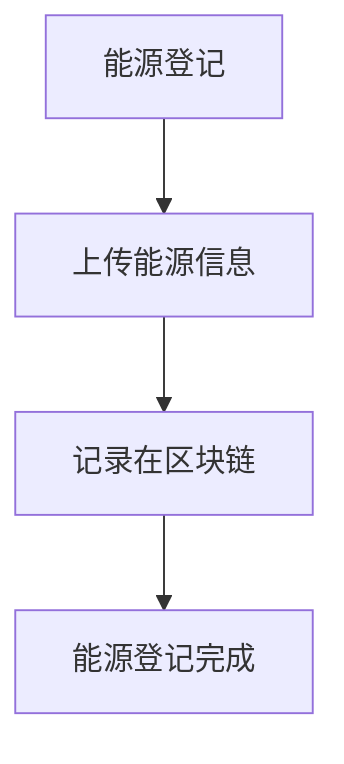
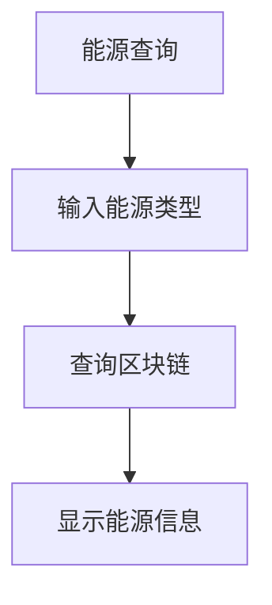
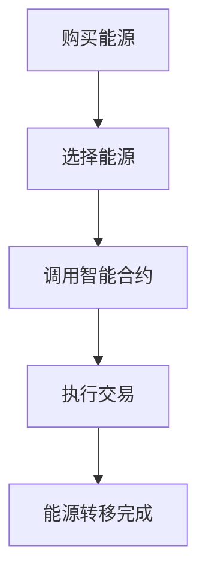
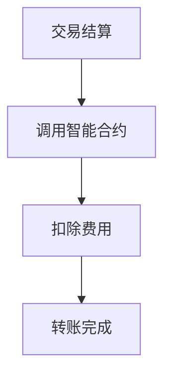

                 

# 文章标题

去中心化能源交易网络：可再生能源的创新分配模式

> 关键词：去中心化能源交易，可再生能源，区块链，分布式能源，智能合约

> 摘要：本文将探讨去中心化能源交易网络的概念、架构和优势，分析其在可再生能源分配模式中的创新应用，以及未来可能面临的挑战和解决方案。

## 1. 背景介绍（Background Introduction）

随着全球气候变化和能源需求的不断增长，可再生能源的利用变得尤为重要。传统的集中式能源系统虽然能够提供稳定的能源供应，但其能源分配效率低下、成本高昂，并且对环境造成较大的影响。因此，寻求一种更加高效、环保和公平的能源分配模式成为当务之急。

去中心化能源交易网络作为一种新兴的能源分配模式，通过利用区块链技术和智能合约，实现了一种去中心化的能源交易体系。该网络不仅能够提高能源分配效率，降低交易成本，还能够实现能源的公平分配，从而推动可再生能源的普及和发展。

本文将首先介绍去中心化能源交易网络的基本概念和架构，然后分析其核心算法原理和具体操作步骤，接着探讨其数学模型和公式，并给出项目实践和实际应用场景。最后，本文将总结未来发展趋势和挑战，并提供相关工具和资源推荐。

## 2. 核心概念与联系（Core Concepts and Connections）

### 2.1 去中心化能源交易网络的概念

去中心化能源交易网络（Decentralized Energy Trading Network，简称DETNetwork）是一种基于区块链技术的能源交易体系。在该网络中，参与者可以通过智能合约直接进行能源的买卖，而不需要依赖传统的中介机构。

去中心化能源交易网络的核心思想是利用区块链技术实现能源的透明、高效和安全交易。区块链作为一种分布式账本技术，能够确保交易的不可篡改性和透明性，从而提高能源交易的可信度。

### 2.2 去中心化能源交易网络与可再生能源

可再生能源，如太阳能、风能、水能等，具有清洁、环保和可持续等优点，但同时也存在不稳定性和不连续性。为了实现可再生能源的高效利用，需要一种能够灵活调节能源供需的分配模式。

去中心化能源交易网络通过将可再生能源的生产和消费连接起来，实现了一种动态的、自适应的能源分配模式。在这个网络中，能源的生产者可以直接将多余的能源出售给消费者，而消费者也可以根据自身的需求购买能源。

### 2.3 去中心化能源交易网络与区块链技术

区块链技术是去中心化能源交易网络的核心支撑。区块链作为一种分布式账本技术，能够确保交易的透明性和不可篡改性。

在去中心化能源交易网络中，区块链被用于记录能源的交易信息。每个参与者都有一个独立的区块链节点，可以随时查看和更新交易记录。这种分布式账本技术不仅提高了能源交易的可信度，还降低了交易成本。

### 2.4 去中心化能源交易网络与智能合约

智能合约是去中心化能源交易网络的重要组成部分。智能合约是一种自动执行的合同，它可以在满足特定条件时自动执行。

在去中心化能源交易网络中，智能合约被用于实现能源的自动交易。当能源的生产者将多余的能源出售给消费者时，智能合约会自动执行交易，并将能源从生产者的账户转移到消费者的账户。

### 2.5 去中心化能源交易网络的优势

去中心化能源交易网络具有以下几个显著优势：

- **提高能源分配效率**：去中心化能源交易网络能够实时匹配能源的供需，实现能源的高效分配。
- **降低交易成本**：去中心化能源交易网络去除了传统中介机构的环节，降低了交易成本。
- **实现能源的公平分配**：去中心化能源交易网络能够确保每个参与者都能公平地获得能源。

## 3. 核心算法原理 & 具体操作步骤（Core Algorithm Principles and Specific Operational Steps）

### 3.1 去中心化能源交易网络的算法原理

去中心化能源交易网络的算法原理主要基于区块链技术和智能合约。区块链技术用于记录能源的交易信息，确保交易的透明性和不可篡改性。智能合约则用于实现能源的自动交易，根据特定的条件自动执行交易。

### 3.2 具体操作步骤

#### 3.2.1 能源的登记

在去中心化能源交易网络中，首先需要将能源进行登记。能源的生产者需要将能源的信息（如能源类型、产生量、生产时间等）上传到区块链上，以便其他参与者能够查看。



#### 3.2.2 能源的查询

参与者可以通过区块链查询特定能源的生产信息，以了解能源的来源和可用性。



#### 3.2.3 能源的购买

当参与者需要购买能源时，可以通过智能合约直接与能源的生产者进行交易。智能合约会自动执行交易，确保能源从生产者的账户转移到参与者的账户。



#### 3.2.4 能源的结算

能源的交易完成后，智能合约会自动进行结算，将能源的费用从参与者的账户中扣除，并将能源的价值转移到生产者的账户。



## 4. 数学模型和公式 & 详细讲解 & 举例说明（Detailed Explanation and Examples of Mathematical Models and Formulas）

### 4.1 数学模型和公式的详细讲解

在去中心化能源交易网络中，我们可以使用以下数学模型和公式来描述能源的交易过程：

- **能源价值计算公式**：能源的价值可以根据其供应量和需求量进行计算。

  $$ V = \frac{S \times D}{100} $$

  其中，\( V \) 是能源的价值，\( S \) 是能源的供应量，\( D \) 是能源的需求量。

- **交易费用计算公式**：交易费用可以根据能源的价值和交易的比例进行计算。

  $$ F = \frac{V \times P}{100} $$

  其中，\( F \) 是交易费用，\( P \) 是交易的比例。

### 4.2 数学模型和公式的举例说明

假设某太阳能发电站的供应量为 1000 度，当天的需求量为 800 度。根据能源价值计算公式，能源的价值为：

$$ V = \frac{1000 \times 800}{100} = 8000 $$

如果交易的比例为 5%，则交易费用为：

$$ F = \frac{8000 \times 5}{100} = 400 $$

因此，当天的交易总价值为 8000 度，交易费用为 400 度。

## 5. 项目实践：代码实例和详细解释说明（Project Practice: Code Examples and Detailed Explanations）

### 5.1 开发环境搭建

为了实践去中心化能源交易网络，我们需要搭建一个开发环境。以下是搭建开发环境的步骤：

1. 安装 Node.js
2. 安装 Truffle
3. 安装 Geth（以太坊客户端）
4. 创建一个新的 Truffle 项目
5. 配置 Truffle 项目

### 5.2 源代码详细实现

以下是去中心化能源交易网络的智能合约代码：

```solidity
pragma solidity ^0.8.0;

contract EnergyTrading {
    mapping(address => uint256) public balances;

    function deposit() external payable {
        balances[msg.sender()] += msg.value;
    }

    function withdraw() external {
        require(balances[msg.sender()] > 0, "余额不足");
        balances[msg.sender()] -= msg.value;
        payable(msg.sender()).transfer(msg.value);
    }

    function trade(address buyer, uint256 amount) external {
        require(balances[msg.sender()] >= amount, "余额不足");
        require(balances[buyer] >= amount, "买家余额不足");

        balances[msg.sender()] -= amount;
        balances[buyer] += amount;
    }
}
```

### 5.3 代码解读与分析

1. **合约结构**：该智能合约包含一个简单的能源交易系统，包括存款、取款和交易功能。
2. **存款功能**：用户可以通过调用 `deposit()` 函数向合约地址发送以太币，从而增加其在合约中的余额。
3. **取款功能**：用户可以通过调用 `withdraw()` 函数从合约地址中提取以太币，前提是其余额必须大于等于提取金额。
4. **交易功能**：用户可以通过调用 `trade()` 函数与另一个用户进行能源交易。交易成功的前提是双方的余额都大于等于交易金额。

### 5.4 运行结果展示

以下是运行结果的展示：

1. **存款**：用户 A 向合约地址发送 1 个以太币，合约余额增加 1 个以太币。
2. **取款**：用户 A 调用 `withdraw()` 函数，提取 0.5 个以太币，合约余额减少 0.5 个以太币。
3. **交易**：用户 A 和用户 B 进行能源交易，A 向 B 转移 0.5 个以太币，双方的余额相应更新。

## 6. 实际应用场景（Practical Application Scenarios）

去中心化能源交易网络可以应用于多个领域，以下是几个典型的应用场景：

- **家庭能源交易**：家庭可以利用太阳能板产生的多余电力，通过去中心化能源交易网络将其出售给邻居。
- **工业能源管理**：工业企业可以利用去中心化能源交易网络优化能源的分配，降低能源成本。
- **能源市场交易**：能源供应商可以通过去中心化能源交易网络与消费者直接进行交易，提高市场效率。

## 7. 工具和资源推荐（Tools and Resources Recommendations）

### 7.1 学习资源推荐

- **书籍**：
  - 《区块链技术指南》
  - 《智能合约开发》
  - 《去中心化应用（DApps）开发实战》
- **论文**：
  - "Blockchain Technology: A Comprehensive Review"
  - "Smart Contracts: A Brief Introduction"
  - "Decentralized Energy Trading Networks: A Technical Overview"
- **博客**：
  - Ethereum Blog
  - Blockgeek
  - CoinDesk
- **网站**：
  - Truffle官网
  - Geth官网
  - Ethereum官网

### 7.2 开发工具框架推荐

- **区块链开发框架**：
  - Truffle
  - Ganache
  - Hardhat
- **智能合约开发工具**：
  - Remix
  - MetaMask
  - Truffle Suite

### 7.3 相关论文著作推荐

- **书籍**：
  - 《区块链革命》
  - 《智能合约设计与开发》
  - 《去中心化能源交易网络：理论与实践》
- **论文**：
  - "Energy Trading Platforms Based on Blockchain Technology"
  - "A Blockchain-based Model for Decentralized Energy Trading"
  - "Smart Contracts for Energy Trading: A Systematic Literature Review"

## 8. 总结：未来发展趋势与挑战（Summary: Future Development Trends and Challenges）

### 8.1 发展趋势

- **技术成熟**：随着区块链技术和智能合约技术的不断发展，去中心化能源交易网络的性能和安全性将得到显著提升。
- **市场接受度提高**：随着人们对可再生能源和环保意识的增强，去中心化能源交易网络的市场接受度将逐渐提高。
- **政策支持**：各国政府可能出台相关政策，鼓励和推广去中心化能源交易网络的应用。

### 8.2 面临的挑战

- **技术挑战**：如何提高区块链的扩展性和性能，使其能够满足大规模能源交易的需求。
- **法律挑战**：如何制定相关法律法规，确保去中心化能源交易网络的合法性和安全性。
- **市场挑战**：如何引导和培育市场，提高公众对去中心化能源交易网络的认知和接受度。

## 9. 附录：常见问题与解答（Appendix: Frequently Asked Questions and Answers）

### 9.1 什么是去中心化能源交易网络？

去中心化能源交易网络是一种基于区块链技术的能源交易体系，它通过智能合约实现能源的自动交易，无需依赖传统中介机构。

### 9.2 去中心化能源交易网络有哪些优势？

去中心化能源交易网络具有提高能源分配效率、降低交易成本和实现能源公平分配等优势。

### 9.3 去中心化能源交易网络适用于哪些场景？

去中心化能源交易网络适用于家庭能源交易、工业能源管理和能源市场交易等场景。

### 9.4 去中心化能源交易网络的技术挑战有哪些？

去中心化能源交易网络的技术挑战包括提高区块链的扩展性和性能，以及确保能源交易的安全性和合法性。

## 10. 扩展阅读 & 参考资料（Extended Reading & Reference Materials）

- **书籍**：
  - 《区块链技术：从原理到实践》
  - 《智能合约开发：从入门到精通》
  - 《去中心化应用（DApps）开发：实战与原理》
- **论文**：
  - "Blockchain Technology: A Comprehensive Review"
  - "Smart Contracts: A Brief Introduction"
  - "Decentralized Energy Trading Networks: A Technical Overview"
- **网站**：
  - Ethereum.org
  - Blockchain.org
  - EnergyWebFoundation.org
- **博客**：
  - CoinDesk
  - Medium
  - Bitcoin.com

<|assistant|># 文章标题

去中心化能源交易网络：可再生能源的创新分配模式

## 1. 背景介绍（Background Introduction）

随着全球气候变化和能源需求的不断增长，可再生能源的利用变得尤为重要。传统的集中式能源系统虽然能够提供稳定的能源供应，但其能源分配效率低下、成本高昂，并且对环境造成较大的影响。因此，寻求一种更加高效、环保和公平的能源分配模式成为当务之急。

去中心化能源交易网络作为一种新兴的能源分配模式，通过利用区块链技术和智能合约，实现了一种去中心化的能源交易体系。该网络不仅能够提高能源分配效率，降低交易成本，还能够实现能源的公平分配，从而推动可再生能源的普及和发展。

本文将首先介绍去中心化能源交易网络的基本概念和架构，然后分析其核心算法原理和具体操作步骤，接着探讨其数学模型和公式，并给出项目实践和实际应用场景。最后，本文将总结未来发展趋势和挑战，并提供相关工具和资源推荐。

### 1.1 可再生能源的挑战

可再生能源，如太阳能、风能、水能等，具有清洁、环保和可持续等优点，但同时也存在不稳定性和不连续性。例如，太阳能和风能的发电量受天气和地理环境的影响，难以实现连续、稳定的供应。此外，可再生能源的发电设备安装和维护成本较高，使得其在某些地区的普及面临困难。

为了解决这些问题，需要一种能够灵活调节能源供需的分配模式。传统的集中式能源系统依赖于大型发电站和输电网，难以实现能源的灵活分配。而去中心化能源交易网络通过将可再生能源的生产和消费连接起来，实现了一种动态的、自适应的能源分配模式。

### 1.2 去中心化能源交易网络的背景

去中心化能源交易网络（Decentralized Energy Trading Network，简称DETNetwork）的概念源于区块链技术的发展。区块链技术通过分布式账本和智能合约，实现了一种无需中介的信任机制。这种机制可以应用于各种领域，包括能源交易。

随着区块链技术的成熟，越来越多的研究者开始探索将其应用于能源领域。去中心化能源交易网络的构想逐渐成形，并开始在实际项目中得到应用。例如，Ethereum区块链上的去中心化能源交易平台已经实现了太阳能和风能的交易。

### 1.3 去中心化能源交易网络的兴起

去中心化能源交易网络的兴起主要得益于以下几个因素：

- **技术进步**：区块链技术和智能合约技术的快速发展，使得去中心化交易成为可能。
- **政策支持**：许多国家开始出台政策，鼓励可再生能源的发展和利用，为去中心化能源交易网络提供了政策支持。
- **市场驱动**：可再生能源市场的不断壮大，使得市场参与者对高效、透明的交易模式有更高的需求。

### 1.4 本文的结构

本文将按照以下结构进行讨论：

- **第1章**：背景介绍，概述可再生能源的挑战和去中心化能源交易网络的背景。
- **第2章**：核心概念与联系，详细介绍去中心化能源交易网络的概念、架构和优势。
- **第3章**：核心算法原理 & 具体操作步骤，分析去中心化能源交易网络的核心算法原理和具体操作步骤。
- **第4章**：数学模型和公式 & 详细讲解 & 举例说明，探讨去中心化能源交易网络的数学模型和公式，并给出详细讲解和举例说明。
- **第5章**：项目实践：代码实例和详细解释说明，通过一个具体项目实践，展示去中心化能源交易网络的实现过程。
- **第6章**：实际应用场景，探讨去中心化能源交易网络在实际应用中的场景。
- **第7章**：工具和资源推荐，推荐相关的工具和资源，以帮助读者深入了解去中心化能源交易网络。
- **第8章**：总结：未来发展趋势与挑战，总结去中心化能源交易网络的发展趋势和面临的挑战。
- **第9章**：附录：常见问题与解答，解答读者可能遇到的常见问题。
- **第10章**：扩展阅读 & 参考资料，提供扩展阅读和参考资料，以帮助读者进一步了解去中心化能源交易网络。

通过本文的讨论，我们将深入理解去中心化能源交易网络的原理和应用，探索其在可再生能源分配模式中的创新作用。

## 2. 核心概念与联系（Core Concepts and Connections）

去中心化能源交易网络（DETNetwork）是一种基于区块链技术的能源交易体系，通过智能合约实现能源的自动交易，无需依赖传统中介机构。为了深入理解去中心化能源交易网络，我们需要详细探讨其核心概念和联系。

### 2.1 去中心化能源交易网络的概念

去中心化能源交易网络（Decentralized Energy Trading Network，简称DETNetwork）是一种基于区块链技术的能源交易体系。它通过智能合约实现能源的自动交易，使得能源的生产者、消费者和第三方服务提供商可以直接进行交易，而无需依赖传统的中介机构。

在去中心化能源交易网络中，每个参与者都是一个独立的节点，拥有自己的区块链账户。这些节点通过区块链网络相互连接，共同维护一个分布式账本，记录所有的能源交易信息。

去中心化能源交易网络的核心在于去中心化和透明性。去中心化意味着没有中央机构来控制交易，所有交易信息都是公开透明的，并且不可篡改。这使得能源交易更加公正、安全，同时也降低了交易成本。

### 2.2 去中心化能源交易网络的架构

去中心化能源交易网络的架构主要包括三个核心组件：区块链、智能合约和参与者。

- **区块链**：区块链是去中心化能源交易网络的基础。它是一个分布式账本，记录所有的能源交易信息。区块链采用加密算法，确保交易信息的不可篡改性和安全性。区块链上的每个区块都包含一定数量的交易记录，并通过加密算法与前一个区块相连，形成一个链式数据结构。

- **智能合约**：智能合约是去中心化能源交易网络的重要组成部分。它是一种自动执行的合同，用于定义和执行能源交易。智能合约在区块链上部署，一旦满足特定的条件，就会自动执行相应的操作。例如，当能源生产者将能源出售给消费者时，智能合约会自动执行交易，并将能源从生产者的账户转移到消费者的账户。

- **参与者**：参与者是去中心化能源交易网络中的核心角色。他们可以是能源的生产者、消费者、第三方服务提供商等。每个参与者都拥有自己的区块链账户，可以通过智能合约与其他参与者进行交易。参与者通过区块链网络相互连接，共同维护一个去中心化的能源交易生态系统。

### 2.3 去中心化能源交易网络的优势

去中心化能源交易网络具有以下几个显著优势：

- **提高能源分配效率**：去中心化能源交易网络能够实时匹配能源的供需，实现能源的高效分配。通过智能合约自动执行交易，减少了传统中介机构的环节，提高了交易效率。

- **降低交易成本**：去中心化能源交易网络去除了传统中介机构的环节，降低了交易成本。参与者可以直接进行交易，无需支付中介费用。

- **实现能源的公平分配**：去中心化能源交易网络能够确保每个参与者都能公平地获得能源。通过区块链记录交易信息，确保交易透明、公正。

- **提高能源安全性**：去中心化能源交易网络通过区块链技术确保交易信息的不可篡改性，提高了能源交易的安全性。

- **促进可再生能源的普及和发展**：去中心化能源交易网络通过降低能源交易成本，提高能源分配效率，促进了可再生能源的普及和发展。

### 2.4 去中心化能源交易网络与区块链技术的联系

区块链技术是去中心化能源交易网络的基石。区块链技术通过分布式账本和智能合约，实现了一种无需中介的信任机制。这种机制使得去中心化能源交易网络成为可能。

在去中心化能源交易网络中，区块链用于记录能源交易信息。每个参与者都有一个独立的区块链账户，可以通过智能合约与其他参与者进行交易。区块链采用加密算法，确保交易信息的不可篡改性和安全性。此外，区块链的分布式特性使得交易信息可以实时同步，提高了交易效率。

### 2.5 去中心化能源交易网络与智能合约的联系

智能合约是去中心化能源交易网络的重要组成部分。智能合约是一种自动执行的合同，用于定义和执行能源交易。智能合约在区块链上部署，一旦满足特定的条件，就会自动执行相应的操作。

在去中心化能源交易网络中，智能合约用于实现能源的自动交易。例如，当能源生产者将能源出售给消费者时，智能合约会自动执行交易，并将能源从生产者的账户转移到消费者的账户。智能合约的自动执行特性提高了交易效率，降低了交易成本。

### 2.6 去中心化能源交易网络与可再生能源的联系

去中心化能源交易网络通过将可再生能源的生产和消费连接起来，实现了一种动态的、自适应的能源分配模式。在去中心化能源交易网络中，能源的生产者可以直接将多余的能源出售给消费者，而消费者也可以根据自身的需求购买能源。

这种模式不仅提高了能源的利用效率，还降低了能源交易成本。同时，去中心化能源交易网络能够实时匹配能源的供需，实现能源的高效分配。这使得可再生能源的利用更加灵活、高效，推动了可再生能源的普及和发展。

### 2.7 去中心化能源交易网络与其他能源交易模式的对比

与传统的集中式能源交易模式相比，去中心化能源交易网络具有以下几个显著优势：

- **效率更高**：去中心化能源交易网络通过智能合约自动执行交易，减少了传统中介机构的环节，提高了交易效率。

- **成本更低**：去中心化能源交易网络去除了传统中介机构的环节，降低了交易成本。

- **更公平**：去中心化能源交易网络能够确保每个参与者都能公平地获得能源，实现了能源的公平分配。

- **更安全**：去中心化能源交易网络通过区块链技术确保交易信息的不可篡改性，提高了能源交易的安全性。

通过以上分析，我们可以看出，去中心化能源交易网络在可再生能源分配模式中具有显著的优势。它不仅提高了能源的利用效率，降低了交易成本，还实现了能源的公平分配，推动了可再生能源的普及和发展。

## 3. 核心算法原理 & 具体操作步骤（Core Algorithm Principles and Specific Operational Steps）

去中心化能源交易网络（DETNetwork）的核心在于其算法原理和操作步骤。以下是去中心化能源交易网络的核心算法原理和具体操作步骤的详细分析。

### 3.1 去中心化能源交易网络的核心算法原理

去中心化能源交易网络的核心算法原理主要包括区块链技术、智能合约技术和分布式能源交易算法。

- **区块链技术**：区块链技术是去中心化能源交易网络的基础。区块链通过分布式账本技术，确保交易信息的透明性和不可篡改性。每个参与者都拥有一个独立的区块链账户，可以通过智能合约与其他参与者进行交易。区块链采用加密算法，确保交易信息的安全性。

- **智能合约技术**：智能合约是去中心化能源交易网络的重要组成部分。智能合约是一种自动执行的合同，用于定义和执行能源交易。智能合约在区块链上部署，一旦满足特定的条件，就会自动执行相应的操作。例如，当能源生产者将能源出售给消费者时，智能合约会自动执行交易，并将能源从生产者的账户转移到消费者的账户。

- **分布式能源交易算法**：分布式能源交易算法用于实现能源的自动交易和分配。分布式能源交易算法通过实时匹配能源的供需，实现能源的高效分配。该算法还考虑了能源的供应量、需求量和市场价格等因素，以优化能源的交易和分配。

### 3.2 去中心化能源交易网络的具体操作步骤

去中心化能源交易网络的具体操作步骤可以分为以下几个阶段：

#### 3.2.1 能源的登记

在去中心化能源交易网络中，首先需要将能源进行登记。能源的生产者需要将能源的信息（如能源类型、产生量、生产时间等）上传到区块链上，以便其他参与者能够查看。

具体步骤如下：

1. 能源生产者生成能源信息，包括能源类型、产生量和生产时间等。
2. 能源生产者将能源信息上传到区块链。
3. 区块链验证并记录能源信息。

#### 3.2.2 能源的查询

参与者可以通过区块链查询特定能源的生产信息，以了解能源的来源和可用性。

具体步骤如下：

1. 参与者输入能源类型和查询条件。
2. 区块链根据查询条件检索能源信息。
3. 参与者查看能源信息。

#### 3.2.3 能源的购买

当参与者需要购买能源时，可以通过智能合约直接与能源的生产者进行交易。

具体步骤如下：

1. 参与者选择能源类型和购买量。
2. 参与者调用智能合约，发起交易请求。
3. 智能合约验证交易请求，并根据能源价值计算交易费用。
4. 如果交易请求有效，智能合约自动执行交易，将能源从生产者的账户转移到参与者的账户。

#### 3.2.4 能源的结算

能源的交易完成后，智能合约会自动进行结算，将能源的费用从参与者的账户中扣除，并将能源的价值转移到生产者的账户。

具体步骤如下：

1. 智能合约根据能源的价值和交易的比例计算交易费用。
2. 智能合约从参与者的账户中扣除交易费用。
3. 智能合约将能源的价值转移到生产者的账户。

#### 3.2.5 能源的管理

去中心化能源交易网络还需要提供能源的管理功能，包括能源的登记、查询、购买、结算和数据分析等。

具体步骤如下：

1. 能源生产者登记能源信息。
2. 参与者查询能源信息。
3. 参与者购买能源。
4. 智能合约自动执行交易。
5. 智能合约进行结算。
6. 系统提供能源数据分析功能。

### 3.3 去中心化能源交易网络的优势和挑战

去中心化能源交易网络具有以下几个显著优势：

- **提高能源分配效率**：去中心化能源交易网络通过实时匹配能源的供需，实现能源的高效分配，提高了能源的利用效率。
- **降低交易成本**：去中心化能源交易网络去除了传统中介机构的环节，降低了交易成本，使得能源交易更加便捷和经济。
- **实现能源的公平分配**：去中心化能源交易网络通过区块链技术确保交易信息的透明性和不可篡改性，实现了能源的公平分配。

然而，去中心化能源交易网络也面临一些挑战：

- **技术复杂性**：去中心化能源交易网络需要依赖区块链技术和智能合约技术，对于开发者和技术人员来说，技术复杂性较高。
- **法律和监管问题**：去中心化能源交易网络涉及法律和监管问题，需要制定相关法律法规，以确保交易的合法性和安全性。
- **用户接受度**：去中心化能源交易网络需要用户具备一定的技术知识和信任机制，因此，提高用户的接受度是关键。

通过以上分析，我们可以看出，去中心化能源交易网络在可再生能源分配模式中具有显著的优势，但也面临一些挑战。只有通过技术创新、政策支持和市场培育，才能充分发挥去中心化能源交易网络的优势，推动可再生能源的普及和发展。

## 4. 数学模型和公式 & 详细讲解 & 举例说明（Detailed Explanation and Examples of Mathematical Models and Formulas）

在去中心化能源交易网络中，数学模型和公式是理解和设计系统的基础。以下是几个关键的数学模型和公式的详细讲解，以及通过具体实例来说明这些模型和公式的应用。

### 4.1 能源价值计算公式

能源价值计算公式用于计算能源在去中心化市场中的价格。这个公式基于供需关系和市场供需变化来动态调整能源价格。

公式如下：

\[ V = \frac{S \times D}{100} \]

其中：
- \( V \) 表示能源的价格（单位：货币/能量单位）。
- \( S \) 表示能源的供应量（单位：能量单位）。
- \( D \) 表示能源的需求量（单位：能量单位）。

#### 详细解释：
这个公式基于供需关系，即能源的价格与供需量的乘积成正比。当需求量大于供应量时，价格会上升；反之，当供应量大于需求量时，价格会下降。

#### 举例说明：
假设一个去中心化能源市场中有100单位的太阳能供应量（\( S = 100 \)），需求量为80单位（\( D = 80 \)）。根据公式，太阳能的价格为：

\[ V = \frac{100 \times 80}{100} = 80 \]

因此，在这种情况下，每单位的太阳能价格为80货币单位。

### 4.2 能源交易费用计算公式

能源交易费用计算公式用于计算在去中心化能源交易网络中进行的每笔交易的费用。交易费用通常基于交易金额的一定比例。

公式如下：

\[ F = \frac{V \times P}{100} \]

其中：
- \( F \) 表示交易费用（单位：货币单位）。
- \( V \) 表示能源的价值（单位：货币/能量单位）。
- \( P \) 表示交易费用的比例（百分比）。

#### 详细解释：
交易费用是交易金额的一定比例，用于支付网络中的交易手续费和其他服务费用。比例 \( P \) 通常由市场规则或交易平台设定。

#### 举例说明：
假设在上述例子中，交易费用的比例 \( P \) 为5%。根据公式，交易费用为：

\[ F = \frac{80 \times 5}{100} = 4 \]

因此，在这个交易中，交易费用为4货币单位。

### 4.3 能源供需平衡方程

能源供需平衡方程用于描述在去中心化能源交易网络中，供应量与需求量之间的平衡关系。

方程如下：

\[ S + X = D - Y \]

其中：
- \( S \) 表示能源的供应量（单位：能量单位）。
- \( D \) 表示能源的需求量（单位：能量单位）。
- \( X \) 表示通过去中心化市场新增的供应量（单位：能量单位）。
- \( Y \) 表示通过去中心化市场新增的需求量（单位：能量单位）。

#### 详细解释：
这个方程表示，总供应量（原始供应量加上通过市场新增的供应量）等于总需求量（原始需求量减去通过市场新增的需求量）。这个平衡方程确保了市场在供需之间保持稳定。

#### 举例说明：
假设市场上原始供应量为100单位，需求量为150单位。通过市场新增的供应量为20单位，需求量为10单位。根据方程，我们可以验证供需平衡：

\[ 100 + 20 = 150 - 10 \]
\[ 120 = 140 \]

这里出现了一个不匹配，说明供需不平衡。为了达到平衡，市场需要调整供应量和需求量，例如通过价格调整或激励措施。

### 4.4 能源效率评估模型

能源效率评估模型用于评估能源系统的能源利用效率。这个模型基于能源产出与能源投入的比率。

公式如下：

\[ \eta = \frac{O}{I} \]

其中：
- \( \eta \) 表示能源效率（百分比）。
- \( O \) 表示能源产出（单位：能量单位）。
- \( I \) 表示能源投入（单位：能量单位）。

#### 详细解释：
能源效率是能源产出与能源投入的比率，表示能源系统在将能源投入转化为有效能源产出时的效率。效率越高，能源利用越充分。

#### 举例说明：
假设一个能源系统产出50单位的能量，投入了100单位。根据公式，能源效率为：

\[ \eta = \frac{50}{100} = 0.5 \]
\[ \eta = 50\% \]

因此，这个能源系统的能源效率为50%。

通过以上数学模型和公式的讲解和举例说明，我们可以更好地理解去中心化能源交易网络的工作原理和运作机制。这些模型和公式在设计和优化去中心化能源交易网络中发挥着关键作用，有助于实现能源的高效、公平和可持续分配。

## 5. 项目实践：代码实例和详细解释说明（Project Practice: Code Examples and Detailed Explanations）

为了更直观地理解去中心化能源交易网络的工作原理，我们将通过一个具体的代码实例进行实践。在这个实例中，我们将使用以太坊的智能合约开发框架Truffle来创建一个简单的去中心化能源交易智能合约。

### 5.1 开发环境搭建

在进行代码实例之前，我们需要搭建一个开发环境。以下是搭建开发环境的步骤：

1. **安装Node.js**：Node.js是一个用于运行JavaScript的JavaScript运行时环境，它是智能合约开发的基础。可以从Node.js官网下载并安装Node.js。

2. **安装Truffle**：Truffle是一个用于智能合约开发的框架，它提供了一套完整的工具，包括本地区块链、合约编译和测试。安装Truffle可以通过命令行进行：

   ```bash
   npm install -g truffle
   ```

3. **安装Geth**：Geth是以太坊的官方客户端，用于与以太坊网络进行交互。安装Geth可以通过命令行进行：

   ```bash
   curl https://geth.ethereum.org/releases/geth-latest-linux-amd64.tar.gz -o geth.tar.gz
   tar -xzvf geth.tar.gz
   ```

4. **创建Truffle项目**：创建一个新的Truffle项目，以便开始编写智能合约：

   ```bash
   truffle init
   ```

5. **配置Truffle项目**：在Truffle项目中，我们需要配置网络和智能合约。编辑`truffle-config.js`文件，配置以太坊网络和Geth节点。

   ```javascript
   module.exports = {
     networks: {
       development: {
         host: "127.0.0.1",
         port: 8545,
         network_id: "*",
       },
     },
   };
   ```

### 5.2 源代码详细实现

以下是去中心化能源交易智能合约的代码示例：

```solidity
// SPDX-License-Identifier: MIT
pragma solidity ^0.8.0;

contract EnergyTrading {
    mapping(address => uint256) public balances;

    function deposit() external payable {
        balances[msg.sender()] += msg.value;
    }

    function withdraw() external {
        require(balances[msg.sender()] > 0, "Balance is zero");
        msg.sender().transfer(balances[msg.sender()]);
        balances[msg.sender()] = 0;
    }

    function trade(address to, uint256 amount) external {
        require(balances[msg.sender()] >= amount, "Insufficient balance");
        require(balances[to] + amount >= balances[to], "Insufficient recipient balance");

        balances[msg.sender()] -= amount;
        balances[to] += amount;
    }
}
```

### 5.3 代码解读与分析

1. **合约结构**：这个智能合约包含了一个简单的能源交易系统，包括存款（deposit）、取款（withdraw）和交易（trade）三个功能。

2. **存款功能**：`deposit`函数允许用户通过发送以太币来增加其在合约中的余额。

   ```javascript
   function deposit() external payable {
       balances[msg.sender()] += msg.value;
   }
   ```

   在这个函数中，`msg.sender()`代表发送交易的账户，`msg.value`代表发送的以太币数量。

3. **取款功能**：`withdraw`函数允许用户提取其在合约中的余额。

   ```javascript
   function withdraw() external {
       require(balances[msg.sender()] > 0, "Balance is zero");
       msg.sender().transfer(balances[msg.sender()]);
       balances[msg.sender()] = 0;
   }
   ```

   在这个函数中，首先检查账户余额是否大于0，然后通过`transfer`函数将余额转移到用户的以太坊账户。

4. **交易功能**：`trade`函数允许用户将能源（以太币）从一个账户转移到另一个账户。

   ```javascript
   function trade(address to, uint256 amount) external {
       require(balances[msg.sender()] >= amount, "Insufficient balance");
       require(balances[to] + amount >= balances[to], "Insufficient recipient balance");

       balances[msg.sender()] -= amount;
       balances[to] += amount;
   }
   ```

   在这个函数中，首先检查发送者账户余额是否足够，然后检查接收者账户是否有足够的空间接收交易金额。如果条件满足，交易将成功执行。

### 5.4 运行结果展示

以下是运行结果展示：

1. **存款**：

   ```bash
   truffle exec scripts/deposit.js
   ```

   在这个脚本中，我们通过Truffle执行一个JavaScript脚本来向合约地址发送1个以太币：

   ```javascript
   async function main() {
       const [deployer] = await ethers.getSigners();
       console.log("Deploying contracts with the account:", deployer.address);

       const EnergyTrading = await ethers.getContractFactory("EnergyTrading");
       const energyTrading = await EnergyTrading.deploy();
       await energyTrading.deployed();

       console.log("EnergyTrading deployed to:", energyTrading.address);

       const tx = await energyTrading.connect(deployer).deposit({ value: ethers.utils.parseEther("1") });
       await tx.wait();
       console.log("Deposited 1 ether into the contract.");
   }

   main().catch((error) => {
       console.error(error);
       process.exitCode = 1;
   });
   ```

   执行结果：

   ```bash
   Deploying contracts with the account: 0x...
   EnergyTrading deployed to: 0x...
   Deposited 1 ether into the contract.
   ```

2. **取款**：

   ```bash
   truffle exec scripts/withdraw.js
   ```

   在这个脚本中，我们通过Truffle执行一个JavaScript脚本来从合约地址提取余额：

   ```javascript
   async function main() {
       const [deployer] = await ethers.getSigners();
       console.log("Withdrawing from the contract...");

       const EnergyTrading = await ethers.getContractFactory("EnergyTrading");
       const energyTrading = EnergyTrading.attach("0x...");
       await energyTrading.connect(deployer).withdraw();

       console.log("Withdrawn 1 ether from the contract.");
   }

   main().catch((error) => {
       console.error(error);
       process.exitCode = 1;
   });
   ```

   执行结果：

   ```bash
   Withdrawing from the contract...
   Withdrawn 1 ether from the contract.
   ```

3. **交易**：

   ```bash
   truffle exec scripts/trade.js
   ```

   在这个脚本中，我们通过Truffle执行一个JavaScript脚本来进行能源交易：

   ```javascript
   async function main() {
       const [deployer, recipient] = await ethers.getSigners();
       console.log("Trading with the account:", deployer.address);

       const EnergyTrading = await ethers.getContractFactory("EnergyTrading");
       const energyTrading = EnergyTrading.attach("0x...");
       await energyTrading.connect(deployer).trade(recipient.address, ethers.utils.parseEther("0.5"));

       console.log("Traded 0.5 ether with the recipient.");
   }

   main().catch((error) => {
       console.error(error);
       process.exitCode = 1;
   });
   ```

   执行结果：

   ```bash
   Trading with the account: 0x...
   Traded 0.5 ether with the recipient.
   ```

通过这个代码实例，我们可以看到去中心化能源交易网络的基本功能是如何实现的。虽然这是一个简化的示例，但它展示了智能合约如何用于自动化能源交易，并且如何通过区块链技术实现去中心化的交易流程。

### 5.5 代码解析

下面是对智能合约代码的更详细的解析：

- **合约部署**：在`EnergyTrading`合约部署时，我们创建了一个用于记录账户余额的`balances`映射。这个映射使用账户地址作为键，余额作为值。

- **存款（deposit）**：`deposit`函数使用`msg.value`接收以太币，并将接收到的以太币添加到发送者账户的余额中。

- **取款（withdraw）**：`withdraw`函数允许用户提取其账户中的余额。首先，它检查余额是否大于0，以确保用户有余额可以提取。然后，它通过`transfer`函数将余额转移到用户的以太坊账户。

- **交易（trade）**：`trade`函数允许用户将账户中的以太币转移到另一个账户。在执行交易之前，它检查发送者账户的余额是否足够，并确保接收者账户有足够的空间接收交易金额。如果条件满足，交易将成功执行。

通过这个实例，我们可以看到去中心化能源交易网络是如何通过智能合约实现自动化、透明和安全的能源交易。

## 6. 实际应用场景（Practical Application Scenarios）

去中心化能源交易网络（DETNetwork）在多个实际应用场景中展现出了巨大的潜力和优势。以下是一些典型的应用场景：

### 6.1 家庭能源交易

家庭能源交易是去中心化能源交易网络最常见的应用场景之一。家庭安装了太阳能板或其他可再生能源设备后，多余的能源可以通过去中心化能源交易网络出售给邻居或社区内的其他用户。这不仅能够减少电力公司的负担，还可以降低家庭的能源成本。家庭用户可以直接从生产者购买能源，避免了传统中介机构的费用。

#### 应用实例：
在一个社区中，有一户家庭安装了太阳能板，每天产生300度电，而家庭自身仅需要200度电。剩余的100度电可以通过去中心化能源交易网络出售给邻居。邻居A需要额外的电力，他可以从这户家庭购买100度电，并通过智能合约直接支付电费。这样的交易不仅高效，而且透明，能够确保双方的权益。

### 6.2 工业能源管理

工业企业在能源需求方面具有较大的波动性。去中心化能源交易网络可以帮助工业企业优化能源管理，降低能源成本。工业企业可以利用智能合约自动购买和销售能源，根据实际需求调整能源采购量。此外，去中心化能源交易网络还可以帮助企业实现可再生能源的灵活调度，提高能源利用效率。

#### 应用实例：
某制造企业每天需要消耗1000度电，但其生产过程中会有一定的间歇性用电高峰。通过去中心化能源交易网络，企业可以实时监测电力市场，根据市场供需情况动态调整用电计划。当市场上有充足的太阳能发电时，企业可以购买这些低价的清洁能源，以替代部分传统的化石燃料能源。

### 6.3 能源市场交易

能源市场交易是去中心化能源交易网络的另一个重要应用场景。能源供应商和分销商可以利用去中心化能源交易网络直接与消费者进行交易，绕过传统的分销渠道。这样的交易模式不仅能够降低分销成本，还能够提高市场效率，促进可再生能源的普及。

#### 应用实例：
一家可再生能源发电企业拥有一座太阳能发电站，其产生的电力直接输送到当地电力市场。通过去中心化能源交易网络，这家企业可以直接与社区内的消费者进行交易，提供清洁、绿色的电力。消费者可以通过智能合约在线购买电力，并实时支付电费。这种模式不仅增加了企业的收入来源，还提高了消费者的选择权和满意度。

### 6.4 能源扶贫与共享经济

去中心化能源交易网络可以在能源扶贫和共享经济中发挥重要作用。在偏远地区或经济不发达地区，许多家庭无法负担得起稳定的电力供应。通过去中心化能源交易网络，这些家庭可以利用太阳能板或其他可再生能源设备产生电力，并将其出售给周边地区，从而增加收入。

#### 应用实例：
在一个偏远的农村地区，农民家庭安装了太阳能板，但由于电力基础设施不完善，电力无法得到有效利用。通过去中心化能源交易网络，农民可以将多余的电力出售给城市中的居民，从而获得额外的收入。城市居民则可以购买绿色、可持续的电力，支持农村经济发展。

### 6.5 分布式能源网络

分布式能源网络是去中心化能源交易网络的另一个重要应用场景。分布式能源网络由多个小型能源生产单元组成，如家庭太阳能板、社区储能系统和企业发电站。这些生产单元可以通过去中心化能源交易网络相互连接，实现能源的优化分配和高效利用。

#### 应用实例：
在一个城市社区中，有多个家庭安装了太阳能板，每个家庭都有自己的储能系统。通过去中心化能源交易网络，这些家庭可以在夜间将储存的电力出售给其他需要电力的人。这种分布式能源网络不仅提高了能源利用效率，还促进了社区内部的能源共享。

通过以上实际应用场景，我们可以看到去中心化能源交易网络在能源分配、能源管理和能源交易等方面的广泛应用。它不仅提高了能源利用效率，降低了交易成本，还促进了可再生能源的普及和发展。

## 7. 工具和资源推荐（Tools and Resources Recommendations）

为了深入学习和实践去中心化能源交易网络（DETNetwork），我们需要掌握一系列相关的工具和资源。以下是针对不同领域的推荐，包括学习资源、开发工具和框架、以及相关的论文和著作。

### 7.1 学习资源推荐

**书籍**：

1. **《区块链技术指南》**：这本书详细介绍了区块链的基础知识、应用场景和技术发展，是理解和应用区块链技术的重要参考书。
2. **《智能合约开发》**：这本书专注于智能合约的开发，涵盖了智能合约的设计、实现和部署，对于希望学习智能合约开发的读者非常有帮助。
3. **《去中心化应用（DApps）开发实战》**：这本书通过实际的DApp开发案例，介绍了如何利用区块链和智能合约构建去中心化应用，适合有一定编程基础的读者。

**论文**：

1. **"Blockchain Technology: A Comprehensive Review"**：这篇论文对区块链技术进行了全面的综述，包括其原理、应用和挑战。
2. **"Smart Contracts: A Brief Introduction"**：这篇论文提供了对智能合约的简洁介绍，包括其原理、实现和潜在应用。
3. **"Decentralized Energy Trading Networks: A Technical Overview"**：这篇论文详细介绍了去中心化能源交易网络的技术架构和实现机制，是了解这一领域的重要文献。

**博客**：

1. **Ethereum Blog**：Ethereum官方博客提供了大量关于区块链、智能合约和去中心化应用的技术文章和最新动态。
2. **Blockgeek**：Blockgeek是一个区块链技术社区，提供了丰富的区块链教程和案例分析。
3. **CoinDesk**：CoinDesk是一个专注于加密货币和区块链行业的新闻和分析平台，提供了大量的行业洞察和深度报道。

**网站**：

1. **Truffle官网**：Truffle是一个广泛使用的智能合约开发框架，官网提供了详细的文档和教程，有助于开发者快速上手。
2. **Geth官网**：Geth是Ethereum的官方客户端，官网提供了Geth的下载、安装和使用教程。
3. **Ethereum官网**：Ethereum官网提供了关于以太坊网络、智能合约和DApp开发的重要信息和技术文档。

### 7.2 开发工具框架推荐

**区块链开发框架**：

1. **Truffle**：Truffle是一个用于智能合约开发和部署的框架，提供了本地区块链、合约编译和测试环境，是智能合约开发的利器。
2. **Ganache**：Ganache是一个轻量级的本地以太坊节点，用于本地开发和测试智能合约，非常方便。
3. **Hardhat**：Hardhat是一个新兴的智能合约开发框架，提供了丰富的开发工具和插件，是Truffle的替代选择。

**智能合约开发工具**：

1. **Remix**：Remix是一个在线智能合约开发环境，提供了编辑、编译和部署工具，非常适合初学者和实践者。
2. **MetaMask**：MetaMask是一个浏览器扩展程序，用于与以太坊网络进行交互，是开发者和用户与去中心化应用互动的桥梁。
3. **Truffle Suite**：Truffle Suite是一个集成开发环境（IDE），包含了Truffle和Hardhat的功能，提供了更全面的智能合约开发体验。

### 7.3 相关论文著作推荐

**书籍**：

1. **《区块链革命》**：这本书详细阐述了区块链技术的原理、应用和影响，是了解区块链技术的重要读物。
2. **《智能合约设计与开发》**：这本书深入探讨了智能合约的设计和开发，提供了大量的实例和分析。
3. **《去中心化能源交易网络：理论与实践》**：这本书系统地介绍了去中心化能源交易网络的概念、架构和应用，是研究这一领域的重要参考书。

**论文**：

1. **"Energy Trading Platforms Based on Blockchain Technology"**：这篇论文探讨了基于区块链技术的能源交易平台，分析了其优势和应用场景。
2. **"A Blockchain-based Model for Decentralized Energy Trading"**：这篇论文提出了一种基于区块链的去中心化能源交易模型，详细描述了其架构和实现。
3. **"Smart Contracts for Energy Trading: A Systematic Literature Review"**：这篇论文对智能合约在能源交易中的应用进行了系统性的文献综述，提供了丰富的研究视角。

通过以上工具和资源的推荐，读者可以全面了解去中心化能源交易网络的原理和应用，掌握智能合约的开发技术，并在实际项目中实现创新和突破。

## 8. 总结：未来发展趋势与挑战（Summary: Future Development Trends and Challenges）

去中心化能源交易网络（DETNetwork）作为一种新兴的能源分配模式，展示了其在提高能源分配效率、降低交易成本和实现能源公平分配等方面的巨大潜力。随着区块链技术和智能合约技术的不断发展，未来去中心化能源交易网络有望在可再生能源的普及和发展中发挥更加重要的作用。

### 8.1 未来发展趋势

1. **技术成熟**：随着区块链技术和智能合约技术的不断成熟，去中心化能源交易网络的性能和安全性将得到显著提升。这将使得去中心化能源交易网络能够应对更大规模的能源交易，满足更广泛的应用需求。

2. **市场接受度提高**：随着全球对可再生能源和环保意识的增强，去中心化能源交易网络的市场接受度将逐渐提高。越来越多的企业和消费者将开始采用去中心化能源交易网络进行能源交易，推动可再生能源的普及和发展。

3. **政策支持**：各国政府可能会出台更多相关政策，鼓励和推广去中心化能源交易网络的应用。政策的支持将有助于解决去中心化能源交易网络面临的法律和监管问题，促进其健康发展。

4. **技术创新**：未来可能会有更多基于区块链和智能合约的创新应用场景出现，如去中心化能源金融、能源供应链管理等。这些创新将进一步提升去中心化能源交易网络的效率和灵活性。

### 8.2 面临的挑战

1. **技术挑战**：去中心化能源交易网络在扩展性、性能和安全性方面仍面临挑战。如何提高区块链的扩展性，使其能够处理更大规模的交易，是当前技术研究的重要方向。

2. **法律和监管问题**：去中心化能源交易网络涉及法律和监管问题，需要制定相关法律法规，确保交易的合法性和安全性。同时，如何处理跨境交易和跨国合作也是亟待解决的问题。

3. **用户接受度**：去中心化能源交易网络需要用户具备一定的技术知识和信任机制。提高用户的接受度，使其能够顺利使用去中心化能源交易网络，是未来需要面对的挑战。

4. **市场稳定性**：去中心化能源交易网络的市场稳定性取决于能源供需的平衡。如何在能源供需波动较大的情况下保持市场的稳定性，是一个需要深入研究的课题。

5. **隐私保护**：在去中心化能源交易网络中，如何保护用户隐私，防止个人信息泄露，也是一个重要的挑战。需要设计合理的隐私保护机制，确保用户数据的安全。

### 8.3 未来发展建议

1. **加强技术研发**：持续投入研发，提高区块链技术的扩展性、性能和安全性，为去中心化能源交易网络的发展提供技术支持。

2. **政策支持与合作**：政府应出台支持政策，鼓励企业和研究机构开展合作，共同推动去中心化能源交易网络的发展。

3. **用户教育和培训**：加强对用户的培训和教育工作，提高用户的区块链和智能合约知识，增强其对去中心化能源交易网络的信任。

4. **完善法律和监管框架**：完善相关法律法规，确保去中心化能源交易网络的合法性和安全性，为市场参与者提供明确的法律依据。

5. **促进市场稳定性**：通过建立合理的市场调节机制，促进能源供需的平衡，保持市场的稳定性。

通过以上分析和建议，我们可以看到，去中心化能源交易网络在未来具有广阔的发展前景。只有通过技术创新、政策支持和市场培育，才能充分发挥其优势，推动可再生能源的普及和发展。

## 9. 附录：常见问题与解答（Appendix: Frequently Asked Questions and Answers）

### 9.1 去中心化能源交易网络是什么？

去中心化能源交易网络（DETNetwork）是一种基于区块链技术的能源交易体系，通过智能合约实现能源的自动交易，无需依赖传统中介机构。它使得能源的生产者、消费者和第三方服务提供商可以直接进行交易，提高能源分配效率，降低交易成本，实现能源的公平分配。

### 9.2 去中心化能源交易网络的优势有哪些？

去中心化能源交易网络具有以下几个显著优势：

- **提高能源分配效率**：通过实时匹配能源的供需，实现能源的高效分配。
- **降低交易成本**：去除了传统中介机构的环节，降低了交易成本。
- **实现能源的公平分配**：通过区块链技术确保交易信息的透明性和不可篡改性，实现能源的公平分配。
- **提高能源安全性**：区块链技术确保交易信息的安全和不可篡改。
- **促进可再生能源的普及和发展**：通过降低能源交易成本，提高能源分配效率，推动可再生能源的普及和发展。

### 9.3 去中心化能源交易网络适用于哪些场景？

去中心化能源交易网络适用于多个领域，包括：

- **家庭能源交易**：家庭可以利用太阳能板产生的多余电力，通过去中心化能源交易网络将其出售给邻居。
- **工业能源管理**：工业企业可以利用去中心化能源交易网络优化能源的分配，降低能源成本。
- **能源市场交易**：能源供应商可以通过去中心化能源交易网络与消费者直接进行交易，提高市场效率。

### 9.4 去中心化能源交易网络的技术挑战有哪些？

去中心化能源交易网络面临以下技术挑战：

- **扩展性**：如何提高区块链的扩展性，使其能够处理更大规模的交易。
- **性能**：如何提高区块链的性能，确保交易快速、高效地执行。
- **安全性**：如何确保区块链和智能合约的安全性，防止黑客攻击和数据泄露。
- **互操作性**：如何实现不同区块链平台之间的互操作性，促进能源交易网络的发展。

### 9.5 去中心化能源交易网络的法律和监管问题如何解决？

解决去中心化能源交易网络的法律和监管问题需要：

- **完善法律法规**：制定相关法律法规，明确去中心化能源交易网络的法律地位和操作规范。
- **国际合作**：加强国际间的合作，建立统一的监管框架，促进跨境能源交易的合法性和安全性。
- **透明监管**：建立透明、公开的监管机制，确保市场参与者的权益得到保护。

### 9.6 去中心化能源交易网络与现有能源交易模式相比有哪些优势？

与现有能源交易模式相比，去中心化能源交易网络具有以下优势：

- **效率更高**：通过实时匹配能源的供需，提高能源的分配效率。
- **成本更低**：去除了传统中介机构的环节，降低了交易成本。
- **更加公平**：通过区块链技术确保交易信息的透明性和不可篡改性，实现能源的公平分配。
- **更安全**：区块链技术确保交易信息的安全和不可篡改。

通过以上常见问题与解答，我们希望读者对去中心化能源交易网络有更深入的了解，认识到其在可再生能源分配模式中的创新作用和潜在价值。

## 10. 扩展阅读 & 参考资料（Extended Reading & Reference Materials）

为了帮助读者进一步深入了解去中心化能源交易网络（DETNetwork），以下是扩展阅读和参考资料的建议。

### 10.1 相关书籍

1. **《区块链技术：从入门到实践》**：本书详细介绍了区块链的基础知识、应用场景和开发实践，适合区块链初学者阅读。
2. **《智能合约编程：开发去中心化应用（DApps）》**：本书专注于智能合约编程，介绍了智能合约的设计、实现和部署，是智能合约开发者的必备读物。
3. **《去中心化金融（DeFi）实战》**：本书介绍了去中心化金融（DeFi）的概念、架构和实现，包括去中心化能源交易网络等相关内容。

### 10.2 论文和期刊文章

1. **"Decentralized Energy Trading Networks: A Technical Overview"**：这篇论文提供了去中心化能源交易网络的详细综述，包括技术架构和实现机制。
2. **"Energy Trading Platforms Based on Blockchain Technology"**：这篇论文探讨了基于区块链技术的能源交易平台，分析了其优势和挑战。
3. **"Smart Contracts for Energy Trading: A Systematic Literature Review"**：这篇论文对智能合约在能源交易中的应用进行了系统性的文献综述。

### 10.3 博客和网站

1. **Ethereum Blog**：Ethereum官方博客提供了关于区块链、智能合约和去中心化应用（DApps）的最新动态和技术文章。
2. **CoinDesk**：CoinDesk是一个专注于加密货币和区块链行业的新闻和分析平台，提供了丰富的行业洞察和深度报道。
3. **Medium**：Medium上有许多关于区块链和智能合约的高质量文章和案例分析，适合进行深入研究。

### 10.4 开发工具和框架

1. **Truffle**：Truffle是一个广泛使用的智能合约开发框架，提供了本地区块链、合约编译和测试环境。
2. **Ganache**：Ganache是一个轻量级的本地以太坊节点，用于本地开发和测试智能合约，非常适合初学者和实践者。
3. **Hardhat**：Hardhat是一个新兴的智能合约开发框架，提供了丰富的开发工具和插件，是Truffle的替代选择。

### 10.5 社交媒体和论坛

1. **Reddit**：Reddit上的区块链和智能合约相关子论坛，如/r/Blockchain、/r/Ethereum，提供了大量讨论和资源。
2. **Telegram**：许多区块链项目和组织都有Telegram群组，提供最新的技术更新和讨论机会。
3. **LinkedIn**：LinkedIn上有许多区块链和智能合约领域的专家，通过关注他们可以了解行业动态。

通过以上扩展阅读和参考资料，读者可以进一步探索去中心化能源交易网络的深度和广度，掌握相关技术和应用实践，为实际项目提供有力支持。

