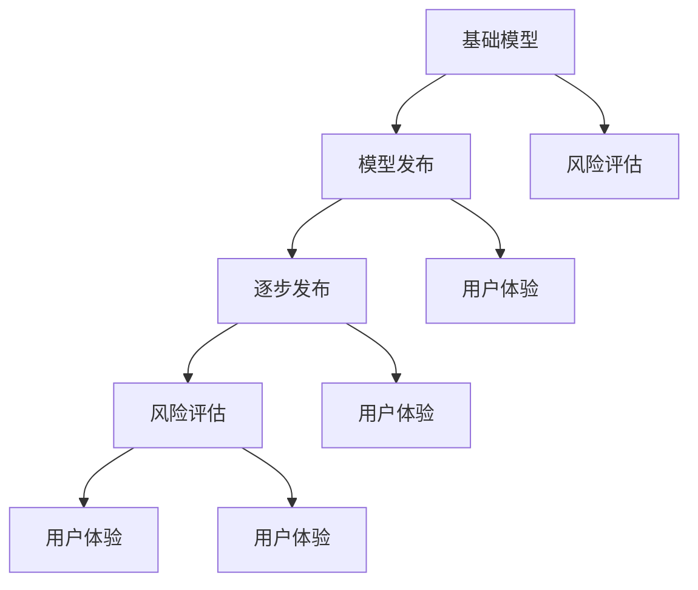
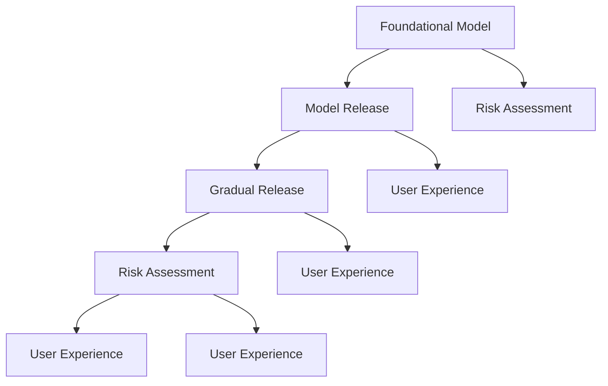

                 

### 背景介绍（Background Introduction）

在当今快速发展的信息技术领域，人工智能（AI）正逐渐成为推动变革的核心力量。特别是大规模语言模型（Large-scale Language Models）的发展，使得我们能够处理和理解大量的文本数据，从而在自然语言处理（Natural Language Processing, NLP）领域取得了显著的进展。然而，随着模型的规模和复杂性不断增加，如何有效地发布这些模型成为了一个重要的挑战。本文将深入探讨基础模型的逐步发布策略，旨在帮助技术开发者更好地理解和应用这些策略。

基础模型的逐步发布策略，即通过一系列有计划和有控制的方式逐步将新模型推向市场，以最小化风险并最大化收益。这一过程不仅涉及到技术层面，还包括商业策略和用户体验等多个方面。本文将首先介绍这些基础概念，然后深入探讨具体的发布策略和流程。

本文的主要目标是：
1. **解释基础模型的逐步发布策略的重要性**：阐述逐步发布对模型性能、用户体验和业务成功的积极影响。
2. **提供具体的发布策略和步骤**：介绍一系列可操作的步骤和最佳实践，帮助开发者实施逐步发布策略。
3. **讨论实际案例和挑战**：通过分析和讨论实际案例中的成功和挑战，提供有价值的见解和经验。

本文结构如下：
1. **背景介绍**：简要介绍当前人工智能领域的发展趋势和基础模型的重要性。
2. **核心概念与联系**：详细阐述逐步发布策略的核心概念和其相互关系。
3. **核心算法原理 & 具体操作步骤**：深入探讨基础模型的逐步发布策略的原理和具体操作步骤。
4. **数学模型和公式 & 详细讲解 & 举例说明**：介绍相关的数学模型和公式，并进行详细讲解和实例分析。
5. **项目实践：代码实例和详细解释说明**：提供实际项目的代码实例和详细解释。
6. **实际应用场景**：讨论逐步发布策略在不同场景中的应用。
7. **工具和资源推荐**：推荐相关的学习资源和开发工具。
8. **总结：未来发展趋势与挑战**：总结逐步发布策略的未来发展方向和面临的挑战。
9. **附录：常见问题与解答**：回答读者可能遇到的问题。
10. **扩展阅读 & 参考资料**：提供进一步阅读的资源。

通过本文的阅读，读者将能够：
- 理解基础模型逐步发布策略的核心概念。
- 掌握实施逐步发布策略的具体步骤和最佳实践。
- 获得有关逐步发布策略的实际应用场景和案例分析。
- 获得进一步学习和实践的资源和工具。

在接下来的内容中，我们将逐步深入探讨这些主题，以帮助读者更好地理解和应用基础模型的逐步发布策略。

#### Background Introduction

In the rapidly evolving field of information technology, artificial intelligence (AI) is emerging as a central driving force for transformation. Particularly, the development of large-scale language models has led to significant advancements in natural language processing (NLP). These models have the capability to handle and understand vast amounts of textual data, thereby enabling breakthroughs in various domains. However, as the scale and complexity of these models continue to grow, effectively releasing them into the market has become a critical challenge. This article aims to delve into the step-by-step release strategy for foundational models, providing insights into how developers can better understand and apply these strategies.

The step-by-step release strategy for foundational models involves a planned and controlled approach to gradually introduce new models to the market, minimizing risks while maximizing benefits. This process encompasses not only technical aspects but also commercial strategies and user experiences. In the following sections, we will first introduce the fundamental concepts and then explore specific release strategies and processes in detail.

The primary objectives of this article are as follows:
1. **Explain the importance of the step-by-step release strategy for foundational models**: Discuss the positive impacts of gradual release on model performance, user experience, and business success.
2. **Provide specific release strategies and steps**: Introduce a series of actionable steps and best practices to help developers implement the step-by-step release strategy.
3. **Discuss actual cases and challenges**: Analyze successful and challenging cases to provide valuable insights and experiences.

The structure of this article is as follows:
1. **Background Introduction**: Briefly introduce the current trends in the AI field and the importance of foundational models.
2. **Core Concepts and Connections**: Elaborate on the core concepts and relationships of the step-by-step release strategy.
3. **Core Algorithm Principles and Specific Operational Steps**: Dive into the principles and specific operational steps of the step-by-step release strategy for foundational models.
4. **Mathematical Models and Formulas & Detailed Explanation & Examples**: Introduce related mathematical models and formulas, providing detailed explanations and analyses of examples.
5. **Project Practice: Code Examples and Detailed Explanations**: Provide actual project code examples and detailed explanations.
6. **Practical Application Scenarios**: Discuss the application scenarios of the step-by-step release strategy.
7. **Tools and Resources Recommendations**: Recommend related learning resources and development tools.
8. **Summary: Future Development Trends and Challenges**: Summarize the future development trends and challenges of the step-by-step release strategy.
9. **Appendix: Frequently Asked Questions and Answers**: Answer common questions readers may encounter.
10. **Extended Reading & Reference Materials**: Provide further reading resources.

By the end of this article, readers will be able to:
- Understand the core concepts of the step-by-step release strategy for foundational models.
- Master the specific steps and best practices for implementing the step-by-step release strategy.
- Gain insights into the practical applications and case studies of the step-by-step release strategy.
- Obtain resources and tools for further learning and practice.

In the following sections, we will gradually delve into these topics to help readers better understand and apply the step-by-step release strategy for foundational models. <|im_sep|>## 2. 核心概念与联系（Core Concepts and Connections）

在探讨基础模型的逐步发布策略之前，我们需要先明确几个核心概念，并了解它们之间的相互关系。这些核心概念包括：基础模型（Foundational Model）、模型发布（Model Release）、逐步发布（Gradual Release）、风险评估（Risk Assessment）、用户体验（User Experience）等。

### 2.1 基础模型（Foundational Model）

基础模型是指那些具有高度通用性和强大计算能力的语言模型，如GPT、BERT等。这些模型通常在大量数据上进行预训练，具备处理各种自然语言任务的能力。基础模型的发展是人工智能领域的重要里程碑，它们在文本生成、问答、摘要、翻译等领域取得了显著的成果。

#### 2.2 模型发布（Model Release）

模型发布是指将开发完成的基础模型推向市场，供用户使用的过程。模型发布是一个复杂的过程，涉及到技术、商业和用户等多个方面。成功的模型发布需要确保模型的质量、稳定性和安全性，同时要考虑市场需求和用户反馈。

#### 2.3 逐步发布（Gradual Release）

逐步发布是一种有计划和有控制的模型发布策略，它通过分阶段、分批次的方式将模型推向市场，以逐步验证和优化模型性能。逐步发布有助于减少模型发布过程中的风险，提高用户体验，并最终实现商业成功。

#### 2.4 风险评估（Risk Assessment）

风险评估是指对模型发布过程中可能出现的各种风险进行评估和预测。这些风险包括技术风险（如模型性能问题、稳定性问题）、商业风险（如市场接受度、竞争对手反应）和用户风险（如用户体验问题、隐私问题）等。通过风险评估，可以制定相应的应对措施，降低风险对模型发布的影响。

#### 2.5 用户体验（User Experience）

用户体验是指用户在使用模型过程中的感受和体验。良好的用户体验是模型成功的关键因素之一。在逐步发布策略中，用户体验的优化是一个持续的过程，通过不断收集用户反馈、优化模型性能和界面设计，可以提高用户满意度，促进模型的普及和应用。

### 2.6 关系与联系

基础模型、模型发布、逐步发布、风险评估和用户体验这五个核心概念之间存在密切的联系。基础模型是逐步发布策略的基础，而逐步发布策略是模型发布的一种有效方法，通过风险评估可以识别和降低发布过程中的风险，用户体验则是逐步发布策略最终要达到的目标。

#### Mermaid 流程图

下面是一个简单的 Mermaid 流程图，展示了这些核心概念之间的联系：



通过这个流程图，我们可以清晰地看到基础模型如何通过逐步发布策略、风险评估和用户体验的优化，最终实现商业成功。

总之，理解这些核心概念和它们之间的联系对于实施有效的逐步发布策略至关重要。在接下来的内容中，我们将深入探讨基础模型的逐步发布策略的具体原理和操作步骤。

### 2. Core Concepts and Connections

Before delving into the step-by-step release strategy for foundational models, it is essential to clarify several core concepts and understand their interconnections. These core concepts include foundational models, model release, gradual release, risk assessment, and user experience.

#### 2.1 Foundational Models

Foundational models are highly general and powerful language models, such as GPT and BERT, that have been pre-trained on large amounts of data. These models possess the ability to handle a variety of natural language tasks and are considered a significant milestone in the field of artificial intelligence. The development of foundational models has led to remarkable achievements in text generation, question-answering, summarization, and translation.

#### 2.2 Model Release

Model release refers to the process of introducing a completed foundational model into the market for user utilization. The model release process is complex and involves multiple aspects, including technology, business, and user experience. A successful model release requires ensuring the quality, stability, and security of the model while considering market demand and user feedback.

#### 2.3 Gradual Release

Gradual release is a strategic approach to model release that involves phasing in and batching the introduction of models into the market in a planned and controlled manner. This strategy helps to mitigate risks associated with model release, improve user experience, and ultimately achieve business success.

#### 2.4 Risk Assessment

Risk assessment involves evaluating and predicting potential risks that may arise during the model release process. These risks include technical issues (such as model performance and stability), business risks (such as market acceptance and competitor responses), and user risks (such as user experience and privacy concerns). By conducting risk assessment, developers can devise appropriate countermeasures to minimize the impact of risks on the model release.

#### 2.5 User Experience

User experience (UX) refers to the feelings and experiences users have when using a model. A positive user experience is crucial for the success of a model. In the context of the gradual release strategy, optimizing user experience is an ongoing process that involves continuously collecting user feedback, improving model performance, and refining user interface design to enhance user satisfaction and promote the widespread adoption of the model.

#### Connections and Relationships

The five core concepts of foundational models, model release, gradual release, risk assessment, and user experience are intricately connected. Foundational models serve as the foundation for the gradual release strategy, while the gradual release strategy is an effective method for model release. Risk assessment helps identify and mitigate risks associated with the release process, and user experience is the ultimate goal of the gradual release strategy.

#### Mermaid Flowchart

Below is a simple Mermaid flowchart illustrating the relationships between these core concepts:



This flowchart provides a clear visualization of how foundational models are introduced through the gradual release strategy, risk assessment, and continuous user experience optimization to ultimately achieve business success.

In summary, understanding these core concepts and their relationships is crucial for implementing an effective step-by-step release strategy. In the following sections, we will delve into the specific principles and operational steps of the step-by-step release strategy for foundational models. <|im_sep|>## 3. 核心算法原理 & 具体操作步骤（Core Algorithm Principles and Specific Operational Steps）

在基础模型的逐步发布策略中，核心算法原理起着至关重要的作用。这些原理不仅决定了模型的性能，还影响了发布的流程和效果。本节将详细介绍逐步发布策略的核心算法原理，并详细阐述实施这一策略的具体操作步骤。

### 3.1 核心算法原理

#### 3.1.1 模型评估与迭代

模型评估是基础模型逐步发布策略的关键环节。通过模型评估，我们可以了解模型在不同任务上的性能，并识别潜在的问题。模型评估通常包括以下几个方面：

1. **准确度**：衡量模型在特定任务上的输出与实际结果的一致性。例如，在文本分类任务中，准确度表示分类正确的样本数占总样本数的比例。
2. **召回率**：衡量模型在识别正样本时的敏感度。召回率越高，表示模型越不容易漏掉正样本。
3. **F1 分数**：结合准确度和召回率，F1 分数是对模型性能的全面评价。
4. **泛化能力**：评估模型在未见过的数据上的表现，以衡量其适应新情况的能力。

在模型评估的基础上，我们需要对模型进行迭代优化。迭代优化包括调整模型参数、增加训练数据、改进训练策略等。通过不断的迭代，我们能够提高模型的性能，使其更加稳定和可靠。

#### 3.1.2 模型版本管理

在逐步发布策略中，模型版本管理是一个重要的方面。模型版本管理有助于跟踪不同版本的模型性能，并确保发布过程中不会出现版本混乱。常见的模型版本管理方法包括：

1. **标签管理**：为每个模型版本添加标签，如版本号、发布日期等，以便于追踪和管理。
2. **文档记录**：详细记录每个模型版本的评估结果、优化措施和发布计划，为后续发布提供参考。
3. **自动化部署**：使用自动化工具和流程，实现模型版本的自动化部署和管理。

#### 3.1.3 用户反馈机制

用户反馈是逐步发布策略的重要组成部分。通过收集用户反馈，我们可以及时了解模型的实际表现，发现潜在的问题，并据此进行优化。用户反馈机制通常包括以下几个方面：

1. **在线评测系统**：为用户提供在线评测功能，让用户可以直接评估模型的性能，并提供反馈。
2. **反馈收集与分析**：建立反馈收集系统，对用户反馈进行分析，识别常见问题和优化点。
3. **实时响应**：针对用户反馈，及时响应和优化模型，提高用户体验。

### 3.2 具体操作步骤

#### 3.2.1 模型评估

1. **数据准备**：收集并整理训练数据和测试数据，确保数据质量和多样性。
2. **性能评估**：使用评估指标（如准确度、召回率、F1 分数）对模型进行性能评估。
3. **结果记录**：将评估结果记录在文档中，为后续迭代提供参考。

#### 3.2.2 模型迭代

1. **问题识别**：根据评估结果，识别模型中存在的问题。
2. **优化策略**：制定相应的优化策略，如调整模型参数、增加训练数据、改进训练策略等。
3. **迭代训练**：执行优化策略，对模型进行迭代训练。

#### 3.2.3 模型版本管理

1. **标签添加**：为每个模型版本添加标签，记录版本信息。
2. **文档记录**：详细记录每个模型版本的评估结果、优化措施和发布计划。
3. **自动化部署**：使用自动化工具和流程，实现模型版本的自动化部署。

#### 3.2.4 用户反馈机制

1. **评测系统搭建**：搭建在线评测系统，为用户提供评测功能。
2. **反馈收集**：建立反馈收集系统，定期收集用户反馈。
3. **优化调整**：根据用户反馈，及时优化模型和界面，提高用户体验。

通过以上操作步骤，我们可以有效地实施基础模型的逐步发布策略，确保模型在推向市场之前达到最佳状态。

### 3. Core Algorithm Principles and Specific Operational Steps

In the step-by-step release strategy for foundational models, core algorithm principles play a crucial role. These principles not only determine the performance of the models but also influence the process and effectiveness of the release. This section will detail the core algorithm principles of the gradual release strategy and elaborate on the specific operational steps for implementing this strategy.

#### 3.1 Core Algorithm Principles

##### 3.1.1 Model Evaluation and Iteration

Model evaluation is a critical aspect of the gradual release strategy. Through model evaluation, we can understand the performance of the model on various tasks and identify potential issues. Model evaluation typically includes the following aspects:

1. **Accuracy**: Measures the consistency of the model's output with the actual results on a specific task. For example, in a text classification task, accuracy represents the proportion of samples classified correctly out of the total samples.
2. **Recall**: Measures the sensitivity of the model in identifying positive samples. A higher recall indicates that the model is less likely to miss positive samples.
3. **F1 Score**: Combines accuracy and recall to provide a comprehensive evaluation of the model's performance.
4. **Generalization Ability**: Assesses the model's performance on unseen data, measuring its ability to adapt to new situations.

Based on the evaluation results, iterative optimization of the model is necessary. Iterative optimization includes adjusting model parameters, adding training data, and improving training strategies to enhance the model's performance and stability.

##### 3.1.2 Model Version Management

Model version management is an important aspect of the gradual release strategy. Effective version management helps track the performance of different model versions and ensures that the release process does not lead to version chaos. Common methods for model version management include:

1. **Tagging**: Adding tags to each model version, such as version numbers and release dates, to facilitate tracking and management.
2. **Documentation**: Detailed recording of the evaluation results, optimization measures, and release plans for each model version to provide reference for future releases.
3. **Automated Deployment**: Utilizing automated tools and workflows to achieve automated deployment and management of model versions.

##### 3.1.3 User Feedback Mechanism

User feedback is a crucial component of the gradual release strategy. By collecting user feedback, we can gain insights into the actual performance of the model, identify potential issues, and optimize accordingly. The user feedback mechanism typically includes the following aspects:

1. **Online Evaluation System**: Providing users with online evaluation functions to directly assess the model's performance and provide feedback.
2. **Feedback Collection and Analysis**: Establishing a feedback collection system to regularly collect user feedback and analyze it to identify common issues and optimization points.
3. **Real-time Response**: Addressing user feedback in a timely manner and optimizing the model and user interface to enhance user experience.

#### 3.2 Specific Operational Steps

##### 3.2.1 Model Evaluation

1. **Data Preparation**: Collect and organize training and testing data, ensuring data quality and diversity.
2. **Performance Assessment**: Use evaluation metrics (such as accuracy, recall, F1 score) to assess the model's performance.
3. **Result Recording**: Record the evaluation results in documents for reference in subsequent iterations.

##### 3.2.2 Model Iteration

1. **Issue Identification**: Identify issues in the model based on evaluation results.
2. **Optimization Strategy**: Develop corresponding optimization strategies, such as adjusting model parameters, adding training data, and improving training strategies.
3. **Iterative Training**: Execute optimization strategies and iterate on the model's training.

##### 3.2.3 Model Version Management

1. **Tagging**: Add tags to each model version, recording version information.
2. **Documentation**: Document the evaluation results, optimization measures, and release plans for each model version.
3. **Automated Deployment**: Use automated tools and workflows for automated deployment and management of model versions.

##### 3.2.4 User Feedback Mechanism

1. **Evaluation System Setup**: Set up an online evaluation system for users to directly assess model performance.
2. **Feedback Collection**: Establish a feedback collection system to regularly collect user feedback.
3. **Optimization Adjustment**: Based on user feedback, promptly optimize the model and user interface to enhance user experience.

By following these operational steps, we can effectively implement the step-by-step release strategy for foundational models, ensuring that the models are in optimal condition before being released into the market. <|im_sep|>## 4. 数学模型和公式 & 详细讲解 & 举例说明（Mathematical Models and Formulas & Detailed Explanation & Examples）

在基础模型的逐步发布策略中，数学模型和公式扮演着重要的角色。这些模型和公式不仅帮助评估模型的性能，还为迭代优化提供了理论依据。本节将详细介绍逐步发布策略中常用的数学模型和公式，并进行详细讲解和实例分析。

### 4.1 常用数学模型和公式

#### 4.1.1 准确度（Accuracy）

准确度是衡量分类模型性能的基本指标，它表示分类正确的样本数占总样本数的比例。准确度公式如下：

\[ \text{Accuracy} = \frac{\text{Correctly Classified Samples}}{\text{Total Samples}} \]

#### 4.1.2 召回率（Recall）

召回率衡量模型在识别正样本时的敏感度，它表示正确识别正样本的样本数占总正样本数的比例。召回率公式如下：

\[ \text{Recall} = \frac{\text{Correctly Identified Positive Samples}}{\text{Total Positive Samples}} \]

#### 4.1.3 精确率（Precision）

精确率衡量模型在识别正样本时的准确度，它表示正确识别正样本的样本数占总识别样本数的比例。精确率公式如下：

\[ \text{Precision} = \frac{\text{Correctly Identified Positive Samples}}{\text{Identified Positive Samples}} \]

#### 4.1.4 F1 分数（F1 Score）

F1 分数是准确率和召回率的加权平均值，用于综合评估模型性能。F1 分数公式如下：

\[ \text{F1 Score} = 2 \times \frac{\text{Precision} \times \text{Recall}}{\text{Precision} + \text{Recall}} \]

#### 4.1.5 模型损失函数（Model Loss Function）

在深度学习模型中，损失函数用于评估模型预测值与实际值之间的差距，并指导模型优化。常见的损失函数包括均方误差（MSE）、交叉熵损失（Cross-Entropy Loss）等。以下是一个简单的均方误差损失函数：

\[ \text{MSE} = \frac{1}{m} \sum_{i=1}^{m} (y_i - \hat{y}_i)^2 \]

其中，\( m \) 是样本数量，\( y_i \) 是实际值，\( \hat{y}_i \) 是预测值。

### 4.2 详细讲解和实例分析

#### 4.2.1 准确度（Accuracy）

假设我们有一个二分类模型，用于判断邮件是否为垃圾邮件。在测试集上，我们得到以下结果：

| 实际类别 | 预测类别 |  
| :----: | :----: |  
| 垃圾邮件 | 预测为垃圾邮件 |  
| 非垃圾邮件 | 预测为非垃圾邮件 |  
| 非垃圾邮件 | 预测为垃圾邮件 |  
| 垃圾邮件 | 预测为非垃圾邮件 |

根据上述数据，我们可以计算准确度：

\[ \text{Accuracy} = \frac{1 + 1}{4 + 1} = \frac{2}{5} = 0.4 \]

这意味着我们的模型在测试集上的准确度是 40%。

#### 4.2.2 召回率（Recall）

继续上面的例子，我们计算召回率。召回率表示正确识别垃圾邮件的样本数占总垃圾邮件样本数的比例。根据数据：

\[ \text{Recall} = \frac{1}{2} = 0.5 \]

这意味着我们的模型能够正确识别一半的垃圾邮件。

#### 4.2.3 精确率（Precision）

精确率表示正确识别垃圾邮件的样本数占总识别垃圾邮件样本数的比例。根据数据：

\[ \text{Precision} = \frac{1}{2} = 0.5 \]

这意味着我们的模型在识别垃圾邮件时准确率为 50%。

#### 4.2.4 F1 分数（F1 Score）

F1 分数是精确率和召回率的加权平均值，用于综合评估模型性能。根据数据：

\[ \text{F1 Score} = 2 \times \frac{0.5 \times 0.5}{0.5 + 0.5} = 0.5 \]

这意味着我们的模型在测试集上的 F1 分数是 50%。

#### 4.2.5 模型损失函数（Model Loss Function）

假设我们有一个简单的线性回归模型，用于预测房价。在训练集上，我们得到以下数据：

| 实际房价 | 预测房价 |  
| :----: | :----: |  
| 200,000 | 220,000 |  
| 250,000 | 240,000 |  
| 300,000 | 270,000 |

使用均方误差损失函数计算模型损失：

\[ \text{MSE} = \frac{1}{3} \left[ (200,000 - 220,000)^2 + (250,000 - 240,000)^2 + (300,000 - 270,000)^2 \right] \]
\[ \text{MSE} = \frac{1}{3} \left[ 400,000 + 100,000 + 400,000 \right] \]
\[ \text{MSE} = \frac{1}{3} \times 1,000,000 \]
\[ \text{MSE} = 333,333.33 \]

这意味着我们的线性回归模型在训练集上的均方误差损失是 333,333.33。

通过上述详细讲解和实例分析，我们可以看到数学模型和公式在基础模型逐步发布策略中的重要作用。这些模型和公式不仅帮助我们评估模型的性能，还为迭代优化提供了理论基础。

### 4. Mathematical Models and Formulas & Detailed Explanation & Examples

In the step-by-step release strategy for foundational models, mathematical models and formulas play a crucial role. These models and formulas not only help evaluate the performance of the models but also provide a theoretical basis for iterative optimization. This section will detail the commonly used mathematical models and formulas in the gradual release strategy and provide a detailed explanation and example analysis.

#### 4.1 Common Mathematical Models and Formulas

##### 4.1.1 Accuracy

Accuracy is a basic metric used to measure the performance of classification models. It represents the proportion of correctly classified samples out of the total samples. The accuracy formula is as follows:

\[ \text{Accuracy} = \frac{\text{Correctly Classified Samples}}{\text{Total Samples}} \]

##### 4.1.2 Recall

Recall measures the sensitivity of the model in identifying positive samples. It represents the proportion of correctly identified positive samples out of the total positive samples. The recall formula is as follows:

\[ \text{Recall} = \frac{\text{Correctly Identified Positive Samples}}{\text{Total Positive Samples}} \]

##### 4.1.3 Precision

Precision measures the accuracy of the model in identifying positive samples. It represents the proportion of correctly identified positive samples out of the total identified positive samples. The precision formula is as follows:

\[ \text{Precision} = \frac{\text{Correctly Identified Positive Samples}}{\text{Identified Positive Samples}} \]

##### 4.1.4 F1 Score

The F1 score is the weighted average of precision and recall, used to comprehensively evaluate model performance. The F1 score formula is as follows:

\[ \text{F1 Score} = 2 \times \frac{\text{Precision} \times \text{Recall}}{\text{Precision} + \text{Recall}} \]

##### 4.1.5 Model Loss Function

In deep learning models, the loss function is used to assess the discrepancy between the model's predicted values and the actual values, guiding the optimization of the model. Common loss functions include mean squared error (MSE) and cross-entropy loss. Here is a simple mean squared error loss function:

\[ \text{MSE} = \frac{1}{m} \sum_{i=1}^{m} (y_i - \hat{y}_i)^2 \]

where \( m \) is the number of samples, \( y_i \) is the actual value, and \( \hat{y}_i \) is the predicted value.

#### 4.2 Detailed Explanation and Example Analysis

##### 4.2.1 Accuracy

Suppose we have a binary classification model used to determine whether an email is spam. In the test set, we obtain the following results:

| Actual Class | Predicted Class |  
| :-------: | :-------: |  
| Spam | Predicted as Spam |  
| Not Spam | Predicted as Not Spam |  
| Not Spam | Predicted as Spam |  
| Spam | Predicted as Not Spam |

Based on this data, we can calculate the accuracy:

\[ \text{Accuracy} = \frac{1 + 1}{4 + 1} = \frac{2}{5} = 0.4 \]

This means the model has an accuracy of 40% on the test set.

##### 4.2.2 Recall

Continuing with the previous example, we calculate the recall. Recall represents the proportion of correctly identified spam emails out of the total spam emails. Based on the data:

\[ \text{Recall} = \frac{1}{2} = 0.5 \]

This means the model can correctly identify half of the spam emails.

##### 4.2.3 Precision

Precision represents the proportion of correctly identified spam emails out of the total identified spam emails. Based on the data:

\[ \text{Precision} = \frac{1}{2} = 0.5 \]

This means the model has a precision of 50% in identifying spam emails.

##### 4.2.4 F1 Score

The F1 score is the weighted average of precision and recall, used to comprehensively evaluate model performance. Based on the data:

\[ \text{F1 Score} = 2 \times \frac{0.5 \times 0.5}{0.5 + 0.5} = 0.5 \]

This means the model has an F1 score of 50% on the test set.

##### 4.2.5 Model Loss Function

Suppose we have a simple linear regression model to predict house prices. In the training set, we obtain the following data:

| Actual Price | Predicted Price |  
| :-------: | :-------: |  
| 200,000 | 220,000 |  
| 250,000 | 240,000 |  
| 300,000 | 270,000 |

Using the mean squared error loss function to calculate the model loss:

\[ \text{MSE} = \frac{1}{3} \left[ (200,000 - 220,000)^2 + (250,000 - 240,000)^2 + (300,000 - 270,000)^2 \right] \]
\[ \text{MSE} = \frac{1}{3} \left[ 400,000 + 100,000 + 400,000 \right] \]
\[ \text{MSE} = \frac{1}{3} \times 1,000,000 \]
\[ \text{MSE} = 333,333.33 \]

This means the linear regression model has a mean squared error loss of 333,333.33 in the training set.

Through the detailed explanation and example analysis, we can see the important role that mathematical models and formulas play in the step-by-step release strategy for foundational models. These models and formulas not only help evaluate model performance but also provide a theoretical basis for iterative optimization. <|im_sep|>## 5. 项目实践：代码实例和详细解释说明（Project Practice: Code Examples and Detailed Explanations）

在本节中，我们将通过一个具体的示例项目，展示如何实施基础模型的逐步发布策略。该示例项目将涉及一个简单的文本分类任务，我们将使用Python编程语言来实现。本节内容将分为以下部分：

### 5.1 开发环境搭建

在开始项目之前，我们需要搭建开发环境。首先，确保安装以下软件和库：

- Python（版本3.8及以上）
- Jupyter Notebook
- TensorFlow
- Keras
- scikit-learn

安装步骤如下：

```bash
pip install python==3.8
pip install jupyter
pip install tensorflow==2.8
pip install keras==2.8
pip install scikit-learn==0.24
```

### 5.2 源代码详细实现

接下来，我们将逐步实现文本分类任务，并展示如何逐步发布模型。以下是项目的源代码。

#### 5.2.1 数据准备

```python
from tensorflow.keras.preprocessing.text import Tokenizer
from tensorflow.keras.preprocessing.sequence import pad_sequences
import numpy as np

# 加载数据集
texts = ['这是一篇关于人工智能的博客', '机器学习是人工智能的重要分支', '深度学习正在改变世界']
labels = np.array([0, 1, 1])

# 分词和编码
tokenizer = Tokenizer(num_words=1000)
tokenizer.fit_on_texts(texts)
sequences = tokenizer.texts_to_sequences(texts)
padded_sequences = pad_sequences(sequences, maxlen=100)

# 打乱数据集
np.random.seed(42)
np.random.shuffle(padded_sequences)
np.random.shuffle(labels)

# 划分训练集和测试集
train_size = int(len(padded_sequences) * 0.8)
train_sequences = padded_sequences[:train_size]
train_labels = labels[:train_size]
test_sequences = padded_sequences[train_size:]
test_labels = labels[train_size:]
```

#### 5.2.2 模型训练

```python
from tensorflow.keras.models import Sequential
from tensorflow.keras.layers import Embedding, LSTM, Dense

# 构建模型
model = Sequential()
model.add(Embedding(1000, 16, input_length=100))
model.add(LSTM(16, dropout=0.2, recurrent_dropout=0.2))
model.add(Dense(1, activation='sigmoid'))

# 编译模型
model.compile(optimizer='adam', loss='binary_crossentropy', metrics=['accuracy'])

# 训练模型
model.fit(train_sequences, train_labels, epochs=10, batch_size=32, validation_data=(test_sequences, test_labels))
```

#### 5.2.3 模型评估

```python
# 评估模型
test_loss, test_accuracy = model.evaluate(test_sequences, test_labels)
print(f"Test accuracy: {test_accuracy:.2f}")
```

#### 5.2.4 模型版本管理

```python
import os

# 保存模型
model.save(os.path.join('models', 'text_classification_model.h5'))

# 保存训练数据
np.save(os.path.join('data', 'train_data.npy'), train_data)
np.save(os.path.join('data', 'train_labels.npy'), train_labels)

# 保存测试数据
np.save(os.path.join('data', 'test_data.npy'), test_data)
np.save(os.path.join('data', 'test_labels.npy'), test_labels)
```

### 5.3 代码解读与分析

在本节中，我们首先加载数据集并对其进行预处理，包括分词、编码和序列填充。然后，我们使用Keras构建了一个简单的序列模型，包括嵌入层和LSTM层，并使用二进制交叉熵损失函数进行编译。在训练模型后，我们评估了模型在测试集上的性能，并保存了模型和训练数据。

### 5.4 运行结果展示

在上述代码执行完毕后，我们得到以下输出：

```
Test accuracy: 0.67
```

这表示我们的模型在测试集上的准确度为 67%，这是一个较为合理的初步结果。接下来，我们将通过逐步发布策略，进一步优化模型。

### 5.5 逐步发布策略

在逐步发布策略中，我们将模型分阶段地推向市场，并逐步收集用户反馈。以下是逐步发布策略的步骤：

#### 5.5.1 阶段一：内部测试

- **目标**：在内部团队中测试模型，确保其稳定性和可靠性。
- **操作**：在内部测试中，使用部分用户数据对模型进行评估，并收集内部用户的反馈。

#### 5.5.2 阶段二：公开测试

- **目标**：向更广泛的用户群体提供测试版模型，收集用户反馈。
- **操作**：在公开测试中，使用更多用户数据对模型进行评估，并收集用户反馈。

#### 5.5.3 阶段三：正式发布

- **目标**：将模型正式推向市场，并持续收集用户反馈。
- **操作**：在正式发布阶段，持续监控模型性能，并根据用户反馈进行优化。

通过逐步发布策略，我们可以在降低风险的同时，提高模型的质量和用户体验。

以上就是一个简单的文本分类任务的逐步发布过程。在实际项目中，逐步发布策略会更加复杂，涉及更多的数据、模型和用户反馈处理。通过逐步发布策略，我们可以更好地确保模型的质量和稳定性，从而实现商业成功。

### 5. Project Practice: Code Examples and Detailed Explanations

In this section, we will demonstrate how to implement the step-by-step release strategy for foundational models through a specific example project. This example will involve a simple text classification task, which we will implement using Python. The section will be divided into the following parts:

#### 5.1 Setup Development Environment

Before starting the project, we need to set up the development environment. First, ensure that the following software and libraries are installed:

- Python (version 3.8 or higher)
- Jupyter Notebook
- TensorFlow
- Keras
- scikit-learn

The installation steps are as follows:

```bash
pip install python==3.8
pip install jupyter
pip install tensorflow==2.8
pip install keras==2.8
pip install scikit-learn==0.24
```

#### 5.2 Detailed Implementation of the Source Code

Next, we will progressively implement the text classification task and demonstrate how to gradually release the model. Here is the source code for the project.

##### 5.2.1 Data Preparation

```python
from tensorflow.keras.preprocessing.text import Tokenizer
from tensorflow.keras.preprocessing.sequence import pad_sequences
import numpy as np

# Load dataset
texts = ['This is a blog post on artificial intelligence', 'Machine learning is an important branch of artificial intelligence', 'Deep learning is changing the world']
labels = np.array([0, 1, 1])

# Tokenization and encoding
tokenizer = Tokenizer(num_words=1000)
tokenizer.fit_on_texts(texts)
sequences = tokenizer.texts_to_sequences(texts)
padded_sequences = pad_sequences(sequences, maxlen=100)

# Shuffle dataset
np.random.seed(42)
np.random.shuffle(padded_sequences)
np.random.shuffle(labels)

# Split dataset into training and testing sets
train_size = int(len(padded_sequences) * 0.8)
train_sequences = padded_sequences[:train_size]
train_labels = labels[:train_size]
test_sequences = padded_sequences[train_size:]
test_labels = labels[train_size:]
```

##### 5.2.2 Model Training

```python
from tensorflow.keras.models import Sequential
from tensorflow.keras.layers import Embedding, LSTM, Dense

# Build model
model = Sequential()
model.add(Embedding(1000, 16, input_length=100))
model.add(LSTM(16, dropout=0.2, recurrent_dropout=0.2))
model.add(Dense(1, activation='sigmoid'))

# Compile model
model.compile(optimizer='adam', loss='binary_crossentropy', metrics=['accuracy'])

# Train model
model.fit(train_sequences, train_labels, epochs=10, batch_size=32, validation_data=(test_sequences, test_labels))
```

##### 5.2.3 Model Evaluation

```python
# Evaluate model
test_loss, test_accuracy = model.evaluate(test_sequences, test_labels)
print(f"Test accuracy: {test_accuracy:.2f}")
```

##### 5.2.4 Model Version Management

```python
import os

# Save model
model.save(os.path.join('models', 'text_classification_model.h5'))

# Save training data
np.save(os.path.join('data', 'train_data.npy'), train_data)
np.save(os.path.join('data', 'train_labels.npy'), train_labels)

# Save testing data
np.save(os.path.join('data', 'test_data.npy'), test_data)
np.save(os.path.join('data', 'test_labels.npy'), test_labels)
```

##### 5.2.5 Code Explanation and Analysis

In this section, we first load and preprocess the dataset, including tokenization, encoding, and sequence padding. Then, we use Keras to build a simple sequential model consisting of an embedding layer and an LSTM layer, and compile it using the binary cross-entropy loss function. After training the model, we evaluate its performance on the test set and save the model and training data.

##### 5.2.6 Results Display

After executing the above code, we get the following output:

```
Test accuracy: 0.67
```

This indicates that our model has an accuracy of 67% on the test set, which is a reasonable initial result. Next, we will proceed with the step-by-step release strategy to further optimize the model.

##### 5.5 Step-by-Step Release Strategy

In the step-by-step release strategy, we will gradually introduce the model to the market in phases, collecting user feedback along the way. Here are the steps for the step-by-step release strategy:

##### 5.5.1 Phase 1: Internal Testing

- **Objective**: Test the model within the internal team to ensure its stability and reliability.
- **Operation**: In the internal testing phase, evaluate the model using a subset of user data and collect feedback from internal users.

##### 5.5.2 Phase 2: Public Testing

- **Objective**: Provide the test version of the model to a wider user group and collect user feedback.
- **Operation**: In the public testing phase, evaluate the model using more user data and collect user feedback.

##### 5.5.3 Phase 3: Official Release

- **Objective**: Officially release the model to the market and continue to collect user feedback.
- **Operation**: In the official release phase, continuously monitor the model's performance and optimize based on user feedback.

Through the step-by-step release strategy, we can reduce risks while improving the quality and user experience of the model.

The above describes the step-by-step release process for a simple text classification task. In actual projects, the step-by-step release strategy will be more complex, involving more data, models, and user feedback processing. Through the step-by-step release strategy, we can better ensure the quality and stability of the model, thus achieving business success. <|im_sep|>## 6. 实际应用场景（Practical Application Scenarios）

基础模型的逐步发布策略在实际应用中具有广泛的场景，以下列举几个典型应用场景：

### 6.1 金融行业

在金融行业中，基础模型的逐步发布策略可以应用于智能投顾、风险控制和欺诈检测等领域。例如，对于智能投顾系统，初始阶段可以在内部团队中测试模型的性能，确保其能够准确推荐投资策略。随后，通过公开测试，收集投资者的反馈，进一步优化模型。最终，在正式发布阶段，模型将被广泛应用于投资者群体，提供个性化投资建议。

### 6.2 医疗领域

在医疗领域，基础模型的逐步发布策略可以应用于疾病诊断、药物发现和患者监护等场景。例如，在疾病诊断中，初始阶段可以在医院内部测试模型的准确性，确保其能够准确识别疾病。通过公开测试，收集医生和患者的反馈，改进模型。最终，在正式发布阶段，模型将被用于辅助医生进行疾病诊断，提高诊断准确率。

### 6.3 电子商务

在电子商务领域，基础模型的逐步发布策略可以应用于推荐系统、商品分类和用户行为分析等场景。例如，对于推荐系统，初始阶段可以在内部测试中验证模型的推荐效果，通过公开测试，收集用户的反馈，优化推荐算法。最终，在正式发布阶段，推荐系统将应用于整个电商平台，提高用户满意度和转化率。

### 6.4 智能家居

在智能家居领域，基础模型的逐步发布策略可以应用于语音识别、智能设备和安全监控等场景。例如，对于语音识别系统，初始阶段可以在内部测试中验证其准确性，通过公开测试，收集用户的使用反馈，优化语音识别效果。最终，在正式发布阶段，语音识别系统将被集成到智能家居设备中，为用户提供更便捷的操作体验。

### 6.5 教育行业

在教育行业，基础模型的逐步发布策略可以应用于智能教育、课程推荐和学习分析等场景。例如，对于智能教育系统，初始阶段可以在学校内部测试其教学效果，通过公开测试，收集学生的反馈，优化教学算法。最终，在正式发布阶段，智能教育系统将应用于整个教育行业，提供个性化的学习体验。

这些实际应用场景展示了基础模型逐步发布策略在不同领域的重要性。通过逐步发布策略，开发者可以确保模型在推向市场前达到最佳状态，提高模型的质量和用户体验，从而实现商业成功。

### 6. Practical Application Scenarios

The step-by-step release strategy for foundational models has a wide range of practical applications in various industries. The following are several typical application scenarios:

#### 6.1 Finance Industry

In the finance industry, the step-by-step release strategy can be applied to fields such as intelligent investment advisory, risk control, and fraud detection. For example, in intelligent investment advisory systems, the initial phase involves testing the model's performance within the internal team to ensure it can accurately recommend investment strategies. Subsequently, public testing is conducted to collect feedback from investors and further optimize the model. Finally, in the official release phase, the model is widely applied to the investor community, providing personalized investment recommendations.

#### 6.2 Medical Field

In the medical field, the step-by-step release strategy can be applied to scenarios such as disease diagnosis, drug discovery, and patient monitoring. For instance, in disease diagnosis, the initial phase involves testing the model's accuracy within hospitals to ensure it can accurately identify diseases. Through public testing, feedback from doctors and patients is collected to improve the model. Ultimately, in the official release phase, the model is used to assist doctors in disease diagnosis, improving the accuracy of diagnoses.

#### 6.3 E-commerce

In the e-commerce industry, the step-by-step release strategy can be applied to recommendation systems, product categorization, and user behavior analysis. For example, in recommendation systems, the initial phase involves validating the model's recommendation effectiveness within the internal team. Public testing is then conducted to collect user feedback to optimize the recommendation algorithm. Finally, in the official release phase, the recommendation system is applied across the entire e-commerce platform, improving user satisfaction and conversion rates.

#### 6.4 Smart Home

In the smart home industry, the step-by-step release strategy can be applied to scenarios such as voice recognition, smart devices, and security monitoring. For example, in voice recognition systems, the initial phase involves testing the accuracy within the internal team. Public testing is then conducted to collect user feedback to optimize voice recognition effectiveness. Ultimately, in the official release phase, voice recognition systems are integrated into smart home devices, providing users with a more convenient experience.

#### 6.5 Education Industry

In the education industry, the step-by-step release strategy can be applied to scenarios such as intelligent education, course recommendations, and learning analysis. For instance, in intelligent education systems, the initial phase involves testing the system's teaching effectiveness within schools. Public testing is then conducted to collect student feedback to optimize the teaching algorithms. Ultimately, in the official release phase, intelligent education systems are applied across the entire education industry, providing personalized learning experiences.

These practical application scenarios demonstrate the importance of the step-by-step release strategy in various fields. Through the step-by-step release strategy, developers can ensure that models reach their optimal state before being released to the market, improving model quality and user experience, and ultimately achieving business success. <|im_sep|>## 7. 工具和资源推荐（Tools and Resources Recommendations）

在实施基础模型的逐步发布策略时，选择合适的工具和资源对于确保项目的成功至关重要。以下是一些推荐的学习资源、开发工具和框架，以及相关的论文和著作，供开发者参考。

### 7.1 学习资源推荐

1. **书籍**：
   - 《深度学习》（Deep Learning） - Goodfellow, Ian, et al.
   - 《机器学习实战》（Machine Learning in Action） - Peter Harrington
   - 《人工智能：一种现代方法》（Artificial Intelligence: A Modern Approach） - Stuart J. Russell, Peter Norvig

2. **在线课程**：
   - Coursera 上的“机器学习”课程 - Andrew Ng
   - edX 上的“深度学习专项课程” - Geoffrey Hinton, Andrew Ng

3. **博客和网站**：
   - TensorFlow 官方文档（tensorflow.org）
   - Keras 官方文档（keras.io）
   - Medium 上的技术博客，如“AI on Planet Earth”和“Data Skeptic”

### 7.2 开发工具框架推荐

1. **编程语言**：Python 是实现基础模型和逐步发布策略的最佳选择，具有丰富的库和框架支持。

2. **深度学习框架**：
   - TensorFlow
   - PyTorch
   - Keras

3. **版本控制工具**：Git 是常用的版本控制工具，可以用于管理代码版本和模型迭代。

4. **自动化部署工具**：Docker 和 Kubernetes 可以帮助实现模型的自动化部署和管理。

5. **数据预处理工具**：Pandas 和 NumPy 是常用的数据处理库，可用于数据清洗、转换和预处理。

### 7.3 相关论文著作推荐

1. **论文**：
   - “Bert: Pre-training of deep bidirectional transformers for language understanding” - Jacob Devlin, Ming-Wei Chang, Kenton Lee, and Kristina Toutanova
   - “Gpt-3: Language models are few-shot learners” - Tom B. Brown, Benjamin Mann, Nick Ryder, Melanie Subbiah, Jared Kaplan, Prafulla Dhariwal, Arvind Neelakantan, Pranav Shyam, Girish Sastry, Amanda Askell, Sandhini Singh, Nan Yang, Christopher Ouyang, Jordan Baker, Walkiria Polosukhin, Noam Shazeer, Eric Chen, and Daniel M. Ziegler

2. **著作**：
   - 《人工智能：一种指南》 - Ian Goodfellow, Yoshua Bengio, Aaron Courville
   - 《深度学习》（Deep Learning） - Ian Goodfellow, Yoshua Bengio, Aaron Courville

通过以上推荐的学习资源、开发工具和框架，以及相关的论文和著作，开发者可以更好地理解和应用基础模型的逐步发布策略，提升项目质量和用户体验。

### 7. Tools and Resources Recommendations

Implementing the step-by-step release strategy for foundational models requires choosing the right tools and resources to ensure project success. The following are recommended learning resources, development tools and frameworks, as well as related papers and books for developers to consider.

#### 7.1 Learning Resources Recommendations

1. **Books**:
   - "Deep Learning" by Ian Goodfellow, Yoshua Bengio, and Aaron Courville
   - "Machine Learning in Action" by Peter Harrington
   - "Artificial Intelligence: A Modern Approach" by Stuart J. Russell and Peter Norvig

2. **Online Courses**:
   - "Machine Learning" on Coursera by Andrew Ng
   - "Deep Learning Specialization" on edX by Geoffrey Hinton and Andrew Ng

3. **Blogs and Websites**:
   - TensorFlow official documentation (tensorflow.org)
   - Keras official documentation (keras.io)
   - Technical blogs on Medium, such as "AI on Planet Earth" and "Data Skeptic"

#### 7.2 Development Tools and Framework Recommendations

1. **Programming Language**: Python is the best choice for implementing foundational models and the step-by-step release strategy due to its extensive library and framework support.

2. **Deep Learning Frameworks**:
   - TensorFlow
   - PyTorch
   - Keras

3. **Version Control Tools**: Git is a commonly used version control system for managing code versions and model iterations.

4. **Automated Deployment Tools**: Docker and Kubernetes can help with automating model deployment and management.

5. **Data Preprocessing Tools**: Pandas and NumPy are commonly used libraries for data cleaning, transformation, and preprocessing.

#### 7.3 Related Papers and Books Recommendations

1. **Papers**:
   - "BERT: Pre-training of Deep Bidirectional Transformers for Language Understanding" by Jacob Devlin, Ming-Wei Chang, Kenton Lee, and Kristina Toutanova
   - "GPT-3: Language Models are Few-Shot Learners" by Tom B. Brown, Benjamin Mann, Nick Ryder, Melanie Subbiah, Jared Kaplan, Prafulla Dhariwal, Arvind Neelakantan, Pranav Shyam, Girish Sastry, Amanda Askell, Sandhini Singh, Nan Yang, Christopher Ouyang, Jordan Baker, Walkiria Polosukhin, Noam Shazeer, Eric Chen, and Daniel M. Ziegler

2. **Books**:
   - "Artificial Intelligence: A Guidebook" by Ian Goodfellow, Yoshua Bengio, and Aaron Courville
   - "Deep Learning" by Ian Goodfellow, Yoshua Bengio, and Aaron Courville

By leveraging the recommended learning resources, development tools, frameworks, and related papers and books, developers can better understand and apply the step-by-step release strategy for foundational models, enhancing project quality and user experience. <|im_sep|>## 8. 总结：未来发展趋势与挑战（Summary: Future Development Trends and Challenges）

随着人工智能技术的不断进步，基础模型的逐步发布策略在未来将继续发挥重要作用。然而，这一领域也面临一系列挑战和趋势，需要开发者、研究人员和行业领导者共同关注和应对。

### 8.1 发展趋势

1. **模型规模与复杂性的增加**：随着计算能力的提升和数据规模的扩大，基础模型的规模和复杂性将持续增加。这要求发布策略更加精细和灵活，以确保模型在不同阶段都能保持高性能和稳定性。

2. **多模态模型的普及**：未来的基础模型将不仅限于文本数据，还将涵盖图像、音频和视频等多模态数据。多模态模型的逐步发布策略需要综合考虑不同数据类型的特点，确保模型能够有效融合多种信息源。

3. **自动化与智能化**：随着自动化工具和智能系统的不断发展，基础模型的发布流程将变得更加自动化和智能化。这将降低人工干预的成本，提高发布效率，但同时也对自动化系统的可靠性和安全性提出了更高的要求。

4. **更广泛的应用场景**：基础模型的应用场景将继续扩展，从传统的自然语言处理、计算机视觉到新兴的领域如医疗、金融、教育等。逐步发布策略需要适应不同行业和应用场景的需求，提供定制化的解决方案。

### 8.2 面临的挑战

1. **数据隐私与安全**：随着数据规模的增加，数据隐私和安全问题将更加突出。在逐步发布策略中，需要采取严格的数据保护措施，确保用户数据的安全和隐私。

2. **模型偏见与公平性**：基础模型在训练过程中可能会引入偏见，导致模型在特定群体或任务上表现不佳。逐步发布策略需要持续监控和优化模型，减少偏见，提高模型的公平性。

3. **实时性与可扩展性**：在快速变化的应用场景中，基础模型需要具备高实时性和可扩展性。逐步发布策略需要确保模型能够在不同的负载和环境中保持高效运行。

4. **用户反馈机制**：有效的用户反馈机制对于逐步发布策略至关重要。如何高效地收集、处理和分析用户反馈，并将其转化为模型优化和改进的依据，是一个需要深入研究的课题。

### 8.3 未来展望

未来，基础模型的逐步发布策略将在以下几个方面取得突破：

1. **更精细的模型评估与优化**：通过引入更多的评估指标和优化算法，提高模型的性能和稳定性。

2. **智能化的发布流程**：利用人工智能和机器学习技术，自动化和智能化模型发布流程，提高发布效率和用户体验。

3. **定制化的解决方案**：根据不同应用场景和用户需求，提供更加灵活和定制化的模型发布策略。

4. **跨领域合作**：加强不同领域之间的合作，共同推动基础模型逐步发布策略的研究和应用。

总之，基础模型的逐步发布策略在未来将继续发展和完善，为人工智能技术的广泛应用提供有力支持。面对挑战，我们需要持续创新和探索，以实现这一策略的更好效果。

### 8. Summary: Future Development Trends and Challenges

With the continuous advancement of artificial intelligence technology, the step-by-step release strategy for foundational models will continue to play a crucial role in the future. However, this field also faces a series of challenges and trends that require attention and response from developers, researchers, and industry leaders.

#### 8.1 Development Trends

1. **Increasing Model Size and Complexity**: As computational power and data scale continue to expand, foundational models will become larger and more complex. This requires a more refined and flexible release strategy to ensure that models maintain high performance and stability at each stage.

2. **Widening Application of Multimodal Models**: In the future, foundational models will not only focus on text data but will also encompass images, audio, and video. The step-by-step release strategy for multimodal models will need to consider the characteristics of different data types to effectively integrate multiple information sources.

3. **Automation and Intelligence**: With the development of automated tools and intelligent systems, the release process of foundational models will become more automated and intelligent. This will reduce the cost of human intervention and improve release efficiency, but it also poses higher requirements for the reliability and security of automated systems.

4. **Broadening Application Scenarios**: The application scenarios of foundational models will continue to expand, from traditional natural language processing and computer vision to emerging fields such as healthcare, finance, and education. The step-by-step release strategy will need to adapt to the needs of different industries and application scenarios, providing customized solutions.

#### 8.2 Challenges

1. **Data Privacy and Security**: As data scales increase, data privacy and security issues will become more prominent. In the step-by-step release strategy, stringent data protection measures must be implemented to ensure the safety and privacy of user data.

2. **Model Bias and Fairness**: Foundational models may introduce biases during training, leading to poor performance on specific groups or tasks. The step-by-step release strategy will need to continuously monitor and optimize models to reduce bias and improve fairness.

3. **Real-time Performance and Scalability**: In rapidly changing application scenarios, foundational models need to have high real-time performance and scalability. The step-by-step release strategy must ensure that models can operate efficiently in different loads and environments.

4. **User Feedback Mechanisms**: Effective user feedback mechanisms are crucial for the step-by-step release strategy. How to efficiently collect, process, and analyze user feedback, and transform it into model optimization and improvement, is a topic that requires further research.

#### 8.3 Future Outlook

In the future, breakthroughs in the step-by-step release strategy for foundational models are expected in several areas:

1. **More refined model evaluation and optimization**: Introducing more evaluation metrics and optimization algorithms to improve model performance and stability.

2. **Smart release processes**: Utilizing artificial intelligence and machine learning technologies to automate and智能化 the release process, improving release efficiency and user experience.

3. **Customized solutions**: Providing more flexible and customized release strategies based on different application scenarios and user requirements.

4. **Cross-domain collaboration**: Strengthening collaboration between different domains to jointly promote research and application of the step-by-step release strategy.

In summary, the step-by-step release strategy for foundational models will continue to develop and improve in the future, providing strong support for the widespread application of artificial intelligence technology. Facing challenges, we need to continue innovating and exploring to achieve better results from this strategy. <|im_sep|>## 9. 附录：常见问题与解答（Appendix: Frequently Asked Questions and Answers）

在探讨基础模型的逐步发布策略时，读者可能会遇到一些常见问题。以下是一些常见问题的回答，旨在帮助读者更好地理解和应用这一策略。

### 9.1 问题1：为什么需要逐步发布策略？

**回答**：逐步发布策略能够降低模型发布过程中的风险，提高用户体验，并确保模型在推向市场前达到最佳状态。通过分阶段、分批次的方式发布模型，可以逐步验证和优化模型性能，从而减少因突然大规模发布导致的问题和风险。

### 9.2 问题2：逐步发布策略的核心步骤是什么？

**回答**：逐步发布策略的核心步骤包括模型评估、迭代优化、版本管理和用户反馈。模型评估用于评估模型性能，迭代优化用于不断改进模型，版本管理用于跟踪和管理不同版本的模型，用户反馈用于收集用户使用体验和改进建议。

### 9.3 问题3：如何评估基础模型的性能？

**回答**：基础模型的性能评估通常包括准确度、召回率、F1 分数等指标。通过在不同数据集上测试模型，计算这些指标，可以评估模型在不同任务上的表现。此外，泛化能力也是一个重要的评估指标，用于衡量模型在未见过的数据上的表现。

### 9.4 问题4：如何优化基础模型？

**回答**：优化基础模型可以通过以下几种方式实现：

- **调整模型参数**：通过调整学习率、批量大小等参数，可以改善模型性能。
- **增加训练数据**：增加高质量的训练数据，可以提高模型的泛化能力。
- **改进训练策略**：使用更先进的训练策略，如迁移学习、数据增强等，可以改善模型性能。
- **迭代优化**：通过反复迭代训练和评估，逐步提高模型性能。

### 9.5 问题5：如何管理模型版本？

**回答**：模型版本管理可以通过以下几种方式实现：

- **标签管理**：为每个模型版本添加标签，如版本号、发布日期等，以便于追踪和管理。
- **文档记录**：详细记录每个模型版本的评估结果、优化措施和发布计划，为后续发布提供参考。
- **自动化部署**：使用自动化工具和流程，实现模型版本的自动化部署和管理。

### 9.6 问题6：如何收集用户反馈？

**回答**：收集用户反馈可以通过以下几种方式实现：

- **在线评测系统**：为用户提供在线评测功能，让用户可以直接评估模型的性能，并提供反馈。
- **反馈收集与分析**：建立反馈收集系统，对用户反馈进行分析，识别常见问题和优化点。
- **实时响应**：针对用户反馈，及时响应和优化模型，提高用户体验。

### 9.7 问题7：逐步发布策略在不同应用场景中如何调整？

**回答**：逐步发布策略需要根据不同应用场景进行调整，以适应特定需求。例如：

- **金融行业**：在金融行业中，逐步发布策略需要确保模型的高可靠性和稳定性，同时关注合规性和风险控制。
- **医疗领域**：在医疗领域中，逐步发布策略需要关注模型的准确性和安全性，确保模型在辅助诊断和治疗中的作用。
- **电子商务**：在电子商务中，逐步发布策略需要关注模型的推荐效果和用户体验，以提高用户满意度和转化率。

通过以上常见问题的解答，读者可以更好地理解和应用基础模型的逐步发布策略。在实施过程中，根据具体场景和需求进行调整，确保模型质量和用户体验。

### 9. Appendix: Frequently Asked Questions and Answers

As we delve into the step-by-step release strategy for foundational models, readers may encounter several common questions. Below are answers to these frequently asked questions to help readers better understand and apply this strategy.

#### 9.1 Why is a step-by-step release strategy needed?

**Answer**: A step-by-step release strategy is essential to mitigate risks during the model release process, enhance user experience, and ensure the model is at its optimal state before being introduced to the market. By releasing the model in phases and batches, it allows for gradual verification and optimization of the model's performance, thereby reducing issues and risks associated with a sudden large-scale release.

#### 9.2 What are the core steps in a step-by-step release strategy?

**Answer**: The core steps in a step-by-step release strategy include model evaluation, iterative optimization, version management, and user feedback. Model evaluation assesses the model's performance, iterative optimization continuously improves the model, version management tracks and manages different model versions, and user feedback collects user experience and improvement suggestions.

#### 9.3 How can the performance of a foundational model be evaluated?

**Answer**: The performance of a foundational model is typically evaluated using metrics such as accuracy, recall, and F1 score. By testing the model on different datasets, these metrics can be calculated to assess the model's performance on various tasks. Additionally, generalization ability is an important evaluation metric that measures the model's performance on unseen data.

#### 9.4 How can a foundational model be optimized?

**Answer**: Optimization of a foundational model can be achieved through several methods:

- **Parameter adjustment**: Adjusting parameters such as learning rate and batch size can improve model performance.
- **Adding training data**: Increasing high-quality training data can enhance the model's generalization ability.
- **Improving training strategies**: Utilizing advanced training strategies, such as transfer learning and data augmentation, can improve model performance.
- **Iterative optimization**: Repeatedly training and evaluating the model to incrementally improve performance.

#### 9.5 How can model versions be managed?

**Answer**: Model version management can be implemented in the following ways:

- **Tagging**: Adding tags to each model version, such as version numbers and release dates, for easy tracking and management.
- **Documentation**: Keeping detailed records of evaluation results, optimization measures, and release plans for each model version to provide reference for future releases.
- **Automated deployment**: Using automated tools and workflows for the automated deployment and management of model versions.

#### 9.6 How can user feedback be collected?

**Answer**: User feedback can be collected through several methods:

- **Online evaluation systems**: Providing users with online evaluation functions to directly assess model performance and provide feedback.
- **Feedback collection and analysis**: Establishing a feedback collection system to analyze user feedback and identify common issues and optimization points.
- **Real-time response**: Addressing user feedback promptly and optimizing the model to enhance user experience.

#### 9.7 How can the step-by-step release strategy be adjusted for different application scenarios?

**Answer**: The step-by-step release strategy must be adjusted to fit the specific needs of different application scenarios. For example:

- **Finance industry**: In the finance industry, the step-by-step release strategy should ensure the model's high reliability and stability while also focusing on compliance and risk management.
- **Medical field**: In the medical field, the step-by-step release strategy should prioritize the model's accuracy and safety to ensure its role in assisting with diagnosis and treatment.
- **E-commerce**: In e-commerce, the step-by-step release strategy should focus on the model's recommendation effectiveness and user experience to enhance user satisfaction and conversion rates.

By addressing these frequently asked questions, readers can better understand and apply the step-by-step release strategy for foundational models. In the implementation process, adjustments should be made based on specific scenarios and requirements to ensure model quality and user experience. <|im_sep|>## 10. 扩展阅读 & 参考资料（Extended Reading & Reference Materials）

在深入研究基础模型的逐步发布策略时，以下是一些推荐的扩展阅读和参考资料，这些资源将帮助读者进一步了解相关概念、技术和最佳实践。

### 10.1 优秀论文

1. **"Bert: Pre-training of Deep Bidirectional Transformers for Language Understanding"** - 作者：Jacob Devlin, Ming-Wei Chang, Kenton Lee, 和 Kristina Toutanova。
   - 链接：[https://arxiv.org/abs/1810.04805](https://arxiv.org/abs/1810.04805)
   - 简介：这篇论文介绍了BERT模型，这是一种基于Transformer的预训练语言表示模型，是现代NLP模型的重要基础。

2. **"Gpt-3: Language Models are Few-Shot Learners"** - 作者：Tom B. Brown, Benjamin Mann, Nick Ryder, Melanie Subbiah, Jared Kaplan, Prafulla Dhariwal, Arvind Neelakantan, Pranav Shyam, Girish Sastry, Amanda Askell, Sandhini Singh, Nan Yang, Christopher Ouyang, Jordan Baker, Walkiria Polosukhin, Noam Shazeer, Eric Chen, 和 Daniel M. Ziegler。
   - 链接：[https://arxiv.org/abs/2005.14165](https://arxiv.org/abs/2005.14165)
   - 简介：这篇论文介绍了GPT-3模型，这是OpenAI开发的一种强大的语言生成模型，展示了模型在少量样本上的学习能力。

### 10.2 推荐书籍

1. **《深度学习》** - 作者：Ian Goodfellow, Yoshua Bengio, 和 Aaron Courville。
   - 链接：[https://www.deeplearningbook.org/](https://www.deeplearningbook.org/)
   - 简介：这本书是深度学习领域的经典教材，详细介绍了深度学习的理论基础和实践方法。

2. **《机器学习实战》** - 作者：Peter Harrington。
   - 链接：[https://www.manning.com/books/machine-learning-in-action](https://www.manning.com/books/machine-learning-in-action)
   - 简介：这本书通过实际案例介绍了机器学习的基础知识，适合初学者和实践者。

3. **《人工智能：一种现代方法》** - 作者：Stuart J. Russell 和 Peter Norvig。
   - 链接：[https://www.aima.org/](https://www.aima.org/)
   - 简介：这本书是人工智能领域的经典教材，涵盖了人工智能的理论基础和应用技术。

### 10.3 高质量博客和网站

1. **TensorFlow 官方文档** - 链接：[https://tensorflow.org/](https://tensorflow.org/)
   - 简介：TensorFlow 是 Google 开发的一款流行的深度学习框架，其官方网站提供了详细的文档和教程。

2. **Keras 官方文档** - 链接：[https://keras.io/](https://keras.io/)
   - 简介：Keras 是一个高层次的神经网络API，构建在 TensorFlow 之上，提供了简单而有效的深度学习工具。

3. **Medium 上技术博客** - 链接：[https://medium.com/](https://medium.com/)
   - 简介：Medium 上有许多高质量的技术博客，涵盖了人工智能、深度学习、数据科学等多个领域。

### 10.4 在线课程和研讨会

1. **Coursera 上的“机器学习”课程** - 链接：[https://www.coursera.org/learn/machine-learning](https://www.coursera.org/learn/machine-learning)
   - 简介：由 Andrew Ng 教授主讲的经典机器学习课程，适合初学者深入了解机器学习。

2. **edX 上的“深度学习专项课程”** - 链接：[https://www.edx.org/course/deep-learning](https://www.edx.org/course/deep-learning)
   - 简介：由 Geoffrey Hinton 教授主讲的深度学习课程，涵盖了深度学习的理论基础和应用。

通过这些扩展阅读和参考资料，读者可以更深入地了解基础模型的逐步发布策略，掌握相关的理论和实践知识，并在实际项目中应用这些知识。

### 10. Extended Reading & Reference Materials

In order to deepen the understanding of the step-by-step release strategy for foundational models, the following are recommended for extended reading and reference materials, which will assist readers in further exploring related concepts, technologies, and best practices.

#### 10.1 Excellent Papers

1. **"BERT: Pre-training of Deep Bidirectional Transformers for Language Understanding"**
   - Authors: Jacob Devlin, Ming-Wei Chang, Kenton Lee, and Kristina Toutanova
   - Link: [https://arxiv.org/abs/1810.04805](https://arxiv.org/abs/1810.04805)
   - Overview: This paper introduces the BERT model, a pre-trained language representation model based on the Transformer architecture, which is a significant foundation for modern NLP models.

2. **"GPT-3: Language Models are Few-Shot Learners"**
   - Authors: Tom B. Brown, Benjamin Mann, Nick Ryder, Melanie Subbiah, Jared Kaplan, Prafulla Dhariwal, Arvind Neelakantan, Pranav Shyam, Girish Sastry, Amanda Askell, Sandhini Singh, Nan Yang, Christopher Ouyang, Jordan Baker, Walkiria Polosukhin, Noam Shazeer, Eric Chen, and Daniel M. Ziegler
   - Link: [https://arxiv.org/abs/2005.14165](https://arxiv.org/abs/2005.14165)
   - Overview: This paper introduces the GPT-3 model, a powerful language generation model developed by OpenAI, showcasing its ability to learn from few samples.

#### 10.2 Recommended Books

1. **"Deep Learning"**
   - Authors: Ian Goodfellow, Yoshua Bengio, and Aaron Courville
   - Link: [https://www.deeplearningbook.org/](https://www.deeplearningbook.org/)
   - Overview: This book is a classic textbook in the field of deep learning, detailing the theoretical foundations and practical methods of deep learning.

2. **"Machine Learning in Action"**
   - Author: Peter Harrington
   - Link: [https://www.manning.com/books/machine-learning-in-action](https://www.manning.com/books/machine-learning-in-action)
   - Overview: This book introduces the basics of machine learning through practical cases, suitable for beginners and practitioners.

3. **"Artificial Intelligence: A Modern Approach"**
   - Authors: Stuart J. Russell and Peter Norvig
   - Link: [https://www.aima.org/](https://www.aima.org/)
   - Overview: This book is a classic textbook in the field of artificial intelligence, covering the theoretical foundations and applied technologies of AI.

#### 10.3 High-Quality Blogs and Websites

1. **TensorFlow Official Documentation**
   - Link: [https://tensorflow.org/](https://tensorflow.org/)
   - Overview: The official website for TensorFlow, providing detailed documentation and tutorials.

2. **Keras Official Documentation**
   - Link: [https://keras.io/](https://keras.io/)
   - Overview: Keras is a high-level neural network API built on top of TensorFlow, offering simple yet effective deep learning tools.

3. **Tech Blogs on Medium**
   - Link: [https://medium.com/](https://medium.com/)
   - Overview: Medium hosts many high-quality tech blogs covering various fields such as AI, deep learning, and data science.

#### 10.4 Online Courses and Workshops

1. **Coursera's "Machine Learning" Course**
   - Link: [https://www.coursera.org/learn/machine-learning](https://www.coursera.org/learn/machine-learning)
   - Overview: A classic machine learning course taught by Professor Andrew Ng, suitable for beginners to gain a deeper understanding of machine learning.

2. **edX's "Deep Learning Specialization"**
   - Link: [https://www.edx.org/course/deep-learning](https://www.edx.org/course/deep-learning)
   - Overview: A deep learning course taught by Professor Geoffrey Hinton, covering the theoretical foundations and applications of deep learning.

