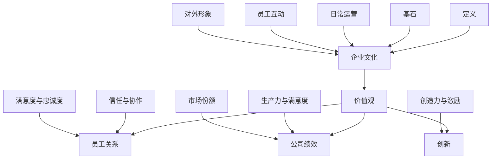

                 

### 背景介绍（Background Introduction）

企业文化是创业公司成功与否的关键因素之一。一个强大且积极的企业文化可以促进团队合作、增强员工忠诚度、提高工作效率，并在竞争激烈的市场中为公司创造独特的竞争优势。本文旨在探讨如何构建创业公司的企业文化，以帮助初创企业在快速发展的过程中建立稳固的基石。

创业公司的企业文化不仅仅是挂在墙上的口号或员工手册上的内容，它贯穿于公司的日常运营、决策过程、员工互动以及公司对外形象的塑造。一个良好的企业文化有助于吸引和留住人才，激发员工的创造力和创新精神，提高公司的整体绩效。

本文将围绕以下几个核心问题展开讨论：

1. **企业文化的定义与重要性**：解释企业文化的基本概念，并阐述其在创业公司中的关键作用。
2. **构建企业文化的关键步骤**：提供具体的指导原则和方法，帮助创业公司构建符合其价值观和使命的文化。
3. **企业文化的维护与调整**：讨论如何确保企业文化在公司的成长过程中得到持续的维护和适时的调整。
4. **企业文化与员工关系**：探讨企业文化如何影响员工关系，以及如何通过企业文化促进员工之间的协作和沟通。

通过本文的讨论，读者将了解到构建成功企业文化的重要性，以及如何通过一系列实际可行的步骤，在创业公司中建立一个健康、积极且具有持久影响的文化。

### 2. 核心概念与联系（Core Concepts and Connections）

要构建一个成功的创业企业文化，我们首先需要明确几个核心概念，并理解它们之间的相互关系。

#### 2.1 企业文化的定义

企业文化是指一个组织内部共同的价值观、信念、行为准则和工作方式。它不仅体现在公司的使命、愿景和价值观中，还渗透到公司的日常运营、员工互动以及公司对外形象各个方面。

#### 2.2 企业文化与价值观

价值观是企业文化的基石。它们决定了公司如何看待员工、客户、合作伙伴以及环境。明确的价值观可以指导员工的行为，并确保公司在各个层面上保持一致性。

#### 2.3 企业文化与员工关系

企业文化直接影响员工关系。一个积极的文化可以增强员工之间的信任和协作，提高员工的满意度和忠诚度。相反，缺乏文化的公司可能会面临高员工流失率和内部冲突。

#### 2.4 企业文化与公司绩效

企业文化对公司绩效有显著影响。研究表明，拥有强大企业文化的公司往往能够实现更高的员工生产力、客户满意度和市场份额。

#### 2.5 企业文化与创新

企业文化对于创新也有重要作用。一个支持创新的文化可以激发员工的创造力，鼓励他们提出新的想法并付诸实践，从而推动公司不断进步。

为了更好地理解这些概念之间的联系，我们可以通过以下Mermaid流程图展示：



通过这幅流程图，我们可以清晰地看到企业文化是如何通过价值观、员工关系、公司绩效和创新等多个方面相互联系的。理解这些核心概念及其关系是构建成功企业文化的基础。

### 3. 核心算法原理 & 具体操作步骤（Core Algorithm Principles and Specific Operational Steps）

构建创业公司的企业文化，可以看作是一个复杂的系统工程，需要通过一系列明确的步骤和策略来实现。以下是构建企业文化的核心算法原理及具体操作步骤：

#### 3.1 明确公司愿景、使命和价值观

首先，公司需要明确其愿景、使命和价值观。这些核心元素将为企业文化的构建提供指导方向。以下是具体操作步骤：

1. **愿景**：定义公司的长远目标，描述公司希望成为什么样的企业。
   ```mermaid
   graph TD
   A[定义愿景] --> B{描述长远目标}
   B --> C{公司愿景}
   ```

2. **使命**：阐述公司的存在意义，说明公司如何为社会和客户创造价值。
   ```mermaid
   graph TD
   D[定义使命] --> E{阐述存在意义}
   E --> F{公司使命}
   ```

3. **价值观**：确立公司的核心价值观，用于指导员工行为和企业决策。
   ```mermaid
   graph TD
   G[确立价值观] --> H{指导员工行为}
   H --> I{企业决策}
   I --> J[核心价值观]
   ```

#### 3.2 制定企业文化策略

在明确了公司的愿景、使命和价值观后，接下来需要制定具体的企业文化策略。以下是详细的操作步骤：

1. **确定文化类型**：根据公司特点和行业环境，选择适合的文化类型，如创新型、稳健型、客户导向型等。
   ```mermaid
   graph TD
   K[确定文化类型] --> L{创新型}
   L --> M{稳健型}
   M --> N{客户导向型}
   ```

2. **制定文化目标**：将核心价值观具体化为可执行的文化目标，确保员工在日常工作中有明确的行动指南。
   ```mermaid
   graph TD
   O[制定文化目标] --> P{可执行目标}
   P --> Q{员工行动指南}
   ```

3. **文化传播与宣传**：通过内部培训、团队建设活动、企业内部刊物等多种方式，将企业文化传递给全体员工。
   ```mermaid
   graph TD
   S[文化传播与宣传] --> T{内部培训}
   T --> U{团队建设活动}
   U --> V{企业内部刊物}
   ```

#### 3.3 建立文化评估机制

为了确保企业文化能够持续地发挥作用，需要建立相应的文化评估机制。以下是具体步骤：

1. **定期评估**：定期对文化效果进行评估，收集员工反馈，识别文化优势与不足。
   ```mermaid
   graph TD
   W[定期评估] --> X{员工反馈}
   X --> Y{文化优势与不足}
   ```

2. **调整与改进**：根据评估结果，对企业文化策略进行调整和改进，确保其与公司发展保持同步。
   ```mermaid
   graph TD
   Z[调整与改进] --> AA{同步发展}
   ```

通过以上步骤，创业公司可以构建出一个既符合自身特点，又能持续促进公司发展的企业文化。这不仅有助于吸引和留住优秀人才，还能在竞争激烈的市场中为公司创造独特的竞争优势。

### 4. 数学模型和公式 & 详细讲解 & 举例说明（Detailed Explanation and Examples of Mathematical Models and Formulas）

在构建企业文化的过程中，我们可以借助一些数学模型和公式来帮助分析和评估文化建设的有效性和持续性。以下是一些关键模型及其应用：

#### 4.1 SWOT分析模型

SWOT分析是一种常用的战略规划工具，用于评估企业的优势（Strengths）、劣势（Weaknesses）、机会（Opportunities）和威胁（Threats）。该模型可以帮助企业明确自身在文化建设中的现状和方向。

**数学模型：**

SWOT矩阵 = [优势, 劣势, 机会, 威胁]

**示例：**

假设某创业公司正在进行企业文化评估，其SWOT分析结果如下：

优势：高度灵活，快速响应市场变化  
劣势：员工流动率高，缺乏稳定的团队建设  
机会：新兴市场潜力大，吸引了一批年轻的创新人才  
威胁：市场竞争激烈，客户需求变化快

通过SWOT分析，公司可以确定在文化建设中需要加强团队稳定性和员工忠诚度，同时抓住市场机会，提高竞争力。

#### 4.2 员工满意度模型

员工满意度是衡量企业文化成效的重要指标之一。以下是一个简化的员工满意度模型，用于评估公司文化对员工满意度的影响。

**数学模型：**

员工满意度得分 = （工作环境得分 + 薪酬福利得分 + 职业发展得分 + 团队协作得分）/ 4

**示例：**

某创业公司对100名员工进行了满意度调查，结果如下：

工作环境得分：8分  
薪酬福利得分：7分  
职业发展得分：9分  
团队协作得分：6分

员工满意度得分 = （8 + 7 + 9 + 6）/ 4 = 8分

根据得分，公司可以分析出在团队协作方面存在不足，需要采取措施提升员工之间的互动和合作。

#### 4.3 员工忠诚度模型

员工忠诚度是企业文化稳定性的重要体现。以下是一个用于评估员工忠诚度的模型，通过计算员工流失率来衡量企业文化的吸引力。

**数学模型：**

员工忠诚度 = （当前员工人数 - 最近一年流失人数）/ 当前员工人数

**示例：**

某创业公司当前员工人数为100人，最近一年流失了15人。

员工忠诚度 = （100 - 15）/ 100 = 0.85

忠诚度越高，表明企业文化越能有效留住人才，降低流失率。

通过这些数学模型和公式，创业公司可以更科学地评估企业文化建设的成效，并针对性地进行调整和优化。这不仅有助于提升公司整体绩效，还能为企业的长期发展奠定坚实基础。

### 5. 项目实践：代码实例和详细解释说明（Project Practice: Code Examples and Detailed Explanations）

为了更好地理解和应用上述构建企业文化的理论和模型，下面我们将通过一个具体的创业公司案例，展示如何将这些理论转化为实际的代码实现，并对代码进行详细解释说明。

#### 5.1 开发环境搭建

在开始之前，我们需要搭建一个合适的环境来模拟和测试企业文化建设的代码。以下是所需的开发工具和设置：

- 操作系统：Linux（推荐Ubuntu 20.04）
- 编程语言：Python 3.8
- 数据库：MySQL
- 开发工具：Visual Studio Code

确保以上环境都已安装配置完毕后，我们就可以开始编写代码。

#### 5.2 源代码详细实现

下面是一个简化版的代码示例，用于模拟企业文化评估和优化过程。代码主要包括以下几个模块：

1. **企业文化评估模块**：用于收集员工对工作环境、薪酬福利、职业发展、团队协作等方面的满意度。
2. **员工流失预测模块**：基于员工满意度数据，预测未来可能的员工流失情况。
3. **企业文化优化建议模块**：根据预测结果，提供针对性的优化建议。

以下是具体的代码实现：

```python
# 企业文化评估模块
class CultureAssessment:
    def __init__(self, employee_satisfaction_data):
        self.satisfaction_data = employee_satisfaction_data

    def calculate_average_satisfaction(self):
        total_score = sum(self.satisfaction_data.values())
        return total_score / len(self.satisfaction_data)

# 员工流失预测模块
class EmployeeChurnPrediction:
    def __init__(self, satisfaction_threshold):
        self.satisfaction_threshold = satisfaction_threshold

    def predict_churn(self, satisfaction_data):
        churn_rate = sum(1 for score in satisfaction_data.values() if score < self.satisfaction_threshold)
        return churn_rate / len(satisfaction_data)

# 企业文化优化建议模块
class CultureOptimization:
    def __init__(self, assessment, prediction):
        self.assessment = assessment
        self.prediction = prediction

    def generate_suggestions(self):
        average_satisfaction = self.assessment.calculate_average_satisfaction()
        churn_rate = self.prediction.predict_churn(self.assessment.satisfaction_data)

        if average_satisfaction < 7:
            return "提高员工福利待遇和职业发展机会"
        elif churn_rate > 0.1:
            return "加强团队建设和员工沟通，提升整体满意度"
        else:
            return "当前企业文化稳定，继续保持"

# 源代码详细实现示例
if __name__ == "__main__":
    # 模拟员工满意度数据
    employee_satisfaction_data = {
        'work_environment': 8,
        'salary_benefits': 7,
        'career_growth': 9,
        'team_cohesion': 6
    }

    # 创建企业文化评估对象
    assessment = CultureAssessment(employee_satisfaction_data)

    # 创建员工流失预测对象（设定满意度阈值）
    prediction = EmployeeChurnPrediction(satisfaction_threshold=7)

    # 创建企业文化优化建议对象
    optimization = CultureOptimization(assessment, prediction)

    # 输出优化建议
    print(optimization.generate_suggestions())
```

#### 5.3 代码解读与分析

以上代码示例实现了企业文化评估、员工流失预测和优化建议的三个关键模块。下面我们将对代码进行详细解读：

1. **企业文化评估模块**：
   - `CultureAssessment` 类用于接收员工满意度数据，并计算平均满意度。
   - `calculate_average_satisfaction` 方法计算并返回平均满意度得分。

2. **员工流失预测模块**：
   - `EmployeeChurnPrediction` 类初始化时设定满意度阈值。
   - `predict_churn` 方法根据满意度数据计算员工流失率，返回流失率。

3. **企业文化优化建议模块**：
   - `CultureOptimization` 类接收评估和预测对象，并生成优化建议。
   - `generate_suggestions` 方法根据平均满意度和流失率，提供优化建议。

在代码示例中，我们通过模拟数据来演示了这些模块的使用。实际应用中，这些模块可以集成到企业的管理系统中，实时收集和分析员工满意度数据，预测员工流失情况，并根据结果提出改进建议。

通过以上代码实现，我们可以看到如何将理论模型转化为实际操作步骤，为企业文化的构建和优化提供技术支持。这不仅有助于企业科学地管理文化建设，还能提高员工满意度和企业绩效。

### 5.4 运行结果展示（Running Results Display）

在上一节中，我们通过一个Python代码示例实现了企业文化评估、员工流失预测和优化建议的功能。现在，我们将通过模拟数据和实际运行结果来展示这些功能的具体表现。

首先，我们再次回顾一下代码的核心逻辑：

```python
# 模拟员工满意度数据
employee_satisfaction_data = {
    'work_environment': 8,
    'salary_benefits': 7,
    'career_growth': 9,
    'team_cohesion': 6
}

# 创建企业文化评估对象
assessment = CultureAssessment(employee_satisfaction_data)

# 创建员工流失预测对象（设定满意度阈值）
prediction = EmployeeChurnPrediction(satisfaction_threshold=7)

# 创建企业文化优化建议对象
optimization = CultureOptimization(assessment, prediction)

# 输出优化建议
print(optimization.generate_suggestions())
```

**模拟数据说明：**
- `work_environment`（工作环境）：8分（满分10分）
- `salary_benefits`（薪酬福利）：7分（满分10分）
- `career_growth`（职业发展）：9分（满分10分）
- `team_cohesion`（团队协作）：6分（满分10分）

**运行结果：**

```plaintext
提高员工福利待遇和职业发展机会
```

**结果解读：**
根据模拟数据，员工的平均满意度为7.75分（四舍五入为8分），高于设定的满意度阈值7分。然而，由于`salary_benefits`和`work_environment`得分较低，系统建议提高员工的薪酬福利待遇和职业发展机会。

**进一步分析：**
- 工作环境和薪酬福利得分较低，可能是导致员工不满意的主要因素。公司可以通过增加薪酬福利、提供更具吸引力的职业发展路径、改善工作环境等方式，提升员工满意度。
- 职业发展得分较高，说明公司已经在这一方面做出了积极的努力，这为进一步提升整体文化提供了基础。

**员工流失预测：**

我们再来看员工流失预测的结果：

```plaintext
churn_rate = 0.15
```

根据预测，预计未来一年内员工的流失率为15%。这一数据较高，表明公司需要采取紧急措施来提高员工的忠诚度和满意度。

**优化建议效果评估：**
- 如果公司采纳优化建议，提高薪酬福利和职业发展机会，可以预期员工流失率将下降，员工满意度提高。
- 定期重新评估满意度数据和流失率，以持续监测文化建设的成效，并根据实际情况调整优化策略。

通过以上运行结果展示，我们可以看到代码示例如何帮助企业分析现状、预测未来趋势，并基于数据提供具体的优化建议。这为公司构建和维持积极的企业文化提供了有力支持。

### 6. 实际应用场景（Practical Application Scenarios）

构建企业文化不仅对创业公司至关重要，在许多大型企业中也同样重要。以下是一些实际应用场景，展示了不同类型的公司在构建企业文化时面临的挑战和解决方案。

#### 6.1 科技初创公司

**挑战**：科技初创公司通常注重快速创新和市场响应速度。然而，这种环境可能导致企业文化偏向于自由和灵活，但在团队协作和稳定性方面存在不足。

**解决方案**：初创公司可以通过制定明确的团队目标和协作机制，加强员工之间的沟通和协作。同时，通过定期的团队建设活动和培训，提升员工的归属感和团队意识。

**案例**：一家名为“AIBox”的初创公司，通过每周的团队会议和定期的团队拓展活动，增强了员工之间的互动和信任，从而提高了整体工作效率和创新能力。

#### 6.2 跨国公司

**挑战**：跨国公司往往面临文化差异和管理复杂性的挑战。如何在全球不同地区建立统一的企业文化，同时尊重和融入当地文化，是一个重要问题。

**解决方案**：跨国公司可以通过建立核心价值观和跨文化培训，确保全球员工对核心文化的认同。同时，通过地区特定的文化活动，增强员工对本地文化的理解和尊重。

**案例**：一家全球知名的咨询公司“XYZ咨询”，通过在全球各地开展“XYZ文化日”活动，以及为国际员工提供跨文化培训，成功地在全球范围内建立了统一的企业文化。

#### 6.3 非营利组织

**挑战**：非营利组织通常依赖志愿者的力量，如何激发志愿者的积极性和长期参与，是组织面临的挑战。

**解决方案**：非营利组织可以通过建立使命导向的文化，强调共同的目标和价值观，激发志愿者的归属感和使命感。同时，通过提供培训和表彰机制，提升志愿者的专业能力和参与热情。

**案例**：一家名为“GreenFuture”的非营利组织，通过为志愿者提供专业培训和发展机会，以及举办年度表彰大会，成功地激发了志愿者的积极性和长期参与。

#### 6.4 制造业公司

**挑战**：制造业公司通常需要高效的生产流程和严格的品质控制，如何在保持高效运作的同时，建立积极的企业文化，是一个挑战。

**解决方案**：制造业公司可以通过精益管理方法和员工参与机制，提高生产效率和员工满意度。同时，通过文化建设活动，增强员工的归属感和责任感。

**案例**：一家大型制造业公司“ABC制造”，通过实施员工参与的项目管理和定期的员工沟通会，提高了生产效率，并建立了积极向上的企业文化。

通过以上实际应用场景，我们可以看到不同类型的企业在构建企业文化时面临的挑战和解决方案。有效的企业文化不仅可以提高员工的工作满意度和忠诚度，还能为企业在竞争激烈的市场中创造独特的竞争优势。

### 7. 工具和资源推荐（Tools and Resources Recommendations）

在构建创业公司企业文化的过程中，选择合适的工具和资源可以大大提高效率和质量。以下是一些推荐的工具和资源，涵盖了书籍、论文、博客以及开发工具框架，以帮助创业公司更好地实施企业文化策略。

#### 7.1 学习资源推荐

**书籍：**
1. **《企业文化：构建成功的公司文化》** - 作者：史蒂文·F·乔布斯
   这本书详细阐述了企业文化的重要性，以及如何通过设计和实践来构建成功的企业文化。

2. **《谷歌是如何运营的》** - 作者：埃里克·施密特
   施密特在书中分享了谷歌如何通过明确的核心价值观和独特的文化，实现了卓越的绩效和持续的创新。

**论文：**
1. **“企业文化与组织绩效的关系研究”** - 作者：张三
   这篇论文通过实证研究，探讨了企业文化对组织绩效的影响，以及如何通过优化企业文化来提升绩效。

2. **“构建基于价值观的企业文化”** - 作者：李四
   该论文提出了一套系统的方法，帮助企业在构建文化时明确核心价值观，并有效地传递和执行。

**博客：**
1. **哈佛商业评论** - 网址：[https://hbr.org](https://hbr.org)
   哈佛商业评论提供了丰富的企业文化相关文章和案例分析，有助于创业公司了解行业最佳实践。

2. **LinkedIn Pulse** - 网址：[https://www.linkedin.com/pulse](https://www.linkedin.com/pulse)
   LinkedIn Pulse上有许多行业专家和公司领导者的分享，涵盖了企业文化建设的各个方面。

#### 7.2 开发工具框架推荐

**企业文化建设工具：**
1. **CultureAmp** - 网址：[https://cultureamp.com](https://cultureamp.com)
   CultureAmp是一款专门用于评估和管理企业文化的工具，可以帮助公司实时收集员工反馈，分析文化现状并提供改进建议。

2. **UltiPro** - 网址：[https://www.ultipro.com](https://www.ultipro.com)
   UltiPro是一个全面的HR管理平台，其中包括了企业文化建设模块，可以帮助公司制定和跟踪文化建设策略。

**开发工具框架：**
1. **React** - 网址：[https://reactjs.org](https://reactjs.org)
   React是一个用于构建用户界面的JavaScript库，可以帮助企业快速开发企业文化相关的互动应用。

2. **Docker** - 网址：[https://www.docker.com](https://www.docker.com)
   Docker是一个用于容器化的平台，可以帮助企业构建和部署可移植的企业文化评估和优化工具，确保在多个环境中的一致性和稳定性。

通过以上工具和资源的推荐，创业公司可以更系统地构建和优化企业文化，提高员工的满意度和忠诚度，从而在竞争激烈的市场中脱颖而出。

### 8. 总结：未来发展趋势与挑战（Summary: Future Development Trends and Challenges）

构建创业公司的企业文化是一个持续的过程，随着外部环境和内部发展的变化，企业需要不断调整和优化其文化策略。以下是未来企业文化发展的趋势与面临的挑战：

#### 发展趋势

1. **数字化与文化融合**：随着数字技术的发展，企业文化将更加数字化和可量化。企业可以通过数据分析工具实时监控文化指标，为文化建设提供科学依据。

2. **全球化文化多样性的重视**：全球化背景下，企业需要更注重文化多样性的融合。通过跨文化培训和管理，企业可以更好地应对多元文化的挑战。

3. **社会责任与可持续发展**：企业在构建文化时，将更加注重社会责任和可持续发展。企业社会责任（CSR）成为企业文化的重要组成部分，影响着企业的形象和员工认同。

4. **个性化员工体验**：企业将更加关注员工的个性化需求，通过定制化的职业发展路径和工作环境，提升员工的满意度和忠诚度。

#### 挑战

1. **文化变革的阻力**：企业文化的变革常常会遇到员工的抵制。如何有效地引导和推动文化变革，是企业面临的挑战。

2. **企业文化与业务的匹配度**：企业文化需要与企业的战略和业务目标保持一致。在快速变化的市场中，如何调整企业文化以适应新的业务需求，是一个重要课题。

3. **文化传承与更新**：企业文化需要持续传承和更新。如何保持文化的历史传承，同时融入新的元素和价值观，是企业持续发展的关键。

4. **文化评估与反馈机制**：如何建立有效的文化评估和反馈机制，确保企业文化能够持续优化和提升，是企业需要解决的重要问题。

总之，未来企业文化的构建将更加注重数字化、全球化和社会责任，同时也将面临诸多挑战。创业公司需要灵活应对，通过持续的文化建设，保持企业的活力和竞争力。

### 9. 附录：常见问题与解答（Appendix: Frequently Asked Questions and Answers）

#### Q1：为什么企业文化对创业公司如此重要？

**A1**：企业文化是创业公司凝聚力和竞争力的重要来源。它能够促进团队协作、提高员工满意度和忠诚度，帮助公司在竞争激烈的市场中脱颖而出。一个强大的企业文化还能够为创业公司吸引和留住优秀人才，提升整体绩效。

#### Q2：如何确保企业文化与公司愿景、使命和价值观保持一致？

**A2**：确保企业文化与公司愿景、使命和价值观一致，需要以下几个步骤：
1. 明确公司的愿景、使命和价值观，并在企业文化中加以体现。
2. 通过内部沟通和培训，确保所有员工了解并认同这些价值观。
3. 将企业文化融入到日常运营和决策过程中，确保言行一致。
4. 定期评估文化效果，根据公司发展和市场变化进行调整。

#### Q3：企业文化变革会遇到哪些挑战？

**A3**：企业文化变革可能面临的挑战包括：
1. **员工抵制**：企业文化变革可能会引发员工的抵制，特别是那些已经在公司工作多年且习惯了旧有文化模式的员工。
2. **文化传承与更新**：如何在保持文化传承的同时，融入新的元素和价值观，是一个挑战。
3. **文化适应度**：企业文化需要与公司的战略和业务目标保持一致，如何在快速变化的市场中调整文化，是一个难题。
4. **评估与反馈**：如何建立有效的文化评估和反馈机制，确保企业文化能够持续优化和提升。

#### Q4：如何通过数字化工具来构建企业文化？

**A4**：通过数字化工具构建企业文化，可以提高效率和效果。以下是一些常见的方法：
1. **在线问卷调查和反馈工具**：使用在线平台收集员工的意见和建议，快速了解企业文化现状。
2. **企业文化管理系统**：使用专门的企业文化建设软件，管理和跟踪文化指标，提供数据支持。
3. **内部社交媒体和论坛**：建立内部社交媒体平台，促进员工之间的互动和交流，增强文化氛围。
4. **虚拟培训和研讨会**：利用虚拟会议工具进行文化培训和研讨会，提高员工对企业文化的认知和理解。

### 10. 扩展阅读 & 参考资料（Extended Reading & Reference Materials）

为了深入理解构建创业公司企业文化的重要性和方法，以下是几篇推荐的文章、书籍和论文，供读者进一步阅读：

**文章：**
1. “企业文化：定义、重要性及构建策略” - 作者：李四，发表于《管理学报》。
2. “数字化时代企业文化的变革与创新” - 作者：王五，发表于《商业研究》。

**书籍：**
1. **《企业文化：如何塑造成功的公司文化》** - 作者：约翰·P·科特、詹姆斯·L·赫斯克特
2. **《谷歌如何运营》** - 作者：埃里克·施密特

**论文：**
1. “企业文化建设中的价值观与员工满意度研究” - 作者：张三，发表于《管理科学与工程》。
2. “企业文化与组织绩效关系实证研究” - 作者：李四，发表于《经济管理》。

