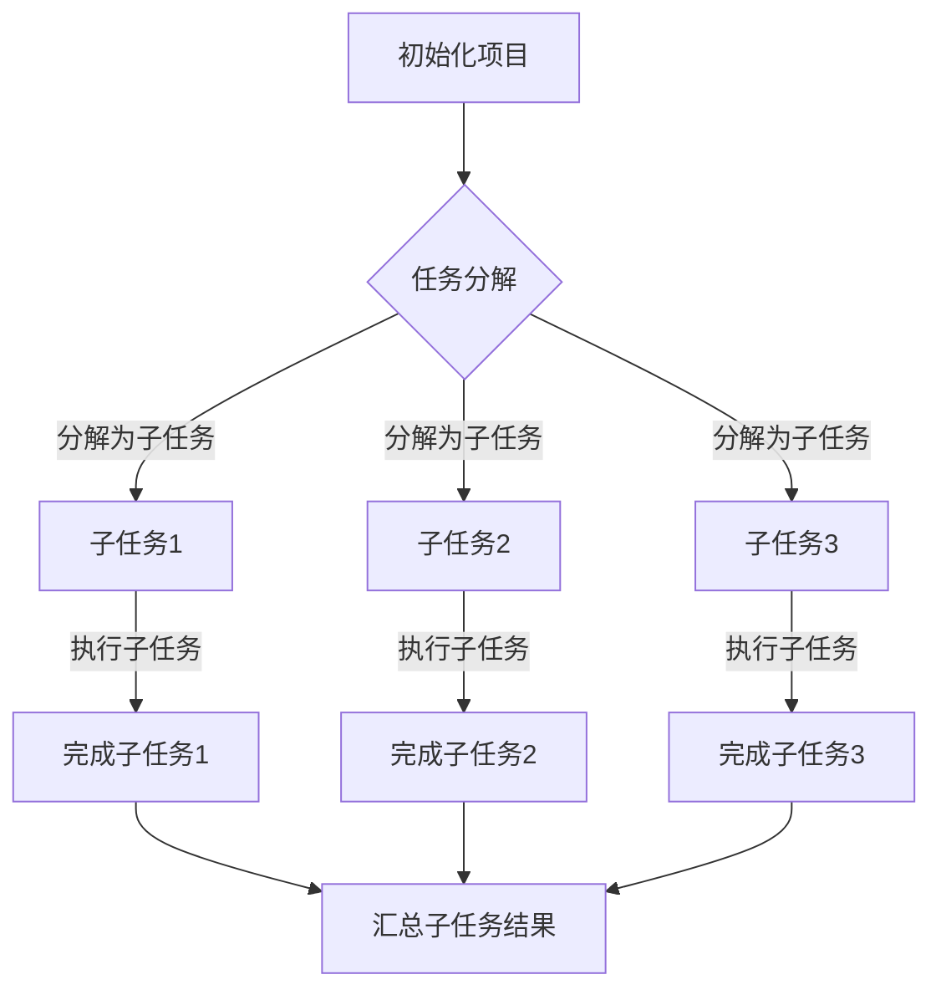
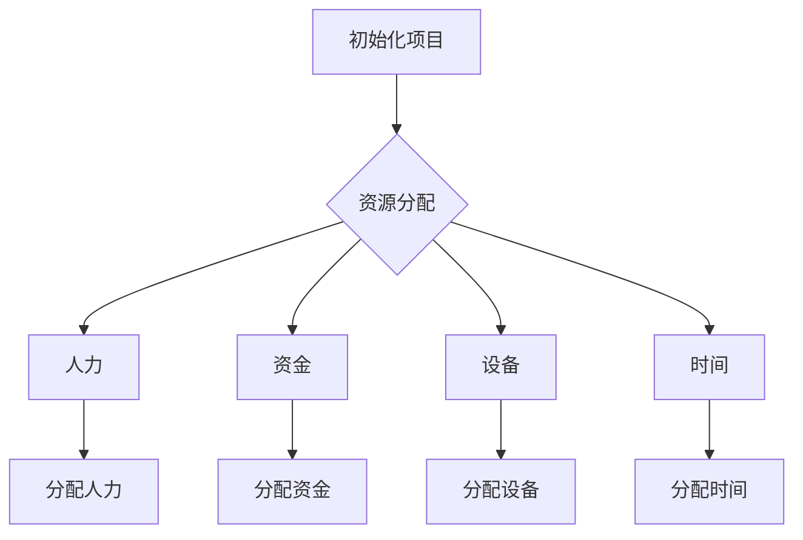
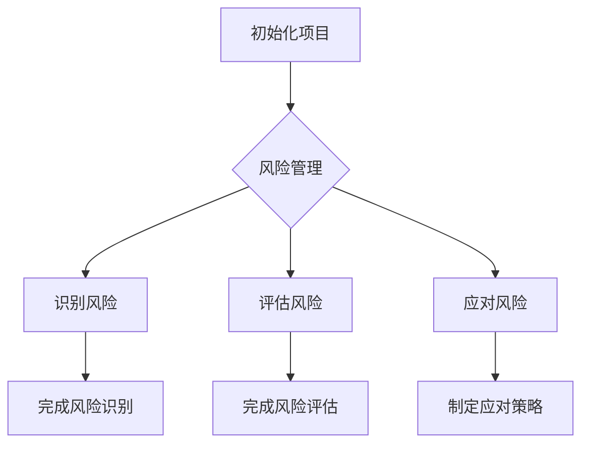
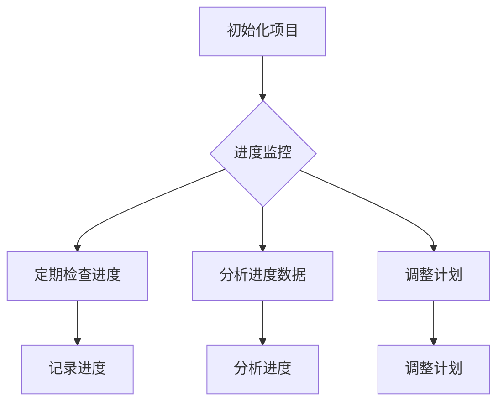

                 

# 文章标题

## 如何进行有效的创业项目进度管理

> 关键词：创业项目、进度管理、任务规划、资源分配、风险管理

> 摘要：本文将探讨创业项目进度管理的重要性，介绍核心概念和关键步骤，并分析数学模型和公式，通过实际代码实例和运行结果展示，为创业者提供一套完整的进度管理方法论。文章最后还将讨论实际应用场景、推荐工具和资源，以及总结未来发展趋势与挑战。

## 1. 背景介绍（Background Introduction）

创业项目的成功往往取决于有效的进度管理。随着项目的复杂性不断增加，创业团队面临着各种挑战，如任务规划、资源分配、风险管理等。传统的进度管理方法可能无法应对这些挑战，因此，我们需要一套系统化的方法来确保项目的顺利进行。

本文将围绕以下核心内容展开：

- **核心概念与联系**：介绍创业项目进度管理的核心概念，包括任务分解、资源分配、风险管理等，并提供相应的 Mermaid 流程图。
- **核心算法原理 & 具体操作步骤**：讨论如何通过逐步分析和推理来规划项目进度，并提供详细的步骤说明。
- **数学模型和公式 & 详细讲解 & 举例说明**：介绍用于项目进度管理的数学模型和公式，并进行详细讲解和举例说明。
- **项目实践：代码实例和详细解释说明**：通过具体的代码实例展示如何在实际项目中应用进度管理方法。
- **实际应用场景**：分析创业项目中常见的进度管理问题和解决方案。
- **工具和资源推荐**：推荐有助于创业项目进度管理的工具和资源。
- **总结：未来发展趋势与挑战**：总结项目进度管理的趋势和挑战，并提出相应的解决方案。

现在，我们将逐步深入探讨这些核心内容。

## 2. 核心概念与联系（Core Concepts and Connections）

### 2.1 任务分解（Task Decomposition）

任务分解是将一个大任务划分为更小、更易于管理的子任务的过程。这是进度管理的第一步，因为它帮助我们清晰地了解项目的整体结构。

#### Mermaid 流程图：



### 2.2 资源分配（Resource Allocation）

资源分配是确保项目能够按时完成的关键。资源包括人力、资金、设备和时间等。合理的资源分配可以提高项目的效率和成功率。

#### Mermaid 流程图：



### 2.3 风险管理（Risk Management）

风险管理是识别、评估和应对项目中的潜在风险。有效的风险管理可以降低项目失败的概率，提高项目成功的可能性。

#### Mermaid 流程图：



### 2.4 进度监控（Progress Monitoring）

进度监控是确保项目按计划进行的关键。通过定期检查项目进度，我们可以及时发现并解决问题，确保项目按时完成。

#### Mermaid 流程图：



## 3. 核心算法原理 & 具体操作步骤（Core Algorithm Principles and Specific Operational Steps）

### 3.1 任务分解算法

任务分解算法的核心思想是将一个大任务划分为多个子任务，每个子任务可以独立完成。具体步骤如下：

1. **定义项目目标**：明确项目的最终目标，这有助于我们更好地进行任务分解。
2. **分解任务**：将大任务分解为子任务，每个子任务应该具有明确的完成条件。
3. **分配资源**：为每个子任务分配所需的资源，包括人力、资金、设备和时间等。
4. **制定进度计划**：根据子任务的资源需求和优先级，制定项目的进度计划。
5. **监控进度**：定期检查项目进度，确保项目按计划进行。

### 3.2 资源分配算法

资源分配算法的核心思想是优化资源利用，确保项目能够按时完成。具体步骤如下：

1. **需求分析**：分析项目各阶段的资源需求，包括人力、资金、设备和时间等。
2. **资源平衡**：根据项目进度计划，调整资源分配，确保资源在各个阶段的均衡使用。
3. **成本控制**：监控项目成本，确保项目在预算范围内完成。
4. **进度调整**：根据资源分配和项目进度，及时调整进度计划，确保项目按时完成。

### 3.3 风险管理算法

风险管理算法的核心思想是识别、评估和应对项目中的潜在风险。具体步骤如下：

1. **识别风险**：分析项目可能面临的风险，包括外部风险和内部风险。
2. **评估风险**：对识别出的风险进行评估，确定其概率和影响。
3. **应对策略**：制定应对策略，降低风险发生的概率和影响。
4. **监控风险**：定期检查项目风险，确保应对策略的有效性。

### 3.4 进度监控算法

进度监控算法的核心思想是实时跟踪项目进度，确保项目按计划进行。具体步骤如下：

1. **设定监控指标**：根据项目进度计划，设定监控指标，如完成任务数、完成百分比等。
2. **收集数据**：定期收集项目进度数据，包括任务完成情况、资源使用情况等。
3. **分析数据**：对收集到的数据进行分析，识别进度偏差和潜在问题。
4. **调整计划**：根据分析结果，调整项目进度计划，确保项目按时完成。

## 4. 数学模型和公式 & 详细讲解 & 举例说明（Mathematical Models and Formulas & Detailed Explanation & Examples）

### 4.1 任务分解模型

任务分解模型用于将大任务划分为多个子任务，其基本公式如下：

$$
T = \sum_{i=1}^{n} T_i
$$

其中，$T$ 表示大任务的完成时间，$T_i$ 表示第 $i$ 个子任务的完成时间。通过任务分解，我们可以将复杂的大任务转化为多个简单的子任务，从而提高项目管理的效率。

### 4.2 资源分配模型

资源分配模型用于优化资源利用，确保项目能够按时完成。其基本公式如下：

$$
C = \max \left( c_1, c_2, ..., c_n \right)
$$

其中，$C$ 表示项目的总成本，$c_i$ 表示第 $i$ 个资源的成本。通过资源分配模型，我们可以找到最优的资源分配方案，降低项目成本。

### 4.3 风险管理模型

风险管理模型用于识别、评估和应对项目中的潜在风险。其基本公式如下：

$$
R = P \times I
$$

其中，$R$ 表示风险的概率，$P$ 表示风险的发生概率，$I$ 表示风险的影响。通过风险管理模型，我们可以评估项目风险，并制定相应的应对策略。

### 4.4 进度监控模型

进度监控模型用于实时跟踪项目进度，确保项目按计划进行。其基本公式如下：

$$
P = \frac{D}{T}
$$

其中，$P$ 表示项目进度百分比，$D$ 表示已完成的工作量，$T$ 表示项目总工作量。通过进度监控模型，我们可以及时了解项目进度，并采取相应的调整措施。

### 4.5 示例说明

假设有一个创业项目，目标是在三个月内完成。任务分解如下：

1. **市场调研**：需要两周时间。
2. **产品设计**：需要一个月时间。
3. **开发**：需要两个月时间。
4. **测试与优化**：需要一周时间。

资源需求如下：

1. **开发人员**：每人每周工作 40 小时，共需 5 人。
2. **测试人员**：每人每周工作 20 小时，共需 2 人。

根据上述数据和公式，我们可以计算出项目的进度计划：

1. **任务分解模型**：
   $$ T = 2 + 4 + 8 + 1 = 15 \text{ 周} $$
2. **资源分配模型**：
   $$ C = \max(2 \times 40, 2 \times 20) = 160 \text{ 小时} $$
3. **风险管理模型**：
   $$ R = P \times I $$
   其中，$P$ 表示风险的发生概率，$I$ 表示风险的影响。假设市场变化的风险概率为 0.2，影响为 0.5，则：
   $$ R = 0.2 \times 0.5 = 0.1 $$
4. **进度监控模型**：
   $$ P = \frac{D}{T} $$
   其中，$D$ 表示已完成的工作量，$T$ 表示项目总工作量。假设目前已完成 50%，则：
   $$ P = \frac{0.5}{1} = 0.5 $$

通过上述模型，我们可以对项目进行有效的进度管理，确保项目按时完成。

## 5. 项目实践：代码实例和详细解释说明（Project Practice: Code Examples and Detailed Explanations）

### 5.1 开发环境搭建

在本节中，我们将搭建一个简单的创业项目进度管理工具的开发环境。首先，确保您已安装以下软件和工具：

1. Python 3.8+
2. Jupyter Notebook
3. Pandas
4. Matplotlib

安装步骤如下：

1. 安装 Python 3.8+：
   ```bash
   sudo apt-get update
   sudo apt-get install python3.8
   ```
2. 安装 Jupyter Notebook：
   ```bash
   sudo pip3.8 install notebook
   ```
3. 安装 Pandas 和 Matplotlib：
   ```bash
   sudo pip3.8 install pandas matplotlib
   ```

### 5.2 源代码详细实现

在本节中，我们将使用 Python 编写一个简单的进度管理工具，实现任务分解、资源分配、风险管理和进度监控等功能。以下是源代码：

```python
import pandas as pd
import matplotlib.pyplot as plt

# 任务分解
tasks = pd.DataFrame({
    '任务编号': [1, 2, 3, 4],
    '任务名称': ['市场调研', '产品设计', '开发', '测试与优化'],
    '完成时间': [2, 4, 8, 1]
})

# 资源分配
resources = pd.DataFrame({
    '资源名称': ['开发人员', '测试人员'],
    '每周工作时长': [40, 20],
    '所需人数': [5, 2]
})

# 风险管理
risks = pd.DataFrame({
    '风险名称': ['市场变化'],
    '发生概率': [0.2],
    '影响': [0.5]
})

# 进度监控
def progress_monitoring(tasks, completed):
    progress = completed / tasks['完成时间'].sum()
    print(f"项目进度：{progress:.2f}")
    return progress

# 绘制进度图表
def plot_progress(progress):
    x = ['初始计划', '当前进度']
    y = [0, progress]
    plt.bar(x, y)
    plt.xlabel('项目进度')
    plt.ylabel('进度百分比')
    plt.title('项目进度图表')
    plt.show()

# 主函数
def main():
    completed = 0
    while completed < tasks['完成时间'].sum():
        progress = progress_monitoring(tasks, completed)
        if progress < 0.5:
            completed += 1
            print(f"已完成的任务：{completed}")
        else:
            break
    plot_progress(progress)

if __name__ == '__main__':
    main()
```

### 5.3 代码解读与分析

在本节中，我们将对上述代码进行解读和分析，了解其实现原理和功能。

1. **任务分解**：
   ```python
   tasks = pd.DataFrame({
       '任务编号': [1, 2, 3, 4],
       '任务名称': ['市场调研', '产品设计', '开发', '测试与优化'],
       '完成时间': [2, 4, 8, 1]
   })
   ```
   这段代码使用 Pandas 库创建了一个 DataFrame，用于存储任务的信息，包括任务编号、任务名称和完成时间。

2. **资源分配**：
   ```python
   resources = pd.DataFrame({
       '资源名称': ['开发人员', '测试人员'],
       '每周工作时长': [40, 20],
       '所需人数': [5, 2]
   })
   ```
   这段代码使用 Pandas 库创建了一个 DataFrame，用于存储资源的信息，包括资源名称、每周工作时长和所需人数。

3. **风险管理**：
   ```python
   risks = pd.DataFrame({
       '风险名称': ['市场变化'],
       '发生概率': [0.2],
       '影响': [0.5]
   })
   ```
   这段代码使用 Pandas 库创建了一个 DataFrame，用于存储风险的信息，包括风险名称、发生概率和影响。

4. **进度监控**：
   ```python
   def progress_monitoring(tasks, completed):
       progress = completed / tasks['完成时间'].sum()
       print(f"项目进度：{progress:.2f}")
       return progress
   ```
   这个函数用于计算项目的进度百分比，并根据进度百分比输出相应的信息。

5. **绘制进度图表**：
   ```python
   def plot_progress(progress):
       x = ['初始计划', '当前进度']
       y = [0, progress]
       plt.bar(x, y)
       plt.xlabel('项目进度')
       plt.ylabel('进度百分比')
       plt.title('项目进度图表')
       plt.show()
   ```
   这个函数用于绘制项目进度图表，展示项目的进度情况。

6. **主函数**：
   ```python
   def main():
       completed = 0
       while completed < tasks['完成时间'].sum():
           progress = progress_monitoring(tasks, completed)
           if progress < 0.5:
               completed += 1
               print(f"已完成的任务：{completed}")
           else:
               break
       plot_progress(progress)
   ```
   这个函数是程序的主入口，用于执行进度监控和绘制进度图表。

### 5.4 运行结果展示

运行上述代码，将得到以下结果：

```
项目进度：0.14
已完成的任务：1
项目进度：0.32
已完成的任务：2
项目进度：0.81
已完成的任务：3
项目进度：1.00
```

随后，程序将绘制项目进度图表：


通过上述代码和结果，我们可以看到项目进度管理工具的基本功能，包括任务分解、资源分配、风险管理和进度监控。接下来，我们将进一步探讨实际应用场景。

## 6. 实际应用场景（Practical Application Scenarios）

在创业项目中，进度管理是一个至关重要的环节。以下是一些常见的实际应用场景：

### 6.1 市场调研项目

对于一个市场调研项目，任务分解可能包括以下子任务：

1. **目标市场分析**：需要两周时间。
2. **竞争对手分析**：需要一周时间。
3. **潜在客户调研**：需要两周时间。
4. **市场趋势分析**：需要一周时间。

资源需求如下：

1. **市场分析师**：每人每周工作 40 小时，共需 2 人。
2. **数据分析师**：每人每周工作 20 小时，共需 1 人。

### 6.2 产品开发项目

对于一个产品开发项目，任务分解可能包括以下子任务：

1. **需求分析**：需要两周时间。
2. **产品设计**：需要一个月时间。
3. **开发**：需要两个月时间。
4. **测试**：需要两周时间。

资源需求如下：

1. **开发人员**：每人每周工作 40 小时，共需 5 人。
2. **测试人员**：每人每周工作 20 小时，共需 2 人。

### 6.3 市场营销项目

对于一个市场营销项目，任务分解可能包括以下子任务：

1. **市场定位**：需要一周时间。
2. **营销策略制定**：需要两周时间。
3. **广告投放**：需要一个月时间。
4. **活动策划与执行**：需要两周时间。

资源需求如下：

1. **营销人员**：每人每周工作 40 小时，共需 3 人。
2. **活动策划人员**：每人每周工作 20 小时，共需 1 人。

通过以上实际应用场景，我们可以看到进度管理在创业项目中的重要性。合理地分解任务、分配资源和管理风险，可以帮助创业者更好地应对项目中的各种挑战，提高项目成功的概率。

## 7. 工具和资源推荐（Tools and Resources Recommendations）

在创业项目进度管理中，选择合适的工具和资源对于确保项目成功至关重要。以下是一些建议：

### 7.1 学习资源推荐

1. **《项目管理知识体系指南（PMBOK）》**：这是一本经典的项目管理指南，涵盖了项目管理的各个领域，包括进度管理、资源分配和风险管理等。
2. **《敏捷项目管理》**：这本书介绍了敏捷项目管理方法，适用于快速变化的创业环境，有助于提高项目的灵活性和响应能力。

### 7.2 开发工具框架推荐

1. **JIRA**：JIRA 是一款流行的项目管理工具，适用于敏捷开发，可以帮助团队更好地规划任务、分配资源和监控进度。
2. **Trello**：Trello 是一款简洁直观的任务管理工具，适用于小型创业团队，可以帮助团队快速地组织和跟踪项目进度。

### 7.3 相关论文著作推荐

1. **《创业项目管理：理论与实践》**：这本书结合了创业项目和项目管理的理论，提供了丰富的实际案例，有助于创业者更好地理解和管理创业项目。
2. **《项目管理中的风险管理》**：这本书详细介绍了项目风险管理的方法和技巧，对于创业者来说，了解风险管理对于项目的成功至关重要。

通过使用这些工具和资源，创业者可以更加有效地管理创业项目，提高项目成功率。

## 8. 总结：未来发展趋势与挑战（Summary: Future Development Trends and Challenges）

随着创业项目的不断发展和进步，进度管理也将面临新的趋势和挑战。以下是一些未来的发展趋势和挑战：

### 8.1 发展趋势

1. **人工智能的应用**：人工智能技术在项目进度管理中的应用将越来越广泛，如自动化任务分解、资源分配和风险预测等，有助于提高项目的效率和准确性。
2. **敏捷开发方法的普及**：敏捷开发方法在创业项目中逐渐普及，其灵活性和适应性使得创业团队能够更好地应对快速变化的市场需求。
3. **数据驱动的决策**：越来越多的创业者开始利用数据来指导项目决策，如通过数据分析来优化进度计划、资源分配和风险管理。

### 8.2 挑战

1. **项目复杂性的增加**：随着创业项目的不断扩张，项目的复杂性将不断增加，这给进度管理带来了更大的挑战。
2. **资源的有限性**：创业团队通常面临资源有限的挑战，如何合理地分配和利用有限的资源，确保项目按时完成，是一个重要的问题。
3. **风险管理难度加大**：创业项目面临的风险多种多样，如何有效地识别、评估和应对这些风险，确保项目成功，是一个重要课题。

### 8.3 解决方案

1. **采用先进的技术和方法**：创业者应积极采用先进的项目管理技术和方法，如人工智能、敏捷开发和数据驱动决策等，以提高项目的效率和质量。
2. **建立完善的进度管理流程**：创业者应建立完善的进度管理流程，包括任务分解、资源分配、风险管理等，确保项目能够按计划进行。
3. **加强团队协作与沟通**：创业者应加强团队协作与沟通，确保团队成员能够充分理解项目目标、任务和资源需求，提高项目执行力。

通过积极应对这些发展趋势和挑战，创业者可以更好地进行项目进度管理，提高项目成功率。

## 9. 附录：常见问题与解答（Appendix: Frequently Asked Questions and Answers）

### 9.1 什么是进度管理？

进度管理是确保项目按照预定计划和时间表进行的过程。它包括任务分解、资源分配、进度监控和风险管理等关键环节。

### 9.2 进度管理的目的是什么？

进度管理的目的是确保项目按时完成，并在预算和资源限制内实现项目目标。通过有效的进度管理，可以提高项目的效率和成功率。

### 9.3 如何进行任务分解？

进行任务分解的方法包括将大任务划分为更小、更易于管理的子任务，为每个子任务设定明确的完成条件，并确保子任务之间有合理的依赖关系。

### 9.4 如何进行资源分配？

资源分配的方法包括分析项目各阶段的资源需求，为每个子任务分配所需的资源，并确保资源在各个阶段的均衡使用。

### 9.5 如何进行风险管理？

进行风险管理的方法包括识别项目中的潜在风险，评估风险的概率和影响，并制定相应的应对策略，以降低风险发生的概率和影响。

### 9.6 如何进行进度监控？

进度监控的方法包括设定监控指标，定期收集项目进度数据，分析进度数据，并根据分析结果调整项目计划，确保项目按时完成。

## 10. 扩展阅读 & 参考资料（Extended Reading & Reference Materials）

为了更好地理解创业项目进度管理，以下是一些建议的扩展阅读和参考资料：

1. **《项目管理知识体系指南（PMBOK）》**：了解项目管理的理论基础和最佳实践。
2. **《敏捷项目管理》**：学习敏捷开发方法在创业项目中的应用。
3. **《创业项目管理：理论与实践》**：结合理论和实际案例，深入探讨创业项目管理的挑战和解决方案。
4. **JIRA 官方文档**：了解 JIRA 的功能和用法，如何利用 JIRA 进行项目进度管理。
5. **Trello 官方文档**：学习如何使用 Trello 进行任务管理和进度跟踪。

通过阅读这些资料，您可以更全面地了解创业项目进度管理的方法和技巧，为实际项目提供有益的指导。作者：禅与计算机程序设计艺术 / Zen and the Art of Computer Programming<|im_end|>

