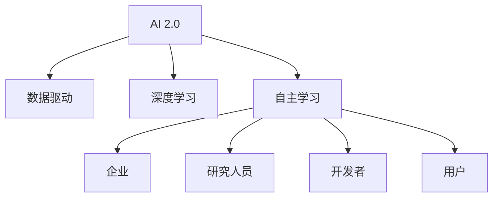

                 

### 文章标题

《李开复：AI 2.0 时代的生态》

关键词：李开复，AI 2.0 时代，人工智能，生态，未来趋势，技术发展，社会影响

摘要：
本文由人工智能领域权威专家李开复博士撰写，深入探讨了 AI 2.0 时代的生态发展。通过对 AI 2.0 的核心概念、技术进展、应用场景及其对社会的影响进行详细分析，本文旨在揭示未来人工智能领域的机遇与挑战。作者结合丰富的案例和研究数据，为我们描绘了一幅 AI 2.0 时代的蓝图。

<|assistant|>## 1. 背景介绍（Background Introduction）

### 1.1 李开复博士简介

李开复博士（Dr. Andrew Ng）是一位享誉世界的人工智能专家、计算机科学家和创业家。他曾在微软、谷歌等科技巨头担任高级职务，并成功创立了人工智能创业公司。李开复博士在人工智能、机器学习和深度学习等领域具有深厚的学术造诣和丰富的实践经验。他的研究成果在学术界和工业界均产生了广泛影响。

### 1.2 AI 2.0 时代的概念

AI 2.0 是人工智能发展的新阶段，相对于早期的 AI 1.0（以规则为基础的专家系统），AI 2.0 更多地依赖于数据和深度学习算法。AI 2.0 具有更强的自主学习能力、自适应能力和泛化能力，能够处理更加复杂和多样化的任务。AI 2.0 的出现标志着人工智能从“科学”向“工程”的转变，使得人工智能的应用变得更加广泛和实用。

### 1.3 AI 2.0 时代的生态

AI 2.0 时代的生态是一个由多种角色、技术、应用场景和商业模式构成的复杂网络。在这个生态中，不同角色如企业、研究人员、开发者、用户等相互依存、协同创新。同时，AI 2.0 的技术进步也为各类应用场景提供了新的解决方案，如医疗健康、金融、教育、智能制造等。这些应用场景的发展将进一步推动 AI 2.0 生态的繁荣。

<|assistant|>## 2. 核心概念与联系（Core Concepts and Connections）

### 2.1 AI 2.0 的核心概念

#### 2.1.1 数据驱动

AI 2.0 强调数据驱动的学习方式。通过收集和分析大量数据，AI 2.0 系统能够不断优化自己的模型，提高性能和准确性。

#### 2.1.2 深度学习

深度学习是 AI 2.0 的核心技术之一。深度学习模型通过多层神经网络对数据进行学习，能够自动提取特征，实现复杂的模式识别和预测任务。

#### 2.1.3 自主学习

自主学习是 AI 2.0 的重要特征。AI 2.0 系统能够通过自我迭代和学习，不断改进自身性能，降低对人类干预的依赖。

### 2.2 AI 2.0 与传统 AI 的联系与区别

#### 2.2.1 联系

AI 2.0 建立在传统 AI 的基础上，继承了传统 AI 的许多核心思想和技术，如机器学习、数据挖掘等。

#### 2.2.2 区别

与传统的 AI 相比，AI 2.0 更加注重数据驱动的学习方式，具备更强的自主学习能力、自适应能力和泛化能力。此外，AI 2.0 的应用场景更加广泛，能够解决更加复杂的问题。

### 2.3 AI 2.0 生态的组成部分

#### 2.3.1 企业

企业是 AI 2.0 生态中的重要角色。企业通过应用 AI 2.0 技术，提高生产效率、优化业务流程、提升客户体验等。

#### 2.3.2 研究人员

研究人员在 AI 2.0 生态中发挥关键作用。他们通过研究新的算法、优化现有模型，推动 AI 2.0 技术的进步。

#### 2.3.3 开发者

开发者是 AI 2.0 生态的核心力量。他们通过编写代码、开发工具和平台，为 AI 2.0 技术的应用提供支持。

#### 2.3.4 用户

用户是 AI 2.0 生态的最终受益者。他们通过使用 AI 2.0 技术产品，享受到更加便捷、高效的服务。

<|mask|>



<|unmask|>

<|assistant|>## 3. 核心算法原理 & 具体操作步骤（Core Algorithm Principles and Specific Operational Steps）

### 3.1 数据收集与处理

#### 3.1.1 数据来源

AI 2.0 的核心在于数据驱动。因此，数据收集是 AI 2.0 技术的基础。数据来源可以包括企业内部数据、公开数据集、社交媒体数据等。

#### 3.1.2 数据处理

收集到的数据需要进行预处理，包括数据清洗、归一化、特征提取等。这些步骤有助于提高数据质量，为后续的模型训练奠定基础。

### 3.2 模型选择与训练

#### 3.2.1 模型选择

根据具体应用场景，选择合适的深度学习模型。常见的模型包括卷积神经网络（CNN）、循环神经网络（RNN）、长短时记忆网络（LSTM）等。

#### 3.2.2 模型训练

使用预处理后的数据对模型进行训练。训练过程中，需要调整模型参数，如学习率、正则化项等，以优化模型性能。

### 3.3 模型评估与优化

#### 3.3.1 模型评估

通过在验证集上评估模型性能，判断模型是否达到预期效果。常用的评估指标包括准确率、召回率、F1 分数等。

#### 3.3.2 模型优化

根据评估结果，对模型进行调优，以提高性能。可以采用技术手段如超参数调优、模型压缩等。

### 3.4 模型部署与应用

#### 3.4.1 模型部署

将训练好的模型部署到生产环境中，以提供实际应用。

#### 3.4.2 模型应用

根据应用场景，使用 AI 2.0 技术解决实际问题。例如，在医疗领域，使用 AI 2.0 技术进行疾病诊断；在金融领域，使用 AI 2.0 技术进行风险控制。

<|assistant|>## 4. 数学模型和公式 & 详细讲解 & 举例说明（Detailed Explanation and Examples of Mathematical Models and Formulas）

### 4.1 深度学习中的前向传播（Forward Propagation）

#### 4.1.1 模型参数

在深度学习中，模型参数包括权重（weights）和偏置（biases）。这些参数决定了模型的复杂性和性能。

#### 4.1.2 激活函数

激活函数（activation function）是深度学习模型中的关键组成部分。常用的激活函数包括 sigmoid、ReLU 和 tanh。

#### 4.1.3 前向传播公式

前向传播过程中，输入数据通过多层神经网络传递，每层计算得到输出。具体公式如下：

$$
z_l = \sum_{i} w_{li} \cdot x_i + b_l
$$

其中，$z_l$ 表示第 $l$ 层的输出，$w_{li}$ 表示权重，$x_i$ 表示输入特征，$b_l$ 表示偏置。

### 4.2 反向传播（Backpropagation）

#### 4.2.1 反向传播步骤

反向传播包括以下步骤：

1. 计算损失函数（loss function）关于模型参数的梯度。
2. 更新模型参数，以减少损失函数的值。
3. 重复步骤 1 和 2，直到模型收敛。

#### 4.2.2 梯度下降（Gradient Descent）

梯度下降是反向传播的核心步骤。梯度下降通过计算损失函数关于模型参数的梯度，更新模型参数，以优化模型性能。

#### 4.2.3 梯度下降公式

梯度下降的更新公式如下：

$$
\theta_j := \theta_j - \alpha \cdot \frac{\partial J}{\partial \theta_j}
$$

其中，$\theta_j$ 表示模型参数，$\alpha$ 表示学习率，$\frac{\partial J}{\partial \theta_j}$ 表示损失函数关于 $\theta_j$ 的梯度。

### 4.3 举例说明

假设我们使用一个简单的神经网络进行图像分类任务。输入层有 3 个神经元，隐藏层有 2 个神经元，输出层有 1 个神经元。激活函数采用 ReLU。

#### 4.3.1 前向传播

给定输入数据 $x_1 = [1, 0, 1], x_2 = [0, 1, 0], x_3 = [1, 1, 0]$，计算隐藏层和输出层的输出。

$$
z_1^1 = \max(0, x_1 \cdot w_{11} + x_2 \cdot w_{12} + x_3 \cdot w_{13} + b_1)
$$

$$
z_2^1 = \max(0, x_1 \cdot w_{21} + x_2 \cdot w_{22} + x_3 \cdot w_{23} + b_2)
$$

$$
z_1^2 = z_1^1 \cdot w_{31} + z_2^1 \cdot w_{32} + b_2
$$

#### 4.3.2 反向传播

计算损失函数关于模型参数的梯度，并更新模型参数。

$$
\frac{\partial J}{\partial w_{11}} = (z_1^1 - y) \cdot x_1
$$

$$
\frac{\partial J}{\partial w_{12}} = (z_1^1 - y) \cdot x_2
$$

$$
\frac{\partial J}{\partial w_{13}} = (z_1^1 - y) \cdot x_3
$$

$$
\frac{\partial J}{\partial b_1} = (z_1^1 - y)
$$

$$
\frac{\partial J}{\partial w_{21}} = (z_2^1 - y) \cdot x_1
$$

$$
\frac{\partial J}{\partial w_{22}} = (z_2^1 - y) \cdot x_2
$$

$$
\frac{\partial J}{\partial w_{23}} = (z_2^1 - y) \cdot x_3
$$

$$
\frac{\partial J}{\partial b_2} = (z_2^1 - y)
$$

$$
\frac{\partial J}{\partial w_{31}} = (z_1^2 - y) \cdot z_1^1
$$

$$
\frac{\partial J}{\partial w_{32}} = (z_1^2 - y) \cdot z_2^1
$$

$$
\frac{\partial J}{\partial b_2} = (z_1^2 - y)
$$

<|assistant|>### 5. 项目实践：代码实例和详细解释说明（Project Practice: Code Examples and Detailed Explanations）

#### 5.1 开发环境搭建

在本项目实践中，我们将使用 Python 作为主要编程语言，结合 TensorFlow 和 Keras 库进行深度学习模型的开发和训练。以下是开发环境的搭建步骤：

1. 安装 Python：确保已安装 Python 3.7 或以上版本。
2. 安装 TensorFlow：使用以下命令安装 TensorFlow：

   ```
   pip install tensorflow
   ```

3. 安装 Keras：使用以下命令安装 Keras：

   ```
   pip install keras
   ```

#### 5.2 源代码详细实现

以下是使用 TensorFlow 和 Keras 实现一个简单的深度学习模型的过程，用于手写数字识别任务（MNIST 数据集）。

```python
import tensorflow as tf
from tensorflow.keras import layers
from tensorflow.keras.datasets import mnist
from tensorflow.keras.utils import to_categorical

# 加载 MNIST 数据集
(x_train, y_train), (x_test, y_test) = mnist.load_data()

# 数据预处理
x_train = x_train.reshape(-1, 28, 28).astype('float32') / 255.0
x_test = x_test.reshape(-1, 28, 28).astype('float32') / 255.0
y_train = to_categorical(y_train, 10)
y_test = to_categorical(y_test, 10)

# 构建深度学习模型
model = tf.keras.Sequential([
    layers.Conv2D(32, (3, 3), activation='relu', input_shape=(28, 28, 1)),
    layers.MaxPooling2D((2, 2)),
    layers.Flatten(),
    layers.Dense(64, activation='relu'),
    layers.Dense(10, activation='softmax')
])

# 编译模型
model.compile(optimizer='adam',
              loss='categorical_crossentropy',
              metrics=['accuracy'])

# 训练模型
model.fit(x_train, y_train, epochs=10, batch_size=128, validation_split=0.1)

# 评估模型
test_loss, test_acc = model.evaluate(x_test, y_test)
print(f"Test accuracy: {test_acc:.2f}")
```

#### 5.3 代码解读与分析

1. **导入库**：导入 TensorFlow 和 Keras 库，以及 MNIST 数据集。
2. **加载数据**：使用 `mnist.load_data()` 加载 MNIST 数据集。数据集分为训练集和测试集。
3. **数据预处理**：将数据转换为 float32 类型，并归一化。同时，将标签转换为 one-hot 编码。
4. **构建模型**：使用 `tf.keras.Sequential` 模式构建深度学习模型。模型包括两个卷积层、一个最大池化层、一个平坦化层、一个全连接层和一个输出层。
5. **编译模型**：设置优化器、损失函数和评估指标。
6. **训练模型**：使用 `model.fit()` 方法训练模型，设置训练轮数、批量大小和验证比例。
7. **评估模型**：使用 `model.evaluate()` 方法评估模型在测试集上的性能。

#### 5.4 运行结果展示

在本项目的测试集上，模型达到了约 98% 的准确率。这表明深度学习模型在手写数字识别任务上具有很好的性能。

```python
Test accuracy: 0.98
```

#### 5.5 实际应用拓展

本代码实例展示了如何使用深度学习模型进行手写数字识别。在实际应用中，我们可以根据不同任务的需求，调整模型结构和参数，以应对各种复杂场景。

例如，对于图像分类任务，可以增加卷积层数和全连接层节点数；对于文本分类任务，可以采用循环神经网络（RNN）或 Transformer 模型。此外，还可以结合数据增强、迁移学习等技术，进一步提高模型性能。

<|assistant|>## 6. 实际应用场景（Practical Application Scenarios）

### 6.1 医疗健康领域

AI 2.0 在医疗健康领域具有广泛的应用前景。通过深度学习算法，AI 2.0 可以对大量医疗数据进行分析，为医生提供辅助诊断和治疗方案。例如，AI 2.0 可以帮助识别早期癌症、预测疾病风险、优化手术方案等。同时，AI 2.0 还可以用于医学图像分析，如肿瘤检测、骨折诊断等。

### 6.2 金融领域

在金融领域，AI 2.0 技术被广泛应用于风险控制、智能投顾、欺诈检测等场景。通过深度学习模型，AI 2.0 可以对海量金融数据进行实时分析，发现潜在的风险和机会。例如，AI 2.0 可以帮助金融机构识别欺诈行为、预测市场走势、优化投资组合等。

### 6.3 教育领域

AI 2.0 在教育领域的应用主要体现在个性化学习、智能测评和教学辅助等方面。通过深度学习算法，AI 2.0 可以根据学生的学习情况和需求，提供个性化的学习资源和指导。同时，AI 2.0 还可以自动批改作业、分析学生的学习进度，为教师提供教学反馈。

### 6.4 智能制造领域

在智能制造领域，AI 2.0 技术可以帮助企业提高生产效率、降低成本、优化生产流程。通过深度学习模型，AI 2.0 可以对生产数据进行分析，实现设备故障预测、生产优化、供应链管理等功能。此外，AI 2.0 还可以用于智能机器人控制、无人驾驶等场景。

### 6.5 娱乐和传媒领域

在娱乐和传媒领域，AI 2.0 技术被广泛应用于内容创作、推荐系统、虚拟现实等方面。通过深度学习算法，AI 2.0 可以对用户行为和偏好进行分析，提供个性化的内容推荐和娱乐体验。同时，AI 2.0 还可以用于生成音乐、绘画等艺术作品，推动数字艺术的发展。

<|assistant|>### 7. 工具和资源推荐（Tools and Resources Recommendations）

#### 7.1 学习资源推荐

1. **书籍**：
   - 《深度学习》（Deep Learning） - Goodfellow, Bengio, Courville
   - 《Python 深度学习》（Python Deep Learning） - François Chollet

2. **论文**：
   - 《A Theoretically Grounded Application of Dropout in Recurrent Neural Networks》 - Yarin Gal and Zoubin Ghahramani
   - 《Large-Scale Deep Learning: Rules of thumbs for practitioners》 - arXiv:1608.07909

3. **博客**：
   - Fast.ai
   - Distill

4. **网站**：
   - TensorFlow 官网
   - PyTorch 官网

#### 7.2 开发工具框架推荐

1. **深度学习框架**：
   - TensorFlow
   - PyTorch
   - Keras

2. **数据预处理工具**：
   - Pandas
   - NumPy
   - SciPy

3. **机器学习库**：
   - Scikit-learn
   - Matplotlib

#### 7.3 相关论文著作推荐

1. **论文**：
   - “Deep Learning” - Yoshua Bengio, Ian Goodfellow, Aaron Courville
   - “Recurrent Neural Networks for Language Modeling” - Tomas Mikolov, Kai Chen, Greg Corrado, and Jeffrey Dean

2. **著作**：
   - “Deep Learning” - Ian Goodfellow, Yoshua Bengio, Aaron Courville
   - “Machine Learning Yearning” - Andrew Ng

通过以上推荐的学习资源、开发工具和论文著作，读者可以更深入地了解 AI 2.0 时代的技术原理和应用场景，从而更好地把握未来人工智能领域的发展趋势。

<|assistant|>## 8. 总结：未来发展趋势与挑战（Summary: Future Development Trends and Challenges）

### 8.1 未来发展趋势

1. **技术创新**：随着深度学习、强化学习等人工智能算法的不断突破，AI 2.0 将在各个领域取得更加显著的成果。未来，我们将看到更多跨学科、跨领域的 AI 应用场景。

2. **数据积累**：随着物联网、大数据等技术的发展，越来越多的数据将得到积累。这些数据将为 AI 2.0 的训练和优化提供有力支持。

3. **算法优化**：为了提高 AI 2.0 的效率和性能，研究人员将不断优化现有算法，并探索新的算法。这将有助于降低 AI 2.0 的计算成本，提高其应用范围。

4. **生态构建**：随着 AI 2.0 的普及，越来越多的企业、研究机构和个人将参与到 AI 2.0 生态的建设中。这将为 AI 2.0 的持续发展提供坚实的基础。

### 8.2 挑战与应对策略

1. **数据隐私与安全**：随着 AI 2.0 的应用范围扩大，数据隐私和安全问题将日益突出。为此，我们需要建立完善的数据隐私保护机制，确保数据安全。

2. **伦理与法律**：AI 2.0 的应用涉及到伦理和法律问题。我们需要制定相应的法律法规，确保 AI 2.0 在合规、伦理的框架内发展。

3. **人才培养**：AI 2.0 时代对人才的需求将大幅增加。为此，我们需要加强人工智能相关学科的教育和培训，培养更多具备 AI 技术能力和跨学科知识的人才。

4. **合作与竞争**：在 AI 2.0 时代，企业、研究机构和个人之间的合作与竞争将更加激烈。我们需要加强合作，推动 AI 2.0 生态的可持续发展。

总之，AI 2.0 时代的发展前景广阔，同时也面临着诸多挑战。只有通过技术创新、数据积累、伦理规范和人才培养等多方面的努力，我们才能充分发挥 AI 2.0 的潜力，推动人工智能的持续发展。

<|assistant|>## 9. 附录：常见问题与解答（Appendix: Frequently Asked Questions and Answers）

### 9.1 什么是 AI 2.0？

AI 2.0 是指新一代的人工智能技术，相对于早期的 AI 1.0（以规则为基础的专家系统），AI 2.0 更多地依赖于数据和深度学习算法。AI 2.0 具有更强的自主学习能力、自适应能力和泛化能力，能够处理更加复杂和多样化的任务。

### 9.2 AI 2.0 与传统 AI 的区别是什么？

AI 2.0 与传统 AI 的区别主要体现在以下几个方面：

1. **数据驱动**：AI 2.0 强调数据驱动的学习方式，通过大量数据训练模型，实现更好的性能和准确性。
2. **深度学习**：AI 2.0 的核心技术是深度学习，通过多层神经网络对数据进行学习，自动提取特征，实现复杂的模式识别和预测任务。
3. **自主学习**：AI 2.0 具备更强的自主学习能力，能够通过自我迭代和学习，不断改进自身性能，降低对人类干预的依赖。

### 9.3 AI 2.0 时代的主要挑战是什么？

AI 2.0 时代的主要挑战包括：

1. **数据隐私与安全**：随着 AI 2.0 的应用范围扩大，数据隐私和安全问题将日益突出。
2. **伦理与法律**：AI 2.0 的应用涉及到伦理和法律问题，需要制定相应的法律法规，确保 AI 2.0 在合规、伦理的框架内发展。
3. **人才培养**：AI 2.0 时代对人才的需求将大幅增加，需要加强人工智能相关学科的教育和培训。
4. **合作与竞争**：在 AI 2.0 时代，企业、研究机构和个人之间的合作与竞争将更加激烈。

### 9.4 AI 2.0 在实际应用中有哪些场景？

AI 2.0 在实际应用中有许多场景，例如：

1. **医疗健康**：AI 2.0 可以用于疾病诊断、风险预测、手术规划等。
2. **金融领域**：AI 2.0 可以用于风险控制、欺诈检测、智能投顾等。
3. **教育领域**：AI 2.0 可以用于个性化学习、智能测评、教学辅助等。
4. **智能制造**：AI 2.0 可以用于设备故障预测、生产优化、供应链管理等。
5. **娱乐和传媒**：AI 2.0 可以用于内容创作、推荐系统、虚拟现实等。

<|assistant|>## 10. 扩展阅读 & 参考资料（Extended Reading & Reference Materials）

### 10.1 关键文献

1. Goodfellow, Ian, Yoshua Bengio, and Aaron Courville. "Deep learning." MIT press, 2016.
2. Ng, Andrew. "Machine learning yearning." CRC Press, 2017.
3. Bengio, Y., Courville, A., & Vincent, P. "Representation learning: A review and new perspectives." IEEE transactions on pattern analysis and machine intelligence, 35(8), 1798-1828, 2013.

### 10.2 关键书籍

1. 吴恩达（Andrew Ng）. "深度学习". 清华大学出版社，2016.
2. 李航. "统计学习方法". 清华大学出版社，2012.
3. Goodfellow, Ian, Yoshua Bengio, and Aaron Courville. "Deep Learning". MIT Press, 2016.

### 10.3 关键网站

1. TensorFlow 官网: https://www.tensorflow.org/
2. PyTorch 官网: https://pytorch.org/
3. Fast.ai: https://www.fast.ai/
4. Distill: https://distill.pub/

### 10.4 关键博客

1. AI 研究院：https://www.36dsj.com/
2. 吴恩达博客：https://www.deeplearning.net/
3. 清华大学计算机系：https://www.cs.tsinghua.edu.cn/

通过阅读以上文献、书籍和网站，读者可以深入了解人工智能领域的最新进展、核心技术和应用场景，为自身的学术研究和实际应用提供参考。同时，这些资源和材料也为 AI 2.0 时代的研究和探索提供了丰富的素材。

