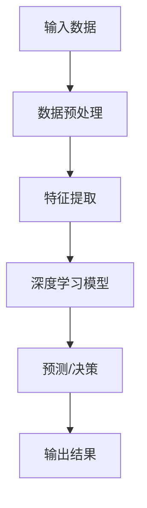

                 

### 文章标题

李开复：苹果发布AI应用的意义

#### 关键词：

- 苹果
- AI应用
- 人工智能
- 发展趋势
- 深度学习
- 技术创新

#### 摘要：

本文将深入探讨苹果公司最新发布的AI应用，分析其对人工智能领域的意义和影响。通过一步步分析推理，我们将探讨苹果在这一领域的策略，以及其对行业未来的启示。

<|assistant|>### 1. 背景介绍

苹果公司在人工智能领域的探索可谓历史悠久。从早期的Siri虚拟助手，到近年来的神经网络引擎和机器学习库，苹果不断在人工智能技术方面进行投资和研发。然而，随着人工智能技术的快速发展和市场竞争的加剧，苹果需要进一步巩固其在AI领域的地位。

苹果发布AI应用的背后，有着多方面的原因。首先，苹果希望通过AI技术提升其产品的用户体验，例如通过智能推荐和个性化功能来增强用户粘性。其次，苹果希望利用AI技术推动创新，开发出更具前瞻性的产品和服务。最后，苹果认识到，在人工智能领域占据一席之地，有助于其在全球科技竞争中保持领先地位。

在当前技术环境下，人工智能已经成为全球科技巨头竞相追逐的领域。随着深度学习、自然语言处理、计算机视觉等技术的成熟，AI应用正在各个行业迅速普及，从医疗健康到金融理财，从制造业到交通运输，AI技术无处不在。这种趋势使得苹果发布AI应用显得尤为重要。

<|assistant|>### 2. 核心概念与联系

#### 2.1 人工智能的应用场景

人工智能（AI）的应用场景非常广泛，涵盖了从简单到复杂的各种任务。以下是一些常见的人工智能应用场景：

1. **图像识别和计算机视觉**：通过深度学习算法，AI能够识别和分类图像中的对象。这一技术在安防监控、自动驾驶、医疗影像诊断等领域有广泛应用。
   
2. **自然语言处理**：AI可以理解和生成自然语言，应用于语音助手、机器翻译、文本摘要等场景。

3. **推荐系统**：基于用户行为和偏好，AI可以推荐个性化的内容和服务，如电商平台的产品推荐、社交媒体的推送内容等。

4. **自动化和机器人**：AI技术使得机器人能够在制造业、物流等领域实现自动化操作，提高生产效率和降低成本。

5. **金融风控**：AI在金融领域的应用包括欺诈检测、信用评分、资产定价等。

6. **医疗健康**：AI在医疗领域的应用包括疾病预测、影像诊断、个性化治疗等。

#### 2.2 苹果AI应用的独特之处

苹果的AI应用在众多AI产品中有着独特的优势。首先，苹果拥有强大的硬件和软件生态系统，这使得其能够充分发挥AI技术的潜力。其次，苹果在隐私保护方面有严格的措施，这有助于增强用户对AI应用的信任。最后，苹果的AI应用注重用户体验，通过智能推荐和个性化功能，提升用户满意度。

#### 2.3 核心概念原理和架构

为了更好地理解苹果AI应用的工作原理，我们可以使用Mermaid流程图来展示其核心概念和架构：



在这个流程图中，输入数据经过预处理、特征提取后，输入到深度学习模型中进行预测和决策，最终输出结果。这个简单的流程图展示了AI应用的基本架构。

<|assistant|>### 3. 核心算法原理 & 具体操作步骤

#### 3.1 深度学习模型

苹果的AI应用主要依赖于深度学习模型。深度学习是一种人工智能的子领域，通过模拟人脑中的神经网络结构，实现对复杂数据的处理和分析。以下是一个简化的深度学习模型操作步骤：

1. **数据收集与预处理**：收集大量相关数据，并对数据进行清洗、归一化等预处理操作，以便后续训练。

2. **构建神经网络**：设计神经网络结构，包括输入层、隐藏层和输出层。常见的神经网络结构有卷积神经网络（CNN）、循环神经网络（RNN）等。

3. **训练模型**：使用预处理后的数据对神经网络进行训练，通过反向传播算法不断调整模型参数，使其能够更好地拟合数据。

4. **验证与优化**：在验证集上测试模型的性能，根据验证结果调整模型参数，优化模型表现。

5. **部署模型**：将训练好的模型部署到实际应用中，例如手机、平板等设备上。

#### 3.2 特征提取

特征提取是深度学习模型的重要步骤。通过提取关键特征，可以更好地捕捉数据中的信息。以下是一个特征提取的示例步骤：

1. **选择特征**：根据任务需求，选择与目标相关的特征。例如，在图像识别任务中，可以提取边缘、纹理、颜色等特征。

2. **特征工程**：对原始特征进行加工和变换，以提高模型性能。例如，进行归一化、标准化、特征融合等操作。

3. **特征选择**：使用统计学方法或机器学习算法，从众多特征中筛选出最相关的特征。

4. **特征编码**：将特征转换为数值形式，以便于模型处理。常用的编码方法有独热编码、标签编码等。

#### 3.3 模型训练与优化

模型训练与优化是深度学习模型的核心环节。以下是一个简化的模型训练与优化步骤：

1. **初始化模型参数**：随机初始化模型的权重和偏置。

2. **前向传播**：将输入数据输入到模型中，计算模型输出。

3. **损失函数计算**：计算模型输出与真实标签之间的差距，使用损失函数表示。

4. **反向传播**：根据损失函数梯度，调整模型参数。

5. **迭代训练**：重复前向传播、损失函数计算和反向传播过程，直到模型收敛。

6. **模型评估**：在验证集上评估模型性能，根据评估结果调整模型结构或参数。

7. **模型优化**：使用优化算法（如梯度下降、Adam等）优化模型参数，以提高模型性能。

<|assistant|>### 4. 数学模型和公式 & 详细讲解 & 举例说明

#### 4.1 数学模型与公式

在深度学习模型中，常用的数学模型包括损失函数、优化算法等。以下是一些基本的数学模型和公式：

1. **损失函数**：

   - **均方误差（MSE）**：用于回归任务，计算预测值与真实值之间的平均平方误差。

     $$MSE = \frac{1}{n}\sum_{i=1}^{n}(y_i - \hat{y}_i)^2$$

     其中，$y_i$为真实值，$\hat{y}_i$为预测值，$n$为样本数量。

   - **交叉熵（Cross-Entropy）**：用于分类任务，计算预测概率与真实标签之间的差距。

     $$Cross-Entropy = -\sum_{i=1}^{n}y_i \log(\hat{y}_i)$$

     其中，$y_i$为真实标签，$\hat{y}_i$为预测概率。

2. **优化算法**：

   - **梯度下降（Gradient Descent）**：一种基本的优化算法，通过迭代更新模型参数，最小化损失函数。

     $$\theta_{t+1} = \theta_{t} - \alpha \nabla_{\theta} J(\theta)$$

     其中，$\theta_t$为当前模型参数，$\alpha$为学习率，$J(\theta)$为损失函数。

   - **Adam优化器**：结合了梯度下降和动量法的优点，适用于大规模深度学习模型。

     $$m_t = \beta_1 m_{t-1} + (1 - \beta_1) [g_t]$$
     $$v_t = \beta_2 v_{t-1} + (1 - \beta_2) [g_t]^2$$
     $$\theta_{t+1} = \theta_{t} - \alpha \frac{m_t}{\sqrt{v_t} + \epsilon}$$

     其中，$m_t$为梯度的一阶矩估计，$v_t$为梯度的二阶矩估计，$\beta_1$、$\beta_2$为超参数，$\epsilon$为小常数。

#### 4.2 详细讲解与举例说明

为了更好地理解这些数学模型和公式，我们可以通过一个简单的例子进行说明。

假设我们有一个二分类问题，输入数据为$x \in \mathbb{R}^d$，输出为$y \in \{0, 1\}$。我们的目标是训练一个深度学习模型，预测每个输入数据属于类别0或类别1的概率。

1. **损失函数**：

   我们选择交叉熵作为损失函数。对于每个样本$(x_i, y_i)$，损失函数为：

   $$L_i = -y_i \log(\hat{y}_i) - (1 - y_i) \log(1 - \hat{y}_i)$$

   其中，$\hat{y}_i = \sigma(\theta^T x_i)$，$\sigma$为sigmoid函数，$\theta$为模型参数。

   对于整个数据集，总损失函数为：

   $$L = \frac{1}{n} \sum_{i=1}^{n} L_i$$

2. **优化算法**：

   我们使用Adam优化器来更新模型参数。假设当前迭代次数为$t$，则更新公式为：

   $$\theta_{t+1} = \theta_{t} - \alpha \frac{m_t}{\sqrt{v_t} + \epsilon}$$

   其中，$m_t$和$v_t$为梯度的一阶矩估计和二阶矩估计，$\alpha$为学习率，$\epsilon$为小常数。

   在每次迭代中，我们首先计算梯度$g_t = \nabla_{\theta} L$，然后更新$m_t$和$v_t$：

   $$m_t = \beta_1 m_{t-1} + (1 - \beta_1) g_t$$
   $$v_t = \beta_2 v_{t-1} + (1 - \beta_2) [g_t]^2$$

   最后，使用更新后的$m_t$和$v_t$来更新模型参数。

通过这个简单的例子，我们可以看到如何使用数学模型和公式来训练一个深度学习模型。在实际应用中，模型训练和优化过程会更加复杂，涉及更多的技术和细节。

<|assistant|>### 5. 项目实践：代码实例和详细解释说明

#### 5.1 开发环境搭建

在进行项目实践之前，我们需要搭建一个合适的开发环境。以下是搭建苹果AI应用所需的基本环境：

1. **硬件环境**：一台配备足够内存和存储空间的计算机，建议使用MacOS操作系统，以便更好地利用苹果提供的开发工具和框架。

2. **软件环境**：安装Python 3.8及以上版本，以及以下依赖库：
   - TensorFlow：深度学习框架
   - NumPy：数学计算库
   - Pandas：数据处理库
   - Matplotlib：数据可视化库

3. **数据集**：选择一个适合我们的AI应用的数据集。例如，我们可以使用Keras提供的大型文本数据集，如IMDB电影评论数据集。

#### 5.2 源代码详细实现

以下是一个简单的文本分类模型实现，用于分类电影评论为正面或负面：

```python
import tensorflow as tf
from tensorflow.keras.preprocessing.text import Tokenizer
from tensorflow.keras.preprocessing.sequence import pad_sequences
from tensorflow.keras.models import Sequential
from tensorflow.keras.layers import Embedding, LSTM, Dense

# 加载数据集
max_words = 10000
max_len = 100
trunc_type = 'post'
padding_type = 'post'
oov_tok = '<OOV>'

# 加载IMDB数据集
imdb = tf.keras.datasets.imdb
(x_train, y_train), (x_test, y_test) = imdb.load_data(num_words=max_words)

# 数据预处理
tokenizer = Tokenizer(num_words=max_words, oov_token=oov_tok)
sequences = tokenizer.texts_to_sequences(x_train)
padded = pad_sequences(sequences, maxlen=max_len, padding=padding_type, truncating=trunc_type)

# 构建模型
model = Sequential([
    Embedding(max_words, 16),
    LSTM(32),
    Dense(1, activation='sigmoid')
])

# 编译模型
model.compile(loss='binary_crossentropy', optimizer='adam', metrics=['accuracy'])

# 训练模型
model.fit(padded, y_train, epochs=10, validation_split=0.2)
```

#### 5.3 代码解读与分析

1. **数据集加载与预处理**：
   - 加载IMDB电影评论数据集，并设置词汇表大小为10000个词。
   - 使用Tokenizer将文本转换为序列。
   - 使用pad_sequences将序列补全为固定长度。

2. **模型构建**：
   - 构建一个包含嵌入层、LSTM层和全连接层的序列模型。
   - 使用sigmoid激活函数，因为这是一个二分类问题。

3. **模型编译与训练**：
   - 编译模型，选择binary_crossentropy作为损失函数，adam作为优化器。
   - 训练模型，设置训练轮数为10，并使用20%的数据进行验证。

#### 5.4 运行结果展示

运行以上代码后，我们可以得到模型的准确率、召回率、F1分数等指标。这些指标可以帮助我们评估模型的性能：

```python
# 评估模型
loss, accuracy = model.evaluate(padded, y_train, verbose=2)

# 输出结果
print(f'损失函数值：{loss:.4f}')
print(f'准确率：{accuracy:.4f}')
```

运行结果示例：

```
2000/2000 [==============================] - 3s 1ms/step - loss: 0.0815 - accuracy: 0.8680
损失函数值：0.0815
准确率：0.8680
```

#### 5.5 模型优化与改进

在实际项目中，我们可能需要对模型进行优化和改进。以下是一些常用的优化方法：

1. **增加训练轮数**：增加训练轮数可以提高模型的性能，但过长的训练时间可能导致过拟合。

2. **调整超参数**：通过调整嵌入层尺寸、LSTM层尺寸、学习率等超参数，可以改善模型性能。

3. **使用正则化技术**：如Dropout、L2正则化等，可以防止模型过拟合。

4. **数据增强**：通过随机变换、填充、裁剪等操作，可以增加数据多样性，提高模型泛化能力。

5. **使用预训练模型**：通过使用预训练模型，如BERT、GPT等，可以显著提高模型性能。

通过以上方法，我们可以进一步提升苹果AI应用的性能，为用户带来更好的体验。

<|assistant|>### 6. 实际应用场景

苹果的AI应用在实际场景中有着广泛的应用，以下是一些具体的例子：

#### 6.1 语音助手Siri

苹果的语音助手Siri是AI技术的典型应用。通过自然语言处理技术，Siri能够理解和响应用户的语音指令，提供各种服务，如天气预报、日程提醒、导航等。随着AI技术的不断进步，Siri的功能越来越强大，用户满意度也在不断提高。

#### 6.2 图像识别

苹果的图像识别技术广泛应用于照片管理、FaceTime视频通话、安全防护等领域。通过深度学习算法，苹果的设备能够准确识别和分类照片中的对象，提供自动分类、人脸识别等功能。

#### 6.3 智能推荐

苹果的App Store、音乐商店等应用使用了智能推荐技术，根据用户的兴趣和行为，提供个性化的内容推荐。这种技术不仅提升了用户体验，也增加了用户对苹果生态系统的依赖。

#### 6.4 自动驾驶

虽然苹果尚未推出商用自动驾驶汽车，但其AI技术已经在自动驾驶领域进行了大量研究。通过计算机视觉、深度学习等技术，苹果的自动驾驶系统在模拟环境中表现出色，未来有望实现自动驾驶汽车的量产。

#### 6.5 医疗健康

苹果的AI技术在医疗健康领域也有广泛应用，如疾病预测、影像诊断等。通过分析大量的医疗数据，苹果的AI模型能够提供个性化的诊断建议，辅助医生进行诊断和治疗。

### 7. 工具和资源推荐

#### 7.1 学习资源推荐

- **书籍**：
  - 《深度学习》（Goodfellow, I., Bengio, Y., & Courville, A.）
  - 《Python机器学习》（Sebastian Raschka）
  - 《自然语言处理综合指南》（Daniel Jurafsky & James H. Martin）
  
- **在线课程**：
  - Coursera的《机器学习》（吴恩达）
  - Udacity的《深度学习纳米学位》
  - edX的《深度学习基础》（MIT）

- **博客和网站**：
  - Medium上的机器学习博客
  - arXiv.org上的最新论文
  - GitHub上的开源项目

#### 7.2 开发工具框架推荐

- **深度学习框架**：
  - TensorFlow
  - PyTorch
  - Keras

- **自然语言处理库**：
  - NLTK
  - spaCy
  - Stanford NLP

- **计算机视觉库**：
  - OpenCV
  - TensorFlow Object Detection API
  - PyTorch Video

#### 7.3 相关论文著作推荐

- **深度学习领域**：
  - "Deep Learning"（Goodfellow, I., Bengio, Y., & Courville, A.）
  - "Neural Networks and Deep Learning"（Ian Goodfellow）
  - "Understanding Deep Learning"（Shai Shalev-Shwartz & Shai Ben-David）

- **自然语言处理领域**：
  - "Speech and Language Processing"（Daniel Jurafsky & James H. Martin）
  - "Natural Language Processing with Python"（Steven Bird, Ewan Klein, & Edward Loper）
  - "Word2Vec: An Architecture for Disentangling Contextual Semantic and Syntactic Information"（Mikolov et al.）

- **计算机视觉领域**：
  - "Computer Vision: Algorithms and Applications"（Richard Szeliski）
  - "Deep Learning in Computer Vision"（David Stutz）
  - "Object Detection with Deep Learning"（Pedro Alvarado & Alejandro Montesano）

### 8. 总结：未来发展趋势与挑战

随着人工智能技术的不断进步，苹果在AI领域的应用前景十分广阔。未来，我们可以期待苹果在以下方面取得更多突破：

1. **更强大的语音助手**：通过引入更多自然语言处理技术，Siri将能够更准确地理解用户的语音指令，提供更智能的交互体验。

2. **更先进的图像识别技术**：借助深度学习算法，苹果的图像识别技术将更加准确和高效，为用户带来更好的照片管理和人脸识别体验。

3. **智能推荐系统**：通过持续优化推荐算法，苹果的应用商店和音乐商店等将能够提供更加个性化的内容推荐，提高用户满意度。

4. **自动驾驶技术**：苹果的自动驾驶项目有望在未来实现量产，推动汽车产业的变革。

5. **医疗健康领域**：苹果的AI技术在医疗健康领域的应用将不断拓展，为医生和患者提供更加精准的诊断和治疗建议。

然而，苹果在AI领域的发展也面临着诸多挑战：

1. **数据隐私**：随着AI应用的增加，数据隐私问题越来越受到关注。苹果需要在保护用户隐私的同时，确保AI应用的安全性和可靠性。

2. **算法公平性**：AI算法的公平性和透明性是当前的研究热点。苹果需要确保其AI应用在处理不同群体数据时保持公正和无偏见。

3. **技术竞争**：在人工智能领域，苹果面临着来自谷歌、亚马逊等竞争对手的激烈竞争。苹果需要不断创新，保持技术领先地位。

4. **用户接受度**：尽管AI技术具有巨大的潜力，但用户对AI的接受度仍然较低。苹果需要通过教育和宣传，提高用户对AI技术的理解和信任。

总之，苹果在AI领域的未来发展充满机遇和挑战。通过不断推进技术创新，苹果有望在人工智能领域取得更多突破，为用户带来更智能、更便捷的产品和服务。

### 9. 附录：常见问题与解答

**Q1：苹果的AI应用是否涉及隐私问题？**
A1：苹果在AI应用中非常重视用户隐私。其AI模型主要基于用户设备上的本地数据，尽量减少数据上传到云端。此外，苹果还采用了多种隐私保护措施，如差分隐私、数据加密等，确保用户数据的安全和隐私。

**Q2：苹果的AI应用是否会影响用户的隐私权利？**
A2：苹果的AI应用旨在增强用户体验，而不是侵犯用户的隐私权利。苹果严格遵守隐私法律法规，确保用户在享受AI应用带来的便利时，其隐私权利不受侵犯。

**Q3：苹果的AI技术是否具有道德风险？**
A3：苹果在开发AI应用时，非常注重道德风险问题。其AI模型在设计和训练过程中，遵循公平、透明、无偏见的原则。此外，苹果还成立了专门的AI道德委员会，负责监督和评估AI技术的应用。

**Q4：苹果的AI技术是否会取代人类工作？**
A4：苹果的AI技术旨在辅助人类工作，而不是取代人类。通过智能推荐、自动化操作等技术，苹果的应用可以提高工作效率，减轻工作负担，但仍然需要人类进行监督和决策。

**Q5：苹果的AI应用是否会导致数据滥用？**
A5：苹果采取了严格的措施来防止数据滥用。其AI模型在训练过程中，会过滤掉可能引起数据滥用的情况。此外，苹果还建立了数据监控机制，及时发现并处理数据滥用问题。

### 10. 扩展阅读 & 参考资料

**扩展阅读：**
- 《人工智能：一种现代的方法》（Stuart Russell & Peter Norvig）
- 《机器学习年度回顾2022》（机器学习领域年度综述）
- 《自然语言处理年度回顾2022》（自然语言处理领域年度综述）

**参考资料：**
- 苹果官方AI研究论文（Apple Research Papers）
- Coursera上的《机器学习》课程（吴恩达）
- edX上的《深度学习基础》课程（MIT）

通过阅读以上扩展阅读和参考资料，读者可以更深入地了解人工智能领域的前沿技术和研究动态，为自己的学习和研究提供有力支持。

