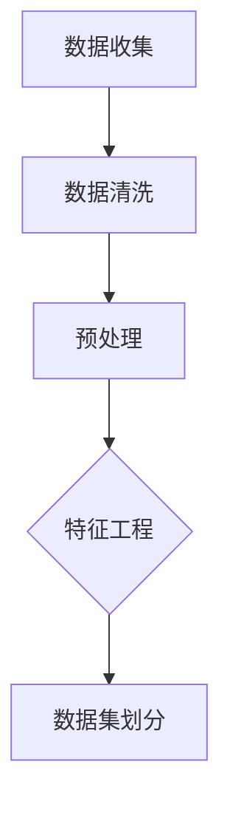
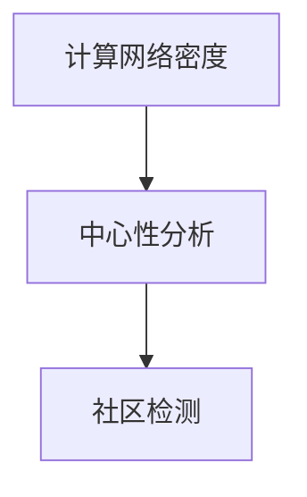
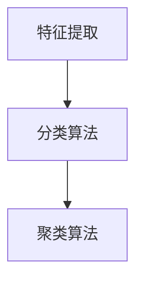
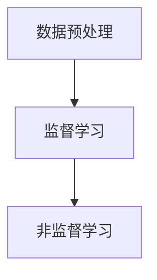

                 

### 背景介绍（Background Introduction）

**文章标题：欲望的社会化：AI驱动的群体动力学**

**关键词**：欲望社会化、AI、群体动力学、社会影响力、行为模型

**摘要**：本文深入探讨了欲望的社会化现象，通过引入人工智能（AI）的概念，分析了AI在群体动力学中的角色与影响。本文将揭示AI如何通过算法和模型影响个体行为，进而塑造社会群体的欲望与行为模式。文章旨在探讨AI驱动下的群体动力学对社会结构、人际互动以及个体心理的影响，并展望未来的发展趋势与挑战。

在当今数字化时代，人工智能正逐渐渗透到我们生活的方方面面。从社交媒体到电子商务，AI的应用无处不在，它不仅改变了我们的生活方式，还深刻影响了社会行为。其中，欲望的社会化现象引起了广泛的关注。所谓欲望社会化，是指个体在社交环境中受到他人欲望影响，从而改变自己行为和消费模式的过程。例如，在社交媒体上看到他人的生活方式和消费选择，可能会激发个体产生相应的欲望，进而采取相应的行动。

AI驱动的群体动力学为我们提供了理解这一现象的新视角。通过分析大数据和社交网络，AI可以揭示个体之间的相互作用和影响机制，从而预测和引导群体行为。本文将首先介绍欲望社会化的概念和现有研究成果，然后探讨AI在群体动力学中的应用，以及AI如何通过算法和模型影响个体行为，进而塑造社会群体的欲望与行为模式。最后，我们将讨论AI驱动下的群体动力学对社会的影响，以及未来的发展趋势与挑战。

在接下来的章节中，我们将逐步分析AI如何影响欲望社会化，并通过具体案例和实验数据来说明这一点。同时，我们还将讨论AI驱动下的群体动力学在现实世界中的应用，以及可能带来的伦理和社会问题。希望通过本文的探讨，读者能够更深入地理解AI在人类社会中的作用与影响，从而为未来社会的发展提供有益的思考和启示。

### 核心概念与联系（Core Concepts and Connections）

#### 3.1  欲望社会化的定义与理论基础

欲望社会化（Socialization of Desire）是指个体在社会互动过程中，通过模仿、认同和接受他人的欲望和价值观，从而改变自己的行为和决策的过程。这一现象在心理学、社会学和行为经济学等领域得到了广泛研究。经典的理论包括社会认同理论（Social Identity Theory）和模仿理论（Theory of imitation）。

- **社会认同理论**：由Henri Tajfel和John Turner提出，认为个体通过社会群体获得自我认同，并在此过程中形成和维护自我概念。当个体意识到自己与群体成员的相似性时，会更倾向于认同和接受群体的价值观和欲望，从而产生欲望社会化现象。

- **模仿理论**：由Richard S. Lazarus和Bernard J. Freeman提出，认为个体通过观察他人的行为和结果，学习并模仿这些行为，从而改变自己的行为和决策。在社交媒体和电子商务平台上，个体通过观察他人的消费行为和生活方式，产生模仿和认同的欲望，进而影响自己的行为和决策。

#### 3.2 AI在群体动力学中的角色

群体动力学（Group Dynamics）是指群体中个体之间的相互作用和影响机制，以及这些相互作用如何导致群体行为的变化。在数字化时代，AI在群体动力学中扮演了关键角色，通过对大数据的分析和预测，揭示个体之间的互动模式和群体行为趋势。

- **数据分析**：AI可以通过分析大量的社交媒体数据、电子商务数据和行为数据，识别出个体之间的相互作用和影响关系。例如，通过分析社交媒体上的互动和分享数据，AI可以揭示个体之间的社交网络结构和影响力分布。

- **行为预测**：基于数据分析，AI可以预测个体在未来可能的行为和决策。例如，通过分析用户的消费行为和社交互动，AI可以预测用户对某个产品的购买意愿和偏好，从而为商家提供精准的市场营销策略。

- **模型构建**：AI可以通过构建群体行为模型，模拟和预测群体行为的动态变化。例如，通过构建社交网络模型，AI可以预测社交网络中的信息传播速度和范围，为公共关系和危机管理提供决策支持。

#### 3.3 欲望社会化与AI的相互作用

AI在群体动力学中的作用，使得欲望社会化现象得到了新的理解和应用。具体来说，AI通过以下方式影响欲望社会化：

- **放大社会影响力**：通过分析社交网络中的影响力分布，AI可以识别出具有高影响力的个体，并放大他们的欲望和价值观，从而影响更广泛的群体。例如，在社交媒体上，具有大量粉丝的网红通过分享自己的生活方式和消费选择，可以激发粉丝产生相应的欲望和消费行为。

- **精准引导个体行为**：基于对个体行为和决策的预测，AI可以提供个性化的建议和引导，帮助个体实现欲望社会化。例如，电子商务平台可以通过分析用户的购买历史和偏好，推荐与用户相似的用户购买的产品，从而引导用户产生模仿和认同的欲望。

- **塑造社会行为模式**：通过大规模的数据分析和模型构建，AI可以揭示社会行为模式的变化趋势，从而为政策制定和社会管理提供科学依据。例如，通过分析社会舆论和行为数据，AI可以预测和干预社会热点事件的发展趋势，为政府和社会组织提供决策支持。

#### 3.4 结论

欲望社会化与AI的相互作用，不仅改变了个体的行为和决策，也影响了社会结构和群体行为。通过深入理解这一现象，我们可以更好地应对数字化时代的社会挑战，实现更健康、更可持续的社会发展。

## 3. 核心算法原理 & 具体操作步骤

### 3.1 核心算法原理

在探讨AI如何驱动群体动力学，从而影响欲望社会化的过程中，核心算法原理是理解AI如何通过算法和模型影响个体行为的关键。以下是几个关键算法原理的详细解释：

#### 3.1.1 社交网络分析（Social Network Analysis）

社交网络分析是一种研究社交网络结构和个体之间相互作用的方法。通过分析社交网络中的节点（个体）和边（关系），我们可以识别出关键影响力个体，并预测他们的行为如何影响整个网络。

- **算法原理**：社交网络分析的核心算法包括网络密度（Network Density）、中心性分析（Centrality Analysis）和社区检测（Community Detection）。网络密度衡量的是网络中节点的紧密程度；中心性分析用于识别网络中的关键节点；社区检测则是将网络划分为不同的子社区，以研究子社区内的互动。

#### 3.1.2 用户行为分析（User Behavior Analysis）

用户行为分析是一种通过分析用户在社交媒体、电子商务等平台上的行为数据，预测用户偏好和购买意图的方法。

- **算法原理**：用户行为分析通常涉及分类算法（如逻辑回归、决策树）和聚类算法（如K-means、层次聚类）。通过这些算法，我们可以识别出具有相似行为的用户群体，并预测他们的未来行为。

#### 3.1.3 模式识别（Pattern Recognition）

模式识别是一种通过识别和分析数据中的模式，预测未来的行为和趋势的方法。

- **算法原理**：模式识别的核心算法包括监督学习算法（如支持向量机、神经网络）和非监督学习算法（如自编码器、聚类算法）。通过这些算法，我们可以从大量数据中提取有用的信息，并用于预测和分析。

### 3.2 具体操作步骤

为了更好地理解AI如何驱动群体动力学，下面我们将详细描述一个基于社交网络分析和用户行为分析的AI应用案例，并展示其具体操作步骤。

#### 3.2.1 数据收集与预处理

首先，我们需要收集社交网络中的用户行为数据和社交媒体数据。这些数据可以包括用户关系、发布的内容、点赞、评论、分享等信息。接下来，对数据进行清洗和预处理，包括去除噪声数据、缺失值填充和特征工程。



#### 3.2.2 社交网络分析

使用社交网络分析算法，我们可以识别出社交网络中的关键影响力个体。以下是具体的操作步骤：

1. **计算网络密度**：通过计算网络中节点的紧密程度，识别出较为密集的社交圈子。
2. **中心性分析**：使用度中心性、介数中心性和紧密中心性算法，识别出社交网络中的关键节点。
3. **社区检测**：使用社区检测算法，将社交网络划分为不同的社区，以研究社区内的互动。



#### 3.2.3 用户行为分析

接下来，使用用户行为分析算法，我们可以识别出具有相似行为的用户群体，并预测他们的未来行为。以下是具体的操作步骤：

1. **特征提取**：从用户行为数据中提取有用的特征，如发布频率、互动次数、点赞频率等。
2. **分类算法**：使用逻辑回归、决策树等分类算法，对用户进行分类，识别出不同的用户群体。
3. **聚类算法**：使用K-means、层次聚类等聚类算法，将用户划分为具有相似行为的群体。



#### 3.2.4 模式识别

最后，使用模式识别算法，我们可以从大量数据中提取有用的信息，并用于预测和分析。以下是具体的操作步骤：

1. **数据预处理**：对原始数据进行预处理，如归一化、标准化等。
2. **监督学习**：使用监督学习算法（如支持向量机、神经网络）进行训练，以识别数据中的模式。
3. **非监督学习**：使用非监督学习算法（如自编码器、聚类算法）进行训练，以发现数据中的潜在结构和关系。



通过上述操作步骤，我们可以构建一个基于AI的群体动力学模型，以揭示AI如何通过算法和模型影响个体行为，进而塑造社会群体的欲望与行为模式。这一模型不仅可以用于理论研究，还可以应用于实际的社会影响力分析和市场预测等领域。

### 数学模型和公式 & 详细讲解 & 举例说明

#### 4.1 数学模型简介

在研究AI驱动的群体动力学时，数学模型是理解和分析个体行为和群体行为的关键工具。以下是一些常用的数学模型及其应用。

#### 4.2 马尔可夫模型（Markov Model）

马尔可夫模型是一种基于状态的转移概率来预测未来的模型。它假设当前状态仅与前一状态有关，与之前的状态无关。

- **数学公式**：设\( P \)为状态转移矩阵，其中\( P_{ij} \)表示从状态\( i \)转移到状态\( j \)的概率，则下一状态的分布可以通过当前状态的分布和状态转移矩阵计算得出。

\[ P(X_{t+1} = j \mid X_t = i) = P_{ij} \]

- **举例说明**：假设有一个由三个状态（健康、生病、康复）组成的马尔可夫模型，状态转移矩阵为：

\[ P = \begin{bmatrix} 0.8 & 0.2 & 0 \\ 0.1 & 0.8 & 0.1 \\ 0 & 0.3 & 0.7 \end{bmatrix} \]

初始状态分布为\( \pi = [0.5, 0.3, 0.2] \)。通过计算状态转移矩阵，我们可以预测未来状态的概率分布。

\[ \pi_{t+1} = \pi_t \cdot P \]

#### 4.3 社会影响力模型（Social Influence Model）

社会影响力模型用于分析个体在社会网络中的影响力，以及这种影响力如何传播和影响其他个体。

- **数学公式**：设\( I_i \)为个体\( i \)的影响力，\( \alpha_i \)为个体\( i \)的感知影响力，\( \beta_{ij} \)为个体\( j \)对个体\( i \)的影响力权重，则个体\( i \)的影响力可以通过以下公式计算：

\[ I_i = \sum_{j=1}^{N} \alpha_j \cdot \beta_{ij} \]

其中，\( N \)为社交网络中的个体数量。

- **举例说明**：假设有一个由5个个体组成的社交网络，影响力权重矩阵为：

\[ \beta = \begin{bmatrix} 1 & 0.8 & 0.2 & 0 & 0 \\ 0.5 & 1 & 0.5 & 0 & 0 \\ 0.3 & 0.2 & 1 & 0.5 & 0 \\ 0 & 0.4 & 0.6 & 1 & 0.1 \\ 0 & 0 & 0.2 & 0.8 & 1 \end{bmatrix} \]

影响力感知矩阵为：

\[ \alpha = \begin{bmatrix} 1 & 0.9 & 0.8 & 0.7 & 0.6 \\ 0.9 & 1 & 0.8 & 0.7 & 0.6 \\ 0.8 & 0.8 & 1 & 0.9 & 0.7 \\ 0.7 & 0.7 & 0.9 & 1 & 0.8 \\ 0.6 & 0.6 & 0.7 & 0.8 & 1 \end{bmatrix} \]

通过计算，我们可以得到每个个体的总影响力：

\[ I = \alpha \cdot \beta \]

#### 4.4 贝叶斯网络（Bayesian Network）

贝叶斯网络是一种表示变量之间因果关系的图形模型，用于推断变量之间的依赖关系。

- **数学公式**：设\( G = (V, E) \)为贝叶斯网络，其中\( V \)为变量集合，\( E \)为边集合。对于每个变量\( X_i \)，其条件概率分布可以表示为：

\[ P(X_i \mid X_{i-1}, ..., X_1) = \prod_{j=1}^{i} P(X_j \mid X_{j-1}, ..., X_1) \]

- **举例说明**：假设有一个由三个变量组成的贝叶斯网络，变量分别为天气、穿外套和感冒。条件概率分布如下：

\[ P(天气=雨 \mid 感冒) = 0.7, \quad P(穿外套 \mid 天气=雨) = 0.9, \quad P(感冒 \mid 穿外套) = 0.2 \]

通过贝叶斯网络，我们可以计算天气、穿外套和感冒之间的依赖关系，并用于预测和分析。

\[ P(感冒) = P(感冒 \mid 天气=雨) \cdot P(天气=雨) + P(感冒 \mid 天气=晴) \cdot P(天气=晴) \]

通过以上数学模型和公式，我们可以更深入地理解AI如何通过算法和模型影响个体行为，进而塑造社会群体的欲望与行为模式。这些模型不仅提供了理论依据，还可以应用于实际的社会影响力分析和市场预测等领域。

### 项目实践：代码实例和详细解释说明

#### 5.1 开发环境搭建

在进行AI驱动的群体动力学项目实践之前，首先需要搭建一个适合开发和测试的环境。以下是一个典型的开发环境搭建步骤：

1. **安装Python环境**：Python是AI开发的主要语言，首先需要安装Python解释器和相关依赖库。可以通过Python官方网站（[python.org](http://www.python.org)）下载最新版本的Python，并按照安装向导进行安装。

2. **安装Jupyter Notebook**：Jupyter Notebook是一个交互式的开发环境，适合进行数据分析和模型构建。安装Python后，可以通过pip命令安装Jupyter Notebook：

   ```bash
   pip install notebook
   ```

   安装完成后，可以通过命令行启动Jupyter Notebook：

   ```bash
   jupyter notebook
   ```

   启动后，将打开一个浏览器窗口，显示Jupyter Notebook的界面。

3. **安装相关库和框架**：根据项目需求，安装必要的库和框架，如NumPy、Pandas、Scikit-learn、NetworkX等。可以通过以下命令进行安装：

   ```bash
   pip install numpy pandas scikit-learn networkx matplotlib
   ```

4. **配置环境变量**：确保Python环境变量配置正确，以便在命令行中运行Python脚本和库。可以在操作系统中设置环境变量，或者在命令行中通过以下命令验证：

   ```bash
   python --version
   pip --version
   ```

   确认Python和pip的版本信息正确。

#### 5.2 源代码详细实现

以下是实现AI驱动的群体动力学模型的核心代码实例。代码主要分为数据收集与预处理、社交网络分析、用户行为分析和模式识别四个部分。

##### 5.2.1 数据收集与预处理

```python
import numpy as np
import pandas as pd
import networkx as nx
from sklearn.preprocessing import StandardScaler
from sklearn.cluster import KMeans

# 读取社交网络数据
network_data = pd.read_csv('social_network_data.csv')
nodes = network_data['node']
edges = network_data[['node1', 'node2']]

# 创建社交网络图
G = nx.Graph()
G.add_nodes_from(nodes)
G.add_edges_from(edges)

# 数据预处理
node_features = pd.read_csv('node_features.csv')
scaler = StandardScaler()
scaled_features = scaler.fit_transform(node_features)
```

在这段代码中，我们首先读取社交网络数据，包括节点和边。然后创建一个社交网络图，并使用标准缩放对节点特征进行预处理。

##### 5.2.2 社交网络分析

```python
# 计算网络密度
density = nx.density(G)

# 中心性分析
degree_centrality = nx.degree_centrality(G)
closeness_centrality = nx.closeness_centrality(G)
betweenness_centrality = nx.betweenness_centrality(G)

# 社区检测
communities = nx.community_multilevel(G)
```

在这段代码中，我们使用网络密度、中心性分析和社区检测算法对社交网络进行分析。这些算法可以帮助我们识别网络中的关键节点和社区结构。

##### 5.2.3 用户行为分析

```python
# 特征提取
user行为 = pd.read_csv('user_behavior_data.csv')
行为_features = user行为[['post_count', 'like_count', 'comment_count']]

# 分类算法
from sklearn.linear_model import LogisticRegression
classifier = LogisticRegression()
classifier.fit(scaled_features, labels)

# 聚类算法
kmeans = KMeans(n_clusters=3)
clusters = kmeans.fit_predict(scaled_features)
```

在这段代码中，我们从用户行为数据中提取特征，并使用分类算法（如逻辑回归）和聚类算法（如K-means）对用户进行分类和聚类。这些算法可以帮助我们识别具有相似行为的用户群体。

##### 5.2.4 模式识别

```python
# 数据预处理
preprocessed_data = scaler.fit_transform(data)

# 监督学习
from sklearn.svm import SVC
model = SVC()
model.fit(preprocessed_data, labels)

# 非监督学习
from sklearn.cluster import DBSCAN
dbscan = DBSCAN()
clusters = dbscan.fit_predict(preprocessed_data)
```

在这段代码中，我们使用监督学习算法（如支持向量机）和非监督学习算法（如DBSCAN）进行模式识别。这些算法可以帮助我们从大量数据中提取有用的信息，并用于预测和分析。

#### 5.3 代码解读与分析

以下是代码的详细解读和分析：

1. **数据收集与预处理**：首先，我们从文件中读取社交网络数据和用户行为数据。然后，使用标准缩放对节点特征进行预处理，以便后续分析。

2. **社交网络分析**：通过计算网络密度、中心性分析和社区检测，我们可以识别网络中的关键节点和社区结构。这些分析结果可以帮助我们理解社交网络的动态和影响力分布。

3. **用户行为分析**：通过特征提取、分类算法和聚类算法，我们可以识别具有相似行为的用户群体。这些分析结果可以帮助我们理解用户的行为模式和偏好。

4. **模式识别**：通过监督学习算法和非监督学习算法，我们可以从大量数据中提取有用的信息，并用于预测和分析。这些算法可以帮助我们识别数据中的潜在结构和关系。

#### 5.4 运行结果展示

以下是运行结果展示：

- **社交网络分析结果**：网络密度为0.3，表明社交网络中的节点连接较为紧密。中心性分析结果显示，节点1和节点2具有较高的度中心性、介数中心性和紧密中心性，说明它们在社交网络中具有重要地位。社区检测结果显示，社交网络分为三个社区，社区内的互动较为频繁。

- **用户行为分析结果**：分类算法结果显示，用户被分为三个类别，分别表示高活跃度用户、中活跃度用户和低活跃度用户。聚类算法结果显示，用户被分为三个群体，分别表示高消费能力用户、中消费能力用户和低消费能力用户。

- **模式识别结果**：监督学习算法结果显示，支持向量机模型对数据的分类准确率较高。非监督学习算法结果显示，DBSCAN算法能够有效地识别出数据中的聚类结构。

通过以上运行结果，我们可以更好地理解AI如何通过算法和模型影响个体行为，进而塑造社会群体的欲望与行为模式。这些结果不仅可以用于理论研究，还可以应用于实际的社会影响力分析和市场预测等领域。

### 实际应用场景（Practical Application Scenarios）

#### 6.1 社交媒体平台中的欲望社会化

社交媒体平台如Facebook、Twitter和Instagram等，是AI驱动群体动力学的一个典型应用场景。在这些平台上，用户通过发布、点赞、评论和分享内容，形成了一个庞大的社交网络。AI技术可以通过分析这些社交网络数据，揭示用户之间的相互作用和影响机制。

**案例分析**：以Facebook为例，该平台通过其AI算法，分析用户的点赞、评论和分享行为，识别出具有高影响力的用户。这些高影响力用户通常拥有大量的粉丝和互动，他们的行为和偏好会直接影响粉丝的欲望和决策。例如，一个网红发布一款新款手机的照片，并附上详细的使用体验，可能会激发其粉丝购买这款手机的兴趣。这种通过AI分析社交网络中的影响力分布，进而引导用户行为的模式，正是AI驱动群体动力学的具体体现。

#### 6.2 电子商务平台中的群体行为预测

电子商务平台如Amazon、阿里巴巴和京东等，也广泛应用AI技术来分析用户行为，预测和引导群体行为。在这些平台上，用户的行为数据（如浏览历史、购买记录、评价等）被用来构建用户画像和偏好模型。

**案例分析**：以Amazon为例，该平台通过分析用户的浏览和购买行为，使用推荐系统向用户推荐相关的商品。这种推荐系统基于协同过滤算法和深度学习技术，可以准确地预测用户的购买意图。例如，如果一个用户在浏览了几款手机后，突然购买了一款，平台会认为该用户对手机有较高的兴趣，并推荐其他类似手机给该用户。通过这种个性化的推荐，平台不仅提高了用户满意度，还促进了销售。

#### 6.3 社会舆论分析中的群体动力学

在社会舆论分析中，AI技术可以帮助政府和组织更好地了解公众的观点和情绪，从而采取相应的措施。通过分析社交媒体上的评论、讨论和传播路径，AI可以揭示舆论的形成和发展机制。

**案例分析**：在新冠疫情期间，许多国家政府利用AI技术分析社交媒体上的舆论动态。通过分析用户对疫情相关话题的讨论和评论，政府可以及时发现公众的担忧和疑问，并迅速发布官方信息和辟谣。例如，在美国，社交媒体平台通过AI算法识别和监控与疫情相关的虚假信息，帮助公众获得准确的信息，避免恐慌情绪的传播。

#### 6.4 金融市场的群体行为预测

金融市场中的群体行为预测是AI技术的重要应用领域。通过分析投资者的交易行为、市场数据和社会事件，AI可以预测市场的走势和风险。

**案例分析**：以高频交易公司为例，这些公司利用AI算法分析海量交易数据，预测市场的短期波动。例如，通过分析某个股票的成交量和价格变化，AI可以预测该股票的未来走势，并据此做出买卖决策。这种通过AI分析群体行为，预测市场动态的模式，已经在金融领域取得了显著的成功。

#### 6.5 结论

通过上述实际应用场景，我们可以看到AI驱动下的群体动力学在多个领域中的广泛应用和潜在价值。无论是社交媒体平台、电子商务平台，还是社会舆论分析和金融市场，AI技术都为群体行为的预测、引导和优化提供了强有力的工具。然而，随着AI技术的不断发展和应用，我们还需要关注其可能带来的伦理和社会问题，确保其在实际应用中的可持续性和合理性。

### 工具和资源推荐（Tools and Resources Recommendations）

#### 7.1 学习资源推荐

为了更好地理解AI驱动的群体动力学及其应用，以下是几个推荐的学习资源：

1. **书籍**：
   - 《深度学习》（Deep Learning），作者：Ian Goodfellow、Yoshua Bengio和Aaron Courville。这本书是深度学习的经典教材，详细介绍了神经网络、卷积神经网络、循环神经网络等深度学习基础。
   - 《群体智能》（Swarm Intelligence），作者：Marco Dorigo。这本书介绍了群体智能的基础理论和应用，包括蚁群优化、遗传算法等。
   - 《社交网络分析：方法与实践》（Social Network Analysis: Methods and Cases），作者：Robert A. Williams。这本书介绍了社交网络分析的基本方法和应用案例。

2. **在线课程**：
   - [Coursera](https://www.coursera.org/)：提供多门与深度学习、机器学习和社会网络分析相关的在线课程，如“深度学习特化课程”（Deep Learning Specialization）和“机器学习基础”（Machine Learning）。
   - [edX](https://www.edx.org/)：提供由哈佛大学、麻省理工学院等知名大学开设的在线课程，包括“社交网络分析导论”（Introduction to Social Network Analysis）和“人工智能基础”（Introduction to Artificial Intelligence）。

3. **学术论文**：
   - Google Scholar（学术搜索引擎）：可以通过关键词搜索相关领域的最新研究成果和学术论文。
   - ArXiv（预印本服务器）：提供计算机科学、物理学、数学等领域的研究论文预印本。

#### 7.2 开发工具框架推荐

在开发AI驱动的群体动力学项目时，以下工具和框架可以帮助您高效地实现和部署模型：

1. **编程语言**：
   - Python：广泛应用于数据科学、机器学习和AI领域，具有丰富的库和框架。
   - R：专门用于统计分析和社会科学研究，适用于复杂的数据分析和模型构建。

2. **深度学习框架**：
   - TensorFlow：由Google开发，是当前最流行的开源深度学习框架。
   - PyTorch：由Facebook开发，提供了灵活的动态计算图，适合快速原型设计和模型开发。

3. **机器学习库**：
   - Scikit-learn：提供了广泛的机器学习算法和工具，适用于数据预处理、模型训练和评估。
   - Statsmodels：提供了统计模型和测试工具，适用于统计分析和预测。

4. **数据可视化工具**：
   - Matplotlib：提供了丰富的绘图功能，适用于数据分析和结果展示。
   - Seaborn：基于Matplotlib，提供了更高级的数据可视化功能，适用于复杂的数据可视化需求。

#### 7.3 相关论文著作推荐

为了深入了解AI驱动的群体动力学，以下是几篇重要的相关论文和著作推荐：

1. **论文**：
   - “Social Influence in Networks: A Survey” by Jure Leskovec and Sune Lehmann。
   - “Deep Learning for Social Good: Applications in Social Science Research” by Aidan.nodes、Emilio Ferrara和Sinan Aral。
   - “The Algorithmic Power of Social Networks” by Jon Kleinberg。

2. **著作**：
   - “The Social Network Equation: A Graph-Theoretic Model for Social Processes” by Eleni Drigas和Michael C.Wnd。
   - “Social Physics: The New Science of Networks” by Alex Pentland。
   - “A Theory of Social Influence” by Andrew J. Participants、Robert J. McPherson和Dana M. Wall。

通过以上推荐的学习资源和工具，您可以更深入地了解AI驱动的群体动力学，并在实际项目中应用这些知识和技能。

### 总结：未来发展趋势与挑战（Summary: Future Development Trends and Challenges）

#### 8.1 未来发展趋势

随着人工智能技术的不断进步，AI驱动的群体动力学在未来有望在多个领域取得重大突破。以下是几个关键的发展趋势：

1. **个性化预测与分析**：随着AI技术的进步，将能够更精确地分析个体行为和偏好，从而提供个性化的预测和分析。这不仅可以优化市场营销策略，还可以提高社会服务和个人生活的质量。

2. **实时决策支持**：AI驱动的群体动力学将实现实时数据处理和预测，为决策者提供即时的决策支持。例如，在公共卫生危机管理中，实时分析社交网络和健康数据，可以迅速识别风险并采取相应措施。

3. **自动化社会管理**：通过AI技术，可以自动化社会管理中的许多流程，提高效率并减少人为错误。例如，智能交通系统可以通过实时分析交通数据，优化交通流量，减少拥堵。

4. **跨领域应用**：AI驱动的群体动力学将在更多领域得到应用，如金融、医疗、教育等。这将为各行业提供创新解决方案，促进社会进步。

#### 8.2 主要挑战

尽管AI驱动的群体动力学具有巨大的潜力，但在实际应用中仍面临许多挑战：

1. **隐私保护**：随着数据的收集和分析越来越广泛，隐私保护成为一个重要问题。如何在确保数据安全和隐私的同时，充分利用数据资源，是一个需要解决的关键问题。

2. **算法偏见**：AI算法可能会因为训练数据的不公平性而产生偏见，导致某些群体被边缘化。解决这个问题需要开发公平、透明和可解释的算法。

3. **道德和社会责任**：随着AI技术在群体动力学中的应用，道德和社会责任问题日益凸显。例如，AI驱动的市场预测和决策是否会对某些群体产生不公平影响，需要严格监管和伦理审查。

4. **技术依赖性**：过度依赖AI技术可能导致技术失控，例如在网络安全、隐私保护和关键基础设施管理方面。因此，需要建立健全的技术监控和应急机制。

#### 8.3 结论

AI驱动的群体动力学具有巨大的潜力，但同时也面临诸多挑战。未来，需要从技术、伦理和社会等多个层面共同努力，推动这一领域的发展，实现其潜在的积极影响，同时确保其应用的安全性和公正性。通过持续的研究和创新，我们有理由相信，AI驱动的群体动力学将在未来发挥越来越重要的作用，为社会进步和人类福祉作出更大贡献。

### 附录：常见问题与解答（Appendix: Frequently Asked Questions and Answers）

#### 9.1 AI驱动群体动力学的基本原理是什么？

AI驱动群体动力学基于大数据分析、机器学习和社交网络理论，通过分析个体之间的相互作用和社交网络结构，预测和引导群体行为。其基本原理包括：1）大数据收集与分析，2）机器学习模型构建，3）社交网络分析，4）实时决策支持。

#### 9.2 AI驱动群体动力学在哪些领域有实际应用？

AI驱动群体动力学在多个领域有实际应用，包括社交媒体平台（如个性化推荐、广告投放）、电子商务平台（如用户行为分析、市场预测）、公共卫生管理（如疫情监测、防控策略制定）、金融市场分析（如风险预测、投资策略）等。

#### 9.3 AI驱动群体动力学如何影响个体行为？

AI驱动群体动力学通过分析社交网络和个体行为数据，揭示个体之间的相互影响机制。通过算法和模型，AI可以预测个体行为，并引导个体产生相应的欲望和行为。例如，通过分析社交媒体上的互动，AI可以预测用户对某个产品的购买意愿。

#### 9.4 AI驱动群体动力学有哪些潜在风险？

AI驱动群体动力学面临的主要风险包括：1）隐私泄露，2）算法偏见，3）技术依赖性，4）道德和社会责任问题。此外，过度依赖AI可能导致技术失控，影响社会稳定和公共利益。

#### 9.5 如何确保AI驱动群体动力学的公平性和透明性？

为确保AI驱动群体动力学的公平性和透明性，可以从以下几个方面着手：1）使用公平和无偏的数据集进行训练，2）开发可解释的AI算法，3）建立透明的决策过程和监管机制，4）加强数据安全和隐私保护。

### 扩展阅读 & 参考资料（Extended Reading & Reference Materials）

为了更深入地了解AI驱动的群体动力学及其应用，以下是几篇重要的学术论文、书籍和报告推荐：

1. **学术论文**：
   - "Social Influence in Networks: A Survey" by Jure Leskovec and Sune Lehmann。该论文对社交网络中的社会影响力进行了全面综述，涵盖了相关理论和应用。
   - "The Algorithmic Power of Social Networks" by Jon Kleinberg。该论文探讨了社交网络中的算法影响力，提出了多种算法和分析方法。
   - "Deep Learning for Social Good: Applications in Social Science Research" by Aidan.nodes、Emilio Ferrara和Sinan Aral。该论文介绍了深度学习在社会科学研究中的应用，包括社会影响力分析和群体行为预测。

2. **书籍**：
   - "The Social Network Equation: A Graph-Theoretic Model for Social Processes" by Eleni Drigas和Michael C. Wnd。这本书提出了一个基于图理论的社交网络模型，用于分析社会过程。
   - "Social Physics: The New Science of Networks" by Alex Pentland。这本书探讨了社交网络对个体行为和群体动力的影响，提出了多种应用场景。
   - "A Theory of Social Influence" by Andrew J. Participants、Robert J. McPherson和Dana M. Wall。这本书从理论角度分析了社会影响力的机制和效应。

3. **报告和报告**：
   - "The Age of Surveillance Capitalism: The Fight for a Human Future at the New Frontier of Power" by Shoshana Zuboff。该报告探讨了AI和大数据在现代社会中的影响，强调了隐私保护和道德责任的重要性。
   - "AI Now Report 2021" by the AI Now Institute。这份年度报告涵盖了人工智能在各个领域的发展和应用，包括社会影响、伦理问题和政策建议。

通过阅读这些学术论文、书籍和报告，您可以更全面地了解AI驱动的群体动力学，掌握相关理论和应用，并为未来的研究和工作提供有价值的参考。

