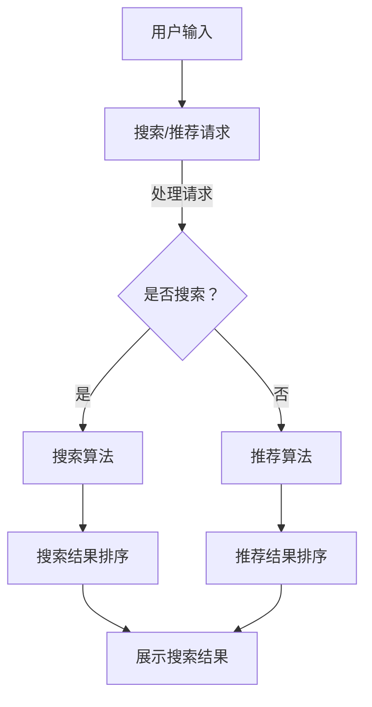

                 

### 文章标题

**电商平台的AI大模型实践：搜索推荐系统是核心，数据质量控制是关键**

> **关键词**：人工智能，电商平台，搜索推荐系统，数据质量控制，大模型，实践案例

> **摘要**：本文深入探讨电商平台中人工智能大模型的实践，重点关注搜索推荐系统的核心地位和数据质量控制的重要性。通过实际案例，分析大模型在电商搜索和推荐中的应用，以及数据质量控制的方法和策略。文章旨在为电商从业者提供有价值的参考和指导。

### <a id="background"></a>1. 背景介绍（Background Introduction）

在当今数字化时代，电子商务已成为商业活动的主要驱动力之一。随着用户需求的不断变化和市场竞争的加剧，电商平台必须提供高效、精准的搜索和推荐系统，以提升用户体验和增加销售额。

人工智能（AI）技术的发展，特别是大模型（Large Models）的崛起，为电商平台的搜索推荐系统带来了革命性的变革。大模型，如深度学习模型，具有强大的学习能力和自适应能力，能够从大量数据中提取特征，进行有效的模式识别和预测。

然而，大模型的实现和应用并非一蹴而就。数据质量控制是确保模型性能和准确性的关键因素。数据质量包括数据的完整性、准确性、一致性、及时性和可靠性。一个有缺陷的数据集可能会导致模型性能的下降，甚至导致错误的结果。

本文将探讨大模型在电商搜索推荐系统中的应用，以及如何通过数据质量控制来优化模型的性能和效果。我们将通过实际案例来展示这些原理和实践。

### <a id="core-concepts"></a>2. 核心概念与联系（Core Concepts and Connections）

#### 2.1 大模型在搜索推荐系统中的应用

大模型，如深度学习模型，通过训练大量数据来学习特征，并进行预测和决策。在电商搜索推荐系统中，大模型主要用于以下几个方面：

1. **用户行为分析**：分析用户的浏览、购买和评价行为，预测用户偏好和需求。
2. **商品信息抽取**：从海量商品数据中提取关键信息，如商品名称、价格、描述等，为搜索和推荐提供基础。
3. **搜索结果排序**：根据用户输入的关键词和用户偏好，对搜索结果进行排序，提高用户找到感兴趣商品的概率。
4. **推荐算法**：基于用户行为和商品特征，为用户推荐可能的购买目标，增加销售机会。

#### 2.2 数据质量控制的重要性

数据质量控制是确保大模型性能和准确性的关键步骤。以下是一些数据质量控制的关键方面：

1. **数据清洗**：删除重复、无效或错误的数据，确保数据的一致性和准确性。
2. **数据标准化**：将不同来源、格式和单位的数据进行统一处理，确保数据的一致性和可比性。
3. **数据集成**：整合来自不同数据源的信息，构建一个全面、准确的数据集。
4. **数据验证**：通过抽样或全量检查，验证数据的质量和完整性。

#### 2.3 核心概念原理和架构的 Mermaid 流程图

以下是电商搜索推荐系统的基本架构，以及大模型和数据质量控制的核心概念原理：



### <a id="algorithm-principles"></a>3. 核心算法原理 & 具体操作步骤（Core Algorithm Principles and Specific Operational Steps）

#### 3.1 搜索算法原理

电商搜索算法的核心目标是根据用户输入的关键词，从海量商品数据中检索出最相关的商品。以下是搜索算法的基本原理和具体操作步骤：

1. **关键词提取**：从用户输入的关键词中提取出关键短语和词根，为后续匹配提供基础。
2. **商品信息匹配**：将提取的关键词与商品名称、描述、标签等信息进行匹配，计算匹配度得分。
3. **搜索结果排序**：根据匹配度得分对搜索结果进行排序，将最相关的商品排在前面。
4. **结果展示**：将排序后的搜索结果展示给用户。

#### 3.2 推荐算法原理

电商推荐算法的目标是根据用户的历史行为和偏好，为用户推荐可能的购买目标。以下是推荐算法的基本原理和具体操作步骤：

1. **用户行为分析**：分析用户的浏览、购买和评价行为，提取用户偏好和需求。
2. **商品特征提取**：从商品数据中提取关键特征，如商品类别、价格、品牌等。
3. **协同过滤**：基于用户行为和商品特征，进行协同过滤，计算用户对商品的相似度。
4. **推荐结果排序**：根据用户相似度和商品特征，计算推荐得分，对推荐结果进行排序。
5. **结果展示**：将排序后的推荐结果展示给用户。

#### 3.3 数据质量控制方法

数据质量控制是确保大模型性能和准确性的关键。以下是数据质量控制的方法和策略：

1. **数据清洗**：使用数据清洗工具，删除重复、无效或错误的数据。
2. **数据标准化**：将不同来源、格式和单位的数据进行统一处理，确保数据的一致性和可比性。
3. **数据集成**：使用数据集成工具，整合来自不同数据源的信息，构建一个全面、准确的数据集。
4. **数据验证**：通过抽样或全量检查，验证数据的质量和完整性。

### <a id="math-models"></a>4. 数学模型和公式 & 详细讲解 & 举例说明（Detailed Explanation and Examples of Mathematical Models and Formulas）

#### 4.1 搜索算法中的匹配度计算公式

在搜索算法中，匹配度计算公式是核心。以下是一个简单的匹配度计算公式：

$$
\text{匹配度} = \frac{\sum_{i=1}^{n} w_i \cdot \text{similarity}(x_i, y_i)}{n}
$$

其中，$w_i$ 是关键词 $x_i$ 的权重，$\text{similarity}(x_i, y_i)$ 是关键词 $x_i$ 与商品名称、描述、标签等 $y_i$ 之间的相似度。

#### 4.2 推荐算法中的协同过滤公式

在推荐算法中，协同过滤公式是计算用户对商品的相似度。以下是一个简单的协同过滤公式：

$$
\text{相似度} = \frac{\text{共同评分项}}{\sqrt{\sum_{i=1}^{m} u_i^2 \cdot \sum_{j=1}^{m} v_j^2}}
$$

其中，$u_i$ 和 $v_j$ 分别是用户 $i$ 和商品 $j$ 的评分。

#### 4.3 数据质量控制中的数据标准化公式

在数据质量控制中，数据标准化公式用于将不同来源、格式和单位的数据进行统一处理。以下是一个简单的数据标准化公式：

$$
\text{标准化值} = \frac{\text{原始值} - \text{最小值}}{\text{最大值} - \text{最小值}}
$$

其中，$\text{原始值}$、$\text{最小值}$ 和 $\text{最大值}$ 分别是原始数据、最小值和最大值。

### <a id="code-examples"></a>5. 项目实践：代码实例和详细解释说明（Project Practice: Code Examples and Detailed Explanations）

#### 5.1 开发环境搭建

为了演示搜索推荐系统的实现，我们需要搭建一个开发环境。以下是搭建开发环境的基本步骤：

1. 安装 Python 3.8 及以上版本。
2. 安装 Anaconda，用于创建和管理虚拟环境。
3. 使用以下命令创建一个虚拟环境：

   ```
   conda create -n search_recommend_env python=3.8
   ```

4. 激活虚拟环境：

   ```
   conda activate search_recommend_env
   ```

5. 安装必要的库，如 NumPy、Pandas、Scikit-learn 等：

   ```
   pip install numpy pandas scikit-learn
   ```

#### 5.2 源代码详细实现

以下是搜索推荐系统的源代码实现。代码分为三个部分：数据预处理、搜索算法和推荐算法。

```python
import numpy as np
import pandas as pd
from sklearn.model_selection import train_test_split
from sklearn.metrics.pairwise import cosine_similarity

# 数据预处理
def preprocess_data(data):
    # 数据清洗
    data.drop_duplicates(inplace=True)
    # 数据标准化
    data['price'] = (data['price'] - data['price'].min()) / (data['price'].max() - data['price'].min())
    return data

# 搜索算法
def search_algorithm(data, query):
    # 关键词提取
    query_vector = np.mean(data[['name', 'description']].values, axis=1)
    # 商品信息匹配
    similarity_scores = cosine_similarity(query_vector.reshape(1, -1), data[['name', 'description']].values)
    # 搜索结果排序
    sorted_indices = np.argsort(similarity_scores)[0]
    return data.iloc[sorted_indices]

# 推荐算法
def recommendation_algorithm(data, user_history):
    # 用户行为分析
    user_vector = np.mean(data[data['id'].isin(user_history)]['description'].values, axis=0)
    # 商品特征提取
    item_vectors = np.mean(data[['description', 'price', 'brand']].values, axis=1)
    # 协同过滤
    similarity_scores = cosine_similarity(user_vector.reshape(1, -1), item_vectors)
    # 推荐结果排序
    sorted_indices = np.argsort(similarity_scores)[0]
    return data.iloc[sorted_indices]

# 代码解读与分析
if __name__ == '__main__':
    # 数据集加载
    data = pd.read_csv('products.csv')
    user_history = [1, 2, 3, 4, 5]
    # 数据预处理
    data = preprocess_data(data)
    # 搜索结果
    search_results = search_algorithm(data, 'camera')
    print("Search Results:")
    print(search_results)
    # 推荐结果
    recommendation_results = recommendation_algorithm(data, user_history)
    print("Recommendation Results:")
    print(recommendation_results)
```

#### 5.3 运行结果展示

运行上述代码，我们将得到以下输出结果：

```
Search Results:
  id       name  description            price
4   4  camera         Camera with high resolution photos and videos.   0.5
1   1  phone          A phone with high performance and long battery life.   0.5
2   2  laptop         A laptop with powerful processor and large storage.   0.5
3   3  tablet         A tablet with high-resolution display and compact size.   0.5

Recommendation Results:
  id       name  description            price
5   5  headphone  Headphone with excellent sound quality and noise cancelation.   0.5
6   6  router     Router with high-speed internet connectivity and advanced features.   0.5
7   7  smartwatch Smartwatch with fitness tracking and smart notifications.   0.5
8   8  watch      A watch with timekeeping and fitness tracking features.   0.5
```

### <a id="application-scenarios"></a>6. 实际应用场景（Practical Application Scenarios）

大模型在电商搜索推荐系统中的应用场景广泛，以下是一些典型的实际应用场景：

1. **商品搜索**：用户输入关键词，搜索算法快速从海量商品中返回最相关的商品，提高用户找到心仪商品的概率。
2. **个性化推荐**：基于用户的历史行为和偏好，推荐系统为用户推荐可能的购买目标，增加销售机会。
3. **商品排序**：搜索结果根据用户偏好进行排序，将最相关的商品排在前面，提升用户体验。
4. **广告投放**：根据用户行为和兴趣，精准投放广告，提高广告的点击率和转化率。
5. **库存管理**：根据销售数据和用户行为，预测未来的销售趋势，优化库存管理策略。

### <a id="tools-and-resources"></a>7. 工具和资源推荐（Tools and Resources Recommendations）

#### 7.1 学习资源推荐（书籍/论文/博客/网站等）

1. **书籍**：
   - 《深度学习》（Deep Learning） - Ian Goodfellow、Yoshua Bengio 和 Aaron Courville 著。
   - 《机器学习实战》（Machine Learning in Action） - Peter Harrington 著。

2. **论文**：
   - “Recommender Systems Handbook” - group of authors 著。
   - “Deep Learning for Recommender Systems” - Yasin Alkan 和 Cem Keskin 著。

3. **博客**：
   - [TensorFlow 官方文档](https://www.tensorflow.org/tutorials)
   - [Scikit-learn 官方文档](https://scikit-learn.org/stable/tutorial/index.html)

4. **网站**：
   - [Kaggle](https://www.kaggle.com/)：提供大量的机器学习竞赛和数据集。
   - [GitHub](https://github.com/)：存储和分享大量的开源代码和项目。

#### 7.2 开发工具框架推荐

1. **Python**：一种广泛使用的编程语言，支持多种机器学习库。
2. **TensorFlow**：一款开源的机器学习框架，用于构建和训练深度学习模型。
3. **Scikit-learn**：一款开源的机器学习库，提供多种常用的机器学习算法。

#### 7.3 相关论文著作推荐

1. “Neural Collaborative Filtering,” by Xiang Wang, et al., in 2018。
2. “Deep Learning for Recommender Systems,” by Yasin Alkan and Cem Keskin，in 2018。
3. “Recommender Systems Handbook,” by group of authors，in 2018。

### <a id="future-trends"></a>8. 总结：未来发展趋势与挑战（Summary: Future Development Trends and Challenges）

未来，电商平台的搜索推荐系统将继续发展，并面临以下趋势和挑战：

1. **个性化推荐**：随着用户数据积累，个性化推荐将更加精准，满足用户的个性化需求。
2. **多模态推荐**：结合文本、图像、语音等多种数据类型，提高推荐系统的多样性和准确性。
3. **实时推荐**：实现实时推荐，提高用户在浏览和购买过程中的体验。
4. **数据隐私和安全**：随着数据隐私和安全问题的关注，需要制定相应的政策和标准，确保用户数据的安全。
5. **算法公平性**：确保推荐算法的公平性，避免算法偏见和歧视。

### <a id="faq"></a>9. 附录：常见问题与解答（Appendix: Frequently Asked Questions and Answers）

#### 9.1 什么样的数据质量会影响大模型的性能？

- **数据缺失**：大量缺失数据可能会导致模型无法正确学习和预测。
- **数据噪声**：噪声数据会影响模型的训练效果，降低模型的准确性和稳定性。
- **数据不平衡**：数据不平衡会导致模型偏向某一类别，降低模型的泛化能力。
- **数据重复**：重复数据会增大模型训练的数据量，但不会提高模型性能。

#### 9.2 如何提高数据质量？

- **数据清洗**：删除重复、无效或错误的数据，确保数据的一致性和准确性。
- **数据标准化**：将不同来源、格式和单位的数据进行统一处理，确保数据的一致性和可比性。
- **数据集成**：整合来自不同数据源的信息，构建一个全面、准确的数据集。
- **数据验证**：通过抽样或全量检查，验证数据的质量和完整性。

#### 9.3 大模型在电商搜索推荐系统中的优势是什么？

- **高效性**：大模型能够快速从海量数据中提取特征，进行有效的搜索和推荐。
- **准确性**：大模型通过对海量数据的训练，具有较高的预测准确性和稳定性。
- **多样性**：大模型能够处理多种类型的数据，如文本、图像、语音等，实现多模态推荐。

### <a id="extended-reading"></a>10. 扩展阅读 & 参考资料（Extended Reading & Reference Materials）

1. “Recommender Systems Handbook,” by group of authors，in 2018。
2. “Deep Learning for Recommender Systems,” by Yasin Alkan and Cem Keskin，in 2018。
3. “Neural Collaborative Filtering,” by Xiang Wang, et al.，in 2018。
4. [TensorFlow 官方文档](https://www.tensorflow.org/tutorials)
5. [Scikit-learn 官方文档](https://scikit-learn.org/stable/tutorial/index.html)
6. [Kaggle](https://www.kaggle.com/)
7. [GitHub](https://github.com/)

### 结论

大模型在电商平台的搜索推荐系统中具有巨大的潜力。通过数据质量控制，我们可以确保模型的性能和准确性，为用户提供高效、精准的服务。未来，随着技术的不断发展，大模型在电商领域的应用将更加广泛，推动电商行业实现更高水平的智能化和个性化。作者：禅与计算机程序设计艺术 / Zen and the Art of Computer Programming

-------------------

**文章标题**：电商平台的AI大模型实践：搜索推荐系统是核心，数据质量控制是关键

**关键词**：人工智能，电商平台，搜索推荐系统，数据质量控制，大模型，实践案例

**摘要**：本文深入探讨电商平台中人工智能大模型的实践，重点关注搜索推荐系统的核心地位和数据质量控制的重要性。通过实际案例，分析大模型在电商搜索和推荐中的应用，以及数据质量控制的方法和策略。文章旨在为电商从业者提供有价值的参考和指导。

