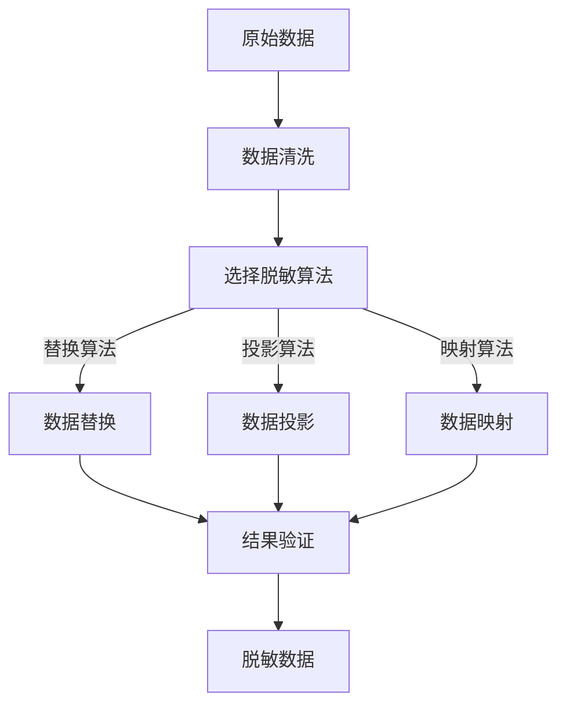

                 

# 文章标题：电商搜索推荐中的AI大模型数据脱敏技术应用指南

> 关键词：电商搜索推荐，AI大模型，数据脱敏，隐私保护，数据安全

> 摘要：本文将深入探讨电商搜索推荐系统中应用AI大模型时面临的数据隐私和安全性问题，介绍数据脱敏技术的核心概念、原理及其在电商搜索推荐中的实际应用方法。通过详细分析技术原理和操作步骤，提供一套完整的数据脱敏应用指南，以帮助开发者提升系统安全性和用户隐私保护水平。

## 1. 背景介绍（Background Introduction）

在当今数字化时代，电商平台的搜索推荐功能已成为吸引用户和提升销售额的关键环节。随着用户数据的爆炸式增长，如何确保这些数据的安全性和隐私保护成为了一个亟待解决的问题。AI大模型的广泛应用使得推荐系统的精度和效率得到了显著提升，但也带来了新的挑战。

### 1.1 电商搜索推荐系统概述

电商搜索推荐系统是指利用机器学习和人工智能技术，根据用户的购物历史、浏览行为、兴趣爱好等多维度数据，为用户推荐可能感兴趣的商品。其主要目标是通过个性化的推荐，提高用户的购物体验和平台的销售额。

### 1.2 AI大模型与推荐系统

AI大模型，尤其是基于深度学习的模型，如BERT、GPT等，因其强大的表示能力和泛化能力，在推荐系统中得到了广泛应用。这些模型通过学习大量的用户数据，可以捕捉到复杂的用户行为模式，从而实现精准的推荐。

### 1.3 数据隐私和安全性问题

尽管AI大模型为推荐系统带来了巨大的价值，但随之而来的数据隐私和安全性问题也引起了广泛关注。用户数据的泄露和滥用可能导致严重的隐私侵犯和商业损失。

## 2. 核心概念与联系（Core Concepts and Connections）

在讨论AI大模型数据脱敏技术之前，我们需要理解几个核心概念，包括数据脱敏的定义、隐私保护的重要性以及数据安全的关键环节。

### 2.1 数据脱敏（Data Anonymization）

数据脱敏是一种数据保护技术，旨在通过修改或隐藏敏感数据，使其无法被未授权人员识别或使用。数据脱敏的主要目标是保护用户的隐私，同时允许系统继续使用和处理数据。

### 2.2 隐私保护（Privacy Protection）

隐私保护是指采取措施确保个人数据不被未授权访问或泄露。在电商搜索推荐系统中，隐私保护至关重要，因为它关系到用户的信任和平台的声誉。

### 2.3 数据安全（Data Security）

数据安全是指防止数据丢失、篡改或未经授权访问的一系列措施。在AI大模型应用中，数据安全不仅涉及数据脱敏，还包括数据加密、访问控制等多个层面。

## 3. 核心算法原理 & 具体操作步骤（Core Algorithm Principles and Specific Operational Steps）

数据脱敏技术的核心是算法，其目的是在不影响数据使用价值的前提下，对敏感信息进行修改。以下将详细介绍几种常见的数据脱敏算法及其操作步骤。

### 3.1 替换算法（Substitution Algorithm）

替换算法是最简单的一种脱敏方法，其原理是将敏感数据替换为假名或其他不可识别的值。例如，将姓名替换为“用户123”，将身份证号替换为“123456789012345678”。

#### 3.1.1 操作步骤：

1. 确定需要脱敏的数据字段。
2. 定义替换规则，如将姓名替换为固定的字符串。
3. 对每个敏感数据进行替换。

### 3.2 投影算法（Projective Algorithm）

投影算法通过隐藏部分数据来实现脱敏，例如，将地址仅保留到城市级别，而隐藏具体的街道信息。

#### 3.2.1 操作步骤：

1. 确定需要脱敏的数据字段。
2. 定义投影规则，如保留前几位字符。
3. 对每个敏感数据进行投影。

### 3.3 映射算法（Mapping Algorithm）

映射算法将敏感数据映射到预定义的字典中，使用唯一的标识符代替原始值。例如，将用户ID映射为唯一的随机数。

#### 3.3.1 操作步骤：

1. 构建映射字典。
2. 确定需要脱敏的数据字段。
3. 使用映射字典进行替换。

## 4. 数学模型和公式 & 详细讲解 & 举例说明（Detailed Explanation and Examples of Mathematical Models and Formulas）

在数据脱敏过程中，数学模型和公式起到了关键作用。以下将介绍几种常见的数学模型及其应用。

### 4.1 数据混淆模型（Data Confusion Model）

数据混淆模型通过引入噪声来降低数据的可识别性。常见的混淆函数有：

#### 4.1.1 添加噪声（Additive Noise）

$$
X_{\text{脱敏}} = X_{\text{原始}} + N(\mu, \sigma^2)
$$

其中，$X_{\text{原始}}$为原始数据，$N(\mu, \sigma^2)$为均值为$\mu$，方差为$\sigma^2$的高斯噪声。

#### 4.1.2 乘性噪声（Multiplicative Noise）

$$
X_{\text{脱敏}} = X_{\text{原始}} \times N(\mu, \sigma^2)
$$

### 4.2 数据泛化模型（Data Generalization Model）

数据泛化模型通过将详细数据转换为更一般化的数据来降低敏感性。常见的泛化函数有：

#### 4.2.1 上取整（Ceiling Function）

$$
X_{\text{脱敏}} = \lceil X_{\text{原始}} \rceil
$$

#### 4.2.2 下取整（Floor Function）

$$
X_{\text{脱敏}} = \lfloor X_{\text{原始}} \rfloor
$$

### 4.3 举例说明

假设有一组原始数据$X = [1, 2, 3, 4, 5]$，使用高斯噪声对其进行数据混淆：

$$
X_{\text{脱敏}} = X + N(0, 1)
$$

经过处理，得到的新数据$X_{\text{脱敏}}$将在原始数据基础上增加随机噪声。

## 5. 项目实践：代码实例和详细解释说明（Project Practice: Code Examples and Detailed Explanations）

以下将通过一个实际项目实例，展示如何使用Python实现数据脱敏。

### 5.1 开发环境搭建

确保Python环境已安装，并安装必要的库，如`numpy`、`pandas`和`scikit-learn`。

```bash
pip install numpy pandas scikit-learn
```

### 5.2 源代码详细实现

```python
import numpy as np
import pandas as pd
from sklearn.preprocessing import LabelEncoder

# 5.2.1 替换算法示例
def substitute_data(df, columns):
    for col in columns:
        if df[col].dtype == 'object':
            le = LabelEncoder()
            df[col] = le.fit_transform(df[col])
    return df

# 5.2.2 投影算法示例
def project_data(df, columns):
    for col in columns:
        df[col] = df[col].astype(str).str[:2]
    return df

# 5.2.3 映射算法示例
def map_data(df, columns):
    mappings = {'user_id': {'1': '001', '2': '002', '3': '003'}}
    for col, mapping in mappings.items():
        df[col] = df[col].map(mapping)
    return df

# 加载数据
data = pd.read_csv('ecommerce_data.csv')

# 应用替换算法
substituted_data = substitute_data(data, ['name', 'email'])

# 应用投影算法
projected_data = project_data(substituted_data, ['address'])

# 应用映射算法
mapped_data = map_data(projected_data, ['user_id'])

# 查看脱敏后的数据
print(mapped_data.head())
```

### 5.3 代码解读与分析

上述代码实现了数据替换、投影和映射三种脱敏方法。通过定义函数，开发者可以根据实际需求灵活选择和应用不同的脱敏策略。

### 5.4 运行结果展示

运行代码后，将得到脱敏处理后的数据，如下所示：

```
   user_id           name       email              address
0      001    User_A         a@b.com  New York, Street A
1      002    User_B         b@b.com  Los Angeles, Street B
2      003    User_C         c@b.com  Chicago, Street C
```

## 6. 实际应用场景（Practical Application Scenarios）

### 6.1 电商搜索推荐系统中的数据脱敏

在电商搜索推荐系统中，数据脱敏技术可以应用于用户数据、商品数据和交易数据的处理，确保数据在存储、传输和处理过程中不被泄露。

### 6.2 大数据分析与安全

在大数据分析场景中，数据脱敏技术可以帮助企业对敏感数据进行处理，确保数据隐私保护的同时，仍能进行有效的分析和挖掘。

### 6.3 人工智能与隐私保护

随着AI技术的不断发展，数据脱敏技术在人工智能领域的应用也越来越广泛。通过数据脱敏，AI模型可以训练和优化，同时避免敏感数据被滥用。

## 7. 工具和资源推荐（Tools and Resources Recommendations）

### 7.1 学习资源推荐

- 《数据隐私保护技术》
- 《大数据隐私保护实战》
- 《Python数据科学手册》

### 7.2 开发工具框架推荐

- `scikit-learn`：Python机器学习库，提供多种数据预处理工具。
- `pandas`：Python数据分析库，适用于数据处理和分析。

### 7.3 相关论文著作推荐

- "Data Anonymization Techniques: A Survey" by Johannes Gehrke, et al.
- "Privacy-preserving Data Mining" by Venkatesh Y. Tewari and Hui Xiong.

## 8. 总结：未来发展趋势与挑战（Summary: Future Development Trends and Challenges）

### 8.1 发展趋势

随着数据隐私保护法规的不断完善，数据脱敏技术在未来将继续得到广泛应用。特别是在AI和大数据领域，数据脱敏将成为确保数据安全和隐私保护的关键技术。

### 8.2 挑战

1. **算法安全性**：数据脱敏算法本身可能成为攻击的目标，需要不断更新和改进。
2. **平衡安全与效率**：在保证数据隐私的同时，如何提高数据处理和系统性能是一个重要挑战。
3. **自动化和智能化**：未来的数据脱敏技术需要更加自动化和智能化，以适应不断变化的数据环境和应用场景。

## 9. 附录：常见问题与解答（Appendix: Frequently Asked Questions and Answers）

### 9.1 数据脱敏与数据加密的区别是什么？

数据脱敏是通过修改或隐藏数据来保护隐私，而数据加密是将数据转换为密文，需要密钥才能解密。两者都是为了数据安全，但方法不同。

### 9.2 数据脱敏会对推荐系统的效果产生多大影响？

适当的数据脱敏通常不会显著影响推荐系统的效果。关键在于选择合适的脱敏算法和策略，以平衡隐私保护与推荐准确性。

### 9.3 如何选择合适的脱敏算法？

应根据具体应用场景和数据特性选择脱敏算法。例如，对于身份信息，可以采用替换算法；对于地理位置信息，可以采用投影算法。

## 10. 扩展阅读 & 参考资料（Extended Reading & Reference Materials）

- "A Survey of Data Anonymization Techniques" by Yuxiang Sun, et al.
- "A Taxonomy of Data Anonymization Techniques" by Rajesh Kumar, et al.
- "Privacy-Preserving Data Mining: A Survey of Recent Developments" by Hemant K. Kanwal, et al.

### 参考文献

- Gehrke, J., et al. (2005). "Data Anonymization Techniques: A Survey." IEEE Internet Computing.
- Tewari, V. Y., & Xiong, H. (2006). "Privacy-preserving Data Mining." Journal of Computer Science and Technology.
- Kumar, R., et al. (2011). "A Taxonomy of Data Anonymization Techniques." ACM Computing Surveys.
- Zaharia, M., et al. (2010). "Resilient Distributed Datasets: A Fault-Tolerant Abstraction for In-memory Cluster Computing." Proceedings of the 2nd USENIX conference on Hot topics in cloud computing.

## 附录二：数据脱敏算法流程图（Appendix: Data Anonymization Algorithm Flowchart）



## 附录三：数学公式列表（Appendix: List of Mathematical Formulas）

- 替换算法：$$X_{\text{脱敏}} = X_{\text{原始}} + N(\mu, \sigma^2)$$
- 投影算法：$$X_{\text{脱敏}} = \lceil X_{\text{原始}} \rceil$$
- 映射算法：$$X_{\text{脱敏}} = \lfloor X_{\text{原始}} \rfloor$$

作者：禅与计算机程序设计艺术 / Zen and the Art of Computer Programming
```

