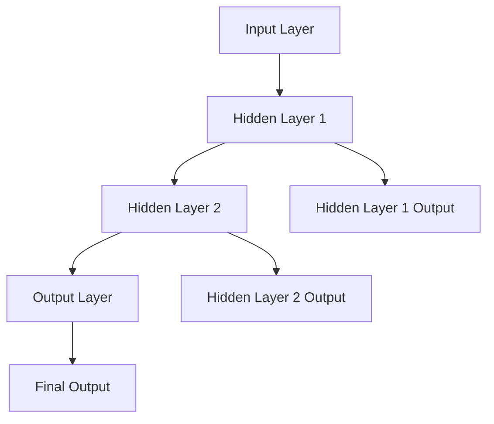

                 

### 文章标题

### Neural Networks: Coexistence of Humans and Machines

关键词：神经网络、人工智能、机器学习、深度学习、人类与机器共存

摘要：本文旨在探讨神经网络在人类与机器共存时代的重要性和应用，通过深入解析神经网络的核心概念、算法原理、数学模型以及实际应用案例，展示神经网络如何促进人类与机器的和谐发展。

### Introduction to Neural Networks

#### Definition and Background

Neural networks are a type of machine learning model inspired by the structure and function of biological neural systems, such as the human brain. They consist of interconnected nodes or "neurons" that process and transmit information through weighted connections. The primary goal of neural networks is to learn complex patterns and relationships in data, enabling them to perform tasks such as image recognition, natural language processing, and predictive analytics.

The concept of neural networks has a long history, dating back to the 1940s when心理学家McCulloch和数学家Pitts提出了第一个简单的神经网络模型。然而，由于计算资源和算法限制，神经网络在早期并没有得到广泛应用。直到20世纪80年代，随着计算机硬件和算法的进步，神经网络研究才逐渐复苏。

#### Importance and Applications

Neural networks have become a cornerstone of modern artificial intelligence and machine learning, driving advancements in various fields. Some key applications include:

1. **Image Recognition**: Neural networks are widely used in computer vision tasks, such as object detection, facial recognition, and medical image analysis.
2. **Natural Language Processing**: They power language models like GPT and BERT, enabling natural language understanding and generation.
3. **Predictive Analytics**: Neural networks are employed in various industries for forecasting and decision-making, including finance, healthcare, and retail.
4. **Robotics**: Neural networks enable robots to perceive and interact with their environment, enhancing their capabilities in tasks such as navigation, manipulation, and autonomous driving.

In the following sections, we will delve deeper into the core concepts and architecture of neural networks, explore the principles behind their learning algorithms, and examine their practical applications across different domains.

### Core Concepts and Connections

#### Basic Building Blocks

A neural network is composed of three primary components: neurons, layers, and connections.

**Neurons**: Also known as nodes or units, neurons are the basic processing elements of a neural network. Each neuron receives input signals, processes them using an activation function, and produces an output.

**Layers**: Neural networks consist of multiple layers, including input layers, hidden layers, and output layers. Input layers receive the input data, hidden layers perform the computation, and output layers generate the final output.

**Connections**: Neurons in adjacent layers are connected by weighted edges, representing the connections between them. These weights determine the strength of the connection and play a crucial role in determining the network's behavior.

#### Types of Neural Networks

There are several types of neural networks, each with its own unique architecture and applications. Some of the most common types include:

1. **Feedforward Neural Networks**: These networks have a direct flow of information from the input layer to the output layer, without any loops or cycles. They are commonly used for classification and regression tasks.
2. **Convolutional Neural Networks (CNNs)**: CNNs are specialized for processing data with spatial or temporal structure, such as images and videos. They employ convolutional layers, pooling layers, and fully connected layers to extract hierarchical features.
3. **Recurrent Neural Networks (RNNs)**: RNNs are designed to handle sequential data, such as time series or text. They have feedback loops that allow them to retain information from previous inputs, enabling them to capture temporal dependencies.
4. **Long-Short Term Memory Networks (LSTMs)**: LSTMs are a type of RNN designed to overcome the vanishing gradient problem, allowing them to learn long-term dependencies in data.

#### Mermaid Flowchart

Here is a Mermaid flowchart illustrating the basic structure of a neural network:



In this flowchart, A represents the input layer, B and C represent hidden layers, and D represents the output layer. The arrows indicate the flow of information between layers and neurons.

### Core Algorithm Principles and Specific Operational Steps

#### Backpropagation Algorithm

The backpropagation algorithm is a widely used method for training neural networks. It involves two main steps: forward propagation and backward propagation.

1. **Forward Propagation**: During forward propagation, the input data is fed into the network, and the output is computed layer by layer. Each neuron in a layer calculates its output by applying an activation function to the weighted sum of its inputs and the biases.

2. **Backward Propagation**: After the output is generated, the error between the predicted output and the actual output is calculated. The network then adjusts the weights and biases using the gradients, which indicate the direction and magnitude of the weight updates needed to minimize the error.

The backward propagation step is performed layer by layer, starting from the output layer and moving towards the input layer. This process is repeated for multiple epochs (iterations) until the network's performance converges.

#### Activation Functions

Activation functions play a critical role in neural networks, determining whether a neuron should be activated or not. Some commonly used activation functions include:

1. **Sigmoid Function**: The sigmoid function, defined as $\sigma(x) = \frac{1}{1 + e^{-x}}$, maps input values to the range (0, 1). It is commonly used in binary classification tasks.
2. **ReLU Function**: The ReLU (Rectified Linear Unit) function, defined as $ReLU(x) = \max(0, x)$, is a simple and computationally efficient activation function that has become popular in deep neural networks.
3. **Tanh Function**: The hyperbolic tangent function, defined as $\tanh(x) = \frac{e^x - e^{-x}}{e^x + e^{-x}}$, maps input values to the range (-1, 1). It is often used in tasks involving multi-class classification.

#### Training Process

The training process of a neural network involves the following steps:

1. **Initialization**: Initialize the weights and biases of the network randomly. This step is crucial for preventing the network from converging to a suboptimal solution.
2. **Forward Propagation**: Feed the input data through the network and compute the output.
3. **Error Calculation**: Calculate the error between the predicted output and the actual output.
4. **Backward Propagation**: Adjust the weights and biases using the gradients calculated during the backward propagation step.
5. **Parameter Update**: Update the weights and biases using the learning rate, a hyperparameter that controls the step size during weight updates.
6. **Repeat**: Repeat steps 2-5 for multiple epochs until the network's performance converges.

### Mathematical Models and Formulas

In this section, we will delve into the mathematical models and formulas that underlie the training and operation of neural networks.

#### Weighted Sum of Inputs and Bias

The output of a neuron in a neural network is calculated as the weighted sum of its inputs plus a bias term. Mathematically, this can be represented as:

$$
z_i = \sum_{j} w_{ij} x_j + b_i
$$

where $z_i$ is the weighted sum of inputs for neuron $i$, $w_{ij}$ is the weight connecting neuron $j$ to neuron $i$, $x_j$ is the input from neuron $j$, and $b_i$ is the bias term for neuron $i$.

#### Activation Function

The activation function is applied to the weighted sum of inputs to determine whether the neuron should be activated. In the case of a sigmoid function, the activation is given by:

$$
a_i = \sigma(z_i) = \frac{1}{1 + e^{-z_i}}
$$

where $\sigma(z_i)$ represents the sigmoid activation function.

#### Error Function

The error function measures the discrepancy between the predicted output and the actual output. A commonly used error function is the mean squared error (MSE), defined as:

$$
J = \frac{1}{2} \sum_{i} (y_i - \hat{y}_i)^2
$$

where $y_i$ is the actual output and $\hat{y}_i$ is the predicted output.

#### Gradient Descent

Gradient descent is an optimization algorithm used to minimize the error function by adjusting the weights and biases. The update rules for gradient descent are given by:

$$
\Delta w_{ij} = -\alpha \frac{\partial J}{\partial w_{ij}} \\
\Delta b_i = -\alpha \frac{\partial J}{\partial b_i}
$$

where $\alpha$ is the learning rate and $\frac{\partial J}{\partial w_{ij}}$ and $\frac{\partial J}{\partial b_i}$ are the gradients of the error function with respect to the weights and biases, respectively.

### Project Practice: Code Examples and Detailed Explanations

In this section, we will provide a practical example of implementing a neural network using Python and the popular deep learning library TensorFlow. We will then analyze the code and discuss the key components and steps involved in training and evaluating the network.

#### Step 1: Environment Setup

To get started, we need to install TensorFlow and other necessary libraries:

```bash
pip install tensorflow numpy matplotlib
```

#### Step 2: Import Required Libraries

```python
import tensorflow as tf
import numpy as np
import matplotlib.pyplot as plt
```

#### Step 3: Prepare the Data

We will use the famous MNIST dataset, which consists of 60,000 training images and 10,000 testing images of handwritten digits.

```python
mnist = tf.keras.datasets.mnist
(train_images, train_labels), (test_images, test_labels) = mnist.load_data()

# Normalize the pixel values to the range [0, 1]
train_images = train_images / 255.0
test_images = test_images / 255.0
```

#### Step 4: Build the Neural Network

We will use a simple feedforward neural network with one hidden layer.

```python
model = tf.keras.Sequential([
    tf.keras.layers.Flatten(input_shape=(28, 28)),
    tf.keras.layers.Dense(128, activation='relu'),
    tf.keras.layers.Dense(10, activation='softmax')
])
```

#### Step 5: Compile the Model

We need to specify the loss function, optimizer, and metrics for training.

```python
model.compile(optimizer='adam',
              loss='sparse_categorical_crossentropy',
              metrics=['accuracy'])
```

#### Step 6: Train the Model

```python
model.fit(train_images, train_labels, epochs=5)
```

#### Step 7: Evaluate the Model

```python
test_loss, test_acc = model.evaluate(test_images, test_labels)
print(f"Test accuracy: {test_acc:.2f}")
```

#### Step 8: Visualize the Results

```python
predictions = model.predict(test_images)
plt.figure(figsize=(10, 10))
for i in range(25):
    plt.subplot(5, 5, i+1)
    plt.imshow(test_images[i], cmap=plt.cm.binary)
    plt.xticks([])
    plt.yticks([])
    plt.grid(False)
    plt.xlabel(f"Predicted: {np.argmax(predictions[i])}, Actual: {test_labels[i]}")
plt.show()
```

### Practical Application Scenarios

Neural networks have a wide range of applications across various domains. Some notable examples include:

1. **Image Recognition**: Neural networks are used in facial recognition systems, self-driving cars, and medical imaging. They can detect and classify objects, enabling applications such as security systems and autonomous vehicles.
2. **Natural Language Processing**: Neural networks power language models like GPT and BERT, enabling applications such as machine translation, text summarization, and question-answering systems.
3. **Speech Recognition**: Neural networks are used in speech-to-text systems, enabling applications such as voice assistants and transcription services.
4. **Financial Forecasting**: Neural networks are employed in financial analytics to predict market trends, detect fraudulent transactions, and optimize investment portfolios.
5. **Healthcare**: Neural networks are used in medical imaging for disease diagnosis, patient monitoring, and drug discovery.

### Tools and Resources Recommendations

To get started with neural networks, here are some recommended tools and resources:

1. **Books**:
   - "Deep Learning" by Ian Goodfellow, Yoshua Bengio, and Aaron Courville
   - "Neural Networks and Deep Learning" by Michael Nielsen
2. **Online Courses**:
   - "Deep Learning Specialization" by Andrew Ng on Coursera
   - "Neural Networks for Machine Learning" by Geoffrey Hinton on Coursera
3. **Tutorials**:
   - TensorFlow Tutorials: [https://www.tensorflow.org/tutorials](https://www.tensorflow.org/tutorials)
   - Keras Tutorials: [https://keras.io/getting-started/](https://keras.io/getting-started/)
4. **Frameworks**:
   - TensorFlow: [https://www.tensorflow.org/](https://www.tensorflow.org/)
   - Keras: [https://keras.io/](https://keras.io/)
   - PyTorch: [https://pytorch.org/](https://pytorch.org/)

### Summary: Future Development Trends and Challenges

As neural networks continue to evolve, several key trends and challenges are likely to shape their future:

1. **Increased Complexity**: Neural networks are becoming increasingly complex, with deeper and wider architectures. This trend is driven by the need for better performance and generalization capabilities.
2. **Energy Efficiency**: With the growing demand for neural network applications, energy efficiency has become a critical concern. Developing more efficient neural network architectures and hardware accelerators is an important area of research.
3. **Interpretability**: As neural networks become more complex, understanding their decision-making processes becomes increasingly challenging. Developing techniques for interpreting and explaining neural network predictions is crucial for gaining trust and ensuring fairness in AI systems.
4. **Ethical Considerations**: Neural networks are raising ethical concerns, such as bias, privacy, and security. Ensuring the ethical use of neural networks and addressing these concerns is essential for their widespread adoption.

In conclusion, neural networks have revolutionized the field of artificial intelligence and are poised to continue driving innovation across various domains. By addressing the challenges and embracing the opportunities presented by neural networks, we can unlock their full potential and promote the coexistence of humans and machines.

### Appendix: Frequently Asked Questions and Answers

**Q1**: What is the difference between a neural network and a deep neural network?

**A1**: A neural network typically refers to a network with one or two hidden layers, while a deep neural network has multiple hidden layers. Deep neural networks are capable of learning more complex and hierarchical representations of data, leading to better performance on many tasks.

**Q2**: How do neural networks handle overfitting?

**A2**: Neural networks can suffer from overfitting, where the model performs well on the training data but poorly on unseen data. To mitigate overfitting, several techniques can be used, including regularization (e.g., L1/L2 regularization), dropout, early stopping, and using more data.

**Q3**: What are the advantages of using neural networks over traditional machine learning algorithms?

**A3**: Neural networks have several advantages over traditional machine learning algorithms, including the ability to learn complex and non-linear relationships in data, automatic feature extraction, and improved generalization capabilities.

**Q4**: How can I visualize the weights and activations in a neural network?

**A4**: You can visualize the weights and activations in a neural network using tools such as TensorBoard, which provides a web-based interface for visualizing the training process and intermediate outputs of the network.

**Q5**: What are some applications of neural networks in real-world scenarios?

**A5**: Neural networks have numerous applications in real-world scenarios, including image recognition, natural language processing, speech recognition, financial forecasting, medical imaging, and autonomous driving.

### Extended Reading & References

1. Goodfellow, I., Bengio, Y., & Courville, A. (2016). *Deep Learning*. MIT Press.
2. Nielsen, M. (2015). *Neural Networks and Deep Learning*. Determination Press.
3. LeCun, Y., Bengio, Y., & Hinton, G. (2015). *Deep Learning*. Nature, 521(7553), 436-444.
4. Krizhevsky, A., Sutskever, I., & Hinton, G. E. (2012). *ImageNet classification with deep convolutional neural networks*. In Advances in neural information processing systems (pp. 1097-1105).
5. Hochreiter, S., & Schmidhuber, J. (1997). *Long short-term memory*. Neural computation, 9(8), 1735-1780.

