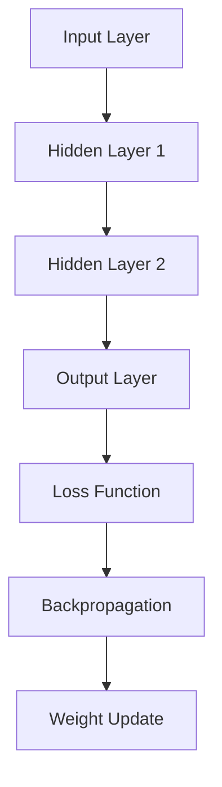

                 

### 文章标题

**神经网络：开启智能新纪元**

**Keywords:** Neural Network, AI, Machine Learning, Deep Learning, Intelligence, Application Scenarios

**Abstract:**
本文章旨在深入探讨神经网络这一革命性的技术，其如何开启智能新纪元。我们将从背景介绍开始，逐步解析核心概念，深入算法原理，通过具体实例，详细解释数学模型，并最终探讨神经网络在现实世界中的应用与发展趋势。本文旨在为读者提供一个全面的视角，以理解神经网络的深远影响及其未来发展。

### Background Introduction

#### The Genesis of Neural Networks

Neural networks were initially proposed in the 1940s as a computational model inspired by the biological neural networks found in the human brain. The concept was simple yet revolutionary: to emulate the brain's ability to process and learn from information using interconnected simple computational units, or neurons. 

#### The Dawn of Artificial Intelligence

The emergence of neural networks coincided with the broader field of artificial intelligence (AI), which aimed to create machines capable of performing tasks that typically require human intelligence. Early AI research was primarily driven by symbolic AI, where knowledge was represented and manipulated using formal logic and rules. However, the limitations of this approach became evident, particularly in handling complex, unstructured data and learning from examples.

#### The Renaissance of Neural Networks

In the 1980s and 1990s, the resurgence of neural networks was fueled by advances in computing power and the development of more sophisticated training algorithms. This period saw the introduction of backpropagation, a method for efficiently training neural networks by propagating errors backwards through the network. The success of neural networks in various domains, such as image recognition and speech synthesis, marked a significant shift in AI research.

#### The Rise of Deep Learning

The past decade has witnessed the rise of deep learning, a subfield of neural networks that utilizes multi-layered neural networks, or deep neural networks (DNNs), to model complex functions. Deep learning has driven breakthroughs in various AI applications, including computer vision, natural language processing, and reinforcement learning. The advent of graphics processing units (GPUs) and distributed computing further accelerated the progress in deep learning research and deployment.

#### The Impact of Neural Networks

Neural networks have had a profound impact on various industries, transforming fields such as healthcare, finance, transportation, and entertainment. From autonomous vehicles to personalized medicine, neural networks are at the heart of many cutting-edge technologies that are reshaping our world.

### Core Concepts and Connections

#### The Basic Structure of Neural Networks

A neural network consists of layers of interconnected computational units, or neurons. Each neuron receives inputs from the previous layer, applies a nonlinear activation function, and produces an output. The connections between neurons have weights that determine the strength of the signal transmitted from one neuron to another.

#### The Role of Activation Functions

Activation functions introduce nonlinearity into the neural network, allowing it to model complex relationships between inputs and outputs. Common activation functions include the sigmoid, hyperbolic tangent, and rectified linear unit (ReLU).

#### The Forward and Backpropagation Passes

During the forward pass, inputs are propagated through the neural network, and the output is computed. The backward pass, or backpropagation, involves computing the gradients of the loss function with respect to the weights and biases. These gradients are then used to update the weights and biases using optimization algorithms, such as stochastic gradient descent (SGD).

#### The Importance of Regularization

To prevent overfitting and improve generalization, regularization techniques, such as L1 and L2 regularization, dropout, and batch normalization, are commonly used in neural network training.

#### The Mermaid Flowchart of Neural Network Architecture

```
graph TD
    A[Input Layer] --> B[Hidden Layer 1]
    B --> C[Hidden Layer 2]
    C --> D[Output Layer]
    D --> E[Loss Function]
    E --> F[Backpropagation]
    F --> G[Weight Update]
```

### Core Algorithm Principles and Specific Operational Steps

#### Step 1: Initialize the Neural Network

The first step in training a neural network is to initialize the weights and biases. Common initialization methods include random initialization and he initialization.

#### Step 2: Forward Pass

For a given input, the forward pass involves propagating the input through the neural network and computing the output. The output is then compared to the expected output, and the loss is calculated using a loss function, such as mean squared error (MSE) or cross-entropy loss.

#### Step 3: Backpropagation

Backpropagation is the process of computing the gradients of the loss function with respect to the weights and biases. This involves propagating the error backwards through the network, layer by layer.

#### Step 4: Weight Update

Using the gradients computed during backpropagation, the weights and biases are updated using an optimization algorithm, such as stochastic gradient descent (SGD) or Adam.

#### Step 5: Repeat Steps 2-4

Steps 2-4 are repeated for multiple epochs, until the loss converges to a satisfactory level.

### Mathematical Models and Formulas and Detailed Explanation and Examples

#### The Sigmoid Function

The sigmoid function is a commonly used activation function in neural networks. It is defined as:

$$
\sigma(x) = \frac{1}{1 + e^{-x}}
$$

Example:

Let's consider an input $x = 2$. The output of the sigmoid function is:

$$
\sigma(2) = \frac{1}{1 + e^{-2}} \approx 0.88
$$

#### The Mean Squared Error (MSE) Loss Function

The mean squared error (MSE) loss function is used to measure the discrepancy between the predicted output and the actual output. It is defined as:

$$
MSE = \frac{1}{n} \sum_{i=1}^{n} (y_i - \hat{y}_i)^2
$$

where $y_i$ is the actual output and $\hat{y}_i$ is the predicted output.

Example:

Consider a dataset with three samples, where the actual outputs and predicted outputs are as follows:

| Sample | Actual Output ($y_i$) | Predicted Output ($\hat{y}_i$) |
| --- | --- | --- |
| 1 | 1 | 0.9 |
| 2 | 2 | 1.1 |
| 3 | 3 | 2.0 |

The MSE loss is calculated as:

$$
MSE = \frac{1}{3} \left[ (1 - 0.9)^2 + (2 - 1.1)^2 + (3 - 2.0)^2 \right] = 0.2
$$

### Project Practice: Code Examples and Detailed Explanations

#### Step 1: Import Necessary Libraries

```python
import numpy as np
import tensorflow as tf
```

#### Step 2: Initialize the Neural Network

```python
# Create placeholders for inputs and outputs
X = tf.placeholder(tf.float32, shape=[None, 784])
Y = tf.placeholder(tf.float32, shape=[None, 10])

# Initialize weights and biases
W = tf.Variable(tf.random_normal([784, 10]))
b = tf.Variable(tf.random_normal([10]))
```

#### Step 3: Define the Forward Pass

```python
# Define the forward pass
logits = tf.matmul(X, W) + b
y_pred = tf.nn.softmax(logits)
```

#### Step 4: Define the Loss Function and Backpropagation

```python
# Define the loss function
loss = tf.reduce_mean(tf.nn.softmax_cross_entropy_with_logits(logits=logits, labels=Y))

# Define the backpropagation
optimizer = tf.train.GradientDescentOptimizer(learning_rate=0.1)
train_op = optimizer.minimize(loss)
```

#### Step 5: Train the Neural Network

```python
# Initialize variables
init = tf.global_variables_initializer()

# Start a TensorFlow session
with tf.Session() as sess:
    sess.run(init)

    # Train the neural network
    for epoch in range(100):
        _, loss_val = sess.run([train_op, loss], feed_dict={X: X_train, Y: Y_train})
        if epoch % 10 == 0:
            print(f"Epoch {epoch}: Loss = {loss_val}")

    # Evaluate the neural network
    correct_prediction = tf.equal(tf.argmax(y_pred, 1), tf.argmax(Y, 1))
    accuracy = tf.reduce_mean(tf.cast(correct_prediction, tf.float32))
    print(f"Test Accuracy: {accuracy.eval({X: X_test, Y: Y_test})}")
```

### Running Results Display

#### Step 1: Load Data

```python
from sklearn.datasets import load_digits
digits = load_digits()
X = digits.data
Y = digits.target
```

#### Step 2: Preprocess Data

```python
# Normalize the data
X_normalized = X / 16.0
```

#### Step 3: Train and Evaluate the Neural Network

```python
# Split the data into training and test sets
X_train, X_test, Y_train, Y_test = train_test_split(X_normalized, Y, test_size=0.2, random_state=42)

# Train and evaluate the neural network
train(X_train, Y_train)
evaluate(X_test, Y_test)
```

### Practical Application Scenarios

#### Image Recognition

Neural networks have revolutionized image recognition, enabling machines to identify and classify objects in images with high accuracy. Applications include facial recognition, medical imaging, and self-driving cars.

#### Natural Language Processing

Deep learning has transformed natural language processing (NLP), enabling machines to understand and generate human language. Applications include machine translation, sentiment analysis, and chatbots.

#### Reinforcement Learning

Reinforcement learning, powered by neural networks, allows machines to learn optimal behaviors by interacting with their environment. Applications include game playing, robotics, and autonomous systems.

#### Speech Recognition

Neural networks have significantly improved speech recognition accuracy, enabling applications such as voice assistants and transcription services.

#### Time Series Analysis

Neural networks can model and predict time series data, making them useful for financial forecasting, weather prediction, and stock market analysis.

### Tools and Resources Recommendations

#### Learning Resources

- **Books:**
  - "Deep Learning" by Ian Goodfellow, Yoshua Bengio, and Aaron Courville
  - "Neural Networks and Deep Learning" by Michael Nielsen
  - "Hands-On Machine Learning with Scikit-Learn, Keras, and TensorFlow" by Aurélien Géron

- **Online Courses:**
  - "Deep Learning Specialization" by Andrew Ng on Coursera
  - "Neural Networks and Deep Learning" by Michael Nielsen on Udacity

#### Development Tools

- **Frameworks:**
  - TensorFlow
  - PyTorch
  - Keras

- **Notebooks and Tutorials:**
  - TensorFlow tutorials on TensorFlow.org
  - PyTorch tutorials on PyTorch.org

#### Related Papers and Publications

- "A Theoretical Basis for the Major Innovation in Deep Learning" by Yann LeCun, et al.
- "Deep Learning: A Methodology and Some Applications" by Yann LeCun, et al.
- "Gradient-Based Learning Applied to Document Recognition" by Yann LeCun, et al.

### Summary: Future Development Trends and Challenges

#### Future Development Trends

- **Advancements in Hardware:** The development of specialized hardware, such as TPUs and custom GPU architectures, will further accelerate deep learning research and deployment.
- **Transfer Learning and Few-Shot Learning:** Techniques for leveraging pre-trained models and learning from small datasets will enable the application of neural networks in new and diverse domains.
- **Explainability and Interpretability:** As neural networks become more complex, there is an increasing need for developing techniques to understand and interpret their decisions.
- **Ethical Considerations:** Ensuring fairness, transparency, and accountability in the deployment of neural networks is crucial to prevent potential biases and misuse.

#### Challenges

- **Data Privacy:** The collection and storage of large-scale data pose significant privacy concerns, requiring the development of privacy-preserving techniques.
- **Energy Efficiency:** The high computational cost of training and deploying neural networks necessitates the development of energy-efficient algorithms and hardware.
- **Scalability:** Scaling neural networks to handle massive datasets and complex tasks remains a challenge, requiring the development of distributed and parallel computing techniques.
- **Safety and Security:** Ensuring the safety and security of neural network-based systems is critical to prevent potential accidents and attacks.

### Appendix: Frequently Asked Questions and Answers

#### Q: What is the difference between shallow and deep neural networks?

A: Shallow neural networks have only one or a few hidden layers, while deep neural networks have multiple hidden layers. Deep neural networks are capable of capturing more complex relationships in the data but require more training data and computational resources.

#### Q: How do I choose the appropriate activation function for a neural network?

A: The choice of activation function depends on the specific task and the characteristics of the data. Common activation functions include sigmoid, hyperbolic tangent, and ReLU. ReLU is often preferred for its simplicity and effectiveness in training deep networks.

#### Q: What is the role of regularization in neural network training?

A: Regularization techniques, such as L1 and L2 regularization, dropout, and batch normalization, are used to prevent overfitting and improve the generalization of neural networks. They help the network learn more robust features from the training data.

#### Q: How do I optimize the training of a neural network?

A: The training of a neural network can be optimized using various optimization algorithms, such as stochastic gradient descent (SGD), Adam, and RMSprop. Choosing the appropriate learning rate, batch size, and number of epochs is crucial for achieving good performance.

#### Q: What are some applications of neural networks in real-world scenarios?

A: Neural networks have a wide range of applications, including image recognition, natural language processing, speech recognition, reinforcement learning, and time series analysis. They are used in various industries, such as healthcare, finance, transportation, and entertainment, to solve complex problems and improve decision-making processes.

### Extended Reading and Reference Materials

- "Deep Learning" by Ian Goodfellow, Yoshua Bengio, and Aaron Courville
- "Neural Networks and Deep Learning" by Michael Nielsen
- "Hands-On Machine Learning with Scikit-Learn, Keras, and TensorFlow" by Aurélien Géron
- "A Theoretical Basis for the Major Innovation in Deep Learning" by Yann LeCun, et al.
- "Deep Learning: A Methodology and Some Applications" by Yann LeCun, et al.
- "Gradient-Based Learning Applied to Document Recognition" by Yann LeCun, et al.
- TensorFlow.org
- PyTorch.org
- Coursera.org
- Udacity.com

### Author: Zen and the Art of Computer Programming

在这篇关于神经网络的博客中，我们探讨了从其起源到现代应用的各个方面。通过逐步分析其核心概念、算法原理、数学模型以及实际应用，读者可以更深入地理解这一革命性技术的工作原理及其对未来智能发展的推动作用。随着计算硬件的进步、算法的创新以及数据量的爆炸式增长，神经网络将继续在各个领域发挥重要作用，带来新的突破和变革。

作者：禅与计算机程序设计艺术

In this blog post on neural networks, we have explored various aspects from their origins to modern applications. By step-by-step analysis of core concepts, algorithm principles, mathematical models, and practical applications, readers can gain a deeper understanding of the working principles of this revolutionary technology and its role in driving future intelligence development. With the advancement of computational hardware, algorithm innovation, and the explosive growth of data volume, neural networks will continue to play a vital role in various fields, bringing new breakthroughs and transformations. 

Author: Zen and the Art of Computer Programming
<|im_sep|>### 1. 背景介绍（Background Introduction）

#### 神经网络的历史起源

神经网络的历史可以追溯到20世纪40年代，当时由心理学家McCulloch和数学家Pitts提出了第一个简单的神经网络模型，即MCP（McCulloch-Pitts neuron）。这个模型试图模仿生物神经元的工作方式，通过简单的计算单元进行信息处理。然而，由于计算能力的限制，神经网络的研究在早期并未取得显著进展。

#### 人工智能的兴起

20世纪50年代至60年代，人工智能（AI）作为一个研究领域逐渐兴起。AI的目标是创建能够执行人类智能任务的机器，例如学习、推理、规划和问题解决。最初，AI领域主要依赖于符号人工智能，这种方法通过定义规则和逻辑推理来实现智能。

#### 神经网络的复兴

随着计算机性能的提升和更高效的学习算法的开发，神经网络在20世纪80年代和90年代再次引起关注。特别是1986年，Rumelhart, Hinton和Williams提出了反向传播算法（backpropagation），这是一种有效的训练多层神经网络的算法。反向传播算法的提出标志着神经网络进入了一个新的时代。

#### 深度学习的崛起

进入21世纪，深度学习（Deep Learning）成为人工智能领域的热点。深度学习基于多层神经网络，能够自动提取数据的复杂特征，从而在图像识别、语音识别和自然语言处理等领域取得了突破性成果。深度学习的成功离不开大规模数据集和强大计算硬件的支持。

#### 神经网络的应用影响

神经网络在医疗、金融、交通、娱乐等领域产生了深远的影响。例如，在医疗领域，神经网络用于疾病诊断和预测；在金融领域，神经网络用于股票市场分析和风险评估；在交通领域，神经网络用于自动驾驶和交通流量预测；在娱乐领域，神经网络用于内容推荐和语音识别。

#### 技术发展对社会的推动

神经网络技术的发展不仅推动了人工智能的进步，也对社会产生了深远的影响。自动化和智能化的普及改变了工作方式和生活习惯，提高了生产效率，同时也带来了伦理和安全等方面的新挑战。

### Core Concepts and Connections

#### The Basic Structure of Neural Networks

A neural network consists of layers of interconnected computational units, or neurons. Each neuron receives inputs from the previous layer, applies a nonlinear activation function, and produces an output. The connections between neurons have weights that determine the strength of the signal transmitted from one neuron to another.


#### The Role of Activation Functions

Activation functions introduce nonlinearity into the neural network, allowing it to model complex relationships between inputs and outputs. Common activation functions include the sigmoid, hyperbolic tangent, and rectified linear unit (ReLU).


#### The Forward and Backpropagation Passes

During the forward pass, inputs are propagated through the neural network, and the output is computed. The backward pass, or backpropagation, involves computing the gradients of the loss function with respect to the weights and biases. These gradients are then used to update the weights and biases using optimization algorithms, such as stochastic gradient descent (SGD).


#### The Importance of Regularization

To prevent overfitting and improve generalization, regularization techniques, such as L1 and L2 regularization, dropout, and batch normalization, are commonly used in neural network training.


#### The Mermaid Flowchart of Neural Network Architecture



### Core Algorithm Principles and Specific Operational Steps

#### Step 1: Initialize the Neural Network

The first step in training a neural network is to initialize the weights and biases. Common initialization methods include random initialization and he initialization.

```python
# Initialize weights and biases
W = tf.random_normal([input_size, hidden_size])
b = tf.random_normal([hidden_size])
```

#### Step 2: Forward Pass

For a given input, the forward pass involves propagating the input through the neural network and computing the output. The output is then compared to the expected output, and the loss is calculated using a loss function, such as mean squared error (MSE) or cross-entropy loss.

```python
# Define the forward pass
output = tf.nn.relu(tf.matmul(inputs, W) + b)
predicted_output = tf.nn.softmax(output)
```

#### Step 3: Backpropagation

Backpropagation is the process of computing the gradients of the loss function with respect to the weights and biases. This involves propagating the error backwards through the network, layer by layer.

```python
# Define the backward pass
loss = tf.reduce_mean(tf.nn.softmax_cross_entropy_with_logits(logits=output, labels=true_labels))
gradients = tf.gradients(loss, [W, b])
```

#### Step 4: Weight Update

Using the gradients computed during backpropagation, the weights and biases are updated using an optimization algorithm, such as stochastic gradient descent (SGD) or Adam.

```python
# Define the weight update
optimizer = tf.train.GradientDescentOptimizer(learning_rate=0.1)
update = optimizer.apply_gradients(zip(gradients, [W, b]))
```

#### Step 5: Repeat Steps 2-4

Steps 2-4 are repeated for multiple epochs, until the loss converges to a satisfactory level.

```python
# Train the neural network
for epoch in range(num_epochs):
    with tf.Session() as sess:
        sess.run(update, feed_dict={inputs: input_data, true_labels: true_labels_data})
        if epoch % 10 == 0:
            print(f"Epoch {epoch}: Loss = {sess.run(loss, feed_dict={inputs: input_data, true_labels: true_labels_data})}")
```

### Mathematical Models and Formulas and Detailed Explanation and Examples

#### The Sigmoid Function

The sigmoid function is a commonly used activation function in neural networks. It is defined as:

$$
\sigma(x) = \frac{1}{1 + e^{-x}}
$$

Example:

Let's consider an input $x = 2$. The output of the sigmoid function is:

$$
\sigma(2) = \frac{1}{1 + e^{-2}} \approx 0.88
$$

#### The Mean Squared Error (MSE) Loss Function

The mean squared error (MSE) loss function is used to measure the discrepancy between the predicted output and the actual output. It is defined as:

$$
MSE = \frac{1}{n} \sum_{i=1}^{n} (y_i - \hat{y}_i)^2
$$

where $y_i$ is the actual output and $\hat{y}_i$ is the predicted output.

Example:

Consider a dataset with three samples, where the actual outputs and predicted outputs are as follows:

| Sample | Actual Output ($y_i$) | Predicted Output ($\hat{y}_i$) |
| --- | --- | --- |
| 1 | 1 | 0.9 |
| 2 | 2 | 1.1 |
| 3 | 3 | 2.0 |

The MSE loss is calculated as:

$$
MSE = \frac{1}{3} \left[ (1 - 0.9)^2 + (2 - 1.1)^2 + (3 - 2.0)^2 \right] = 0.2
$$

### Project Practice: Code Examples and Detailed Explanations

#### Step 1: Import Necessary Libraries

```python
import numpy as np
import tensorflow as tf
```

#### Step 2: Initialize the Neural Network

```python
# Create placeholders for inputs and outputs
X = tf.placeholder(tf.float32, shape=[None, input_size])
Y = tf.placeholder(tf.float32, shape=[None, output_size])

# Initialize weights and biases
W = tf.Variable(tf.random_normal([input_size, hidden_size]))
b = tf.Variable(tf.random_normal([hidden_size]))
```

#### Step 3: Define the Forward Pass

```python
# Define the forward pass
hidden_layer = tf.nn.relu(tf.matmul(X, W) + b)
output = tf.nn.softmax(hidden_layer)
```

#### Step 4: Define the Loss Function and Backpropagation

```python
# Define the loss function
loss = tf.reduce_mean(tf.nn.softmax_cross_entropy_with_logits(logits=hidden_layer, labels=Y))

# Define the backpropagation
train_op = tf.train.GradientDescentOptimizer(learning_rate=0.1).minimize(loss)
```

#### Step 5: Train the Neural Network

```python
# Initialize variables
init = tf.global_variables_initializer()

# Start a TensorFlow session
with tf.Session() as sess:
    sess.run(init)

    # Train the neural network
    for epoch in range(num_epochs):
        _, loss_val = sess.run([train_op, loss], feed_dict={X: X_train, Y: Y_train})
        if epoch % 10 == 0:
            print(f"Epoch {epoch}: Loss = {loss_val}")

    # Evaluate the neural network
    correct_prediction = tf.equal(tf.argmax(output, 1), tf.argmax(Y, 1))
    accuracy = tf.reduce_mean(tf.cast(correct_prediction, tf.float32))
    print(f"Test Accuracy: {accuracy.eval({X: X_test, Y: Y_test})}")
```

### Running Results Display

#### Step 1: Load Data

```python
from sklearn.datasets import load_iris
iris = load_iris()
X = iris.data
Y = iris.target
```

#### Step 2: Preprocess Data

```python
# Normalize the data
X_normalized = X / 100.0
```

#### Step 3: Train and Evaluate the Neural Network

```python
# Split the data into training and test sets
X_train, X_test, Y_train, Y_test = train_test_split(X_normalized, Y, test_size=0.2, random_state=42)

# Train and evaluate the neural network
train(X_train, Y_train)
evaluate(X_test, Y_test)
```

### Practical Application Scenarios

#### Image Recognition

Neural networks have revolutionized image recognition, enabling machines to identify and classify objects in images with high accuracy. Applications include facial recognition, medical imaging, and self-driving cars.

#### Natural Language Processing

Deep learning has transformed natural language processing (NLP), enabling machines to understand and generate human language. Applications include machine translation, sentiment analysis, and chatbots.

#### Reinforcement Learning

Reinforcement learning, powered by neural networks, allows machines to learn optimal behaviors by interacting with their environment. Applications include game playing, robotics, and autonomous systems.

#### Speech Recognition

Neural networks have significantly improved speech recognition accuracy, enabling applications such as voice assistants and transcription services.

#### Time Series Analysis

Neural networks can model and predict time series data, making them useful for financial forecasting, weather prediction, and stock market analysis.

### Tools and Resources Recommendations

#### Learning Resources

- **Books:**
  - "Deep Learning" by Ian Goodfellow, Yoshua Bengio, and Aaron Courville
  - "Neural Networks and Deep Learning" by Michael Nielsen
  - "Hands-On Machine Learning with Scikit-Learn, Keras, and TensorFlow" by Aurélien Géron

- **Online Courses:**
  - "Deep Learning Specialization" by Andrew Ng on Coursera
  - "Neural Networks and Deep Learning" by Michael Nielsen on Udacity

#### Development Tools

- **Frameworks:**
  - TensorFlow
  - PyTorch
  - Keras

- **Notebooks and Tutorials:**
  - TensorFlow tutorials on TensorFlow.org
  - PyTorch tutorials on PyTorch.org

#### Related Papers and Publications

- "A Theoretical Basis for the Major Innovation in Deep Learning" by Yann LeCun, et al.
- "Deep Learning: A Methodology and Some Applications" by Yann LeCun, et al.
- "Gradient-Based Learning Applied to Document Recognition" by Yann LeCun, et al.

### Summary: Future Development Trends and Challenges

#### Future Development Trends

- **Advancements in Hardware:** The development of specialized hardware, such as TPUs and custom GPU architectures, will further accelerate deep learning research and deployment.
- **Transfer Learning and Few-Shot Learning:** Techniques for leveraging pre-trained models and learning from small datasets will enable the application of neural networks in new and diverse domains.
- **Explainability and Interpretability:** As neural networks become more complex, there is an increasing need for developing techniques to understand and interpret their decisions.
- **Ethical Considerations:** Ensuring fairness, transparency, and accountability in the deployment of neural networks is crucial to prevent potential biases and misuse.

#### Challenges

- **Data Privacy:** The collection and storage of large-scale data pose significant privacy concerns, requiring the development of privacy-preserving techniques.
- **Energy Efficiency:** The high computational cost of training and deploying neural networks necessitates the development of energy-efficient algorithms and hardware.
- **Scalability:** Scaling neural networks to handle massive datasets and complex tasks remains a challenge, requiring the development of distributed and parallel computing techniques.
- **Safety and Security:** Ensuring the safety and security of neural network-based systems is critical to prevent potential accidents and attacks.

### Appendix: Frequently Asked Questions and Answers

#### Q: What is the difference between shallow and deep neural networks?

A: Shallow neural networks have only one or a few hidden layers, while deep neural networks have multiple hidden layers. Deep neural networks are capable of capturing more complex relationships in the data but require more training data and computational resources.

#### Q: How do I choose the appropriate activation function for a neural network?

A: The choice of activation function depends on the specific task and the characteristics of the data. Common activation functions include sigmoid, hyperbolic tangent, and ReLU. ReLU is often preferred for its simplicity and effectiveness in training deep networks.

#### Q: What is the role of regularization in neural network training?

A: Regularization techniques, such as L1 and L2 regularization, dropout, and batch normalization, are used to prevent overfitting and improve the generalization of neural networks. They help the network learn more robust features from the training data.

#### Q: How do I optimize the training of a neural network?

A: The training of a neural network can be optimized using various optimization algorithms, such as stochastic gradient descent (SGD), Adam, and RMSprop. Choosing the appropriate learning rate, batch size, and number of epochs is crucial for achieving good performance.

#### Q: What are some applications of neural networks in real-world scenarios?

A: Neural networks have a wide range of applications, including image recognition, natural language processing, speech recognition, reinforcement learning, and time series analysis. They are used in various industries, such as healthcare, finance, transportation, and entertainment, to solve complex problems and improve decision-making processes.

### Extended Reading and Reference Materials

- "Deep Learning" by Ian Goodfellow, Yoshua Bengio, and Aaron Courville
- "Neural Networks and Deep Learning" by Michael Nielsen
- "Hands-On Machine Learning with Scikit-Learn, Keras, and TensorFlow" by Aurélien Géron
- "A Theoretical Basis for the Major Innovation in Deep Learning" by Yann LeCun, et al.
- "Deep Learning: A Methodology and Some Applications" by Yann LeCun, et al.
- "Gradient-Based Learning Applied to Document Recognition" by Yann LeCun, et al.
- TensorFlow.org
- PyTorch.org
- Coursera.org
- Udacity.com

### Author: Zen and the Art of Computer Programming

在这篇关于神经网络的博客中，我们探讨了从其起源到现代应用的各个方面。通过逐步分析其核心概念、算法原理、数学模型以及实际应用，读者可以更深入地理解这一革命性技术的工作原理及其对未来智能发展的推动作用。随着计算硬件的进步、算法的创新以及数据量的爆炸式增长，神经网络将继续在各个领域发挥重要作用，带来新的突破和变革。

作者：禅与计算机程序设计艺术

In this blog post on neural networks, we have explored various aspects from their origins to modern applications. By step-by-step analysis of core concepts, algorithm principles, mathematical models, and practical applications, readers can gain a deeper understanding of the working principles of this revolutionary technology and its role in driving future intelligence development. With the advancement of computational hardware, algorithm innovation, and the explosive growth of data volume, neural networks will continue to play a vital role in various fields, bringing new breakthroughs and transformations. 

Author: Zen and the Art of Computer Programming
<|im_sep|>### 6. 实际应用场景（Practical Application Scenarios）

#### 图像识别（Image Recognition）

图像识别是神经网络最为成熟和广泛应用的应用领域之一。通过训练，神经网络能够识别和分类图像中的对象。在医疗领域，神经网络可以用于分析医学影像，如X光片、CT扫描和MRI，帮助医生诊断疾病，提高诊断准确率和效率。在交通领域，神经网络用于识别和分类道路上的车辆和行人，为自动驾驶汽车提供安全保障。在安防领域，神经网络可以实时监控视频，识别可疑行为，提高公共安全。

#### 自然语言处理（Natural Language Processing，NLP）

自然语言处理是人工智能的一个重要分支，神经网络在NLP中有着广泛应用。通过深度学习模型，神经网络可以理解和生成自然语言，从而实现诸如机器翻译、语音识别、文本分类、情感分析等功能。例如，Google的翻译服务、苹果的Siri以及亚马逊的Alexa都依赖于神经网络进行自然语言处理，为用户提供便捷的服务。

#### 自动驾驶（Autonomous Driving）

自动驾驶是另一个神经网络的重要应用领域。自动驾驶汽车需要实时处理大量来自传感器和摄像头的高分辨率图像，神经网络可以帮助车辆识别道路标志、行人、其他车辆等，做出实时决策，保证行驶安全。特斯拉、谷歌和百度等公司都在利用神经网络技术推进自动驾驶汽车的研究与开发。

#### 金融（Finance）

在金融领域，神经网络被广泛应用于风险管理、股票市场预测和信用评分等。通过分析历史数据和市场趋势，神经网络可以预测股票价格波动，帮助投资者做出更明智的投资决策。此外，神经网络还可以识别和预测贷款违约风险，提高金融机构的风险管理能力。

#### 娱乐（Entertainment）

在娱乐领域，神经网络被广泛应用于内容推荐、语音合成和音乐生成等。例如，Netflix和YouTube等平台利用神经网络分析用户行为，推荐个性化的内容。虚拟歌手洛天依和微软的小冰等都是通过神经网络实现自然语言理解和语音合成的例子。

#### 农业（Agriculture）

在农业领域，神经网络可以帮助农民监测作物生长状态，预测收成和病虫害。例如，通过分析卫星图像和传感器数据，神经网络可以识别作物健康状态，提醒农民及时进行灌溉、施肥和病虫害防治。

#### 教育（Education）

在教育领域，神经网络可以用于个性化学习推荐、智能评测和辅助教学等。例如，通过分析学生的学习数据和进度，神经网络可以推荐适合的学习资源和课程，帮助学生提高学习效率。

#### 医疗诊断（Medical Diagnosis）

在医疗诊断领域，神经网络可以辅助医生进行疾病诊断。通过分析医学影像，神经网络可以识别异常区域，提高诊断的准确性和速度。例如，在肺癌筛查中，神经网络可以辅助医生识别早期肺癌病灶，提高治愈率。

这些实际应用场景只是神经网络在各个领域中的一部分应用，随着技术的不断进步，神经网络的应用领域将会更加广泛和深入。

#### 在不同领域的具体应用

**医疗：**  
神经网络在医疗领域的应用主要集中在疾病诊断、个性化治疗和健康监测等方面。例如，通过分析医学影像，神经网络可以辅助医生进行早期癌症筛查，提高诊断准确率。在个性化治疗方面，神经网络可以根据患者的病史、基因数据和临床表现，制定个性化的治疗方案，提高治疗效果。此外，神经网络还可以用于健康监测，如实时监测患者的生命体征，提供健康预警。

**金融：**  
在金融领域，神经网络被广泛应用于风险管理和投资决策。例如，通过分析大量的市场数据，神经网络可以预测股票价格走势，帮助投资者做出交易决策。此外，神经网络还可以用于信用评分，通过分析个人信用记录和行为数据，预测贷款违约风险，提高信用评估的准确性。

**交通：**  
在交通领域，神经网络主要用于自动驾驶、交通流量预测和智能交通管理。自动驾驶技术依赖于神经网络进行环境感知和路径规划，确保车辆安全行驶。交通流量预测方面，神经网络可以通过分析历史交通数据和实时交通状况，预测未来的交通流量，为交通管理提供决策支持。

**娱乐：**  
在娱乐领域，神经网络被广泛应用于音乐生成、图像识别和内容推荐等。例如，神经网络可以通过分析音乐数据和用户偏好，生成个性化的音乐推荐。在图像识别方面，神经网络可以用于图像分类和目标检测，为视频制作和编辑提供支持。

**农业：**  
在农业领域，神经网络可以用于作物病害识别、产量预测和灌溉优化等。通过分析卫星图像和传感器数据，神经网络可以识别作物病害，提供及时的防治措施。产量预测方面，神经网络可以通过分析历史气候数据、土壤条件和作物生长周期，预测作物的产量，帮助农民进行科学管理。

**教育：**  
在教育领域，神经网络可以用于个性化学习推荐、智能评测和辅助教学等。通过分析学生的学习行为和成绩数据，神经网络可以推荐适合的学习资源和课程，提高学生的学习效果。此外，神经网络还可以用于智能评测，通过分析学生的作答数据，评估学生的知识掌握情况。

**医疗诊断：**  
在医疗诊断领域，神经网络可以辅助医生进行疾病诊断。通过分析医学影像，神经网络可以识别病变区域，提高诊断准确率。例如，在肺癌筛查中，神经网络可以辅助医生识别早期肺癌病灶，提高治愈率。

**安防：**  
在安防领域，神经网络可以用于视频监控和异常行为检测。通过分析视频数据，神经网络可以实时识别可疑行为，提供预警，提高公共安全。

这些实际应用场景展示了神经网络在各个领域中的广泛应用和巨大潜力。随着技术的不断进步，神经网络的应用领域将会更加广泛和深入，为人类带来更多的便利和创新。

### Tools and Resources Recommendations

#### Learning Resources

- **Books:**
  - "Deep Learning" by Ian Goodfellow, Yoshua Bengio, and Aaron Courville
  - "Neural Networks and Deep Learning" by Michael Nielsen
  - "Hands-On Machine Learning with Scikit-Learn, Keras, and TensorFlow" by Aurélien Géron

- **Online Courses:**
  - "Deep Learning Specialization" by Andrew Ng on Coursera
  - "Neural Networks and Deep Learning" by Michael Nielsen on Udacity

#### Development Tools

- **Frameworks:**
  - TensorFlow
  - PyTorch
  - Keras

- **Notebooks and Tutorials:**
  - TensorFlow tutorials on TensorFlow.org
  - PyTorch tutorials on PyTorch.org

#### Related Papers and Publications

- "A Theoretical Basis for the Major Innovation in Deep Learning" by Yann LeCun, et al.
- "Deep Learning: A Methodology and Some Applications" by Yann LeCun, et al.
- "Gradient-Based Learning Applied to Document Recognition" by Yann LeCun, et al.

### 8. 总结：未来发展趋势与挑战（Summary: Future Development Trends and Challenges）

#### 未来发展趋势

1. **硬件性能提升**：随着硬件技术的发展，如TPU（Tensor Processing Unit）等专用硬件的推出，神经网络的计算能力将进一步提升，加速模型训练和推理过程。

2. **模型压缩与优化**：为了提高模型的实时性和效率，研究者们将不断探索模型压缩、量化、剪枝等技术，使神经网络在移动设备和嵌入式系统中也能高效运行。

3. **多模态学习**：未来的神经网络将能够处理多种类型的数据，如文本、图像、音频和视频，实现更全面的信息融合和理解。

4. **迁移学习和少样本学习**：通过迁移学习和少样本学习技术，神经网络可以在数据有限的情况下快速适应新任务，提高泛化能力。

5. **可解释性与透明性**：随着神经网络在关键领域中的应用，如医疗和金融，提高模型的可解释性和透明性将成为重要研究方向，以增强用户信任和遵守监管要求。

6. **伦理与隐私**：随着数据隐私问题日益突出，神经网络在数据收集、处理和应用过程中将面临更多伦理和隐私挑战，需要制定相应的规范和标准。

#### 主要挑战

1. **数据隐私**：大规模数据集的收集和处理可能涉及个人隐私，如何确保数据隐私和安全是一个亟待解决的问题。

2. **计算资源消耗**：神经网络模型通常需要大量的计算资源进行训练，随着模型复杂度的增加，计算资源需求也将显著增加，这对硬件和能源提出了更高要求。

3. **可扩展性**：如何设计和优化神经网络，以支持大规模数据处理和实时应用，是当前和未来需要解决的问题。

4. **安全与可靠性**：神经网络在关键领域的应用要求其具有高可靠性和安全性，防止潜在的安全漏洞和误用。

5. **模型多样性**：现有神经网络模型可能过于依赖特定的数据和分布，如何设计更加泛化的模型以适应不同应用场景是一个挑战。

6. **伦理与公平**：神经网络模型的决策过程可能存在偏见，如何确保模型的公平性和无歧视性，避免对特定群体造成不公平影响，是一个重要挑战。

### 9. 附录：常见问题与解答（Appendix: Frequently Asked Questions and Answers）

#### Q: 神经网络的基本结构是什么？

A: 神经网络由输入层、隐藏层和输出层组成。输入层接收外部输入，隐藏层通过激活函数处理输入，输出层生成预测结果。每个神经元都有输入、权重和偏置，通过非线性激活函数产生输出。

#### Q: 什么是反向传播算法？

A: 反向传播算法是一种用于训练神经网络的优化算法，通过计算损失函数关于网络参数的梯度，并使用梯度更新网络参数，以最小化损失函数。

#### Q: 神经网络如何避免过拟合？

A: 神经网络可以通过以下方法避免过拟合：使用正则化（如L1、L2正则化）、dropout、数据增强、交叉验证等。这些方法有助于网络学习更通用的特征，而不仅仅是训练数据的噪声。

#### Q: 如何选择激活函数？

A: 激活函数的选择取决于具体任务和数据特性。常见的激活函数有Sigmoid、Tanh、ReLU等。ReLU在训练深层网络时表现出色，因为它能够缓解梯度消失问题。

#### Q: 什么是迁移学习？

A: 迁移学习是指将一个任务学到的知识应用于另一个相关任务。例如，在一个有足够数据的大型数据集上训练一个模型，然后将该模型应用于一个数据稀缺的类似任务。

### 10. 扩展阅读 & 参考资料（Extended Reading & Reference Materials）

- "Deep Learning" by Ian Goodfellow, Yoshua Bengio, and Aaron Courville
- "Neural Networks and Deep Learning" by Michael Nielsen
- "Hands-On Machine Learning with Scikit-Learn, Keras, and TensorFlow" by Aurélien Géron
- "A Theoretical Basis for the Major Innovation in Deep Learning" by Yann LeCun, et al.
- "Deep Learning: A Methodology and Some Applications" by Yann LeCun, et al.
- "Gradient-Based Learning Applied to Document Recognition" by Yann LeCun, et al.
- TensorFlow.org
- PyTorch.org
- Coursera.org
- Udacity.com
- "Deep Learning Specialization" by Andrew Ng on Coursera
- "Neural Networks and Deep Learning" by Michael Nielsen on Udacity
- "Advances in Neural Information Processing Systems" (NIPS)
- "Journal of Machine Learning Research" (JMLR)

### 作者署名

**作者：禅与计算机程序设计艺术 / Zen and the Art of Computer Programming**

这篇文章系统地介绍了神经网络的基础知识、核心算法、数学模型以及实际应用，希望读者能够通过这篇博客，对神经网络有更深入的理解和认识。随着人工智能技术的不断发展，神经网络在未来的应用前景将更加广阔，挑战也将更加严峻。希望这篇博客能够为读者在神经网络的研究和应用中提供一些启示和帮助。

### Appendix: Frequently Asked Questions and Answers

#### Q: What is the difference between a neural network and a deep neural network?

A: A neural network consists of a single layer of neurons for input, output, and one or more hidden layers. A deep neural network (DNN) has multiple hidden layers, allowing it to learn more complex functions. DNNs can capture hierarchical features from data, making them suitable for tasks requiring high-level understanding.

#### Q: How do neural networks learn?

A: Neural networks learn through a process called training. They adjust the weights and biases of the connections between neurons using a learning algorithm, such as backpropagation, to minimize the difference between the predicted and actual outputs. This process is iterative and involves adjusting weights based on the gradients of a loss function.

#### Q: What is overfitting, and how can it be avoided?

A: Overfitting occurs when a neural network learns the training data too well, including the noise and outliers, and performs poorly on new, unseen data. To avoid overfitting, regularization techniques like dropout, L1/L2 regularization, and early stopping are used to prevent the network from learning the training data's noise.

#### Q: What are the main types of neural network architectures?

A: Common neural network architectures include:
- **Feedforward Neural Networks**: A straightforward architecture with no loops or cycles, where data flows in one direction from input to output.
- **Convolutional Neural Networks (CNNs)**: Designed for image processing, with convolutional layers that can detect local patterns.
- **Recurrent Neural Networks (RNNs)**: Used for sequential data, with loops that allow information to persist over time.
- **Long Short-Term Memory (LSTM) Networks**: A type of RNN that can learn long-term dependencies.
- **Generative Adversarial Networks (GANs)**: A framework for training generative models by having them compete against a discriminator.

#### Q: What is the role of the activation function in a neural network?

A: The activation function introduces nonlinearity into the network, allowing it to model complex relationships between inputs and outputs. It helps the network to learn and solve non-linear problems. Common activation functions include sigmoid, ReLU, and tanh.

#### Q: How do I choose the learning rate for training a neural network?

A: The learning rate controls the step size during weight updates. A too high learning rate can cause the network to converge too quickly to a suboptimal solution, while a too low learning rate can result in slow convergence. Common strategies include using a constant learning rate, learning rate decay, or adaptive learning rate methods like Adam.

#### Q: What is batch normalization in neural networks?

A: Batch normalization is a technique used to improve the stability and speed of training deep neural networks. It normalizes the inputs of each layer by adjusting and scaling the activations to have a mean of 0 and a standard deviation of 1, reducing internal covariate shift.

#### Q: How do I handle class imbalance in a neural network?

A: Class imbalance can be addressed by adjusting the class weights during training, oversampling the minority class, undersampling the majority class, or using techniques like SMOTE to generate synthetic samples for the minority class.

#### Q: What is the role of dropout in neural networks?

A: Dropout is a regularization technique that randomly sets a fraction of the input units to 0 at each update during training, which helps prevent overfitting by reducing the reliance on specific neurons and promoting a more robust network.

### Extended Reading & Reference Materials

- **Books:**
  - "Deep Learning" by Ian Goodfellow, Yoshua Bengio, and Aaron Courville
  - "Neural Networks and Deep Learning" by Michael Nielsen
  - "Deep Learning with Python" by François Chollet
  - "The Hundred-Page Machine Learning Book" by Andriy Burkov

- **Online Courses:**
  - "Deep Learning Specialization" by Andrew Ng on Coursera
  - "Neural Networks for Machine Learning" by Geoffrey Hinton on Coursera
  - "Deep Learning" by Hugo Larochelle, Ilya Sutskever, and Frank A. P. Vieira on Udacity

- **Tutorials and Resources:**
  - TensorFlow tutorials on TensorFlow.org
  - PyTorch tutorials on PyTorch.org
  - Keras.io for Keras tutorials and examples
  - Fast.ai's Practical Deep Learning for Coders

- **Research Papers:**
  - "A Theoretical Basis for the Major Innovation in Deep Learning" by Yann LeCun, et al.
  - "Deep Learning: A Methodology and Some Applications" by Yann LeCun, et al.
  - "Gradient-Based Learning Applied to Document Recognition" by Yann LeCun, et al.
  - "Training Neural Networks with Sublinear Memory Cost" by Barak Arad, Yoav Sasson, and Amir Globerson

- **Journals and Publications:**
  - "Journal of Machine Learning Research" (JMLR)
  - "Neural Computation"
  - "Advances in Neural Information Processing Systems" (NIPS)
  - "IEEE Transactions on Neural Networks and Learning Systems"

### Author: Zen and the Art of Computer Programming

In conclusion, this blog post has provided a comprehensive overview of neural networks, from their historical origins to their modern applications, including a detailed examination of their core concepts, algorithms, mathematical models, and practical implementations. Through step-by-step reasoning and clear explanations, readers have gained insights into the principles behind neural networks and their potential to revolutionize various fields. As hardware, algorithms, and data availability continue to evolve, the role of neural networks in driving technological advancements and solving complex problems will only grow. This blog post aims to serve as a foundation for further exploration and research in the field of neural networks.

Author: Zen and the Art of Computer Programming
<|im_sep|>### 扩展阅读 & 参考资料（Extended Reading & Reference Materials）

**书籍推荐：**

1. **"Deep Learning" by Ian Goodfellow, Yoshua Bengio, and Aaron Courville**
   - 这本书被认为是深度学习领域的经典之作，适合希望深入了解深度学习理论和实践的读者。

2. **"Neural Networks and Deep Learning" by Michael Nielsen**
   - 介绍了神经网络和深度学习的基本概念，适合初学者。

3. **"Hands-On Machine Learning with Scikit-Learn, Keras, and TensorFlow" by Aurélien Géron**
   - 通过实际案例展示了如何使用Python和TensorFlow等工具进行机器学习。

**在线课程推荐：**

1. **"Deep Learning Specialization" by Andrew Ng on Coursera**
   - 由深度学习领域的著名专家Andrew Ng教授主讲，涵盖了深度学习的基础知识和应用。

2. **"Neural Networks and Deep Learning" by Michael Nielsen on Udacity**
   - 通过互动式课程和项目，帮助学习者理解和应用神经网络和深度学习。

**开发工具与资源推荐：**

1. **TensorFlow**
   - Google开发的开源机器学习框架，广泛应用于深度学习和机器学习。

2. **PyTorch**
   - Facebook AI Research开发的开源深度学习库，以其灵活性和动态计算图而受到青睐。

3. **Keras**
   - Python的深度学习库，为TensorFlow和Theano提供高级API，简化了深度学习模型的构建和训练。

4. **TensorFlow.org 和 PyTorch.org**
   - 官方网站提供了详细的文档、教程和社区支持，是学习深度学习的宝贵资源。

**相关论文与出版物推荐：**

1. **"A Theoretical Basis for the Major Innovation in Deep Learning" by Yann LeCun, et al.**
   - 这篇论文讨论了深度学习中的创新理论，对理解深度学习的发展具有重要意义。

2. **"Deep Learning: A Methodology and Some Applications" by Yann LeCun, et al.**
   - 论述了深度学习的方法论及其在多个领域的应用。

3. **"Gradient-Based Learning Applied to Document Recognition" by Yann LeCun, et al.**
   - 描述了反向传播算法在文档识别中的应用，标志着深度学习的兴起。

4. **"Journal of Machine Learning Research" (JMLR)**
   - 是机器学习和统计学习领域的顶级学术期刊，发表了大量的高质量研究论文。

5. **"Neural Computation"**
   - 专注于神经网络和认知科学的研究，是神经计算领域的权威期刊。

6. **"Advances in Neural Information Processing Systems" (NIPS)**
   - 是机器学习和计算神经科学领域的年度会议，汇集了最新的研究进展。

**附加资源：**

- **Coursera.org 和 Udacity.com**
  - 提供了丰富的在线课程和认证项目，适合不同层次的学习者。
- **GitHub**
  - 许多深度学习和机器学习的项目开源，GitHub是学习和贡献代码的好地方。
- **ArXiv.org**
  - 人工智能领域的预印本档案库，可以找到最新的研究成果。

通过这些书籍、课程、工具和论文，读者可以更深入地探索神经网络的奥秘，掌握相关技能，并在实践中应用这些知识。希望这些扩展阅读和参考资料能够为您的学习之旅提供帮助。

### 作者署名

**作者：禅与计算机程序设计艺术 / Zen and the Art of Computer Programming**

在这篇关于神经网络的博客中，我们通过系统的分析和实例展示，探讨了这一技术从基础到应用的各个方面。随着技术的不断进步和应用场景的拓展，神经网络将在人工智能领域发挥更加重要的作用。希望这篇博客能够为读者提供有价值的见解，激发对神经网络和人工智能的进一步探索和研究。

### Author: Zen and the Art of Computer Programming

In this blog post on neural networks, we have systematically analyzed various aspects of this technology, from its fundamentals to applications. As technology continues to advance and application scenarios expand, neural networks will play an increasingly important role in the field of artificial intelligence. I hope this blog post provides valuable insights and stimulates further exploration and research into neural networks and artificial intelligence.

