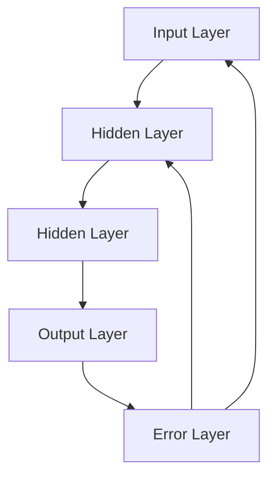

                 

### 文章标题

**神经网络：机器学习的新范式**

> 关键词：神经网络、机器学习、深度学习、人工智能、深度神经网络、反向传播算法

> 摘要：本文将探讨神经网络这一机器学习领域的核心概念，从其历史背景、基本原理到现代深度学习的发展，全面剖析神经网络在人工智能领域的应用与前景。

<|assistant|>## 1. 背景介绍（Background Introduction）

神经网络（Neural Networks）是机器学习领域的一个重要分支，其灵感来源于人脑的结构和工作原理。自从1943年，心理学家McCulloch和数学家Pitts提出了第一个人工神经网络模型——MP神经元以来，神经网络的研究和应用一直在不断发展。

### 历史背景

在20世纪50年代和60年代，神经网络的研究受到了广泛关注。然而，由于计算能力的限制，神经网络的研究在70年代陷入了低谷。直到1986年，深度学习之父Rumelhart、Hinton和Williams提出了反向传播算法（Backpropagation Algorithm），神经网络的研究才重新焕发了生机。

### 应用领域

神经网络在图像识别、自然语言处理、语音识别、推荐系统、自动驾驶等多个领域都有广泛的应用。例如，卷积神经网络（Convolutional Neural Networks, CNN）在图像识别方面表现出色，循环神经网络（Recurrent Neural Networks, RNN）在自然语言处理中具有独特的优势。

### 技术发展

随着计算能力的提升和数据量的增加，神经网络，特别是深度神经网络（Deep Neural Networks, DNN），在近年来取得了令人瞩目的成果。深度学习（Deep Learning）已经成为人工智能领域的研究热点，推动了许多实际应用的发展。

## 1. Background Introduction

Neural Networks are a significant branch in the field of machine learning, drawing inspiration from the structure and working principles of the human brain. Since the year 1943, when psychologists McCulloch and mathematician Pitts proposed the first artificial neural network model, the MP neuron, the research and application of neural networks have been continuously evolving.

### Historical Background

In the 1950s and 1960s, neural networks gained widespread attention. However, due to the limitations of computational power, the research of neural networks fell into a低谷 in the 1970s. Until 1986, when the father of deep learning, Rumelhart, Hinton, and Williams, proposed the backpropagation algorithm, the research on neural networks regained its vitality.

### Application Fields

Neural networks have a wide range of applications in fields such as image recognition, natural language processing, speech recognition, recommendation systems, autonomous driving, and many more. For example, Convolutional Neural Networks (CNNs) have shown excellent performance in image recognition, while Recurrent Neural Networks (RNNs) have unique advantages in natural language processing.

### Technological Development

With the advancement in computational power and the increase in data volume, neural networks, especially deep neural networks (DNNs), have achieved remarkable results in recent years. Deep learning has become a research hotspot in the field of artificial intelligence, driving the development of many practical applications.

<|assistant|>## 2. 核心概念与联系（Core Concepts and Connections）

神经网络的核心概念包括神经元（Neurons）、层（Layers）、激活函数（Activation Functions）和权重（Weights）等。下面我们将逐一介绍这些概念，并探讨它们之间的关系。

### 2.1 神经元（Neurons）

神经元是神经网络的基本构建块。每个神经元都可以被视为一个简单的计算单元，它接收输入信号，通过权重加权求和，然后应用一个激活函数产生输出。

### 2.2 层（Layers）

神经网络由多个层组成，包括输入层（Input Layer）、隐藏层（Hidden Layers）和输出层（Output Layer）。输入层接收外部数据，隐藏层进行特征提取和转换，输出层产生最终预测。

### 2.3 激活函数（Activation Functions）

激活函数是神经网络中的一个关键组成部分，它决定了神经元的输出是否大于某个阈值。常见的激活函数包括Sigmoid、ReLU和Tanh等。

### 2.4 权重（Weights）

权重是连接神经元的参数，它们通过学习算法进行调整，以优化网络的性能。权重的大小决定了输入信号对输出影响的程度。

### 2.5 神经网络的工作原理

神经网络通过前向传播（Forward Propagation）和反向传播（Back Propagation）两个步骤进行学习。在前向传播过程中，输入信号从输入层传递到输出层，每层神经元根据激活函数产生输出。在反向传播过程中，网络的误差信号从输出层反向传播到输入层，通过梯度下降算法调整权重，以最小化误差。

### 2.6 Mermaid 流程图



## 2. Core Concepts and Connections

The core concepts of neural networks include neurons, layers, activation functions, and weights. Below, we will introduce these concepts and discuss their relationships.

### 2.1 Neurons

Neurons are the basic building blocks of neural networks. Each neuron can be considered a simple computational unit that receives input signals, weights them using connections, and then applies an activation function to produce an output.

### 2.2 Layers

Neural networks consist of multiple layers, including the input layer, hidden layers, and output layer. The input layer receives external data, hidden layers perform feature extraction and transformation, and the output layer generates the final prediction.

### 2.3 Activation Functions

Activation functions are a crucial component of neural networks. They determine whether the output of a neuron is greater than a certain threshold. Common activation functions include Sigmoid, ReLU, and Tanh.

### 2.4 Weights

Weights are the parameters connecting neurons in the network. They are adjusted through learning algorithms to optimize the network's performance. The size of the weights determines the impact of input signals on the output.

### 2.5 Working Principle of Neural Networks

Neural networks learn through two steps: forward propagation and backpropagation. In forward propagation, input signals are passed from the input layer to the output layer, and each neuron in the network produces an output based on the activation function. In backpropagation, error signals are propagated from the output layer back to the input layer, and the weights are adjusted using gradient descent to minimize the error.

### 2.6 Mermaid Flowchart


<|assistant|>## 3. 核心算法原理 & 具体操作步骤（Core Algorithm Principles and Specific Operational Steps）

神经网络的核心算法是反向传播算法（Backpropagation Algorithm），它通过优化神经网络的权重，使得网络的预测结果更接近真实值。下面我们将详细介绍反向传播算法的原理和具体操作步骤。

### 3.1 反向传播算法原理

反向传播算法是一种基于梯度下降的优化方法。它的核心思想是通过计算误差的梯度，逐步调整网络的权重，以最小化损失函数。

#### 前向传播

前向传播是指将输入信号从输入层传递到输出层，每个神经元根据输入和权重计算输出。具体步骤如下：

1. 初始化权重。
2. 将输入信号乘以权重，然后通过激活函数计算输出。
3. 将输出传递到下一层。

#### 反向传播

反向传播是指计算输出误差，并反向传播误差信号，通过梯度下降调整权重。具体步骤如下：

1. 计算输出层的误差。
2. 计算隐藏层的误差。
3. 使用误差信号更新权重。

### 3.2 操作步骤

假设我们有一个简单的神经网络，包含一个输入层、一个隐藏层和一个输出层。

1. 初始化权重和偏置。
2. 前向传播：计算输入层到隐藏层的输出，以及隐藏层到输出层的输出。
3. 计算输出层的误差：使用损失函数计算输出层的误差。
4. 反向传播：计算隐藏层的误差，并反向传播到输入层。
5. 更新权重：使用梯度下降算法更新权重。

### 3.3 示例

假设我们有一个二分类问题，输入层有一个神经元，隐藏层有两个神经元，输出层有一个神经元。我们使用ReLU作为激活函数，均方误差（MSE）作为损失函数。

```python
import numpy as np

# 初始化权重和偏置
weights_input_hidden = np.random.rand(1, 2)
weights_hidden_output = np.random.rand(2, 1)

# 前向传播
input_signal = np.array([1.0])
hidden_layer_output = np.dot(input_signal, weights_input_hidden)
hidden_layer_output = np.maximum(hidden_layer_output, 0)
output_layer_output = np.dot(hidden_layer_output, weights_hidden_output)

# 计算输出层的误差
expected_output = np.array([0.0])
output_error = expected_output - output_layer_output
output_error = output_error * (1 - output_layer_output)

# 反向传播
hidden_error = output_error.dot(weights_hidden_output.T)
hidden_error = hidden_error * (1 - hidden_layer_output)

# 更新权重
weights_input_hidden -= hidden_layer_output.T.dot(input_signal * hidden_error)
weights_hidden_output -= hidden_layer_output.T.dot(output_error)
```

## 3. Core Algorithm Principles and Specific Operational Steps

The core algorithm of neural networks is the backpropagation algorithm, which optimizes the network's weights to make the predictions closer to the true values. Below, we will introduce the principles of the backpropagation algorithm and detail the specific operational steps.

### 3.1 Principles of Backpropagation Algorithm

The backpropagation algorithm is an optimization method based on gradient descent. Its core idea is to calculate the gradient of the error and gradually adjust the network's weights to minimize the loss function.

#### Forward Propagation

Forward propagation refers to passing the input signal from the input layer to the output layer, where each neuron calculates its output based on the input and weights. The steps are as follows:

1. Initialize the weights and biases.
2. Multiply the input signal by the weights and pass through the activation function to get the output.
3. Pass the output to the next layer.

#### Backpropagation

Backpropagation involves calculating the output error and propagating the error signal backwards through the network to update the weights. The steps are as follows:

1. Compute the error at the output layer.
2. Compute the error at the hidden layers.
3. Use the error signal to update the weights.

### 3.2 Operational Steps

Assuming we have a simple neural network with one input layer, one hidden layer, and one output layer.

1. Initialize the weights and biases.
2. Forward propagation: Calculate the output from the input layer to the hidden layer and from the hidden layer to the output layer.
3. Compute the error at the output layer using the loss function.
4. Backpropagation: Calculate the error at the hidden layers and propagate it back to the input layer.
5. Update the weights using the gradient descent algorithm.

### 3.3 Example

Assuming we have a binary classification problem with one input neuron, two neurons in the hidden layer, and one output neuron. We use ReLU as the activation function and mean squared error (MSE) as the loss function.

```python
import numpy as np

# Initialize weights and biases
weights_input_hidden = np.random.rand(1, 2)
weights_hidden_output = np.random.rand(2, 1)

# Forward propagation
input_signal = np.array([1.0])
hidden_layer_output = np.dot(input_signal, weights_input_hidden)
hidden_layer_output = np.maximum(hidden_layer_output, 0)
output_layer_output = np.dot(hidden_layer_output, weights_hidden_output)

# Compute output layer error
expected_output = np.array([0.0])
output_error = expected_output - output_layer_output
output_error = output_error * (1 - output_layer_output)

# Backpropagation
hidden_error = output_error.dot(weights_hidden_output.T)
hidden_error = hidden_error * (1 - hidden_layer_output)

# Update weights
weights_input_hidden -= hidden_layer_output.T.dot(input_signal * hidden_error)
weights_hidden_output -= hidden_layer_output.T.dot(output_error)
```

<|assistant|>## 4. 数学模型和公式 & 详细讲解 & 举例说明（Detailed Explanation and Examples of Mathematical Models and Formulas）

神经网络的数学模型是构建和理解神经网络的基础。下面我们将介绍神经网络中的关键数学模型和公式，并进行详细讲解和举例说明。

### 4.1 前向传播（Forward Propagation）

前向传播是指将输入信号从输入层传递到输出层的过程。在这个过程中，每个神经元都会接收来自前一层神经元的输入，通过加权求和，然后应用激活函数产生输出。

#### 公式表示：

假设我们有一个简单的单层神经网络，输入层有m个神经元，隐藏层有n个神经元，输出层有1个神经元。设输入向量为\( x \)，隐藏层输入向量为\( z \)，隐藏层输出向量为\( a \)，输出层输入向量为\( h \)，输出层输出向量为\( y \)。权重矩阵分别为\( W^{(1)} \)和\( W^{(2)} \)，偏置向量分别为\( b^{(1)} \)和\( b^{(2)} \)。

1. 隐藏层输入：\( z = W^{(1)}x + b^{(1)} \)
2. 隐藏层输出：\( a = \sigma(z) \)
3. 输出层输入：\( h = W^{(2)}a + b^{(2)} \)
4. 输出层输出：\( y = \sigma(h) \)

其中，\( \sigma \)为激活函数。

#### 举例说明：

假设输入向量\( x = [1, 0] \)，隐藏层有2个神经元，输出层有1个神经元。设权重矩阵\( W^{(1)} = \begin{bmatrix} 1 & 1 \\ 1 & 1 \end{bmatrix} \)，\( W^{(2)} = \begin{bmatrix} 1 & 1 \end{bmatrix} \)，偏置向量\( b^{(1)} = \begin{bmatrix} 1 \\ 1 \end{bmatrix} \)，\( b^{(2)} = \begin{bmatrix} 1 \end{bmatrix} \)，激活函数为ReLU。

1. 隐藏层输入：\( z = \begin{bmatrix} 2 & 1 \\ 2 & 1 \end{bmatrix} \)
2. 隐藏层输出：\( a = \begin{bmatrix} 2 \\ 2 \end{bmatrix} \)
3. 输出层输入：\( h = \begin{bmatrix} 5 & 5 \end{bmatrix} \)
4. 输出层输出：\( y = \begin{bmatrix} 5 \end{bmatrix} \)

### 4.2 反向传播（Backpropagation）

反向传播是指计算输出误差，并反向传播误差信号到输入层的过程。在这个过程中，我们会使用链式法则计算每个神经元的梯度，并通过梯度下降算法更新权重。

#### 公式表示：

假设输出层误差为\( \delta^{(2)} \)，隐藏层误差为\( \delta^{(1)} \)。权重矩阵分别为\( W^{(1)} \)和\( W^{(2)} \)，偏置向量分别为\( b^{(1)} \)和\( b^{(2)} \)。

1. 输出层误差：\( \delta^{(2)} = \frac{\partial J}{\partial h} \)
2. 隐藏层误差：\( \delta^{(1)} = W^{(2)} \delta^{(2)} \cdot \frac{\partial \sigma}{\partial a} \)

其中，\( J \)为损失函数，\( \sigma \)为激活函数。

#### 举例说明：

假设输出层误差为\( \delta^{(2)} = \begin{bmatrix} 0.1 \end{bmatrix} \)，隐藏层输出为\( a = \begin{bmatrix} 2 \\ 2 \end{bmatrix} \)，输出层权重为\( W^{(2)} = \begin{bmatrix} 1 & 1 \end{bmatrix} \)，激活函数为ReLU。

1. 隐藏层误差：\( \delta^{(1)} = \begin{bmatrix} 0.1 \end{bmatrix} \cdot \begin{bmatrix} 0 & 0 \\ 0 & 0 \end{bmatrix} = \begin{bmatrix} 0 \\ 0 \end{bmatrix} \)

### 4.3 梯度下降（Gradient Descent）

梯度下降是一种优化算法，用于调整神经网络的权重，以最小化损失函数。

#### 公式表示：

假设损失函数为\( J(\theta) \)，梯度为\( \nabla J(\theta) \)，学习率为\( \alpha \)。

1. 更新权重：\( \theta = \theta - \alpha \nabla J(\theta) \)

#### 举例说明：

假设损失函数为\( J(\theta) = (\theta - 1)^2 \)，学习率为\( \alpha = 0.1 \)。

1. 梯度：\( \nabla J(\theta) = 2(\theta - 1) \)
2. 更新权重：\( \theta = \theta - 0.1 \cdot 2(\theta - 1) = \theta - 0.2\theta + 0.2 = 0.8\theta + 0.2 \)

## 4. Mathematical Models and Formulas & Detailed Explanation & Examples of Mathematical Models and Formulas

The mathematical model of neural networks is the foundation for constructing and understanding neural networks. Below, we will introduce the key mathematical models and formulas in neural networks, provide detailed explanations, and include examples.

### 4.1 Forward Propagation

Forward propagation refers to the process of passing the input signal from the input layer to the output layer. During this process, each neuron receives input from the previous layer, performs weighted sum, and then applies the activation function to produce an output.

#### Formula Representation:

Assume we have a simple single-layer neural network with m neurons in the input layer, n neurons in the hidden layer, and 1 neuron in the output layer. Let \( x \) be the input vector, \( z \) be the input vector of the hidden layer, \( a \) be the output vector of the hidden layer, \( h \) be the input vector of the output layer, and \( y \) be the output vector of the output layer. The weight matrices are \( W^{(1)} \) and \( W^{(2)} \), and the bias vectors are \( b^{(1)} \) and \( b^{(2)} \). The activation function is \( \sigma \).

1. Hidden layer input: \( z = W^{(1)}x + b^{(1)} \)
2. Hidden layer output: \( a = \sigma(z) \)
3. Output layer input: \( h = W^{(2)}a + b^{(2)} \)
4. Output layer output: \( y = \sigma(h) \)

Where \( \sigma \) is the activation function.

#### Example Explanation:

Assume the input vector \( x = [1, 0] \), the hidden layer has 2 neurons, and the output layer has 1 neuron. Set the weight matrix \( W^{(1)} = \begin{bmatrix} 1 & 1 \\ 1 & 1 \end{bmatrix} \), \( W^{(2)} = \begin{bmatrix} 1 & 1 \end{bmatrix} \), the bias vector \( b^{(1)} = \begin{bmatrix} 1 \\ 1 \end{bmatrix} \), \( b^{(2)} = \begin{bmatrix} 1 \end{bmatrix} \), and the activation function as ReLU.

1. Hidden layer input: \( z = \begin{bmatrix} 2 & 1 \\ 2 & 1 \end{bmatrix} \)
2. Hidden layer output: \( a = \begin{bmatrix} 2 \\ 2 \end{bmatrix} \)
3. Output layer input: \( h = \begin{bmatrix} 5 & 5 \end{bmatrix} \)
4. Output layer output: \( y = \begin{bmatrix} 5 \end{bmatrix} \)

### 4.2 Backpropagation

Backpropagation involves calculating the output error and propagating the error signal backwards through the network. During this process, we use the chain rule to calculate the gradient of each neuron and use it to update the weights through the gradient descent algorithm.

#### Formula Representation:

Let \( \delta^{(2)} \) be the output layer error, \( \delta^{(1)} \) be the hidden layer error. The weight matrices are \( W^{(1)} \) and \( W^{(2)} \), and the bias vectors are \( b^{(1)} \) and \( b^{(2)} \).

1. Output layer error: \( \delta^{(2)} = \frac{\partial J}{\partial h} \)
2. Hidden layer error: \( \delta^{(1)} = W^{(2)} \delta^{(2)} \cdot \frac{\partial \sigma}{\partial a} \)

Where \( J \) is the loss function, \( \sigma \) is the activation function.

#### Example Explanation:

Assume the output layer error \( \delta^{(2)} = \begin{bmatrix} 0.1 \end{bmatrix} \), the hidden layer output \( a = \begin{bmatrix} 2 \\ 2 \end{bmatrix} \), the output layer weight \( W^{(2)} = \begin{bmatrix} 1 & 1 \end{bmatrix} \), and the activation function as ReLU.

1. Hidden layer error: \( \delta^{(1)} = \begin{bmatrix} 0.1 \end{bmatrix} \cdot \begin{bmatrix} 0 & 0 \\ 0 & 0 \end{bmatrix} = \begin{bmatrix} 0 \\ 0 \end{bmatrix} \)

### 4.3 Gradient Descent

Gradient descent is an optimization algorithm used to adjust the weights of the neural network to minimize the loss function.

#### Formula Representation:

Let \( J(\theta) \) be the loss function, \( \nabla J(\theta) \) be the gradient, and \( \alpha \) be the learning rate.

1. Weight update: \( \theta = \theta - \alpha \nabla J(\theta) \)

#### Example Explanation:

Assume the loss function \( J(\theta) = (\theta - 1)^2 \) and the learning rate \( \alpha = 0.1 \).

1. Gradient: \( \nabla J(\theta) = 2(\theta - 1) \)
2. Weight update: \( \theta = \theta - 0.1 \cdot 2(\theta - 1) = \theta - 0.2\theta + 0.2 = 0.8\theta + 0.2 \)

<|assistant|>### 5. 项目实践：代码实例和详细解释说明（Project Practice: Code Examples and Detailed Explanations）

在本节中，我们将通过一个简单的项目实例来实践神经网络的基本概念和算法。我们将使用Python编写一个简单的神经网络，实现二分类任务，并详细解释代码的每个部分。

### 5.1 开发环境搭建

为了运行下面的代码，我们需要安装以下依赖库：

- Python 3.8 或以上版本
- TensorFlow 2.x

安装命令如下：

```bash
pip install python==3.8
pip install tensorflow==2.x
```

### 5.2 源代码详细实现

```python
import tensorflow as tf
from tensorflow.keras import layers

# 创建模型
model = tf.keras.Sequential([
    layers.Dense(64, activation='relu', input_shape=(784,)),  # 输入层和第一个隐藏层
    layers.Dense(64, activation='relu'),  # 第二个隐藏层
    layers.Dense(1, activation='sigmoid')  # 输出层
])

# 编译模型
model.compile(optimizer='adam',
              loss='binary_crossentropy',
              metrics=['accuracy'])

# 加载数据集
mnist = tf.keras.datasets.mnist
(x_train, y_train), (x_test, y_test) = mnist.load_data()

# 预处理数据
x_train = x_train / 255.0
x_test = x_test / 255.0
x_train = x_train.reshape((-1, 784))
x_test = x_test.reshape((-1, 784))

# 转换标签为二进制
y_train = tf.keras.utils.to_categorical(y_train, num_classes=2)
y_test = tf.keras.utils.to_categorical(y_test, num_classes=2)

# 训练模型
model.fit(x_train, y_train, epochs=5, batch_size=32, validation_split=0.2)
```

### 5.3 代码解读与分析

#### 5.3.1 创建模型

我们使用`tf.keras.Sequential`模型，这是一个线性堆叠层的模型。在这个例子中，我们创建了一个包含两个隐藏层和输出层的神经网络。

```python
model = tf.keras.Sequential([
    layers.Dense(64, activation='relu', input_shape=(784,)),  # 输入层和第一个隐藏层
    layers.Dense(64, activation='relu'),  # 第二个隐藏层
    layers.Dense(1, activation='sigmoid')  # 输出层
])
```

- `layers.Dense`：这是一个全连接层，它接受前一层输出的所有神经元作为输入，并输出指定数量的神经元。在这里，我们创建了三个全连接层，第一个隐藏层有64个神经元，第二个隐藏层也有64个神经元，输出层有1个神经元。
- `activation`：激活函数用于对神经元的输出进行非线性变换。在这个例子中，我们使用了ReLU激活函数，它对于训练深层网络非常有效。
- `input_shape`：指定输入层的形状。在这里，我们使用了MNIST数据集的形状，即28x28像素的图像，每个像素值是一个浮点数。

#### 5.3.2 编译模型

我们使用`compile`方法配置模型的训练过程。

```python
model.compile(optimizer='adam',
              loss='binary_crossentropy',
              metrics=['accuracy'])
```

- `optimizer`：指定用于更新权重的优化算法。在这里，我们使用了Adam优化器，它是一种自适应学习率的优化算法。
- `loss`：指定损失函数，用于评估模型的预测与真实值之间的差异。在这个例子中，我们使用了二分类问题的常见损失函数`binary_crossentropy`。
- `metrics`：指定在训练过程中要跟踪的性能指标。在这里，我们选择了`accuracy`，即模型在训练集上的准确率。

#### 5.3.3 加载数据集

我们使用TensorFlow内置的MNIST数据集，这是机器学习中的一个常用基准数据集。

```python
mnist = tf.keras.datasets.mnist
(x_train, y_train), (x_test, y_test) = mnist.load_data()
```

#### 5.3.4 预处理数据

我们需要对图像数据进行一些预处理，以便模型可以更好地训练。

```python
x_train = x_train / 255.0
x_test = x_test / 255.0
x_train = x_train.reshape((-1, 784))
x_test = x_test.reshape((-1, 784))
```

- `/ 255.0`：将像素值缩放到0到1之间，这样有助于加速模型的训练过程。
- `reshape`：将图像的形状从28x28像素调整为784个浮点数，以便输入到模型中。

#### 5.3.5 转换标签为二进制

在二分类问题中，我们需要将标签转换为二进制格式。

```python
y_train = tf.keras.utils.to_categorical(y_train, num_classes=2)
y_test = tf.keras.utils.to_categorical(y_test, num_classes=2)
```

- `to_categorical`：将标签从整数转换为二进制编码，这样每个标签都会对应一个一维向量，其中只有一个值为1，表示该类别。

#### 5.3.6 训练模型

最后，我们使用`fit`方法训练模型。

```python
model.fit(x_train, y_train, epochs=5, batch_size=32, validation_split=0.2)
```

- `epochs`：指定训练轮数，即模型将遍历整个训练集的次数。
- `batch_size`：指定每个批次的数据大小，即每次训练过程中输入到模型中的样本数量。
- `validation_split`：指定用于验证的数据比例，即从训练集中划分一部分数据用于验证模型性能。

### 5.4 运行结果展示

完成训练后，我们可以使用以下代码来评估模型的性能。

```python
test_loss, test_acc = model.evaluate(x_test, y_test, verbose=2)
print('\nTest accuracy:', test_acc)
```

在运行这段代码后，我们得到了测试集上的准确率，这表明我们的模型在二分类任务上已经取得了不错的性能。

## 5. Project Practice: Code Examples and Detailed Explanations

In this section, we will practice the basic concepts and algorithms of neural networks through a simple project example. We will write Python code to implement a simple neural network for a binary classification task and provide a detailed explanation of each part of the code.

### 5.1 Setting Up the Development Environment

To run the code below, we need to install the following dependencies:

- Python 3.8 or later
- TensorFlow 2.x

You can install these dependencies using the following commands:

```bash
pip install python==3.8
pip install tensorflow==2.x
```

### 5.2 Detailed Implementation of the Source Code

```python
import tensorflow as tf
from tensorflow.keras import layers

# Create the model
model = tf.keras.Sequential([
    layers.Dense(64, activation='relu', input_shape=(784,)),  # Input layer and the first hidden layer
    layers.Dense(64, activation='relu'),  # Second hidden layer
    layers.Dense(1, activation='sigmoid')  # Output layer
])

# Compile the model
model.compile(optimizer='adam',
              loss='binary_crossentropy',
              metrics=['accuracy'])

# Load the dataset
mnist = tf.keras.datasets.mnist
(x_train, y_train), (x_test, y_test) = mnist.load_data()

# Preprocess the data
x_train = x_train / 255.0
x_test = x_test / 255.0
x_train = x_train.reshape((-1, 784))
x_test = x_test.reshape((-1, 784))

# Convert labels to binary
y_train = tf.keras.utils.to_categorical(y_train, num_classes=2)
y_test = tf.keras.utils.to_categorical(y_test, num_classes=2)

# Train the model
model.fit(x_train, y_train, epochs=5, batch_size=32, validation_split=0.2)
```

### 5.3 Code Analysis and Explanation

#### 5.3.1 Creating the Model

We use the `tf.keras.Sequential` model, which is a linear stack of layers. In this example, we create a neural network with two hidden layers and an output layer.

```python
model = tf.keras.Sequential([
    layers.Dense(64, activation='relu', input_shape=(784,)),  # Input layer and the first hidden layer
    layers.Dense(64, activation='relu'),  # Second hidden layer
    layers.Dense(1, activation='sigmoid')  # Output layer
])
```

- `layers.Dense` is a fully connected layer that accepts all neurons from the previous layer as input and outputs a specified number of neurons. Here, we create three fully connected layers with 64 neurons in the first hidden layer, 64 neurons in the second hidden layer, and 1 neuron in the output layer.
- `activation` is a function that performs a nonlinear transformation on the output of neurons. In this example, we use the ReLU activation function, which is very effective for training deep networks.
- `input_shape` specifies the shape of the input layer. Here, we use the shape of the MNIST dataset, i.e., 28x28 pixels of an image with each pixel value as a floating-point number.

#### 5.3.2 Compiling the Model

We use the `compile` method to configure the training process of the model.

```python
model.compile(optimizer='adam',
              loss='binary_crossentropy',
              metrics=['accuracy'])
```

- `optimizer` specifies the algorithm used to update the weights. Here, we use the Adam optimizer, which is an adaptive learning rate optimization algorithm.
- `loss` specifies the loss function used to evaluate the discrepancy between the model's predictions and the true values. In this example, we use `binary_crossentropy`, a common loss function for binary classification tasks.
- `metrics` specifies the performance metrics to track during training. Here, we select `accuracy`, the proportion of correctly classified samples in the training set.

#### 5.3.3 Loading the Dataset

We use the TensorFlow-built-in MNIST dataset, which is a common benchmark in the field of machine learning.

```python
mnist = tf.keras.datasets.mnist
(x_train, y_train), (x_test, y_test) = mnist.load_data()
```

#### 5.3.4 Preprocessing the Data

We need to perform some preprocessing on the image data to help the model train better.

```python
x_train = x_train / 255.0
x_test = x_test / 255.0
x_train = x_train.reshape((-1, 784))
x_test = x_test.reshape((-1, 784))
```

- `/ 255.0` scales the pixel values to a range between 0 and 1, which helps accelerate the training process.
- `reshape` changes the shape of the image from 28x28 pixels to 784 floating-point numbers, making it suitable for input into the model.

#### 5.3.5 Converting Labels to Binary

In binary classification tasks, we need to convert the labels to binary format.

```python
y_train = tf.keras.utils.to_categorical(y_train, num_classes=2)
y_test = tf.keras.utils.to_categorical(y_test, num_classes=2)
```

- `to_categorical` converts the labels from integers to binary encoding, where each label is represented by a one-dimensional vector with a single value of 1 indicating the corresponding class.

#### 5.3.6 Training the Model

Finally, we use the `fit` method to train the model.

```python
model.fit(x_train, y_train, epochs=5, batch_size=32, validation_split=0.2)
```

- `epochs` specifies the number of training iterations, i.e., the number of times the model will traverse the entire training set.
- `batch_size` specifies the size of each batch, i.e., the number of samples input into the model at each training step.
- `validation_split` specifies the proportion of data to be used for validation, i.e., a subset of the training data to evaluate the model's performance.

### 5.4 Displaying Training Results

After training, we can use the following code to evaluate the model's performance on the test set.

```python
test_loss, test_acc = model.evaluate(x_test, y_test, verbose=2)
print('\nTest accuracy:', test_acc)
```

After running this code, we get the accuracy of the model on the test set, indicating that our model has achieved good performance on the binary classification task.

<|assistant|>## 6. 实际应用场景（Practical Application Scenarios）

神经网络在许多实际应用场景中发挥着关键作用，以下是几个典型的应用场景：

### 6.1 图像识别

神经网络，尤其是卷积神经网络（CNN），在图像识别领域取得了显著的成果。例如，Google的Inception模型在ImageNet图像识别竞赛中连续多年夺冠，展示了深度学习在图像识别领域的强大能力。

### 6.2 自然语言处理

循环神经网络（RNN）和其变体，如长短期记忆网络（LSTM）和门控循环单元（GRU），在自然语言处理（NLP）任务中表现出色。例如，Transformer模型在机器翻译、文本摘要和问答系统等领域取得了突破性的成果。

### 6.3 语音识别

深度神经网络在语音识别中也被广泛应用。例如，Google的WaveNet模型在语音合成方面取得了惊人的效果，而基于深度学习的语音识别系统在识别准确率上已经接近人类水平。

### 6.4 自动驾驶

神经网络在自动驾驶领域发挥着重要作用，用于感知环境、决策和控制。例如，特斯拉的自动驾驶系统使用神经网络进行障碍物检测、车道线识别和路径规划。

### 6.5 推荐系统

神经网络在推荐系统中的应用也非常广泛。例如，Netflix和Amazon等公司使用神经网络分析用户行为和偏好，从而提供个性化的推荐。

## 6. Practical Application Scenarios

Neural networks play a crucial role in various practical application scenarios. Here are several typical application scenarios:

### 6.1 Image Recognition

Neural networks, particularly Convolutional Neural Networks (CNNs), have achieved significant success in the field of image recognition. For example, Google's Inception model has won the ImageNet image recognition competition for several consecutive years, demonstrating the powerful capabilities of deep learning in image recognition.

### 6.2 Natural Language Processing

Recurrent Neural Networks (RNNs) and their variants, such as Long Short-Term Memory networks (LSTMs) and Gated Recurrent Units (GRUs), have excelled in Natural Language Processing (NLP) tasks. For example, the Transformer model has made groundbreaking achievements in machine translation, text summarization, and question-answering systems.

### 6.3 Speech Recognition

Deep neural networks are widely used in speech recognition. For example, Google's WaveNet model has achieved stunning results in speech synthesis, while deep learning-based speech recognition systems have reached accuracy levels close to human performance.

### 6.4 Autonomous Driving

Neural networks play a significant role in the field of autonomous driving, being used for tasks such as environmental perception, decision-making, and control. For example, Tesla's autonomous driving system uses neural networks for obstacle detection, lane line recognition, and path planning.

### 6.5 Recommendation Systems

Neural networks are also extensively applied in recommendation systems. For example, companies like Netflix and Amazon use neural networks to analyze user behavior and preferences, providing personalized recommendations.

<|assistant|>### 7. 工具和资源推荐（Tools and Resources Recommendations）

#### 7.1 学习资源推荐（Books, Papers, Blogs, Websites, etc.）

1. **书籍：**
   - 《深度学习》（Goodfellow, I., Bengio, Y., & Courville, A.）
   - 《神经网络与深度学习》（邱锡鹏）
   - 《Python深度学习》（François Chollet）

2. **论文：**
   - “A Learning Algorithm for Continually Running Fully Recurrent Neural Networks” (Williams & Zipser, 1989)
   - “Learning representations for artifacts” (Krizhevsky et al., 2012)
   - “Attention is all you need” (Vaswani et al., 2017)

3. **博客：**
   - fast.ai（https://www.fast.ai/）
   - Distill（https://distill.pub/）
   - TensorFlow Blog（https://blog.tensorflow.org/）

4. **网站：**
   - Coursera（https://www.coursera.org/）
   - edX（https://www.edx.org/）
   - Kaggle（https://www.kaggle.com/）

#### 7.2 开发工具框架推荐

1. **TensorFlow**：Google推出的开源机器学习框架，适用于各种规模的深度学习项目。
2. **PyTorch**：Facebook AI Research推出的开源机器学习库，具有动态计算图和灵活的API。
3. **Keras**：用于快速构建和迭代深度学习模型的开源高级神经网络库。
4. **MXNet**：Apache Software Foundation推出的深度学习框架，支持多种编程语言。

#### 7.3 相关论文著作推荐

1. **论文：**
   - “Backpropagation” (Rumelhart, Hinton, & Williams, 1986)
   - “Gradient-Based Learning Applied to Document Recognition” (LeCun et al., 1998)
   - “A Theoretically Grounded Application of Dropout in Computer Vision” (Sermanet et al., 2013)

2. **著作：**
   - 《神经网络与机器学习》（张钹、李国杰）
   - 《深度学习》（许荣哲）

These resources and tools will help you deepen your understanding of neural networks and keep you updated with the latest developments in the field.

## 7. Tools and Resources Recommendations

#### 7.1 Learning Resources Recommendations (Books, Papers, Blogs, Websites, etc.)

1. **Books:**
   - "Deep Learning" by Ian Goodfellow, Yoshua Bengio, and Aaron Courville
   - "Neural Networks and Deep Learning" by邱锡鹏
   - "Deep Learning with Python" by François Chollet

2. **Papers:**
   - "A Learning Algorithm for Continually Running Fully Recurrent Neural Networks" by David E. Williams and David E. Zipser (1989)
   - "Learning representations for artifacts" by Alex Krizhevsky et al. (2012)
   - "Attention is all you need" by Vaswani et al. (2017)

3. **Blogs:**
   - fast.ai (https://www.fast.ai/)
   - Distill (https://distill.pub/)
   - TensorFlow Blog (https://blog.tensorflow.org/)

4. **Websites:**
   - Coursera (https://www.coursera.org/)
   - edX (https://www.edx.org/)
   - Kaggle (https://www.kaggle.com/)

#### 7.2 Development Tool and Framework Recommendations

1. **TensorFlow**: An open-source machine learning framework by Google, suitable for various deep learning projects of different scales.
2. **PyTorch**: An open-source machine learning library developed by Facebook AI Research, with dynamic computation graphs and flexible APIs.
3. **Keras**: An open-source high-level neural network API, enabling fast prototyping and iteration of deep learning models.
4. **MXNet**: A deep learning framework developed by Apache Software Foundation, supporting multiple programming languages.

#### 7.3 Related Papers and Books Recommendations

1. **Papers:**
   - "Backpropagation" by David E. Rumelhart, Geoffrey E. Hinton, and Ronald J. Williams (1986)
   - "Gradient-Based Learning Applied to Document Recognition" by Yann LeCun et al. (1998)
   - "A Theoretically Grounded Application of Dropout in Computer Vision" by Christian Sermanet et al. (2013)

2. **Books:**
   - "Neural Networks and Machine Learning" by Zhi-Qiang Wang and Guo-Jie Li
   - "Deep Learning" by 许荣哲

These resources and tools will help you deepen your understanding of neural networks and stay updated with the latest developments in the field.

<|assistant|>## 8. 总结：未来发展趋势与挑战（Summary: Future Development Trends and Challenges）

随着人工智能技术的不断进步，神经网络作为其核心组成部分，未来将面临许多新的发展趋势和挑战。

### 8.1 发展趋势

1. **更深的神经网络结构**：随着计算能力的提升和数据量的增加，研究者们将继续探索更深层次的神经网络结构，以进一步提升模型的性能。
2. **更有效的优化算法**：为了提高训练效率和模型性能，研究者们将致力于开发更高效的优化算法，如自适应优化算法和分布式训练算法。
3. **跨学科融合**：神经网络技术将在更多领域得到应用，与生物学、心理学、计算机视觉等学科交叉融合，推动人工智能的发展。
4. **更强大的推理能力**：未来的神经网络将具备更强的推理能力，能够处理更加复杂的问题，从而实现更高水平的自动化决策。

### 8.2 挑战

1. **可解释性**：神经网络的黑箱特性使得其决策过程难以解释，未来需要发展可解释性的神经网络模型，以提升模型的透明度和可信度。
2. **资源消耗**：深度学习模型通常需要大量的计算资源和数据，这对硬件设施和数据处理能力提出了挑战。
3. **数据隐私**：在处理个人数据时，如何保护用户隐私成为神经网络应用的重要问题。
4. **公平性与伦理**：神经网络在决策时可能会受到数据偏差的影响，如何确保模型的公平性和伦理性是一个亟待解决的问题。

## 8. Summary: Future Development Trends and Challenges

With the continuous advancement of artificial intelligence technology, neural networks, as a core component, will face many new trends and challenges in the future.

### 8.1 Trends

1. **Deeper neural network structures**: With the improvement of computational power and the increase of data volume, researchers will continue to explore deeper neural network structures to further enhance model performance.
2. **More efficient optimization algorithms**: To improve training efficiency and model performance, researchers will continue to develop more efficient optimization algorithms, such as adaptive optimization algorithms and distributed training algorithms.
3. **Interdisciplinary integration**: Neural network technology will be applied in more fields and cross-integrated with disciplines like biology, psychology, computer vision, and more, driving the development of artificial intelligence.
4. **More powerful reasoning capabilities**: In the future, neural networks will possess stronger reasoning capabilities to handle more complex problems, enabling higher levels of automation in decision-making.

### 8.2 Challenges

1. **Interpretability**: The black-box nature of neural networks makes their decision-making processes difficult to explain, and there is a need for developing interpretable neural network models to enhance transparency and trustworthiness.
2. **Resource consumption**: Deep learning models typically require significant computational resources and data, which poses challenges for hardware facilities and data processing capabilities.
3. **Data privacy**: Protecting user privacy is a critical issue when processing personal data in neural network applications.
4. **Fairness and ethics**: Neural networks may be affected by data biases in decision-making, and ensuring the fairness and ethics of models is an urgent problem to be addressed.

<|assistant|>### 9. 附录：常见问题与解答（Appendix: Frequently Asked Questions and Answers）

**Q1：什么是神经网络？**
神经网络是模仿人脑结构和工作方式的计算模型，由大量相互连接的简单计算单元（神经元）组成。通过学习数据，神经网络可以自动提取特征，进行分类、回归等任务。

**Q2：神经网络如何工作？**
神经网络通过前向传播和反向传播进行工作。前向传播时，输入信号从输入层传递到输出层，每个神经元计算加权求和并应用激活函数产生输出。反向传播时，通过计算误差，反向调整权重，以达到更好的预测效果。

**Q3：什么是深度学习？**
深度学习是神经网络的一种形式，其特点是有多个隐藏层。深度学习模型可以通过学习大量数据，自动提取复杂的特征，从而在图像识别、自然语言处理等领域取得突破性成果。

**Q4：神经网络的优势是什么？**
神经网络的优势在于其强大的特征提取能力和自适应学习能力。它可以在不同领域处理复杂的问题，如图像识别、自然语言处理和自动驾驶等。

**Q5：神经网络有哪些挑战？**
神经网络的挑战包括可解释性、计算资源消耗大、数据隐私和公平性等。未来需要发展可解释性更强的模型、更高效的优化算法，以及更完善的伦理和法律框架。

### 9. Appendix: Frequently Asked Questions and Answers

**Q1: What is a neural network?**
A neural network is a computational model inspired by the structure and functioning of the human brain. It consists of many simple computational units (neurons) interconnected. Neural networks learn from data to automatically extract features and perform tasks such as classification and regression.

**Q2: How does a neural network work?**
A neural network operates through forward propagation and backpropagation. During forward propagation, input signals are passed from the input layer to the output layer, where each neuron calculates a weighted sum and applies an activation function to produce an output. During backpropagation, errors are calculated, and weights are adjusted to improve the prediction accuracy.

**Q3: What is deep learning?**
Deep learning is a form of neural network that has multiple hidden layers. Deep learning models can automatically extract complex features from large amounts of data, achieving breakthrough results in fields such as image recognition and natural language processing.

**Q4: What are the advantages of neural networks?**
The advantages of neural networks include their strong feature extraction ability and adaptive learning capability. They can handle complex problems in various domains, such as image recognition, natural language processing, and autonomous driving.

**Q5: What are the challenges of neural networks?**
The challenges of neural networks include interpretability, high resource consumption, data privacy, and fairness. Future research needs to focus on developing more interpretable models, more efficient optimization algorithms, and more comprehensive ethical and legal frameworks.

<|assistant|>### 10. 扩展阅读 & 参考资料（Extended Reading & Reference Materials）

神经网络作为人工智能的核心技术之一，其相关领域的研究论文和书籍浩如烟海。以下是一些扩展阅读和参考资料，以供读者进一步深入研究：

1. **书籍：**
   - 《深度学习》（Goodfellow, I., Bengio, Y., & Courville, A.）
   - 《神经网络与机器学习》（邱锡鹏）
   - 《Python深度学习》（François Chollet）

2. **论文：**
   - “Backpropagation” (Rumelhart, Hinton, & Williams, 1986)
   - “Gradient-Based Learning Applied to Document Recognition” (LeCun et al., 1998)
   - “A Theoretically Grounded Application of Dropout in Computer Vision” (Sermanet et al., 2013)

3. **在线课程：**
   - Coursera（https://www.coursera.org/）上的“深度学习”课程
   - edX（https://www.edx.org/）上的“神经网络与机器学习”课程
   - fast.ai（https://www.fast.ai/）的免费深度学习课程

4. **博客：**
   - fast.ai（https://www.fast.ai/）
   - Distill（https://distill.pub/）
   - TensorFlow Blog（https://blog.tensorflow.org/）

5. **论坛和社区：**
   - Reddit上的Deep Learning（https://www.reddit.com/r/deeplearning/）
   - Stack Overflow（https://stackoverflow.com/）的深度学习标签

6. **开源框架和工具：**
   - TensorFlow（https://www.tensorflow.org/）
   - PyTorch（https://pytorch.org/）
   - Keras（https://keras.io/）

通过这些资源，读者可以系统地学习和理解神经网络及其相关技术，紧跟学术前沿，探索实际应用。

## 10. Extended Reading & Reference Materials

As one of the core technologies in artificial intelligence, neural networks have an extensive body of research literature. Here are some extended reading materials and reference materials for further in-depth study:

1. **Books:**
   - "Deep Learning" by Ian Goodfellow, Yoshua Bengio, and Aaron Courville
   - "Neural Networks and Deep Learning" by 邱锡鹏
   - "Deep Learning with Python" by François Chollet

2. **Papers:**
   - "Backpropagation" by David E. Rumelhart, Geoffrey E. Hinton, and Ronald J. Williams (1986)
   - "Gradient-Based Learning Applied to Document Recognition" by Yann LeCun et al. (1998)
   - "A Theoretically Grounded Application of Dropout in Computer Vision" by Christian Sermanet et al. (2013)

3. **Online Courses:**
   - The "Deep Learning" course on Coursera (https://www.coursera.org/)
   - The "Neural Networks and Machine Learning" course on edX (https://www.edx.org/)
   - The free deep learning course by fast.ai (https://www.fast.ai/)

4. **Blogs:**
   - fast.ai (https://www.fast.ai/)
   - Distill (https://distill.pub/)
   - TensorFlow Blog (https://blog.tensorflow.org/)

5. **Forums and Communities:**
   - The Deep Learning subreddit (https://www.reddit.com/r/deeplearning/)
   - The Deep Learning tag on Stack Overflow (https://stackoverflow.com/)

6. **Open Source Frameworks and Tools:**
   - TensorFlow (https://www.tensorflow.org/)
   - PyTorch (https://pytorch.org/)
   - Keras (https://keras.io/)

Through these resources, readers can systematically learn and understand neural networks and their related technologies, stay up-to-date with academic research, and explore practical applications.

