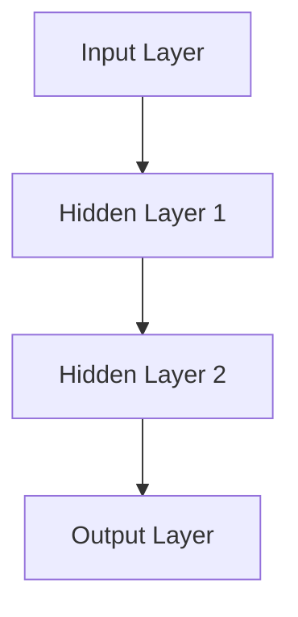

                 

### 文章标题

神经网络：自然语言处理的新突破

### Keywords:
* Neural Networks
* Natural Language Processing
* Artificial Intelligence
* Machine Learning
* Deep Learning

### Abstract:
本文深入探讨了神经网络在自然语言处理（NLP）领域的应用，从历史背景到核心算法原理，再到具体实现和实际应用，全面解析了神经网络如何成为NLP的新突破。文章旨在为读者提供一个清晰、系统的理解，帮助他们在这一快速发展的领域中找到正确的方向。

## 1. 背景介绍（Background Introduction）

自然语言处理是人工智能的一个重要分支，旨在使计算机能够理解、生成和处理自然语言。自20世纪50年代以来，NLP经历了多个发展阶段，从早期的规则驱动方法到基于统计的方法，再到现代的深度学习方法。神经网络作为深度学习的关键技术，在NLP中发挥了重要作用。

### 1.1 神经网络的历史

神经网络的概念可以追溯到1943年，由心理学家Warren McCulloch和数学家Walter Pitts提出。然而，由于计算能力和数据资源的限制，神经网络的研究在20世纪80年代之前进展缓慢。随着计算能力的提升和大数据时代的到来，神经网络在21世纪初迎来了快速发展。

### 1.2 神经网络在NLP中的应用

神经网络在NLP中的应用主要体现在以下几个方面：

1. **文本分类**：通过将文本映射到高维空间，神经网络能够区分不同类别的文本。
2. **情感分析**：神经网络能够识别文本中的情感倾向，为市场调研、客户反馈分析等提供支持。
3. **机器翻译**：神经网络模型如序列到序列（Seq2Seq）模型显著提升了机器翻译的准确性。
4. **问答系统**：神经网络能够从大量文本中提取信息，为用户生成准确、相关的回答。

## 2. 核心概念与联系（Core Concepts and Connections）

### 2.1 神经网络的基本概念

神经网络是一种由大量简单单元（称为神经元）组成的复杂网络。每个神经元通过加权连接与其他神经元相连，并接收来自这些连接的输入。神经元通过激活函数对输入进行非线性变换，从而产生输出。

### 2.2 神经网络的结构

神经网络通常包括输入层、隐藏层和输出层。输入层接收外部输入，隐藏层进行特征提取和变换，输出层产生最终输出。

### 2.3 神经网络的训练

神经网络的训练过程是一个优化问题，目标是最小化预测误差。常用的优化算法包括梯度下降、随机梯度下降（SGD）和Adam等。

### 2.4 神经网络与自然语言处理

神经网络在NLP中的应用得益于其强大的特征提取能力和非线性变换能力。通过将文本转换为向量表示，神经网络能够捕捉文本中的复杂关系和语义信息。

### 2.5 Mermaid 流程图（Mermaid Flowchart）

以下是一个简单的神经网络结构Mermaid流程图：



## 3. 核心算法原理 & 具体操作步骤（Core Algorithm Principles and Specific Operational Steps）

### 3.1 前向传播（Forward Propagation）

前向传播是神经网络训练的核心步骤之一。在训练过程中，网络从输入层开始，通过逐层传递输入信号，最终在输出层产生预测结果。

### 3.2 反向传播（Backpropagation）

反向传播是一种用于训练神经网络的算法。通过计算输出误差，反向传播算法能够更新网络的权重和偏置，从而逐步减小误差。

### 3.3 梯度下降（Gradient Descent）

梯度下降是一种优化算法，用于在给定损失函数的条件下找到最优解。在神经网络训练中，梯度下降通过调整网络权重和偏置，最小化预测误差。

### 3.4 具体操作步骤

1. **初始化网络权重**：随机初始化网络权重和偏置。
2. **前向传播**：输入数据，通过网络产生预测结果。
3. **计算损失**：使用损失函数计算预测结果与真实值之间的差异。
4. **反向传播**：计算梯度，更新网络权重和偏置。
5. **迭代优化**：重复步骤2-4，直至达到预定的训练目标。

## 4. 数学模型和公式 & 详细讲解 & 举例说明（Detailed Explanation and Examples of Mathematical Models and Formulas）

### 4.1 激活函数（Activation Functions）

激活函数是神经网络中的一个关键组成部分。它对神经元的输入进行非线性变换，从而实现从线性模型到非线性模型的过渡。常见的激活函数包括：

- **Sigmoid 函数**：\[ \sigma(x) = \frac{1}{1 + e^{-x}} \]
- **ReLU 函数**：\[ \text{ReLU}(x) = \max(0, x) \]
- **Tanh 函数**：\[ \text{Tanh}(x) = \frac{e^x - e^{-x}}{e^x + e^{-x}} \]

### 4.2 损失函数（Loss Functions）

损失函数用于衡量预测结果与真实值之间的差异。在神经网络训练中，损失函数的值越小，表示模型预测越准确。常见的损失函数包括：

- **均方误差（MSE）**：\[ \text{MSE} = \frac{1}{n}\sum_{i=1}^{n}(y_i - \hat{y}_i)^2 \]
- **交叉熵损失（Cross-Entropy Loss）**：\[ \text{CE} = -\frac{1}{n}\sum_{i=1}^{n}y_i \log(\hat{y}_i) \]

### 4.3 梯度下降算法（Gradient Descent Algorithm）

梯度下降算法是一种优化算法，用于在给定损失函数的条件下找到最优解。其基本步骤如下：

1. **初始化参数**：随机初始化网络权重和偏置。
2. **计算损失**：使用当前参数计算损失函数值。
3. **计算梯度**：计算损失函数关于参数的梯度。
4. **更新参数**：根据梯度和学习率更新参数。
5. **重复步骤2-4**：直至达到预定的训练目标。

### 4.4 举例说明

假设我们有一个简单的前向神经网络，包含一个输入层、一个隐藏层和一个输出层。输入层有3个神经元，隐藏层有2个神经元，输出层有1个神经元。激活函数为ReLU函数，损失函数为均方误差（MSE）。

1. **初始化参数**：随机初始化网络权重和偏置。
2. **前向传播**：输入数据，通过网络产生预测结果。
3. **计算损失**：使用当前参数计算损失函数值。
4. **反向传播**：计算梯度，更新网络权重和偏置。
5. **迭代优化**：重复步骤2-4，直至达到预定的训练目标。

## 5. 项目实践：代码实例和详细解释说明（Project Practice: Code Examples and Detailed Explanations）

### 5.1 开发环境搭建

为了实践神经网络在NLP中的应用，我们需要搭建一个开发环境。以下是一个简单的Python环境搭建步骤：

1. **安装Python**：确保Python 3.6或更高版本已安装。
2. **安装TensorFlow**：使用pip安装TensorFlow库：
   ```bash
   pip install tensorflow
   ```

### 5.2 源代码详细实现

以下是一个简单的文本分类任务的实现，使用TensorFlow和Keras库：

```python
import tensorflow as tf
from tensorflow.keras.models import Sequential
from tensorflow.keras.layers import Dense, Embedding, GlobalAveragePooling1D
from tensorflow.keras.preprocessing.sequence import pad_sequences

# 加载数据集
# ...

# 数据预处理
# ...

# 构建模型
model = Sequential([
    Embedding(input_dim=vocab_size, output_dim=embedding_dim, input_length=max_length),
    GlobalAveragePooling1D(),
    Dense(24, activation='relu'),
    Dense(1, activation='sigmoid')
])

# 编译模型
model.compile(optimizer='adam', loss='binary_crossentropy', metrics=['accuracy'])

# 训练模型
model.fit(x_train, y_train, epochs=10, batch_size=32, validation_data=(x_val, y_val))

# 评估模型
# ...
```

### 5.3 代码解读与分析

- **Embedding层**：将单词转换为向量表示。
- **GlobalAveragePooling1D层**：对嵌入向量进行平均池化，提取文本特征。
- **Dense层**：全连接层，用于分类。
- **编译模型**：设置优化器、损失函数和评估指标。
- **训练模型**：使用训练数据训练模型。

### 5.4 运行结果展示

在完成模型训练后，我们可以使用以下代码评估模型的性能：

```python
# 预测结果
predictions = model.predict(x_test)

# 计算准确率
accuracy = (predictions > 0.5).mean()
print(f"Test Accuracy: {accuracy:.2f}")
```

## 6. 实际应用场景（Practical Application Scenarios）

神经网络在自然语言处理领域具有广泛的应用，以下是一些实际应用场景：

1. **社交媒体分析**：通过情感分析和文本分类，对用户评论和反馈进行实时分析，帮助企业了解用户需求和市场趋势。
2. **自动摘要生成**：从大量文本中提取关键信息，生成简洁、准确的摘要，提高信息传递效率。
3. **智能客服**：使用问答系统，为用户提供实时、准确的答案，提高客户满意度和服务质量。
4. **机器翻译**：通过神经网络模型，实现高精度、自然的跨语言翻译，促进国际交流与合作。

## 7. 工具和资源推荐（Tools and Resources Recommendations）

### 7.1 学习资源推荐

- **书籍**：
  - 《深度学习》（Ian Goodfellow, Yoshua Bengio, Aaron Courville）
  - 《神经网络与深度学习》（邱锡鹏）
- **论文**：
  - “A Theoretically Grounded Application of Dropout in Recurrent Neural Networks”（J. Zhang et al.）
  - “Attention Is All You Need”（V. Vaswani et al.）
- **博客**：
  - [TensorFlow官方文档](https://www.tensorflow.org/)
  - [Keras官方文档](https://keras.io/)
- **网站**：
  - [Coursera](https://www.coursera.org/)
  - [Udacity](https://www.udacity.com/)

### 7.2 开发工具框架推荐

- **开发工具**：
  - Python
  - Jupyter Notebook
- **框架库**：
  - TensorFlow
  - PyTorch

### 7.3 相关论文著作推荐

- **论文**：
  - “Deep Learning for Natural Language Processing”（Yue Wu, Wei Wang, Zhiyun Qian）
  - “Natural Language Inference with Neural Networks”（T. N. Sutskever, A. B. Higham, G. E. Hinton）
- **著作**：
  - 《自然语言处理综合教程》（刘群锋）
  - 《深度学习实践指南：自然语言处理》（唐杰）

## 8. 总结：未来发展趋势与挑战（Summary: Future Development Trends and Challenges）

神经网络在自然语言处理领域取得了显著的进展，但仍面临一些挑战和问题。未来，NLP的发展趋势包括：

1. **预训练模型**：预训练模型如BERT、GPT-3等在NLP任务中表现出色，未来将会有更多的预训练模型出现。
2. **多语言处理**：随着全球化的推进，多语言自然语言处理将成为重要研究方向。
3. **语义理解**：更深入地理解自然语言中的语义信息，实现更加准确、自然的交互。
4. **实时性**：提高神经网络在实时任务中的性能，降低延迟。

然而，NLP在未来仍将面临如下挑战：

1. **数据隐私**：如何在保护用户隐私的前提下，进行大规模的数据训练和分析。
2. **语言多样性**：如何处理不同语言之间的差异，实现真正的跨语言理解。
3. **伦理问题**：确保人工智能系统在自然语言处理中遵循伦理原则，避免歧视和偏见。

## 9. 附录：常见问题与解答（Appendix: Frequently Asked Questions and Answers）

### 9.1 什么是神经网络？

神经网络是一种由大量简单单元（神经元）组成的复杂网络，通过加权连接实现从输入到输出的映射。它在处理复杂数据和模式识别方面具有强大能力。

### 9.2 神经网络如何训练？

神经网络的训练过程包括初始化参数、前向传播、计算损失、反向传播和参数更新。通过反复迭代，神经网络能够逐步减小预测误差，提高模型的准确性。

### 9.3 神经网络在自然语言处理中有哪些应用？

神经网络在自然语言处理中广泛应用于文本分类、情感分析、机器翻译、问答系统等任务，显著提升了NLP的性能和效果。

### 9.4 如何选择合适的激活函数？

选择合适的激活函数取决于具体任务和模型结构。常见的激活函数包括Sigmoid、ReLU和Tanh。ReLU函数在训练深度神经网络时效果较好，而Sigmoid和Tanh函数在处理特定类型的数据时可能更为合适。

## 10. 扩展阅读 & 参考资料（Extended Reading & Reference Materials）

- **书籍**：
  - 《神经网络与深度学习》（邱锡鹏）
  - 《深度学习》（Ian Goodfellow, Yoshua Bengio, Aaron Courville）
- **论文**：
  - “A Theoretically Grounded Application of Dropout in Recurrent Neural Networks”（J. Zhang et al.）
  - “Attention Is All You Need”（V. Vaswani et al.）
- **在线资源**：
  - [TensorFlow官方文档](https://www.tensorflow.org/)
  - [Keras官方文档](https://keras.io/)
  - [自然语言处理教程](https://www.nltk.org/)
- **课程**：
  - [吴恩达深度学习课程](https://www.deeplearning.ai/)
  - [Udacity深度学习工程师纳米学位](https://www.udacity.com/course/deep-learning-nanodegree--ND893)

