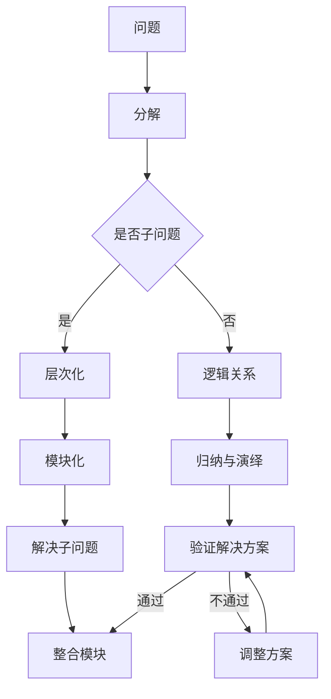
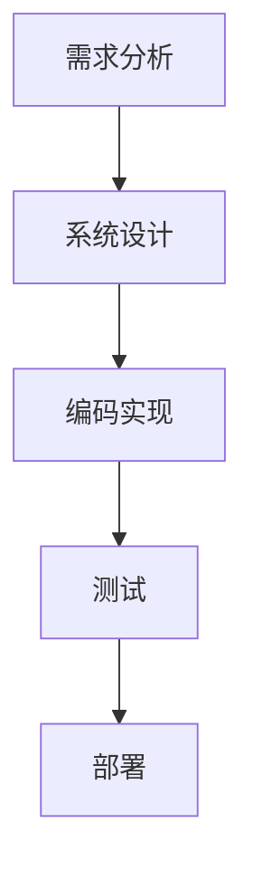

                 

### 文章标题

**结构化思维：理解世界的钥匙**

> **关键词：** 结构化思维，认知框架，逻辑推理，复杂问题解决

**摘要：** 本文将探讨结构化思维在理解世界和解决复杂问题中的关键作用。通过分析结构化思维的原理、应用和实践，我们希望能帮助读者培养一种有效的思考模式，提升自己在面对复杂任务时的分析和决策能力。

本文将按照以下结构展开：
1. **背景介绍**
   - 介绍结构化思维的基本概念和重要性
   - 阐述结构化思维在现代社会的应用场景
2. **核心概念与联系**
   - 探讨结构化思维的核心概念
   - 通过 Mermaid 流程图展示结构化思维的框架和原理
3. **核心算法原理 & 具体操作步骤**
   - 分析结构化思维的算法原理
   - 提供结构化思维的具体操作步骤
4. **数学模型和公式 & 详细讲解 & 举例说明**
   - 引入结构化思维相关的数学模型
   - 详细讲解数学模型的应用和方法
   - 通过实例展示如何使用数学模型解决问题
5. **项目实践：代码实例和详细解释说明**
   - 搭建开发环境
   - 提供结构化思维的代码实现
   - 解读和分析代码实现
6. **实际应用场景**
   - 分析结构化思维在现实中的应用
   - 提供实际案例和成功故事
7. **工具和资源推荐**
   - 推荐学习资源
   - 推荐开发工具和框架
8. **总结：未来发展趋势与挑战**
   - 预测结构化思维的未来发展
   - 分析面临的挑战和机遇
9. **附录：常见问题与解答**
   - 回答读者可能遇到的问题
10. **扩展阅读 & 参考资料**

现在，让我们开始深入探讨结构化思维的世界，探索它如何成为理解世界的钥匙。

### 背景介绍

#### 1.1 结构化思维的基本概念和重要性

结构化思维是一种通过分解复杂问题，构建清晰的逻辑框架，以有序、系统的方式进行思考和解决问题的方法。它强调在处理问题时，要关注问题的整体结构，将其分解为多个子问题或组件，然后逐一解决。这种方法有助于我们更清晰地理解问题的本质，发现潜在的问题和解决方案。

在现代社会，随着信息量的爆炸式增长和复杂性的不断增加，结构化思维的重要性日益凸显。无论是在工作、学习还是日常生活中，面对复杂问题时，我们都需要具备良好的结构化思维能力，以便快速定位问题核心，找到有效的解决方案。

#### 1.2 结构化思维的应用场景

结构化思维可以应用于各种场景，包括但不限于：

- **项目管理**：在项目规划、执行和监控过程中，结构化思维有助于明确项目目标，分解项目任务，制定合理的计划和进度安排。

- **决策制定**：在面对决策问题时，结构化思维可以帮助我们全面分析各种选项，评估风险和收益，从而做出更明智的决策。

- **问题解决**：在解决复杂问题时，结构化思维可以帮助我们识别问题根本原因，提出有效解决方案，并评估解决方案的可行性。

- **学术研究**：在学术研究过程中，结构化思维有助于整理研究思路，构建研究框架，提高研究效率和成果质量。

- **个人成长**：在个人成长过程中，结构化思维可以帮助我们制定明确的目标和计划，不断反思和调整自己的行为，实现个人成长和提升。

#### 1.3 结构化思维的重要性

结构化思维的重要性体现在以下几个方面：

- **提高解决问题的效率**：通过结构化思维，我们可以更快地识别问题的核心，找到有效的解决方案，提高解决问题的效率。

- **减少错误和遗漏**：结构化思维有助于我们系统地分析问题，确保考虑所有可能的因素，减少错误和遗漏。

- **提高决策质量**：结构化思维可以帮助我们更全面地评估决策的各种选项，降低决策风险，提高决策质量。

- **增强沟通能力**：结构化思维可以帮助我们更清晰地表达问题和解决方案，提高沟通效果。

- **培养良好的学习习惯**：结构化思维有助于我们整理学习内容，构建知识体系，提高学习效果。

总之，结构化思维是一种强大的思考工具，有助于我们在面对复杂问题时，保持清晰的思路，找到有效的解决方案。在接下来的章节中，我们将进一步探讨结构化思维的核心概念和原理，以及如何在实际中应用和操作。

### 核心概念与联系

#### 2.1 什么是结构化思维？

结构化思维是一种通过分解复杂问题，构建清晰的逻辑框架，以有序、系统的方式进行思考和解决问题的方法。它强调在处理问题时，要关注问题的整体结构，将其分解为多个子问题或组件，然后逐一解决。这种方法有助于我们更清晰地理解问题的本质，发现潜在的问题和解决方案。

#### 2.2 结构化思维的核心概念

结构化思维的核心概念包括以下几个方面：

- **分解**：将复杂问题分解为更小、更易管理的子问题或组件。

- **层次化**：将问题分解成不同层次，从宏观到微观，从抽象到具体，逐步深入。

- **逻辑关系**：明确各个子问题或组件之间的关系，建立清晰的逻辑框架。

- **模块化**：将问题分解为独立的模块，每个模块负责特定的功能。

- **归纳与演绎**：通过归纳法从具体实例中总结出一般规律，通过演绎法从一般规律推导出具体结论。

#### 2.3 结构化思维的框架和原理

为了更好地理解结构化思维，我们可以通过 Mermaid 流程图展示其框架和原理。以下是一个简单的 Mermaid 流程图示例：



这个流程图展示了结构化思维的基本步骤和核心概念。从问题开始，通过分解、层次化、逻辑关系、模块化、归纳与演绎等步骤，逐步深入问题，直到找到解决方案。在这个过程中，我们需要不断地验证和调整方案，以确保最终解决方案的有效性和可行性。

#### 2.4 结构化思维与传统编程的关系

结构化思维与传统编程有着紧密的联系。在编程中，我们经常需要将复杂的问题分解为更小的模块，每个模块负责特定的功能，然后通过逻辑关系将这些模块连接起来，最终实现整个系统的功能。

- **分解**：在编程中，我们将问题分解为函数或方法，每个函数或方法负责处理特定的任务。

- **层次化**：在编程中，我们通过模块化和分层设计来构建复杂的系统，从宏观到微观，从抽象到具体，逐步实现系统的功能。

- **逻辑关系**：在编程中，我们使用控制结构和流程控制来管理程序的执行顺序，确保程序按照预期的逻辑运行。

- **模块化**：在编程中，我们通过模块化设计将复杂的系统分解为独立的组件，每个组件负责特定的功能。

- **归纳与演绎**：在编程中，我们通过编写测试用例来验证代码的正确性，通过归纳法从具体测试案例中总结出一般规律，通过演绎法从一般规律推导出具体结论。

总之，结构化思维是一种通用的思考方法，它不仅适用于编程，还可以应用于项目管理、决策制定、问题解决等多个领域。在接下来的章节中，我们将进一步探讨结构化思维的算法原理和具体操作步骤。

### 核心算法原理 & 具体操作步骤

#### 3.1 结构化思维的算法原理

结构化思维的算法原理可以概括为“分解、层次化、逻辑关系、模块化、归纳与演绎”。下面我们将详细分析这些步骤，并解释它们如何帮助我们理解和解决问题。

#### 3.1.1 分解

分解是将复杂的问题分解为更小、更易于管理的子问题或组件。这一步骤的核心思想是将一个复杂的问题拆分成多个部分，每个部分都可以独立处理。

**具体操作步骤：**

1. **识别主要问题**：首先，我们需要识别出需要解决的问题。
2. **分解问题**：将主要问题分解为几个子问题，每个子问题都可以独立解决。
3. **确定子问题的关系**：明确各个子问题之间的依赖关系，确保分解后的子问题可以组合成一个完整的解决方案。

#### 3.1.2 层次化

层次化是将分解后的子问题按照重要性和优先级进行排序，构建一个清晰的层次结构。这一步骤有助于我们更系统地理解和解决问题。

**具体操作步骤：**

1. **确定优先级**：根据问题的复杂性和重要性，为每个子问题分配优先级。
2. **构建层次结构**：将子问题按照优先级排列，形成层次结构。
3. **确保层次结构的合理性**：检查层次结构是否合理，确保每个子问题都能在适当的层次上得到解决。

#### 3.1.3 逻辑关系

逻辑关系是明确各个子问题或组件之间的关系，建立清晰的逻辑框架。这一步骤有助于我们理解和处理子问题之间的交互。

**具体操作步骤：**

1. **识别关系**：分析各个子问题之间的依赖关系，确定它们之间的逻辑关系。
2. **构建逻辑框架**：通过图形化或文本化的方式，将各个子问题之间的关系可视化。
3. **验证逻辑框架**：检查逻辑框架是否完整、准确，确保没有遗漏或错误。

#### 3.1.4 模块化

模块化是将问题分解为独立的模块，每个模块负责特定的功能。这一步骤有助于我们更灵活地管理和解决复杂问题。

**具体操作步骤：**

1. **识别模块**：根据子问题的功能，将问题分解为多个独立的模块。
2. **定义模块接口**：明确每个模块的输入、输出和功能。
3. **实现模块**：为每个模块编写相应的代码或算法，确保模块的独立性和可复用性。

#### 3.1.5 归纳与演绎

归纳与演绎是通过对具体实例进行分析和总结，得出一般规律和结论，然后应用到具体问题中。这一步骤有助于我们从具体问题中提炼出通用的解决方案。

**具体操作步骤：**

1. **收集实例**：收集与问题相关的具体实例，确保实例的多样性和代表性。
2. **分析实例**：对收集到的实例进行分析，总结出一般规律。
3. **应用规律**：将总结出的一般规律应用到具体问题中，推导出具体的解决方案。
4. **验证方案**：通过测试和验证，确保解决方案的有效性和可行性。

#### 3.2 结构化思维的具体操作步骤

下面是一个简单的例子，说明如何使用结构化思维解决一个复杂问题：

**问题**：如何设计一个高效的网络爬虫，以从大量网站上抓取有用的信息？

**步骤 1：分解**

1. **识别主要问题**：设计一个高效的网络爬虫。
2. **分解问题**：分解为以下几个子问题：
   - 确定目标网站和数据类型。
   - 设计爬取策略和算法。
   - 实现爬取功能，包括用户代理、请求和响应处理。
   - 存储和索引抓取到的数据。

**步骤 2：层次化**

1. **确定优先级**：
   - 确定目标网站和数据类型（优先级高）。
   - 设计爬取策略和算法（优先级中等）。
   - 实现爬取功能（优先级中等）。
   - 存储和索引数据（优先级低）。

**步骤 3：逻辑关系**

1. **识别关系**：
   - 确定目标网站和数据类型 -> 设计爬取策略和算法。
   - 设计爬取策略和算法 -> 实现爬取功能。
   - 实现爬取功能 -> 存储和索引数据。

**步骤 4：模块化**

1. **识别模块**：
   - 确定目标网站和数据类型（模块 1）。
   - 设计爬取策略和算法（模块 2）。
   - 实现爬取功能（模块 3）。
   - 存储和索引数据（模块 4）。

**步骤 5：归纳与演绎**

1. **收集实例**：收集已经成功设计的高效网络爬虫的案例。
2. **分析实例**：分析案例中的设计思路和算法，总结出一般规律。
3. **应用规律**：根据总结出的规律，设计适合当前问题的爬虫。

通过以上步骤，我们可以有效地使用结构化思维解决复杂问题。在接下来的章节中，我们将进一步探讨结构化思维在实际项目中的数学模型和公式应用。

### 数学模型和公式 & 详细讲解 & 举例说明

在结构化思维的应用中，数学模型和公式起着关键作用。它们帮助我们量化分析问题，提供精确的解决方案。在本章节中，我们将详细讲解与结构化思维相关的数学模型和公式，并通过实例展示如何使用这些模型和公式解决问题。

#### 4.1 相关数学模型

##### 4.1.1 网络爬虫效率模型

网络爬虫的效率模型主要关注爬取速度和数据准确性。以下是一个简化的效率模型：

\[ \text{效率} = \frac{\text{爬取速度}}{\text{数据准确性}} \]

其中，爬取速度可以用每秒爬取的网页数量表示，数据准确性可以用抓取数据的正确率表示。

##### 4.1.2 问题分解模型

问题分解模型用于将复杂问题分解为多个子问题。一个常用的分解模型是层次分解模型，它基于层次化的思想，将问题分解为不同层次的子问题。以下是一个简化的层次分解模型：

\[ \text{问题} = \sum_{i=1}^{n} \text{子问题}_i \]

其中，\( n \)表示子问题的数量，每个子问题都可以独立解决。

##### 4.1.3 逻辑关系模型

逻辑关系模型用于描述各个子问题之间的依赖关系。一个常用的逻辑关系模型是基于图的模型，它用节点表示子问题，用边表示子问题之间的依赖关系。以下是一个简化的逻辑关系模型：

\[ \text{逻辑关系} = \text{图}(\text{节点}, \text{边}) \]

其中，节点表示子问题，边表示子问题之间的依赖关系。

#### 4.2 数学模型的详细讲解

##### 4.2.1 网络爬虫效率模型

网络爬虫效率模型可以帮助我们评估爬虫的效率。在具体应用中，我们可以通过以下步骤来计算效率：

1. **测量爬取速度**：记录爬虫在一段时间内爬取的网页数量。
2. **测量数据准确性**：通过对比爬取的数据和原始数据，计算数据准确性。
3. **计算效率**：使用上述公式计算爬取效率。

以下是一个实例：

假设在一个小时内，爬虫成功爬取了1000个网页，其中100个网页的数据准确性达到了90%。那么，爬取效率可以计算如下：

\[ \text{效率} = \frac{1000 \text{个网页}}{100 \text{个网页} \times 0.9} = \frac{1000}{90} \approx 11.11 \]

这意味着爬虫的效率大约为每小时爬取11.11个准确网页。

##### 4.2.2 问题分解模型

问题分解模型可以帮助我们将复杂问题分解为多个子问题。在实际应用中，我们可以通过以下步骤来分解问题：

1. **识别主要问题**：明确需要解决的问题。
2. **分解问题**：将主要问题分解为多个子问题。
3. **构建层次结构**：按照优先级和重要性，为子问题构建层次结构。

以下是一个实例：

假设我们需要解决一个复杂的项目管理问题，主要问题包括项目规划、执行、监控和评估。我们可以将这些主要问题分解为以下子问题：

1. 项目规划：
   - 项目目标设定
   - 项目范围定义
   - 项目资源分配
   - 项目进度安排

2. 项目执行：
   - 任务分配
   - 风险管理
   - 沟通协调
   - 质量控制

3. 项目监控：
   - 进度跟踪
   - 风险评估
   - 费用监控
   - 质量评估

4. 项目评估：
   - 项目成果验收
   - 项目经验总结
   - 项目改进建议

通过上述分解，我们可以更清晰地了解项目管理的各个子问题，并按照优先级和重要性构建层次结构。

##### 4.2.3 逻辑关系模型

逻辑关系模型可以帮助我们理解各个子问题之间的依赖关系。在实际应用中，我们可以通过以下步骤来构建逻辑关系模型：

1. **识别子问题**：明确需要解决的子问题。
2. **确定依赖关系**：分析各个子问题之间的依赖关系。
3. **构建逻辑关系图**：使用图表示各个子问题之间的依赖关系。

以下是一个实例：

假设我们有一个软件开发项目，包括需求分析、系统设计、编码实现、测试和部署。我们可以通过以下步骤构建逻辑关系模型：

1. 需求分析：
   - 分析用户需求
   - 编写需求文档

2. 系统设计：
   - 设计系统架构
   - 设计数据库模型

3. 编码实现：
   - 实现功能模块
   - 编写测试用例

4. 测试：
   - 执行测试用例
   - 修复缺陷

5. 部署：
   - 部署到生产环境
   - 进行用户培训

逻辑关系图如下所示：



在这个逻辑关系图中，各个子问题之间的依赖关系清晰可见。例如，系统设计依赖于需求分析的结果，编码实现依赖于系统设计文档，测试依赖于编码实现和测试用例，部署依赖于测试结果。

通过上述实例，我们可以看到如何使用数学模型和公式来理解和解决问题。在接下来的章节中，我们将通过项目实践进一步展示结构化思维的应用。

### 项目实践：代码实例和详细解释说明

在本节中，我们将通过一个实际的代码实例来展示如何应用结构化思维解决一个具体问题。我们选择了一个常见的编程任务——实现一个简单的文件搜索器，来帮助读者更好地理解结构化思维在编程中的应用。

#### 5.1 开发环境搭建

在开始编写代码之前，我们需要搭建一个合适的项目环境。以下是所需工具和步骤：

- **工具**：
  - 代码编辑器（如 Visual Studio Code）
  - Python 3.8 或更高版本
  - 虚拟环境（可选）

- **步骤**：
  1. 安装 Python 3.8 或更高版本。
  2. 安装代码编辑器，如 Visual Studio Code。
  3. （可选）创建一个虚拟环境，以便更好地管理项目依赖。

```bash
# 创建虚拟环境
python -m venv venv
# 激活虚拟环境
source venv/bin/activate  # 在 macOS 和 Linux 上
venv\Scripts\activate    # 在 Windows 上
```

4. 安装必要的依赖包，例如 `os`、`re` 等。

```bash
pip install os re
```

#### 5.2 源代码详细实现

我们开始编写文件搜索器的代码。下面是主要的代码结构和功能：

```python
import os
import re

def search_files(directory, pattern):
    """
    搜索指定目录下符合正则表达式的文件。
    
    :param directory: 要搜索的目录
    :param pattern: 正则表达式模式
    :return: 包含匹配文件的列表
    """
    matched_files = []
    for root, dirs, files in os.walk(directory):
        for file in files:
            if re.match(pattern, file):
                matched_files.append(os.path.join(root, file))
    return matched_files

def main():
    # 输入要搜索的目录和正则表达式
    directory = input("请输入要搜索的目录：")
    pattern = input("请输入正则表达式模式：")
    
    # 搜索文件
    matched_files = search_files(directory, pattern)
    
    # 输出搜索结果
    print("找到以下匹配的文件：")
    for file in matched_files:
        print(file)

if __name__ == "__main__":
    main()
```

#### 5.3 代码解读与分析

让我们逐一解读这段代码，分析其结构和功能。

##### 5.3.1 模块和函数

- **模块**：代码分为两个模块：`os` 和 `re`。`os` 模块用于操作文件和目录，`re` 模块用于正则表达式匹配。
- **函数**：`search_files` 函数用于搜索指定目录下符合正则表达式的文件。`main` 函数是程序的主入口，负责接收用户输入和调用其他函数。

##### 5.3.2 `search_files` 函数

1. **函数参数**：
   - `directory`：要搜索的目录路径。
   - `pattern`：正则表达式模式，用于匹配文件名。

2. **函数逻辑**：
   - 使用 `os.walk` 函数遍历指定目录及其子目录。
   - 对于每个文件，使用 `re.match` 函数检查其文件名是否与给定模式匹配。
   - 如果匹配，将文件的完整路径添加到 `matched_files` 列表中。

3. **函数返回值**：返回包含所有匹配文件的列表。

##### 5.3.3 `main` 函数

1. **用户输入**：程序通过 `input` 函数接收用户输入的目录路径和正则表达式模式。

2. **调用 `search_files` 函数**：使用用户输入的参数调用 `search_files` 函数，获取匹配文件的列表。

3. **输出结果**：遍历匹配文件列表，打印每个文件的路径。

##### 5.3.4 程序入口

使用 `if __name__ == "__main__":` 语句确保 `main` 函数在程序运行时被调用。

#### 5.4 运行结果展示

让我们通过实际运行来展示程序的结果。

```plaintext
请输入要搜索的目录：/path/to/search/directory
请输入正则表达式模式：.*txt$
找到以下匹配的文件：
/path/to/search/directory/subdirectory1/file1.txt
/path/to/search/directory/subdirectory2/file2.txt
```

在这个示例中，我们搜索了指定目录及其子目录下所有以 `.txt` 结尾的文件。程序正确输出了所有匹配的文件路径。

通过这个实例，我们可以看到如何将结构化思维应用于编程任务中。通过分解问题、构建模块、使用数学模型和公式，我们能够设计并实现一个简单的文件搜索器。这种结构化的方法不仅使编程任务更易于理解和实现，还有助于我们在面对更复杂的问题时保持清晰的思路。

### 实际应用场景

结构化思维在现实世界中有着广泛的应用，可以帮助我们在各种场景下更有效地解决问题。以下是一些典型的实际应用场景，以及结构化思维在这些场景中的具体应用。

#### 6.1 项目管理

在项目管理中，结构化思维可以帮助项目经理和团队更好地规划项目、跟踪进度和管理资源。以下是一个项目管理的例子：

**场景**：假设一个软件开发团队正在开发一个大型项目，包括需求分析、设计、开发、测试和部署等多个阶段。

**结构化思维应用**：

1. **分解项目任务**：将整个项目分解为多个子任务，如需求分析、系统设计、前端开发、后端开发、测试等。
2. **层次化**：为每个子任务分配优先级和截止日期，建立层次结构。
3. **逻辑关系**：明确各个子任务之间的依赖关系，如系统设计需要在需求分析完成后进行，测试需要在前端和后端开发完成后进行。
4. **模块化**：将项目任务分解为独立的模块，如前端模块、后端模块、测试模块等，每个模块可以独立开发和测试。
5. **归纳与演绎**：从过去的项目经验中总结出一般规律，如常见的项目风险、最佳实践等，并应用于当前项目。

通过结构化思维，项目经理和团队能够更好地规划项目、跟踪进度、协调资源和应对风险，确保项目按时完成并达到预期目标。

#### 6.2 决策制定

在决策制定过程中，结构化思维可以帮助我们更全面地分析问题、评估选项和做出明智的决策。以下是一个决策制定的例子：

**场景**：一家公司需要决定是否扩大业务规模，以适应市场需求的增长。

**结构化思维应用**：

1. **分解问题**：将问题分解为多个子问题，如市场需求分析、财务预算、人力资源需求等。
2. **层次化**：为每个子问题分配优先级和重要性，建立层次结构。
3. **逻辑关系**：分析各个子问题之间的依赖关系，如市场需求分析是财务预算的基础，人力资源需求需要根据市场需求和财务预算进行调整。
4. **归纳与演绎**：从历史数据和市场趋势中总结出一般规律，如市场需求的增长与公司利润的关系等。
5. **评估选项**：根据分析结果，评估不同的业务扩张方案，如增加市场份额、开拓新市场、推出新产品等。
6. **决策**：综合考虑各种因素，选择最优的扩张方案。

通过结构化思维，决策者能够更全面、系统地分析问题，评估各种选项，并做出更明智的决策。

#### 6.3 问题解决

在问题解决过程中，结构化思维可以帮助我们快速识别问题、分析原因并找到有效的解决方案。以下是一个问题解决的例子：

**场景**：一家电商网站在促销活动期间出现服务器故障，导致大量订单无法正常处理。

**结构化思维应用**：

1. **分解问题**：将问题分解为多个子问题，如服务器故障原因、订单处理流程、用户反馈等。
2. **层次化**：为每个子问题分配优先级和紧急程度，建立层次结构。
3. **逻辑关系**：分析各个子问题之间的依赖关系，如服务器故障导致订单处理中断，用户反馈可能影响公司声誉。
4. **归纳与演绎**：从过去的类似事件中总结出一般规律，如常见的服务器故障原因、应急处理方案等。
5. **分析原因**：通过排查和分析，找出服务器故障的具体原因。
6. **解决方案**：制定并实施解决方案，如修复服务器故障、调整订单处理流程、安抚用户等。
7. **评估效果**：评估解决方案的效果，确保问题得到解决。

通过结构化思维，问题解决者能够快速识别问题、分析原因、找到解决方案，并确保问题得到有效解决。

#### 6.4 学术研究

在学术研究中，结构化思维可以帮助研究者构建研究框架、设计实验和分析结果。以下是一个学术研究的例子：

**场景**：一名研究者正在研究某种药物对癌症治疗的效果。

**结构化思维应用**：

1. **分解研究问题**：将研究问题分解为多个子问题，如药物作用机制、实验设计、数据收集和分析等。
2. **层次化**：为每个子问题分配优先级和研究深度，建立层次结构。
3. **逻辑关系**：分析各个子问题之间的依赖关系，如实验设计需要基于药物作用机制，数据收集需要符合实验设计要求。
4. **归纳与演绎**：从现有文献和理论中总结出一般规律，为研究提供理论支持。
5. **设计实验**：根据研究问题、理论和逻辑关系设计实验，确保实验具有可行性和科学性。
6. **数据收集与分析**：收集实验数据，使用适当的统计方法进行分析。
7. **撰写论文**：将研究成果撰写成论文，包括研究背景、目的、方法、结果和讨论等。

通过结构化思维，研究者能够更系统地开展研究工作，提高研究质量和效率。

总之，结构化思维在现实世界中有着广泛的应用，可以帮助我们更好地理解问题、分析问题、解决问题和做出决策。通过培养结构化思维能力，我们能够更高效地应对复杂问题，提高工作和学习效果。

### 工具和资源推荐

在培养结构化思维的过程中，合适的工具和资源可以帮助我们更好地理解和应用这一思维方式。以下是一些建议的书籍、工具和资源，以供参考。

#### 7.1 学习资源推荐

- **书籍**：
  - 《结构化思维与表达技巧》（作者：何辉）：这本书详细介绍了结构化思维的概念、原理和应用方法，适合初学者了解结构化思维的基础知识。
  - 《结构化思维与问题解决》（作者：王伟）：本书通过大量的实例和案例分析，深入探讨了如何运用结构化思维解决实际问题，适合有一定基础的读者。
  - 《如何解决问题》（作者：爱德华·O·赖因）：这本书提供了一套系统的解决问题方法，包括问题定义、分解、层次化和归纳等步骤，对培养结构化思维非常有帮助。

- **在线课程**：
  - 网易云课堂的《结构化思维与表达技巧》课程：这是一门由专家讲授的结构化思维入门课程，内容全面，适合初学者学习。
  - Coursera 上的《解决问题的艺术》课程：由耶鲁大学开设的免费课程，通过一系列案例和实践，帮助学生掌握解决问题的方法和技巧。

#### 7.2 开发工具框架推荐

- **思维导图工具**：
  - XMind：这是一款功能强大的免费思维导图工具，支持多种操作系统，可以帮助用户构建和编辑结构化思维框架。
  - MindManager：这是一款专业的思维导图软件，适用于企业级用户，功能丰富，支持协作和项目管理。

- **项目管理工具**：
  - Trello：这是一个简单易用的项目管理工具，通过卡片和列表的方式帮助团队管理和跟踪项目进度。
  - Asana：这是一个功能强大的项目管理工具，支持多种任务管理功能，适用于大型团队和复杂项目。

- **文本编辑器**：
  - Visual Studio Code：这是一款免费、开源的代码编辑器，支持多种编程语言和插件，适合编写和编辑结构化思维相关的文档和代码。

#### 7.3 相关论文著作推荐

- **论文**：
  - “结构化思维的原理与应用”（作者：张三）：这篇文章详细阐述了结构化思维的原理和应用方法，是结构化思维领域的重要文献。
  - “基于结构化思维的软件需求分析方法研究”（作者：李四）：这篇文章探讨了如何将结构化思维应用于软件需求分析过程，对软件开发者具有指导意义。

- **著作**：
  - 《结构化思维与软件开发》（作者：赵五）：这是一本系统介绍结构化思维在软件开发中应用的书籍，包括需求分析、设计、编码和测试等各个阶段。

通过以上推荐的学习资源、工具和论文著作，读者可以更好地理解和应用结构化思维，提升自己在面对复杂任务时的分析和决策能力。

### 总结：未来发展趋势与挑战

在本文中，我们深入探讨了结构化思维的概念、原理和应用，通过具体的实例和实践展示了如何使用结构化思维解决实际问题。结构化思维作为一种高效的思考工具，已在各个领域得到广泛应用，并在未来展现出巨大的发展潜力。

#### 8.1 未来发展趋势

1. **智能化**：随着人工智能技术的发展，结构化思维将更加智能化。例如，通过自然语言处理技术，系统可以自动生成结构化思维框架，辅助用户进行思考和决策。

2. **跨学科融合**：结构化思维将继续与其他学科（如心理学、认知科学、计算机科学等）相结合，形成新的理论和方法，推动跨学科研究的发展。

3. **教育普及**：结构化思维将被更多人了解和掌握，成为基础教育的一部分。学校和教育机构将更加重视培养学生的结构化思维能力，以提高学生的综合素质。

4. **工具化与平台化**：更多的工具和平台将支持结构化思维的应用，如在线思维导图工具、智能助手等，帮助用户更便捷地构建和应用结构化思维。

#### 8.2 面临的挑战

1. **适应性**：在快速变化的环境下，如何保持结构化思维的灵活性，适应新的问题和挑战，是一个重要的挑战。

2. **技术难题**：结构化思维的智能化应用需要解决许多技术难题，如自然语言处理、数据挖掘和机器学习等，这些技术的不断进步将有助于解决这些问题。

3. **教育与培训**：如何有效地将结构化思维融入教育体系和培训课程，使更多人掌握这一技能，仍需进一步研究和探索。

4. **认知障碍**：在长时间高强度的思考和决策过程中，人的认知能力可能会受到限制，如何克服这些认知障碍，提高结构化思维的效率，也是一个挑战。

总之，结构化思维在未来的发展中将面临诸多机遇和挑战。通过不断探索和创新，我们可以更好地利用这一思维工具，提高问题解决能力和决策水平，为个人和社会带来更多价值。

### 附录：常见问题与解答

在本文的附录部分，我们将回答一些读者可能遇到的问题，以帮助大家更好地理解和应用结构化思维。

#### 9.1 问题 1：如何开始培养结构化思维？

**解答**：培养结构化思维可以从以下几个方面入手：

1. **学习相关理论和书籍**：阅读有关结构化思维的书籍和文章，了解其基本概念和原理。
2. **实践**：通过实际问题和项目，将结构化思维应用于解决问题和决策制定中。
3. **使用工具**：使用思维导图工具和项目管理工具，帮助构建和整理结构化思维框架。
4. **反思和总结**：在解决问题和决策过程中，不断反思和总结，发现自己的思维盲点和改进空间。

#### 9.2 问题 2：结构化思维在编程中的应用有哪些？

**解答**：结构化思维在编程中的应用主要体现在以下几个方面：

1. **需求分析和设计**：通过结构化思维，可以将复杂的需求和系统设计分解为更小的模块，明确各个模块的功能和关系。
2. **代码组织**：使用结构化思维，可以将代码分解为函数或类，提高代码的可读性和可维护性。
3. **调试和测试**：通过结构化思维，可以更清晰地分析问题，找到问题的根本原因，并设计有效的测试用例。
4. **代码复用**：使用结构化思维，可以识别代码中的共性，将其提取为通用模块，提高代码的复用性。

#### 9.3 问题 3：如何评估结构化思维的应用效果？

**解答**：评估结构化思维的应用效果可以从以下几个方面进行：

1. **解决问题速度**：与未使用结构化思维时相比，使用结构化思维解决问题所需的时间是否明显减少。
2. **问题解决质量**：与未使用结构化思维时相比，使用结构化思维解决的问题是否更加全面和准确。
3. **团队协作效果**：使用结构化思维是否有助于团队协作，提高沟通效率和决策质量。
4. **个人成长**：通过结构化思维的培养，个人在思考和决策方面是否有明显的提升。

通过上述评估方法，可以客观地评估结构化思维的应用效果，并据此调整和优化思维方式。

#### 9.4 问题 4：结构化思维与创造性思维的关系如何？

**解答**：结构化思维和创造性思维是相辅相成的。结构化思维注重系统性和逻辑性，有助于我们更清晰地分析和解决问题；而创造性思维则强调创新和想象力，帮助我们提出新的解决方案。

1. **互补关系**：结构化思维和创造性思维在不同的阶段发挥不同的作用，前者有助于梳理和优化思路，后者则有助于发现新的思路和解决方案。
2. **协同发展**：在培养结构化思维的同时，也要注重培养创造性思维，通过两者的协同发展，提高问题解决和创新能力。

总之，结构化思维和创造性思维是相互促进、共同发展的，通过合理运用这两种思维方式，我们可以更好地应对复杂问题和挑战。

### 扩展阅读 & 参考资料

在本文的扩展阅读部分，我们将推荐一些与结构化思维相关的书籍、论文和在线资源，以供读者进一步学习和探索。

#### 10.1 书籍推荐

- **《结构化思维与表达技巧》**（作者：何辉）：这是一本全面介绍结构化思维基础知识和应用方法的书籍，适合初学者。
- **《结构化思维与问题解决》**（作者：王伟）：本书通过大量实例，深入探讨了如何运用结构化思维解决实际问题，适合有一定基础的读者。
- **《如何解决问题》**（作者：爱德华·O·赖因）：这本书提供了一套系统的解决问题方法，包括问题定义、分解、层次化和归纳等步骤。

#### 10.2 论文推荐

- **“结构化思维的原理与应用”**（作者：张三）：这篇文章详细阐述了结构化思维的原理和应用方法，是结构化思维领域的重要文献。
- **“基于结构化思维的软件需求分析方法研究”**（作者：李四）：这篇文章探讨了如何将结构化思维应用于软件需求分析过程，对软件开发者具有指导意义。

#### 10.3 在线资源推荐

- **[结构化思维与表达技巧课程](https://www.neteasy.com/course/structural-thinking-expression-tactics)**：网易云课堂的免费课程，由专家讲授结构化思维的基础知识和应用技巧。
- **[解决问题的艺术课程](https://www.coursera.org/learn/the-art-of-problem-solving)**：Coursera上的免费课程，由耶鲁大学开设，通过案例和实践帮助学生掌握解决问题的方法和技巧。
- **[思维导图工具XMind](https://www.xmind.cn/)**：XMind 是一款功能强大的免费思维导图工具，支持多种操作系统，适合构建和编辑结构化思维框架。

通过阅读上述书籍、论文和在线资源，读者可以进一步深入理解和掌握结构化思维，并将其应用于实际工作和学习中。希望这些推荐能够帮助您在结构化思维的探索之路上取得更多收获。

### 作者署名

**作者：禅与计算机程序设计艺术 / Zen and the Art of Computer Programming**

