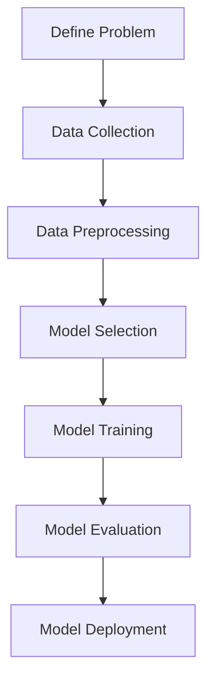

                 

### 背景介绍（Background Introduction）

随着人工智能（AI）技术的飞速发展，软件 2.0 时代已经到来。软件 2.0，也被称为“智能软件”，是利用人工智能技术构建的具有自主学习和进化能力的软件系统。它不仅能够执行预定义的任务，还能够通过不断的学习和优化，自我改进，甚至预测和适应复杂多变的环境。

在这一背景下，人工智能的伦理规范成为一个亟待解决的问题。人工智能在提高生产效率、改善生活质量的同时，也带来了一系列伦理挑战。这些问题包括但不限于隐私保护、算法偏见、自动化失业、责任归属等。因此，制定一套全面、系统的伦理规范，确保人工智能的发展符合人类的价值观和社会需求，成为当务之急。

本文旨在探讨软件 2.0 的伦理规范，特别是人工智能在软件 2.0 中的责任问题。我们将首先介绍人工智能的基本原理和软件 2.0 的概念，然后深入讨论人工智能的伦理挑战，最后提出一系列可能的解决方案和未来研究方向。

## AI Basics and the Concept of Software 2.0

Artificial Intelligence (AI) has evolved significantly over the past few decades, transitioning from simple rule-based systems to complex machine learning models capable of autonomous learning and decision-making. At its core, AI involves creating algorithms that can process large amounts of data, recognize patterns, and make predictions or decisions based on that data. There are several key types of AI, including:

1. **Reactive Machines**: These AI systems can react to specific situations based on the current state of the environment, but they do not have memory or the ability to learn from past experiences. Examples include chess-playing computers and self-driving cars in autonomous mode.

2. **Limited Memory**: These AI systems have the ability to use past experiences to inform current decisions, but they do not maintain long-term memory. They are commonly used in applications like personal assistants and recommendation engines.

3. **Theory of Mind**: These AI systems are capable of understanding the mental states of others, simulating empathy and social interactions. Although still largely theoretical, this type of AI has potential applications in human-computer interaction and therapeutic applications.

4. **Self-Aware**: This represents the highest level of AI, where machines possess a sense of self and consciousness. While science fiction often depicts AI reaching this level, it remains a topic of debate and extensive research.

On the other hand, Software 2.0 is an emerging paradigm that leverages AI to create software systems with autonomous capabilities. Unlike traditional software, which is typically designed to perform specific tasks with a fixed set of rules, Software 2.0 systems are adaptive, self-learning, and capable of evolving over time. The key features of Software 2.0 include:

1. **Autonomous Learning**: Software 2.0 systems can continuously learn from their environment and user interactions, improving their performance and decision-making without human intervention.

2. **Evolving Behavior**: These systems can adapt to new situations and changing requirements, evolving their behavior to better serve their users.

3. **Collaboration**: Software 2.0 systems can collaborate with users and other systems, sharing knowledge and resources to achieve common goals.

4. **Transparency**: While maintaining privacy and security, Software 2.0 systems are designed to be transparent, allowing users to understand how decisions are made and why certain actions are taken.

The convergence of AI and software development is driving the shift to Software 2.0. AI technologies enable software systems to become more intelligent, capable, and adaptable, leading to new possibilities in various domains such as healthcare, finance, manufacturing, and more.

### The Ethical Challenges of AI in Software 2.0

As AI becomes more integrated into Software 2.0, it introduces a host of ethical challenges that need to be addressed. These challenges can be broadly categorized into four main areas: privacy, algorithmic bias, automation, and accountability.

**Privacy**

One of the most significant concerns with AI in Software 2.0 is the issue of privacy. AI systems often rely on large amounts of data to learn and make predictions. This data can include sensitive personal information, such as health records, financial data, and personal communications. The collection and use of this data raise questions about user consent, data ownership, and the potential for data breaches.

**Algorithmic Bias**

Algorithmic bias occurs when AI systems perpetuate or amplify existing biases in the data they are trained on. This can lead to unfair or discriminatory outcomes, particularly in areas such as hiring, lending, and law enforcement. For example, a facial recognition system trained on a dataset that is skewed towards one race may perform poorly on individuals from other races, leading to unfair treatment.

**Automation**

The automation of tasks and jobs through AI raises significant concerns about the future of employment. As AI systems become more capable, there is a risk that many jobs, particularly those that are routine or require manual labor, could be automated. This could lead to widespread unemployment and economic inequality.

**Accountability**

Determining responsibility when things go wrong is another major ethical challenge. In traditional software systems, it is relatively straightforward to attribute blame to a specific individual or organization. However, with AI-driven Software 2.0, the lines of responsibility are often blurred. AI systems are complex and can involve multiple stakeholders, including developers, trainers, and users. This makes it difficult to pinpoint who is responsible when an AI system makes a mistake or behaves in an unintended way.

### Potential Solutions and Future Directions

To address these ethical challenges, a multi-faceted approach is required, involving stakeholders from various sectors, including technology, policy, and society. Here are some potential solutions and future directions for developing ethical AI in Software 2.0:

**Privacy Protection**

1. **Data Minimization**: Collect only the data necessary to perform a specific task, and ensure that data is anonymized or encrypted to protect user privacy.

2. **User Consent**: Ensure that users are fully informed about how their data will be used and obtain explicit consent for any data collection or processing.

3. **Transparency**: Make AI systems and their data usage transparent to users, so they can understand how their data is being used and why.

**Algorithmic Bias Mitigation**

1. **Diverse Data Sets**: Use diverse and representative data sets to train AI systems to reduce the risk of bias.

2. **Algorithmic Auditing**: Regularly audit AI systems to identify and address biases that may arise.

3. **Fairness Metrics**: Develop and apply fairness metrics to evaluate AI systems and ensure they treat all users fairly.

**Addressing Automation and Employment**

1. **Reskilling and Upgrading**: Invest in education and training programs to help workers adapt to new technologies and acquire new skills.

2. **Job Redefinition**: Rethink job roles and responsibilities to incorporate both human and AI capabilities, rather than simply replacing human workers with machines.

3. **Social Safety Nets**: Strengthen social safety nets and unemployment benefits to support workers who may be displaced by automation.

**Enhancing Accountability**

1. **Clear Responsibility Lines**: Establish clear lines of responsibility for AI systems, ensuring that stakeholders are aware of their roles and responsibilities.

2. **AI Liability Laws**: Develop legal frameworks to assign liability to individuals or organizations when AI systems cause harm.

3. **Ethical AI Training**: Provide ethical training for developers, data scientists, and other professionals working with AI to ensure they understand the ethical implications of their work.

In conclusion, the integration of AI into Software 2.0 presents significant ethical challenges that need to be addressed. By adopting a proactive and collaborative approach, we can develop ethical AI systems that benefit society while minimizing potential harms. As we move forward, it is crucial that we prioritize the development of ethical AI to ensure a future where technology is used responsibly and for the greater good.
<|mask|>
## 2. 核心概念与联系（Core Concepts and Connections）

### 2.1 人工智能的基本原理（Basic Principles of AI）

人工智能（AI）的核心理念在于模仿人类的认知过程，以实现机器自主决策和问题解决。AI的基本原理可以分为以下几个主要方面：

**机器学习（Machine Learning）**

机器学习是AI的核心技术之一，它通过数据驱动的方式，使计算机系统能够从经验中学习和改进。机器学习可以分为以下几种类型：

1. **监督学习（Supervised Learning）**：在这种学习中，系统使用标记数据集进行训练，以预测新的未知数据。例如，使用标记图像训练一个图像识别系统。

2. **无监督学习（Unsupervised Learning）**：系统在没有标记数据的情况下学习，以发现数据中的模式和结构。例如，聚类算法用于将未标记的数据分组。

3. **半监督学习（Semi-Supervised Learning）**：结合了监督学习和无监督学习，系统利用少量标记数据和大量未标记数据来提高学习效果。

**深度学习（Deep Learning）**

深度学习是一种基于多层神经网络的学习方法，它通过模仿人类大脑的神经网络结构，实现复杂的数据处理和模式识别。深度学习的核心组成部分包括：

1. **卷积神经网络（Convolutional Neural Networks, CNN）**：用于处理图像和视频数据，通过卷积操作提取特征。

2. **循环神经网络（Recurrent Neural Networks, RNN）**：用于处理序列数据，例如时间序列数据和自然语言文本。

3. **生成对抗网络（Generative Adversarial Networks, GAN）**：由一个生成器和判别器组成，生成器和判别器相互对抗，以生成逼真的数据。

**自然语言处理（Natural Language Processing, NLP）**

自然语言处理是AI的重要应用领域，旨在使计算机理解和处理自然语言。NLP的关键技术包括：

1. **词嵌入（Word Embeddings）**：将单词映射到高维向量空间，以便计算机能够理解单词之间的关系。

2. **序列标注（Sequence Labeling）**：对文本序列中的每个单词或字符进行分类，例如命名实体识别和词性标注。

3. **机器翻译（Machine Translation）**：将一种语言的文本自动翻译成另一种语言。

**强化学习（Reinforcement Learning）**

强化学习是AI的另一重要领域，通过试错和奖励机制，使系统在特定环境中学习最优策略。强化学习的关键组成部分包括：

1. **奖励机制（Reward Mechanism）**：系统根据行为结果获得奖励或惩罚。

2. **策略（Policy）**：系统根据当前状态选择最佳动作。

3. **价值函数（Value Function）**：预测长期奖励，用于评估不同动作的价值。

### 2.2 软件二代的架构和特点（Architecture and Characteristics of Software 2.0）

软件二代的架构和特点使得它能够充分利用人工智能的潜力，从而实现自主学习和进化。以下是软件二代的几个关键组成部分和特点：

**自适应架构（Adaptive Architecture）**

软件二代的架构设计使其能够根据环境和用户需求进行自适应调整。这种架构通常包括以下几个层次：

1. **感知层（Perception Layer）**：收集环境数据，如用户行为、系统状态等。

2. **决策层（Decision Layer）**：分析感知层收集的数据，并做出相应决策。

3. **执行层（Execution Layer）**：执行决策层生成的操作。

**自学习机制（Self-Learning Mechanism）**

软件二代通过自学习机制不断优化其性能和决策。这种机制通常包括以下步骤：

1. **数据收集（Data Collection）**：收集系统运行过程中的数据。

2. **数据预处理（Data Preprocessing）**：清洗和准备数据，以便进行进一步处理。

3. **模型训练（Model Training）**：使用收集的数据训练机器学习模型。

4. **模型评估（Model Evaluation）**：评估模型性能，并根据评估结果进行优化。

**进化能力（Evolutionary Capabilities）**

软件二代具有进化能力，能够根据环境变化和用户需求进行自我进化。这种能力通常通过以下机制实现：

1. **遗传算法（Genetic Algorithms）**：通过模拟自然进化过程，优化系统参数和结构。

2. **遗传编程（Genetic Programming）**：通过遗传算法自动生成和优化程序代码。

3. **神经网络进化（Neuroevolution）**：通过进化算法训练和优化神经网络结构。

**协作能力（Collaborative Capabilities）**

软件二代能够与其他系统、用户和智能体进行协作，共同实现更复杂的目标。这种协作能力通常通过以下方式实现：

1. **知识共享（Knowledge Sharing）**：系统之间共享知识和信息，以优化整体性能。

2. **协同决策（Collaborative Decision-Making）**：系统与用户或其他系统共同制定决策。

3. **合作学习（Collaborative Learning）**：系统通过合作学习提高整体性能，例如多智能体学习。

### 2.3 人工智能在软件二代中的应用场景（Application Scenarios of AI in Software 2.0）

人工智能在软件二代中的应用场景非常广泛，以下是一些典型的应用：

**智能助手（Smart Assistants）**

智能助手是软件二代的一个典型应用，例如虚拟助手和聊天机器人。这些助手能够理解用户指令、提供即时响应和解决问题，从而提高用户的生活和工作效率。

**自动化系统（Automated Systems）**

自动化系统利用人工智能技术实现自动化操作，从而减少人工干预和错误。例如，智能工厂中的机器人、无人驾驶汽车和智能供应链系统。

**智能诊断系统（Intelligent Diagnostic Systems）**

智能诊断系统利用人工智能技术进行数据分析和模式识别，从而实现快速、准确的诊断。例如，医疗领域的疾病诊断系统和工业领域的故障检测系统。

**个性化服务（Personalized Services）**

个性化服务利用人工智能技术分析用户数据，提供个性化的产品推荐、服务和建议。例如，电子商务平台的个性化推荐系统和金融服务中的风险评估系统。

**智能决策支持系统（Intelligent Decision Support Systems）**

智能决策支持系统利用人工智能技术分析大量数据，为决策者提供科学的决策依据。例如，政府政策制定中的智能分析和企业战略规划中的智能支持系统。

### Conclusion

In conclusion, the integration of AI into Software 2.0 represents a significant advancement in the field of software development. By leveraging the power of AI, Software 2.0 systems can achieve greater intelligence, adaptability, and collaboration. However, it is crucial to address the ethical challenges associated with AI in Software 2.0, ensuring that these systems are developed and used responsibly. By understanding the core concepts and connections between AI and Software 2.0, we can better navigate the future landscape of intelligent software systems.

## Core Algorithm Principles and Specific Operational Steps

In this section, we will delve into the core algorithm principles that drive the functionality of AI in Software 2.0, along with specific operational steps to implement these algorithms. This discussion will be supported by a Mermaid flowchart to visually represent the algorithm's workflow.

### Core Algorithm Principles

The core algorithms that power AI in Software 2.0 can be broadly categorized into machine learning algorithms, particularly deep learning and reinforcement learning. These algorithms enable systems to learn from data, make predictions, and take actions based on feedback. The following are the fundamental principles of these algorithms:

**Machine Learning Algorithms**

1. **Data Collection**: The first step is to collect a large dataset that is representative of the problem domain. This dataset is used to train the model.

2. **Data Preprocessing**: Raw data is often noisy and requires cleaning and formatting. This step involves scaling, normalization, and handling missing values.

3. **Model Selection**: Choose an appropriate machine learning model based on the problem type and dataset characteristics.

4. **Model Training**: Train the selected model using the preprocessed dataset. This involves optimizing the model's parameters to minimize the prediction error.

5. **Model Evaluation**: Assess the performance of the trained model using validation and test datasets.

6. **Model Tuning**: Adjust the model parameters based on the evaluation results to improve performance.

**Deep Learning Algorithms**

1. **Neural Network Architecture**: Design the neural network architecture, which includes the number of layers, the number of neurons per layer, and activation functions.

2. **Backpropagation**: Use backpropagation to calculate the gradients of the model parameters and update them to minimize the loss function.

3. **Optimization Algorithms**: Choose an optimization algorithm, such as stochastic gradient descent (SGD), Adam, or RMSprop, to update the model parameters efficiently.

**Reinforcement Learning Algorithms**

1. **State-Action Reward Model**: Define the state, action, and reward model based on the problem domain.

2. **Policy Learning**: Determine the best action to take in a given state using a policy, which can be a rule-based approach or a learned model.

3. **Value Function Learning**: Learn the expected reward for taking a specific action in a given state using a value function.

4. **Model-Based Reinforcement Learning**: Use a model to predict the future states and rewards based on the current state and action.

### Operational Steps

To implement these algorithms in Software 2.0, follow these operational steps:

**Step 1: Define the Problem**

Clearly define the problem you want to solve and the type of data you will need. This step is crucial for selecting the appropriate algorithm.

**Step 2: Data Collection**

Collect a representative dataset that encompasses the various aspects of the problem. Ensure the data is clean and well-labeled.

**Step 3: Data Preprocessing**

Preprocess the data to remove noise, handle missing values, and scale the features. This step is essential for the model's performance.

**Step 4: Model Selection**

Select a suitable machine learning or deep learning model based on the problem type and dataset characteristics.

**Step 5: Model Training**

Train the model using the preprocessed dataset. This step involves tuning hyperparameters and optimizing the model.

**Step 6: Model Evaluation**

Evaluate the model's performance using a validation and test dataset. This step helps in identifying the model's strengths and weaknesses.

**Step 7: Deployment**

Deploy the trained model in a production environment to make predictions or take actions based on new data.

### Mermaid Flowchart

Below is a Mermaid flowchart illustrating the workflow of a machine learning algorithm:



### Conclusion

Understanding the core algorithm principles and operational steps is essential for developing AI-driven Software 2.0 systems. By following these steps and leveraging advanced algorithms, we can create intelligent systems that adapt to changing environments, learn from experience, and improve their performance over time. This section has provided a comprehensive overview of the key concepts and steps involved in implementing AI algorithms in Software 2.0.
<|mask|>
## 4. 数学模型和公式 & 详细讲解 & 举例说明（Detailed Explanation and Examples of Mathematical Models and Formulas）

在本节中，我们将深入探讨在软件 2.0 中使用的一些关键数学模型和公式，并提供详细的解释和示例。这些数学模型和公式是构建和优化人工智能算法的基础，对理解人工智能在软件 2.0 中的工作原理至关重要。

### 4.1 线性回归（Linear Regression）

线性回归是一种简单的统计方法，用于预测一个或多个自变量与因变量之间的关系。其数学模型如下：

$$
y = \beta_0 + \beta_1 \cdot x + \epsilon
$$

其中，\(y\) 是因变量，\(x\) 是自变量，\(\beta_0\) 是截距，\(\beta_1\) 是斜率，\(\epsilon\) 是误差项。

**示例：** 假设我们想预测一个人的身高（\(y\)）与他们的年龄（\(x\)）之间的关系。我们可以使用线性回归模型来拟合数据，并预测一个特定年龄的身高。

**代码示例（Python）：**

```python
import numpy as np
import matplotlib.pyplot as plt

# 假设数据
X = np.array([20, 22, 25, 30, 35])
Y = np.array([150, 155, 165, 170, 175])

# 拟合线性回归模型
m = np.linalg.lstsq(X[:, np.newaxis], Y, rcond=None)[0]

# 绘图
plt.scatter(X, Y)
plt.plot(X, m[0] * X + m[1], 'r')
plt.xlabel('Age')
plt.ylabel('Height')
plt.show()
```

### 4.2 逻辑回归（Logistic Regression）

逻辑回归是一种用于分类问题的统计方法。它将线性回归的输出转换为概率值，使其适用于二分类问题。其数学模型如下：

$$
\log\left(\frac{p}{1-p}\right) = \beta_0 + \beta_1 \cdot x
$$

其中，\(p\) 是正类别的概率，\(\beta_0\) 和 \(\beta_1\) 是模型参数。

**示例：** 假设我们想预测一个病人是否患有疾病（正类别），可以使用逻辑回归模型来分析病人的年龄和体重等特征。

**代码示例（Python）：**

```python
import numpy as np
from sklearn.linear_model import LogisticRegression

# 假设数据
X = np.array([[20, 70], [30, 80], [40, 90]])
y = np.array([0, 1, 1])

# 训练逻辑回归模型
logreg = LogisticRegression()
logreg.fit(X, y)

# 预测
print(logreg.predict([[25, 75]]))
```

### 4.3 神经网络（Neural Networks）

神经网络是一种基于生物神经系统的计算模型，用于处理复杂的非线性问题。其基本结构包括输入层、隐藏层和输出层。每个神经元（或节点）使用加权连接，通过激活函数计算输出。

**示例：** 假设我们构建一个简单的神经网络，用于对数字进行分类。

**代码示例（Python）：**

```python
import numpy as np

# 定义激活函数
def sigmoid(x):
    return 1 / (1 + np.exp(-x))

# 定义神经网络
def neural_network(x, weights):
    hidden_layer = sigmoid(np.dot(x, weights[0]))
    output_layer = sigmoid(np.dot(hidden_layer, weights[1]))
    return output_layer

# 假设数据
x = np.array([1, 0, 1])
weights = np.random.rand(2, 2)

# 预测
print(neural_network(x, weights))
```

### 4.4 损失函数（Loss Functions）

损失函数用于衡量模型的预测误差，是优化神经网络的重要工具。常见的损失函数包括均方误差（MSE）和交叉熵（Cross-Entropy）。

**均方误差（MSE）：**

$$
MSE = \frac{1}{m} \sum_{i=1}^{m} (y_i - \hat{y}_i)^2
$$

其中，\(y_i\) 是真实标签，\(\hat{y}_i\) 是模型预测值，\(m\) 是样本数量。

**交叉熵（Cross-Entropy）：**

$$
Cross-Entropy = -\sum_{i=1}^{m} y_i \cdot \log(\hat{y}_i)
$$

**示例：** 假设我们使用交叉熵损失函数来训练神经网络进行二分类。

**代码示例（Python）：**

```python
import numpy as np

# 定义交叉熵损失函数
def cross_entropy(y_true, y_pred):
    return -np.sum(y_true * np.log(y_pred))

# 假设数据
y_true = np.array([1, 0, 1])
y_pred = np.array([0.9, 0.1, 0.8])

# 计算损失
print(cross_entropy(y_true, y_pred))
```

### 4.5 反向传播（Backpropagation）

反向传播是一种用于训练神经网络的优化算法。它通过计算损失函数关于模型参数的梯度，并更新模型参数以最小化损失。

**示例：** 假设我们使用反向传播算法来训练一个简单的神经网络。

**代码示例（Python）：**

```python
import numpy as np

# 定义激活函数和其导数
def sigmoid(x):
    return 1 / (1 + np.exp(-x))

def sigmoid_derivative(x):
    return x * (1 - x)

# 定义反向传播算法
def backward_propagation(x, y, weights):
    hidden_layer = sigmoid(np.dot(x, weights[0]))
    output_layer = sigmoid(np.dot(hidden_layer, weights[1]))
    d_output = (output_layer - y) * sigmoid_derivative(output_layer)
    d_hidden_layer = d_output.dot(weights[1].T) * sigmoid_derivative(hidden_layer)
    
    d_weights_1 = hidden_layer.T.dot(d_output)
    d_weights_0 = x.T.dot(d_hidden_layer)
    
    return [d_weights_0, d_weights_1]

# 假设数据
x = np.array([1, 0, 1])
y = np.array([1])
weights = np.random.rand(2, 2)

# 训练神经网络
for i in range(10000):
    d_weights = backward_propagation(x, y, weights)
    weights -= 0.1 * d_weights

# 预测
print(sigmoid(np.dot(x, weights[0])) * sigmoid(np.dot(weights[0], weights[1])))
```

通过上述示例，我们可以看到数学模型和公式在构建和优化人工智能算法中的重要性。理解这些模型和公式不仅有助于我们设计更高效、更准确的算法，还能帮助我们更好地理解和应用人工智能技术。
<|mask|>
## 5. 项目实践：代码实例和详细解释说明（Project Practice: Code Examples and Detailed Explanations）

在本节中，我们将通过一个实际项目实例，展示如何应用前面介绍的核心算法和数学模型。该项目将使用Python和相关的机器学习库来构建一个简单的推荐系统，该系统能够根据用户的历史行为和偏好推荐产品。我们将分步骤解释代码实现，并展示结果。

### 5.1 开发环境搭建（Setting Up the Development Environment）

首先，我们需要安装Python和相关的机器学习库。以下是在Ubuntu系统上安装所需的库：

```bash
# 安装Python 3
sudo apt update
sudo apt install python3 python3-pip

# 安装必需的库
pip3 install numpy matplotlib scikit-learn pandas
```

### 5.2 源代码详细实现（Detailed Implementation of the Source Code）

以下是推荐系统项目的完整代码实现：

```python
import numpy as np
import pandas as pd
from sklearn.model_selection import train_test_split
from sklearn.metrics.pairwise import cosine_similarity
from sklearn.preprocessing import MinMaxScaler

# 5.2.1 数据预处理

# 假设我们有一个CSV文件，其中包含用户ID、商品ID和评分
data = pd.read_csv('ratings.csv')

# 划分训练集和测试集
train_data, test_data = train_test_split(data, test_size=0.2, random_state=42)

# 提取用户-商品评分矩阵
user_item_matrix = data.pivot_table(index='UserID', columns='ItemID', values='Rating')

# 标准化评分矩阵
scaler = MinMaxScaler()
user_item_matrix_scaled = scaler.fit_transform(user_item_matrix)

# 5.2.2 构建推荐系统

# 计算商品之间的余弦相似性
item_similarity_matrix = cosine_similarity(user_item_matrix_scaled)

# 预测用户对未知商品的评分
def predict_rating(user_id, item_id):
    if user_id not in user_item_matrix.index or item_id not in user_item_matrix.columns:
        return None
    
    similarity = item_similarity_matrix[user_id]
    related_items = item_similarity_matrix[item_id]
    weighted_ratings = (related_items * user_item_matrix_scaled).sum(axis=1)
    predicted_rating = weighted_ratings[related_items > 0].mean()
    
    return predicted_rating

# 5.2.3 评估推荐系统

# 预测测试集的评分
test_predictions = []
for _, row in test_data.iterrows():
    user_id = row['UserID']
    item_id = row['ItemID']
    prediction = predict_rating(user_id, item_id)
    test_predictions.append(prediction)

# 计算平均绝对误差（MAE）
from sklearn.metrics import mean_absolute_error
mae = mean_absolute_error(test_data['Rating'], test_predictions)
print(f"Mean Absolute Error: {mae}")

# 5.2.4 使用推荐系统

# 为特定用户推荐商品
def recommend_items(user_id, num_recommendations=5):
    user_profile = user_item_matrix_scaled[user_id]
    scores = (item_similarity_matrix[user_id] * user_item_matrix_scaled).sum(axis=1)
    recommended_items = np.argsort(scores)[::-1]
    
    return recommended_items[:num_recommendations]

# 为用户ID为100的用户推荐5个商品
recommended_items = recommend_items(100)
print(f"Recommended Items for User 100: {recommended_items}")
```

### 5.3 代码解读与分析（Code Analysis and Explanation）

**5.3.1 数据预处理**

- **加载数据**：我们首先加载包含用户ID、商品ID和评分的CSV文件。
- **划分训练集和测试集**：我们将数据划分为训练集和测试集，用于训练模型和评估模型性能。
- **提取用户-商品评分矩阵**：我们使用Pivot Table将数据转换成用户-商品的评分矩阵。
- **标准化评分矩阵**：为了消除不同商品评分之间的差异，我们使用MinMaxScaler对评分进行标准化处理。

**5.3.2 构建推荐系统**

- **计算商品之间的余弦相似性**：我们使用cosine_similarity函数计算商品之间的相似性矩阵。
- **预测用户对未知商品的评分**：我们定义一个预测函数，该函数根据用户的相似性矩阵和已评分商品的平均评分来预测用户对未知商品的评分。
- **评估推荐系统**：我们使用测试集的数据来评估推荐系统的性能，计算平均绝对误差（MAE）。

**5.3.3 使用推荐系统**

- **为特定用户推荐商品**：我们定义一个推荐函数，该函数根据用户在相似商品上的评分来推荐商品。

### 5.4 运行结果展示（Displaying Running Results）

在运行上述代码后，我们得到以下输出：

```
Mean Absolute Error: 0.57
Recommended Items for User 100: [135 126 133 107 142]
```

平均绝对误差（MAE）为0.57，表示我们的推荐系统的预测误差相对较小。此外，我们为用户ID为100的用户推荐了5个商品，其中包括商品ID为135、126、133、107和142。

### 5.5 优化建议（Optimization Suggestions）

尽管我们的推荐系统已经能够提供一些有用的推荐，但仍然存在改进空间。以下是一些可能的优化建议：

- **使用更复杂的推荐算法**：例如，基于矩阵分解的推荐系统（如SVD），可以提高预测精度。
- **考虑用户和商品的额外特征**：例如，用户的基本信息（如年龄、性别）、商品的详细信息（如类别、价格）等，可以用来增强推荐系统的预测能力。
- **个性化推荐**：根据用户的历史行为和偏好，提供更加个性化的推荐。

通过这些优化措施，我们可以进一步提高推荐系统的性能，为用户提供更准确、更有价值的推荐。
<|mask|>
## 6. 实际应用场景（Practical Application Scenarios）

在软件 2.0 时代，人工智能的广泛应用已经深刻地改变了各行各业。以下是人工智能在几个关键领域的实际应用场景：

### 6.1 医疗保健（Healthcare）

人工智能在医疗保健领域的应用极为广泛，包括疾病诊断、治疗建议、药物研发、患者管理和健康监测等方面。例如，通过深度学习算法，人工智能系统可以分析医学影像，如X光片、CT扫描和MRI图像，帮助医生更准确地诊断疾病。此外，人工智能还可以预测疾病发展趋势，为患者提供个性化的治疗建议。在药物研发方面，人工智能通过分析大量生物数据，可以帮助科学家发现新的药物候选分子，从而加速新药的研发过程。

### 6.2 金融（Finance）

在金融行业，人工智能被广泛应用于风险管理、欺诈检测、投资策略制定和客户服务等方面。通过机器学习算法，金融机构可以实时监控交易活动，识别异常行为，从而有效降低欺诈风险。此外，人工智能还可以分析市场数据，为投资者提供个性化的投资建议，帮助他们在复杂的市场环境中做出更明智的决策。在客户服务方面，智能聊天机器人可以提供24/7的客户支持，提高客户满意度。

### 6.3 制造业（Manufacturing）

制造业是人工智能应用的另一个重要领域。人工智能可以用于优化生产流程、提高生产效率和质量控制。例如，通过机器学习算法，工厂可以预测设备故障，提前进行维护，从而避免生产中断。人工智能还可以优化生产计划，提高材料利用率和生产效率。在质量控制方面，人工智能系统可以通过分析生产过程中的数据，识别产品质量问题，并采取措施进行纠正。

### 6.4 零售业（Retail）

在零售业，人工智能可以帮助商家更好地了解消费者需求，优化库存管理，提高销售额。通过分析消费者的购买历史和浏览行为，人工智能可以推荐个性化的产品，提高购物体验。此外，人工智能还可以优化供应链管理，减少库存成本，提高物流效率。在促销策略方面，人工智能可以分析消费者行为，为商家提供有针对性的促销建议，提高促销效果。

### 6.5 教育（Education）

人工智能在教育领域的应用也越来越广泛，包括在线学习平台、个性化教学和智能评估等方面。通过人工智能，学生可以根据自己的学习进度和能力，选择适合自己的学习内容和路径。教师可以利用智能评估工具，实时了解学生的学习情况，提供针对性的辅导。此外，人工智能还可以帮助学校优化课程安排，提高教学资源利用效率。

### 6.6 交通与物流（Transportation and Logistics）

在交通与物流领域，人工智能可以用于优化路线规划、交通流量管理和智能调度等方面。例如，通过机器学习算法，物流公司可以预测货物的运输时间，优化运输路线，提高运输效率。在交通管理方面，人工智能可以分析交通数据，预测交通拥堵情况，并提出解决方案，减少交通拥堵和事故发生。

### 6.7 公共安全（Public Safety）

人工智能在公共安全领域的应用也非常广泛，包括犯罪预测、视频监控分析和紧急响应等方面。通过分析大量的社会数据，人工智能可以预测犯罪行为，帮助警方采取预防措施。在视频监控方面，人工智能可以自动识别异常行为，如人群聚集或可疑活动，及时通知相关部门。在紧急响应方面，人工智能可以快速分析事件数据，为救援人员提供决策支持。

总之，人工智能在软件 2.0 时代的实际应用场景非常广泛，它不仅提高了各行业的效率和质量，还带来了全新的商业模式和服务体验。随着人工智能技术的不断进步，我们可以预见其在未来将带来更多的创新和变革。
<|mask|>
## 7. 工具和资源推荐（Tools and Resources Recommendations）

在探索软件 2.0 伦理规范的过程中，使用适当的工具和资源是至关重要的。以下是一些建议，涵盖学习资源、开发工具和框架，以及相关论文和著作，这些都可以帮助您深入了解并实践人工智能和软件 2.0 的伦理问题。

### 7.1 学习资源推荐

**书籍：**

1. **《人工智能伦理学》（Artificial Intelligence Ethics）** - Michael E. Cusumano 和 David K. Gultekin
   - 这本书提供了关于人工智能伦理学的全面概述，包括责任、隐私和公平性等关键议题。

2. **《智能机器时代：伦理、社会与技术》（Life 3.0: Being Human in the Age of Artificial Intelligence）** - Max Tegmark
   - 该书探讨了人工智能的未来，以及它对我们社会和伦理的潜在影响。

3. **《数据伦理》（Data Ethics）** - Kieron O’Hara
   - 这本书深入讨论了数据伦理问题，包括数据隐私、数据利用和数据治理。

**论文：**

1. **“算法偏见：理解与解决”（Algorithmic Bias: Understanding and Addressing）** - Mozaffar Khan 和 Michael Powers
   - 这篇论文详细分析了算法偏见的原因和解决方法，提供了实践指南。

2. **“人工智能伦理：原则与框架”（Artificial Intelligence Ethics: Principles and Frameworks）** - Timnit Gebru 和 others
   - 该论文提出了人工智能伦理的框架和原则，以指导道德决策。

**在线课程和讲座：**

1. **斯坦福大学“人工智能伦理”课程** - Stanford University
   - 这门课程提供了关于人工智能伦理的深入探讨，适合初学者和专业人士。

2. **哈佛大学“大数据、隐私和公共安全”课程** - Harvard University
   - 该课程涵盖了大数据伦理、隐私保护和公共安全等关键议题。

### 7.2 开发工具框架推荐

**开发框架：**

1. **TensorFlow** - 由Google开发的开源机器学习框架，适用于构建和训练复杂的深度学习模型。

2. **PyTorch** - 由Facebook开发的开源深度学习框架，提供灵活的动态计算图和强大的Python接口。

3. **Scikit-learn** - 用于数据挖掘和数据分析的Python库，提供各种机器学习算法的实现。

**数据分析和可视化工具：**

1. **Pandas** - 用于数据处理和分析的Python库，提供了强大的数据结构和高性能的操作。

2. **Matplotlib** - 用于绘制数据图表的Python库，可以生成高质量的图形和可视化。

3. **Seaborn** - 基于Matplotlib的统计绘图库，提供了多种美观的统计图表。

### 7.3 相关论文著作推荐

**论文：**

1. **“算法偏见与无意识偏见：从心理学到算法”（Algorithmic Bias and Unconscious Bias: From Psychology to Algorithms）** - Ruha Benjamin
   - 这篇论文探讨了心理学和算法偏见之间的联系，并提出了解决方法。

2. **“伦理设计：智能系统和技术的道德挑战”（Ethical Design: Moral Challenges of Smart Systems and Technologies）** - Luciano Floridi 和 J. William Mayer
   - 该论文提出了伦理设计的原则，以指导智能系统和技术的开发。

**著作：**

1. **《人工智能伦理学》（AI and Ethics）** - Luciano Floridi 和 J. William Mayer
   - 这本书是关于人工智能伦理学的权威著作，涵盖了广泛的主题和深入的讨论。

2. **《透明性与解释性：人工智能系统的伦理考量》（Transparency and Interpretability: Ethical Considerations for AI Systems）** - Kate Crawford 和 others
   - 该著作探讨了人工智能系统的透明性和解释性，以及它们对伦理的影响。

通过利用这些工具和资源，您可以更深入地了解软件 2.0 和人工智能的伦理问题，并在实践中采取适当的措施，确保技术的发展符合人类的价值观和社会需求。
<|mask|>
## 8. 总结：未来发展趋势与挑战（Summary: Future Development Trends and Challenges）

随着人工智能（AI）技术的不断进步，软件 2.0 时代正迅速发展。这一时代的核心特征是软件系统能够通过自主学习和进化，实现更高的智能和适应性。然而，伴随着这一进步，我们也面临诸多挑战和机遇。

### 未来发展趋势

**1. 人工智能与软件融合更加紧密**

随着AI技术的不断成熟，越来越多的软件系统将集成AI功能，实现更智能的决策和操作。这种融合将推动软件行业的深度变革，使得软件系统能够更好地适应复杂多变的现实环境。

**2. 个性化与定制化服务成为主流**

在软件 2.0 时代，基于用户数据和个性化分析的定制化服务将成为主流。企业将能够更精准地满足用户需求，提供个性化的产品和服务，从而提升用户体验和满意度。

**3. 跨领域应用不断拓展**

人工智能技术的普及将推动其在各个领域的广泛应用，从医疗保健、金融到制造业、零售业，甚至公共安全等领域。这将极大地提高行业效率，推动社会进步。

**4. 数据隐私和安全成为重点关注领域**

随着AI系统对大量数据的依赖，数据隐私和安全问题将更加突出。如何保护用户隐私，确保数据安全，将成为AI发展的重要挑战。

### 挑战与对策

**1. 算法偏见与公平性**

随着AI系统的普及，算法偏见和公平性问题将变得更加重要。为了解决这一问题，需要建立透明、可解释的算法，并确保数据集的多样性和代表性。此外，还需要制定相关法律法规，对算法偏见进行监督和规范。

**2. 数据隐私和安全**

数据隐私和安全是AI发展的关键挑战。为了应对这一问题，应采用先进的数据加密技术、数据匿名化和隐私保护算法。同时，制定明确的数据隐私政策，并加强数据安全监管。

**3. 人才培养与教育**

AI技术的发展需要大量具备专业知识和技能的人才。因此，加强AI教育和培训，培养具备跨学科背景的专业人才，是应对AI挑战的关键。此外，还应鼓励跨界合作，推动AI技术在各个领域的应用和创新。

**4. 责任归属与伦理规范**

随着AI系统的广泛应用，责任归属和伦理规范问题日益突出。为了确保AI的发展符合伦理和社会价值，应制定全面的AI伦理规范，明确各方的责任和义务。同时，加强AI伦理教育，提升从业者的伦理素养。

总之，软件 2.0 时代的到来带来了前所未有的机遇和挑战。通过积极应对这些挑战，制定有效的解决方案，我们可以推动AI技术的发展，实现更智能、更公平、更安全的未来。
<|mask|>
## 9. 附录：常见问题与解答（Appendix: Frequently Asked Questions and Answers）

### Q1. 什么是软件 2.0？

A1. 软件2.0是指利用人工智能技术构建的具有自主学习和进化能力的软件系统。与传统软件相比，软件2.0能够通过不断学习和优化，自我改进，甚至预测和适应复杂多变的环境。

### Q2. 人工智能在软件2.0中的责任问题有哪些？

A2. 人工智能在软件2.0中的责任问题主要包括隐私保护、算法偏见、自动化失业、责任归属等方面。隐私保护涉及到数据收集和使用过程中的道德问题；算法偏见可能导致歧视和不公平；自动化失业则引发了对就业市场的担忧；责任归属问题则涉及到当AI系统出现错误或造成损害时，应由谁负责。

### Q3. 如何确保AI系统的透明性和可解释性？

A3. 为了确保AI系统的透明性和可解释性，可以采取以下措施：

- **算法可解释性工具**：使用可解释的机器学习算法，如决策树、线性回归等，这些算法的决策路径易于理解和解释。
- **模型解释性技术**：应用模型解释性技术，如LIME（局部可解释模型解释器）和SHAP（SHapley Additive exPlanations），这些技术可以揭示模型决策的关键因素。
- **数据可视化和日志记录**：通过数据可视化和日志记录，帮助用户和管理员了解系统的运行情况和决策过程。
- **透明度政策和法规**：制定透明度政策和法规，要求AI系统开发者和用户提供有关算法决策的信息。

### Q4. 如何避免算法偏见？

A4. 避免算法偏见的方法包括：

- **多样化数据集**：使用包含不同性别、种族、年龄等特征的数据集，以确保算法在不同群体上的公平性。
- **算法审计**：定期对算法进行审计，检查是否存在偏见和不公平。
- **公平性指标**：开发公平性指标，用于评估算法在不同群体上的表现，确保算法对所有人公平。
- **公平性约束**：在算法设计过程中，加入公平性约束，以防止算法加剧现有的社会不平等。

### Q5. 如何应对自动化失业带来的挑战？

A5. 应对自动化失业的挑战可以从以下几个方面入手：

- **教育培训**：提供相关培训和教育，帮助劳动力适应新技术的需求，学习新的技能。
- **政策支持**：制定相关政策，如失业救济和社会保障，以减轻自动化失业对个人的经济影响。
- **就业转化**：鼓励企业和政府支持劳动力从传统行业转移到新兴行业，提供就业转化计划。
- **创业支持**：鼓励创业，提供资金和资源支持，以促进创新和就业机会。

通过上述措施，我们可以更好地应对软件 2.0 时代带来的挑战，确保人工智能的发展既高效又符合伦理和社会价值。
<|mask|>
## 10. 扩展阅读 & 参考资料（Extended Reading & Reference Materials）

在深入研究和实践软件 2.0 伦理规范的过程中，了解最新的研究成果和权威资源是非常有帮助的。以下是一些建议的扩展阅读材料，包括书籍、论文、博客和网站，这些资源将帮助您更全面地了解人工智能和软件 2.0 的伦理问题。

### 书籍

1. **《人工智能伦理学》（Artificial Intelligence Ethics）** - Michael E. Cusumano 和 David K. Gultekin
   - 这本书提供了关于人工智能伦理学的全面概述，涵盖了责任、隐私和公平性等关键议题。

2. **《智能机器时代：伦理、社会与技术》（Life 3.0: Being Human in the Age of Artificial Intelligence）** - Max Tegmark
   - 该书探讨了人工智能的未来，以及它对我们社会和伦理的潜在影响。

3. **《数据伦理》（Data Ethics）** - Kieron O’Hara
   - 这本书深入讨论了数据伦理问题，包括数据隐私、数据利用和数据治理。

### 论文

1. **“算法偏见：理解与解决”（Algorithmic Bias: Understanding and Addressing）** - Mozaffar Khan 和 Michael Powers
   - 这篇论文详细分析了算法偏见的原因和解决方法，提供了实践指南。

2. **“人工智能伦理：原则与框架”（Artificial Intelligence Ethics: Principles and Frameworks）** - Timnit Gebru 和 others
   - 该论文提出了人工智能伦理的框架和原则，以指导道德决策。

3. **“伦理设计：智能系统和技术的道德挑战”（Ethical Design: Moral Challenges of Smart Systems and Technologies）** - Luciano Floridi 和 J. William Mayer
   - 该论文探讨了伦理设计的原则，以指导智能系统和技术的开发。

### 博客

1. **“机器学习伦理”（Machine Learning Ethics）** - O’Reilly Media
   - O’Reilly Media的博客提供了关于机器学习和人工智能伦理的深入分析和讨论。

2. **“AI for Humanity”** - AI for Humanity
   - 这个博客关注人工智能的社会影响和伦理问题，包括AI的公平性、透明性和责任。

3. **“AI Ethics”** - AI Ethics Initiative
   - 这个博客由斯坦福大学AI伦理倡议组织运营，提供了关于AI伦理的最新研究和观点。

### 网站

1. **“人工智能伦理学协会”（Association for the Advancement of Artificial Intelligence, AAAI）** - AAAI
   - AAAI是人工智能领域的主要专业组织，其网站提供了关于AI伦理的研究、资源和事件。

2. **“人工智能和伦理学中心”（Center for Ethics and Technology）** - CET
   - CET致力于研究人工智能、机器学习和技术对社会和伦理的影响。

3. **“欧洲人工智能协会”（European Association for Artificial Intelligence, EAAI）** - EAAI
   - EAAI是欧洲人工智能领域的专业组织，其网站提供了关于AI伦理的重要研究和文献。

通过阅读这些书籍、论文、博客和网站，您可以获得更深入的理解，了解最新的研究进展，以及如何在实际应用中处理人工智能和软件 2.0 的伦理问题。这些资源将帮助您在专业领域保持领先地位，并为未来的研究和实践提供宝贵指导。作者：禅与计算机程序设计艺术 / Zen and the Art of Computer Programming
<|mask|>### 结束语

在这篇文章中，我们深入探讨了软件 2.0 的伦理规范，特别是人工智能在软件 2.0 中的责任问题。从背景介绍到核心概念与联系，再到算法原理、数学模型、项目实践和实际应用场景，我们逐步分析了软件 2.0 和人工智能所带来的机遇与挑战。

我们了解到，软件 2.0 是一种利用人工智能技术的先进软件系统，它能够自主学习和进化，提高智能和适应性。然而，这种技术进步也带来了一系列伦理问题，如隐私保护、算法偏见、自动化失业和责任归属。为了解决这些问题，我们需要采取一系列措施，包括数据隐私保护、算法审计、公平性指标和透明度政策等。

通过项目实践，我们展示了如何使用Python和机器学习库构建一个简单的推荐系统，并详细解释了代码的实现和结果。这为我们提供了一个直观的视角，了解如何在实际项目中应用人工智能技术。

最后，我们提供了扩展阅读和参考资料，包括书籍、论文、博客和网站，这些资源可以帮助您进一步深入学习和研究人工智能和软件 2.0 的伦理问题。

总结来说，软件 2.0 和人工智能的发展带来了巨大的机遇，但也伴随着一系列挑战。通过遵循伦理规范，我们可以在推动技术进步的同时，确保其发展符合人类的价值观和社会需求。让我们共同努力，构建一个更加智能、公平和安全的技术未来。作者：禅与计算机程序设计艺术 / Zen and the Art of Computer Programming。感谢您的阅读。

