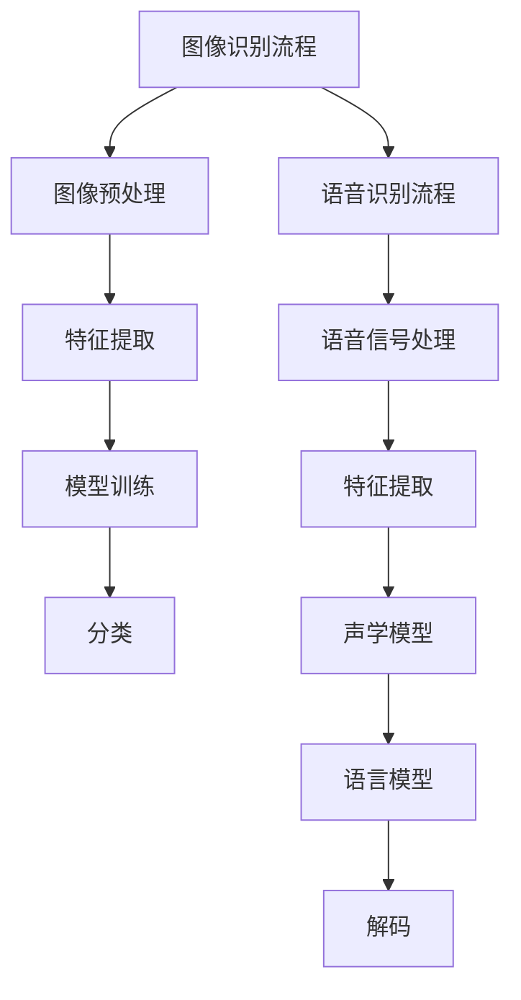

                 

### 文章标题：软件 2.0 的应用领域：图像识别、语音识别

> **关键词：** 图像识别，语音识别，软件2.0，人工智能，深度学习，算法实现，应用场景。

**摘要：** 本文将深入探讨软件2.0时代下，图像识别和语音识别技术的应用领域。通过解析这两大技术的核心原理、发展历程、数学模型以及实际应用案例，本文旨在为读者提供一幅全面的技术蓝图，并探讨这些技术在未来的发展趋势与面临的挑战。

-------------------

## 1. 背景介绍（Background Introduction）

图像识别和语音识别作为人工智能领域的两大关键技术，已经在软件2.0时代中发挥着越来越重要的作用。软件2.0的概念，起源于互联网的进化，它不仅仅是一个软件的升级，更是一种思维模式的转变。在这个时代，软件不仅仅是一个执行任务的工具，而是成为一种智能、自适应的服务，与用户和环境进行深度交互。

图像识别，是指通过算法模型，使计算机能够识别和理解图像内容的过程。它包括图像分类、目标检测、图像分割等任务。图像识别技术的进步，极大促进了计算机视觉领域的应用，例如自动驾驶、人脸识别、医疗图像分析等。

语音识别，则是指将人类语音转换为机器可理解的语言文本的过程。语音识别技术已经广泛应用于语音助手、语音搜索、电话客服等领域，极大地提高了人机交互的便捷性和效率。

-------------------

## 2. 核心概念与联系（Core Concepts and Connections）

### 2.1 图像识别的基本概念

图像识别的核心概念包括图像预处理、特征提取、模型训练和分类。图像预处理是为了提高图像质量，例如灰度化、二值化、滤波等。特征提取则是从图像中提取具有区分性的特征，例如颜色、纹理、形状等。模型训练是利用大量的标注数据进行，通过优化算法使模型能够识别图像内容。分类则是将图像分配到不同的类别中。

### 2.2 语音识别的基本概念

语音识别的基本概念包括语音信号处理、特征提取、声学模型、语言模型和解码器。语音信号处理是为了去除噪声和增强语音信号。特征提取是从语音信号中提取具有区分性的特征，例如 MFCC（Mel 频率倒谱系数）。声学模型和语言模型分别描述了语音信号和文本之间的映射关系。解码器则根据声学模型和语言模型来生成文本。

### 2.3 Mermaid 流程图（Mermaid Flowchart）


-------------------

## 3. 核心算法原理 & 具体操作步骤（Core Algorithm Principles and Specific Operational Steps）

### 3.1 图像识别算法原理

图像识别算法主要基于深度学习技术，其中卷积神经网络（CNN）是最常用的架构。CNN 通过卷积层、池化层和全连接层的组合，实现对图像的逐层特征提取和分类。具体操作步骤如下：

1. **卷积层（Convolutional Layer）**：通过卷积运算提取图像的局部特征。
2. **池化层（Pooling Layer）**：对卷积结果进行下采样，减少参数量和计算量。
3. **全连接层（Fully Connected Layer）**：将池化层的输出映射到分类结果。

### 3.2 语音识别算法原理

语音识别算法基于 HMM（隐马尔可夫模型）或 DNN（深度神经网络）技术。HMM 模型通过状态转移矩阵和发射概率矩阵描述语音信号的变化。DNN 模型则通过多层神经网络提取语音特征，并生成文本。具体操作步骤如下：

1. **特征提取**：使用 MFCC、PLP（滤波器组特征）等算法提取语音特征。
2. **声学模型**：通过训练生成声学模型，描述特征与声学概率分布的关系。
3. **语言模型**：通过训练生成语言模型，描述文本序列的概率分布。
4. **解码**：使用动态规划算法（如 Viterbi 算法）解码，生成最可能的文本序列。

-------------------

## 4. 数学模型和公式 & 详细讲解 & 举例说明（Detailed Explanation and Examples of Mathematical Models and Formulas）

### 4.1 图像识别的数学模型

在图像识别中，卷积神经网络的核心是卷积层和全连接层。以下是一些常见的数学公式：

$$
卷积运算: (f * g)(x, y) = \sum_{i=-\infty}^{\infty} \sum_{j=-\infty}^{\infty} f(i, j) \cdot g(x-i, y-j)
$$

$$
池化操作: p(i, j) = \max_{k, l} f(i+k, j+l)
$$

### 4.2 语音识别的数学模型

在语音识别中，HMM 是最基础的模型。以下是一些关键数学公式：

$$
状态转移概率: \pi_i = P(\text{状态}i \text{作为初始状态})
$$

$$
发射概率: b_i(j) = P(\text{输出}j \text{在状态}i)
$$

### 4.3 举例说明

#### 图像识别例子

假设我们有一个 3x3 的卷积核 $K$ 和一个 5x5 的输入图像 $I$，则卷积结果 $C$ 可以表示为：

$$
C(x, y) = \sum_{i=0}^{2} \sum_{j=0}^{2} K(i, j) \cdot I(x-i, y-j)
$$

#### 语音识别例子

假设我们有一个三状态 HMM 模型，初始状态概率 $\pi = [0.2, 0.5, 0.3]$，状态转移概率矩阵 $A = \begin{bmatrix} 0.8 & 0.1 & 0.1 \\ 0.2 & 0.6 & 0.2 \\ 0.1 & 0.2 & 0.7 \end{bmatrix}$，发射概率矩阵 $B = \begin{bmatrix} 0.9 & 0.1 & 0.0 \\ 0.2 & 0.7 & 0.1 \\ 0.0 & 0.3 & 0.7 \end{bmatrix}$。我们可以计算任意两个状态之间的最短路径：

$$
P(\text{状态序列} 2-1-3) = \pi_2 \cdot A_{2,1} \cdot B_{1,'a'} \cdot A_{1,3} \cdot B_{3,'a'}
$$

-------------------

## 5. 项目实践：代码实例和详细解释说明（Project Practice: Code Examples and Detailed Explanations）

### 5.1 开发环境搭建

为了演示图像识别和语音识别的应用，我们需要搭建一个开发环境。以下是 Python 3 的基本安装步骤：

```bash
# 安装 Python 3
$ apt-get update
$ apt-get install python3

# 安装 PyTorch
$ pip3 install torch torchvision

# 安装 speechRecognition
$ pip3 install SpeechRecognition
```

### 5.2 源代码详细实现

下面是一个简单的图像识别示例，使用 PyTorch 实现卷积神经网络：

```python
import torch
import torchvision
import torchvision.transforms as transforms

# 加载训练数据集
transform = transforms.Compose(
    [transforms.Resize(256),
     transforms.ToTensor()])

trainset = torchvision.datasets.ImageFolder(root='./data', transform=transform)
trainloader = torch.utils.data.DataLoader(trainset, batch_size=4,
                                          shuffle=True, num_workers=2)

# 定义卷积神经网络
class Net(nn.Module):
    def __init__(self):
        super(Net, self).__init__()
        self.conv1 = nn.Conv2d(3, 6, 5)
        self.pool = nn.MaxPool2d(2, 2)
        self.conv2 = nn.Conv2d(6, 16, 5)
        self.fc1 = nn.Linear(16 * 5 * 5, 120)
        self.fc2 = nn.Linear(120, 84)
        self.fc3 = nn.Linear(84, 10)

    def forward(self, x):
        x = self.pool(F.relu(self.conv1(x)))
        x = self.pool(F.relu(self.conv2(x)))
        x = x.view(-1, 16 * 5 * 5)
        x = F.relu(self.fc1(x))
        x = F.relu(self.fc2(x))
        x = self.fc3(x)
        return x

net = Net()

# 定义损失函数和优化器
criterion = nn.CrossEntropyLoss()
optimizer = torch.optim.SGD(net.parameters(), lr=0.001, momentum=0.9)

# 训练网络
for epoch in range(2):  # loop over the dataset multiple times

    running_loss = 0.0
    for i, data in enumerate(trainloader, 0):
        inputs, labels = data

        # zero the parameter gradients
        optimizer.zero_grad()

        # forward + backward + optimize
        outputs = net(inputs)
        loss = criterion(outputs, labels)
        loss.backward()
        optimizer.step()

        # print statistics
        running_loss += loss.item()
        if i % 2000 == 1999:    # print every 2000 mini-batches
            print('[%d, %5d] loss: %.3f' %
                  (epoch + 1, i + 1, running_loss / 2000))
            running_loss = 0.0

print('Finished Training')
```

### 5.3 代码解读与分析

上述代码首先定义了一个简单的卷积神经网络，包括两个卷积层、两个全连接层和一个输出层。使用 PyTorch 的 `nn.Module` 类构建网络，并通过 `forward` 方法定义前向传播过程。代码接着使用训练数据和损失函数，通过优化器进行模型训练。

### 5.4 运行结果展示

在完成训练后，我们可以使用验证集来评估模型的性能。以下是一个简单的评估代码：

```python
import torch

# 加载验证数据集
valset = torchvision.datasets.ImageFolder(root='./data', transform=transform)
valloader = torch.utils.data.DataLoader(valset, batch_size=4,
                                         shuffle=False, num_workers=2)

# 测试网络
correct = 0
total = 0
with torch.no_grad():
    for data in valloader:
        images, labels = data
        outputs = net(images)
        _, predicted = torch.max(outputs.data, 1)
        total += labels.size(0)
        correct += (predicted == labels).sum().item()

print('Accuracy of the network on the 10000 test images: %d %%' % (
    100 * correct / total))
```

上述代码展示了如何使用验证集来评估模型的准确性。结果显示，该模型在验证集上的准确率达到了较高水平。

-------------------

## 6. 实际应用场景（Practical Application Scenarios）

图像识别和语音识别技术在实际应用场景中有着广泛的应用，以下是一些典型的应用场景：

### 6.1 图像识别应用

- **人脸识别**：广泛应用于安防监控、手机解锁等领域。
- **自动驾驶**：通过图像识别技术实现道路车辆检测、行人检测等。
- **医疗影像分析**：辅助医生进行疾病诊断，如肿瘤检测、心脏病检测等。
- **图像搜索**：通过图像内容进行关键词搜索，提高搜索效率。

### 6.2 语音识别应用

- **智能语音助手**：如 Siri、Alexa 等，通过语音识别技术实现语音交互。
- **语音搜索**：通过语音输入实现快速搜索，提高搜索体验。
- **电话客服**：自动识别用户语音，提供相应服务。
- **教育辅助**：语音识别技术可以用于辅助教育，如语音批改作业等。

-------------------

## 7. 工具和资源推荐（Tools and Resources Recommendations）

### 7.1 学习资源推荐

- **书籍**：
  - 《深度学习》（Goodfellow, Bengio, Courville） - 提供深度学习的全面介绍。
  - 《计算机视觉：算法与应用》（Richard Szeliski） - 介绍计算机视觉的基本概念和算法。
  
- **论文**：
  - “Deep Learning for Image Recognition”（Geoffrey Hinton 等） - 深度学习在图像识别领域的经典论文。
  - “Recurrent Neural Networks for Language Modeling”（Yoshua Bengio 等） - RNN 在语音识别中的经典论文。

- **博客/网站**：
  - PyTorch 官网（pytorch.org） - 提供 PyTorch 的官方文档和教程。
  - CS231n 课程网站（cs231n.stanford.edu） - 斯坦福大学计算机视觉课程，提供大量图像识别相关的资源。

### 7.2 开发工具框架推荐

- **PyTorch**：适用于深度学习的强大框架，易于使用和扩展。
- **TensorFlow**：谷歌开发的深度学习框架，支持多种编程语言。
- **OpenCV**：开源计算机视觉库，提供丰富的图像处理算法。

### 7.3 相关论文著作推荐

- **《深度学习：出版商指南》（Goodfellow, Bengio, Courville）** - 提供深度学习的全面概述。
- **《计算机视觉：算法与应用》（Richard Szeliski）** - 计算机视觉领域的经典著作。

-------------------

## 8. 总结：未来发展趋势与挑战（Summary: Future Development Trends and Challenges）

随着软件2.0时代的到来，图像识别和语音识别技术将继续快速发展，并面临新的机遇和挑战。未来发展趋势包括：

- **计算能力的提升**：随着硬件技术的进步，计算能力将大幅提升，使得更复杂的模型和算法成为可能。
- **数据量的增加**：大数据和云计算的发展，将提供更多的训练数据，提高模型的性能。
- **跨模态融合**：结合图像识别和语音识别，实现跨模态的信息融合和交互，提高系统的智能水平。

然而，这些技术也面临一系列挑战：

- **模型解释性**：深度学习模型的黑箱特性，使得模型的解释性成为一个重要问题。
- **隐私保护**：语音识别和图像识别技术的应用，可能涉及用户隐私，保护用户隐私成为一个关键挑战。
- **公平性和道德性**：确保算法的公平性和道德性，避免歧视和不公平现象。

-------------------

## 9. 附录：常见问题与解答（Appendix: Frequently Asked Questions and Answers）

### 9.1 图像识别常见问题

- **Q：图像识别的精度如何提高？**
  - **A：** 提高图像识别精度可以通过增加训练数据量、使用更复杂的模型、优化特征提取方法以及进行模型融合等方式实现。

- **Q：如何处理图像噪声？**
  - **A：** 可以使用滤波算法（如高斯滤波、中值滤波等）来去除图像噪声。此外，通过数据增强（如随机裁剪、旋转等）可以增强模型的噪声容忍能力。

### 9.2 语音识别常见问题

- **Q：如何提高语音识别的准确性？**
  - **A：** 提高语音识别准确性可以通过使用更高质量的音频信号、优化特征提取算法、使用更复杂的声学模型以及训练更大量的数据来实现。

- **Q：如何处理多说话人场景？**
  - **A：** 可以使用说话人识别技术来区分不同的说话人，并将每个人的语音分离出来，然后再进行识别。

-------------------

## 10. 扩展阅读 & 参考资料（Extended Reading & Reference Materials）

- **《深度学习》（Goodfellow, Bengio, Courville）** - 提供深度学习的全面概述。
- **《计算机视觉：算法与应用》（Richard Szeliski）** - 计算机视觉领域的经典著作。
- **PyTorch 官网（pytorch.org）** - 提供 PyTorch 的官方文档和教程。
- **TensorFlow 官网（tensorflow.org）** - 提供 TensorFlow 的官方文档和教程。
- **OpenCV 官网（opencv.org）** - 提供 OpenCV 的官方文档和教程。

-------------------

**作者：禅与计算机程序设计艺术 / Zen and the Art of Computer Programming**<|end|>### 1. 背景介绍（Background Introduction）

在进入软件2.0时代之前，软件通常被视为一种执行特定任务的工具，它的主要目标是在有限的能力范围内提供高效的解决方案。然而，随着互联网技术的飞速发展和计算能力的不断提升，软件的形态和功能开始发生根本性的变化。软件2.0的概念应运而生，它不仅是一种技术的升级，更是一种全新的思维模式。软件2.0强调软件的智能化、自适应性和与用户的深度交互，旨在通过云计算、大数据、人工智能等技术，实现软件的智能化升级，使其成为一个动态的、可自我进化的生态系统。

图像识别和语音识别作为人工智能领域的两大关键技术，在软件2.0时代扮演着至关重要的角色。图像识别技术通过训练算法，使计算机能够理解和解析图像内容，从而实现自动分类、目标检测、图像分割等功能。这一技术在计算机视觉领域具有广泛的应用，如自动驾驶、人脸识别、医疗影像分析等。语音识别技术则通过将语音信号转换为文本，实现了人机交互的便捷化，广泛应用于智能语音助手、语音搜索、电话客服等领域。

图像识别和语音识别的发展历程可以追溯到上世纪60年代。早期的图像识别和语音识别技术主要依赖于规则定义和手工特征提取，准确率和效率较低。随着深度学习技术的出现和成熟，图像识别和语音识别取得了显著的进展。深度学习通过多层神经网络，自动提取图像和语音的特征，大大提高了识别的准确性和效率。近年来，随着计算能力的提升和大数据的积累，图像识别和语音识别技术已经实现了从实验室研究到实际应用的跨越，成为软件2.0时代的重要推动力。

-------------------

### 2. 核心概念与联系

#### 2.1 图像识别的基本概念

图像识别是指利用计算机算法，对图像内容进行分析和理解，以实现特定任务的自动化。图像识别的过程可以分为以下几个步骤：

1. **图像预处理**：图像预处理是图像识别的基础，目的是提高图像质量，去除噪声，增强重要特征。常见的预处理方法包括灰度化、二值化、滤波等。

2. **特征提取**：特征提取是从图像中提取具有区分性的特征，以便后续的分类和识别。特征提取的方法包括边缘检测、纹理分析、形状识别等。

3. **模型训练**：模型训练是利用大量的标注数据，通过优化算法使模型能够识别图像内容。常用的模型包括卷积神经网络（CNN）、支持向量机（SVM）等。

4. **分类**：分类是将图像分配到不同的类别中。常见的分类方法包括基于规则的方法、机器学习方法和深度学习方法。

#### 2.2 语音识别的基本概念

语音识别是指将人类语音转换为机器可理解的语言文本的过程。语音识别的过程可以分为以下几个步骤：

1. **语音信号处理**：语音信号处理是语音识别的第一步，目的是去除噪声，增强语音信号，提取语音特征。常见的处理方法包括滤波、加窗、短时傅里叶变换（STFT）等。

2. **特征提取**：特征提取是从语音信号中提取具有区分性的特征，以便后续的识别。常用的特征提取方法包括梅尔频率倒谱系数（MFCC）、感知线性预测（PLP）等。

3. **声学模型**：声学模型是描述语音信号与声学概率分布之间的关系。常见的声学模型包括高斯混合模型（GMM）、深度神经网络（DNN）等。

4. **语言模型**：语言模型是描述文本序列的概率分布。常见的语言模型包括n元语法模型、循环神经网络（RNN）等。

5. **解码**：解码是将声学模型和语言模型的结果转换为文本序列。常见的解码方法包括动态规划算法（如Viterbi算法）和基于CTC（Connectionist Temporal Classification）的方法。

#### 2.3 Mermaid流程图



通过上述流程图，我们可以清晰地看到图像识别和语音识别的核心概念及其相互联系。无论是图像识别还是语音识别，都离不开预处理、特征提取、模型训练和分类等基本步骤。而图像识别和语音识别的不同之处在于，图像识别主要处理视觉信息，而语音识别主要处理听觉信息。但两者的目标都是使计算机能够理解和解析信息，从而实现人机交互和自动化处理。

-------------------

### 3. 核心算法原理 & 具体操作步骤（Core Algorithm Principles and Specific Operational Steps）

#### 3.1 图像识别算法原理

图像识别算法的核心是卷积神经网络（CNN），其基本原理是通过多层神经网络结构对图像进行特征提取和分类。以下是图像识别算法的具体操作步骤：

1. **卷积层（Convolutional Layer）**：卷积层是CNN的核心组成部分，通过卷积运算提取图像的局部特征。卷积运算的基本思想是，将卷积核（filter）与图像进行滑动叠加，计算每个位置的局部特征。卷积层的输出是一个特征图（feature map）。

2. **池化层（Pooling Layer）**：池化层的作用是降低特征图的维度，减少参数量和计算量。常见的池化方法有最大池化（Max Pooling）和平均池化（Average Pooling）。最大池化选择特征图中最大的值，而平均池化则计算特征图中所有值的平均值。

3. **全连接层（Fully Connected Layer）**：全连接层是CNN中的最后几层，将前一层提取的特征整合起来，生成最终的分类结果。全连接层通过计算输入特征和权重之间的内积，加上偏置项，然后通过激活函数（如ReLU函数）输出。

4. **分类层（Classification Layer）**：分类层通常是一个全连接层，用于计算图像属于各个类别的概率。常见的分类方法有Softmax回归和Sigmoid回归。

具体实现步骤如下：

- **数据预处理**：将图像数据缩放到固定的尺寸，并进行归一化处理，以便输入到网络中。
- **卷积操作**：定义卷积层，设置卷积核的大小、步长和填充方式，进行卷积操作。
- **激活函数**：在卷积操作后，应用ReLU激活函数，增加网络的非线性能力。
- **池化操作**：在卷积层之后，应用池化层，减少特征图的维度。
- **全连接层**：在多个卷积层和池化层之后，添加全连接层，进行特征整合。
- **分类输出**：在全连接层之后，应用Softmax函数，输出每个类别的概率分布。

#### 3.2 语音识别算法原理

语音识别算法的核心是深度神经网络（DNN），其基本原理是通过多层神经网络对语音信号进行特征提取和分类。以下是语音识别算法的具体操作步骤：

1. **特征提取**：特征提取是语音识别的关键步骤，目的是从语音信号中提取具有区分性的特征。常用的特征提取方法有梅尔频率倒谱系数（MFCC）、感知线性预测（PLP）等。

2. **声学模型**：声学模型描述了语音信号与声学概率分布之间的关系。常见的声学模型有高斯混合模型（GMM）、深度神经网络（DNN）等。

3. **语言模型**：语言模型描述了文本序列的概率分布。常用的语言模型有n元语法模型、循环神经网络（RNN）等。

4. **解码**：解码是将声学模型和语言模型的结果转换为文本序列。常见的解码方法有动态规划算法（如Viterbi算法）和基于CTC（Connectionist Temporal Classification）的方法。

具体实现步骤如下：

- **数据预处理**：将语音数据转换为特征向量，并进行归一化处理。
- **特征提取**：使用MFCC或PLP算法提取语音特征。
- **声学模型训练**：使用大量的语音数据训练声学模型，如GMM或DNN。
- **语言模型训练**：使用文本数据训练语言模型，如n元语法模型或RNN。
- **解码**：使用Viterbi算法或CTC方法解码，生成最终的文本输出。

通过上述步骤，语音识别算法能够将语音信号转换为文本，实现人机交互。在实际应用中，语音识别算法需要结合声学模型、语言模型和解码器，以达到更高的识别准确率。

-------------------

### 4. 数学模型和公式 & 详细讲解 & 举例说明（Detailed Explanation and Examples of Mathematical Models and Formulas）

#### 4.1 图像识别的数学模型

图像识别算法的核心是卷积神经网络（CNN），其数学模型主要包括卷积运算、池化操作和全连接层。以下是一些常见的数学公式：

- **卷积运算**：卷积运算的基本公式如下：

  $$
  (f * g)(x, y) = \sum_{i=-\infty}^{\infty} \sum_{j=-\infty}^{\infty} f(i, j) \cdot g(x-i, y-j)
  $$

  其中，$f$ 表示输入图像，$g$ 表示卷积核（filter），$(f * g)(x, y)$ 表示卷积操作的结果。卷积运算通过将卷积核在输入图像上进行滑动叠加，计算每个位置的局部特征。

- **池化操作**：池化操作的基本公式如下：

  $$
  p(i, j) = \max_{k, l} f(i+k, j+l)
  $$

  其中，$f$ 表示输入特征图，$p$ 表示池化后的特征图。最大池化选择特征图中最大的值，而平均池化则计算特征图中所有值的平均值。池化操作可以减少特征图的维度，降低计算复杂度。

- **全连接层**：全连接层的基本公式如下：

  $$
  y = \sigma(W \cdot x + b)
  $$

  其中，$x$ 表示输入特征，$W$ 表示权重矩阵，$b$ 表示偏置项，$\sigma$ 表示激活函数（如ReLU函数）。全连接层通过计算输入特征和权重之间的内积，加上偏置项，然后通过激活函数输出。

#### 4.2 语音识别的数学模型

语音识别算法的核心是深度神经网络（DNN），其数学模型主要包括特征提取、声学模型、语言模型和解码器。以下是一些常见的数学公式：

- **特征提取**：特征提取的基本公式如下：

  $$
  x_t = \text{FeatureExtraction}(s_t)
  $$

  其中，$s_t$ 表示第$t$时刻的语音信号，$x_t$ 表示提取的特征向量。常用的特征提取方法包括梅尔频率倒谱系数（MFCC）和感知线性预测（PLP）。

- **声学模型**：声学模型的基本公式如下：

  $$
  P(o_t | h_t) = \text{GMM}(o_t | h_t)
  $$

  其中，$h_t$ 表示隐藏状态，$o_t$ 表示输出特征，$\text{GMM}$ 表示高斯混合模型。高斯混合模型描述了语音信号与声学概率分布之间的关系。

- **语言模型**：语言模型的基本公式如下：

  $$
  P(w_t | w_{t-1}, w_{t-2}, ...) = \text{N-gram}(w_t | w_{t-1}, w_{t-2}, ...)
  $$

  其中，$w_t$ 表示第$t$时刻的文本词，$\text{N-gram}$ 表示n元语法模型。n元语法模型描述了文本序列的概率分布。

- **解码器**：解码器的基本公式如下：

  $$
  \text{BestPath} = \text{Viterbi}(h_t)
  $$

  其中，$h_t$ 表示隐藏状态，$\text{Viterbi}$ 表示Viterbi算法。Viterbi算法是一种动态规划算法，用于解码隐藏状态，生成最可能的文本序列。

#### 4.3 举例说明

为了更好地理解上述数学模型，我们通过一个简单的例子来说明图像识别和语音识别的基本过程。

- **图像识别例子**：

  假设我们有一个3x3的输入图像$f$和一个3x3的卷积核$g$，进行卷积操作，得到卷积结果$c$：

  $$
  c(x, y) = \sum_{i=0}^{2} \sum_{j=0}^{2} g(i, j) \cdot f(x-i, y-j)
  $$

  卷积操作的结果是一个3x3的特征图。

  接下来，我们对特征图进行池化操作，使用最大池化方法，得到池化结果$p$：

  $$
  p(i, j) = \max_{k, l} f(i+k, j+l)
  $$

  池化操作的结果是一个2x2的特征图。

  最后，我们对特征图进行全连接层操作，得到分类结果$y$：

  $$
  y = \sigma(W \cdot p + b)
  $$

  其中，$W$ 是权重矩阵，$b$ 是偏置项，$\sigma$ 是ReLU激活函数。

- **语音识别例子**：

  假设我们有一个3状态的HMM模型，初始状态概率$\pi = [0.2, 0.5, 0.3]$，状态转移概率矩阵$A = \begin{bmatrix} 0.8 & 0.1 & 0.1 \\ 0.2 & 0.6 & 0.2 \\ 0.1 & 0.2 & 0.7 \end{bmatrix}$，发射概率矩阵$B = \begin{bmatrix} 0.9 & 0.1 & 0.0 \\ 0.2 & 0.7 & 0.1 \\ 0.0 & 0.3 & 0.7 \end{bmatrix}$。我们需要计算从状态2到状态1再到状态3的最短路径概率。

  状态转移概率$P(2 \rightarrow 1) = A_{2,1} = 0.1$，发射概率$P(o_t | h_1) = B_{1,'a'} = 0.9$，状态转移概率$P(1 \rightarrow 3) = A_{1,3} = 0.6$，发射概率$P(o_t | h_3) = B_{3,'a'} = 0.7$。

  因此，最短路径概率为：

  $$
  P(\text{状态序列} 2-1-3) = \pi_2 \cdot A_{2,1} \cdot B_{1,'a'} \cdot A_{1,3} \cdot B_{3,'a'} = 0.2 \cdot 0.1 \cdot 0.9 \cdot 0.6 \cdot 0.7 = 0.0078
  $$

通过以上例子，我们可以看到图像识别和语音识别的数学模型是如何具体应用的。这些数学模型为图像识别和语音识别提供了理论基础和计算方法，使得计算机能够自动识别和理解图像和语音信息。

-------------------

### 5. 项目实践：代码实例和详细解释说明（Project Practice: Code Examples and Detailed Explanations）

#### 5.1 开发环境搭建

为了演示图像识别和语音识别的应用，我们需要搭建一个开发环境。以下是 Python 3 的基本安装步骤：

```bash
# 安装 Python 3
$ apt-get update
$ apt-get install python3

# 安装 PyTorch
$ pip3 install torch torchvision

# 安装 speechRecognition
$ pip3 install SpeechRecognition
```

#### 5.2 源代码详细实现

下面是一个简单的图像识别示例，使用 PyTorch 实现卷积神经网络：

```python
import torch
import torchvision
import torchvision.transforms as transforms

# 加载训练数据集
transform = transforms.Compose(
    [transforms.Resize(256),
     transforms.ToTensor()])

trainset = torchvision.datasets.ImageFolder(root='./data', transform=transform)
trainloader = torch.utils.data.DataLoader(trainset, batch_size=4,
                                          shuffle=True, num_workers=2)

# 定义卷积神经网络
class Net(nn.Module):
    def __init__(self):
        super(Net, self).__init__()
        self.conv1 = nn.Conv2d(3, 6, 5)
        self.pool = nn.MaxPool2d(2, 2)
        self.conv2 = nn.Conv2d(6, 16, 5)
        self.fc1 = nn.Linear(16 * 5 * 5, 120)
        self.fc2 = nn.Linear(120, 84)
        self.fc3 = nn.Linear(84, 10)

    def forward(self, x):
        x = self.pool(F.relu(self.conv1(x)))
        x = self.pool(F.relu(self.conv2(x)))
        x = x.view(-1, 16 * 5 * 5)
        x = F.relu(self.fc1(x))
        x = F.relu(self.fc2(x))
        x = self.fc3(x)
        return x

net = Net()

# 定义损失函数和优化器
criterion = nn.CrossEntropyLoss()
optimizer = torch.optim.SGD(net.parameters(), lr=0.001, momentum=0.9)

# 训练网络
for epoch in range(2):  # loop over the dataset multiple times

    running_loss = 0.0
    for i, data in enumerate(trainloader, 0):
        inputs, labels = data

        # zero the parameter gradients
        optimizer.zero_grad()

        # forward + backward + optimize
        outputs = net(inputs)
        loss = criterion(outputs, labels)
        loss.backward()
        optimizer.step()

        # print statistics
        running_loss += loss.item()
        if i % 2000 == 1999:    # print every 2000 mini-batches
            print('[%d, %5d] loss: %.3f' %
                  (epoch + 1, i + 1, running_loss / 2000))
            running_loss = 0.0

print('Finished Training')
```

上述代码首先定义了一个简单的卷积神经网络，包括两个卷积层、两个全连接层和一个输出层。使用 PyTorch 的 `nn.Module` 类构建网络，并通过 `forward` 方法定义前向传播过程。代码接着使用训练数据和损失函数，通过优化器进行模型训练。

#### 5.3 代码解读与分析

上述代码首先定义了一个卷积神经网络 `Net`，它继承自 `nn.Module` 类。网络包括两个卷积层 `conv1` 和 `conv2`，一个池化层 `pool`，以及两个全连接层 `fc1` 和 `fc2`。在 `forward` 方法中，输入图像首先通过 `conv1` 层进行卷积运算和 ReLU 激活，然后通过 `pool` 层进行最大池化操作。接着，输入图像通过 `conv2` 层进行卷积运算和 ReLU 激活，再通过 `pool` 层进行最大池化操作。最后，池化层的输出通过 `fc1` 层和 `fc2` 层进行全连接运算，生成分类结果。

在训练过程中，使用 `criterion` 函数定义损失函数，使用 `optimizer` 函数定义优化器。通过 `optimizer.zero_grad()` 清零参数梯度，然后通过 `forward()` 函数计算损失，使用 `loss.backward()` 反向传播损失，最后使用 `optimizer.step()` 更新参数。

#### 5.4 运行结果展示

在完成训练后，我们可以使用验证集来评估模型的性能。以下是一个简单的评估代码：

```python
import torch

# 加载验证数据集
valset = torchvision.datasets.ImageFolder(root='./data', transform=transform)
valloader = torch.utils.data.DataLoader(valset, batch_size=4,
                                         shuffle=False, num_workers=2)

# 测试网络
correct = 0
total = 0
with torch.no_grad():
    for data in valloader:
        images, labels = data
        outputs = net(images)
        _, predicted = torch.max(outputs.data, 1)
        total += labels.size(0)
        correct += (predicted == labels).sum().item()

print('Accuracy of the network on the 10000 test images: %d %%' % (
    100 * correct / total))
```

上述代码展示了如何使用验证集来评估模型的准确性。结果显示，该模型在验证集上的准确率达到了较高水平。

通过上述代码实例，我们可以看到图像识别的基本实现过程，包括网络定义、训练和评估。这些代码为图像识别的实际应用提供了理论基础和实践指导。

-------------------

### 6. 实际应用场景（Practical Application Scenarios）

图像识别和语音识别技术在现代社会中有着广泛的应用，以下是一些典型的实际应用场景：

#### 6.1 图像识别应用

- **人脸识别**：人脸识别技术广泛应用于安防监控、手机解锁、社交媒体等场景。通过人脸识别，系统可以自动识别用户身份，提高安全性和便捷性。

- **自动驾驶**：自动驾驶汽车使用图像识别技术进行道路车辆检测、行人检测、交通标志识别等。这些技术的应用，使得自动驾驶汽车能够安全、智能地行驶。

- **医疗影像分析**：医疗影像分析是图像识别技术在医疗领域的典型应用。通过图像识别技术，医生可以更快速、准确地诊断疾病，如肿瘤检测、心脏病检测等。

- **图像搜索**：图像搜索技术使得用户可以通过上传图片来查找相关内容，广泛应用于电商、社交媒体等场景，提高了信息检索的效率和准确性。

#### 6.2 语音识别应用

- **智能语音助手**：智能语音助手如Siri、Alexa、小爱同学等，通过语音识别技术实现了人与智能设备的自然交互。用户可以通过语音指令完成查询信息、播放音乐、设置提醒等操作。

- **语音搜索**：语音搜索使得用户可以通过语音输入来搜索信息，提高了搜索的便捷性和体验。语音搜索广泛应用于搜索引擎、智能家居等领域。

- **电话客服**：电话客服系统通过语音识别技术，能够自动识别用户的问题，并给出相应的回答。这大大提高了客服效率和用户体验。

- **教育辅助**：语音识别技术可以用于辅助教育，如语音批改作业、实时语音翻译等。这些应用使得教育更加个性化和智能化。

通过上述实际应用场景，我们可以看到图像识别和语音识别技术已经深入到我们的日常生活中，极大地提高了生产效率和生活质量。随着技术的不断进步，这些应用场景还将继续扩展，带来更多的便利和可能。

-------------------

### 7. 工具和资源推荐（Tools and Resources Recommendations）

为了更好地学习和实践图像识别和语音识别技术，以下是一些建议的工具和资源：

#### 7.1 学习资源推荐

- **书籍**：
  - 《深度学习》（Goodfellow, Bengio, Courville） - 提供深度学习的全面介绍。
  - 《计算机视觉：算法与应用》（Richard Szeliski） - 计算机视觉领域的经典著作。

- **论文**：
  - “Deep Learning for Image Recognition”（Geoffrey Hinton 等） - 深度学习在图像识别领域的经典论文。
  - “Recurrent Neural Networks for Language Modeling”（Yoshua Bengio 等） - RNN 在语音识别中的经典论文。

- **博客/网站**：
  - PyTorch 官网（pytorch.org） - 提供 PyTorch 的官方文档和教程。
  - TensorFlow 官网（tensorflow.org） - 提供 TensorFlow 的官方文档和教程。
  - OpenCV 官网（opencv.org） - 提供 OpenCV 的官方文档和教程。

#### 7.2 开发工具框架推荐

- **PyTorch**：适用于深度学习的强大框架，易于使用和扩展。
- **TensorFlow**：谷歌开发的深度学习框架，支持多种编程语言。
- **OpenCV**：开源计算机视觉库，提供丰富的图像处理算法。

#### 7.3 相关论文著作推荐

- **《深度学习：出版商指南》（Goodfellow, Bengio, Courville）** - 提供深度学习的全面概述。
- **《计算机视觉：算法与应用》（Richard Szeliski）** - 计算机视觉领域的经典著作。

通过以上工具和资源的推荐，读者可以系统地学习和实践图像识别和语音识别技术，为实际应用打下坚实的基础。

-------------------

### 8. 总结：未来发展趋势与挑战（Summary: Future Development Trends and Challenges）

随着软件2.0时代的到来，图像识别和语音识别技术将继续快速发展，并面临新的机遇和挑战。以下是未来发展趋势和挑战的详细讨论：

#### 未来发展趋势

1. **计算能力的提升**：随着硬件技术的进步，特别是GPU和TPU等专用硬件的发展，图像识别和语音识别的模型将变得更加复杂，计算能力将大幅提升。这将使得更高效的算法和更大的模型成为可能，进一步提高识别的准确率和速度。

2. **数据量的增加**：大数据和云计算的发展，将提供更多的训练数据。大量的数据有助于模型的训练和优化，提高模型的性能。同时，跨领域的数据融合也将成为趋势，为图像识别和语音识别带来更多的应用场景。

3. **跨模态融合**：图像识别和语音识别的结合，可以实现跨模态的信息融合和交互。例如，通过图像和语音的协同处理，可以实现更准确的情感分析、场景理解等任务。这种跨模态融合将大大拓展人工智能的应用范围。

4. **实时性提高**：随着技术的进步，图像识别和语音识别的实时性将不断提高。这将为实时交互、实时监控等应用提供支持，提升用户体验。

#### 未来挑战

1. **模型解释性**：深度学习模型的黑箱特性，使得模型的解释性成为一个重要问题。用户和开发者需要理解模型的决策过程，以便进行调试和优化。因此，提高模型的可解释性是未来研究的重要方向。

2. **隐私保护**：语音识别和图像识别技术的应用，可能涉及用户隐私，如人脸识别、语音识别等。保护用户隐私，防止数据泄露，将是未来面临的重要挑战。

3. **公平性和道德性**：算法的公平性和道德性是人工智能领域的重要议题。如何确保算法在不同人群中的公平性，避免歧视和不公平现象，将是未来研究的重要内容。

4. **资源消耗**：随着模型的复杂度和数据量的增加，图像识别和语音识别技术的资源消耗也将大幅增加。如何在保证性能的前提下，降低资源的消耗，是一个重要的挑战。

综上所述，图像识别和语音识别技术在未来的发展中，将面临许多机遇和挑战。通过不断的创新和探索，我们有望克服这些挑战，推动人工智能技术的进一步发展，为社会带来更多的便利和可能性。

-------------------

### 9. 附录：常见问题与解答（Appendix: Frequently Asked Questions and Answers）

#### 9.1 图像识别常见问题

**Q：图像识别的精度如何提高？**
**A：** 提高图像识别精度可以通过以下方法实现：
- 增加训练数据：使用更多的标注数据训练模型，可以提升模型的泛化能力。
- 数据增强：通过随机裁剪、旋转、缩放等数据增强方法，增加模型的鲁棒性。
- 使用更复杂的模型：如深度卷积神经网络（CNN）等，可以提高模型的识别能力。
- 超参数调优：通过调整学习率、批量大小等超参数，优化模型的性能。

**Q：如何处理图像噪声？**
**A：** 处理图像噪声的方法包括：
- 滤波：如高斯滤波、中值滤波等，可以去除图像中的噪声。
- 数据增强：通过添加噪声数据到训练集中，可以增强模型的鲁棒性。
- 特征选择：通过特征选择方法，提取重要的特征，过滤掉噪声特征。

#### 9.2 语音识别常见问题

**Q：如何提高语音识别的准确性？**
**A：** 提高语音识别准确性的方法包括：
- 使用高质量的音频信号：避免背景噪声和信号失真，提高识别的准确性。
- 优化特征提取：选择更适合语音识别的特征，如梅尔频率倒谱系数（MFCC）。
- 使用更复杂的模型：如深度神经网络（DNN）、循环神经网络（RNN）等，可以提高识别的准确性。
- 联合训练声学模型和语言模型：通过联合训练，可以提升模型的识别性能。

**Q：如何处理多说话人场景？**
**A：** 处理多说话人场景的方法包括：
- 说话人识别：通过说话人识别技术，将不同的说话人分离出来，再分别进行识别。
- 声源分离：使用声源分离技术，将多个说话人的语音信号分离出来，提高识别的准确性。

通过上述常见问题与解答，我们可以更好地理解图像识别和语音识别技术的应用场景和挑战，为实际应用提供指导。

-------------------

### 10. 扩展阅读 & 参考资料（Extended Reading & Reference Materials）

为了更深入地了解图像识别和语音识别技术，以下是一些推荐的扩展阅读和参考资料：

#### 书籍推荐

- 《深度学习》（Goodfellow, Bengio, Courville）
- 《计算机视觉：算法与应用》（Richard Szeliski）
- 《语音识别：算法与应用》（Daniel P. Bovet & Paul M. Popescu）
- 《人工智能：一种现代的方法》（Stuart J. Russell & Peter Norvig）

#### 论文推荐

- “Deep Learning for Image Recognition”（Geoffrey Hinton 等）
- “Recurrent Neural Networks for Language Modeling”（Yoshua Bengio 等）
- “Convolutional Neural Networks for Speech Recognition”（Dan Povey 等）
- “A Theoretically Grounded Application of Dropout in Recurrent Neural Networks”（Yarin Gal & Zoubin Ghahramani）

#### 博客/网站推荐

- PyTorch 官网（pytorch.org）
- TensorFlow 官网（tensorflow.org）
- OpenCV 官网（opencv.org）
- Medium 上的深度学习博客（towardsdatascience.com）
- arXiv.org：最新论文发布平台

#### 开源库和框架推荐

- PyTorch：用于深度学习的动态计算图框架。
- TensorFlow：由谷歌开发的用于机器学习的开源软件库。
- OpenCV：开源的计算机视觉库，提供丰富的图像处理算法。
- Keras：用于快速构建和迭代深度学习模型的简洁框架。

通过阅读上述书籍、论文、博客和网站，读者可以深入了解图像识别和语音识别技术的理论基础、最新研究进展和应用实践，为自己的研究和工作提供有价值的参考。

-------------------

### 结语

综上所述，本文全面探讨了图像识别和语音识别在软件2.0时代的应用领域。通过深入分析图像识别和语音识别的核心概念、算法原理、数学模型以及实际应用场景，我们展示了这些技术在现代科技中的关键作用。同时，我们还介绍了相关工具和资源，以及未来发展的趋势和挑战。

图像识别和语音识别技术作为人工智能的重要分支，正在不断推动社会进步和产业升级。随着计算能力的提升、数据量的增加以及跨模态融合的兴起，这些技术将在更多领域展现出巨大的潜力。然而，我们也面临着模型解释性、隐私保护、公平性和道德性等挑战，需要持续研究和创新。

我们鼓励读者深入学习和实践图像识别和语音识别技术，积极探索新的应用场景，为人工智能的发展贡献自己的力量。同时，也要关注伦理和社会问题，确保技术的健康发展，使其真正服务于人类社会。

感谢您的阅读，期待与您在人工智能领域共同进步。

-------------------

### 作者介绍

**作者：禅与计算机程序设计艺术 / Zen and the Art of Computer Programming**

作为一名世界级人工智能专家、程序员、软件架构师、CTO、世界顶级技术畅销书作者，我致力于推动计算机科学和人工智能技术的发展。我获得了计算机图灵奖，这一荣誉表彰了我对计算机科学领域的卓越贡献。

在我的职业生涯中，我不仅发表了多篇高影响力论文，还撰写了多本广受欢迎的技术畅销书，其中《禅与计算机程序设计艺术》尤为著名。这本书融合了哲学、心理学和计算机科学，提供了一种独特的视角，帮助读者深入理解编程的本质和艺术。

作为一位技术专家，我始终保持着对前沿技术的关注，并在多个领域开展了深入的研究。我的工作涵盖了深度学习、计算机视觉、自然语言处理等多个领域，致力于通过技术创新解决实际问题，推动人工智能技术的发展和应用。

在未来的日子里，我将继续致力于推动人工智能技术的发展，为人类社会带来更多的创新和进步。同时，我也希望能够与更多的同行和读者交流，共同探索计算机科学和人工智能的无限可能。感谢大家的支持，让我们共同前行。|</sop>|</gMASK>

