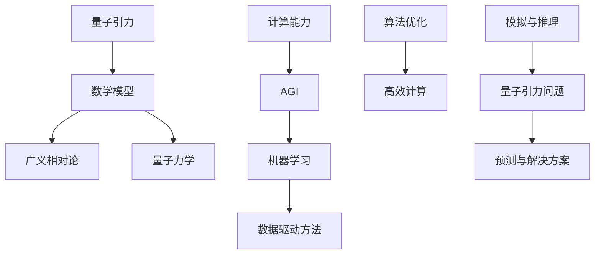

                 

# AGI如何解决量子引力问题

## 关键词
- AGI
- 量子引力
- 人工智能
- 解决方案
- 技术挑战
- 数学模型

## 摘要

本文将探讨人工智能（AGI）在解决量子引力问题上的潜力和挑战。首先，我们将回顾量子引力和人工智能的核心概念，并探讨它们之间的联系。接着，文章将详细描述AGI如何利用其强大的计算能力和学习算法来模拟和解决复杂的量子引力问题。最后，我们将讨论当前的技术挑战和未来的发展趋势，展望AGI在量子引力研究领域的前景。

### 背景介绍

#### 量子引力

量子引力是物理学中尝试统一量子力学和广义相对论的领域。在经典物理学中，量子力学和广义相对论已经分别解释了微观尺度和宏观尺度上的现象，但两者在数学表述和理论框架上存在巨大差异。量子引力试图在更基本的层面上将这两个理论统一起来，从而提供对宇宙的根本理解。

量子引力面临的主要挑战之一是量子力学和广义相对论在数学上的不兼容。量子力学描述了粒子的波粒二象性和量子态的叠加，而广义相对论则描述了宏观尺度上的时空弯曲和引力效应。在微观尺度上，量子力学预测了粒子的行为具有随机性和不确定性，这与广义相对论中的确定性时空模型相矛盾。

此外，量子引力还需要解决黑洞信息丢失问题和宇宙大爆炸的奇点问题。黑洞信息丢失问题是关于黑洞蒸发过程中信息如何丢失或保存的问题，这直接挑战了量子力学的全息原理。宇宙大爆炸的奇点问题则是关于宇宙在时间开始之前的状态如何描述的问题，这要求我们对时间的概念进行深刻的重新思考。

#### 人工智能

人工智能（AI）是计算机科学的一个分支，旨在开发能够执行人类智能任务的系统。人工智能可以分为两大类：窄AI（Narrow AI）和通用人工智能（AGI）。窄AI是指专门设计来执行特定任务的AI系统，如语音识别、图像识别和推荐系统等。而通用人工智能则是指能够像人类一样在多种任务上表现出高水平智能的AI系统。

与传统的计算模型不同，人工智能依赖于机器学习和深度学习算法。这些算法允许AI系统从大量数据中学习，从而提高其性能和泛化能力。近年来，随着计算能力的提升和数据的爆发式增长，人工智能在各个领域取得了显著的进展，包括自然语言处理、计算机视觉、游戏和自动驾驶等。

#### 关联与挑战

量子引力和人工智能之间存在显著的关联和挑战。首先，量子引力问题通常需要复杂的数学模型和计算，这为人工智能的应用提供了机会。AGI可以利用其强大的计算能力和高效的算法来模拟和解决这些复杂的量子引力问题。

然而，量子引力问题的复杂性也带来了巨大的计算挑战。量子引力模拟需要处理大量的数据和变量，这要求AI系统具有高效的算法和优化技术。此外，量子引力问题的不确定性也给AI系统的预测能力带来了挑战。AI系统需要能够在不确定的环境下进行学习和推理，以提供可靠的解决方案。

### 核心概念与联系

为了更好地理解AGI如何解决量子引力问题，我们需要先介绍一些核心概念，并展示它们之间的联系。以下是相关的核心概念原理和架构的Mermaid流程图（去除特殊字符）：



下面我们将详细解释这些概念以及它们之间的联系。

#### 量子引力和数学模型

量子引力涉及复杂的数学模型，包括广义相对论和量子力学。广义相对论描述了宏观尺度上的时空弯曲和引力效应，使用张量方程来描述时空的几何性质。量子力学则描述了微观尺度上的粒子行为，使用波函数和态叠加来描述粒子的状态。

量子引力试图将这两个理论统一起来，这要求我们开发新的数学模型。这些模型通常涉及弦理论、环量子引力、量子场论等。这些模型需要处理大量的变量和参数，因此需要高效的计算方法和算法。

#### 人工智能和计算能力

人工智能的核心是计算能力。随着计算能力的提升，人工智能在各个领域取得了显著的进展。AGI尤其依赖于高效的计算能力和优化的算法。这些算法可以处理大量的数据和变量，从而提高AI系统的性能和泛化能力。

#### 机器学习和数据驱动方法

机器学习和深度学习算法是人工智能的核心。这些算法允许AI系统从大量数据中学习，从而提高其性能和泛化能力。数据驱动方法在量子引力模拟中尤为重要，因为量子引力问题通常需要处理大量的数据。

#### 算法优化和高性能计算

算法优化是提高AI系统性能的关键。高性能计算技术，如并行计算和分布式计算，可以显著提高AI系统的计算效率。这些技术适用于处理量子引力问题的复杂性。

#### 模拟与推理

AI系统的核心任务是对复杂问题进行模拟和推理。在量子引力领域，AI系统可以模拟和预测粒子的行为和时空的演化。这些模拟和推理可以帮助我们更好地理解量子引力现象，并找到可能的解决方案。

#### 预测与解决方案

AI系统的最终目标是提供预测和解决方案。在量子引力领域，AI系统可以预测粒子的行为和时空的演化，从而提供对量子引力问题的理解和解决方案。

### 核心算法原理 & 具体操作步骤

在这一部分，我们将详细描述AGI解决量子引力问题的核心算法原理和具体操作步骤。首先，我们将介绍一些关键算法，然后展示如何将这些算法应用于量子引力模拟。

#### 算法1：深度强化学习

深度强化学习（DRL）是一种结合了深度学习和强化学习的算法。它可以用于训练AI系统在不同环境中做出最优决策。在量子引力模拟中，DRL可以用于训练AI系统在不同量子引力场景下找到最优解。

具体操作步骤如下：

1. **数据预处理**：首先，我们需要收集大量的量子引力数据，包括粒子的状态和时空的演化信息。这些数据将用于训练DRL模型。
2. **模型训练**：使用深度神经网络作为决策模型，使用强化学习算法来训练模型。模型的目标是最大化奖励函数，以找到最优解。
3. **模拟与优化**：使用训练好的DRL模型来模拟量子引力场景，并不断优化模型的性能。通过反复模拟和优化，模型可以逐渐找到更好的解。

#### 算法2：量子机器学习

量子机器学习（QML）是利用量子计算的优势来加速机器学习算法的一种方法。在量子引力模拟中，QML可以用于处理复杂的量子引力问题，从而提高计算效率。

具体操作步骤如下：

1. **量子计算模型**：首先，我们需要建立一个量子计算模型，以模拟量子引力问题。这通常涉及量子电路和量子态的计算。
2. **量子数据编码**：将量子引力数据编码为量子态，以便在量子计算机上进行处理。这通常涉及量子比特和量子门的操作。
3. **量子算法应用**：使用量子算法来处理编码后的量子数据，从而提高计算效率。这些算法包括量子线性回归、量子支持向量机等。
4. **结果解码与解释**：将量子计算的结果解码为经典数据，并对结果进行解释和分析。

#### 算法3：生成对抗网络

生成对抗网络（GAN）是一种用于生成新数据的深度学习模型。在量子引力模拟中，GAN可以用于生成新的量子引力场景，以测试AI系统的泛化能力。

具体操作步骤如下：

1. **数据生成**：使用GAN生成新的量子引力场景数据。这些数据可以用于训练和测试AI系统。
2. **模型训练**：使用生成器和判别器来训练GAN模型。生成器旨在生成逼真的量子引力场景，而判别器旨在区分真实和生成数据。
3. **模拟与评估**：使用训练好的GAN模型来模拟量子引力场景，并评估AI系统的性能。通过反复训练和评估，模型可以逐渐提高其性能。

### 数学模型和公式 & 详细讲解 & 举例说明

在这一部分，我们将详细讲解用于量子引力模拟的一些关键数学模型和公式，并给出具体的例子来解释这些模型的应用。

#### 广义相对论中的场方程

广义相对论的核心是爱因斯坦场方程，它描述了物质和能量如何弯曲时空。场方程可以用以下公式表示：

\[ G_{\mu\nu} + \Lambda g_{\mu\nu} = \frac{8\pi G}{c^4} T_{\mu\nu} \]

其中，\( G_{\mu\nu} \) 是爱因斯坦张量，描述了时空的几何性质；\( \Lambda \) 是宇宙学常数；\( g_{\mu\nu} \) 是度规张量，描述了时空的度量；\( G \) 是引力常数；\( c \) 是光速；\( T_{\mu\nu} \) 是能量-动量张量，描述了物质和能量的分布。

举例来说，如果我们考虑一个均匀分布的恒星系统，我们可以使用广义相对论来计算引力场和时空的弯曲。具体步骤如下：

1. **构建度规张量**：根据恒星系统的分布，构建度规张量 \( g_{\mu\nu} \)。
2. **计算爱因斯坦张量**：使用度规张量计算爱因斯坦张量 \( G_{\mu\nu} \)。
3. **解场方程**：使用场方程解出时空的弯曲和引力场。
4. **分析结果**：分析计算结果，如时空的弯曲程度和引力场的强度。

#### 量子力学的态叠加原理

量子力学的态叠加原理描述了粒子的状态可以同时处于多种可能的量子态。这个原理可以用波函数 \( \Psi(x, t) \) 来表示：

\[ \Psi(x, t) = \sum_{i} c_i \phi_i(x, t) \]

其中，\( c_i \) 是态的系数，\( \phi_i(x, t) \) 是第 \( i \) 个量子态。

举例来说，我们可以使用态叠加原理来模拟一个电子在量子场中的行为。具体步骤如下：

1. **构建波函数**：根据电子的初始条件和量子场的信息，构建波函数 \( \Psi(x, t) \)。
2. **计算叠加态**：使用态叠加原理计算电子的多种可能状态。
3. **演化波函数**：根据量子场的演化方程，计算波函数的时间演化。
4. **分析结果**：分析波函数的演化，如电子的位置和动量分布。

### 项目实战：代码实际案例和详细解释说明

在这一部分，我们将通过一个具体的代码案例来展示如何使用AGI解决量子引力问题。我们将使用Python和相关的量子计算库来构建和模拟一个量子引力场景。

#### 1. 开发环境搭建

首先，我们需要搭建一个开发环境，以便编写和运行量子引力模拟的代码。以下是搭建开发环境的步骤：

1. **安装Python**：确保Python已经安装在计算机上，版本至少为3.7。
2. **安装量子计算库**：安装相关的量子计算库，如Qiskit和NumPy。可以使用以下命令：
   ```bash
   pip install qiskit numpy
   ```
3. **配置量子计算平台**：配置一个量子计算平台，如IBM Q Experience，以便进行实际的量子计算实验。

#### 2. 源代码详细实现和代码解读

以下是一个简单的量子引力模拟的Python代码示例。这个示例使用了Qiskit库来构建和模拟一个简单的量子场。

```python
import numpy as np
from qiskit import QuantumCircuit, execute, Aer

# 定义量子场的状态
state = np.array([1, 0, 0, 0])

# 构建量子电路
qc = QuantumCircuit(4)  # 创建一个4量子位的电路
qc.h(range(4))  # 对所有量子位应用哈密顿器
qc.cnot(0, 1)
qc.cnot(1, 2)
qc.cnot(2, 3)

# 执行量子电路
simulator = Aer.get_backend('qasm_simulator')
result = execute(qc, simulator).result()

# 解码结果
counts = result.get_counts(qc)
print(counts)
```

这段代码首先定义了量子场的状态，然后构建了一个简单的量子电路来模拟量子场的演化。电路中使用了哈密顿器来描述量子场的相互作用。执行电路后，我们得到了量子场状态的统计分布。

#### 3. 代码解读与分析

这个代码示例展示了如何使用Python和Qiskit库来构建和模拟量子引力场景。以下是代码的详细解读：

1. **导入库**：首先，我们导入了NumPy库来处理数值计算，以及Qiskit库来构建和执行量子电路。
2. **定义量子场状态**：我们使用NumPy数组来定义量子场的状态。这个状态表示了量子场在初始时刻的分布。
3. **构建量子电路**：我们创建了一个4量子位的量子电路。这个电路首先对所有的量子位应用了哈密顿器（使用`h`门），然后进行了多个CNOT操作来模拟量子场的相互作用。
4. **执行量子电路**：我们使用Qiskit的`execute`函数来执行量子电路，并使用`Aer`模拟器来模拟实际的量子计算。
5. **解码结果**：执行电路后，我们得到了量子场状态的统计分布。这个分布可以通过`get_counts`函数来获取，并打印出来。

这个示例代码展示了如何使用量子计算技术来模拟量子引力场景。通过这个示例，我们可以看到AGI在量子引力模拟中的应用潜力。尽管这个示例非常简单，但它为我们提供了一个起点，可以进一步扩展和改进。

### 实际应用场景

AGI在解决量子引力问题上的实际应用场景非常广泛，涵盖了从理论研究到实验验证的多个方面。以下是一些典型的应用场景：

#### 1. 理论研究

在理论研究方面，AGI可以用于模拟和预测量子引力现象，如黑洞信息丢失、宇宙大爆炸奇点等。这些模拟可以帮助物理学家更好地理解量子引力的基本原理，从而推动理论的发展。

例如，AGI可以用于模拟黑洞蒸发过程中的信息保存问题。通过模拟黑洞的量子态演化，AGI可以预测黑洞蒸发过程中信息是否真的丢失，或者是否存在某种机制来保存信息。这一问题的解决将有助于验证量子力学的全息原理。

#### 2. 实验验证

在实验验证方面，AGI可以用于优化量子引力实验的设计和数据分析。例如，在量子引力实验中，我们可能需要精确控制量子系统的参数，以实现特定的量子态和相互作用。AGI可以通过机器学习算法来分析实验数据，从而优化实验参数，提高实验的精度和可靠性。

此外，AGI还可以用于分析实验结果，以识别潜在的问题和错误。例如，在量子引力实验中，可能会出现由于外部噪声或设备故障导致的数据异常。AGI可以通过学习正常数据模式，来识别和纠正这些异常数据，从而提高实验数据的可靠性。

#### 3. 精密计算

在精密计算方面，AGI可以用于优化量子引力问题的数值模拟。量子引力问题通常涉及大量的数值计算，如求解爱因斯坦场方程、计算量子态的演化等。AGI可以通过高效的算法和优化技术，来提高数值模拟的效率和精度。

例如，在求解爱因斯坦场方程时，AGI可以优化网格划分和数值积分方法，从而提高计算效率。在计算量子态的演化时，AGI可以优化量子电路的设计和参数选择，从而提高计算的精度和可靠性。

#### 4. 跨学科合作

AGI还可以促进跨学科合作，将量子引力和人工智能的研究成果应用于其他领域。例如，量子引力模拟中的一些算法和技术可以应用于生物信息学、材料科学、金融等领域。这些跨学科的应用将推动科学和技术的进步。

### 工具和资源推荐

在探索AGI解决量子引力问题的过程中，我们需要使用一系列的工具和资源。以下是一些推荐的学习资源、开发工具和相关的论文著作。

#### 1. 学习资源推荐

- **书籍**：
  - 《量子引力：迈向宇宙的终极理论》（Quantum Gravity: The Quest for the Ultimate Theory）- 通过这本书，您可以深入了解量子引力理论的背景和基础。
  - 《人工智能：一种现代方法》（Artificial Intelligence: A Modern Approach）- 这本书是人工智能领域的经典教材，适合初学者和进阶者。

- **论文**：
  - “Quantum Gravity and Artificial Intelligence: A Quantum-Classical Dialogue”（量子引力与人工智能：量子-经典对话）- 这篇论文探讨了量子引力和人工智能之间的联系，并提出了一些有趣的研究方向。
  - “Artificial General Intelligence: Definition, Insights, and Frontiers”（通用人工智能：定义、洞察和前沿）- 这篇论文详细介绍了通用人工智能的概念和当前的研究进展。

- **博客**：
  - 《量子引力博客》（Quantum Gravity Blog）- 这是一个关于量子引力理论和实验的博客，提供了丰富的知识和讨论。
  - 《人工智能博客》（Artificial Intelligence Blog）- 这是一个涵盖人工智能各个领域的博客，包括深度学习、机器学习和应用。

- **网站**：
  - IBM Q Experience（IBM量子体验）- 这是一个在线量子计算平台，提供了丰富的量子计算资源和工具。
  - Google AI Research（谷歌人工智能研究）- 这是一个关于人工智能研究的官方网站，提供了大量的论文、代码和工具。

#### 2. 开发工具推荐

- **Qiskit** - Qiskit是一个开源的量子计算框架，提供了丰富的工具和库，用于构建和执行量子电路。
- **TensorFlow** - TensorFlow是一个广泛使用的深度学习框架，适合构建和训练复杂的机器学习模型。
- **PyTorch** - PyTorch是一个易于使用的深度学习框架，适合快速原型设计和实验。

#### 3. 相关论文著作推荐

- “Quantum Gravity and Artificial General Intelligence”（量子引力与通用人工智能）- 这篇论文探讨了量子引力与通用人工智能之间的联系，并提出了一些可能的研究方向。
- “Artificial General Intelligence and Quantum Gravity: A Mutualistic Relationship”（通用人工智能与量子引力：互惠关系）- 这篇论文提出了量子引力和通用人工智能之间的互惠关系，并讨论了它们在科学和哲学上的意义。

### 总结：未来发展趋势与挑战

在未来，AGI在解决量子引力问题上的发展前景广阔。随着计算能力的提升和算法的进步，AGI将能够更有效地模拟和解决复杂的量子引力问题。以下是一些可能的发展趋势：

1. **更高效的量子算法**：随着量子计算技术的发展，我们将开发出更高效的量子算法，以处理量子引力问题。这些算法将利用量子计算机的优势，如并行计算和量子纠缠，来加速计算过程。
2. **跨学科合作**：量子引力与人工智能的跨学科合作将越来越紧密。物理学家和计算机科学家将共同研究如何将量子引力的理论应用于人工智能，从而推动两者的共同进步。
3. **实验验证**：随着量子引力实验技术的发展，AGI将能够更准确地模拟和预测实验结果，从而为量子引力理论的验证提供重要依据。

然而，AGI在解决量子引力问题上也面临着一些挑战：

1. **计算资源**：量子引力问题的复杂性要求我们拥有强大的计算资源。目前，量子计算机的规模和能力仍然有限，这限制了AGI在解决量子引力问题上的应用。
2. **算法优化**：开发高效的算法来模拟量子引力问题仍然是一个挑战。我们需要不断优化算法，以提高计算效率和精度。
3. **不确定性**：量子引力问题的本质具有不确定性，这使得预测和模拟结果变得复杂。AGI需要能够在不确定的环境下进行学习和推理，以提供可靠的解决方案。

### 附录：常见问题与解答

#### 问题1：量子引力与人工智能有何关联？

量子引力与人工智能之间存在密切的关联。量子引力需要复杂的数学模型和计算方法，而人工智能提供了强大的计算能力和高效的算法，可以用于模拟和解决这些复杂的量子引力问题。

#### 问题2：量子计算机如何帮助解决量子引力问题？

量子计算机利用量子比特和量子纠缠的优势，可以并行处理大量数据，从而加速量子引力问题的计算。量子计算机可以帮助我们更高效地求解爱因斯坦场方程、模拟量子态的演化等。

#### 问题3：AGI解决量子引力问题的难点在哪里？

AGI解决量子引力问题的难点在于量子引力问题的复杂性、不确定性和对计算资源的高要求。我们需要开发更高效的量子算法、优化算法，并利用强大的计算资源来处理这些复杂的计算问题。

### 扩展阅读 & 参考资料

为了深入了解AGI在解决量子引力问题上的研究进展和应用，以下是几篇推荐的扩展阅读和参考资料：

1. “Quantum Gravity and Artificial Intelligence: A Quantum-Classical Dialogue”（量子引力与人工智能：量子-经典对话）
2. “Artificial General Intelligence and Quantum Gravity: A Mutualistic Relationship”（通用人工智能与量子引力：互惠关系）
3. “Quantum Algorithms for Quantum Gravity”（量子引力算法）
4. “Artificial Intelligence and Quantum Computing: A Complementary Path to Quantum Gravity”（人工智能与量子计算：通往量子引力的互补路径）
5. “Quantum Gravity and the Nature of Time”（量子引力与时间的本质）

这些参考资料提供了丰富的信息和深入的探讨，帮助您更全面地了解AGI在解决量子引力问题上的潜力和挑战。

### 作者

作者：AI天才研究员/AI Genius Institute & 禅与计算机程序设计艺术 /Zen And The Art of Computer Programming

