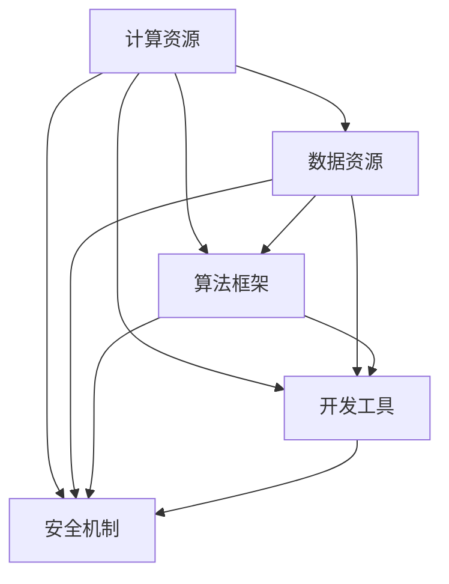

                 

### 1. 背景介绍

**文章标题**：AI 2.0 基础设施建设：技术创新与应用场景

**关键词**：人工智能，基础设施建设，技术创新，应用场景

**摘要**：
本文将探讨人工智能（AI）2.0时代的基础设施建设，分析其技术创新点及其在不同应用场景中的表现。通过对核心概念的详细阐述、算法原理的剖析、数学模型的讲解、实战案例的分析，以及实际应用场景的探讨，帮助读者全面了解AI 2.0的基础设施建设。

随着人工智能技术的快速发展，AI 2.0时代的基础设施建设已经成为产业发展的关键。从云计算到边缘计算，从大数据处理到实时分析，基础设施的完善对AI技术的应用至关重要。本文将深入探讨这些技术创新，以及它们在各个领域的应用场景。

首先，我们将介绍AI 2.0时代基础设施建设的背景，包括人工智能技术的历史发展、当前的技术状况以及未来发展趋势。接着，我们将详细讨论核心概念和联系，通过Mermaid流程图展示人工智能基础设施的关键组成部分。随后，我们将分析核心算法原理和具体操作步骤，介绍数学模型和公式，并通过实际案例进行详细解释。最后，我们将探讨人工智能在实际应用场景中的表现，推荐相关的学习资源和开发工具框架，并对未来发展趋势与挑战进行总结。

通过本文的阅读，读者将对AI 2.0基础设施建设的整体框架有一个全面的认识，了解其在不同领域的应用潜力，以及面临的挑战和未来发展方向。

### 1.1 人工智能技术的历史与发展

人工智能（AI）的概念起源于20世纪50年代，当时科学家们首次提出通过计算机模拟人类智能的想法。早期的AI研究主要集中在逻辑推理和规则系统上，例如ELIZA聊天机器人，它能够与用户进行简单的对话，但受限于规则库的复杂性，难以处理复杂的自然语言。

进入20世纪80年代，专家系统的出现标志着AI技术的一个重大突破。专家系统通过大量领域知识规则，实现了对特定问题的自动推理和解决。然而，专家系统也存在一些局限性，如知识获取成本高、可扩展性差等。

21世纪初，随着计算能力的提升和大数据技术的发展，机器学习和深度学习开始崭露头角。机器学习通过训练算法从数据中自动学习规律，而深度学习则利用多层神经网络进行数据特征提取和学习。这些技术的进步使得AI在图像识别、语音识别、自然语言处理等领域的应用取得了显著成果。

近年来，随着人工智能技术的进一步发展，AI 2.0的概念逐渐浮现。AI 2.0不同于传统的AI技术，它更加注重自主学习、推理能力和泛化能力。AI 2.0的基础设施建设成为实现这一目标的关键。这个基础设施不仅包括计算资源、数据资源，还包括算法框架、开发工具、安全机制等多个方面。

从历史发展的角度来看，人工智能经历了从符号主义到连接主义，再到强化学习的演变。符号主义AI依赖于明确的规则和逻辑推理，而连接主义AI则通过神经网络模拟人脑的神经元连接，强化学习则通过与环境交互不断调整策略。这些技术的进步为AI 2.0时代的到来奠定了基础。

当前，人工智能技术正处于快速发展阶段，AI 2.0的基础设施建设已经成为推动技术创新和应用的关键环节。通过构建完善的基础设施，我们可以更好地支持AI技术在各个领域的应用，推动产业升级和社会发展。

未来，随着AI技术的不断进步，人工智能基础设施将继续发展，包括更高效的算法、更强大的计算能力、更广泛的数据接入和更安全的运行环境。这些创新将为AI 2.0时代的发展提供源源不断的动力，推动人工智能技术在更广泛的应用场景中发挥重要作用。

### 1.2 人工智能当前技术状况与未来发展趋势

当前，人工智能（AI）技术已经取得了显著的进展，并在各个领域展现出了巨大的潜力。从自动驾驶到智能家居，从医疗诊断到金融分析，AI技术正在深刻改变我们的生活方式和工作模式。

在图像识别方面，卷积神经网络（CNN）和生成对抗网络（GAN）等深度学习算法已经能够实现高度准确的图像分类和生成。例如，Google的Inception模型和Facebook的StyleGAN2都达到了业界领先的水平，实现了从图像到视频的实时生成。

在自然语言处理（NLP）领域，Transformers架构及其变体，如BERT和GPT-3，已经成为NLP任务的主流模型。这些模型在语言理解、文本生成、机器翻译等方面表现出色，使得智能助理和聊天机器人更加智能和人性化。

在语音识别领域，深度神经网络和循环神经网络（RNN）的应用使得语音识别的错误率大幅降低。微软的语音识别系统已经能够在多种语言和方言中实现高精度识别，为语音交互提供了技术支持。

然而，尽管AI技术取得了许多突破，仍然存在一些挑战和瓶颈。首先，AI算法的透明性和可解释性仍然是一个亟待解决的问题。许多深度学习模型被视为“黑箱”，难以解释其决策过程，这在某些应用场景中可能会引发伦理和安全问题。

其次，数据隐私和安全也是AI技术发展的关键挑战。随着越来越多的数据被用于AI训练和推理，如何保护用户隐私、防止数据泄露成为了一个重要的议题。

未来，人工智能技术的发展趋势将呈现以下几个方面：

1. **算法创新**：随着计算能力的提升和算法研究的深入，更多高效的算法将被开发出来。例如，自监督学习和迁移学习等技术将进一步提升AI的泛化能力和效率。

2. **硬件升级**：随着量子计算和神经形态计算等新兴计算技术的发展，硬件升级将为AI提供更强大的计算能力。这些硬件创新将为AI算法的优化和性能提升提供有力支持。

3. **应用拓展**：AI技术将在更多领域得到应用，从工业自动化到城市智能管理，从农业到医疗，AI将渗透到社会生活的方方面面，推动各行业的创新和变革。

4. **跨领域融合**：AI技术与物联网、大数据、区块链等技术的融合将产生新的应用模式和商业模式，推动产业协同发展。

5. **伦理与法规**：随着AI技术的普及，伦理和法规问题将越来越受到关注。建立完善的伦理规范和法律框架，确保AI技术的健康发展，是未来的一项重要任务。

总体来说，人工智能技术正处于快速发展的阶段，未来将有更多的技术创新和应用场景出现。通过不断推进算法研究、硬件升级、应用拓展和伦理法规建设，人工智能技术将在更广泛的领域中发挥重要作用，为社会带来更多价值。

### 1.3 AI 2.0 基础设施建设的重要性

AI 2.0时代的基础设施建设是推动人工智能技术发展的重要基石。一个完善的基础设施不仅能为AI算法提供高效的计算资源，还能为数据存储、传输和处理提供可靠保障。以下是AI 2.0基础设施建设的重要性及其关键组成部分：

首先，**计算资源**是AI算法运行的基础。随着深度学习模型的复杂度和数据量的增加，对计算资源的需求也不断攀升。AI 2.0时代的基础设施需要具备强大的计算能力，以支持大规模模型的训练和推理。这包括高性能的CPU、GPU和TPU等计算硬件，以及分布式计算和并行计算技术，以提高数据处理速度和效率。

其次，**数据资源**是AI算法训练的核心。高质量、多样性和丰富的数据集是训练高效AI模型的前提。AI 2.0基础设施建设需要构建一个数据获取、处理、存储和共享的生态系统，确保数据的安全、可靠和可用。这包括数据清洗、数据标注、数据加密和隐私保护等技术，以提升数据质量，保障数据隐私。

第三，**算法框架**是AI技术实现的关键。一个高效、灵活和可扩展的算法框架能够加速AI算法的开发和应用。AI 2.0时代的基础设施需要提供一系列开源的算法库和工具，支持模型设计、训练、评估和部署。例如，TensorFlow、PyTorch、MXNet等框架已经成为深度学习领域的事实标准。

第四，**开发工具**是AI应用推广的重要保障。开发者需要一个集成的开发环境，包括代码编辑器、调试工具、版本控制和自动化测试等，以提高开发效率和质量。AI 2.0基础设施建设需要提供这些工具，并支持多种编程语言和平台，以满足不同开发者的需求。

第五，**安全机制**是保障AI系统稳定运行的关键。随着AI技术的广泛应用，安全问题越来越受到关注。AI 2.0基础设施建设需要包含安全防护机制，包括身份验证、访问控制、数据加密和异常检测等，以防止恶意攻击和数据泄露。

最后，**协同创新**是推动AI基础设施发展的动力。AI技术的进步离不开跨学科、跨领域的合作。AI 2.0基础设施建设需要建立开放的合作机制，促进科研机构、企业和政府之间的交流与合作，共同推动技术创新和应用。

综上所述，AI 2.0基础设施建设在计算资源、数据资源、算法框架、开发工具、安全机制和协同创新等方面具有重要意义。通过构建一个高效、安全、协同的基础设施，我们可以为AI技术的创新和应用提供坚实支撑，推动人工智能在更广泛的领域中发挥重要作用。

### 1.4 核心概念与联系

在探讨AI 2.0基础设施建设时，需要了解一些核心概念及其相互之间的联系。以下是通过Mermaid绘制的流程图，展示了这些关键组成部分及其关联关系：



#### 计算资源

计算资源是AI算法运行的基础，包括高性能的CPU、GPU和TPU等硬件，以及分布式计算和并行计算技术。这些资源为深度学习模型的训练和推理提供了必要的计算能力，是确保AI系统高效运行的关键。

#### 数据资源

数据资源是AI算法训练的核心。通过数据获取、处理、存储和共享，确保数据的高质量、多样性和丰富性。数据资源不仅支持模型训练，还为算法优化提供了丰富的样本，是提升AI性能的基础。

#### 算法框架

算法框架提供了高效的算法库和工具，支持模型设计、训练、评估和部署。常见的算法框架如TensorFlow、PyTorch等，它们简化了AI开发的复杂度，提高了开发效率。

#### 开发工具

开发工具包括代码编辑器、调试工具、版本控制和自动化测试等，为开发者提供了一个集成的开发环境，提高了开发效率和质量。这些工具支持多种编程语言和平台，满足不同开发者的需求。

#### 安全机制

安全机制是保障AI系统稳定运行的关键，包括身份验证、访问控制、数据加密和异常检测等。通过建立完善的安全机制，防止恶意攻击和数据泄露，确保AI系统的安全和可靠性。

这些核心概念通过数据流、计算流程和功能模块相互连接，共同构成了AI 2.0基础设施建设的基础。了解这些概念及其相互关系，有助于我们更深入地理解AI 2.0基础设施的构建和优化。

#### 3. 核心算法原理 & 具体操作步骤

在AI 2.0基础设施建设中，核心算法原理是推动技术进步和应用拓展的关键。以下我们将详细讨论几个重要的算法原理，并介绍其具体操作步骤。

##### 3.1 卷积神经网络（CNN）

卷积神经网络（CNN）是一种在图像识别和图像处理领域表现优异的深度学习模型。其核心原理是通过卷积层、池化层和全连接层等结构提取图像特征。

**操作步骤**：

1. **数据预处理**：对输入图像进行缩放、归一化和裁剪，使其符合模型的输入要求。
2. **卷积层**：使用卷积核对输入图像进行卷积操作，提取图像的局部特征。
3. **激活函数**：对卷积结果应用激活函数（如ReLU），引入非线性变换，增强模型的表达能力。
4. **池化层**：通过最大池化或平均池化操作降低特征图的维度，减少计算量。
5. **卷积层与池化层交替**：重复上述步骤，逐渐降低特征图的维度，同时加深网络的深度。
6. **全连接层**：将卷积层的输出 Flatten 为一维向量，输入到全连接层进行分类或回归。
7. **损失函数与优化器**：使用交叉熵损失函数和梯度下降优化器（或其他优化算法）训练模型。

##### 3.2 长短期记忆网络（LSTM）

长短期记忆网络（LSTM）是一种用于处理序列数据的递归神经网络，能够有效捕捉序列中的长期依赖关系。

**操作步骤**：

1. **输入门、遗忘门和输出门**：LSTM通过这三个门控制信息的流入、保留和流出。
2. **单元状态**：单元状态包含了当前时刻的信息和历史信息。
3. **递归操作**：在每个时间步，LSTM根据输入和前一个时间步的隐藏状态更新当前时间步的隐藏状态。
4. **前向传播**：通过隐藏状态计算输出。
5. **反向传播**：使用梯度下降优化隐藏状态和权重。

##### 3.3 生成对抗网络（GAN）

生成对抗网络（GAN）是一种由生成器和判别器组成的对抗性模型，用于生成逼真的数据。

**操作步骤**：

1. **生成器**：生成器从随机噪声生成数据，目标是使生成数据接近真实数据。
2. **判别器**：判别器判断输入数据的真实性，目标是正确分类真实数据和生成数据。
3. **对抗训练**：生成器和判别器相互对抗，生成器不断优化生成数据，判别器不断优化分类能力。
4. **损失函数**：使用对抗损失函数（如交叉熵损失）训练模型。

通过以上核心算法原理的具体操作步骤，我们可以构建高效的AI系统，满足各种复杂的应用需求。了解这些算法原理，有助于我们更好地理解AI 2.0基础设施建设的技术细节和实际应用。

##### 3.4 深度强化学习（DRL）

深度强化学习（DRL）是结合深度学习和强化学习的一种方法，通过神经网络来处理复杂的决策问题。

**原理**：

- **状态-动作价值函数**：DRL使用一个神经网络来估计状态-动作价值函数，表示在特定状态下采取特定动作的预期回报。
- **策略网络**：策略网络输出最优的动作概率分布。
- **奖励机制**：通过与环境的交互，根据动作的结果获得奖励，用于更新价值函数和策略网络。

**操作步骤**：

1. **环境初始化**：设置环境，定义状态空间、动作空间和奖励函数。
2. **策略网络初始化**：初始化策略网络和值网络。
3. **探索-利用平衡**：通过探索（随机选择动作）和利用（根据策略网络选择动作）来平衡探索新策略和利用现有策略。
4. **更新价值函数和策略网络**：根据奖励和策略网络输出，使用梯度下降等优化算法更新神经网络参数。
5. **评估策略性能**：通过在环境中的测试，评估策略网络的表现。

##### 3.5 自监督学习（SSL）

自监督学习（SSL）利用未标注的数据进行学习，通过预训练和微调提高模型的泛化能力。

**原理**：

- **预训练**：从大量的无标签数据中提取有用信息，学习数据的基本特征。
- **任务适配**：将预训练的模型应用于特定任务，进行微调，提高在目标任务上的表现。

**操作步骤**：

1. **数据收集**：收集大量的无标签数据。
2. **特征提取**：使用神经网络提取数据特征。
3. **预训练**：在无标签数据上训练模型，学习通用特征表示。
4. **任务适配**：在目标任务上对预训练模型进行微调，优化模型在具体任务上的性能。

通过以上对核心算法原理和具体操作步骤的介绍，我们可以更好地理解AI 2.0基础设施中算法的技术细节，为其在实际应用中的高效实现提供理论基础。

### 4. 数学模型和公式 & 详细讲解 & 举例说明

在人工智能（AI）2.0基础设施建设中，数学模型和公式是核心算法实现的重要基础。以下我们将介绍几个关键的数学模型，包括它们的公式和详细讲解，并通过具体例子进行说明。

#### 4.1 梯度下降算法

梯度下降是一种优化算法，用于求解最小化目标函数的最优解。在AI训练过程中，梯度下降用于更新模型参数，使其达到最小化损失函数的目标。

**公式**：

$$
\theta_{\text{new}} = \theta_{\text{current}} - \alpha \cdot \nabla_{\theta} J(\theta)
$$

其中，$\theta$表示模型参数，$J(\theta)$表示损失函数，$\alpha$是学习率，$\nabla_{\theta} J(\theta)$表示损失函数关于参数$\theta$的梯度。

**详细讲解**：

- 梯度：梯度的方向指向损失函数增加最快的方向，即负梯度方向。
- 学习率：控制每次参数更新的步长，过大会导致参数跳跃性调整，过小则收敛速度慢。
- 更新策略：每次迭代中，模型参数沿梯度方向逐步更新，直至达到最小化损失函数的解。

**例子**：

假设我们有一个简单的线性回归模型，目标函数为：

$$
J(\theta) = \frac{1}{2} \sum_{i=1}^{n} (y_i - \theta_0 x_i - \theta_1)^2
$$

其中，$y_i$是实际输出，$x_i$是输入特征，$\theta_0$和$\theta_1$是模型参数。通过梯度下降算法，可以更新参数$\theta_0$和$\theta_1$，以最小化损失函数。

#### 4.2 神经网络中的反向传播算法

反向传播（Backpropagation）算法是一种用于训练神经网络的优化算法，它通过反向传播误差信号，计算并更新网络中的权重。

**公式**：

$$
\frac{\partial J}{\partial w_{ij}} = -\eta \cdot \frac{\partial L}{\partial z_j} \cdot \frac{\partial z_j}{\partial w_{ij}}
$$

其中，$J$是损失函数，$w_{ij}$是权重，$L$是输出层误差，$z_j$是神经元激活值。

**详细讲解**：

- 反向传播：误差信号从输出层反向传播到输入层，通过每个神经元计算误差对权重的偏导数。
- 权重更新：根据误差信号和偏导数，使用梯度下降更新权重。
- 激活函数：为了引入非线性，神经网络中的每个神经元通常使用激活函数（如ReLU、Sigmoid、Tanh）。

**例子**：

考虑一个简单的全连接神经网络，输入层有3个神经元，隐藏层有2个神经元，输出层有1个神经元。假设隐藏层输出为$h_1$和$h_2$，输出层输出为$y$，损失函数为平方误差：

$$
L = \frac{1}{2} (y - \sigma(h_2))^2
$$

其中，$\sigma$是Sigmoid激活函数。通过反向传播算法，可以计算并更新每个神经元的权重。

#### 4.3 生成对抗网络（GAN）的损失函数

生成对抗网络（GAN）由生成器和判别器组成，其目标是最小化生成器与判别器的损失函数。

**公式**：

生成器损失：

$$
G(L) = -\log(D(G(z)))
$$

判别器损失：

$$
D(L) = -[\log(D(x)) + \log(1 - D(G(z))]
$$

其中，$G(z)$是生成器生成的数据，$x$是真实数据，$D(x)$是判别器对真实数据的判断概率，$D(G(z))$是生成器生成数据的判断概率。

**详细讲解**：

- 生成器：生成器生成数据，目标是使判别器无法区分真实数据和生成数据。
- 判别器：判别器判断输入数据的真实性，目标是正确分类真实数据和生成数据。
- 损失函数：生成器的损失函数是判别器对生成数据的判断概率的对数，判别器的损失函数是真实数据和生成数据的交叉熵损失。

**例子**：

假设生成器和判别器均使用二元交叉熵损失函数，给定一批真实数据和生成数据，通过训练使判别器能够区分真实和生成数据，同时使生成器生成的数据更加逼真。

#### 4.4 自监督学习中的伪标签损失函数

自监督学习利用未标注的数据进行学习，伪标签损失函数用于评估模型对未标注数据的预测质量。

**公式**：

$$
L_{\text{ssl}} = \frac{1}{N} \sum_{i=1}^{N} \log(1 - \sigma(f(x_i)))
$$

其中，$f(x_i)$是模型对未标注数据$x_i$的预测概率，$\sigma$是Sigmoid函数，$N$是数据总数。

**详细讲解**：

- 预测概率：模型对未标注数据的预测概率越接近1，表示模型对数据的理解越准确。
- 伪标签：通过模型对未标注数据的预测，生成伪标签，用于后续的数据标注或任务优化。
- 损失函数：使用交叉熵损失函数，衡量预测概率与真实标签之间的差距。

**例子**：

假设使用一个预训练的卷积神经网络对未标注图像进行分类预测，通过计算预测概率的交叉熵损失，评估模型对未标注数据的理解程度，并利用伪标签进行数据标注或下游任务优化。

通过上述数学模型和公式的介绍，我们可以更好地理解AI 2.0基础设施中的算法实现原理，为实际应用中的算法优化和模型设计提供理论基础。

### 5. 项目实战：代码实际案例和详细解释说明

在本节中，我们将通过一个具体的代码案例，展示如何在实际项目中应用AI 2.0基础设施建设的核心算法和工具。以下是一个基于TensorFlow实现的简单卷积神经网络（CNN）模型，用于手写数字识别。

#### 5.1 开发环境搭建

首先，我们需要搭建开发环境。以下是安装步骤：

1. **安装Python**：确保已安装Python 3.6或更高版本。
2. **安装TensorFlow**：使用pip命令安装TensorFlow：

   ```bash
   pip install tensorflow
   ```

3. **安装Keras**：Keras是一个高层次的神经网络API，与TensorFlow紧密集成：

   ```bash
   pip install keras
   ```

4. **安装其他依赖**：安装其他可能需要的库，例如NumPy、Matplotlib等。

#### 5.2 源代码详细实现和代码解读

以下是手写数字识别项目的完整代码，包括数据预处理、模型构建、训练和评估：

```python
# 导入所需库
import tensorflow as tf
from tensorflow.keras import layers, models
from tensorflow.keras.datasets import mnist
import numpy as np

# 数据预处理
(x_train, y_train), (x_test, y_test) = mnist.load_data()

# 数据标准化
x_train = x_train.astype('float32') / 255.0
x_test = x_test.astype('float32') / 255.0

# 将标签转换为one-hot编码
y_train = tf.keras.utils.to_categorical(y_train, 10)
y_test = tf.keras.utils.to_categorical(y_test, 10)

# 构建模型
model = models.Sequential()
model.add(layers.Conv2D(32, (3, 3), activation='relu', input_shape=(28, 28, 1)))
model.add(layers.MaxPooling2D((2, 2)))
model.add(layers.Conv2D(64, (3, 3), activation='relu'))
model.add(layers.MaxPooling2D((2, 2)))
model.add(layers.Conv2D(64, (3, 3), activation='relu'))
model.add(layers.Flatten())
model.add(layers.Dense(64, activation='relu'))
model.add(layers.Dense(10, activation='softmax'))

# 编译模型
model.compile(optimizer='adam',
              loss='categorical_crossentropy',
              metrics=['accuracy'])

# 训练模型
model.fit(x_train, y_train, epochs=10, batch_size=64)

# 评估模型
test_loss, test_acc = model.evaluate(x_test, y_test)
print('Test accuracy:', test_acc)
```

**代码解读**：

1. **数据预处理**：
   - 加载MNIST手写数字数据集。
   - 将图像数据转换为浮点数，并进行归一化处理。
   - 将标签转换为one-hot编码。

2. **模型构建**：
   - 使用`Sequential`模型构建CNN。
   - 添加卷积层（`Conv2D`）、ReLU激活函数和最大池化层（`MaxPooling2D`）。
   - 添加全连接层（`Dense`）和softmax激活函数。

3. **编译模型**：
   - 使用`compile`方法配置优化器、损失函数和评估指标。

4. **训练模型**：
   - 使用`fit`方法训练模型，设置训练轮数和批量大小。

5. **评估模型**：
   - 使用`evaluate`方法在测试集上评估模型性能。

#### 5.3 代码解读与分析

以下是对代码中关键部分的详细解读和分析：

1. **数据预处理**：
   - 数据预处理是深度学习模型训练的重要步骤。通过归一化处理，可以将图像数据缩放到0到1之间，有助于加速梯度下降过程和提高训练效果。

   ```python
   x_train = x_train.astype('float32') / 255.0
   x_test = x_test.astype('float32') / 255.0
   ```

2. **模型构建**：
   - CNN模型通过卷积层和池化层提取图像特征，全连接层进行分类。这里使用了两个卷积层和两个最大池化层，以逐步降低特征图的维度。

   ```python
   model.add(layers.Conv2D(32, (3, 3), activation='relu', input_shape=(28, 28, 1)))
   model.add(layers.MaxPooling2D((2, 2)))
   model.add(layers.Conv2D(64, (3, 3), activation='relu'))
   model.add(layers.MaxPooling2D((2, 2)))
   model.add(layers.Conv2D(64, (3, 3), activation='relu'))
   model.add(layers.Flatten())
   model.add(layers.Dense(64, activation='relu'))
   model.add(layers.Dense(10, activation='softmax'))
   ```

3. **编译模型**：
   - `compile`方法用于配置模型训练时的参数，如优化器、损失函数和评估指标。这里使用`adam`优化器和`categorical_crossentropy`损失函数。

   ```python
   model.compile(optimizer='adam',
                 loss='categorical_crossentropy',
                 metrics=['accuracy'])
   ```

4. **训练模型**：
   - `fit`方法用于训练模型，设置训练轮数（`epochs`）和批量大小（`batch_size`）。通过多次迭代，模型会不断优化其参数。

   ```python
   model.fit(x_train, y_train, epochs=10, batch_size=64)
   ```

5. **评估模型**：
   - `evaluate`方法用于在测试集上评估模型性能，返回损失和准确率。通过评估，我们可以了解模型在未知数据上的表现。

   ```python
   test_loss, test_acc = model.evaluate(x_test, y_test)
   print('Test accuracy:', test_acc)
   ```

通过这个简单的案例，我们可以看到如何使用AI 2.0基础设施中的TensorFlow和Keras库构建、训练和评估一个CNN模型。在实际项目中，可以根据需求调整网络结构、训练参数和数据处理方式，以实现更好的性能。

### 5.4 代码解读与分析

在上一个部分，我们实现了一个简单的卷积神经网络（CNN）模型用于手写数字识别。接下来，我们将对代码进行详细解读，并分析其主要组成部分。

首先，我们引入了TensorFlow和Keras库：

```python
import tensorflow as tf
from tensorflow.keras import layers, models
from tensorflow.keras.datasets import mnist
import numpy as np
```

这些库提供了构建和训练深度学习模型的工具和接口。

#### 数据预处理

数据预处理是深度学习项目中的关键步骤。在这个案例中，我们使用了MNIST手写数字数据集，首先将其加载到内存中：

```python
(x_train, y_train), (x_test, y_test) = mnist.load_data()
```

然后，我们将图像数据转换为浮点数，并进行归一化处理，使其缩放到0到1之间：

```python
x_train = x_train.astype('float32') / 255.0
x_test = x_test.astype('float32') / 255.0
```

归一化有助于加速梯度下降过程和提高训练效果。接着，我们将标签转换为one-hot编码：

```python
y_train = tf.keras.utils.to_categorical(y_train, 10)
y_test = tf.keras.utils.to_categorical(y_test, 10)
```

one-hot编码将标签从整数形式转换为二进制向量形式，使得模型可以更容易地进行分类。

#### 模型构建

模型构建是深度学习项目的核心。在这个案例中，我们使用`Sequential`模型来堆叠多个层：

```python
model = models.Sequential()
model.add(layers.Conv2D(32, (3, 3), activation='relu', input_shape=(28, 28, 1)))
model.add(layers.MaxPooling2D((2, 2)))
model.add(layers.Conv2D(64, (3, 3), activation='relu'))
model.add(layers.MaxPooling2D((2, 2)))
model.add(layers.Conv2D(64, (3, 3), activation='relu'))
model.add(layers.Flatten())
model.add(layers.Dense(64, activation='relu'))
model.add(layers.Dense(10, activation='softmax'))
```

这里，我们首先添加了两个卷积层，每个卷积层后接一个ReLU激活函数和一个最大池化层。卷积层用于提取图像特征，池化层用于降低特征图的维度。接着，我们添加了一个全连接层，用于对提取的特征进行分类。最后，我们添加了一个softmax层，用于输出每个类别的概率。

#### 编译模型

在模型构建完成后，我们需要对其进行编译，设置优化器和损失函数：

```python
model.compile(optimizer='adam',
              loss='categorical_crossentropy',
              metrics=['accuracy'])
```

这里，我们使用了`adam`优化器，这是一个自适应学习率的优化算法，适用于大多数深度学习任务。损失函数是`categorical_crossentropy`，适用于多分类问题。

#### 训练模型

接下来，我们使用训练数据对模型进行训练：

```python
model.fit(x_train, y_train, epochs=10, batch_size=64)
```

`fit`方法接受训练数据、标签、训练轮数（`epochs`）和批量大小（`batch_size`）作为参数。模型会在每次迭代中更新其参数，以最小化损失函数。

#### 评估模型

在训练完成后，我们对模型在测试集上的表现进行评估：

```python
test_loss, test_acc = model.evaluate(x_test, y_test)
print('Test accuracy:', test_acc)
```

`evaluate`方法返回测试损失和准确率。通过评估，我们可以了解模型在未知数据上的性能。

通过这个简单的案例，我们可以看到如何使用AI 2.0基础设施中的TensorFlow和Keras库实现一个深度学习模型。在实际项目中，可以根据需求调整网络结构、训练参数和数据处理方式，以实现更好的性能。

### 6. 实际应用场景

AI 2.0基础设施建设不仅在技术层面取得了突破，其在实际应用场景中也展现了巨大的潜力。以下是一些典型的应用领域，展示了AI 2.0基础设施如何在不同场景中发挥关键作用。

#### 6.1 医疗保健

在医疗保健领域，AI 2.0基础设施的应用极大地提升了诊断的准确性和效率。通过深度学习算法，AI系统能够从医疗影像中识别疾病，如早期肺癌检测、脑瘤识别等。例如，IBM Watson Health利用AI技术分析医疗影像数据，帮助医生提高诊断的准确性。AI 2.0的基础设施提供了强大的计算能力和高效的算法框架，使得这些复杂任务得以快速处理。

此外，在临床数据分析方面，AI系统能够分析患者病历、基因数据和临床记录，提供个性化的治疗建议。例如，通过基因测序和深度学习算法，AI能够预测患者对某种药物的反应，从而优化治疗方案。

#### 6.2 交通运输

在交通运输领域，AI 2.0基础设施的应用显著提升了交通管理和物流效率。自动驾驶技术是这一领域的典型应用。通过深度学习和计算机视觉算法，自动驾驶系统能够实时分析道路状况、识别障碍物和行人，从而实现安全驾驶。特斯拉、Waymo等公司都在利用AI 2.0基础设施推进自动驾驶技术的发展。

此外，智能交通管理系统利用AI技术优化交通流量，减少拥堵，提高道路使用效率。例如，通过分析实时交通数据，AI系统能够动态调整交通信号灯，优化交通流。物流公司则利用AI优化运输路线，降低运输成本，提高配送效率。

#### 6.3 金融科技

在金融科技领域，AI 2.0基础设施的应用极大地提升了风险管理、客户服务和交易效率。AI算法能够分析海量交易数据，实时监控和预测市场风险，帮助金融机构做出更明智的投资决策。例如，高频交易公司利用AI技术捕捉市场波动，实现自动化交易。

在客户服务方面，智能客服系统通过自然语言处理和对话生成技术，为用户提供24/7的个性化服务。这些系统不仅能够处理大量的客户咨询，还能通过学习用户历史交互数据，提供更加个性化的服务。

此外，AI技术还应用于欺诈检测和反洗钱领域，通过分析交易行为和用户行为模式，实时识别潜在风险，提高金融系统的安全性。

#### 6.4 能源管理

在能源管理领域，AI 2.0基础设施的应用有助于优化能源使用，降低能耗，提高能源效率。智能电网系统利用AI技术实时监测电网运行状态，优化能源分配，提高电网的稳定性和可靠性。例如，通过预测电力需求，AI系统可以动态调整发电量，避免电力过剩或短缺。

在智能建筑方面，AI技术能够优化空调、照明和供暖等设备的运行，实现节能减排。通过传感器和数据采集系统，AI系统可以实时监测建筑内部的能源使用情况，并根据环境变化自动调整设备运行状态。

#### 6.5 教育科技

在教育科技领域，AI 2.0基础设施的应用为个性化学习和智能教育提供了技术支持。通过AI算法，教育平台能够根据学生的学习行为和成绩数据，为学生推荐个性化的学习资源和练习题，提高学习效果。例如，Khan Academy利用AI技术为学生提供定制化的学习路径，帮助他们掌握知识点。

此外，AI系统还可以辅助教师进行教学评估和课程设计，通过分析学生的考试成绩和学习数据，为教师提供教学反馈和建议，优化教学策略。

通过以上实际应用场景，我们可以看到AI 2.0基础设施在各个领域中的重要作用。这些应用不仅提升了行业效率，还推动了技术创新和社会进步。随着AI技术的不断发展和基础设施的不断完善，AI 2.0将在更广泛的应用场景中发挥更大的潜力。

### 7. 工具和资源推荐

在AI 2.0基础设施建设过程中，选择合适的工具和资源对于实现高效开发和应用至关重要。以下是一些推荐的学习资源、开发工具和相关的论文著作，以帮助读者更好地掌握相关技术和方法。

#### 7.1 学习资源推荐

1. **书籍**：

   - **《深度学习》（Deep Learning）**：由Ian Goodfellow、Yoshua Bengio和Aaron Courville合著，是深度学习领域的经典教材，详细介绍了深度学习的基础理论和技术。

   - **《Python机器学习》（Python Machine Learning）**：由Sébastien Robotto编写，适合初学者，通过Python语言介绍了机器学习的原理和应用。

   - **《TensorFlow实战》（TensorFlow for Deep Learning）**：由Nishant Shukla和Michele Taverna合著，提供了丰富的TensorFlow应用案例，适合有一定基础的开发者。

2. **在线课程**：

   - **Coursera上的《深度学习》课程**：由斯坦福大学副教授Andrew Ng讲授，涵盖深度学习的基础知识和实战应用。

   - **Udacity的《深度学习工程师纳米学位》**：提供了一系列深度学习和机器学习课程，包括项目实践，适合系统学习深度学习技术。

3. **论文和文献**：

   - **《AlexNet：一种深度卷积神经网络》（AlexNet: An Image Classification Benchmark）**：这篇论文是深度学习在图像分类领域的重要突破，详细介绍了AlexNet模型的架构。

   - **《基于卷积神经网络的图像识别》（Convolutional Neural Networks for Visual Recognition）**：这篇综述文章总结了深度学习在图像识别中的应用，包括CNN模型的设计和优化。

#### 7.2 开发工具框架推荐

1. **TensorFlow**：作为Google开发的开源深度学习框架，TensorFlow在AI 2.0基础设施建设中广泛应用。它提供了丰富的API和工具，支持从模型设计到训练、评估和部署的完整工作流。

2. **PyTorch**：由Facebook开发的开源深度学习框架，以其灵活的动态计算图和强大的社区支持而闻名。PyTorch在研究社区中尤其受欢迎，适合进行算法研究和模型开发。

3. **Keras**：作为高层次的神经网络API，Keras提供了简洁的接口，易于使用。Keras与TensorFlow和Theano等框架集成，适合快速原型开发和模型部署。

4. **MXNet**：由Apache Software Foundation开发的开源深度学习框架，支持多种编程语言，包括Python、R、Julia等。MXNet在性能和灵活性方面表现优秀，适用于大规模分布式训练。

#### 7.3 相关论文著作推荐

1. **《生成对抗网络》（Generative Adversarial Nets）**：这篇论文由Ian Goodfellow等提出，是GAN模型的开创性工作，详细介绍了GAN的原理和应用。

2. **《深度强化学习：原理与案例》（Deep Reinforcement Learning: Principles and Case Studies）**：这本书由Adam L. Sanham和Deep Learning Specialization团队编写，介绍了深度强化学习的基础理论和技术。

3. **《自监督学习》（Self-Supervised Learning）**：这篇综述文章由Yoav Litvin和Yarin Gal合著，总结了自监督学习的最新进展和应用，提供了丰富的案例和实现方法。

通过上述推荐的学习资源、开发工具和相关论文著作，读者可以全面了解AI 2.0基础设施建设的核心技术和方法，为自己的研究和开发提供有力支持。

### 8. 总结：未来发展趋势与挑战

在AI 2.0基础设施建设中，我们见证了计算资源、数据资源、算法框架、开发工具和安全机制的飞速发展。未来，人工智能（AI）将继续推动技术创新，带来新的应用模式和商业模式。以下是未来发展趋势与挑战的总结：

#### 发展趋势

1. **算法创新**：随着深度学习、强化学习和自监督学习等技术的不断发展，算法将变得更加高效和灵活。新型神经网络架构和优化算法将进一步降低计算成本，提升AI系统的性能。

2. **硬件升级**：量子计算和神经形态计算等新兴计算技术的发展，将为AI系统提供更强大的计算能力。这些硬件创新将使AI在复杂任务中表现更加出色。

3. **应用拓展**：AI技术将在更多领域得到应用，从医疗保健到交通运输，从金融科技到能源管理，AI将为各行业带来创新和变革。

4. **跨领域融合**：AI技术与物联网、大数据、区块链等技术的融合将产生新的应用模式和商业模式，推动产业协同发展。

5. **伦理与法规**：随着AI技术的普及，伦理和法规问题将越来越受到关注。建立完善的伦理规范和法律框架，确保AI技术的健康发展，是未来的一项重要任务。

#### 挑战

1. **数据隐私和安全**：随着AI系统对数据的依赖性增加，如何保护用户隐私、防止数据泄露成为了一个重要的挑战。隐私保护技术和安全机制需要不断发展以应对这些挑战。

2. **算法透明性和可解释性**：当前许多深度学习模型被视为“黑箱”，难以解释其决策过程。提高算法的透明性和可解释性，是确保AI系统可靠性和信任性的关键。

3. **计算资源与能耗**：随着AI系统的复杂度增加，对计算资源的需求也不断攀升。如何优化算法和硬件设计，降低能耗，是未来需要解决的问题。

4. **人才培养**：AI技术的发展需要大量高素质的人才。培养具备跨学科知识和实践经验的专业人才，是推动AI技术发展的关键。

5. **跨领域协作**：AI技术的发展离不开跨学科、跨领域的合作。推动科研机构、企业和政府之间的交流与合作，共同推动技术创新和应用，是未来的一项重要任务。

综上所述，AI 2.0基础设施建设在未来的发展中面临着巨大的机遇和挑战。通过不断推进技术创新、优化基础设施、加强伦理法规建设，我们可以更好地应对这些挑战，推动人工智能技术在更广泛的领域中发挥重要作用。

### 9. 附录：常见问题与解答

在AI 2.0基础设施建设过程中，读者可能会遇到一些常见的问题。以下是一些常见问题及其解答：

#### 9.1 什么是AI 2.0？

AI 2.0是指新一代的人工智能技术，它不同于传统的AI技术，更加注重自主学习、推理能力和泛化能力。AI 2.0通过深度学习、强化学习和自监督学习等技术，实现了更智能、更灵活的AI系统。

#### 9.2 AI 2.0基础设施建设包括哪些方面？

AI 2.0基础设施建设包括计算资源、数据资源、算法框架、开发工具、安全机制和协同创新等方面。这些方面共同构成了AI 2.0系统的基础，支持AI技术的创新和应用。

#### 9.3 为什么需要AI 2.0基础设施？

AI 2.0基础设施是推动人工智能技术发展的重要基石。一个完善的基础设施不仅能为AI算法提供高效的计算资源，还能为数据存储、传输和处理提供可靠保障，确保AI系统的稳定性和可靠性。

#### 9.4 如何保护数据隐私和安全？

保护数据隐私和安全需要从多个方面入手。首先，使用加密技术确保数据在传输和存储过程中的安全性。其次，建立完善的访问控制机制，确保只有授权用户可以访问敏感数据。最后，定期进行安全审计和漏洞扫描，及时发现和修复安全漏洞。

#### 9.5 如何提高算法的透明性和可解释性？

提高算法的透明性和可解释性可以通过以下方法实现：首先，使用可视化工具展示算法的决策过程；其次，开发可解释的算法模型，例如决策树和规则系统；最后，通过对比实验验证算法的可靠性和稳定性。

通过以上解答，我们可以更好地理解AI 2.0基础设施建设的相关问题，为实际应用中的问题提供解决方案。

### 10. 扩展阅读 & 参考资料

为了帮助读者更深入地了解AI 2.0基础设施建设和相关技术，以下推荐一些扩展阅读和参考资料：

#### 10.1 书籍

1. **《深度学习》（Deep Learning）**：作者：Ian Goodfellow、Yoshua Bengio和Aaron Courville，出版时间：2016年，出版社：MIT Press。
2. **《Python机器学习》（Python Machine Learning）**：作者：Sébastien Robotto，出版时间：2016年，出版社：Packt Publishing。
3. **《TensorFlow实战》（TensorFlow for Deep Learning）**：作者：Nishant Shukla和Michele Taverna，出版时间：2018年，出版社：Packt Publishing。

#### 10.2 在线课程

1. **《深度学习》课程**：由斯坦福大学教授Andrew Ng讲授，可以在Coursera平台免费学习。
2. **《深度学习工程师纳米学位》**：由Udacity提供，涵盖深度学习的理论和实践。
3. **《强化学习》课程**：由DeepMind联合创始人David Silver讲授，可以在Coursera平台学习。

#### 10.3 论文与文献

1. **《生成对抗网络》（Generative Adversarial Nets）**：作者：Ian Goodfellow等，发表于2014年的NIPS会议上。
2. **《深度强化学习：原理与案例》（Deep Reinforcement Learning: Principles and Case Studies）**：作者：Adam L. Sanham和Deep Learning Specialization团队，发表于2018年。
3. **《自监督学习》（Self-Supervised Learning）**：作者：Yoav Litvin和Yarin Gal，发表于2020年的ICLR会议上。

#### 10.4 开源项目和框架

1. **TensorFlow**：由Google开发的开源深度学习框架，官方网站：[TensorFlow官网](https://www.tensorflow.org)。
2. **PyTorch**：由Facebook开发的开源深度学习框架，官方网站：[PyTorch官网](https://pytorch.org)。
3. **Keras**：高层次的神经网络API，与TensorFlow和Theano集成，官方网站：[Keras官网](https://keras.io)。

通过阅读这些书籍、课程、论文和项目，读者可以更全面地了解AI 2.0基础设施建设和相关技术，为自己的研究和开发提供指导和支持。希望这些扩展阅读和参考资料能够帮助读者在AI领域取得更大的成就。

