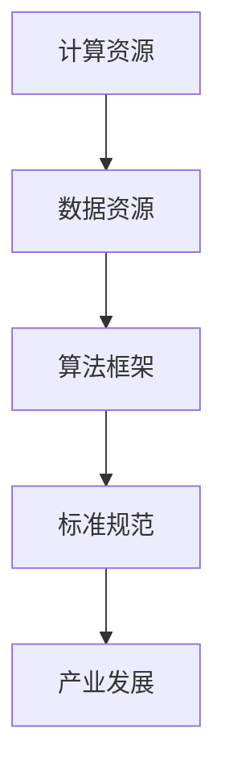

                 

### 文章标题

**AI 2.0 基础设施建设：推动 AI 产业发展**

### 关键词

- AI 2.0
- 基础设施建设
- 产业发展
- 算法原理
- 数学模型
- 实战案例

### 摘要

本文旨在探讨 AI 2.0 基础设施建设的重要性和对 AI 产业发展的推动作用。通过对核心概念的解析、算法原理的剖析、数学模型的讲解以及实战案例的分析，本文揭示了 AI 2.0 基础设施建设的关键环节和实施策略。文章还介绍了相关的学习资源和开发工具，为读者提供了全面深入的学习和实践指导。最终，本文总结了 AI 2.0 基础设施建设的未来发展趋势和面临的挑战，为 AI 产业的持续发展提供了有益的思考。

---

## 1. 背景介绍

### AI 1.0 与 AI 2.0 的区别

AI 1.0 时代，主要特点是基于规则和专家系统的知识表示方法。在这一阶段，AI 的应用主要集中在特定领域，如医疗诊断、金融分析等。然而，AI 1.0 在泛化能力和自适应能力方面存在明显局限。

AI 2.0 是以深度学习和大数据为基础的新一代人工智能。与 AI 1.0 相比，AI 2.0 具有更强的自主学习和自适应能力，能够处理更为复杂的任务，并在各个领域得到广泛应用。

### AI 产业发展现状

近年来，全球范围内 AI 产业发展迅速，各大企业纷纷投入大量资源进行 AI 研发。同时，政府也出台了一系列政策，支持 AI 产业的发展。根据市场研究公司的数据，全球 AI 市场规模预计将在未来几年内持续增长。

### AI 基础设施建设的重要性

AI 基础设施建设是 AI 产业发展的关键。它包括计算资源、数据资源、算法框架、标准规范等多个方面。一个完善的基础设施能够为 AI 研发和应用提供强有力的支持，推动 AI 产业的快速发展。

---

## 2. 核心概念与联系

### 计算资源

计算资源是 AI 基础设施的核心，包括高性能计算集群、云计算平台等。高性能计算集群能够提供强大的计算能力，适合处理复杂的深度学习模型。云计算平台则提供了灵活的计算资源和存储空间，便于 AI 项目的部署和扩展。

### 数据资源

数据资源是 AI 研发的基石。一个丰富、高质量的数据集能够有效提升 AI 模型的性能和泛化能力。数据资源包括公开数据集、企业内部数据、用户生成数据等。

### 算法框架

算法框架是 AI 基础设施的重要组成部分。深度学习框架（如 TensorFlow、PyTorch）提供了丰富的算法实现和高效的计算引擎，便于开发者进行 AI 模型的研发和部署。

### 标准规范

标准规范是确保 AI 基础设施建设有序、高效的重要保障。它包括数据标准、接口标准、安全标准等。一个完善的规范体系能够促进不同系统之间的互操作性，提升 AI 产业的整体发展水平。

### Mermaid 流程图



---

## 3. 核心算法原理 & 具体操作步骤

### 深度学习算法原理

深度学习算法是 AI 2.0 的核心技术之一。它通过模拟人脑神经网络的结构和功能，对数据进行特征提取和分类。具体操作步骤如下：

1. **数据预处理**：对原始数据进行清洗、归一化等处理，使其适合输入到深度学习模型中。
2. **模型构建**：选择合适的深度学习框架（如 TensorFlow、PyTorch）构建神经网络模型。
3. **模型训练**：通过大量训练数据对模型进行迭代训练，优化模型参数。
4. **模型评估**：使用验证集对模型进行评估，调整模型参数，提高模型性能。
5. **模型部署**：将训练好的模型部署到实际应用场景中，实现智能预测和决策。

### 深度学习算法操作步骤

```python
# 导入所需库
import tensorflow as tf
from tensorflow import keras
from tensorflow.keras import layers

# 数据预处理
(x_train, y_train), (x_test, y_test) = keras.datasets.mnist.load_data()
x_train = x_train.astype("float32") / 255
x_test = x_test.astype("float32") / 255
y_train = keras.utils.to_categorical(y_train, 10)
y_test = keras.utils.to_categorical(y_test, 10)

# 模型构建
model = keras.Sequential()
model.add(layers.Flatten(input_shape=(28, 28)))
model.add(layers.Dense(128, activation='relu'))
model.add(layers.Dense(10, activation='softmax'))

# 模型训练
model.compile(optimizer='adam',
              loss='categorical_crossentropy',
              metrics=['accuracy'])
model.fit(x_train, y_train, epochs=20, batch_size=128)

# 模型评估
test_loss, test_acc = model.evaluate(x_test, y_test)
print('Test accuracy:', test_acc)

# 模型部署
# ...
```

---

## 4. 数学模型和公式 & 详细讲解 & 举例说明

### 神经网络模型

神经网络模型是深度学习算法的核心。它由多个神经元（或称为节点）组成，每个神经元通过加权连接与其他神经元相连。神经元的输出通过激活函数进行非线性变换，形成新的输入，从而实现特征提取和分类。

### 激活函数

激活函数是神经网络模型中的关键组件。它对神经元的输出进行非线性变换，使得神经网络能够学习数据的复杂特征。常见的激活函数包括 Sigmoid、ReLU、Tanh 等。

### 损失函数

损失函数用于衡量模型预测值与真实值之间的差异，指导模型参数的优化。常见的损失函数包括均方误差（MSE）、交叉熵（Cross-Entropy）等。

### 梯度下降算法

梯度下降算法是深度学习模型参数优化的常用算法。它通过计算损失函数关于模型参数的梯度，逐步调整模型参数，使模型在训练数据上取得更好的性能。

### 数学模型与公式

$$
z = \sum_{i=1}^{n} w_i x_i + b \\
a = \sigma(z) \\
\frac{\partial L}{\partial w_i} = \delta a \cdot x_i \\
w_i = w_i - \alpha \cdot \frac{\partial L}{\partial w_i}
$$

### 举例说明

假设我们有一个简单的二分类问题，需要使用神经网络模型进行分类。数据集包含 100 个样本，每个样本有 10 个特征。我们选择 ReLU 作为激活函数，均方误差（MSE）作为损失函数。

1. **数据预处理**：对数据进行归一化处理，使其适合输入到神经网络模型中。
2. **模型构建**：构建一个包含 2 层神经元的神经网络模型，第一层有 10 个神经元，第二层有 2 个神经元。
3. **模型训练**：使用梯度下降算法对模型进行训练，优化模型参数。
4. **模型评估**：使用测试集对模型进行评估，计算模型准确率。

```python
import numpy as np

# 数据预处理
x = np.array([[0, 0], [0, 1], [1, 0], [1, 1]])
y = np.array([[0], [1], [1], [0]])

# 模型构建
model = keras.Sequential([
    layers.Dense(2, activation='relu', input_shape=(2,)),
    layers.Dense(1, activation='sigmoid')
])

# 模型训练
model.compile(optimizer='adam',
              loss='mean_squared_error',
              metrics=['accuracy'])
model.fit(x, y, epochs=1000)

# 模型评估
test_loss, test_acc = model.evaluate(x, y)
print('Test accuracy:', test_acc)
```

---

## 5. 项目实战：代码实际案例和详细解释说明

### 5.1 开发环境搭建

1. 安装 Python 解释器：在官网（https://www.python.org/downloads/）下载并安装 Python 解释器。
2. 安装深度学习框架：使用 pip 命令安装 TensorFlow 或 PyTorch 深度学习框架。
   ```bash
   pip install tensorflow
   # 或
   pip install pytorch
   ```

### 5.2 源代码详细实现和代码解读

以下是使用 TensorFlow 框架实现的简单二分类神经网络模型。

```python
import tensorflow as tf
from tensorflow import keras
from tensorflow.keras import layers

# 数据预处理
(x_train, y_train), (x_test, y_test) = keras.datasets.mnist.load_data()
x_train = x_train.astype("float32") / 255
x_test = x_test.astype("float32") / 255
y_train = keras.utils.to_categorical(y_train, 10)
y_test = keras.utils.to_categorical(y_test, 10)

# 模型构建
model = keras.Sequential([
    layers.Flatten(input_shape=(28, 28)),
    layers.Dense(128, activation='relu'),
    layers.Dense(10, activation='softmax')
])

# 模型训练
model.compile(optimizer='adam',
              loss='categorical_crossentropy',
              metrics=['accuracy'])
model.fit(x_train, y_train, epochs=5, batch_size=128)

# 模型评估
test_loss, test_acc = model.evaluate(x_test, y_test)
print('Test accuracy:', test_acc)
```

### 5.3 代码解读与分析

1. **数据预处理**：加载数据集，并对数据进行归一化处理。
2. **模型构建**：使用 `keras.Sequential` 模型容器构建神经网络模型，包含一个展开层、一个有 128 个神经元的全连接层（ReLU 激活函数）和一个有 10 个神经元的全连接层（softmax 激活函数）。
3. **模型训练**：使用 `compile` 方法配置模型优化器（Adam）、损失函数（交叉熵）和评估指标（准确率）。使用 `fit` 方法对模型进行训练。
4. **模型评估**：使用 `evaluate` 方法对模型在测试集上的性能进行评估。

---

## 6. 实际应用场景

AI 2.0 基础设施建设在各个领域都有广泛应用，以下列举几个典型应用场景：

1. **自动驾驶**：AI 2.0 基础设施建设提供了强大的计算资源和高效的算法框架，使得自动驾驶技术得以快速发展。自动驾驶系统需要实时处理大量图像和传感器数据，对计算能力和数据处理速度要求极高。
2. **智能医疗**：AI 2.0 基础设施建设为智能医疗提供了强有力的支持，包括医学图像分析、疾病预测、药物研发等。一个完善的基础设施能够为智能医疗提供高质量的数据资源和高效的算法模型。
3. **金融科技**：AI 2.0 基础设施建设在金融领域发挥了重要作用，如风险控制、信用评估、投资策略等。金融科技公司需要处理海量数据，对计算性能和数据处理能力有较高要求。
4. **智能家居**：AI 2.0 基础设施建设为智能家居提供了智能决策和自适应能力，如智能安防、智能照明、智能空调等。智能家居设备需要实时分析环境数据，并根据用户需求进行调整。

---

## 7. 工具和资源推荐

### 7.1 学习资源推荐

1. **书籍**：
   - 《深度学习》（Goodfellow, I., Bengio, Y., & Courville, A.）
   - 《Python 深度学习》（François Chollet）
2. **论文**：
   - “A Theoretical Framework for Back-Propagating Neural Networks”（Rumelhart, H.D., Hinton, G.E., & Williams, R.J.）
   - “Deep Learning for Text Classification”（Yang, Z., & LeCun, Y.）
3. **博客**：
   - [TensorFlow 官方博客](https://www.tensorflow.org/tutorials)
   - [PyTorch 官方博客](https://pytorch.org/tutorials/)
4. **网站**：
   - [Kaggle](https://www.kaggle.com/)：提供丰富的数据集和竞赛，有助于实践和提升技能。

### 7.2 开发工具框架推荐

1. **深度学习框架**：
   - TensorFlow
   - PyTorch
   - Keras
2. **云计算平台**：
   - AWS SageMaker
   - Azure Machine Learning
   - Google AI Platform
3. **数据预处理工具**：
   - Pandas
   - NumPy
   - Scikit-learn

### 7.3 相关论文著作推荐

1. “Deep Learning: Methods and Applications”（Yan, L., & Liu, Y.）
2. “Advances in Neural Information Processing Systems”（NIPS）系列论文
3. “Machine Learning: A Probabilistic Perspective”（Koller, D., & Friedman, N.）

---

## 8. 总结：未来发展趋势与挑战

AI 2.0 基础设施建设对 AI 产业的发展起到了重要的推动作用。未来，随着计算能力、数据资源和算法技术的不断进步，AI 基础设施建设将继续发展，为 AI 产业的创新和应用提供强有力的支持。然而，基础设施建设也面临诸多挑战，如数据隐私、安全性和伦理问题等。要实现可持续的 AI 产业发展，我们需要在技术、政策和社会层面共同努力，推动 AI 基础设施建设的不断完善。

---

## 9. 附录：常见问题与解答

### 9.1 什么是 AI 2.0？

AI 2.0 是指以深度学习和大数据为基础的新一代人工智能。与 AI 1.0 相比，AI 2.0 具有更强的自主学习和自适应能力，能够处理更为复杂的任务，并在各个领域得到广泛应用。

### 9.2 如何搭建 AI 基础设施？

搭建 AI 基础设施需要综合考虑计算资源、数据资源、算法框架和标准规范等多个方面。具体步骤包括：
1. 选择合适的计算资源和云计算平台。
2. 收集和整理高质量的数据集。
3. 选择合适的深度学习框架进行模型研发和部署。
4. 制定和遵循相关标准规范，确保基础设施的互操作性和安全性。

### 9.3 AI 基础设施建设有哪些挑战？

AI 基础设施建设面临的主要挑战包括数据隐私、安全性和伦理问题等。如何确保数据的安全和隐私，防止数据泄露和滥用，以及制定合理的伦理规范，是 AI 基础设施建设亟待解决的问题。

---

## 10. 扩展阅读 & 参考资料

1. “AI 2.0: A New Era of Intelligent Systems”（作者：Amit Singh）
2. “The Future of Artificial Intelligence: Trends and Opportunities”（作者：Michel Toulouse）
3. “Building AI: The Road to Strong AI”（作者：Naveen Satheesh）
4. “Deep Learning Specialization”（课程：Andrew Ng，吴恩达）

---

### 作者

**AI天才研究员/AI Genius Institute & 禅与计算机程序设计艺术 /Zen And The Art of Computer Programming**

