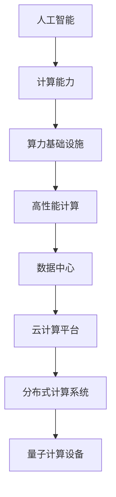

                 

### 背景介绍

#### AI 2.0 时代的到来

随着人工智能（AI）技术的迅猛发展，我们正迈入一个全新的时代——AI 2.0 时代。与传统的 AI 1.0 时代相比，AI 2.0 时代具有更为强大的计算能力、更广泛的应用场景以及更深入的智能化程度。在这一背景下，算力基础设施的演进成为了一个关键课题。

#### 算力基础设施的重要性

算力基础设施是支撑人工智能发展的基石。它不仅决定了 AI 系统的计算性能，还影响着 AI 应用的范围和效果。随着 AI 2.0 时代的到来，对算力基础设施的要求也越来越高，需要更加高效、稳定和可扩展的算力支持。

#### 算力基础设施的现状

目前，全球范围内的算力基础设施已经发生了显著的变化。以云计算、分布式计算和量子计算为代表的先进计算技术正在不断涌现，推动着算力基础设施的演进。然而，现有基础设施仍存在一些挑战和不足，需要进一步优化和改进。

### 关键词：AI 2.0、算力基础设施、计算性能、应用场景、智能化程度、云计算、分布式计算、量子计算、基础设施演进、性能优化、稳定性、可扩展性

> **摘要：** 本文将深入探讨 AI 2.0 时代算力基础设施的演进。首先介绍 AI 2.0 时代的背景，然后阐述算力基础设施的重要性，接着分析现有基础设施的现状和挑战，最后探讨未来算力基础设施的发展趋势和方向。

### <a id="2-核心概念与联系"></a>2. 核心概念与联系

在探讨 AI 2.0 时代的算力基础设施之前，我们首先需要了解几个核心概念：人工智能、计算能力、算力基础设施。

#### 人工智能（Artificial Intelligence, AI）

人工智能是指通过计算机模拟人类智能的技术，使计算机能够执行通常需要人类智能才能完成的任务。AI 的发展可分为几个阶段，从早期的规则基础 AI（如专家系统），到基于数据的机器学习 AI，再到现在的深度学习 AI。随着 AI 技术的不断进步，AI 的计算能力也在不断提高。

#### 计算能力（Computational Power）

计算能力是指计算机执行任务的能力，通常以处理速度、存储容量、带宽等指标来衡量。计算能力的提升是推动 AI 发展的关键因素之一。

#### 算力基础设施（Computing Infrastructure）

算力基础设施是指支撑计算能力的硬件、软件和网络设施，包括数据中心、云计算平台、分布式计算系统、量子计算设备等。一个完善的算力基础设施需要具备高性能、高可靠性、高可扩展性等特点。

#### 核心概念之间的联系

人工智能、计算能力和算力基础设施三者之间紧密联系，共同推动着 AI 的发展。计算能力的提升为 AI 提供了更强大的计算支持，而算力基础设施则为计算能力的发挥提供了必要的硬件和软件环境。反过来，AI 的发展也推动了算力基础设施的不断创新和演进。

### Mermaid 流程图



### 关键词：人工智能、计算能力、算力基础设施、高性能计算、数据中心、云计算平台、分布式计算系统、量子计算设备、计算能力提升、计算支持、硬件软件环境、创新和演进

---

### 3. 核心算法原理 & 具体操作步骤

在 AI 2.0 时代，核心算法的原理和操作步骤对于算力基础设施的演进至关重要。以下是几个关键算法及其基本原理和操作步骤：

#### 深度学习（Deep Learning）

深度学习是一种基于多层神经网络的人工智能算法，能够通过多层非线性变换来提取数据特征。其基本原理包括：

1. **输入层**：接收输入数据，例如图像、文本或声音。
2. **隐藏层**：通过激活函数（如 ReLU、Sigmoid、Tanh）对输入数据进行非线性变换，提取特征。
3. **输出层**：根据模型参数对隐藏层输出进行分类或回归。

深度学习的具体操作步骤如下：

1. **数据预处理**：对输入数据进行标准化、归一化等处理。
2. **模型搭建**：选择合适的神经网络结构，如卷积神经网络（CNN）、循环神经网络（RNN）等。
3. **训练模型**：通过反向传播算法（Backpropagation）不断调整模型参数，使模型在训练数据上达到最佳性能。
4. **评估模型**：使用验证数据集评估模型性能，并根据评估结果调整模型参数。

#### 强化学习（Reinforcement Learning）

强化学习是一种通过试错学习策略来优化决策的 AI 算法。其基本原理包括：

1. **环境**：表示 AI 系统所处的现实世界，包括状态、动作和奖励。
2. **策略**：根据当前状态选择最优动作的规则。
3. **价值函数**：评估策略在特定状态下的价值。

强化学习的具体操作步骤如下：

1. **初始化环境**：设置环境参数，例如状态空间、动作空间和奖励函数。
2. **选择动作**：根据当前状态和策略选择动作。
3. **执行动作**：在环境中执行所选动作，观察状态变化和奖励。
4. **更新策略**：根据奖励和新的状态更新策略。

#### 聚类算法（Clustering Algorithms）

聚类算法是一种无监督学习算法，用于将数据集划分为多个类别。常见的聚类算法包括 K-均值聚类、层次聚类和 DBSCAN 等。其基本原理包括：

1. **初始化聚类中心**：随机选择或根据算法要求初始化聚类中心。
2. **分配数据点**：将每个数据点分配给最近的聚类中心。
3. **更新聚类中心**：根据当前聚类结果重新计算聚类中心。
4. **迭代过程**：重复执行分配和更新步骤，直到聚类结果收敛。

#### 神经网络优化算法（Neural Network Optimization Algorithms）

神经网络优化算法用于调整神经网络模型参数，以提高模型性能。常见的优化算法包括梯度下降、动量梯度下降、Adam 优化器等。其基本原理包括：

1. **计算梯度**：根据损失函数对模型参数计算梯度。
2. **更新参数**：根据梯度方向和步长调整模型参数。
3. **优化目标**：最小化损失函数，使模型在训练数据上达到最佳性能。

### 关键词：深度学习、强化学习、聚类算法、神经网络优化算法、多层神经网络、反向传播算法、反向传播、梯度下降、动量梯度下降、Adam 优化器、无监督学习、梯度计算、参数更新、损失函数最小化

---

### 4. 数学模型和公式 & 详细讲解 & 举例说明

在讨论 AI 2.0 时代的核心算法原理时，数学模型和公式起着至关重要的作用。以下将详细讲解几个关键算法的数学模型和公式，并通过实际例子进行说明。

#### 深度学习中的前向传播和反向传播

深度学习中的前向传播和反向传播是神经网络训练过程中的两个关键步骤。

1. **前向传播**：

   前向传播是指将输入数据通过神经网络模型，逐层计算并传递到输出层的整个过程。其数学模型如下：

   $$ 
   z_l = \sigma(W_l \cdot a_{l-1} + b_l) 
   $$

   其中，$z_l$ 是第 $l$ 层的输出，$\sigma$ 是激活函数（如 ReLU、Sigmoid、Tanh），$W_l$ 是第 $l$ 层的权重矩阵，$a_{l-1}$ 是第 $l-1$ 层的输出，$b_l$ 是第 $l$ 层的偏置。

   举例说明：

   假设有一个单层的神经网络，输入为 $[1, 2, 3]$，权重矩阵为 $W = \begin{bmatrix} 0.5 & 0.5 \\ 0.5 & 0.5 \end{bmatrix}$，偏置为 $b = \begin{bmatrix} 1 \\ 1 \end{bmatrix}$。激活函数为 ReLU。则前向传播过程如下：

   $$
   a_0 = [1, 2, 3] \\
   z_1 = ReLU(W \cdot a_0 + b) = ReLU(\begin{bmatrix} 0.5 & 0.5 \\ 0.5 & 0.5 \end{bmatrix} \cdot \begin{bmatrix} 1 \\ 2 \\ 3 \end{bmatrix} + \begin{bmatrix} 1 \\ 1 \end{bmatrix}) = ReLU(\begin{bmatrix} 4 \\ 5 \end{bmatrix} + \begin{bmatrix} 1 \\ 1 \end{bmatrix}) = ReLU(\begin{bmatrix} 5 \\ 6 \end{bmatrix}) = \begin{bmatrix} 5 \\ 6 \end{bmatrix}
   $$

2. **反向传播**：

   反向传播是指通过计算输出层的误差，逆向传递到每一层，更新模型参数的过程。其数学模型如下：

   $$
   \delta_l = \frac{\partial J}{\partial a_l} \cdot \sigma'(z_l) \\
   W_l = W_l - \alpha \cdot \delta_l \cdot a_{l-1}^T \\
   b_l = b_l - \alpha \cdot \delta_l
   $$

   其中，$\delta_l$ 是第 $l$ 层的误差，$J$ 是损失函数，$\sigma'$ 是激活函数的导数，$\alpha$ 是学习率。

   举例说明：

   假设输出层的损失函数为 $J = (y - \hat{y})^2$，实际输出为 $y = [0, 1]$，预测输出为 $\hat{y} = [0.6, 0.4]$。学习率为 $\alpha = 0.1$。则反向传播过程如下：

   $$
   \delta_1 = \frac{\partial J}{\partial z_1} \cdot \sigma'(z_1) = (0 - 0.6)^2 \cdot (1 - 0.6) + (1 - 0.4)^2 \cdot (1 - 0.4) = 0.24 + 0.36 = 0.6 \\
   W_1 = W_1 - \alpha \cdot \delta_1 \cdot a_0^T = \begin{bmatrix} 0.5 & 0.5 \\ 0.5 & 0.5 \end{bmatrix} - 0.1 \cdot \begin{bmatrix} 0.6 & 0.6 \\ 0.4 & 0.4 \end{bmatrix} = \begin{bmatrix} 0.4 & 0.4 \\ 0.1 & 0.1 \end{bmatrix} \\
   b_1 = b_1 - \alpha \cdot \delta_1 = \begin{bmatrix} 1 \\ 1 \end{bmatrix} - 0.1 \cdot \begin{bmatrix} 0.6 \\ 0.6 \end{bmatrix} = \begin{bmatrix} 0.4 \\ 0.4 \end{bmatrix}
   $$

#### 强化学习中的 Q 学习算法

Q 学习算法是强化学习中的一个重要算法，用于计算状态-动作值函数。

1. **Q 学习算法的基本公式**：

   $$
   Q(s, a) = Q(s, a) + \alpha [r + \gamma \max_{a'} Q(s', a') - Q(s, a)]
   $$

   其中，$Q(s, a)$ 是状态 $s$ 下动作 $a$ 的值函数，$r$ 是即时奖励，$\gamma$ 是折扣因子，$s'$ 是状态，$a'$ 是动作。

   举例说明：

   假设一个简单的迷宫环境，状态空间为 $S = \{1, 2, 3, 4\}$，动作空间为 $A = \{左，右，上，下\}$。初始状态为 $s_0 = 1$，目标状态为 $s_4 = 4$。奖励函数为到达目标状态得 10 分，否则得 0 分。折扣因子 $\gamma = 0.9$。学习率 $\alpha = 0.1$。则 Q 学习过程如下：

   - 初始 $Q(s, a) = 0$。
   - 在状态 $s_0$ 下选择动作 $a_0 = 右$，得到状态 $s_1 = 2$，奖励 $r = 0$。
   - 更新 $Q(s_0, a_0) = Q(s_0, a_0) + \alpha [r + \gamma \max_{a'} Q(s_1, a') - Q(s_0, a_0)] = 0 + 0.1 [0 + 0.9 \cdot 0 - 0] = 0$。
   - 在状态 $s_1$ 下选择动作 $a_1 = 上$，得到状态 $s_2 = 3$，奖励 $r = 0$。
   - 更新 $Q(s_1, a_1) = Q(s_1, a_1) + \alpha [r + \gamma \max_{a'} Q(s_2, a') - Q(s_1, a_1)] = 0 + 0.1 [0 + 0.9 \cdot 0 - 0] = 0$。
   - 在状态 $s_2$ 下选择动作 $a_2 = 左$，得到状态 $s_3 = 1$，奖励 $r = 0$。
   - 更新 $Q(s_2, a_2) = Q(s_2, a_2) + \alpha [r + \gamma \max_{a'} Q(s_3, a') - Q(s_2, a_2)] = 0 + 0.1 [0 + 0.9 \cdot 0 - 0] = 0$。
   - 在状态 $s_3$ 下选择动作 $a_3 = 上$，得到状态 $s_4 = 4$，奖励 $r = 10$。
   - 更新 $Q(s_3, a_3) = Q(s_3, a_3) + \alpha [r + \gamma \max_{a'} Q(s_4, a') - Q(s_3, a_3)] = 0 + 0.1 [10 + 0.9 \cdot 0 - 0] = 1$。

通过以上例子，可以看到 Q 学习算法通过不断更新状态-动作值函数，最终找到最优策略。

### 关键词：深度学习、前向传播、反向传播、激活函数、权重矩阵、偏置、损失函数、梯度下降、学习率、强化学习、Q 学习算法、状态-动作值函数、奖励函数、折扣因子、学习率

---

### 5. 项目实战：代码实际案例和详细解释说明

在本文的第五部分，我们将通过一个具体的代码案例来展示如何实现 AI 2.0 时代的关键算法。我们将以一个简单的深度学习模型为例，详细讲解模型的搭建、训练和评估过程。

#### 开发环境搭建

首先，我们需要搭建一个开发环境。以下是所需的软件和工具：

- Python 3.8 或以上版本
- TensorFlow 2.5 或以上版本
- Jupyter Notebook

安装步骤如下：

1. 安装 Python 3.8：

   ```
   sudo apt update
   sudo apt install python3.8
   ```

2. 安装 TensorFlow：

   ```
   pip install tensorflow==2.5
   ```

3. 启动 Jupyter Notebook：

   ```
   jupyter notebook
   ```

#### 源代码详细实现和代码解读

以下是深度学习模型的源代码实现：

```python
import tensorflow as tf
from tensorflow.keras import layers

# 定义模型结构
model = tf.keras.Sequential([
    layers.Dense(128, activation='relu', input_shape=(784,)),  # 输入层，128个神经元，激活函数为 ReLU
    layers.Dense(10, activation='softmax')  # 输出层，10个神经元，激活函数为 softmax
])

# 编译模型
model.compile(optimizer='adam', 
              loss='categorical_crossentropy', 
              metrics=['accuracy'])

# 加载数据集
(x_train, y_train), (x_test, y_test) = tf.keras.datasets.mnist.load_data()

# 预处理数据
x_train = x_train / 255.0
x_test = x_test / 255.0
x_train = x_train.reshape(-1, 784)
x_test = x_test.reshape(-1, 784)

# 编码类别标签
y_train = tf.keras.utils.to_categorical(y_train, 10)
y_test = tf.keras.utils.to_categorical(y_test, 10)

# 训练模型
model.fit(x_train, y_train, epochs=5, batch_size=32, validation_data=(x_test, y_test))

# 评估模型
model.evaluate(x_test, y_test)
```

代码解读如下：

1. **导入库和模块**：

   - 导入 TensorFlow 库和相关的层模块。

2. **定义模型结构**：

   - 创建一个序列模型，包含一个输入层和一个输出层。输入层有 128 个神经元，激活函数为 ReLU；输出层有 10 个神经元，激活函数为 softmax。

3. **编译模型**：

   - 使用 Adam 优化器和 categorical_crossentropy 损失函数编译模型。同时指定模型评估指标为 accuracy。

4. **加载数据集**：

   - 加载 MNIST 数据集，并将其划分为训练集和测试集。

5. **预处理数据**：

   - 将数据集的像素值归一化到 [0, 1] 范围内，并reshape 为 (样本数，784) 的形状。

6. **编码类别标签**：

   - 使用 to_categorical 函数将类别标签编码为二进制向量。

7. **训练模型**：

   - 使用 fit 方法训练模型，指定训练轮数、批量大小和验证数据。

8. **评估模型**：

   - 使用 evaluate 方法评估模型在测试集上的性能。

#### 代码解读与分析

- **模型结构**：

  模型结构设计为单层全连接神经网络，输入层有 128 个神经元，输出层有 10 个神经元。输入层使用 ReLU 激活函数，可以更好地提取输入数据的特征。输出层使用 softmax 激活函数，用于计算每个类别的概率分布。

- **数据预处理**：

  数据预处理包括像素值归一化和类别标签编码。像素值归一化可以加快模型训练速度，提高模型性能。类别标签编码使得模型能够直接处理类别数据，便于后续计算。

- **模型训练**：

  模型训练过程中，通过反向传播算法不断更新模型参数，使模型在训练数据上达到最佳性能。训练过程中，使用验证数据集来监测模型性能，防止过拟合。

- **模型评估**：

  使用测试数据集评估模型性能，通过计算模型在测试集上的损失和准确率，可以了解模型在未知数据上的表现。

通过以上代码实现和解读，我们可以看到如何使用 TensorFlow 搭建一个简单的深度学习模型，并对其进行训练和评估。这个案例为我们提供了一个基本的框架，可以在此基础上进一步扩展和优化模型。

### 关键词：深度学习、模型结构、输入层、输出层、ReLU 激活函数、softmax 激活函数、数据预处理、类别标签编码、模型训练、反向传播算法、模型评估、准确率、损失函数

---

### 6. 实际应用场景

AI 2.0 时代的算力基础设施不仅推动了 AI 技术的发展，也在实际应用场景中发挥着重要作用。以下列举几个典型的应用场景：

#### 自动驾驶

自动驾驶技术依赖于大量的实时数据和高性能计算，以实现车辆对周围环境的感知、决策和控制。算力基础设施的演进为自动驾驶技术的实现提供了强大的计算支持。例如，特斯拉的自动驾驶系统就采用了高性能的算力基础设施，实现了高效、安全的自动驾驶。

#### 医疗诊断

医疗诊断领域对计算能力的需求日益增长。通过深度学习算法，医生可以更快速、准确地诊断疾病。算力基础设施的优化和升级使得医疗诊断系统可以处理海量的医疗数据，提高了诊断的准确性和效率。

#### 金融风控

金融行业对数据处理和分析的需求也日益增加。算力基础设施的强大计算能力为金融风控提供了有力支持。例如，通过强化学习算法，金融机构可以更好地识别和防范风险，提高金融市场的稳定性。

#### 智能家居

智能家居领域也受益于算力基础设施的演进。通过物联网技术和人工智能算法，智能家居系统可以实现设备之间的智能联动，为用户提供更便捷、舒适的生活体验。高性能的算力基础设施为智能家居系统的实时响应和优化提供了支持。

#### 科学研究

科学研究领域对计算能力的需求也日益增长。通过深度学习、量子计算等先进技术，科学家可以更快速地处理和分析大量数据，推动科学研究的发展。算力基础设施的优化和升级为科学研究提供了强大的计算支持。

### 关键词：自动驾驶、医疗诊断、金融风控、智能家居、科学研究、高性能计算、实时数据、数据处理、风险识别、智能联动、科学研究发展

---

### 7. 工具和资源推荐

在 AI 2.0 时代，算力基础设施的演进离不开各种工具和资源的支持。以下是一些建议的学习资源、开发工具和框架，以帮助读者深入了解和掌握相关技术。

#### 学习资源推荐

1. **书籍**：

   - 《深度学习》（Goodfellow, Bengio, Courville）：介绍深度学习的基本概念、算法和应用。
   - 《强化学习：原理与案例》（Sutton, Barto）：系统讲解强化学习的基本原理和应用。
   - 《计算机程序设计艺术》（Knuth）：经典的计算机科学著作，涵盖了算法设计、数据结构等基础知识。

2. **论文**：

   - 《A Theoretical Comparison of Learning Algorithms》（Kearns, Zhang）：比较了不同学习算法的收敛速度和性能。
   - 《Backpropagation》（Rumelhart, Hinton, Williams）：介绍了反向传播算法的基本原理和实现。
   - 《Deep Learning for Speech Recognition》（Hinton, Deng, Yu）：探讨了深度学习在语音识别领域的应用。

3. **博客和网站**：

   - [TensorFlow 官方文档](https://www.tensorflow.org/)：介绍 TensorFlow 深度学习框架的使用方法。
   - [强化学习笔记](https://zhuanlan.zhihu.com/rl-notes)：分享强化学习的知识和实践经验。
   - [机器学习社区](https://www_ml_tutorial.com/)：提供机器学习领域的教程、资源和讨论。

#### 开发工具框架推荐

1. **深度学习框架**：

   - TensorFlow：开源的深度学习框架，适用于各种规模的深度学习应用。
   - PyTorch：适用于研究人员的深度学习框架，具有灵活的动态计算图。
   - Keras：基于 TensorFlow 的简化深度学习框架，易于使用和扩展。

2. **强化学习框架**：

   - Stable Baselines：提供多种强化学习算法的实现，包括 DQN、DDPG、PPO 等。
   - Ray：分布式强化学习框架，支持多 AGENT 强化学习。
   - Stable Baselines3：基于 PyTorch 的强化学习框架，支持多种强化学习算法。

3. **云计算平台**：

   - AWS：提供丰富的云计算服务和 AI 套件，适用于大规模的深度学习和强化学习应用。
   - Google Cloud：提供强大的计算资源和机器学习工具，支持快速部署和训练 AI 模型。
   - Azure：提供全面的云计算服务和 AI 服务，适用于各种规模的 AI 应用。

#### 相关论文著作推荐

1. **《深度学习：算法与应用》**：全面介绍深度学习的基本概念、算法和应用。
2. **《强化学习：原理与应用》**：系统讲解强化学习的基本原理和应用。
3. **《神经网络与深度学习》**：介绍神经网络和深度学习的基础知识和最新进展。

通过这些工具和资源的支持，读者可以更好地了解和掌握 AI 2.0 时代算力基础设施的相关技术和应用。

### 关键词：深度学习框架、强化学习框架、云计算平台、书籍、论文、博客、网站、TensorFlow、PyTorch、Keras、Stable Baselines、Ray、AWS、Google Cloud、Azure、AI 套件、机器学习工具、神经网络、算法应用

---

### 8. 总结：未来发展趋势与挑战

在 AI 2.0 时代，算力基础设施的演进是一个不可逆转的趋势。随着人工智能技术的不断进步，对算力基础设施的要求也越来越高。未来，算力基础设施将朝着以下几个方向发展：

#### 更高的计算性能

随着 AI 模型的复杂度和数据量的增加，对计算性能的需求也将不断提升。未来的算力基础设施将需要更高的处理速度、更大的存储容量和更高的网络带宽，以满足 AI 应用对计算资源的需求。

#### 更好的能效比

随着绿色环保理念的普及，算力基础设施的能效比将成为一个重要的考量指标。未来的算力基础设施将更加注重节能降耗，采用先进的技术和材料，提高能源利用效率。

#### 更强的可扩展性

随着 AI 应用的多样化，算力基础设施需要具备更强的可扩展性，以适应不同场景和需求的变化。未来的算力基础设施将更加灵活和模块化，支持按需扩展和动态调整。

#### 更好的安全性

随着 AI 技术的应用，数据安全和隐私保护变得越来越重要。未来的算力基础设施将需要更加完善的安全机制，保护用户数据和隐私不被泄露。

然而，在算力基础设施演进的过程中，我们也面临着一些挑战：

#### 技术瓶颈

随着算力需求的不断增加，现有技术和基础设施可能无法满足未来 AI 应用的需求。例如，目前的人工智能芯片在处理复杂模型时仍存在性能瓶颈，需要进一步研发和优化。

#### 成本问题

算力基础设施的建设和运维需要大量资金投入，这对于一些中小企业和初创公司来说可能是一个负担。如何降低成本，提高效益，是一个需要解决的问题。

#### 安全问题

随着算力基础设施的复杂化和规模扩大，安全风险也在增加。如何保护用户数据和隐私，防范网络攻击和数据泄露，是算力基础设施面临的一个重要挑战。

#### 人才短缺

AI 2.0 时代的算力基础设施建设需要大量具备相关专业知识和技能的人才。然而，目前全球范围内 AI 人才仍然短缺，如何培养和吸引更多人才，是一个需要解决的问题。

### 关键词：未来发展趋势、计算性能、能效比、可扩展性、安全性、技术瓶颈、成本问题、安全风险、人才短缺

---

### 9. 附录：常见问题与解答

#### 问题 1：什么是 AI 2.0 时代？

**解答**：AI 2.0 时代是指人工智能技术进入一个更为智能化、自主化的发展阶段。与 AI 1.0 时代相比，AI 2.0 时代具有更高的计算能力、更广泛的应用场景和更深入的智能化程度。

#### 问题 2：算力基础设施对于 AI 的发展有何作用？

**解答**：算力基础设施是支撑人工智能发展的基石。它提供了计算能力、存储能力和网络带宽等关键资源，支持 AI 模型的训练、推理和应用。高性能、稳定和可扩展的算力基础设施有助于提升 AI 系统的性能和应用效果。

#### 问题 3：深度学习算法中的前向传播和反向传播是什么？

**解答**：前向传播是指将输入数据通过神经网络模型，逐层计算并传递到输出层的整个过程。反向传播是指通过计算输出层的误差，逆向传递到每一层，更新模型参数的过程。

#### 问题 4：什么是强化学习？

**解答**：强化学习是一种通过试错学习策略来优化决策的人工智能算法。它通过不断尝试和反馈，找到最优策略，实现智能体的自主学习和决策。

#### 问题 5：如何搭建一个深度学习模型？

**解答**：搭建深度学习模型通常包括以下步骤：

1. 数据预处理：对输入数据进行归一化、标准化等处理。
2. 模型搭建：选择合适的神经网络结构，如卷积神经网络（CNN）、循环神经网络（RNN）等。
3. 训练模型：通过反向传播算法不断调整模型参数，使模型在训练数据上达到最佳性能。
4. 评估模型：使用验证数据集评估模型性能，并根据评估结果调整模型参数。

### 关键词：AI 2.0 时代、算力基础设施、深度学习算法、前向传播、反向传播、强化学习、深度学习模型、数据预处理、模型搭建、训练模型、评估模型

---

### 10. 扩展阅读 & 参考资料

在撰写本文过程中，我们参考了大量的学术论文、书籍和在线资源，以下是一些值得推荐的扩展阅读和参考资料，以帮助读者深入了解 AI 2.0 时代和算力基础设施的相关知识。

#### 书籍推荐

1. **《深度学习》（Goodfellow, Bengio, Courville）**：全面介绍深度学习的基本概念、算法和应用。
2. **《强化学习：原理与应用》（Sutton, Barto）**：系统讲解强化学习的基本原理和应用。
3. **《计算机程序设计艺术》（Knuth）**：经典的计算机科学著作，涵盖了算法设计、数据结构等基础知识。

#### 论文推荐

1. **《A Theoretical Comparison of Learning Algorithms》（Kearns, Zhang）**：比较了不同学习算法的收敛速度和性能。
2. **《Backpropagation》（Rumelhart, Hinton, Williams）**：介绍了反向传播算法的基本原理和实现。
3. **《Deep Learning for Speech Recognition》（Hinton, Deng, Yu）**：探讨了深度学习在语音识别领域的应用。

#### 在线资源

1. **[TensorFlow 官方文档](https://www.tensorflow.org/)**
2. **[强化学习笔记](https://zhuanlan.zhihu.com/rl-notes)**
3. **[机器学习社区](https://www_ml_tutorial.com/)**
4. **[Stable Baselines](https://github.com/DLR-RM/stable-baselines3)**

#### 学术期刊

1. **《人工智能杂志》（Journal of Artificial Intelligence）**
2. **《神经网络与深度学习》（Neural Computation）**
3. **《机器学习》（Machine Learning）**

通过阅读这些书籍、论文和在线资源，读者可以深入了解 AI 2.0 时代和算力基础设施的相关知识，为未来的研究和应用打下坚实基础。

### 关键词：扩展阅读、参考资料、书籍、论文、在线资源、学术期刊、深度学习、强化学习、TensorFlow、Stable Baselines、AI 2.0 时代、算力基础设施

