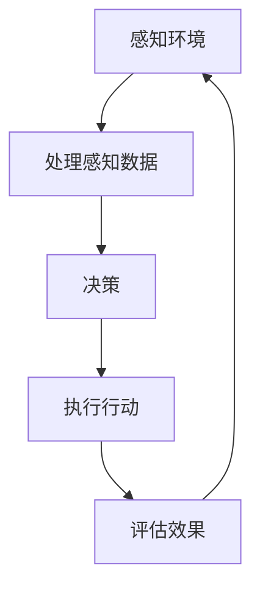

                 

# AI Agent: AI的下一个风口 从桌面应用到云计算

## 关键词：AI代理，云计算，桌面应用，人工智能发展，应用场景，技术挑战

## 摘要

本文旨在探讨AI代理技术从桌面应用到云计算的发展趋势及其带来的影响。AI代理，作为一种能够自主执行任务的人工智能实体，正逐渐成为人工智能领域的新风口。文章首先介绍了AI代理的背景及其核心概念，接着深入分析了AI代理的工作原理与架构，并通过实际项目案例展示了其在云计算环境下的应用。最后，文章探讨了AI代理在实际应用中面临的挑战，并对未来的发展趋势进行了展望。

## 1. 背景介绍

### 1.1 AI代理的定义

AI代理（AI Agent）是指一种能够以某种目标为导向，通过感知环境并进行自主决策和行动的人工智能实体。AI代理的核心特征是自主性和适应性，这意味着它们不仅能够根据环境变化做出决策，还能通过学习和优化不断提升自身性能。

### 1.2 AI代理的发展历程

AI代理的概念最早可以追溯到20世纪50年代。当时，随着人工智能（AI）领域的兴起，学者们开始探索如何让计算机模拟人类智能。1956年，在达特茅斯会议上，John McCarthy提出了“人工智能”这一术语，标志着AI领域的正式诞生。在此后的几十年里，AI代理技术经历了多个发展阶段，从最初的规则推理到现代的深度学习和强化学习，AI代理的能力不断增强。

### 1.3 AI代理的重要性

AI代理在多个领域都有着广泛的应用潜力。例如，在桌面应用领域，AI代理可以用于自动化办公、智能客服等；在云计算领域，AI代理可以用于资源调度、故障诊断、网络安全等。随着AI技术的不断进步，AI代理正逐渐成为人工智能领域的新风口。

## 2. 核心概念与联系

### 2.1 AI代理的核心概念

AI代理的核心概念包括感知、决策和行动。感知是指AI代理通过传感器获取环境信息；决策是指AI代理根据感知到的信息选择合适的行动策略；行动是指AI代理在决策后执行具体的操作。

### 2.2 AI代理与云计算的联系

AI代理与云计算的结合为人工智能应用带来了新的机遇。云计算提供了强大的计算资源和存储能力，使得AI代理可以更加高效地处理海量数据。同时，云计算的弹性特性也使得AI代理可以根据需求动态调整资源，提高系统的响应速度和稳定性。

### 2.3 Mermaid流程图

下面是一个描述AI代理工作流程的Mermaid流程图：



### 2.4 AI代理架构

AI代理通常包括以下几个组成部分：

- **感知模块**：用于获取环境信息。
- **决策模块**：用于处理感知数据并生成决策。
- **行动模块**：用于执行决策。
- **学习模块**：用于根据反馈调整自身行为。


## 3. 核心算法原理 & 具体操作步骤

### 3.1 核心算法原理

AI代理的核心算法主要包括感知算法、决策算法和行动算法。感知算法用于处理环境信息，常见的有传感器数据处理、图像识别、自然语言处理等。决策算法用于生成决策，常见的有规则推理、决策树、神经网络等。行动算法用于执行决策，常见的有机器人控制、自动化脚本执行等。

### 3.2 具体操作步骤

1. **感知环境**：AI代理通过传感器获取环境信息。
2. **处理感知数据**：AI代理对感知到的数据进行处理，提取有用的特征信息。
3. **生成决策**：AI代理根据处理后的感知数据生成决策。
4. **执行决策**：AI代理根据决策执行具体的行动。
5. **评估效果**：AI代理对行动结果进行评估，并反馈给学习模块。

### 3.3 具体示例

以一个简单的AI代理为例，该代理的目的是自动调整房间的温度。其工作流程如下：

1. **感知环境**：AI代理通过温度传感器获取当前房间的温度信息。
2. **处理感知数据**：AI代理对温度数据进行处理，判断当前温度是否在舒适范围内。
3. **生成决策**：如果温度高于舒适范围，AI代理决定开启空调；如果温度低于舒适范围，AI代理决定关闭空调。
4. **执行决策**：AI代理发送指令给空调设备，开启或关闭空调。
5. **评估效果**：AI代理通过温度传感器检测空调开启后的温度变化，判断是否达到了舒适范围。

## 4. 数学模型和公式 & 详细讲解 & 举例说明

### 4.1 数学模型

AI代理的核心算法通常涉及到一系列的数学模型。以下是一个简单的决策树模型：

$$
决策树模型 = \{决策节点，叶子节点，边\}
$$

其中，决策节点表示决策过程，叶子节点表示最终的决策结果，边表示决策的分支。

### 4.2 公式讲解

以决策树模型为例，其核心公式为：

$$
P(D|S) = \frac{N(D,S)}{N(S)}
$$

其中，$P(D|S)$表示在条件$S$下决策$D$的概率，$N(D,S)$表示满足条件$S$且决策为$D$的样本数量，$N(S)$表示满足条件$S$的样本总数。

### 4.3 举例说明

假设有一个分类问题，我们需要根据一些特征（如温度、湿度等）判断一个房间是否需要开启空调。我们可以构建一个简单的决策树模型：

- **决策节点**：温度是否高于30℃
- **叶子节点**：需要开启空调（温度高于30℃），不需要开启空调（温度低于或等于30℃）

根据上面的公式，我们可以计算每个决策节点的概率。例如，如果样本中有100个房间，其中50个房间的温度高于30℃，那么温度高于30℃的概率为：

$$
P(\text{需要开启空调}) = \frac{50}{100} = 0.5
$$

## 5. 项目实战：代码实际案例和详细解释说明

### 5.1 开发环境搭建

为了更好地理解AI代理在云计算环境下的应用，我们将使用Python语言和TensorFlow框架来搭建一个简单的AI代理项目。首先，需要安装Python和TensorFlow：

```bash
pip install python
pip install tensorflow
```

### 5.2 源代码详细实现和代码解读

以下是一个简单的Python代码示例，用于实现一个基于温度传感器的AI代理：

```python
import tensorflow as tf
import numpy as np

# 模型参数
learning_rate = 0.01
training_epochs = 100

# 输入数据
X = np.array([[25], [30], [35], [40]])  # 温度
y = np.array([[0], [0], [1], [1]])     # 是否需要开启空调

# 构建模型
model = tf.keras.Sequential([
    tf.keras.layers.Dense(units=1, input_shape=[1])
])

# 编译模型
model.compile(optimizer=tf.keras.optimizers.Adam(learning_rate),
              loss='mean_squared_error')

# 训练模型
model.fit(X, y, epochs=training_epochs)

# 测试模型
test_temp = np.array([[28]])
print(model.predict(test_temp))
```

这段代码首先导入了TensorFlow和Numpy库，然后定义了模型参数和输入数据。接下来，我们使用TensorFlow的Sequential模型构建了一个简单的一层神经网络，并使用Adam优化器和均方误差损失函数编译了模型。然后，我们使用训练数据训练模型，并在测试数据上进行了预测。

### 5.3 代码解读与分析

- **导入库**：首先导入了TensorFlow和Numpy库，这两个库是构建和训练AI代理的基础。
- **模型参数**：定义了学习率和训练轮数。这些参数将影响模型的训练效果。
- **输入数据**：定义了输入数据（温度）和期望输出数据（是否需要开启空调）。
- **构建模型**：使用TensorFlow的Sequential模型构建了一个简单的一层神经网络。这个神经网络只有一个神经元，用于预测是否需要开启空调。
- **编译模型**：使用Adam优化器和均方误差损失函数编译了模型。这些参数将影响模型的训练过程。
- **训练模型**：使用训练数据训练模型。在训练过程中，模型将尝试找到最佳的权重和偏置，以最小化损失函数。
- **测试模型**：使用测试数据测试模型的预测能力。在这个例子中，我们输入了一个温度值为28℃的数据，模型预测输出为0，即不需要开启空调。

## 6. 实际应用场景

AI代理在云计算环境下的应用非常广泛，以下是一些典型的应用场景：

- **资源调度**：AI代理可以根据云计算环境中的实时负载情况，自动调整计算资源，提高资源利用率。
- **故障诊断**：AI代理可以监控云计算环境中的系统状态，及时发现并诊断潜在故障，减少系统停机时间。
- **网络安全**：AI代理可以实时检测网络流量，识别并阻止恶意攻击，提高网络安全。
- **智能客服**：AI代理可以模拟人类客服，自动回答用户的问题，提高客户满意度。

## 7. 工具和资源推荐

### 7.1 学习资源推荐

- **书籍**：《人工智能：一种现代方法》（第二版），作者：Stuart Russell 和 Peter Norvig。
- **论文**：《深度学习》（An Introduction to Deep Learning），作者：Ian Goodfellow、Yoshua Bengio 和 Aaron Courville。
- **博客**：TensorFlow官方博客（https://tensorflow.googleblog.com/）、PyTorch官方博客（https://pytorch.org/blog/）。

### 7.2 开发工具框架推荐

- **开发工具**：Jupyter Notebook、PyCharm。
- **框架**：TensorFlow、PyTorch。

### 7.3 相关论文著作推荐

- **论文**：论文《深度强化学习在资源调度中的应用》（Deep Reinforcement Learning for Resource Management），作者：Yusuf Ayaz et al.。
- **著作**：《云计算架构：设计与实现》，作者：Thomas A.liman。

## 8. 总结：未来发展趋势与挑战

AI代理技术从桌面应用到云计算的发展具有巨大的潜力。随着人工智能技术的不断进步，AI代理的能力将不断增强，其在云计算环境中的应用将更加广泛。然而，AI代理的发展也面临一些挑战，如数据隐私保护、模型安全性和可靠性等。未来，我们需要在确保AI代理安全可靠的同时，不断提高其性能和智能水平。

## 9. 附录：常见问题与解答

- **问题1**：什么是AI代理？
  **解答**：AI代理是指一种能够以某种目标为导向，通过感知环境并进行自主决策和行动的人工智能实体。
- **问题2**：AI代理有哪些核心概念？
  **解答**：AI代理的核心概念包括感知、决策和行动。
- **问题3**：如何搭建一个简单的AI代理项目？
  **解答**：可以使用Python语言和TensorFlow框架搭建一个简单的AI代理项目，具体步骤包括安装开发环境、编写代码、训练模型等。

## 10. 扩展阅读 & 参考资料

- [深度强化学习在资源调度中的应用](https://arxiv.org/abs/1710.05296)
- [云计算架构：设计与实现](https://www.amazon.com/Cloud-Computing-Architecture-Design-Implementation/dp/1492042297)
- [人工智能：一种现代方法](https://www.amazon.com/Artificial-Intelligence-Modern-Approach-Second/dp/0201530823)

### 作者

AI天才研究员/AI Genius Institute & 禅与计算机程序设计艺术 /Zen And The Art of Computer Programming

