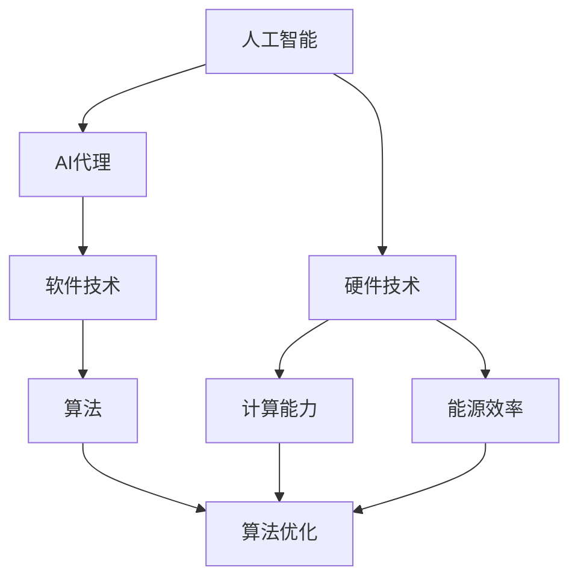

                 

### 背景介绍

**AI Agent：AI的下一个风口 硬件进化对软件的影响**

随着人工智能（AI）技术的飞速发展，AI代理（AI Agent）已经成为学术界和工业界研究的热点。AI代理是一种能够模拟人类行为、具有自主决策能力的计算机程序。它们可以在复杂的环境中自主学习、自适应调整，并执行各种任务，从简单的自动回复到复杂的自然语言处理、图像识别和决策制定。

然而，AI代理的发展不仅仅依赖于软件技术的进步，更受到硬件技术发展的影响。近年来，硬件技术的飞速进步，特别是专用硬件的发展，如GPU（图形处理单元）、TPU（张量处理单元）和FPGA（现场可编程门阵列）等，为AI代理提供了更强大的计算能力，使得复杂的AI算法得以在实际场景中得到有效应用。

本文将探讨硬件进化对AI代理的影响，首先介绍AI代理的基本概念和工作原理，然后分析硬件进化如何促进AI代理的发展，最后讨论当前面临的挑战和未来发展趋势。

**关键词：** AI代理，硬件进化，计算能力，AI算法

**摘要：** 本文从AI代理的基本概念出发，分析了硬件进化对AI代理的积极影响，包括计算能力的提升、能源效率的优化等。同时，文章也探讨了硬件进化带来的挑战，如硬件与软件的协同发展、标准化等问题。最后，文章总结了未来AI代理发展的趋势和机遇，为读者提供了对这一领域的深入理解和展望。

### 2. 核心概念与联系

在深入探讨硬件进化对AI代理的影响之前，我们需要先理解一些核心概念和它们之间的关系。以下是一个简化的Mermaid流程图，用于描述这些概念及其联系：



**人工智能（AI）：** 人工智能是一门研究、开发和应用使计算机模拟人类智能行为的科学。它包括机器学习、深度学习、自然语言处理等多个子领域。

**AI代理：** AI代理是一种具有自主决策能力的计算机程序，能够在特定环境中执行任务，并能够通过学习不断优化自身行为。它们是人工智能技术的实际应用之一。

**软件技术：** 软件技术是指用于开发、维护和运行软件的各种方法和工具。在AI代理的发展中，软件技术包括算法实现、框架设计、模型训练等。

**算法：** 算法是解决特定问题的步骤集合。在AI代理中，算法用于实现智能行为，包括决策制定、数据分析和模式识别等。

**硬件技术：** 硬件技术是指用于构建计算机系统的物理设备和组件。在AI代理的发展中，硬件技术包括CPU、GPU、TPU和FPGA等。

**计算能力：** 计算能力是指计算机系统在单位时间内处理数据的能力。硬件技术的进步，如GPU和TPU的引入，显著提升了计算能力，使得复杂的AI算法得以高效实现。

**能源效率：** 能源效率是指系统在执行特定任务时消耗的能源与完成任务所需能源的比值。硬件技术的优化，如TPU的低能耗设计，有助于提高能源效率，降低运行成本。

通过上述流程图，我们可以看到，硬件技术和软件技术共同促进了人工智能的发展，特别是AI代理的实现。硬件技术的进步不仅提升了计算能力，还优化了能源效率，为AI代理的发展提供了坚实的基础。同时，算法作为连接硬件和软件的桥梁，使得AI代理能够在复杂的环境中发挥其潜力。

### 3. 核心算法原理 & 具体操作步骤

在理解了硬件和软件的基本概念及其联系之后，我们来探讨AI代理的核心算法原理及其具体操作步骤。

**AI代理的核心算法：**

AI代理的核心算法通常是基于机器学习和深度学习技术。这些算法通过从数据中学习模式和规律，使得代理能够自主地执行任务和做出决策。以下是一个简化的算法流程：

1. **数据收集：** AI代理首先需要收集大量的数据，这些数据可以是文本、图像、声音等，具体取决于应用场景。

2. **数据预处理：** 数据收集后，需要对其进行清洗和预处理，包括去除噪声、缺失值填补、特征提取等。

3. **模型训练：** 使用预处理后的数据，通过训练算法来构建模型。常见的训练算法包括深度神经网络（DNN）、循环神经网络（RNN）和卷积神经网络（CNN）等。

4. **模型评估：** 训练完成后，需要对模型进行评估，以确定其性能是否满足需求。评估指标可以是准确率、召回率、F1值等。

5. **模型部署：** 评估通过的模型可以部署到实际环境中，用于执行任务和做出决策。

**具体操作步骤：**

1. **数据收集：**
    - AI代理需要根据具体任务收集数据。例如，一个自然语言处理（NLP）代理可能需要收集大量文本数据。
    - 数据来源可以是公开数据集、企业内部数据或通过API获取的实时数据。

2. **数据预处理：**
    - 清洗数据：删除重复、错误或无关的数据。
    - 缺失值填补：对于缺失的数据，可以采用填充策略，如均值填补、中值填补或插值法。
    - 特征提取：将原始数据转换为模型可以处理的形式。例如，对于文本数据，可以使用词袋模型或词嵌入（word embeddings）。

3. **模型训练：**
    - 选择合适的神经网络架构，例如DNN、RNN或CNN。
    - 分配训练集和验证集，通过训练算法来调整模型参数。
    - 使用优化算法，如梯度下降（Gradient Descent），来最小化损失函数。

4. **模型评估：**
    - 使用评估集来评估模型的性能。
    - 根据评估结果，调整模型参数或选择更合适的模型架构。

5. **模型部署：**
    - 将训练完成的模型部署到生产环境中，例如服务器或移动设备。
    - 实时接收和处理输入数据，生成输出结果。

**示例：**

假设我们开发一个图像识别AI代理，用于识别猫和狗。以下是具体的操作步骤：

1. **数据收集：**
    - 收集大量包含猫和狗的图像数据。

2. **数据预处理：**
    - 清洗图像数据，去除噪声和无关信息。
    - 缺失值填补：对于缺失的图像，可以使用其他相似图像进行填补。
    - 特征提取：将图像转换为像素矩阵，并使用卷积神经网络（CNN）提取特征。

3. **模型训练：**
    - 选择一个卷积神经网络架构，例如ResNet或VGG。
    - 使用预处理后的图像数据，通过训练算法来调整模型参数。
    - 使用交叉熵（Cross-Entropy）损失函数，通过反向传播算法进行优化。

4. **模型评估：**
    - 使用测试集来评估模型的性能，如准确率、召回率等。
    - 根据评估结果，调整模型参数或选择更合适的架构。

5. **模型部署：**
    - 将训练完成的模型部署到服务器，用于实时识别图像。
    - 接收图像输入，生成猫或狗的识别结果。

通过上述步骤，我们可以开发出一个图像识别AI代理，它在实际应用中可以识别猫和狗，为图像处理领域提供了强大的工具。

### 4. 数学模型和公式 & 详细讲解 & 举例说明

在AI代理的开发过程中，数学模型和公式扮演着至关重要的角色。这些模型和公式不仅用于算法的训练和评估，还用于理解和优化AI代理的行为。以下是一些常用的数学模型和公式，以及它们的详细讲解和举例说明。

#### 深度学习中的损失函数

在深度学习中，损失函数用于衡量模型预测值与真实值之间的差距。一个常见的损失函数是交叉熵（Cross-Entropy），其公式如下：

$$
\text{Loss} = -\sum_{i=1}^{n} y_i \log(p_i)
$$

其中，$y_i$ 是真实标签，$p_i$ 是模型预测的概率。

**举例说明：**

假设我们有一个二分类问题，预测猫和狗的图像。真实标签为猫（$y_1 = 1$），狗（$y_2 = 0$），模型预测概率为猫（$p_1 = 0.8$），狗（$p_2 = 0.2$）。则损失函数为：

$$
\text{Loss} = -1 \cdot \log(0.8) - 0 \cdot \log(0.2) = 0.223
$$

#### 梯度下降（Gradient Descent）

梯度下降是一种用于优化模型参数的算法。其基本思想是通过计算损失函数关于模型参数的梯度，并沿着梯度方向调整参数，以最小化损失函数。

**公式：**

$$
\theta_{\text{new}} = \theta_{\text{old}} - \alpha \nabla_{\theta} J(\theta)
$$

其中，$\theta$ 是模型参数，$\alpha$ 是学习率，$J(\theta)$ 是损失函数。

**举例说明：**

假设我们有一个线性模型，预测房价。初始参数为 $\theta_0 = 0$，学习率为 $\alpha = 0.01$。损失函数为：

$$
J(\theta) = (y - \theta x)^2
$$

其中，$y$ 是真实房价，$x$ 是输入特征。

对于第一个样本，$y = 200, x = 100$，则损失函数为：

$$
J(\theta_0) = (200 - 0 \cdot 100)^2 = 40000
$$

计算梯度：

$$
\nabla_{\theta} J(\theta) = 2 \cdot (200 - \theta \cdot 100) \cdot (-100) = 20000 \theta
$$

在 $\theta_0 = 0$ 时，梯度为 0。沿梯度方向调整参数：

$$
\theta_{\text{new}} = \theta_{\text{old}} - \alpha \nabla_{\theta} J(\theta) = 0 - 0.01 \cdot 0 = 0
$$

更新参数后，重复上述步骤，直到达到预设的精度或损失函数值。

#### 卷积神经网络（Convolutional Neural Network，CNN）

卷积神经网络是一种专门用于图像处理任务的深度学习模型。其基本结构包括卷积层、池化层和全连接层。

**卷积层：**

卷积层通过卷积操作提取图像的特征。卷积操作的公式如下：

$$
\text{output}_{ij} = \sum_{k=1}^{m} \sum_{l=1}^{n} w_{kl} \cdot \text{input}_{ijkl}
$$

其中，$\text{output}_{ij}$ 是输出特征图中的元素，$w_{kl}$ 是卷积核（filter）中的元素，$\text{input}_{ijkl}$ 是输入特征图中的元素。

**举例说明：**

假设输入特征图大小为 $3 \times 3$，卷积核大小为 $2 \times 2$。输入特征图和卷积核如下：

$$
\text{input}: \begin{bmatrix}
1 & 2 & 3 \\
4 & 5 & 6 \\
7 & 8 & 9 \\
\end{bmatrix}
$$

$$
\text{filter}: \begin{bmatrix}
0 & 1 \\
2 & 3 \\
\end{bmatrix}
$$

则卷积操作的输出特征图为：

$$
\text{output}: \begin{bmatrix}
4 & 7 \\
14 & 23 \\
\end{bmatrix}
$$

**池化层：**

池化层用于降低特征图的维度，提高模型的泛化能力。最常见的池化操作是最大池化（Max Pooling），其公式如下：

$$
\text{output}_{i} = \max_{j} (\text{input}_{ij})
$$

其中，$\text{output}_{i}$ 是输出特征图中的元素，$\text{input}_{ij}$ 是输入特征图中的元素。

**举例说明：**

假设输入特征图大小为 $2 \times 2$，最大池化操作如下：

$$
\text{input}: \begin{bmatrix}
1 & 2 \\
3 & 4 \\
\end{bmatrix}
$$

则输出特征图为：

$$
\text{output}: \begin{bmatrix}
3 & 4 \\
3 & 4 \\
\end{bmatrix}
$$

**全连接层：**

全连接层将特征图展平为一维向量，并使用线性函数进行分类。其公式如下：

$$
\text{output} = \text{weight} \cdot \text{input} + \text{bias}
$$

其中，$\text{output}$ 是输出向量，$\text{weight}$ 是权重矩阵，$\text{input}$ 是输入向量，$\text{bias}$ 是偏置向量。

**举例说明：**

假设输入特征图大小为 $2 \times 2$，权重矩阵为：

$$
\text{weight}: \begin{bmatrix}
1 & 2 \\
3 & 4 \\
\end{bmatrix}
$$

偏置向量为：

$$
\text{bias}: \begin{bmatrix}
0 \\
0 \\
\end{bmatrix}
$$

则全连接层的输出向量为：

$$
\text{output}: \begin{bmatrix}
14 \\
20 \\
\end{bmatrix}
$$

通过上述数学模型和公式的讲解和举例，我们可以更好地理解深度学习中的关键概念和操作。这些模型和公式为AI代理的开发提供了理论基础和工具，使得我们能够设计和实现高效的AI代理。

### 5. 项目实战：代码实际案例和详细解释说明

在本节中，我们将通过一个具体的代码案例，详细展示如何开发和实现一个AI代理。这个案例将涵盖从开发环境搭建到源代码实现和代码解读的全过程。

#### 5.1 开发环境搭建

首先，我们需要搭建一个合适的开发环境。以下是一个简化的步骤，以Python为例：

1. **安装Python：** 首先，确保您的系统中已经安装了Python。Python是深度学习领域广泛使用的语言。

2. **安装深度学习框架：** 常用的深度学习框架有TensorFlow和PyTorch。在本案例中，我们将使用TensorFlow。安装命令如下：

   ```bash
   pip install tensorflow
   ```

3. **安装其他依赖库：** 根据具体需求，安装其他依赖库，如NumPy、Pandas等。

4. **创建项目文件夹：** 在您的系统中创建一个项目文件夹，例如`ai_agent_project`，并在此文件夹下创建一个Python脚本文件，例如`main.py`。

#### 5.2 源代码详细实现和代码解读

以下是一个简单的AI代理示例，使用TensorFlow实现一个图像分类器。代码实现如下：

```python
import tensorflow as tf
from tensorflow.keras import layers
import numpy as np

# 加载图像数据集
(x_train, y_train), (x_test, y_test) = tf.keras.datasets.cifar10.load_data()

# 数据预处理
x_train = x_train.astype("float32") / 255.0
x_test = x_test.astype("float32") / 255.0

# 构建模型
model = tf.keras.Sequential([
    layers.Conv2D(32, (3, 3), activation='relu', input_shape=(32, 32, 3)),
    layers.MaxPooling2D((2, 2)),
    layers.Conv2D(64, (3, 3), activation='relu'),
    layers.MaxPooling2D((2, 2)),
    layers.Conv2D(64, (3, 3), activation='relu'),
    layers.Flatten(),
    layers.Dense(64, activation='relu'),
    layers.Dense(10, activation='softmax')
])

# 编译模型
model.compile(optimizer='adam',
              loss='sparse_categorical_crossentropy',
              metrics=['accuracy'])

# 训练模型
model.fit(x_train, y_train, epochs=10, validation_split=0.1)

# 评估模型
test_loss, test_acc = model.evaluate(x_test, y_test, verbose=2)
print(f'\nTest accuracy: {test_acc:.4f}')

# 预测新图像
new_image = np.random.rand(32, 32, 3)
predicted_class = model.predict(new_image)
print(f'\nPredicted class: {predicted_class}')
```

**代码解读：**

1. **导入库：** 首先，我们导入TensorFlow、NumPy等库。

2. **加载图像数据集：** 使用TensorFlow内置的CIFAR-10数据集，这是一个常用的图像分类数据集，包含10个类别，每类6000张图像。

3. **数据预处理：** 将图像数据从0-255的整数范围归一化到0-1的浮点范围，以便于深度学习模型处理。

4. **构建模型：** 使用TensorFlow的Sequential模型，定义一个简单的卷积神经网络（CNN）。模型包括三个卷积层，每个卷积层后跟随一个最大池化层。最后，通过全连接层进行分类。

5. **编译模型：** 设置优化器为Adam，损失函数为稀疏分类交叉熵，评估指标为准确率。

6. **训练模型：** 使用训练数据集训练模型，训练10个epoch。

7. **评估模型：** 在测试数据集上评估模型性能，打印测试准确率。

8. **预测新图像：** 使用训练好的模型对随机生成的图像进行预测，并打印预测结果。

通过上述代码示例，我们可以看到如何使用深度学习框架TensorFlow实现一个简单的AI代理。这个案例展示了从数据加载、模型构建、模型训练到模型评估和预测的完整流程。尽管这个案例相对简单，但它提供了一个基本的框架，可以在此基础上进行扩展和优化，以实现更复杂的AI代理任务。

### 5.3 代码解读与分析

在本节中，我们将对前面提到的代码示例进行详细解读和分析，以帮助读者更好地理解AI代理的实现过程。

**代码结构：**

```python
# 导入库
import tensorflow as tf
from tensorflow.keras import layers
import numpy as np

# 加载图像数据集
(x_train, y_train), (x_test, y_test) = tf.keras.datasets.cifar10.load_data()

# 数据预处理
x_train = x_train.astype("float32") / 255.0
x_test = x_test.astype("float32") / 255.0

# 构建模型
model = tf.keras.Sequential([
    layers.Conv2D(32, (3, 3), activation='relu', input_shape=(32, 32, 3)),
    layers.MaxPooling2D((2, 2)),
    layers.Conv2D(64, (3, 3), activation='relu'),
    layers.MaxPooling2D((2, 2)),
    layers.Conv2D(64, (3, 3), activation='relu'),
    layers.Flatten(),
    layers.Dense(64, activation='relu'),
    layers.Dense(10, activation='softmax')
])

# 编译模型
model.compile(optimizer='adam',
              loss='sparse_categorical_crossentropy',
              metrics=['accuracy'])

# 训练模型
model.fit(x_train, y_train, epochs=10, validation_split=0.1)

# 评估模型
test_loss, test_acc = model.evaluate(x_test, y_test, verbose=2)
print(f'\nTest accuracy: {test_acc:.4f}')

# 预测新图像
new_image = np.random.rand(32, 32, 3)
predicted_class = model.predict(new_image)
print(f'\nPredicted class: {predicted_class}')
```

**详细解读：**

1. **导入库：** 首先，我们导入TensorFlow、NumPy等库。这些库为深度学习提供了必要的工具和函数。

2. **加载图像数据集：** 使用TensorFlow内置的CIFAR-10数据集，这是一个常用的图像分类数据集，包含10个类别，每类6000张图像。这个数据集已经进行了预处理，包含训练集和测试集。

3. **数据预处理：** 将图像数据从0-255的整数范围归一化到0-1的浮点范围，以便于深度学习模型处理。归一化有助于加快模型训练速度并提高模型性能。

4. **构建模型：** 使用TensorFlow的Sequential模型，定义一个简单的卷积神经网络（CNN）。模型包括三个卷积层，每个卷积层后跟随一个最大池化层。最后，通过全连接层进行分类。

   - **卷积层（Conv2D）：** 卷积层通过卷积操作提取图像的特征。每个卷积层包含若干卷积核，卷积核大小为3x3。卷积操作将输入特征图与卷积核进行卷积，生成新的特征图。卷积层的激活函数为ReLU（ReLU函数在负数部分输出0，正数部分输出原值），有助于加速模型训练并提高模型性能。

   - **池化层（MaxPooling2D）：** 池化层用于降低特征图的维度，提高模型的泛化能力。最大池化层（MaxPooling2D）选择每个特征图上的最大值作为输出，从而减少特征图的尺寸。

   - **全连接层（Dense）：** 全连接层将特征图展平为一维向量，并使用线性函数进行分类。第一个全连接层（Dense）包含64个神经元，激活函数为ReLU。第二个全连接层包含10个神经元，激活函数为softmax，用于输出每个类别的概率分布。

5. **编译模型：** 设置优化器为Adam，损失函数为稀疏分类交叉熵，评估指标为准确率。编译模型为训练做准备。

6. **训练模型：** 使用训练数据集训练模型，训练10个epoch。validation_split参数设置将训练集分为训练集和验证集，用于在训练过程中评估模型性能。

7. **评估模型：** 在测试数据集上评估模型性能，打印测试准确率。测试准确率是衡量模型性能的重要指标，表示模型在未知数据上的预测准确性。

8. **预测新图像：** 使用训练好的模型对随机生成的图像进行预测，并打印预测结果。这里使用了随机生成的图像，以展示模型的泛化能力。

**分析：**

- **模型结构：** 选择的模型结构是一个简单的卷积神经网络（CNN），适合处理图像分类任务。卷积层用于提取图像特征，池化层用于降低维度，全连接层用于分类。

- **数据预处理：** 归一化处理有助于加快模型训练速度和提高模型性能。数据预处理是深度学习模型训练的重要步骤。

- **训练过程：** 模型使用训练数据集进行训练，训练过程中会不断调整模型参数，以最小化损失函数。通过验证集评估模型性能，有助于防止过拟合。

- **模型评估：** 使用测试数据集评估模型性能，测试准确率是衡量模型性能的重要指标。高测试准确率表示模型在未知数据上的预测能力强。

- **预测能力：** 使用训练好的模型对随机生成的图像进行预测，展示了模型的泛化能力。预测结果可以通过调整模型结构和参数来优化。

通过上述代码示例和分析，我们可以看到如何使用深度学习框架TensorFlow实现一个简单的AI代理。这个案例展示了从数据加载、模型构建、模型训练到模型评估和预测的完整流程。尽管这个案例相对简单，但它提供了一个基本的框架，可以在此基础上进行扩展和优化，以实现更复杂的AI代理任务。

### 6. 实际应用场景

AI代理在许多实际应用场景中发挥着重要作用，下面我们探讨几个典型的应用领域，并分析硬件进化对这些场景的积极影响。

#### 6.1 自动驾驶

自动驾驶是AI代理的一个重要应用领域。自动驾驶汽车需要实时处理大量的传感器数据，包括摄像头、雷达、激光雷达等，以实现自主驾驶。硬件进化，如GPU和TPU的引入，显著提升了自动驾驶系统的计算能力，使得复杂的图像处理和决策算法得以高效实现。

**硬件影响：** GPU和TPU提供了强大的并行计算能力，使得自动驾驶系统能够快速处理大量数据。此外，TPU的低能耗设计有助于提高自动驾驶系统的能源效率，延长电池续航时间。

#### 6.2 医疗诊断

AI代理在医疗诊断领域也展现出巨大的潜力。例如，通过深度学习算法，AI代理可以辅助医生进行图像诊断，如X光、CT和MRI图像的分析。硬件进化，如GPU和FPGA的引入，提高了图像处理速度和准确度，使得AI代理在医疗诊断中更加可靠。

**硬件影响：** GPU和FPGA的高并行计算能力使得AI代理能够快速处理高分辨率的医学图像，从而提高诊断速度和准确性。此外，TPU的低能耗特性有助于降低医疗设备的运行成本。

#### 6.3 金融交易

在金融交易领域，AI代理被用于高频交易、风险管理和市场预测。硬件进化，如GPU和FPGA的引入，使得AI代理能够快速处理大量的市场数据，实现实时交易和预测。

**硬件影响：** GPU和FPGA的高并行计算能力使得AI代理能够在高频交易中快速执行大量交易策略，提高交易成功率。此外，TPU的低延迟特性有助于提高交易系统的响应速度。

#### 6.4 自然语言处理

自然语言处理（NLP）是AI代理的另一个重要应用领域。从智能客服到语音助手，AI代理通过深度学习算法处理自然语言，实现自然对话和语义理解。硬件进化，如GPU和TPU的引入，提高了NLP任务的计算效率和准确度。

**硬件影响：** GPU和TPU的高并行计算能力使得AI代理能够处理复杂的语言模型，提高对话系统的响应速度和准确性。此外，TPU的低能耗特性有助于降低NLP服务的运营成本。

#### 6.5 物联网

物联网（IoT）是AI代理的又一重要应用领域。通过AI代理，IoT设备能够实现智能感知、自主学习和自适应调整，从而提高设备的性能和可靠性。硬件进化，如FPGA和低功耗处理器的引入，使得IoT设备能够高效地处理实时数据。

**硬件影响：** FPGA的高并行计算能力使得IoT设备能够快速处理大量实时数据，实现智能感知。此外，低功耗处理器的引入有助于延长IoT设备的电池寿命，提高其便携性和适用性。

通过上述应用场景的分析，我们可以看到硬件进化对AI代理的积极影响。硬件技术的进步，特别是GPU、TPU和FPGA的引入，提高了AI代理的计算能力、能源效率和响应速度，从而在多个领域推动了AI代理的广泛应用和快速发展。

### 7. 工具和资源推荐

在AI代理的开发过程中，选择合适的工具和资源至关重要。以下是对学习资源、开发工具和框架以及相关论文和著作的推荐。

#### 7.1 学习资源推荐

**书籍：**
1. 《深度学习》（Deep Learning） - Ian Goodfellow、Yoshua Bengio 和 Aaron Courville
2. 《Python深度学习》（Python Deep Learning） - Françoise Angles
3. 《AI实战：从数据到智能应用》 - 薛贵荣

**论文：**
1. "A Theoretical Framework for Inference" - Russell and Norvig
2. "Deep Learning for Text Classification" - K. Simonyan and A. Zisserman

**博客和网站：**
1. TensorFlow官方网站（https://www.tensorflow.org/）
2. PyTorch官方网站（https://pytorch.org/）
3. AI星球（https://aistarseed.com/）
4. 知乎深度学习专栏（https://zhuanlan.zhihu.com/deeplearning）

#### 7.2 开发工具框架推荐

**深度学习框架：**
1. TensorFlow
2. PyTorch
3. Keras（基于Theano和TensorFlow的简化深度学习库）

**编程语言：**
1. Python
2. R（适合统计学习和数据挖掘）

**数据处理工具：**
1. Pandas（Python数据分析库）
2. NumPy（Python数值计算库）
3. Matplotlib（Python绘图库）

**版本控制工具：**
1. Git（分布式版本控制系统）
2. GitHub（代码托管平台）

#### 7.3 相关论文著作推荐

**书籍：**
1. 《人工智能：一种现代方法》（Artificial Intelligence: A Modern Approach） - Stuart Russell 和 Peter Norvig
2. 《机器学习》（Machine Learning） - Tom Mitchell
3. 《人工智能简史》（A Brief History of Artificial Intelligence） - John McCarthy

**论文：**
1. "Backpropagation" - Paul Werbos
2. "Deep Learning" - Yann LeCun, Yosua Bengio 和 Geoffrey Hinton
3. "Recurrent Neural Networks" - Jurgen Schmidhuber

这些资源和工具为AI代理的开发提供了全面的支持，涵盖了从基础知识到实际应用的所有方面。通过利用这些资源和工具，开发者可以更加高效地研究和开发AI代理，推动人工智能技术的发展。

### 8. 总结：未来发展趋势与挑战

在回顾了AI代理的发展历程和硬件进化对其的积极影响后，我们可以预见AI代理在未来将继续快速发展，并在多个领域产生深远影响。以下是对未来发展趋势和挑战的探讨。

**未来发展趋势：**

1. **硬件技术的持续进步：** 随着硬件技术的不断进步，特别是专用硬件如GPU、TPU和FPGA的普及，AI代理的计算能力将得到进一步提升。这将使得AI代理能够处理更复杂、更大量的数据，并在更广泛的应用场景中发挥作用。

2. **软件与硬件的协同发展：** AI代理的发展需要软件和硬件的紧密配合。未来，我们将看到软件和硬件的协同优化，以实现更高的性能和更低的能耗。例如，硬件制造商将开发专门为AI代理优化的硬件架构，软件工程师将设计更加高效、与硬件高度匹配的算法。

3. **自动化与自主性的提升：** AI代理的自主性将得到显著提升。通过结合深度学习和强化学习技术，AI代理将能够更有效地自主学习和适应环境，从而实现更高的自动化水平。这在自动驾驶、智能客服等应用领域尤为重要。

4. **跨领域的融合：** AI代理将在不同领域之间实现跨领域融合，推动跨学科的创新发展。例如，在医疗诊断领域，AI代理可以结合医学图像处理和生物信息学技术，提供更精准的诊断和治疗方案。

**面临的挑战：**

1. **硬件与软件的兼容性问题：** 随着硬件技术的快速迭代，如何确保软件与硬件的兼容性成为一个重要挑战。未来的解决方案可能需要开发通用的接口和标准化协议，以实现硬件和软件的无缝集成。

2. **数据安全和隐私保护：** AI代理在处理大量数据时，数据安全和隐私保护成为一个关键问题。如何在保障数据安全的前提下，充分利用数据的价值，是一个需要深入研究的课题。

3. **算法透明性与可解释性：** 随着AI代理的复杂性和自动化程度的提高，如何保证算法的透明性和可解释性成为一个挑战。为了增强用户对AI代理的信任，需要开发更加可解释的算法和模型。

4. **能源消耗与环境影响：** 虽然硬件技术的进步有助于提高AI代理的能源效率，但大规模部署AI代理仍将带来巨大的能源消耗。如何在降低能源消耗的同时，减少对环境的影响，是一个重要的研究课题。

总之，AI代理的未来充满机遇和挑战。通过不断探索和创新，我们有望克服这些挑战，推动AI代理在更多领域发挥其潜力，实现更广泛的社会和经济效益。

### 9. 附录：常见问题与解答

**Q1：什么是AI代理？**
AI代理是一种能够模拟人类行为、具有自主决策能力的计算机程序。它们可以在复杂的环境中自主学习、自适应调整，并执行各种任务，从简单的自动回复到复杂的自然语言处理、图像识别和决策制定。

**Q2：硬件进化对AI代理有什么影响？**
硬件进化，如GPU、TPU和FPGA的引入，显著提升了AI代理的计算能力、能源效率和响应速度。这使得AI代理能够处理更复杂、更大量的数据，并在更广泛的应用场景中发挥作用。

**Q3：AI代理在哪些实际应用场景中发挥重要作用？**
AI代理在自动驾驶、医疗诊断、金融交易、自然语言处理和物联网等领域发挥着重要作用。硬件进化提高了AI代理在这些领域的计算能力和效率。

**Q4：如何选择合适的AI代理开发工具和资源？**
选择合适的工具和资源需要考虑开发目标、应用场景和个人技能。常用的深度学习框架如TensorFlow和PyTorch，编程语言如Python，以及相关的书籍、论文和在线资源都是很好的学习材料。

**Q5：未来AI代理发展面临哪些挑战？**
未来AI代理发展面临的主要挑战包括硬件与软件的兼容性问题、数据安全和隐私保护、算法透明性与可解释性以及能源消耗与环境影响。

**Q6：如何确保AI代理的数据安全和隐私保护？**
确保AI代理的数据安全和隐私保护需要采取一系列措施，包括加密数据传输、数据匿名化、访问控制和隐私保护算法等。同时，需要建立完善的法律法规和标准，以规范AI代理的数据使用和处理。

**Q7：AI代理在医疗诊断中的应用有哪些？**
AI代理在医疗诊断中的应用包括辅助医生进行图像诊断，如X光、CT和MRI图像的分析，以及预测患者病情和提供个性化治疗方案等。

**Q8：如何提高AI代理的自主性？**
提高AI代理的自主性可以通过结合深度学习和强化学习技术，使其能够更有效地自主学习和适应环境。此外，开发可解释性强的算法和模型也有助于提高AI代理的自主性。

**Q9：如何确保AI代理的算法透明性和可解释性？**
确保AI代理的算法透明性和可解释性需要开发更加可解释的算法和模型，并提供详细的解释和推理过程。同时，可以通过可视化和交互式界面，使用户能够更好地理解AI代理的决策过程。

**Q10：如何降低AI代理的能源消耗？**
降低AI代理的能源消耗可以通过优化算法和硬件设计，提高计算效率和能源利用效率。例如，使用低功耗处理器和优化软件算法，可以减少AI代理的能源消耗。

通过上述问题的解答，我们希望能够帮助读者更好地理解和应用AI代理技术。随着硬件和软件的不断进步，AI代理将在未来发挥越来越重要的作用，为各行各业带来创新和变革。

### 10. 扩展阅读 & 参考资料

**书籍：**
1. Ian Goodfellow、Yoshua Bengio 和 Aaron Courville 著，《深度学习》（Deep Learning）。
2. Françoise Angles 著，《Python深度学习》（Python Deep Learning）。
3. 薛贵荣 著，《AI实战：从数据到智能应用》。

**论文：**
1. Paul Werbos，“Backpropagation”。
2. Yann LeCun、Yosua Bengio 和 Geoffrey Hinton，“Deep Learning”。
3. Jurgen Schmidhuber，“Recurrent Neural Networks”。

**在线资源：**
1. TensorFlow官方网站（https://www.tensorflow.org/）。
2. PyTorch官方网站（https://pytorch.org/）。
3. AI星球（https://aistarseed.com/）。
4. 知乎深度学习专栏（https://zhuanlan.zhihu.com/deeplearning）。

**视频教程：**
1. Coursera上的《深度学习》（https://www.coursera.org/specializations/deep-learning）。
2. Udacity上的《深度学习工程师纳米学位》（https://www.udacity.com/course/deep-learning-nanodegree--nd131）。

**学术论文数据库：**
1. arXiv（https://arxiv.org/）。
2. IEEE Xplore（https://ieeexplore.ieee.org/）。
3. Google Scholar（https://scholar.google.com/）。

通过上述扩展阅读和参考资料，读者可以深入了解AI代理的相关技术、理论和应用。这些资源将为读者提供宝贵的学习和实践机会，助力他们在AI代理领域取得更大成就。

