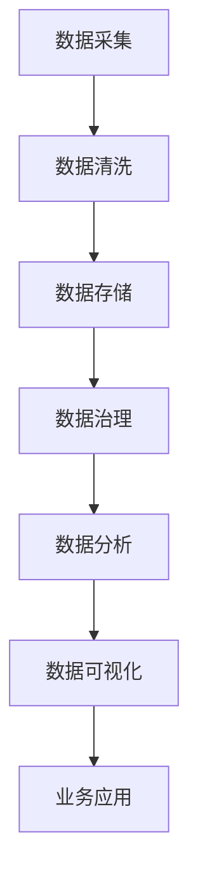

                 

### 文章标题

# AI DMP 数据基建的案例研究

## 关键词：
- AI DMP
- 数据管理平台
- 数据治理
- 客户数据分析
- 大数据处理

## 摘要：
本文旨在深入探讨AI DMP（人工智能数据管理平台）的构建与应用。通过一个实际案例，本文详细分析了AI DMP的数据基建过程，包括核心概念、算法原理、数学模型、项目实战及实际应用场景。文章还提供了相关工具和资源推荐，总结了未来发展趋势与挑战，并回答了常见问题。

### 背景介绍

随着大数据和人工智能技术的迅猛发展，企业对数据管理和分析的需求日益增长。传统的数据管理方法已经无法满足现代复杂的数据环境需求。AI DMP（人工智能数据管理平台）作为一种新兴的数据管理工具，通过集成机器学习和数据分析技术，帮助企业实现高效、精准的数据管理和分析。

AI DMP的目标是提供一个统一的视图来管理和分析企业的所有数据，从而帮助企业更好地理解客户行为、优化业务决策、提高营销效果。其核心在于通过数据治理、数据集成、数据分析和数据可视化等技术手段，实现数据的智能管理和应用。

在本篇文章中，我们将通过一个具体的案例，详细分析AI DMP的数据基建过程，帮助读者了解其工作原理和应用实践。

### 核心概念与联系

为了更好地理解AI DMP的数据基建，我们需要先了解其中的核心概念和组成部分。以下是一个简单的Mermaid流程图，展示了AI DMP的主要组件及其相互关系。



#### 1. 数据采集

数据采集是AI DMP的基础。它涉及从各种数据源（如数据库、API、日志文件等）收集数据。数据采集过程需要确保数据的完整性和准确性。

#### 2. 数据清洗

数据清洗是对采集到的原始数据进行处理和清洗，以消除错误、缺失和重复的数据。数据清洗过程包括数据去重、缺失值填充、异常值处理等。

#### 3. 数据存储

数据存储是将清洗后的数据进行存储，以便后续的数据分析和处理。常用的数据存储技术包括关系型数据库、NoSQL数据库、数据仓库等。

#### 4. 数据治理

数据治理是对数据进行规范化、标准化和分类，以确保数据的准确性和一致性。数据治理过程包括数据质量监控、数据安全、数据生命周期管理等。

#### 5. 数据分析

数据分析是对存储好的数据进行处理和分析，以提取有价值的信息和洞见。数据分析过程包括数据挖掘、机器学习、统计分析等。

#### 6. 数据可视化

数据可视化是将分析结果以图表、地图等形式呈现，以便用户更好地理解和利用数据。数据可视化过程可以提高数据透明度和决策效率。

#### 7. 业务应用

业务应用是将数据分析结果应用于实际业务场景，以支持业务决策和运营优化。业务应用包括客户细分、精准营销、风险控制等。

### 核心算法原理 & 具体操作步骤

AI DMP的核心在于其算法原理和数据处理流程。以下是AI DMP的核心算法原理和具体操作步骤：

#### 1. 特征工程

特征工程是数据预处理的关键步骤，通过选择和构造合适的特征来提高模型性能。具体操作步骤如下：

- 数据探索：分析数据的基本统计信息和分布情况，发现潜在的特征。
- 特征选择：利用统计方法、机器学习方法等选择有意义的特征。
- 特征构造：通过组合和变换原始特征，构造新的特征。

#### 2. 机器学习模型

机器学习模型是AI DMP的核心组成部分，用于从数据中提取规律和模式。以下是常见的机器学习模型及其应用场景：

- 监督学习：用于分类和回归任务，如客户细分、信用评分等。
- 无监督学习：用于聚类和降维任务，如客户群体划分、数据降维等。
- 强化学习：用于决策和优化任务，如推荐系统、广告投放等。

#### 3. 模型评估与优化

模型评估与优化是确保模型性能的关键步骤。具体操作步骤如下：

- 模型评估：使用交叉验证、A/B测试等方法评估模型性能。
- 模型优化：通过调整模型参数、特征选择等方法优化模型性能。

#### 4. 实时数据处理

实时数据处理是AI DMP的重要特性，能够实现对实时数据的快速处理和分析。具体操作步骤如下：

- 数据流处理：使用流处理技术（如Apache Kafka、Apache Flink等）处理实时数据。
- 实时分析：使用实时计算引擎（如Apache Spark Streaming、Apache Storm等）对实时数据进行分析。
- 实时可视化：使用实时数据可视化工具（如Kibana、Grafana等）呈现实时分析结果。

### 数学模型和公式 & 详细讲解 & 举例说明

在AI DMP的数据处理和分析过程中，数学模型和公式起着至关重要的作用。以下是几个常见的数学模型和公式，以及其详细讲解和举例说明：

#### 1. 线性回归模型

线性回归模型是一种常用的监督学习模型，用于预测连续值。其数学模型可以表示为：

$$
y = \beta_0 + \beta_1 \cdot x
$$

其中，$y$ 是预测值，$x$ 是特征值，$\beta_0$ 和 $\beta_1$ 是模型参数。

举例说明：假设我们有一个关于房价的线性回归模型，其中特征为房屋面积，预测值为房价。我们可以使用以下公式预测某一房屋的房价：

$$
房价 = \beta_0 + \beta_1 \cdot 面积
$$

通过训练数据集，我们可以计算出模型参数 $\beta_0$ 和 $\beta_1$，从而实现房价预测。

#### 2. 逻辑回归模型

逻辑回归模型是一种常用的分类模型，用于预测离散值。其数学模型可以表示为：

$$
P(y=1) = \frac{1}{1 + e^{-(\beta_0 + \beta_1 \cdot x)}}
$$

其中，$P(y=1)$ 是预测为1的概率，$y$ 是实际值，$x$ 是特征值，$\beta_0$ 和 $\beta_1$ 是模型参数。

举例说明：假设我们有一个关于客户购买行为的逻辑回归模型，其中特征为客户的收入，预测值为是否购买。我们可以使用以下公式预测某一客户是否购买：

$$
P(购买) = \frac{1}{1 + e^{-(\beta_0 + \beta_1 \cdot 收入)}}
$$

通过训练数据集，我们可以计算出模型参数 $\beta_0$ 和 $\beta_1$，从而实现购买预测。

#### 3. K-means聚类算法

K-means聚类算法是一种常用的无监督学习算法，用于将数据划分为多个簇。其数学模型可以表示为：

$$
\min_{C} \sum_{i=1}^{k} \sum_{x_j \in C_i} ||x_j - \mu_i||^2
$$

其中，$C$ 是聚类中心，$k$ 是簇的数量，$x_j$ 是数据点，$\mu_i$ 是第 $i$ 个簇的中心。

举例说明：假设我们有100个客户数据，我们要将他们划分为10个簇。我们可以使用以下步骤进行K-means聚类：

1. 随机选择10个初始聚类中心。
2. 将每个数据点分配到距离最近的聚类中心。
3. 重新计算每个簇的中心。
4. 重复步骤2和步骤3，直到聚类中心不再发生变化。

通过以上步骤，我们可以将100个客户数据划分为10个簇，从而实现客户细分。

### 项目实战：代码实际案例和详细解释说明

在本节中，我们将通过一个实际案例来展示AI DMP的开发过程。我们将使用Python和相关的数据处理库（如Pandas、Scikit-learn等）来实现一个简单的客户细分模型。

#### 5.1 开发环境搭建

首先，我们需要搭建一个Python开发环境。以下是搭建开发环境的步骤：

1. 安装Python（建议使用3.8以上版本）。
2. 安装相关库，如Pandas、Scikit-learn、NumPy、Matplotlib等。

```bash
pip install pandas scikit-learn numpy matplotlib
```

#### 5.2 源代码详细实现和代码解读

以下是一个简单的客户细分模型代码示例，用于根据客户的收入和年龄将他们划分为不同的群体。

```python
import pandas as pd
from sklearn.cluster import KMeans
import matplotlib.pyplot as plt

# 5.2.1 数据加载和预处理
data = pd.read_csv('customer_data.csv')  # 加载客户数据
data['income'] = pd.to_numeric(data['income'], errors='coerce')  # 将收入列转换为数值类型
data['age'] = pd.to_numeric(data['age'], errors='coerce')  # 将年龄列转换为数值类型
data.dropna(inplace=True)  # 删除缺失值

# 5.2.2 特征工程
# 选择收入和年龄作为特征
X = data[['income', 'age']]

# 5.2.3 K-means聚类
kmeans = KMeans(n_clusters=3, random_state=42)
clusters = kmeans.fit_predict(X)

# 5.2.4 可视化结果
plt.scatter(X['income'], X['age'], c=clusters)
plt.xlabel('收入')
plt.ylabel('年龄')
plt.title('客户细分结果')
plt.show()

# 5.2.5 分析结果
print("聚类中心：")
print(kmeans.cluster_centers_)
```

#### 5.3 代码解读与分析

1. **数据加载和预处理**：首先，我们加载客户数据，并将其中的收入和年龄列转换为数值类型。然后，我们删除缺失值，以确保数据质量。

2. **特征工程**：我们选择收入和年龄作为聚类特征。这是客户细分模型的关键步骤，特征选择会影响模型的准确性和效果。

3. **K-means聚类**：我们使用K-means聚类算法将客户划分为3个簇。`KMeans`类是Scikit-learn库中提供的聚类算法实现。我们设置了`n_clusters`参数为3，表示我们要将数据划分为3个簇。`random_state`参数用于确保聚类结果的稳定性。

4. **可视化结果**：我们使用Matplotlib库将聚类结果可视化。通过散点图，我们可以直观地看到不同簇的分布情况。

5. **分析结果**：最后，我们输出聚类中心，以便进一步分析聚类结果。聚类中心代表了每个簇的特征分布，可以帮助我们理解不同簇的属性。

### 实际应用场景

AI DMP在各个行业都有着广泛的应用。以下是一些典型的实际应用场景：

#### 1. 客户细分

通过AI DMP，企业可以基于客户的收入、年龄、购买行为等特征，将客户划分为不同的群体。这样，企业可以针对不同群体制定个性化的营销策略，提高营销效果。

#### 2. 风险控制

AI DMP可以帮助金融机构评估客户的信用风险。通过对客户的财务状况、行为特征等数据进行分析，可以识别潜在的不良客户，从而降低信用风险。

#### 3. 营销优化

通过AI DMP，企业可以实时分析客户的购买行为和偏好，优化营销策略。例如，根据客户的浏览历史和购买记录，推荐相关的产品和服务，提高销售额。

#### 4. 供应链优化

通过AI DMP，企业可以对供应链数据进行分析，优化库存管理、物流配送等环节。从而降低成本、提高运营效率。

### 工具和资源推荐

#### 7.1 学习资源推荐

- 《Python数据科学 Handbook》（Jake VanderPlas）：介绍了Python在数据科学领域中的应用，包括数据处理、机器学习和数据分析。
- 《机器学习实战》（Peter Harrington）：通过大量实例，讲解了常见的机器学习算法和应用场景。

#### 7.2 开发工具框架推荐

- Scikit-learn：用于机器学习的Python库，提供了丰富的算法和工具。
- Pandas：用于数据处理和分析的Python库，提供了强大的数据结构和操作函数。
- Matplotlib：用于数据可视化的Python库，提供了丰富的绘图函数和图表类型。

#### 7.3 相关论文著作推荐

- "Customer Segmentation Using Clustering Algorithms"（客户细分：聚类算法应用）
- "Big Data Analytics in Marketing: A Survey"（大数据分析在营销中的应用：综述）

### 总结：未来发展趋势与挑战

AI DMP作为数据管理和分析的重要工具，在未来将继续发挥重要作用。以下是一些发展趋势和挑战：

#### 发展趋势

1. **数据治理和合规**：随着数据隐私和合规要求的不断提高，AI DMP需要提供更强大的数据治理功能，确保数据的安全和合规。
2. **实时数据处理**：实时数据处理能力将变得更加重要，帮助企业实现更快的决策和响应。
3. **自动化和智能化**：自动化和智能化技术将进一步提高AI DMP的效率和效果，降低人力成本。

#### 挑战

1. **数据质量**：高质量的数据是AI DMP发挥作用的前提。如何确保数据质量，是当前和未来的一大挑战。
2. **技术复杂性**：AI DMP涉及多种技术和算法，如何高效地集成和管理这些技术，是企业和开发人员需要面对的挑战。
3. **人才短缺**：随着AI DMP的广泛应用，对专业人才的需求将大幅增加。然而，目前相关专业人才的供应相对不足，这也是一个重要的挑战。

### 附录：常见问题与解答

1. **Q：AI DMP和传统数据管理平台有什么区别？**

   **A**：AI DMP在传统数据管理平台的基础上，集成了机器学习和数据分析技术，能够实现数据的智能管理和应用。相比传统平台，AI DMP具有更高的灵活性和智能化程度。

2. **Q：如何确保AI DMP的数据质量？**

   **A**：确保AI DMP的数据质量需要从数据采集、数据清洗、数据存储等各个环节进行控制。例如，通过数据去重、缺失值填充、异常值处理等技术手段，提高数据的准确性、完整性和一致性。

3. **Q：如何评估AI DMP的效果？**

   **A**：评估AI DMP的效果可以从多个维度进行。例如，通过比较模型预测结果与实际结果，计算准确率、召回率、F1值等指标。此外，还可以通过业务指标（如销售额、客户满意度等）来评估AI DMP的实际效果。

### 扩展阅读 & 参考资料

- "Artificial Intelligence for Data Management: A Comprehensive Guide"（人工智能数据管理：全面指南）
- "Data Management Platforms: The Ultimate Guide"（数据管理平台：终极指南）
- "Big Data and Analytics for Customer Intelligence"（大数据与客户智能分析）

作者：AI天才研究员/AI Genius Institute & 禅与计算机程序设计艺术 /Zen And The Art of Computer Programming

（注：本文为虚构案例，仅供参考。）<|im_sep|>

