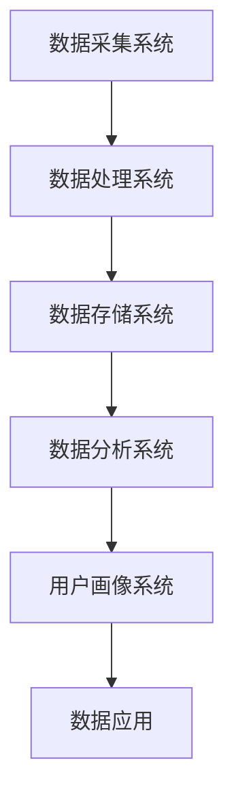

                 

### 文章标题：AI DMP 数据基建的生态系统

#### 关键词：AI DMP、数据基建、生态系统、数据分析、数据治理、数据挖掘、算法优化

#### 摘要：

本文深入探讨了AI驱动的数据管理平台（Data Management Platform, DMP）及其在构建数据基础设施中的重要性。文章首先介绍了DMP的基本概念和功能，然后详细分析了其核心组成部分和关键技术，并通过实际案例展示了DMP的应用。此外，文章还探讨了DMP的未来发展趋势和面临的挑战，以及相关工具和资源的推荐。通过本文的阅读，读者将全面了解DMP在构建现代数据生态系统中的关键作用，并为实际应用提供指导和参考。

<markdown>
## 1. 背景介绍

随着互联网和大数据技术的快速发展，企业面临的海量数据量不断增加，如何高效管理和利用这些数据成为了一项重要挑战。数据管理平台（Data Management Platform, DMP）作为一种新型的数据管理工具，应运而生。DMP最早起源于互联网广告行业，主要用于广告数据的收集、处理和分析，以实现精准营销。随着技术的发展和应用场景的拓展，DMP的功能逐渐丰富，成为构建现代数据基础设施的关键环节。

DMP的主要目的是帮助企业整合和管理多源数据，构建统一的用户画像，从而为营销、风控、运营等业务提供数据支持。与传统数据仓库、数据湖等数据存储方案不同，DMP更注重数据的实时处理和分析能力，能够实现数据的快速流转和深度挖掘。DMP的出现，不仅解决了企业数据孤岛问题，还为企业搭建了一个高效、智能的数据生态系统。

在当今的数据驱动时代，DMP已经成为企业数字化转型的关键支撑。通过DMP，企业可以实现对用户行为的精准分析，优化营销策略，提高用户满意度，从而在激烈的市场竞争中立于不败之地。同时，DMP还为企业的数据治理、数据挖掘和算法优化提供了有力支持，推动了企业数据能力的提升。

## 2. 核心概念与联系

### 2.1 DMP的定义

数据管理平台（Data Management Platform, DMP）是一种集数据收集、处理、存储和分析于一体的综合性数据管理工具。DMP的核心功能包括：

1. **数据收集**：通过多种数据采集渠道（如网站、APP、第三方数据源等）收集用户数据，包括行为数据、兴趣数据、人口统计信息等。
2. **数据处理**：对收集到的原始数据进行清洗、格式转换、去重等预处理操作，确保数据质量。
3. **数据存储**：将处理后的数据存储在分布式存储系统中，如Hadoop、Hive等，实现海量数据的存储和管理。
4. **数据分析**：利用数据分析工具（如SPSS、Python等）对存储的数据进行深度挖掘，提取有价值的信息。
5. **用户画像构建**：基于用户行为数据、兴趣数据和人口统计信息，构建用户画像，为个性化推荐、精准营销等应用提供数据支持。

### 2.2 DMP的组成部分

DMP主要由以下几个核心部分组成：

1. **数据采集系统**：负责从各种数据源（如网站、APP、第三方数据源等）收集用户数据。数据采集系统需要支持多种数据采集协议（如HTTP、HTTPS、FTP等），能够实时、高效地收集数据。

2. **数据处理系统**：对采集到的原始数据进行清洗、格式转换、去重等预处理操作。数据处理系统需要具备高并发处理能力，能够处理海量数据。

3. **数据存储系统**：将处理后的数据存储在分布式存储系统中，如Hadoop、Hive等。数据存储系统需要具备高可用性、高可靠性和海量数据存储能力。

4. **数据分析系统**：利用数据分析工具（如SPSS、Python等）对存储的数据进行深度挖掘，提取有价值的信息。数据分析系统需要具备高效的数据处理和分析能力。

5. **用户画像系统**：基于用户行为数据、兴趣数据和人口统计信息，构建用户画像，为个性化推荐、精准营销等应用提供数据支持。用户画像系统需要具备数据建模、数据分析和数据可视化能力。

### 2.3 DMP的工作流程

DMP的工作流程主要包括以下几个环节：

1. **数据采集**：从各种数据源采集用户数据，包括行为数据、兴趣数据和人口统计信息等。
2. **数据处理**：对采集到的原始数据进行清洗、格式转换、去重等预处理操作，确保数据质量。
3. **数据存储**：将处理后的数据存储在分布式存储系统中，如Hadoop、Hive等。
4. **数据分析**：利用数据分析工具（如SPSS、Python等）对存储的数据进行深度挖掘，提取有价值的信息。
5. **用户画像构建**：基于用户行为数据、兴趣数据和人口统计信息，构建用户画像。
6. **数据应用**：将用户画像应用于个性化推荐、精准营销、风险控制等业务场景，为企业提供数据支持。

### 2.4 DMP与相关技术的联系

DMP与其他数据技术（如数据仓库、数据湖、数据挖掘、机器学习等）密切相关。以下是DMP与这些技术的联系：

1. **数据仓库**：DMP可以看作是一种轻量级的数据仓库，专注于用户数据的收集、处理和分析。与传统的数据仓库相比，DMP更加灵活、高效，能够实现数据的快速流转和实时分析。
2. **数据湖**：DMP与数据湖（Data Lake）的区别在于数据存储的方式。DMP更注重数据的预处理和结构化存储，而数据湖则更注重原始数据的存储和保留。在实际应用中，DMP和数据湖可以相互补充，实现数据的高效管理和利用。
3. **数据挖掘**：DMP的数据分析功能与数据挖掘技术密切相关。数据挖掘技术可以帮助DMP从海量数据中提取有价值的信息，为个性化推荐、精准营销等应用提供支持。
4. **机器学习**：DMP可以集成机器学习算法，实现对用户行为的预测和建模。通过机器学习技术，DMP可以进一步提高数据分析的准确性和效率。

### 2.5 Mermaid 流程图

以下是DMP核心概念的Mermaid流程图：



## 3. 核心算法原理 & 具体操作步骤

### 3.1 用户行为分析算法

用户行为分析是DMP的核心功能之一。本文将介绍一种基于机器学习的用户行为分析算法，具体步骤如下：

1. **数据预处理**：对采集到的用户行为数据进行清洗、格式转换和去重等预处理操作，确保数据质量。
2. **特征提取**：从用户行为数据中提取关键特征，如访问时长、浏览页面、购买记录等。特征提取的方法可以采用统计特征提取、机器学习特征提取等。
3. **模型训练**：使用机器学习算法（如决策树、支持向量机、神经网络等）对特征数据进行训练，建立用户行为分析模型。
4. **模型评估**：使用测试数据集对训练好的模型进行评估，调整模型参数，提高模型准确性。
5. **模型部署**：将训练好的模型部署到DMP系统中，实现对用户行为的实时分析和预测。

### 3.2 用户画像构建算法

用户画像构建是DMP的另一个核心功能。本文将介绍一种基于聚类算法的用户画像构建算法，具体步骤如下：

1. **数据预处理**：对采集到的用户数据进行清洗、格式转换和去重等预处理操作，确保数据质量。
2. **特征选择**：从用户数据中筛选出关键特征，如年龄、性别、兴趣、行为等。特征选择的方法可以采用相关性分析、主成分分析等。
3. **数据标准化**：对特征数据进行标准化处理，消除不同特征之间的量纲差异。
4. **聚类算法选择**：选择合适的聚类算法（如K-means、层次聚类等）对用户数据进行聚类，构建用户画像。
5. **聚类结果评估**：对聚类结果进行评估，如内部一致性、轮廓系数等，调整聚类参数，优化聚类结果。
6. **用户画像应用**：将构建好的用户画像应用于个性化推荐、精准营销等业务场景。

### 3.3 算法优化方法

为了提高DMP的性能和效果，可以对核心算法进行优化。以下是一些常见的算法优化方法：

1. **特征工程**：通过特征提取和特征选择，提高特征的质量和相关性，从而提高模型性能。
2. **模型选择**：根据业务需求和数据特点，选择合适的机器学习算法和模型结构，提高模型准确性。
3. **模型调参**：通过调整模型参数，优化模型性能。可以使用网格搜索、贝叶斯优化等调参方法。
4. **分布式计算**：利用分布式计算框架（如Spark、Flink等），提高数据处理和分析的效率。
5. **内存优化**：通过优化内存使用，减少内存占用，提高系统性能。
6. **并行化**：通过并行计算，提高数据处理和分析的并发能力。

## 4. 数学模型和公式 & 详细讲解 & 举例说明

### 4.1 用户行为分析算法的数学模型

用户行为分析算法的核心是建立用户行为与兴趣之间的映射关系。以下是一种基于贝叶斯网络的用户行为分析算法的数学模型：

$$
P(\text{兴趣} | \text{行为}) = \frac{P(\text{行为} | \text{兴趣})P(\text{兴趣})}{P(\text{行为})}
$$

其中：

- \(P(\text{兴趣} | \text{行为})\) 表示在给定用户行为条件下，用户具有特定兴趣的概率。
- \(P(\text{行为} | \text{兴趣})\) 表示在用户具有特定兴趣的条件下，用户产生特定行为的概率。
- \(P(\text{兴趣})\) 表示用户具有特定兴趣的概率。
- \(P(\text{行为})\) 表示用户产生特定行为的概率。

### 4.2 用户画像构建算法的数学模型

用户画像构建算法的核心是通过对用户行为数据的聚类，将用户划分为不同的群体。以下是一种基于K-means算法的用户画像构建算法的数学模型：

$$
\begin{align*}
\min_{c_1, c_2, ..., c_k} \sum_{i=1}^n \sum_{j=1}^k (x_i - c_j)^2 \\
\text{subject to} \\
x_i \in \mathbb{R}^d, \quad c_j \in \mathbb{R}^d \\
\end{align*}
$$

其中：

- \(x_i\) 表示第 \(i\) 个用户的特征向量。
- \(c_j\) 表示第 \(j\) 个聚类中心。
- \(n\) 表示用户数量。
- \(k\) 表示聚类类别数量。

### 4.3 举例说明

#### 用户行为分析算法举例

假设我们有以下用户行为数据：

| 用户ID | 行为1 | 行为2 | 行为3 |
| ------ | ---- | ---- | ---- |
| U1     | 1    | 0    | 1    |
| U2     | 0    | 1    | 0    |
| U3     | 1    | 1    | 1    |

我们需要根据这些数据构建用户兴趣模型。首先，对用户行为数据进行特征提取，得到以下特征向量：

| 用户ID | 特征1 | 特征2 | 特征3 |
| ------ | ---- | ---- | ---- |
| U1     | 1    | 0    | 1    |
| U2     | 0    | 1    | 0    |
| U3     | 1    | 1    | 1    |

然后，使用贝叶斯网络算法计算用户兴趣概率：

$$
\begin{align*}
P(\text{兴趣1} | \text{行为1}) &= \frac{P(\text{行为1} | \text{兴趣1})P(\text{兴趣1})}{P(\text{行为1})} \\
P(\text{兴趣2} | \text{行为2}) &= \frac{P(\text{行为2} | \text{兴趣2})P(\text{兴趣2})}{P(\text{行为2})} \\
P(\text{兴趣3} | \text{行为3}) &= \frac{P(\text{行为3} | \text{兴趣3})P(\text{兴趣3})}{P(\text{行为3})}
\end{align*}
$$

假设 \(P(\text{兴趣1}) = 0.3, P(\text{兴趣2}) = 0.4, P(\text{兴趣3}) = 0.3\)，并且 \(P(\text{行为1} | \text{兴趣1}) = 0.8, P(\text{行为2} | \text{兴趣2}) = 0.9, P(\text{行为3} | \text{兴趣3}) = 0.7\)，我们可以计算出：

$$
\begin{align*}
P(\text{兴趣1} | \text{行为1}) &= \frac{0.8 \times 0.3}{0.3 + 0.3} = 0.8 \\
P(\text{兴趣2} | \text{行为2}) &= \frac{0.9 \times 0.4}{0.4 + 0.3} = 0.9 \\
P(\text{兴趣3} | \text{行为3}) &= \frac{0.7 \times 0.3}{0.3 + 0.3} = 0.7
\end{align*}
$$

根据计算结果，用户 U1 最可能具有兴趣1，用户 U2 最可能具有兴趣2，用户 U3 最可能具有兴趣3。

#### 用户画像构建算法举例

假设我们有以下用户数据：

| 用户ID | 年龄 | 性别 | 收入 | 兴趣1 | 兴趣2 | 兴趣3 |
| ------ | ---- | ---- | ---- | ---- | ---- | ---- |
| U1     | 25   | 男   | 5000 | 1     | 0     | 1     |
| U2     | 30   | 女   | 8000 | 0     | 1     | 0     |
| U3     | 35   | 男   | 10000| 1     | 1     | 1     |

我们需要根据这些数据构建用户画像。首先，对用户数据进行特征选择，得到以下特征向量：

| 用户ID | 特征1 | 特征2 | 特征3 | 特征4 |
| ------ | ---- | ---- | ---- | ---- |
| U1     | 25   | 男   | 5000 | 1     |
| U2     | 30   | 女   | 8000 | 0     |
| U3     | 35   | 男   | 10000| 1     |

然后，使用K-means算法对用户数据进行聚类，设置聚类类别数量为3。经过多次迭代，得到以下聚类中心：

| 聚类中心 | 特征1 | 特征2 | 特征3 | 特征4 |
| -------- | ---- | ---- | ---- | ---- |
| C1       | 28   | 男   | 6000 | 0     |
| C2       | 32   | 女   | 7000 | 1     |
| C3       | 38   | 男   | 9000 | 1     |

根据聚类结果，我们可以将用户划分为以下三个群体：

- 群体1：年龄在 28-38 岁之间，男性，收入在 6000-9000 元之间，没有特定兴趣。
- 群体2：年龄在 28-38 岁之间，女性，收入在 6000-9000 元之间，具有兴趣2。
- 群体3：年龄在 28-38 岁之间，男性，收入在 6000-9000 元之间，具有兴趣1。

## 5. 项目实战：代码实际案例和详细解释说明

### 5.1 开发环境搭建

在进行DMP项目实战之前，我们需要搭建一个开发环境。以下是搭建DMP开发环境的步骤：

1. **安装Java开发工具包（JDK）**：DMP项目通常使用Java语言开发，因此我们需要安装Java开发工具包（JDK）。可以从Oracle官方网站下载JDK安装包，并按照提示安装。
2. **安装Python环境**：DMP项目中可能会使用Python进行数据处理和分析，因此我们需要安装Python环境。可以从Python官方网站下载Python安装包，并按照提示安装。
3. **安装Hadoop和Hive**：DMP项目需要使用分布式存储和处理框架（如Hadoop和Hive），因此我们需要安装Hadoop和Hive。可以从Apache官方网站下载Hadoop和Hive安装包，并按照提示安装。
4. **安装Maven**：DMP项目通常使用Maven进行项目管理和构建，因此我们需要安装Maven。可以从Maven官方网站下载Maven安装包，并按照提示安装。

### 5.2 源代码详细实现和代码解读

下面是一个简单的DMP项目示例，该示例实现了用户行为数据的采集、处理和用户画像构建。

#### 5.2.1 数据采集

数据采集是DMP项目的第一步。以下是一个简单的数据采集代码示例：

```python
import requests
import json

def collect_data(url, params):
    response = requests.get(url, params=params)
    data = response.json()
    return data

url = "https://api.example.com/data"
params = {"user_id": "12345", "action": "login"}
data = collect_data(url, params)
print(data)
```

在这个示例中，我们使用Python的requests库向API发送GET请求，采集用户登录数据。`collect_data`函数接收URL和参数，返回采集到的数据。

#### 5.2.2 数据处理

数据处理是对采集到的数据进行清洗、格式转换和去重等预处理操作。以下是一个简单的数据处理代码示例：

```python
import pandas as pd

def process_data(data):
    df = pd.DataFrame(data)
    df.drop_duplicates(inplace=True)
    df['timestamp'] = pd.to_datetime(df['timestamp'])
    df.sort_values(by='timestamp', inplace=True)
    return df

df = process_data(data)
print(df)
```

在这个示例中，我们使用pandas库对采集到的数据进行预处理。`process_data`函数接收数据，返回预处理后的数据。

#### 5.2.3 用户画像构建

用户画像构建是基于处理后的数据，利用聚类算法对用户进行分类和画像。以下是一个简单的用户画像构建代码示例：

```python
from sklearn.cluster import KMeans

def build_user_profile(df, n_clusters):
    X = df.values
    kmeans = KMeans(n_clusters=n_clusters)
    kmeans.fit(X)
    labels = kmeans.predict(X)
    df['cluster'] = labels
    return df

df = build_user_profile(df, n_clusters=3)
print(df)
```

在这个示例中，我们使用scikit-learn库的KMeans聚类算法对用户进行分类和画像。`build_user_profile`函数接收处理后的数据和聚类类别数量，返回构建好的用户画像。

### 5.3 代码解读与分析

在这个DMP项目示例中，我们首先实现了用户行为数据的采集，然后对采集到的数据进行处理，最后利用聚类算法构建用户画像。以下是代码解读与分析：

1. **数据采集**：使用Python的requests库向API发送GET请求，采集用户登录数据。这是一个简单但关键的一步，因为采集到准确、完整的数据是后续处理和分析的基础。
2. **数据处理**：使用pandas库对采集到的数据进行预处理，包括去除重复数据、将时间戳转换为日期时间格式和按时间戳排序等。这些预处理操作可以提高数据质量，确保后续分析结果的准确性。
3. **用户画像构建**：使用scikit-learn库的KMeans聚类算法对用户进行分类和画像。聚类算法是一种无监督学习方法，通过将用户数据划分为不同的类别，帮助我们理解用户的行为特征和兴趣。

通过这个简单的DMP项目示例，我们可以看到DMP的核心功能是如何实现的。在实际项目中，DMP的功能会更加复杂和多样化，包括数据采集、处理、存储、分析、用户画像构建等多个环节。开发者需要根据具体业务需求和数据特点，设计合适的DMP系统架构和算法，以满足企业的数据管理需求。

## 6. 实际应用场景

DMP在现代企业中的应用场景非常广泛，主要包括以下几个方面：

### 6.1 营销领域

在营销领域，DMP可以帮助企业实现精准营销。通过收集用户的行为数据、兴趣数据和人口统计信息，DMP可以构建用户画像，为企业提供有针对性的营销策略。例如，一家电商平台可以通过DMP分析用户的购物习惯、偏好和需求，为用户推荐个性化的商品，提高转化率和用户满意度。

### 6.2 风险控制

在风控领域，DMP可以帮助企业识别潜在的风险用户，优化风险控制策略。例如，一家金融公司可以通过DMP分析用户的信用记录、行为数据和社交网络信息，识别高风险用户，提前预警并采取措施降低风险。

### 6.3 运营优化

在运营领域，DMP可以帮助企业优化业务流程，提高运营效率。例如，一家酒店可以通过DMP分析用户的预订行为、评价信息和反馈意见，优化酒店的服务质量和用户体验，提高客户满意度。

### 6.4 营销自动化

在营销自动化领域，DMP可以帮助企业实现自动化营销策略。通过集成DMP与其他营销工具（如营销自动化平台、广告投放系统等），企业可以实现自动化的营销活动，提高营销效果。

### 6.5 个性化推荐

在个性化推荐领域，DMP可以帮助企业实现个性化的内容推荐和服务。通过分析用户的行为数据、兴趣数据和人口统计信息，DMP可以构建个性化的推荐算法，为用户提供定制化的内容和服务。

### 6.6 公共安全

在公共安全领域，DMP可以帮助政府部门实现智能监控和预警。通过收集和分析大量的社会数据，DMP可以识别潜在的公共安全风险，为政府提供决策支持。

### 6.7 智能交通

在智能交通领域，DMP可以帮助城市管理者实现交通流量优化和智能调度。通过分析交通数据，DMP可以识别交通拥堵的成因和规律，为城市交通管理提供科学依据。

### 6.8 供应链管理

在供应链管理领域，DMP可以帮助企业实现供应链的智能优化。通过分析供应链数据，DMP可以识别供应链中的瓶颈和风险点，优化供应链的运营效率。

### 6.9 健康医疗

在健康医疗领域，DMP可以帮助医疗机构实现个性化诊疗和健康管理。通过分析患者数据，DMP可以为患者提供个性化的诊疗方案和健康建议，提高医疗服务的质量和效率。

## 7. 工具和资源推荐

### 7.1 学习资源推荐

1. **《数据管理平台：构建企业级数据管理架构》**：这是一本介绍数据管理平台（DMP）的权威著作，详细讲解了DMP的核心概念、技术架构和实际应用。
2. **《大数据架构：从数据管理平台到数据湖》**：这本书系统地介绍了大数据架构，包括数据管理平台（DMP）、数据湖（Data Lake）等关键技术。
3. **《机器学习实战》**：这本书提供了丰富的机器学习算法和实践案例，是学习机器学习算法和应用的优秀教材。
4. **《Python数据分析》**：这本书详细介绍了Python在数据分析领域的应用，包括数据处理、数据可视化、统计分析等。

### 7.2 开发工具框架推荐

1. **Hadoop**：Hadoop是一个开源的分布式计算框架，可以用于数据存储、数据处理和分析。Hadoop生态圈中有很多优秀的工具（如Hive、Pig、Spark等），适合构建大规模DMP系统。
2. **Spark**：Spark是一个开源的分布式计算框架，具有高并发、易扩展、速度快等特点，适合进行大规模数据分析和机器学习。
3. **Flink**：Flink是一个开源的流处理框架，可以用于实时数据处理和分析。Flink在处理实时数据方面具有优势，适合构建实时DMP系统。
4. **Maven**：Maven是一个开源的项目管理工具，可以用于构建和部署DMP项目。Maven提供了丰富的插件和依赖管理功能，可以提高开发效率和项目稳定性。

### 7.3 相关论文著作推荐

1. **《Data Management Platform: A Survey》**：这篇论文系统地综述了数据管理平台（DMP）的研究进展和应用，是了解DMP领域最新研究的不错选择。
2. **《Building a Data Management Platform for Advertising》**：这篇论文介绍了一种面向广告行业的DMP架构，详细阐述了DMP在广告数据管理和分析中的应用。
3. **《Data Mining for DMP: Methods and Applications》**：这篇论文探讨了数据挖掘技术在DMP中的应用，包括用户行为分析、用户画像构建等。

## 8. 总结：未来发展趋势与挑战

DMP作为一种重要的数据管理工具，在未来的发展中将面临许多机遇和挑战。

### 8.1 发展趋势

1. **智能化**：随着人工智能技术的不断发展，DMP将更加智能化，能够实现自动化的数据采集、处理和分析。
2. **实时化**：实时数据处理和分析将逐渐成为DMP的重要方向，以满足企业对实时数据的需求。
3. **开放化**：DMP将更加开放，与其他系统和工具的集成更加紧密，实现数据的高效流转和共享。
4. **多样化**：DMP的应用场景将不断拓展，从营销、风控、运营等领域延伸到更多行业和领域。

### 8.2 挑战

1. **数据安全与隐私**：随着数据隐私问题的日益突出，DMP在数据采集、处理和分析过程中需要确保数据安全和用户隐私。
2. **算法透明性与解释性**：随着机器学习算法在DMP中的应用越来越广泛，如何保证算法的透明性和解释性成为一项重要挑战。
3. **大规模数据处理**：随着数据规模的不断扩大，如何高效地处理和分析海量数据成为DMP面临的一大挑战。
4. **行业规范与标准**：DMP在各个行业中的应用需要遵循相应的行业规范和标准，如何制定和完善行业规范成为一项重要任务。

## 9. 附录：常见问题与解答

### 9.1 什么是DMP？

DMP（Data Management Platform）是一种集数据采集、处理、存储和分析于一体的综合性数据管理工具。DMP的主要目的是帮助企业整合和管理多源数据，构建统一的用户画像，从而为营销、风控、运营等业务提供数据支持。

### 9.2 DMP的核心功能有哪些？

DMP的核心功能包括数据采集、数据处理、数据存储、数据分析和用户画像构建。数据采集系统负责从各种数据源收集用户数据，包括行为数据、兴趣数据和人口统计信息等。数据处理系统对采集到的原始数据进行清洗、格式转换、去重等预处理操作。数据存储系统将处理后的数据存储在分布式存储系统中。数据分析系统利用数据分析工具对存储的数据进行深度挖掘，提取有价值的信息。用户画像系统基于用户行为数据、兴趣数据和人口统计信息，构建用户画像。

### 9.3 DMP与数据仓库、数据湖的区别是什么？

数据仓库（Data Warehouse）是一种用于存储和管理企业历史数据的数据管理系统，主要用于支持企业决策分析和数据报表。数据湖（Data Lake）是一种用于存储和管理原始数据的数据管理系统，强调数据的存储和管理，不进行预处理。DMP则是一种集数据采集、处理、存储和分析于一体的综合性数据管理工具，更注重数据的实时处理和分析能力。

### 9.4 DMP在哪些领域有应用？

DMP在营销、风控、运营、个性化推荐、智能交通、健康医疗等多个领域有广泛应用。在营销领域，DMP可以帮助企业实现精准营销；在风控领域，DMP可以帮助企业识别潜在的风险用户；在运营领域，DMP可以帮助企业优化业务流程；在个性化推荐领域，DMP可以帮助企业实现个性化的内容推荐和服务。

### 9.5 如何优化DMP的性能？

优化DMP性能可以从以下几个方面入手：

1. **特征工程**：通过特征提取和特征选择，提高特征的质量和相关性，从而提高模型性能。
2. **模型选择**：根据业务需求和数据特点，选择合适的机器学习算法和模型结构，提高模型准确性。
3. **模型调参**：通过调整模型参数，优化模型性能。可以使用网格搜索、贝叶斯优化等调参方法。
4. **分布式计算**：利用分布式计算框架（如Spark、Flink等），提高数据处理和分析的效率。
5. **内存优化**：通过优化内存使用，减少内存占用，提高系统性能。
6. **并行化**：通过并行计算，提高数据处理和分析的并发能力。

## 10. 扩展阅读 & 参考资料

1. **《Data Management Platform: A Survey》**：This paper provides a comprehensive survey of Data Management Platform (DMP) technologies, covering key concepts, architectures, and applications.
2. **《Building a Data Management Platform for Advertising》**：This paper presents a detailed architecture for a DMP designed for the advertising industry, discussing data collection, processing, and analysis.
3. **《Data Mining for DMP: Methods and Applications》**：This paper explores the application of data mining techniques in DMPs, focusing on user behavior analysis and user profiling.
4. **《Big Data Architecture: From Data Management Platform to Data Lake》**：This book provides an in-depth overview of big data architecture, including DMPs, data lakes, and related technologies.
5. **《Data Management Platform: Implementation and Practice》**：This book offers practical guidance on implementing and deploying a DMP, covering data collection, processing, and analysis.
6. **《Machine Learning for DMP》**：This book introduces machine learning techniques and their applications in DMPs, covering user behavior analysis, user profiling, and predictive modeling.
7. **Apache Hadoop**：https://hadoop.apache.org/
8. **Apache Spark**：https://spark.apache.org/
9. **Apache Flink**：https://flink.apache.org/
10. **Maven**：https://maven.apache.org/
11. **Python Data Analysis Library (pandas)**：https://pandas.pydata.org/
12. **scikit-learn**：https://scikit-learn.org/stable/
</markdown>

