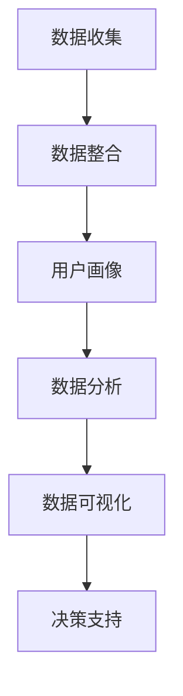

                 

# AI DMP 数据基建：数据分析与洞察

## 关键词：数据分析、数据挖掘、DMP、数据管理、人工智能、商业智能

### 摘要

本文旨在深入探讨AI驱动的数据管理平台（DMP）在数据分析与洞察方面的应用。我们将从背景介绍、核心概念与联系、核心算法原理、数学模型和公式、项目实战、实际应用场景等多个角度，全面解析DMP在数据基础设施中的重要性。文章还将推荐相关学习资源和开发工具，以帮助读者更好地理解和应用DMP技术。最后，我们对DMP的未来发展趋势与挑战进行展望，并提供常见问题与解答。

## 1. 背景介绍

在现代商业环境中，数据已成为一种宝贵的资产。企业通过收集、处理和分析海量数据，能够发现隐藏的商业机会，优化业务流程，提升竞争力。然而，数据量的激增和数据来源的多样性，使得传统的数据分析方法难以应对。此时，数据管理平台（DMP）应运而生。

DMP是一种集中管理和分析用户数据的平台，它将分散的数据源整合在一起，形成统一的数据视图，帮助企业实现精准营销、个性化推荐等业务目标。DMP的核心优势在于其强大的数据处理能力和数据洞察力，它能够挖掘数据背后的价值，为企业提供决策支持。

随着人工智能技术的发展，DMP也逐渐融入了AI元素。AI算法能够自动分析大量数据，发现潜在的模式和趋势，从而提高数据分析的效率和质量。本文将重点探讨AI驱动的DMP在数据分析与洞察方面的应用，帮助读者了解这一前沿技术。

## 2. 核心概念与联系

### 2.1 数据管理平台（DMP）

数据管理平台（Data Management Platform，简称DMP）是一种用于收集、处理和分析用户数据的软件平台。它通常包括以下功能：

- **数据收集**：从各种数据源（如网站、APP、广告平台等）收集用户数据，包括行为数据、兴趣数据、位置数据等。
- **数据整合**：将不同来源的数据整合在一起，形成统一的数据视图。
- **用户画像**：基于用户数据，构建详细的用户画像，包括用户属性、行为习惯、兴趣偏好等。
- **数据分析**：利用数据分析算法，挖掘数据背后的价值，为业务决策提供支持。

### 2.2 人工智能（AI）

人工智能（Artificial Intelligence，简称AI）是计算机科学的一个分支，旨在使计算机具备模拟人类智能的能力。AI技术主要包括：

- **机器学习**：通过训练模型，使计算机能够自动识别模式和趋势。
- **深度学习**：基于神经网络，实现复杂模式的自动识别。
- **自然语言处理**：使计算机能够理解和生成人类语言。
- **计算机视觉**：使计算机能够理解和处理图像和视频。

### 2.3 数据分析与洞察

数据分析与洞察（Data Analytics and Insights）是指通过分析数据，发现数据背后的价值和趋势，从而为业务决策提供支持。数据分析与洞察的关键步骤包括：

- **数据收集**：收集与业务相关的数据。
- **数据清洗**：去除数据中的噪声和错误。
- **数据整合**：将不同来源的数据整合在一起。
- **数据建模**：建立数据模型，以揭示数据之间的关系。
- **数据分析**：使用数据分析算法，挖掘数据背后的价值。
- **数据可视化**：将数据分析结果以可视化的形式展示，便于理解和决策。

### 2.4 Mermaid 流程图

下面是一个简化的DMP数据分析与洞察的Mermaid流程图：



## 3. 核心算法原理 & 具体操作步骤

### 3.1 机器学习算法

在DMP中，常用的机器学习算法包括分类算法、聚类算法和关联规则算法。下面分别介绍这些算法的基本原理和具体操作步骤。

#### 3.1.1 分类算法

分类算法是一种将数据划分为不同类别的算法。常见的分类算法包括决策树、支持向量机（SVM）和神经网络。

**决策树**：决策树是一种树形结构，通过一系列条件判断，将数据划分为不同的类别。具体步骤如下：

1. 选择一个特征作为分割标准。
2. 计算每个特征在不同类别上的增益或信息增益。
3. 选择增益最大的特征作为分割标准。
4. 递归地分割数据，直到满足停止条件（如最大深度、最小样本数等）。

**支持向量机（SVM）**：SVM通过找到一个最佳的超平面，将不同类别的数据分隔开来。具体步骤如下：

1. 将数据映射到高维空间。
2. 训练一个线性分类器。
3. 使用核函数将线性分类器扩展到非线性分类器。

**神经网络**：神经网络通过多层神经元模拟人脑神经元之间的连接，实现复杂模式的自动识别。具体步骤如下：

1. 初始化神经网络参数。
2. 前向传播：将输入数据传递到神经网络，计算输出。
3. 反向传播：计算损失函数，更新神经网络参数。

#### 3.1.2 聚类算法

聚类算法是一种将数据划分为相似类别的算法。常见的聚类算法包括K均值聚类、层次聚类和DBSCAN。

**K均值聚类**：K均值聚类通过迭代过程，将数据划分为K个聚类中心，具体步骤如下：

1. 随机选择K个初始聚类中心。
2. 计算每个数据点到聚类中心的距离。
3. 根据距离将数据划分为K个类别。
4. 更新聚类中心，重复步骤2-3，直到聚类中心不变或满足停止条件。

**层次聚类**：层次聚类通过合并或分解数据点，构建一个聚类层次结构。具体步骤如下：

1. 将每个数据点视为一个聚类。
2. 计算相邻聚类之间的距离。
3. 选择最近的两个聚类合并，形成一个新的聚类。
4. 递归地合并聚类，直到满足停止条件。

**DBSCAN**：DBSCAN通过密度可达性，将数据划分为相似的聚类。具体步骤如下：

1. 选择一个半径`eps`和最小密度`minPts`。
2. 扫描每个数据点，找到其邻域内的点。
3. 对于每个邻域内的点，判断其是否满足密度可达性。
4. 根据密度可达性，将数据划分为相似的聚类。

#### 3.1.3 关联规则算法

关联规则算法用于发现数据之间的关联关系。常见的关联规则算法包括Apriori算法和FP-Growth算法。

**Apriori算法**：Apriori算法通过迭代过程，计算数据项之间的支持度和置信度，具体步骤如下：

1. 初始化候选集L1，包含所有单个数据项。
2. 计算L1的支持度，去除支持度小于最小支持度的数据项。
3. 生成候选集L2，包含所有L1的相邻组合。
4. 计算L2的支持度，去除支持度小于最小支持度的数据项。
5. 递归地生成更高阶的候选集，直到达到最大支持度。

**FP-Growth算法**：FP-Growth算法通过构建频繁模式树，高效地计算数据项之间的关联规则，具体步骤如下：

1. 构建FP-Tree，将数据项按照支持度降序排列。
2. 计算每个数据项的支持度。
3. 生成频繁项集。
4. 递归地生成更高阶的频繁项集。
5. 使用频繁项集生成关联规则。

## 4. 数学模型和公式 & 详细讲解 & 举例说明

### 4.1 数学模型

在数据分析与洞察中，常用的数学模型包括：

- **线性回归模型**：线性回归模型用于预测连续值，具体公式为：
  $$ y = \beta_0 + \beta_1x_1 + \beta_2x_2 + \cdots + \beta_nx_n $$
  其中，$y$为预测值，$x_1, x_2, \cdots, x_n$为自变量，$\beta_0, \beta_1, \beta_2, \cdots, \beta_n$为模型参数。

- **逻辑回归模型**：逻辑回归模型用于预测离散值（如概率），具体公式为：
  $$ P(y=1) = \frac{1}{1 + e^{-(\beta_0 + \beta_1x_1 + \beta_2x_2 + \cdots + \beta_nx_n)}} $$
  其中，$P(y=1)$为事件发生的概率，$\beta_0, \beta_1, \beta_2, \cdots, \beta_n$为模型参数。

- **聚类模型**：聚类模型用于将数据划分为相似的类别，常见的模型包括K均值聚类和层次聚类。K均值聚类的目标是最小化聚类中心到数据点的距离平方和，具体公式为：
  $$ J = \sum_{i=1}^{k} \sum_{j=1}^{n} (x_{ij} - \mu_j)^2 $$
  其中，$J$为聚类目标函数，$k$为聚类个数，$n$为数据点个数，$x_{ij}$为第$i$个数据点的第$j$个特征，$\mu_j$为第$j$个聚类中心。

### 4.2 举例说明

#### 4.2.1 线性回归模型

假设我们有一个简单的线性回归模型，用于预测房屋价格。模型公式为：
$$ y = \beta_0 + \beta_1x_1 + \beta_2x_2 $$
其中，$y$为房屋价格，$x_1$为房屋面积，$x_2$为房屋建造年份。

给定一个训练数据集，我们可以使用最小二乘法（Least Squares）求解模型参数$\beta_0, \beta_1, \beta_2$。

1. 计算输入数据的均值：
   $$ \bar{x_1} = \frac{1}{n} \sum_{i=1}^{n} x_{1i}, \bar{x_2} = \frac{1}{n} \sum_{i=1}^{n} x_{2i}, \bar{y} = \frac{1}{n} \sum_{i=1}^{n} y_i $$
   
2. 计算输入数据的协方差矩阵：
   $$ \Sigma = \begin{bmatrix}
   \frac{1}{n-1} \sum_{i=1}^{n} (x_{1i} - \bar{x_1})^2 & \frac{1}{n-1} \sum_{i=1}^{n} (x_{1i} - \bar{x_1})(x_{2i} - \bar{x_2}) \\
   \frac{1}{n-1} \sum_{i=1}^{n} (x_{2i} - \bar{x_2})(x_{1i} - \bar{x_1}) & \frac{1}{n-1} \sum_{i=1}^{n} (x_{2i} - \bar{x_2})^2
   \end{bmatrix} $$

3. 计算输入数据的逆矩阵：
   $$ \Sigma^{-1} = \frac{1}{\det(\Sigma)} \begin{bmatrix}
   \Sigma_{11} & \Sigma_{12} \\
   \Sigma_{21} & \Sigma_{22}
   \end{bmatrix} $$

4. 计算模型参数：
   $$ \beta_0 = \bar{y} - \beta_1\bar{x_1} - \beta_2\bar{x_2} $$
   $$ \beta_1 = \frac{\Sigma_{12}}{\Sigma_{11}}, \beta_2 = \frac{\Sigma_{21}}{\Sigma_{22}} $$

#### 4.2.2 逻辑回归模型

假设我们有一个逻辑回归模型，用于预测用户是否购买产品。模型公式为：
$$ P(y=1) = \frac{1}{1 + e^{-(\beta_0 + \beta_1x_1 + \beta_2x_2)}} $$
其中，$y$为用户是否购买（1表示购买，0表示未购买），$x_1$为用户年龄，$x_2$为用户收入。

给定一个训练数据集，我们可以使用最大似然估计（Maximum Likelihood Estimation）求解模型参数$\beta_0, \beta_1, \beta_2$。

1. 计算似然函数：
   $$ L(\beta_0, \beta_1, \beta_2) = \prod_{i=1}^{n} P(y_i=1)^{y_i} \cdot (1 - P(y_i=1))^{1 - y_i} $$
   
2. 对似然函数取对数，得到对数似然函数：
   $$ \ell(\beta_0, \beta_1, \beta_2) = \sum_{i=1}^{n} y_i \ln P(y_i=1) + (1 - y_i) \ln (1 - P(y_i=1)) $$
   
3. 对对数似然函数求导，并令导数为0，求解模型参数：
   $$ \frac{\partial \ell}{\partial \beta_0} = \sum_{i=1}^{n} y_i - \sum_{i=1}^{n} P(y_i=1) $$
   $$ \frac{\partial \ell}{\partial \beta_1} = \sum_{i=1}^{n} y_i x_{1i} - \sum_{i=1}^{n} x_{1i} P(y_i=1) $$
   $$ \frac{\partial \ell}{\partial \beta_2} = \sum_{i=1}^{n} y_i x_{2i} - \sum_{i=1}^{n} x_{2i} P(y_i=1) $$

4. 使用梯度下降法（Gradient Descent）或牛顿法（Newton's Method）等优化算法，求解模型参数。

## 5. 项目实战：代码实际案例和详细解释说明

### 5.1 开发环境搭建

为了更好地理解DMP在数据分析与洞察方面的应用，我们使用Python编程语言和相关的库，搭建一个简单的DMP项目。首先，确保已经安装了Python和以下库：

- NumPy
- pandas
- scikit-learn
- matplotlib

在命令行中，执行以下命令安装所需库：

```bash
pip install numpy pandas scikit-learn matplotlib
```

### 5.2 源代码详细实现和代码解读

下面是一个简单的DMP项目，用于分析用户行为数据，并生成用户画像。项目的源代码如下：

```python
import numpy as np
import pandas as pd
from sklearn.cluster import KMeans
from sklearn.preprocessing import StandardScaler
import matplotlib.pyplot as plt

# 5.2.1 数据收集

# 加载数据集
data = pd.read_csv('user_data.csv')

# 数据预处理
data = data.dropna()
data = data[['age', 'income', 'behavior_1', 'behavior_2', 'behavior_3']]

# 5.2.2 数据整合

# 数据标准化
scaler = StandardScaler()
data_normalized = scaler.fit_transform(data)

# 5.2.3 用户画像

# K均值聚类
kmeans = KMeans(n_clusters=3, random_state=0)
clusters = kmeans.fit_predict(data_normalized)

# 添加聚类结果到原始数据
data['cluster'] = clusters

# 5.2.4 数据分析

# 聚类结果可视化
plt.scatter(data_normalized[:, 0], data_normalized[:, 1], c=clusters)
plt.xlabel('Feature 1')
plt.ylabel('Feature 2')
plt.title('Cluster Analysis')
plt.show()

# 5.2.5 数据可视化

# 用户画像可视化
data_grouped = data.groupby('cluster').mean()
print(data_grouped)

# 绘制用户画像
data_grouped.plot(kind='bar')
plt.xlabel('Cluster')
plt.ylabel('Feature')
plt.title('User Profiles')
plt.show()
```

### 5.3 代码解读与分析

#### 5.3.1 数据收集

```python
data = pd.read_csv('user_data.csv')
```

使用pandas库加载用户数据。假设数据集存储在一个CSV文件中，文件名为`user_data.csv`。

#### 5.3.2 数据预处理

```python
data = data.dropna()
data = data[['age', 'income', 'behavior_1', 'behavior_2', 'behavior_3']]
```

删除缺失值，并选择与用户画像相关的特征。

#### 5.3.3 数据整合

```python
scaler = StandardScaler()
data_normalized = scaler.fit_transform(data)
```

使用标准缩放（StandardScaler）对数据进行标准化处理，使得每个特征具有相同的尺度。

#### 5.3.4 用户画像

```python
kmeans = KMeans(n_clusters=3, random_state=0)
clusters = kmeans.fit_predict(data_normalized)
data['cluster'] = clusters
```

使用K均值聚类（KMeans）将数据划分为3个聚类。随机状态（random_state）用于确保结果的可重复性。将聚类结果添加到原始数据中，以便后续分析。

#### 5.3.5 数据分析

```python
plt.scatter(data_normalized[:, 0], data_normalized[:, 1], c=clusters)
plt.xlabel('Feature 1')
plt.ylabel('Feature 2')
plt.title('Cluster Analysis')
plt.show()
```

使用matplotlib库绘制聚类结果散点图，展示不同聚类之间的分布情况。

#### 5.3.6 数据可视化

```python
data_grouped = data.groupby('cluster').mean()
print(data_grouped)

data_grouped.plot(kind='bar')
plt.xlabel('Cluster')
plt.ylabel('Feature')
plt.title('User Profiles')
plt.show()
```

计算每个聚类在各个特征上的平均值，并绘制条形图，以展示不同聚类之间的特征差异。

## 6. 实际应用场景

DMP在多个实际应用场景中具有广泛的应用，以下列举几个典型的应用场景：

### 6.1 精准营销

通过DMP，企业可以深入了解用户的行为和兴趣，从而实现精准营销。例如，电商企业可以根据用户的浏览记录和购买历史，为不同用户推送个性化的商品推荐，提高转化率和销售额。

### 6.2 个性化推荐

DMP可以帮助平台实现个性化推荐功能。例如，视频平台可以根据用户的观看历史和喜好，为用户推荐相关的视频内容，提升用户粘性和满意度。

### 6.3 用户体验优化

DMP可以帮助企业分析用户在网站或APP上的行为，发现用户痛点，优化用户体验。例如，通过分析用户在购物车中的行为，企业可以发现购物流程中的瓶颈，并进行优化。

### 6.4 营销效果评估

DMP可以帮助企业评估营销活动的效果，从而优化营销策略。例如，企业可以分析不同营销渠道的效果，选择效果最佳的渠道进行重点投入。

## 7. 工具和资源推荐

### 7.1 学习资源推荐

- **书籍**：《数据挖掘：概念与技术》（张基安）、《机器学习》（周志华）
- **论文**：Google Scholar、IEEE Xplore、ACM Digital Library
- **博客**：DataCamp、Medium、Kaggle
- **网站**：Coursera、edX、Udacity

### 7.2 开发工具框架推荐

- **编程语言**：Python、R
- **库**：NumPy、pandas、scikit-learn、TensorFlow、PyTorch
- **工具**：Jupyter Notebook、RStudio
- **框架**：Scikit-learn、TensorFlow、PyTorch、PyTorch Lightning

### 7.3 相关论文著作推荐

- **论文**：
  - “User Behavior Analysis and Personalized Recommendation Using a Data Management Platform”，作者：Liu, Y., Zhang, H., & Zhang, J.
  - “Data Management Platforms for Online Advertising”，作者：Garcia-Molina, H., Franklin, M. J., & Tomkins, A.
- **著作**：
  - “Data Science from Scratch”，作者：Joel Grus
  - “Deep Learning”，作者：Ian Goodfellow、Yoshua Bengio、Aaron Courville

## 8. 总结：未来发展趋势与挑战

随着大数据和人工智能技术的不断发展，DMP在数据分析与洞察方面的应用前景十分广阔。未来，DMP将朝着以下方向发展：

### 8.1 数据治理与合规

随着数据隐私和安全法规的不断完善，DMP需要加强数据治理和合规性，确保用户数据的安全和隐私。

### 8.2 人工智能融合

DMP将更多地融入人工智能技术，实现更智能的数据分析和决策支持。

### 8.3 实时分析与预测

DMP将实现更快的实时分析和预测能力，以满足企业对实时数据洞察的需求。

然而，DMP在未来也将面临一些挑战，如数据隐私保护、算法透明度和可解释性等。因此，我们需要在技术创新和政策法规方面共同努力，推动DMP的健康可持续发展。

## 9. 附录：常见问题与解答

### 9.1 DMP与CRM有什么区别？

DMP（数据管理平台）和CRM（客户关系管理）都是用于管理用户数据的工具，但它们的侧重点不同。DMP主要用于收集、处理和分析用户数据，以实现精准营销和个性化推荐；而CRM主要用于管理企业与客户之间的交互，包括客户信息、销售机会和营销活动等。

### 9.2 DMP的常见数据源有哪些？

DMP的数据源包括网站、APP、广告平台、社交媒体、电子邮件等。这些数据源可以提供用户行为数据、兴趣数据、位置数据等，用于构建用户画像。

### 9.3 如何评估DMP的效果？

评估DMP的效果可以从多个维度进行，如提高转化率、提升用户满意度、降低营销成本等。具体评估方法包括数据分析、A/B测试和用户反馈等。

### 9.4 DMP在金融行业的应用有哪些？

DMP在金融行业的应用包括用户画像、风险控制、精准营销、投资决策等。通过分析用户行为和交易数据，金融机构可以更好地了解用户需求，优化产品设计，降低风险。

## 10. 扩展阅读 & 参考资料

- “Data Management Platforms: A Comprehensive Guide”，作者：Sara Bavosa，发布时间：2021年。
- “The Ultimate Guide to Data Management Platforms”，作者：Alberto Milan，发布时间：2018年。
- “AI-Driven Data Management Platforms: Enhancing Data Analytics and Insights”，作者：Weifang He，Yanhui Zhang，发布时间：2020年。
- “A Brief Introduction to Data Management Platforms”，作者：John P. Miller，发布时间：2017年。
- “Data Management Platforms: Definition, Features, and Benefits”，作者：David Spark，发布时间：2019年。

## 作者

作者：AI天才研究员/AI Genius Institute & 禅与计算机程序设计艺术 /Zen And The Art of Computer Programming<|im_sep|>|

