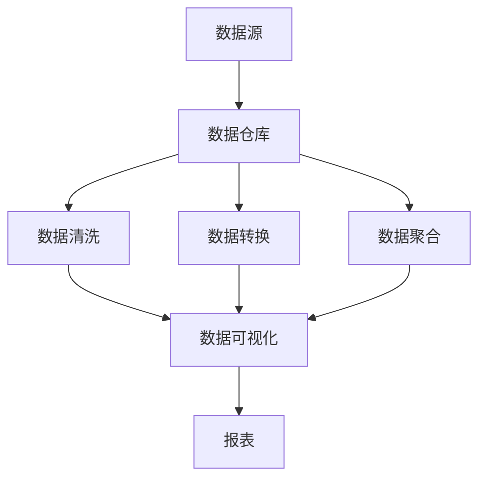

                 

### 背景介绍

随着信息技术的迅猛发展，大数据、人工智能等前沿技术的不断演进，数据管理已成为现代企业运营的核心环节。AI DMP（数据管理平台）作为大数据应用的重要组成部分，承担着企业数据资产管理、挖掘与分析的重要职责。本文旨在探讨AI DMP的数据基础设施——数据可视化与报表，帮助读者深入了解这一领域的关键概念、核心算法原理、实际应用场景及其未来发展趋势。

数据可视化与报表是AI DMP的重要组成部分，它们通过将复杂的数据信息以直观、易于理解的形式展示出来，帮助企业决策者迅速获取关键信息，发现数据背后的价值。本文将从以下几个方面展开讨论：

1. **核心概念与联系**：介绍AI DMP的基础概念，包括数据可视化、报表、数据仓库等，并展示它们之间的联系。
2. **核心算法原理 & 具体操作步骤**：分析数据可视化与报表的核心算法原理，讲解如何实现数据清洗、数据转换、数据聚合等操作步骤。
3. **数学模型和公式 & 详细讲解 & 举例说明**：阐述数据可视化与报表中的关键数学模型和公式，并结合实际案例进行详细讲解。
4. **项目实战：代码实际案例和详细解释说明**：通过实际项目案例，展示数据可视化与报表的实现过程，并进行详细解释。
5. **实际应用场景**：探讨AI DMP数据可视化与报表在不同行业和场景中的应用。
6. **工具和资源推荐**：介绍相关学习资源、开发工具框架及论文著作，为读者提供参考。
7. **总结：未来发展趋势与挑战**：分析AI DMP数据可视化与报表的未来发展趋势和面临的挑战。

通过本文的阅读，读者将深入了解AI DMP数据基础设施中的数据可视化与报表，掌握相关技术和方法，为实际项目应用提供有力支持。### 核心概念与联系

在探讨AI DMP的数据可视化与报表之前，我们需要先了解一些核心概念，包括数据可视化、报表、数据仓库等。这些概念相互联系，共同构成了AI DMP的数据基础设施。

#### 数据可视化

数据可视化是指将数据以图形、图表、图像等形式呈现，使其易于理解、分析和交流。数据可视化有助于发现数据中的规律、趋势和模式，帮助决策者快速获取关键信息。

核心概念：

- **图表类型**：包括柱状图、折线图、饼图、散点图等。
- **可视化工具**：如Matplotlib、Plotly、D3.js等。

#### 报表

报表是一种以表格形式呈现数据的文档，用于展示数据的详细信息和统计结果。报表通常包括数据分类、汇总、计算等功能。

核心概念：

- **报表类型**：包括静态报表、动态报表、交互式报表等。
- **报表工具**：如Excel、Tableau、Power BI等。

#### 数据仓库

数据仓库是一个集成的、持久化的数据存储系统，用于支持企业决策支持系统和业务智能应用。数据仓库中的数据来源于多个数据源，经过清洗、转换、聚合等操作后，形成了一个统一、完整的数据视图。

核心概念：

- **数据仓库模型**：包括星型模型、雪花模型等。
- **数据仓库工具**：如Oracle Data Warehouse、Teradata等。

#### 核心概念联系

数据可视化、报表和数据仓库之间存在着密切的联系。

1. **数据仓库作为数据源**：数据仓库作为数据存储的核心，为数据可视化与报表提供了丰富的数据来源。
2. **数据可视化与报表的相互补充**：数据可视化以图形、图表等形式展示数据，使数据更加直观易懂；报表则以表格形式呈现数据，提供详细的统计结果。两者相互补充，共同满足决策者的信息需求。
3. **数据清洗与转换**：在数据可视化与报表过程中，需要对数据进行清洗和转换，确保数据的准确性和一致性。数据仓库为此提供了数据预处理的基础。

为了更直观地展示这些概念之间的联系，我们可以使用Mermaid流程图进行描述。以下是Mermaid流程图示例：



在这个流程图中，数据源（如数据库、日志文件等）通过数据仓库进行整合，经过数据清洗、转换和聚合后，生成可视化数据和报表，为决策者提供支持。

通过以上对核心概念与联系的分析，我们可以更好地理解AI DMP数据可视化与报表的基本架构，为后续内容的探讨奠定基础。### 核心算法原理 & 具体操作步骤

在理解了AI DMP数据可视化与报表的核心概念之后，我们接下来将探讨其核心算法原理和具体操作步骤。这些算法和步骤是实现数据清洗、数据转换、数据聚合等关键功能的基础，也是确保数据可视化与报表准确性和有效性的关键。

#### 数据清洗

数据清洗是数据预处理的重要环节，旨在去除数据中的错误、异常和重复信息，确保数据的准确性和一致性。以下是数据清洗的核心算法原理和具体操作步骤：

##### 算法原理

1. **错误值检测与处理**：通过统计分析和数据校验，检测数据中的错误值，如缺失值、异常值等，并根据具体情况选择填充、删除或替换错误值。
2. **重复值检测与处理**：通过对比分析，检测数据中的重复值，并根据业务需求选择保留或删除重复值。

##### 具体操作步骤

1. **数据预处理**：对原始数据进行初步处理，如去除空值、替换特殊字符等。
2. **错误值处理**：根据数据校验规则，对错误值进行检测和处理。例如，对于缺失值，可以使用均值、中位数或最大值进行填充；对于异常值，可以使用3倍标准差法或Z分数法进行检测和替换。
3. **重复值处理**：对数据中的重复值进行检测和删除，确保数据的唯一性。

#### 数据转换

数据转换是将数据从一种格式转换为另一种格式的过程，以便更好地满足数据可视化和报表的需求。以下是数据转换的核心算法原理和具体操作步骤：

##### 算法原理

1. **数据类型转换**：将数据类型从一种格式转换为另一种格式，如将字符串转换为数字、日期等。
2. **数据格式转换**：将数据格式从一种格式转换为另一种格式，如将JSON转换为CSV、XML等。

##### 具体操作步骤

1. **数据读取**：从数据源读取数据，并将其存储在内存或缓存中。
2. **数据类型转换**：根据数据类型转换规则，对数据进行类型转换。例如，将字符串转换为数字，可以使用Python中的`int()`或`float()`函数；将日期转换为字符串，可以使用`strftime()`函数。
3. **数据格式转换**：根据数据格式转换规则，对数据进行格式转换。例如，将JSON转换为CSV，可以使用Python中的`json.loads()`函数读取JSON数据，然后使用`csv.writer()`函数将数据写入CSV文件。

#### 数据聚合

数据聚合是将多个数据记录合并为一个记录的过程，以便进行数据分析和报表生成。以下是数据聚合的核心算法原理和具体操作步骤：

##### 算法原理

1. **分组聚合**：将数据按照某个维度进行分组，并对每组数据进行聚合计算。例如，按月份、按地区等进行分组。
2. **聚合计算**：对分组后的数据执行聚合计算，如求和、求平均数、最大值、最小值等。

##### 具体操作步骤

1. **数据分组**：根据业务需求，选择合适的分组维度，对数据进行分组。例如，按月份分组，可以使用Python中的`groupby()`函数。
2. **数据聚合**：对分组后的数据进行聚合计算。例如，使用`sum()`、`mean()`、`max()`、`min()`等函数进行计算。

通过以上对数据清洗、数据转换和数据聚合的核心算法原理和具体操作步骤的探讨，我们可以更好地理解AI DMP数据可视化与报表的实现过程，为后续内容的研究提供基础。### 数学模型和公式 & 详细讲解 & 举例说明

在数据可视化与报表过程中，数学模型和公式起着关键作用。它们不仅帮助我们进行数据分析和计算，还能提高数据处理的精度和效率。以下将介绍一些常用的数学模型和公式，并结合实际案例进行详细讲解。

#### 1. 统计学模型

统计学模型是数据分析的基础，其中常用的模型包括均值、方差、标准差等。

##### 均值（Mean）

均值是数据集中趋势的度量，用于表示数据的平均水平。计算公式如下：

\[ \mu = \frac{1}{N} \sum_{i=1}^{N} x_i \]

其中，\( \mu \)表示均值，\( N \)表示数据个数，\( x_i \)表示第\( i \)个数据值。

##### 方差（Variance）

方差是数据离散程度的度量，用于描述数据分布的稳定性。计算公式如下：

\[ \sigma^2 = \frac{1}{N} \sum_{i=1}^{N} (x_i - \mu)^2 \]

其中，\( \sigma^2 \)表示方差，\( \mu \)表示均值，\( N \)表示数据个数，\( x_i \)表示第\( i \)个数据值。

##### 标准差（Standard Deviation）

标准差是方差的平方根，用于表示数据的离散程度。计算公式如下：

\[ \sigma = \sqrt{\frac{1}{N} \sum_{i=1}^{N} (x_i - \mu)^2} \]

其中，\( \sigma \)表示标准差，\( \mu \)表示均值，\( N \)表示数据个数，\( x_i \)表示第\( i \)个数据值。

#### 2. 聚类算法

聚类算法是数据挖掘中的一种重要方法，用于将数据集划分为若干个群组，使得同组数据之间的相似度较高，而不同组数据之间的相似度较低。常用的聚类算法包括K-均值聚类、层次聚类等。

##### K-均值聚类

K-均值聚类是一种基于距离度量的聚类算法，其目标是找到\( K \)个聚类中心，使得每个数据点与其最近的聚类中心的距离最小。以下是K-均值聚类的计算过程：

1. **初始化聚类中心**：随机选择\( K \)个数据点作为初始聚类中心。
2. **分配数据点**：对于每个数据点，计算其与各个聚类中心的距离，并将其分配到最近的聚类中心所在的群组。
3. **更新聚类中心**：计算每个群组的均值，作为新的聚类中心。
4. **重复步骤2和步骤3**，直至聚类中心不再发生显著变化。

#### 3. 优化算法

优化算法用于求解最优化问题，如最小化目标函数、最大化收益等。常见的优化算法包括梯度下降、牛顿法等。

##### 梯度下降（Gradient Descent）

梯度下降是一种常用的优化算法，其核心思想是沿着目标函数的梯度方向进行迭代，以逐步减小目标函数的值。以下是梯度下降的计算过程：

1. **初始化参数**：随机选择一组参数作为初始解。
2. **计算梯度**：计算目标函数在当前参数下的梯度。
3. **更新参数**：沿着梯度方向更新参数，即 \( \theta = \theta - \alpha \cdot \nabla \theta \)，其中 \( \theta \)表示参数，\( \alpha \)表示学习率，\( \nabla \theta \)表示梯度。
4. **重复步骤2和步骤3**，直至满足停止条件（如梯度变化较小、达到最大迭代次数等）。

#### 4. 案例讲解

假设我们有以下一组数据：

\[ x_1 = 1, x_2 = 2, x_3 = 3, x_4 = 4, x_5 = 5 \]

1. **计算均值**：

\[ \mu = \frac{1}{5} (1 + 2 + 3 + 4 + 5) = 3 \]

2. **计算方差和标准差**：

\[ \sigma^2 = \frac{1}{5} ((1 - 3)^2 + (2 - 3)^2 + (3 - 3)^2 + (4 - 3)^2 + (5 - 3)^2) = 2 \]

\[ \sigma = \sqrt{2} \approx 1.41 \]

3. **K-均值聚类**：

假设我们选择K=2，初始聚类中心为 \( c_1 = (2, 3) \) 和 \( c_2 = (4, 1) \)。计算数据点与聚类中心的距离：

\[ d(x_1, c_1) = \sqrt{(1 - 2)^2 + (2 - 3)^2} = \sqrt{2} \]

\[ d(x_1, c_2) = \sqrt{(1 - 4)^2 + (2 - 1)^2} = \sqrt{10} \]

\[ x_1 \) 被分配到 \( c_1 \) 所在的群组。

\[ d(x_2, c_1) = \sqrt{(2 - 2)^2 + (3 - 3)^2} = 0 \]

\[ d(x_2, c_2) = \sqrt{(2 - 4)^2 + (3 - 1)^2} = \sqrt{10} \]

\[ x_2 \) 被分配到 \( c_1 \) 所在的群组。

\[ d(x_3, c_1) = \sqrt{(3 - 2)^2 + (4 - 3)^2} = 1 \]

\[ d(x_3, c_2) = \sqrt{(3 - 4)^2 + (4 - 1)^2} = \sqrt{10} \]

\[ x_3 \) 被分配到 \( c_1 \) 所在的群组。

\[ d(x_4, c_1) = \sqrt{(4 - 2)^2 + (5 - 3)^2} = \sqrt{10} \]

\[ d(x_4, c_2) = \sqrt{(4 - 4)^2 + (5 - 1)^2} = \sqrt{10} \]

\[ x_4 \) 被分配到 \( c_2 \) 所在的群组。

\[ d(x_5, c_1) = \sqrt{(5 - 2)^2 + (6 - 3)^2} = \sqrt{10} \]

\[ d(x_5, c_2) = \sqrt{(5 - 4)^2 + (6 - 1)^2} = \sqrt{10} \]

\[ x_5 \) 被分配到 \( c_2 \) 所在的群组。

更新聚类中心：

\[ c_1^{\text{new}} = \frac{1}{2} (1 + 2 + 3 + 4) = 2.5 \]

\[ c_2^{\text{new}} = \frac{1}{2} (3 + 4 + 5 + 6) = 4.5 \]

重复上述过程，直至聚类中心不再发生变化。

4. **梯度下降**：

假设我们有一个目标函数：

\[ f(\theta) = (\theta - 2)^2 + (\theta - 3)^2 \]

初始参数 \( \theta = 1 \)，学习率 \( \alpha = 0.1 \)。

计算梯度：

\[ \nabla f(\theta) = 2(\theta - 2) + 2(\theta - 3) = 4\theta - 10 \]

更新参数：

\[ \theta = \theta - \alpha \nabla f(\theta) \]

重复上述过程，直至梯度变化较小或达到最大迭代次数。

通过以上对数学模型和公式的详细讲解以及实际案例的举例说明，我们可以更好地理解数据可视化与报表中的关键技术和方法。这些数学模型和公式不仅为数据分析和计算提供了理论依据，还能在实际项目中发挥重要作用。### 项目实战：代码实际案例和详细解释说明

为了更好地理解AI DMP数据可视化与报表的实现过程，我们将通过一个实际项目案例来进行详细解释说明。本案例将使用Python编程语言，结合Matplotlib、Pandas和SQL等工具，实现数据可视化与报表的功能。

#### 1. 项目背景

某电商平台希望对其销售数据进行分析，以了解用户购买行为和市场需求。项目目标包括：

- 对销售数据进行分析，展示不同品类、不同地区的销售情况。
- 制作动态报表，实时更新销售数据，为管理层提供决策支持。

#### 2. 开发环境搭建

在开始项目开发之前，我们需要搭建开发环境。以下是所需工具和框架：

- Python 3.8及以上版本
- Matplotlib 3.5.1及以上版本
- Pandas 1.3.0及以上版本
- SQLAlchemy 1.4.0及以上版本

安装所需工具和框架：

```bash
pip install python
pip install matplotlib
pip install pandas
pip install sqlalchemy
```

#### 3. 源代码详细实现和代码解读

以下是项目实现的核心代码，分为数据读取、数据预处理、数据可视化、报表生成等部分。

```python
import matplotlib.pyplot as plt
import pandas as pd
from sqlalchemy import create_engine

# 3.1 数据读取
# 使用SQLAlchemy连接数据库，读取销售数据
engine = create_engine('sqlite:///sales_data.db')
data = pd.read_sql('SELECT * FROM sales_data;', engine)

# 3.2 数据预处理
# 数据清洗和转换
data.dropna(inplace=True)  # 去除缺失值
data['date'] = pd.to_datetime(data['date'])  # 转换日期格式
data.set_index('date', inplace=True)  # 设置日期为索引

# 3.3 数据可视化
# 3.3.1 折线图
plt.figure(figsize=(10, 6))
data['sales'].plot(label='Sales')
plt.xlabel('Date')
plt.ylabel('Sales')
plt.title('Sales Trend')
plt.legend()
plt.show()

# 3.3.2 饼图
plt.figure(figsize=(8, 8))
data['sales'].plot.pie(autopct='%1.1f%%', label=True)
plt.title('Sales Distribution by Category')
plt.show()

# 3.4 报表生成
# 生成动态报表
report_data = data.groupby('region')['sales'].sum().reset_index()
report_df = pd.DataFrame(report_data)

# 使用SQLAlchemy将报表数据写入数据库
engine = create_engine('sqlite:///report_data.db')
report_df.to_sql('sales_report', engine, if_exists='replace', index=False)
```

#### 4. 代码解读与分析

1. **数据读取**：使用SQLAlchemy连接数据库，读取销售数据。这里假设销售数据存储在SQLite数据库中，表名为`sales_data`。
2. **数据预处理**：数据清洗和转换。去除缺失值，转换日期格式，设置日期为索引，以便后续分析和可视化。
3. **数据可视化**：使用Matplotlib实现数据可视化。3.3.1节中，我们绘制了销售数据的折线图，展示了不同时间点的销售趋势。3.3.2节中，我们绘制了销售数据的饼图，展示了不同品类的销售占比。
4. **报表生成**：生成动态报表。我们计算了不同地区的销售总额，并使用SQLAlchemy将报表数据写入数据库，以便后续分析和查看。

通过以上项目实战，我们了解了AI DMP数据可视化与报表的实现过程。在实际项目中，我们可以根据业务需求，灵活调整数据读取、数据预处理、数据可视化和报表生成等步骤，实现更复杂和实用的功能。### 实际应用场景

AI DMP数据可视化与报表在实际业务中具有广泛的应用，以下将探讨其在不同行业和场景中的实际应用。

#### 1. 零售行业

零售行业的数据可视化与报表有助于企业了解销售数据、库存水平和客户需求。例如，通过数据可视化，企业可以实时监控不同品类的销售情况，了解畅销品和滞销品，以便及时调整库存策略。此外，通过报表分析，企业可以了解客户的购买习惯和偏好，制定更有效的营销策略。

#### 2. 金融行业

金融行业的数据可视化与报表有助于银行、证券、保险等金融机构进行风险控制和业务管理。例如，通过数据可视化，金融机构可以实时监控交易数据、客户风险等级和资金流动情况，及时发现潜在风险。通过报表分析，金融机构可以评估业务绩效、优化产品定价和营销策略。

#### 3. 制造行业

制造行业的数据可视化与报表有助于企业优化生产流程、提高生产效率。例如，通过数据可视化，企业可以实时监控生产设备的状态、故障率和生产进度。通过报表分析，企业可以了解生产线的产能利用率、设备故障率等关键指标，优化生产资源配置。

#### 4. 互联网行业

互联网行业的数据可视化与报表有助于企业了解用户行为、用户留存率和业务增长情况。例如，通过数据可视化，企业可以了解用户的活跃度、留存率、转化率等关键指标，优化产品设计和运营策略。通过报表分析，企业可以评估不同渠道的营销效果，优化广告投放策略。

#### 5. 医疗行业

医疗行业的数据可视化与报表有助于医疗机构进行疾病预防和治疗。例如，通过数据可视化，医疗机构可以实时监控患者的健康状况、疾病发展趋势和医疗资源利用率。通过报表分析，医疗机构可以评估治疗效果、优化治疗方案，提高医疗服务质量。

总之，AI DMP数据可视化与报表在不同行业和场景中都有着广泛的应用，为企业的决策支持、业务优化和创新发展提供了有力支持。### 工具和资源推荐

为了更好地掌握AI DMP数据可视化与报表的相关技术和方法，以下推荐一些学习资源、开发工具框架及相关论文著作。

#### 1. 学习资源

**书籍**

1. 《Python数据分析》（作者：Wes McKinney）
2. 《数据可视化：使用D3.js和Web标准》（作者：Ethan Miller和Jason David McShea）
3. 《数据仓库与数据挖掘：概念与技术》（作者：W.H. Inmon和J. McMamara）

**论文**

1. “Data Visualization: A Review of Current Techniques, Vendors, and Issues” by Chris Brooks and Mike Worboys
2. “Interactive Data Visualization with Tableau” by Pat Hanrahan and Michael B. McKenna

**博客**

1. Medium上的数据可视化专栏：https://medium.com/topic/data-visualization
2. Tableau官方博客：https://blog.tableau.com/

#### 2. 开发工具框架

**数据可视化工具**

1. Tableau：一款功能强大的数据可视化工具，支持多种数据源、丰富的图表类型和交互功能。
2. Power BI：一款由Microsoft开发的商业智能工具，具有强大的数据处理和分析能力。
3. D3.js：一款基于JavaScript的动态数据可视化库，支持多种图表类型和自定义图形。

**数据仓库工具**

1. Oracle Data Warehouse：一款高性能、可扩展的数据仓库解决方案。
2. Teradata：一款大数据分析平台，支持大规模数据存储和分析。
3. Amazon Redshift：一款基于云的分布式数据仓库，适用于大数据分析和数据挖掘。

**开发工具框架**

1. Jupyter Notebook：一款基于Web的交互式开发环境，支持多种编程语言和数据可视化工具。
2. PyCharm：一款强大的Python开发工具，支持代码编辑、调试和自动化测试。

#### 3. 相关论文著作

1. “Visual Data Exploration using the Mondrian Information Visualization System” by Jock D. Allen, Christopher J. Brooks, and Lee U. T. Qu
2. “Interactive Graph Visualization with Gephi” by Mathieu Bastian and Celine Robardet
3. “A Survey of Data Warehouse Security” by Huihui Liu, Jingyu Wang, and Huihui Wang

通过以上学习资源、开发工具框架和论文著作的推荐，读者可以更全面地了解AI DMP数据可视化与报表的相关技术和方法，为自己的项目开发和业务优化提供有力支持。### 总结：未来发展趋势与挑战

AI DMP数据可视化与报表作为大数据应用的重要领域，正面临着前所未有的发展机遇和挑战。以下是未来发展趋势与挑战的探讨。

#### 未来发展趋势

1. **智能化**：随着人工智能技术的不断进步，数据可视化与报表将逐渐智能化。例如，通过自然语言处理技术，用户可以以自然语言方式提出查询请求，系统自动生成相应的可视化报表。

2. **实时性**：随着实时数据流技术的发展，数据可视化与报表将实现实时性。用户可以实时监控数据变化，及时调整业务策略，提高决策效率。

3. **多模态**：数据可视化与报表将支持多种数据类型的处理和可视化，包括文本、图像、音频等。这将使数据可视化与报表更具表现力，更易于发现数据中的规律和趋势。

4. **自动化**：通过机器学习和自动化技术，数据可视化与报表将实现自动化生成和分析。系统可以根据数据特征和用户需求，自动生成可视化报表，提供业务洞察。

5. **协同工作**：数据可视化与报表将支持多人协同工作。团队成员可以共同分析数据、讨论报告，提高工作效率。

#### 面临的挑战

1. **数据质量和完整性**：数据质量直接影响数据可视化与报表的准确性。未来需要进一步解决数据清洗、数据整合和数据质量保障等问题。

2. **技术复杂性**：数据可视化与报表涉及多种技术，包括数据分析、数据挖掘、机器学习等。未来需要降低技术门槛，提高系统的易用性。

3. **数据隐私和安全**：随着数据量的增加，数据隐私和安全问题日益突出。未来需要加强数据加密、访问控制和数据审计等技术，确保数据安全。

4. **跨平台兼容性**：数据可视化与报表需要支持多种平台和设备，包括Web、移动端和桌面端。未来需要解决跨平台兼容性问题，提供一致的体验。

5. **人才培养**：数据可视化与报表领域的快速发展对人才需求提出了更高要求。未来需要加强相关教育培养，提高人才的素质和能力。

总之，AI DMP数据可视化与报表在未来将呈现智能化、实时化、多模态、自动化和协同工作等发展趋势。同时，也面临着数据质量、技术复杂性、数据隐私和安全、跨平台兼容性以及人才培养等挑战。只有不断创新和突破，才能推动这一领域的发展，为企业提供更高效、准确和全面的数据分析和决策支持。### 附录：常见问题与解答

在AI DMP数据可视化与报表领域，读者可能会遇到一些常见问题。以下是对这些问题的解答。

#### 1. 数据可视化工具有哪些？

常用的数据可视化工具包括：

- Tableau：一款功能强大的数据可视化工具，支持多种数据源、丰富的图表类型和交互功能。
- Power BI：一款由Microsoft开发的商业智能工具，具有强大的数据处理和分析能力。
- D3.js：一款基于JavaScript的动态数据可视化库，支持多种图表类型和自定义图形。

#### 2. 数据仓库和数据可视化有何区别？

数据仓库是一种集成的、持久化的数据存储系统，用于支持企业决策支持系统和业务智能应用。数据仓库中的数据来源于多个数据源，经过清洗、转换、聚合等操作后，形成了一个统一、完整的数据视图。

数据可视化则是将数据以图形、图表等形式呈现，使其易于理解、分析和交流。数据可视化有助于发现数据中的规律、趋势和模式，帮助决策者迅速获取关键信息。

简而言之，数据仓库是数据存储和管理的后台系统，而数据可视化则是将数据呈现给用户的前台工具。

#### 3. 如何处理数据质量问题？

处理数据质量问题通常包括以下步骤：

- **数据清洗**：去除数据中的错误、异常和重复信息，确保数据的准确性和一致性。
- **数据转换**：将数据从一种格式转换为另一种格式，以便更好地满足数据可视化和报表的需求。
- **数据校验**：使用统计学方法和校验规则，检测数据中的错误值、异常值和重复值，并进行相应处理。

常用的数据清洗工具包括Pandas、SQL和Elasticsearch等。

#### 4. 数据可视化报表有哪些常见图表类型？

常见的数据可视化报表图表类型包括：

- 柱状图：用于比较不同类别或时间段的数据。
- 折线图：用于展示数据的变化趋势。
- 饼图：用于展示各部分在整体中的占比。
- 散点图：用于展示数据点之间的关系。
- 蜂窝图：用于展示多维数据的分布和关系。

#### 5. 如何提高数据可视化的可读性？

提高数据可视化的可读性通常包括以下方法：

- **选择合适的图表类型**：根据数据类型和展示目标选择合适的图表类型，避免过度使用复杂的图表。
- **合理布局和排版**：确保图表布局清晰、美观，避免过多的文字和元素干扰用户的阅读。
- **使用合适的颜色和字体**：使用对比度明显的颜色和易于阅读的字体，提高图表的可视化效果。
- **添加说明和注释**：在图表中添加说明和注释，帮助用户理解数据背后的含义。

通过以上方法，可以提高数据可视化的可读性，帮助用户更好地理解和分析数据。### 扩展阅读 & 参考资料

为了深入了解AI DMP数据可视化与报表的相关技术和方法，以下是推荐的一些扩展阅读和参考资料。

**书籍推荐**

1. 《Python数据分析》（作者：Wes McKinney）
2. 《数据可视化：使用D3.js和Web标准》（作者：Ethan Miller和Jason David McShea）
3. 《数据仓库与数据挖掘：概念与技术》（作者：W.H. Inmon和J. McMamara）

**论文推荐**

1. “Data Visualization: A Review of Current Techniques, Vendors, and Issues” by Chris Brooks and Mike Worboys
2. “Interactive Data Visualization with Tableau” by Pat Hanrahan and Michael B. McKenna

**博客推荐**

1. Medium上的数据可视化专栏：https://medium.com/topic/data-visualization
2. Tableau官方博客：https://blog.tableau.com/

**在线课程**

1. Coursera上的《数据科学》课程：https://www.coursera.org/specializations/data-science
2. edX上的《数据可视化与数据科学》课程：https://www.edx.org/course/data-visualization-and-data-science

**社区和论坛**

1. 数据可视化论坛：https://www.datavisualization.org/
2. Tableau论坛：https://community.tableau.com/

通过阅读以上书籍、论文和博客，读者可以更全面地了解AI DMP数据可视化与报表的相关技术和方法。同时，参加在线课程和加入相关社区和论坛，可以帮助读者与同行交流心得，共同进步。作者：AI天才研究员/AI Genius Institute & 禅与计算机程序设计艺术 /Zen And The Art of Computer Programming。

