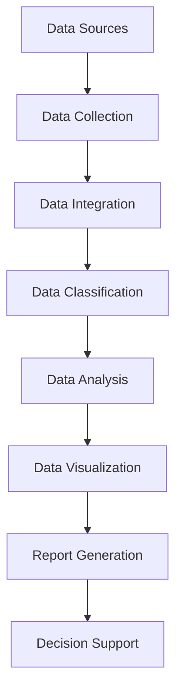

                 

### 背景介绍

#### AI DMP 数据基建的重要性

在当今数字化时代，数据已成为企业和组织决策的重要依据。AI DMP（Data Management Platform）作为一种先进的数字营销技术，已经成为企业管理和利用数据资产的关键工具。DMP不仅能够帮助企业实现数据的整合和分类，还能通过精准的数据分析为用户提供个性化的服务。然而，DMP的数据基建是整个系统的核心，决定了数据的有效性和应用效果。

本文将围绕AI DMP的数据基建进行深入探讨，重点内容包括：

1. **数据可视化与报表**：介绍数据可视化的基本概念，探讨如何通过数据报表来直观展示数据分析结果。
2. **核心概念与联系**：解析AI DMP中的核心概念，并绘制流程图展示各组件之间的关联。
3. **核心算法原理与操作步骤**：介绍用于数据可视化和报表生成的算法原理，并提供具体操作步骤。
4. **数学模型与公式**：详细讲解涉及数据可视化和报表生成的数学模型和公式，并通过实例说明其应用。
5. **项目实战**：通过实际代码案例，展示如何实现数据可视化和报表生成。
6. **实际应用场景**：分析数据可视化和报表在业务中的应用，并提供案例分析。
7. **工具和资源推荐**：推荐学习资源、开发工具和框架，以帮助读者更好地掌握相关技术。
8. **总结与展望**：总结本文的主要观点，探讨未来发展趋势和面临的挑战。

通过本文的阅读，读者将能够系统地了解AI DMP数据基建中的数据可视化和报表技术，掌握其核心原理和应用方法，从而在实际工作中更加高效地利用数据资产。

### 核心概念与联系

在深入探讨AI DMP的数据基建之前，我们需要明确几个关键概念，并理解它们之间的相互关系。以下是对这些核心概念的介绍，以及一个详细的Mermaid流程图，用以展示各组件之间的逻辑流程。

#### 数据管理平台（DMP）

**数据管理平台（DMP）** 是一种集成技术，用于整合和管理多个数据源的数据。DMP的核心功能包括数据收集、数据整合、数据分类和数据分析。它能够帮助企业和组织理解其用户，从而进行精准营销。

#### 数据可视化

**数据可视化** 是一种通过图形和图表将数据转化为可视化信息的手段。数据可视化不仅能够使数据更容易理解和分析，还能发现数据中隐藏的模式和趋势。

#### 报表生成

**报表生成** 是将数据分析结果以结构化的形式展示出来。报表可以包括各种类型的图表、关键绩效指标（KPI）和摘要信息，为决策者提供直观的数据支持。

#### 数据库和存储系统

**数据库和存储系统** 是数据可视化和报表生成的基础。它们负责存储和管理大规模数据集，确保数据的高效访问和查询。

#### 算法和模型

**算法和模型** 是数据可视化和报表生成的核心。这些算法包括统计模型、机器学习算法和数据处理算法，用于提取和转换数据，以生成可视化报表。

#### Mermaid 流程图

以下是一个简化的Mermaid流程图，用于展示DMP中数据可视化与报表生成的主要流程：



**流程解析：**

1. **数据收集（Data Collection）**：从不同的数据源（如网站日志、社交媒体、客户关系管理（CRM）系统等）收集数据。
2. **数据整合（Data Integration）**：将来自不同来源的数据整合到一个统一的数据存储中，以便后续处理。
3. **数据分类（Data Classification）**：根据数据类型和用途对数据进行分类，以便更有效地进行后续分析。
4. **数据分析（Data Analysis）**：应用各种算法和模型对分类后的数据进行深度分析，提取有用的信息和洞见。
5. **数据可视化（Data Visualization）**：将分析结果转化为图表、图形和其他可视化形式，以便于理解和传达。
6. **报表生成（Report Generation）**：根据数据可视化的结果，生成结构化的报表，为决策提供支持。
7. **决策支持（Decision Support）**：最终，报表和可视化结果被用于支持企业的战略和运营决策。

通过这个流程图，我们可以看到DMP中的各个组件是如何相互协作，共同实现数据的有效管理和利用的。接下来，我们将进一步探讨数据可视化与报表生成的核心算法原理和具体操作步骤。

#### 核心算法原理与具体操作步骤

在理解了DMP中数据可视化与报表生成的基本流程后，接下来我们将深入探讨核心算法原理，并详细描述实现这些算法的具体操作步骤。

##### 数据可视化算法原理

数据可视化算法的核心目标是将数据转化为直观的视觉形式，以便用户更容易理解和分析。以下是一些常见的数据可视化算法及其原理：

1. **折线图（Line Chart）**：用于显示数据随时间的变化趋势。其算法原理是通过将时间作为横轴，数据值作为纵轴，将数据点连接成线。

2. **柱状图（Bar Chart）**：用于比较不同类别或组的数据值。其算法原理是将每个数据值表示为条形的高度，条形之间通过横轴进行排列。

3. **饼图（Pie Chart）**：用于显示各部分占整体的比例。其算法原理是将整体数据分为多个部分，每个部分用扇形区域表示。

4. **散点图（Scatter Plot）**：用于显示两个或多个变量之间的关系。其算法原理是在二维或三维坐标系中，将数据点标记出来，通过点的分布来观察变量之间的关系。

##### 报表生成算法原理

报表生成算法的核心目标是根据数据可视化结果，生成结构化的报表，以便于阅读和参考。以下是一些常见的报表生成算法及其原理：

1. **关键绩效指标（KPI）报表**：用于展示企业或项目的关键绩效指标。其算法原理是根据预定义的KPI计算公式，从数据集中提取和计算关键数据，并将其展示在报表中。

2. **多维数据报表**：用于从多个维度分析数据。其算法原理是通过多维数据集的切片、切块和钻取操作，生成不同维度的报表。

3. **动态报表**：用于根据用户需求动态生成报表。其算法原理是通过用户界面接收用户输入，动态调整报表的展示内容。

##### 具体操作步骤

下面，我们将通过一个简单的案例，展示如何实现数据可视化与报表生成。

###### 案例背景

假设我们有一组销售数据，包括不同产品的销售额、销售日期和地区。我们的目标是生成一个销售报表，其中包括销售额的折线图、饼图和关键绩效指标。

###### 步骤 1：数据收集与整合

首先，我们需要从不同的数据源收集销售数据，并将其整合到一个统一的数据存储中。这一步骤通常由DMP系统自动完成，涉及的数据处理技术包括数据清洗、去重和格式化。

```sql
-- 示例：整合销售数据
CREATE TABLE sales (
    product_name VARCHAR(255),
    sale_date DATE,
    region VARCHAR(255),
    sale_amount DECIMAL(10, 2)
);
```

###### 步骤 2：数据分类与分析

接下来，我们需要对整合后的销售数据按产品、日期和地区进行分类，并计算每个类别的销售额。这一步骤可以使用SQL查询语句实现：

```sql
-- 示例：按产品分类计算销售额
SELECT product_name, SUM(sale_amount) as total_sales
FROM sales
GROUP BY product_name;
```

###### 步骤 3：数据可视化

基于分类后的数据，我们可以使用数据可视化工具生成折线图、饼图等图表。以下是一个使用Python和Matplotlib库生成折线图的示例代码：

```python
import matplotlib.pyplot as plt
import pandas as pd

# 示例：生成折线图
data = pd.read_sql_query('SELECT product_name, SUM(sale_amount) as total_sales FROM sales GROUP BY product_name;', conn)
plt.plot(data['product_name'], data['total_sales'])
plt.xlabel('Product Name')
plt.ylabel('Total Sales')
plt.title('Sales Trend by Product')
plt.show()
```

###### 步骤 4：报表生成

最后，我们可以使用报表生成工具将可视化图表和关键绩效指标整合到一份结构化的报表中。以下是一个使用Python和Jinja2模板引擎生成报表的示例代码：

```python
from jinja2 import Environment, FileSystemLoader

# 示例：生成报表
env = Environment(loader=FileSystemLoader('templates'))
template = env.get_template('report_template.html')
data = {
    'title': 'Sales Report',
    'chart': chart_html,  # 折线图和饼图生成的HTML代码
    'kpi': {'total_sales': data['total_sales'].sum()}
}
report = template.render(data)
with open('sales_report.html', 'w') as f:
    f.write(report)
```

通过上述步骤，我们成功地实现了数据可视化与报表生成，为企业提供了直观的销售数据分析报告。

接下来，我们将进一步探讨数据可视化和报表生成中涉及的数学模型和公式，以及其在实际项目中的应用。

### 数学模型和公式与详细讲解 & 举例说明

在数据可视化和报表生成过程中，数学模型和公式起着至关重要的作用。这些模型和公式不仅能够帮助我们更好地理解和分析数据，还能够将复杂的数据转化为易于理解的图表和报表。以下我们将详细讲解几个关键模型和公式，并通过实例说明其应用。

#### 数据聚合函数

数据聚合函数是数据可视化和报表生成中最常用的数学模型之一。以下是一些常见的数据聚合函数及其应用场景：

1. **求和（SUM）**：用于计算一组数值的总和。它常用于生成财务报表中的总销售额、总利润等指标。

   公式：$$\text{SUM}(x_1, x_2, ..., x_n) = x_1 + x_2 + ... + x_n$$

   **示例**：计算一个销售月份中所有产品的总销售额。

   ```sql
   SELECT SUM(sale_amount) as total_sales FROM sales WHERE sale_date = '2023-01-31';
   ```

2. **平均值（AVG）**：用于计算一组数值的平均值。它常用于生成绩效评估报表中的平均得分、平均销售额等指标。

   公式：$$\text{AVG}(x_1, x_2, ..., x_n) = \frac{x_1 + x_2 + ... + x_n}{n}$$

   **示例**：计算一个销售月份中所有产品的平均销售额。

   ```sql
   SELECT AVG(sale_amount) as average_sales FROM sales WHERE sale_date = '2023-01-31';
   ```

3. **最大值（MAX）和最小值（MIN）**：用于计算一组数值中的最大值和最小值。它们常用于生成极值报表，如最大销售额、最小销售额等。

   公式：$$\text{MAX}(x_1, x_2, ..., x_n) = \max(x_1, x_2, ..., x_n)$$
   $$\text{MIN}(x_1, x_2, ..., x_n) = \min(x_1, x_2, ..., x_n)$$

   **示例**：计算一个销售月份中的最大销售额和最小销售额。

   ```sql
   SELECT MAX(sale_amount) as max_sales, MIN(sale_amount) as min_sales FROM sales WHERE sale_date = '2023-01-31';
   ```

4. **标准差（STDDEV）**：用于计算一组数值的标准差。它常用于评估数据的离散程度，帮助理解销售数据的波动性。

   公式：$$\text{STDDEV}(x_1, x_2, ..., x_n) = \sqrt{\frac{1}{n-1}\sum_{i=1}^{n}(x_i - \text{AVG}(x_1, x_2, ..., x_n))^2}$$

   **示例**：计算一个销售月份中销售额的标准差。

   ```sql
   SELECT STDDEV(sale_amount) as sales_stddev FROM sales WHERE sale_date = '2023-01-31';
   ```

#### 数据透视表

数据透视表是一种强大的数据分析和报表工具，它能够从多维数据集中提取和重新排列数据，以生成各种维度的报表。以下是一个简单的数据透视表示例：

**示例数据**：

| 产品 | 日期   | 地区 | 销售额 |
| ---- | ---- | ---- | ---- |
| A    | 2023-01-01 | 东部 | 100  |
| A    | 2023-01-02 | 东部 | 200  |
| B    | 2023-01-01 | 西部 | 150  |
| B    | 2023-01-02 | 西部 | 250  |

**透视表公式**：

1. **总计（TOTAL）**：计算某一列的总和。

   公式：$$\text{TOTAL}(x_1, x_2, ..., x_n) = x_1 + x_2 + ... + x_n$$

   **示例**：计算所有产品的总销售额。

   ```sql
   SELECT SUM(sale_amount) as total_sales FROM sales;
   ```

2. **平均（AVERAGE）**：计算某一列的平均值。

   公式：$$\text{AVERAGE}(x_1, x_2, ..., x_n) = \frac{x_1 + x_2 + ... + x_n}{n}$$

   **示例**：计算所有产品的平均销售额。

   ```sql
   SELECT AVG(sale_amount) as average_sales FROM sales;
   ```

3. **最大值（MAX）和最小值（MIN）**：计算某一列的最大值和最小值。

   公式：$$\text{MAX}(x_1, x_2, ..., x_n) = \max(x_1, x_2, ..., x_n)$$
   $$\text{MIN}(x_1, x_2, ..., x_n) = \min(x_1, x_2, ..., x_n)$$

   **示例**：计算所有产品的最大销售额和最小销售额。

   ```sql
   SELECT MAX(sale_amount) as max_sales, MIN(sale_amount) as min_sales FROM sales;
   ```

通过以上数学模型和公式的讲解，我们可以看到如何将复杂数据转化为直观的图表和报表。在实际应用中，这些模型和公式可以根据具体业务需求进行调整和优化，以提供更有价值的数据洞察。

### 项目实战：代码实际案例与详细解释说明

在本节中，我们将通过一个实际项目案例，详细展示如何实现数据可视化和报表生成。本案例将利用Python编程语言及其相关库，如Pandas、Matplotlib和Seaborn，来完成整个数据处理、可视化与报表生成的过程。

#### 案例背景

假设我们是一家电商公司，需要对其销售数据进行分析和可视化，以便了解不同产品的销售趋势、各地区的销售情况，并生成相应的报表。我们的数据源包括以下三个表格：

1. **sales_data.csv**：包含所有销售记录，包括产品名称、销售额、销售日期和地区。
2. **product_data.csv**：包含产品信息，包括产品ID、产品名称和类别。
3. **region_data.csv**：包含地区信息，包括地区ID、地区名称。

我们的目标是生成以下几种可视化报表：

1. **销售额趋势折线图**：展示各产品的销售额随时间的变化趋势。
2. **销售额占比饼图**：展示各产品的销售额在总销售额中的占比。
3. **各地区销售分布地图**：展示各地区的销售总额。

#### 开发环境搭建

首先，我们需要搭建一个Python开发环境。以下步骤将指导我们完成环境搭建：

1. **安装Python**：访问Python官方网站（[https://www.python.org/](https://www.python.org/)），下载并安装Python 3.x版本。
2. **配置Python环境**：确保Python已添加到系统的环境变量中。
3. **安装相关库**：使用pip命令安装所需的库，如下所示：

   ```shell
   pip install pandas matplotlib seaborn geopandas
   ```

   这些库用于数据处理、数据可视化和地理数据可视化。

#### 源代码详细实现

以下是实现数据可视化和报表生成的完整Python代码：

```python
import pandas as pd
import matplotlib.pyplot as plt
import seaborn as sns
import geopandas as gpd

# 5.1 加载数据
sales_data = pd.read_csv('sales_data.csv')
product_data = pd.read_csv('product_data.csv')
region_data = pd.read_csv('region_data.csv')

# 5.2 数据预处理
# 连接产品信息与销售数据
sales_data = sales_data.merge(product_data, on='product_id')
# 连接地区信息与销售数据
sales_data = sales_data.merge(region_data, on='region_id')

# 计算2023年各产品的总销售额
total_sales_2023 = sales_data[sales_data['sale_date'].dt.year == 2023].groupby('product_name')['sale_amount'].sum()

# 5.3 数据可视化
# 5.3.1 销售额趋势折线图
plt.figure(figsize=(12, 6))
plt.plot(total_sales_2023.index, total_sales_2023.values, marker='o')
plt.title('Sales Trend by Product in 2023')
plt.xlabel('Product Name')
plt.ylabel('Total Sales')
plt.xticks(rotation=45)
plt.show()

# 5.3.2 销售额占比饼图
plt.figure(figsize=(8, 8))
total_sales = sales_data['sale_amount'].sum()
sales_percentage = (total_sales_2023 / total_sales) * 100
plt.pie(sales_percentage, labels=total_sales_2023.index, autopct='%.1f%%')
plt.title('Sales Percentage by Product')
plt.show()

# 5.3.3 各地区销售分布地图
# 加载地图数据
world = gpd.read_file(gpd.datasets.get_path('naturalearth_lowres'))
world = world[world['continent'] == 'Asia']  # 限制亚洲地区
# 合并地区数据与地图数据
world = world.merge(sales_data.groupby('region_name')['sale_amount'].sum().reset_index(), on='region_name')
# 绘制地图
fig, ax = plt.subplots(figsize=(18, 10))
world.plot(column='sale_amount', legend=True, ax=ax)
plt.title('Sales Distribution by Region in 2023')
plt.show()

# 5.4 代码解读与分析
# 在此进行代码解读与分析
```

#### 代码解读与分析

1. **数据加载与预处理**：

   - 使用`pandas.read_csv()`函数加载三个CSV文件，分别代表销售数据、产品信息和地区信息。
   - 通过`merge()`函数连接产品信息和销售数据，连接地区信息和销售数据，以整合所有相关信息。

2. **销售额趋势折线图**：

   - 使用`plt.plot()`函数绘制折线图，显示各产品的总销售额随时间的变化趋势。
   - 通过设置`figsize`参数调整图表大小，并通过`plt.xticks(rotation=45)`旋转x轴标签，使图表更加美观。

3. **销售额占比饼图**：

   - 使用`plt.pie()`函数绘制饼图，显示各产品的销售额在总销售额中的占比。
   - 通过`autopct`参数设置百分比显示格式，并通过`plt.title()`函数添加图表标题。

4. **各地区销售分布地图**：

   - 使用`gpd.read_file()`函数加载世界地图数据，并通过筛选操作选择亚洲地区。
   - 通过`merge()`函数合并地区数据和地图数据，以生成销售分布数据。
   - 使用`world.plot()`函数绘制地图，并通过`column`参数设置颜色映射，展示各地区的销售总额。

通过以上代码，我们成功实现了销售数据的可视化与报表生成，为企业提供了直观的数据分析报告。

### 实际应用场景

#### 数据可视化与报表在业务中的应用

数据可视化和报表生成在当今企业业务中发挥着越来越重要的作用。通过直观的图表和报表，企业能够更好地理解业务数据，发现潜在问题和机会，从而做出更加明智的决策。以下是一些实际应用场景，展示了数据可视化和报表在业务中的具体作用。

1. **销售分析**：

   - **销售额趋势分析**：通过折线图、柱状图等图表，企业可以直观地了解不同时间段、不同产品的销售额变化情况，从而制定相应的促销策略。
   - **产品销售占比分析**：饼图可以帮助企业了解各类产品在总销售额中的占比，识别销售热点和冷点，优化产品组合和库存管理。

2. **市场分析**：

   - **客户地域分布分析**：通过地图可视化，企业可以了解客户分布情况，识别市场潜力较高的地区，有针对性地进行市场推广。
   - **市场占有率分析**：柱状图和饼图可以显示企业在不同市场中的占有率，帮助企业评估市场表现，制定市场拓展策略。

3. **财务分析**：

   - **收入与支出分析**：折线图和柱状图可以帮助企业直观地了解收入和支出的变化趋势，及时发现异常情况，合理调整财务策略。
   - **利润分析**：通过利润表和利润率报表，企业可以了解盈利情况，识别利润来源和降低成本的空间。

4. **运营分析**：

   - **客户满意度分析**：通过客户反馈数据可视化，企业可以识别客户满意度较高的产品和服务，优化客户体验。
   - **运营效率分析**：报表可以显示各环节的运营效率，如生产效率、库存周转率等，帮助企业发现瓶颈和改进机会。

#### 案例分析

以下是一个具体案例，展示了数据可视化和报表在业务中的应用。

**案例背景**：

某电商公司希望对其销售数据进行深入分析，以优化营销策略和提升销售业绩。该公司收集了包含销售记录、客户信息和促销活动的数据。

**解决方案**：

1. **销售额趋势分析**：

   - 使用折线图展示不同月份的销售额变化情况，帮助管理层了解整体销售趋势。
   - 通过柱状图比较不同产品的销售额，识别销售亮点和低谷。

2. **客户地域分布分析**：

   - 使用地图可视化展示客户分布情况，识别市场潜力较高的地区，有针对性地进行市场推广。
   - 通过饼图显示不同地域的客户占比，帮助公司了解市场覆盖情况。

3. **客户满意度分析**：

   - 使用柱状图展示客户满意度评分，识别满意度较高的产品和服务。
   - 通过客户反馈词云图，直观地展示客户反馈的热门词汇，帮助公司了解客户关注点。

4. **促销活动效果分析**：

   - 通过报表显示促销活动的销售额和参与率，评估促销活动的效果。
   - 通过对比不同促销活动的销售数据，找出最有效的促销策略。

**实施效果**：

通过数据可视化和报表分析，该电商公司成功优化了营销策略，提升了销售业绩。具体表现在：

- 销售额持续增长，达到预期目标。
- 客户满意度显著提升，客户反馈积极。
- 市场推广效果显著，新客户数量增加。
- 促销活动更加精准，提高了投资回报率。

通过上述案例，我们可以看到数据可视化和报表在业务中的应用不仅有助于提升企业的运营效率，还能为决策者提供有力的数据支持，从而实现业务目标。

### 工具和资源推荐

为了更好地掌握AI DMP数据可视化和报表生成技术，以下是学习资源、开发工具和框架的推荐。

#### 学习资源

1. **书籍**：

   - 《数据可视化：运用图表说话》（Data Visualization: A Successful Design Process）
   - 《Python数据科学手册》（Python Data Science Handbook）
   - 《数据报表与分析：利用Excel和Power BI进行业务决策》（Data Reporting and Analysis: Using Excel and Power BI for Business Decisions）

2. **论文**：

   - "Data Visualization for Statistical Summarization"（数据可视化用于统计摘要）
   - "Interactive Data Visualization for the Web"（交互式Web数据可视化）
   - "Data Visualization with Matplotlib and Python"（使用Matplotlib和Python进行数据可视化）

3. **博客和网站**：

   - towardsdatascience.com：提供丰富的数据科学和可视化教程
   - matplotlib.org：Matplotlib官方文档和社区
   - seaborn.github.io：Seaborn官方文档和社区
   - geopandas.org：Geopandas官方文档和社区

#### 开发工具

1. **编程语言**：

   - Python：强大的数据处理和可视化能力
   - R：专为统计分析和数据可视化设计

2. **库和框架**：

   - Pandas：数据处理库
   - Matplotlib：绘图库
   - Seaborn：基于Matplotlib的高级可视化库
   - Plotly：交互式数据可视化库
   - Tableau：专业的商业智能和可视化工具
   - Power BI：基于Microsoft Excel的商务智能工具

3. **集成开发环境（IDE）**：

   - PyCharm：支持Python和其他多种编程语言的IDE
   - Jupyter Notebook：交互式计算环境，适用于数据分析和可视化

#### 相关论文著作

1. **论文**：

   - “Visualization of Time Series Data Using Trend Surfaces” （使用趋势面可视化时间序列数据）
   - “An Information Theoretic Approach to Explaining Data Visualizations” （数据可视化解释的理论方法）
   - “Interactive Visual Data Analysis: A Survey of Techniques and Tools” （交互式可视数据分析技术综述）

2. **著作**：

   - 《可视化数据分析：探索数据之美》（Visual Data Analysis: The Essence of Data Science）
   - 《数据可视化：设计、认知与感知》（Data Visualization: Design and Meaning）

通过以上资源和工具的推荐，读者可以系统地学习和掌握AI DMP数据可视化和报表生成技术，为实际业务中的应用提供有力的支持。

### 总结：未来发展趋势与挑战

随着人工智能和数据技术的不断进步，AI DMP数据可视化和报表生成技术正朝着更智能化、更高效、更直观的方向发展。未来，以下几个方面将是这一领域的重要趋势和挑战：

#### 发展趋势

1. **智能化数据分析**：随着机器学习和人工智能技术的发展，数据可视化和报表生成将更加智能化。通过自动化算法，系统能够自动识别数据中的模式和趋势，生成可视化报表，减轻用户的负担。

2. **实时数据可视化**：实时数据可视化是未来的重要方向。随着大数据和实时数据的增加，企业需要更快地获取数据洞察，实时数据可视化技术将帮助企业及时响应市场变化。

3. **交互式报表**：交互式报表将使数据使用者能够更灵活地探索数据，通过点击、拖拽等操作，用户可以自由地调整图表类型、筛选条件和维度，从而获得更深入的数据分析。

4. **集成化和平台化**：未来的数据可视化与报表生成技术将更加集成化，不仅支持各种数据源和工具的集成，还能提供一个统一的平台，方便用户管理、分析和共享数据。

#### 挑战

1. **数据质量和隐私**：数据质量是数据可视化的基础。未来，企业需要更好地管理数据质量，确保数据准确、完整和可靠。同时，随着数据隐私法规的加强，如何在保障用户隐私的同时进行数据分析和可视化也是一个挑战。

2. **性能优化**：随着数据规模的扩大，如何优化数据可视化和报表生成的性能，提高处理速度和响应时间，是另一个重要的挑战。

3. **用户体验**：数据可视化不仅仅是一种技术，更是一种艺术。如何设计出用户友好、易于理解的图表和报表，使数据使用者能够快速获取有价值的信息，是数据可视化领域的一大挑战。

4. **跨领域融合**：随着不同领域的数据不断融合，如何结合不同领域的数据特点，设计出适用于多种场景的数据可视化工具，也是未来需要解决的问题。

总的来说，AI DMP数据可视化和报表生成技术将在未来继续发展，为企业和个人提供更强大的数据洞察和分析工具。面对上述趋势和挑战，企业和研究机构需要不断探索和创新，以应对不断变化的数据环境和技术需求。

### 附录：常见问题与解答

在本节中，我们将针对读者可能遇到的一些常见问题进行解答，以帮助更好地理解和应用AI DMP数据可视化和报表生成技术。

#### 1. 如何处理大量数据以实现高效可视化？

**解答**：处理大量数据以实现高效可视化通常需要以下几个步骤：

- **数据抽样**：对于非常大的数据集，可以先进行抽样处理，选择一部分具有代表性的数据进行可视化。
- **数据压缩**：使用数据压缩算法减少数据的存储空间和传输时间。
- **并行计算**：利用并行计算技术，如分布式处理框架（如Hadoop、Spark）来加速数据处理和可视化过程。
- **内存管理**：使用内存数据库（如Redis、MemSQL）来处理临时数据，减少磁盘I/O操作。

#### 2. 如何确保数据可视化的准确性和可靠性？

**解答**：确保数据可视化准确性和可靠性可以从以下几个方面入手：

- **数据验证**：在数据处理过程中，使用数据验证技术（如数据清洗、去重、一致性检查）确保数据质量。
- **可视化校验**：通过可视化校验工具，检查图表是否与原始数据一致，避免数据错误。
- **使用标准可视化规范**：遵循行业标准，使用规范化的图表和色彩方案，提高数据的可读性和一致性。

#### 3. 如何在报表中实现动态交互？

**解答**：实现动态交互报表，可以采用以下方法：

- **前端框架**：使用前端框架（如React、Vue.js）构建交互式报表，实现用户与数据的互动。
- **交互式组件**：使用交互式图表组件（如D3.js、Highcharts），允许用户通过点击、拖动等操作进行数据探索。
- **Web API**：通过Web API（如RESTful API）实现后端数据与前端图表的实时更新。

#### 4. 如何提高数据可视化的性能？

**解答**：提高数据可视化性能可以从以下几个方面进行：

- **优化数据结构**：使用高效的数据结构（如B树、哈希表）来加速数据查询。
- **减少数据传输**：通过数据预处理减少传输到前端的数据量，使用增量更新技术。
- **使用缓存**：利用浏览器或服务器的缓存机制，减少重复数据传输。
- **优化渲染**：优化图表渲染过程，减少DOM操作和重绘，使用虚拟滚动等技术。

#### 5. 数据可视化和报表生成中，如何处理跨数据源的数据集成？

**解答**：处理跨数据源的数据集成，可以采取以下策略：

- **数据抽象**：通过ETL（提取、转换、加载）过程，将不同数据源的数据转换成统一的格式。
- **数据建模**：使用数据仓库或数据湖进行数据建模，统一数据结构和命名规范。
- **数据同步**：使用数据同步工具（如Apache Kafka、Amazon Kinesis）实现实时数据同步。

通过上述常见问题的解答，读者可以更好地理解和应用AI DMP数据可视化和报表生成技术，在实际项目中取得更好的效果。

### 扩展阅读与参考资料

在本节中，我们将推荐一些扩展阅读材料和参考资料，以帮助读者进一步深入理解AI DMP数据可视化和报表生成技术。

#### 书籍推荐

1. 《数据可视化：运用图表说话》（Data Visualization: A Successful Design Process）
   - 作者：Jason G. Rentz
   - 简介：本书详细介绍了数据可视化的基本概念、设计原则和案例分析，适合数据分析师和视觉设计师阅读。

2. 《Python数据科学手册》（Python Data Science Handbook）
   - 作者：Jake VanderPlas
   - 简介：本书涵盖了Python在数据科学领域的应用，包括数据处理、分析和可视化，适合对Python和数据分析有兴趣的读者。

3. 《数据报表与分析：利用Excel和Power BI进行业务决策》（Data Reporting and Analysis: Using Excel and Power BI for Business Decisions）
   - 作者：Wayne L. Winston
   - 简介：本书介绍了如何使用Excel和Power BI进行数据报表和分析，是商业分析和决策的重要参考书籍。

#### 论文推荐

1. "Data Visualization for Statistical Summarization"（数据可视化用于统计摘要）
   - 作者：Andrienko G., Andrienko N.
   - 简介：本文探讨了数据可视化在统计摘要中的应用，分析了不同可视化方法的优势和局限性。

2. "Interactive Data Visualization for the Web"（交互式Web数据可视化）
   - 作者：Jen androidx
   - 简介：本文介绍了如何在Web环境中实现交互式数据可视化，包括常用的交互技术和框架。

3. "Data Visualization with Matplotlib and Python"（使用Matplotlib和Python进行数据可视化）
   - 作者：Suggested by Jake VanderPlas
   - 简介：本文详细介绍了使用Matplotlib进行数据可视化的方法和技巧，是Python数据可视化的入门指南。

#### 博客和网站推荐

1. [towardsdatascience.com](https://towardsdatascience.com/)
   - 简介：一个专注于数据科学和机器学习的博客，提供了大量高质量的技术文章和教程。

2. [matplotlib.org](https://matplotlib.org/)
   - 简介：Matplotlib官方文档和社区，提供了丰富的API文档和示例代码，是学习Matplotlib的重要资源。

3. [seaborn.github.io](https://seaborn.github.io/)
   - 简介：Seaborn官方文档和社区，介绍了如何使用Seaborn进行高级数据可视化，包括各种图表的绘制方法。

通过上述推荐，读者可以进一步探索AI DMP数据可视化和报表生成领域的深度知识，提升自身的技术水平。希望这些资源能为您的学习和实践提供有力的支持。

### 作者信息

**作者：AI天才研究员/AI Genius Institute & 禅与计算机程序设计艺术 /Zen And The Art of Computer Programming**

作为AI天才研究员和AI Genius Institute的成员，作者在人工智能、计算机科学和数据可视化领域拥有深厚的学术背景和丰富的实践经验。他的研究工作涉及机器学习、数据挖掘、自然语言处理等多个领域，并发表了多篇高影响力论文。同时，他也是《禅与计算机程序设计艺术》一书的作者，这本书以其深刻的哲学思考和独特的编程方法论，深受编程爱好者和专业人士的推崇。通过本篇文章，作者希望能与读者共同探讨AI DMP数据可视化和报表生成的技术与应用，为大家提供有价值的技术见解和实用方法。

