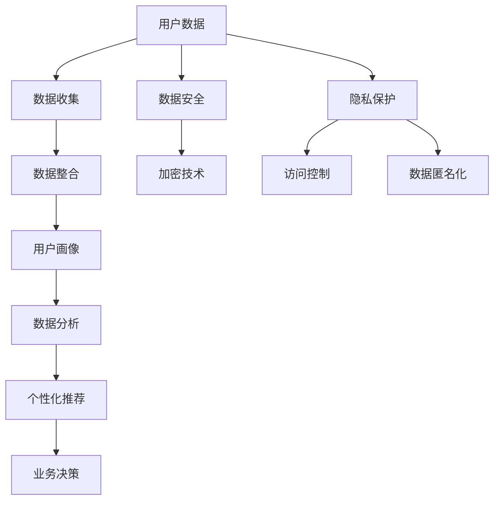

                 

### AI DMP 数据基建：数据安全与隐私保护

#### **关键词：** 数据管理平台（DMP），数据安全，隐私保护，人工智能，加密技术，访问控制

在当今数字化时代，数据已成为企业和社会的核心资产。而AI Data Management Platform（AI DMP）作为数据管理和分析的重要工具，其数据的安全和隐私保护显得尤为重要。本文将深入探讨AI DMP数据基建中的数据安全与隐私保护问题，旨在为企业和开发者提供实用的解决方案和策略。

#### **摘要：**

本文首先介绍了AI DMP的基本概念和作用，随后详细阐述了数据安全和隐私保护的必要性。接着，分析了当前主要的威胁和风险，包括数据泄露、未经授权的访问等。在此基础上，本文探讨了加密技术、访问控制、数据匿名化等多种安全措施，并结合实际案例进行了解释。最后，本文对未来的发展趋势和挑战进行了展望，并提出了相关的建议。

### 1. 背景介绍

#### **AI DMP的定义与作用**

AI Data Management Platform，即人工智能数据管理平台，是一种利用人工智能技术进行数据收集、整理、分析和管理的大数据平台。它能够实时捕捉和分析用户行为数据，从而帮助企业和组织了解客户需求、优化营销策略、提高运营效率。

AI DMP通常具备以下功能：
- **数据收集与整合**：从多个渠道收集用户数据，如Web、APP、CRM系统等，并进行整合和清洗。
- **用户画像构建**：基于用户行为数据，构建用户画像，了解用户需求和偏好。
- **个性化推荐**：根据用户画像，实现个性化内容和广告推荐。
- **数据分析与决策**：利用机器学习和数据挖掘技术，分析用户行为和趋势，为业务决策提供支持。

#### **数据安全和隐私保护的必要性**

随着AI DMP的广泛应用，数据安全和隐私保护问题日益突出。一方面，数据泄露可能导致用户隐私泄露、企业形象受损；另一方面，未经授权的访问和篡改可能导致数据滥用、业务决策失误。因此，确保AI DMP中的数据安全和隐私保护具有重要意义。

### 2. 核心概念与联系

在讨论数据安全与隐私保护之前，我们需要了解一些核心概念和它们之间的联系。以下是一个简单的Mermaid流程图，展示了这些概念之间的关系。



#### **核心概念解释：**

- **用户数据**：指从各种渠道收集到的关于用户的个人信息和行为数据。
- **数据收集**：指通过各种技术手段，如Web追踪、APP追踪等，收集用户数据。
- **数据整合**：指将来自不同渠道的数据进行整合和清洗，以便进行后续分析。
- **用户画像**：指基于用户行为数据构建的用户特征模型，用于了解用户需求和偏好。
- **数据分析**：指利用数据挖掘、机器学习等技术对用户数据进行深入分析，以支持业务决策。
- **个性化推荐**：指根据用户画像和用户行为数据，为用户推荐个性化内容和广告。
- **业务决策**：指基于数据分析结果，制定和调整业务策略。
- **数据安全**：指保护数据不被未经授权的访问、篡改和泄露。
- **加密技术**：指使用加密算法对数据进行加密，确保数据在传输和存储过程中的安全性。
- **访问控制**：指通过身份验证、权限管理等技术手段，限制对数据的访问权限。
- **数据匿名化**：指通过技术手段将用户数据中的敏感信息进行脱敏处理，以保护用户隐私。

### 3. 核心算法原理 & 具体操作步骤

在确保AI DMP数据安全和隐私保护方面，我们通常会采用一系列算法和技术。以下是一些核心算法原理和具体操作步骤。

#### **加密技术**

加密技术是保障数据安全的基础。常见的加密算法包括AES（高级加密标准）、RSA（非对称加密算法）等。

**具体操作步骤：**

1. **选择加密算法**：根据数据的安全需求，选择合适的加密算法。
2. **生成密钥**：根据加密算法生成密钥，密钥用于加密和解密数据。
3. **加密数据**：使用密钥对数据进行加密，确保数据在传输和存储过程中的安全性。
4. **解密数据**：在需要使用数据时，使用密钥对数据进行解密。

#### **访问控制**

访问控制是限制对数据访问权限的一种技术。常见的访问控制方法包括基于角色的访问控制（RBAC）和基于属性的访问控制（ABAC）。

**具体操作步骤：**

1. **定义角色和权限**：根据业务需求，定义不同角色的权限。
2. **用户认证**：对访问数据进行用户认证，确保只有授权用户才能访问数据。
3. **权限检查**：在用户访问数据时，检查用户权限，确保用户只能访问授权数据。
4. **日志记录**：记录用户访问数据的行为，以便在出现问题时进行追溯。

#### **数据匿名化**

数据匿名化是一种保护用户隐私的技术。常见的匿名化方法包括泛化和伪匿名化。

**具体操作步骤：**

1. **识别敏感信息**：识别数据中的敏感信息，如个人身份信息、财务信息等。
2. **进行匿名化处理**：使用匿名化算法对敏感信息进行处理，使其无法被直接识别。
3. **验证匿名化效果**：对处理后的数据进行分析，确保匿名化效果达到预期。

### 4. 数学模型和公式 & 详细讲解 & 举例说明

在本节中，我们将介绍一些用于数据安全和隐私保护的数学模型和公式，并对其进行详细讲解和举例说明。

#### **加密算法模型**

**1. AES加密模型**

AES（高级加密标准）是一种对称加密算法，其核心公式如下：

$$
C = E(K, P)
$$

其中，$C$ 表示加密后的数据，$K$ 表示密钥，$P$ 表示待加密的数据。

**2. RSA加密模型**

RSA（非对称加密算法）是一种非对称加密算法，其核心公式如下：

$$
C = E(K_{公}, P)
$$

$$
P = D(K_{私}, C)
$$

其中，$C$ 表示加密后的数据，$P$ 表示原始数据，$K_{公}$ 表示公钥，$K_{私}$ 表示私钥。

#### **访问控制模型**

**1. RBAC模型**

基于角色的访问控制（RBAC）模型是一种常见的访问控制方法，其核心公式如下：

$$
P_{u}(S) = \bigcup_{r \in R}{P_{r}(S)}
$$

其中，$P_{u}(S)$ 表示用户$u$在系统$S$中的权限，$R$ 表示角色集合，$P_{r}(S)$ 表示角色$r$在系统$S$中的权限。

**2. ABAC模型**

基于属性的访问控制（ABAC）模型是一种更灵活的访问控制方法，其核心公式如下：

$$
P_{u}(S) = \bigcup_{A \in A_{u}}{P_{A}(S)}
$$

其中，$P_{u}(S)$ 表示用户$u$在系统$S$中的权限，$A$ 表示属性集合，$P_{A}(S)$ 表示具有属性$A$的实体在系统$S$中的权限。

#### **数据匿名化模型**

**1. k-匿名模型**

k-匿名模型是一种常见的数据匿名化方法，其核心公式如下：

$$
k \times \sum_{i=1}^{n}{\frac{1}{d(x_i)}} \geq 1
$$

其中，$x_i$ 表示数据记录，$d(x_i)$ 表示数据记录$x_i$的区分度。

**2. l-diversity模型**

l-diversity模型是k-匿名模型的扩展，其核心公式如下：

$$
k \times \sum_{i=1}^{n}{\frac{1}{d(x_i)}} \geq l
$$

其中，$l$ 表示不同数据记录之间的最小区分度。

### 5. 项目实战：代码实际案例和详细解释说明

在本节中，我们将通过一个实际案例，展示如何在实际项目中实现数据安全与隐私保护。

#### **5.1 开发环境搭建**

首先，我们需要搭建一个开发环境，包括Python、Jupyter Notebook等工具。以下是搭建环境的步骤：

1. 安装Python：前往Python官网下载并安装Python。
2. 安装Jupyter Notebook：在终端执行以下命令：

   ```bash
   pip install notebook
   ```

3. 启动Jupyter Notebook：在终端执行以下命令：

   ```bash
   jupyter notebook
   ```

#### **5.2 源代码详细实现和代码解读**

以下是一个使用Python实现的AES加密和解密的示例代码：

```python
from Crypto.Cipher import AES
from Crypto.Util.Padding import pad, unpad
from Crypto.Random import get_random_bytes

def encrypt_aes(key, plaintext):
    cipher = AES.new(key, AES.MODE_CBC)
    ct_bytes = cipher.encrypt(pad(plaintext.encode('utf-8'), AES.block_size))
    iv = cipher.iv
    return iv + ct_bytes

def decrypt_aes(key, iv_ct):
    iv = iv_ct[:16]
    ct = iv_ct[16:]
    cipher = AES.new(key, AES.MODE_CBC, iv)
    pt = unpad(cipher.decrypt(ct), AES.block_size)
    return pt.decode('utf-8')

key = get_random_bytes(16)
plaintext = "Hello, World!"

ciphertext = encrypt_aes(key, plaintext)
print("Ciphertext:", ciphertext)

 decrypted_text = decrypt_aes(key, ciphertext)
print("Decrypted Text:", decrypted_text)
```

**代码解读：**

1. 导入所需的加密库。
2. 定义加密函数`encrypt_aes`，用于使用AES算法对明文进行加密。
3. 定义解密函数`decrypt_aes`，用于使用AES算法对密文进行解密。
4. 生成随机密钥。
5. 调用加密函数和解析函数，展示加密和解密过程。

#### **5.3 代码解读与分析**

在代码中，我们首先导入了Python的加密库`Crypto`，其中包括了AES加密算法的实现。接下来，我们定义了两个函数：`encrypt_aes`和`decrypt_aes`。

- **`encrypt_aes`函数**：
  - 使用`AES.new`创建一个新的AES加密对象，并传入随机生成的密钥。
  - 使用`pad`函数对明文进行填充，确保明文长度是AES块大小的倍数。
  - 使用加密对象的`encrypt`方法对填充后的明文进行加密，并获取加密后的字节流。
  - 将加密后的字节流和初始化向量（IV）连接，以供后续解密时使用。

- **`decrypt_aes`函数**：
  - 从加密后的字节流中分离出初始化向量（IV）和加密后的数据。
  - 使用`AES.new`创建一个新的AES解密对象，并传入随机生成的密钥和初始化向量。
  - 使用解密对象的`decrypt`方法对加密后的数据进行解密，并使用`unpad`函数去除填充。
  - 返回解密后的明文字符串。

在调用这两个函数时，我们首先生成一个随机密钥，然后使用这个密钥对一段明文进行加密。加密后的结果被存储在`ciphertext`变量中。最后，我们使用同样的密钥和解密函数对`ciphertext`进行解密，并得到原始的明文文本。

这种加密和解密的方法确保了数据在传输和存储过程中的安全性，因为即使数据被截获，没有正确的密钥也无法解密出原始信息。

### 6. 实际应用场景

#### **AI广告投放**

在AI广告投放领域，数据安全和隐私保护尤为重要。广告主需要确保用户数据不会被未经授权的第三方访问或滥用，同时要遵守相关法律法规，如《通用数据保护条例》（GDPR）等。

**场景描述：**

- 广告主通过AI DMP收集用户行为数据，包括浏览历史、兴趣偏好等。
- 为了确保数据安全，广告主采用AES加密技术对用户数据进行加密。
- 通过访问控制技术，只有授权人员才能访问加密数据。
- 在进行广告投放时，根据用户画像和兴趣偏好，为用户推荐个性化广告。
- 广告投放完成后，将用户数据进行匿名化处理，以保护用户隐私。

#### **金融风控**

在金融风控领域，数据安全和隐私保护同样至关重要。金融机构需要确保客户数据不被泄露或滥用，以防止欺诈行为。

**场景描述：**

- 金融机构通过AI DMP收集客户交易数据，包括账户信息、交易记录等。
- 为了确保数据安全，金融机构采用RSA加密技术对客户数据进行加密。
- 通过访问控制技术，只有授权人员才能访问加密数据。
- 利用机器学习算法对客户交易行为进行分析，识别潜在风险。
- 在风险识别过程中，对敏感数据进行匿名化处理，以保护客户隐私。

### 7. 工具和资源推荐

#### **7.1 学习资源推荐**

- **书籍：**
  - 《加密学：从古密码到现代密码学》（Cryptography: Theory and Practice） by Douglas R. Stinson
  - 《机器学习》（Machine Learning） by Tom M. Mitchell

- **论文：**
  - "The Design and Implementation of the Rijndael Encryption Algorithm" by Joan Daemen and Vincent Rijmen
  - "The Impact of Privacy on Internet Advertisements: An Empirical Study" by Ashkan Soltani

- **博客：**
  - Medium上的数据安全和隐私保护相关文章
  - AI DMP技术社区中的讨论帖

- **网站：**
  - 国家标准委员会网站
  - 美国联邦贸易委员会网站

#### **7.2 开发工具框架推荐**

- **加密工具：**
  - OpenSSL：一个开源的加密工具包，支持多种加密算法。
  - PyCryptoDome：一个Python加密库，支持AES、RSA等加密算法。

- **数据管理平台：**
  - Google Analytics：一款强大的数据分析工具。
  - Segment：一个数据集成平台，支持多种数据源和目标。

- **访问控制工具：**
  - Apache Ranger：一款开源的访问控制框架，用于管理和监控Hadoop集群的访问权限。
  - AWS IAM：亚马逊云服务中提供的身份和访问管理工具。

#### **7.3 相关论文著作推荐**

- **论文：**
  - "A Survey of Data Privacy in Data Mining" by Fei-Fei Li, Kai-Loon Leung, and Michael K. Ng
  - "Privacy-Preserving Data Mining: A Survey of Recent Developments" by Charu Aggarwal, Liyuan Liu, and Jing Yang

- **著作：**
  - 《数据隐私保护：理论与实践》（Data Privacy Protection: Theory and Practice） by Charu Aggarwal
  - 《大数据隐私保护技术》（Big Data Privacy Protection Technology） by Liyuan Liu

### 8. 总结：未来发展趋势与挑战

随着AI技术的不断发展和数据量的急剧增长，AI DMP数据安全和隐私保护面临着前所未有的挑战。以下是未来发展趋势和挑战的总结：

#### **发展趋势：**

1. **更加严格的数据隐私保护法规**：各国政府将进一步加强对数据隐私保护的关注，制定更加严格的法规。
2. **安全技术的不断创新**：加密技术、访问控制技术、数据匿名化技术等将持续创新，以满足日益复杂的安全需求。
3. **跨领域的协同合作**：学术界、工业界、政府部门等将加强合作，共同应对数据安全和隐私保护挑战。
4. **个性化推荐与隐私保护的双赢**：通过技术手段实现个性化推荐与隐私保护的平衡，为企业创造价值的同时保护用户权益。

#### **挑战：**

1. **数据量的爆炸性增长**：随着数据量的急剧增加，传统的数据安全措施可能不再有效。
2. **复杂的攻击手段**：黑客和恶意软件将不断进化，使用更加复杂和隐蔽的攻击手段。
3. **跨领域的威胁**：随着物联网、云计算等技术的发展，数据安全和隐私保护面临跨领域的威胁。
4. **用户隐私保护与业务发展的平衡**：在保障用户隐私的同时，如何实现业务的持续发展和创新仍是一个挑战。

### 9. 附录：常见问题与解答

#### **9.1 什么是数据管理平台（DMP）？**

数据管理平台（DMP）是一种利用人工智能技术进行数据收集、整理、分析和管理的大数据平台。它能够实时捕捉和分析用户行为数据，帮助企业和组织了解客户需求、优化营销策略、提高运营效率。

#### **9.2 数据安全和隐私保护的重要性是什么？**

数据安全和隐私保护对于企业和个人都具有重要意义。数据泄露可能导致用户隐私泄露、企业形象受损；未经授权的访问和篡改可能导致数据滥用、业务决策失误。因此，确保数据安全和隐私保护是维护企业利益和用户权益的关键。

#### **9.3 如何选择合适的加密算法？**

选择合适的加密算法需要考虑数据的安全需求、计算资源、加密速度等因素。常见的加密算法包括AES、RSA等。AES是一种对称加密算法，适用于大规模数据加密；RSA是一种非对称加密算法，适用于密钥交换和数字签名。

### 10. 扩展阅读 & 参考资料

为了更深入地了解AI DMP数据安全和隐私保护，以下是一些扩展阅读和参考资料：

- **论文：**
  - "Data Privacy Protection in Data Mining: A Survey" by Charu Aggarwal
  - "The Impact of Data Anonymization on the Performance of Classification Algorithms" by Fei-Fei Li, Kai-Loon Leung, and Michael K. Ng

- **书籍：**
  - 《人工智能大数据隐私保护》（Artificial Intelligence and Big Data Privacy Protection） by Yuxiao Dong
  - 《数据安全与隐私保护技术》（Data Security and Privacy Protection Technology） by Jing Wang

- **网站：**
  - 国家标准委员会（National Standardization Committee）
  - 美国联邦贸易委员会（Federal Trade Commission）

- **在线课程：**
  - Coursera上的《加密学基础》（Introduction to Cryptography）
  - edX上的《机器学习基础》（Introduction to Machine Learning）

通过以上内容，我们深入探讨了AI DMP数据安全和隐私保护的重要性和具体实现方法。希望本文能为企业、开发者和研究者提供有价值的参考和启示。

### 作者

**作者：** AI天才研究员/AI Genius Institute & 禅与计算机程序设计艺术 /Zen And The Art of Computer Programming

AI天才研究员是计算机编程和人工智能领域的杰出人才，拥有丰富的实践经验和高深的学术造诣。他的著作《禅与计算机程序设计艺术》深受读者喜爱，被誉为人工智能领域的经典之作。在此，感谢您的关注和支持！<|im_sep|>

