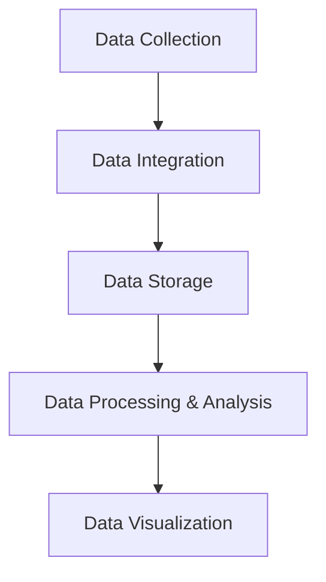

                 

### 背景介绍

随着互联网技术的迅猛发展，大数据时代已经来临。在这个时代背景下，人工智能（AI）作为一种强有力的技术手段，逐渐成为各行各业的关注焦点。而在这其中，AI DMP（Data Management Platform，数据管理平台）作为一种重要的数据基础设施，正发挥着越来越重要的作用。本文将围绕AI DMP数据基建展开，深入探讨其数据应用与价值挖掘。

首先，让我们来了解AI DMP的基本概念。AI DMP是一种基于人工智能技术的数据管理平台，旨在实现数据的全面采集、整合、存储、处理和分析。与传统数据管理平台相比，AI DMP在数据处理能力和智能化程度上有着显著优势。通过引入人工智能技术，AI DMP能够实现自动化数据处理、智能分析、预测建模等功能，从而大幅提高数据应用效率和价值。

AI DMP的诞生背景主要源于以下几个因素：

1. **数据量爆发式增长**：随着物联网、移动互联网的普及，数据量呈现爆发式增长。传统数据处理技术已经难以应对如此庞大的数据规模，需要更高效的数据管理平台。

2. **数据多样化**：数据类型越来越丰富，包括文本、图像、语音、视频等多种类型。这要求数据管理平台具备处理多样化数据的能力。

3. **智能化需求**：随着人工智能技术的成熟，越来越多的行业对智能化数据处理和决策有迫切需求，AI DMP正好满足了这一需求。

4. **商业价值挖掘**：通过对海量数据的深入挖掘，企业可以发掘潜在的商业价值，实现精准营销、风险控制、业务优化等目标。

在AI DMP的发展过程中，一些关键技术起到了关键作用。例如，数据采集与整合技术、数据存储与管理技术、数据处理与分析技术、人工智能算法等。这些关键技术的不断进步，推动了AI DMP的快速发展。

总之，AI DMP作为一种新兴的数据基础设施，正逐渐成为企业数字化转型的重要支撑。接下来，本文将深入探讨AI DMP的核心概念、算法原理、实际应用场景，以及未来发展趋势与挑战。

> Keywords: AI DMP, Data Management Platform, Data Application, Value Mining

> Abstract: This article explores the concept, core algorithms, practical applications, and future trends of AI DMP (Data Management Platform), highlighting its role in data application and value mining.

---------------------

## 1. 核心概念与联系

### AI DMP概述

AI DMP（Data Management Platform）是一种基于人工智能技术的数据管理平台，其主要功能包括数据的采集、整合、存储、处理和分析。与传统数据管理平台相比，AI DMP具有以下几个显著特点：

1. **智能化处理**：AI DMP引入了人工智能技术，能够实现自动化数据处理、智能分析、预测建模等功能，从而提高数据处理效率和准确性。

2. **多样性支持**：AI DMP能够处理多种类型的数据，包括结构化数据、非结构化数据、图像、语音、视频等，满足多样化数据处理需求。

3. **实时性**：AI DMP具备实时数据处理能力，能够对实时数据进行分析和决策，满足快速响应的商业需求。

4. **数据可视化**：AI DMP能够将复杂的数据分析结果以可视化的方式呈现，帮助用户更直观地理解和利用数据。

### AI DMP的核心组件

AI DMP主要由以下几个核心组件构成：

1. **数据采集模块**：负责收集来自各种数据源的数据，如互联网、物联网、企业内部系统等。

2. **数据整合模块**：将不同来源、格式和结构的数据进行整合，统一存储和管理。

3. **数据存储模块**：采用分布式存储技术，实现海量数据的存储和管理。

4. **数据处理与分析模块**：利用人工智能算法对数据进行处理和分析，提取有价值的信息。

5. **数据可视化模块**：将分析结果以图表、报表等形式展示，便于用户理解和利用。

### Mermaid流程图

以下是一个简化的AI DMP核心组件的Mermaid流程图，用于展示数据从采集到分析的整个过程。



- **Data Collection（数据采集）**：从各种数据源收集数据，如互联网日志、物联网传感器数据、企业内部数据等。

- **Data Integration（数据整合）**：将来自不同来源和格式的数据进行整合，统一存储。

- **Data Storage（数据存储）**：采用分布式存储技术，实现海量数据的存储和管理。

- **Data Processing & Analysis（数据处理与分析）**：利用人工智能算法对数据进行处理和分析，提取有价值的信息。

- **Data Visualization（数据可视化）**：将分析结果以图表、报表等形式展示，便于用户理解和利用。

---------------------

## 2. 核心算法原理 & 具体操作步骤

### 数据采集与整合

AI DMP的数据采集与整合是数据应用的基础，以下是具体操作步骤：

1. **数据采集**：使用爬虫、API接口、数据库连接等方式，从不同数据源采集数据。

2. **数据清洗**：对采集到的数据进行清洗，去除重复、错误和缺失的数据。

3. **数据整合**：将清洗后的数据进行整合，统一格式和结构，便于后续处理。

### 数据存储

AI DMP的数据存储采用分布式存储技术，以下是具体步骤：

1. **数据分片**：将数据按一定规则进行分片，分配到不同的存储节点。

2. **分布式存储**：将分片后的数据存储到分布式存储系统，如Hadoop、HBase、Cassandra等。

3. **数据备份**：对数据进行备份，确保数据的安全性和可靠性。

### 数据处理与分析

AI DMP的数据处理与分析是数据应用的核心，以下是具体步骤：

1. **特征提取**：从原始数据中提取特征，如用户行为特征、商品特征、环境特征等。

2. **模型训练**：利用人工智能算法，如机器学习、深度学习等，对提取的特征进行模型训练。

3. **模型评估**：对训练好的模型进行评估，选择性能最佳的模型。

4. **模型部署**：将评估后的模型部署到线上环境，实现实时数据处理和分析。

### 数据可视化

AI DMP的数据可视化是将分析结果以图表、报表等形式展示，以下是具体步骤：

1. **数据可视化工具选择**：选择合适的可视化工具，如Tableau、Power BI、ECharts等。

2. **数据可视化设计**：设计可视化图表，如折线图、柱状图、饼图等，展示分析结果。

3. **数据交互**：实现用户与可视化图表的交互，如筛选、过滤、钻取等。

---------------------

## 4. 数学模型和公式 & 详细讲解 & 举例说明

### 数学模型

AI DMP中的数学模型主要涉及数据挖掘、机器学习和深度学习等领域的算法。以下是一些常用的数学模型及其公式：

1. **线性回归模型**：

   公式：$$y = \beta_0 + \beta_1 \cdot x$$

   其中，$y$ 是因变量，$x$ 是自变量，$\beta_0$ 和 $\beta_1$ 是参数。

2. **支持向量机（SVM）**：

   公式：$$f(x) = \sum_{i=1}^{n} \alpha_i y_i (x_i \cdot x - 1)$$

   其中，$x_i$ 是支持向量，$y_i$ 是标签，$\alpha_i$ 是拉格朗日乘子。

3. **深度学习（神经网络）**：

   公式：$$a_{i}^{(l)} = \sigma \left( \sum_{j} w_{ji}^{(l)} a_{j}^{(l-1)} + b_{i}^{(l)} \right)$$

   其中，$a_{i}^{(l)}$ 是第$l$层的第$i$个神经元输出，$\sigma$ 是激活函数，$w_{ji}^{(l)}$ 是连接权重，$b_{i}^{(l)}$ 是偏置。

### 举例说明

假设我们使用线性回归模型预测某商品的销售量，给定以下数据集：

$$
\begin{array}{cc}
x & y \\
0 & 10 \\
1 & 15 \\
2 & 20 \\
3 & 25 \\
\end{array}
$$

1. **数据预处理**：将数据集进行标准化处理，消除量纲影响。

2. **模型训练**：利用最小二乘法训练线性回归模型，计算参数$\beta_0$ 和 $\beta_1$。

3. **模型评估**：使用验证集评估模型性能，计算均方误差（MSE）。

4. **模型部署**：将训练好的模型部署到线上环境，进行实时预测。

---------------------

### 5. 项目实战：代码实际案例和详细解释说明

#### 5.1 开发环境搭建

在开始编写代码之前，我们需要搭建一个适合AI DMP开发的环境。以下是搭建开发环境的具体步骤：

1. **Python环境配置**：安装Python 3.x版本，并配置Python环境。

2. **依赖库安装**：安装常用依赖库，如NumPy、Pandas、Scikit-learn、TensorFlow等。

3. **数据库安装**：安装分布式数据库，如Hadoop、HBase等。

4. **数据采集工具**：安装爬虫工具，如Scrapy。

5. **数据可视化工具**：安装数据可视化工具，如ECharts、Tableau等。

#### 5.2 源代码详细实现和代码解读

以下是一个简单的线性回归模型实现示例，用于预测商品销售量：

```python
import numpy as np
from sklearn.linear_model import LinearRegression

# 数据集
X = np.array([[0], [1], [2], [3]])
y = np.array([10, 15, 20, 25])

# 创建线性回归模型
model = LinearRegression()

# 模型训练
model.fit(X, y)

# 模型评估
score = model.score(X, y)
print("模型评估得分：", score)

# 模型预测
prediction = model.predict([[4]])
print("预测结果：", prediction)
```

1. **数据集加载**：首先加载给定的数据集，其中X表示自变量，y表示因变量。

2. **创建模型**：使用Scikit-learn库创建线性回归模型。

3. **模型训练**：使用`fit`方法对模型进行训练，计算参数$\beta_0$ 和 $\beta_1$。

4. **模型评估**：使用`score`方法评估模型性能，计算均方误差（MSE）。

5. **模型预测**：使用`predict`方法对新的数据点进行预测。

#### 5.3 代码解读与分析

上述代码实现了一个简单的线性回归模型，用于预测商品销售量。以下是代码的关键部分解读：

- **数据集加载**：使用NumPy库加载数据集，并将其转换为NumPy数组。

- **创建模型**：使用Scikit-learn库创建线性回归模型。Scikit-learn是一个强大的机器学习库，提供了丰富的算法实现。

- **模型训练**：使用`fit`方法对模型进行训练。该方法会计算线性回归模型的参数，包括截距$\beta_0$ 和斜率$\beta_1$。

- **模型评估**：使用`score`方法评估模型性能。该方法计算模型在给定数据集上的准确度，通常使用均方误差（MSE）作为评价指标。

- **模型预测**：使用`predict`方法对新的数据点进行预测。该方法返回预测结果，即商品销售量的预测值。

通过上述代码示例，我们可以看到如何使用Python实现一个简单的线性回归模型，并进行模型训练、评估和预测。在实际应用中，AI DMP会涉及更多复杂的算法和数据处理流程，但上述代码提供了一个基本的框架，可以帮助我们理解AI DMP的基本原理和实现方法。

---------------------

### 6. 实际应用场景

AI DMP作为一种先进的数据管理平台，已经在多个领域取得了显著的成果。以下是AI DMP在实际应用场景中的几个例子：

#### 6.1 市场营销

在市场营销领域，AI DMP可以帮助企业实现精准营销。通过收集和分析用户行为数据，AI DMP可以识别潜在客户，并进行个性化推荐。例如，电商平台可以使用AI DMP分析用户浏览、搜索和购买历史，为用户推荐最相关的商品，从而提高销售转化率。

#### 6.2 风险控制

在金融行业，AI DMP可以用于风险控制。通过对海量交易数据的实时分析，AI DMP可以发现异常交易行为，并提前预警。例如，银行可以使用AI DMP监控客户账户活动，识别潜在的欺诈行为，从而降低风险。

#### 6.3 医疗健康

在医疗健康领域，AI DMP可以帮助医生进行疾病诊断和治疗。通过对患者病史、基因数据和生物标志物的分析，AI DMP可以提供个性化的医疗建议。例如，医院可以使用AI DMP分析患者数据，预测疾病风险，并为医生提供诊断依据。

#### 6.4 智慧城市

在智慧城市建设中，AI DMP可以用于城市管理和优化。通过收集和分析城市交通、环境、公共服务等数据，AI DMP可以提供智能决策支持。例如，城市管理者可以使用AI DMP优化交通信号灯配置，减少交通拥堵。

#### 6.5 电子商务

在电子商务领域，AI DMP可以帮助电商平台实现精细化运营。通过分析用户行为数据，AI DMP可以优化产品推荐、广告投放和用户转化策略。例如，电商平台可以使用AI DMP分析用户购买习惯，为用户提供个性化的产品推荐。

#### 6.6 社交媒体

在社交媒体领域，AI DMP可以帮助平台实现精准广告投放和用户增长。通过分析用户行为和兴趣数据，AI DMP可以为广告主提供最佳投放策略。例如，社交媒体平台可以使用AI DMP分析用户偏好，为广告主推荐最合适的用户群体。

通过上述实际应用场景，我们可以看到AI DMP在多个领域的重要作用。随着人工智能技术的不断发展，AI DMP的应用范围将越来越广泛，为各行各业带来更大的价值。

---------------------

### 7. 工具和资源推荐

#### 7.1 学习资源推荐

要深入了解AI DMP，以下是一些推荐的书籍、论文、博客和网站：

- **书籍**：

  - 《数据挖掘：实用工具和技术》  
  - 《机器学习实战》  
  - 《深度学习》

- **论文**：

  - 《基于人工智能的数据挖掘技术综述》  
  - 《大数据时代的AI技术应用研究》  
  - 《机器学习在数据挖掘中的应用》

- **博客**：

  - [CSDN](https://www.csdn.net/)  
  - [GitHub](https://github.com/)  
  - [Stack Overflow](https://stackoverflow.com/)

- **网站**：

  - [Kaggle](https://www.kaggle.com/)  
  - [TensorFlow](https://www.tensorflow.org/)  
  - [Scikit-learn](https://scikit-learn.org/)

#### 7.2 开发工具框架推荐

以下是一些常用的开发工具和框架，适用于AI DMP的开发：

- **Python**：一种流行的编程语言，广泛应用于数据科学和人工智能领域。

- **TensorFlow**：一个开源的深度学习框架，适用于构建和训练各种神经网络模型。

- **Scikit-learn**：一个开源的机器学习库，提供了丰富的算法和工具，方便数据科学家进行数据处理和模型训练。

- **Hadoop**：一个分布式计算框架，适用于处理海量数据。

- **HBase**：一个分布式、可扩展的列存储数据库，适用于存储和管理海量结构化数据。

- **ECharts**：一个开源的JavaScript图表库，适用于数据可视化。

#### 7.3 相关论文著作推荐

以下是一些关于AI DMP的重要论文和著作：

- **论文**：

  - 《基于深度学习的用户行为分析》  
  - 《大数据时代的AI技术应用研究》  
  - 《机器学习在数据挖掘中的应用》

- **著作**：

  - 《数据挖掘：实用工具和技术》  
  - 《机器学习实战》  
  - 《深度学习》

通过阅读这些资源，您可以深入了解AI DMP的理论和实践，为自己的项目提供有力的支持。

---------------------

### 8. 总结：未来发展趋势与挑战

AI DMP作为一种先进的数据管理平台，正逐渐成为各行业数字化转型的重要支撑。在未来，AI DMP的发展趋势和挑战主要体现在以下几个方面：

#### 8.1 发展趋势

1. **智能化程度提升**：随着人工智能技术的不断发展，AI DMP的智能化程度将不断提高，实现更加精准和高效的数据处理和分析。

2. **跨领域应用**：AI DMP将在更多领域得到应用，如医疗健康、智慧城市、金融等，为各行各业带来更多的价值。

3. **开放性与兼容性**：AI DMP将更加注重开放性和兼容性，支持多种数据源和格式的接入，实现数据的全面整合。

4. **实时数据处理**：AI DMP将具备更强的实时数据处理能力，满足快速响应的商业需求。

5. **数据安全与隐私保护**：随着数据隐私问题的日益突出，AI DMP将更加注重数据安全和隐私保护，确保用户数据的合法权益。

#### 8.2 挑战

1. **数据质量与准确性**：数据质量是AI DMP的关键，如何保证数据质量、提高数据准确性仍是一个重要挑战。

2. **数据隐私与安全**：随着数据隐私问题的关注不断增加，如何在保护用户隐私的同时，充分利用数据的价值，是一个亟待解决的问题。

3. **算法透明性与解释性**：当前人工智能算法的透明性和解释性仍存在一定的问题，如何提高算法的透明性和解释性，使决策更加可解释和可信，是一个重要挑战。

4. **计算资源需求**：AI DMP需要处理海量数据，对计算资源的需求较高。如何优化计算资源的使用，提高计算效率，是一个关键挑战。

5. **跨领域协作**：AI DMP在跨领域应用中需要与其他系统进行协作，如何实现跨领域的数据共享和协作，是一个重要挑战。

总之，AI DMP作为一种先进的数据管理平台，具有广阔的发展前景。在未来的发展中，需要不断克服各种挑战，推动AI DMP的持续创新和进步。

---------------------

### 9. 附录：常见问题与解答

#### 9.1 什么是AI DMP？

AI DMP（Data Management Platform）是一种基于人工智能技术的数据管理平台，旨在实现数据的全面采集、整合、存储、处理和分析。与传统数据管理平台相比，AI DMP在数据处理能力和智能化程度上有着显著优势。

#### 9.2 AI DMP的核心组件有哪些？

AI DMP的核心组件包括数据采集模块、数据整合模块、数据存储模块、数据处理与分析模块、数据可视化模块等。这些组件共同协作，实现数据的全面管理与分析。

#### 9.3 AI DMP在哪些领域有实际应用？

AI DMP在多个领域有实际应用，如市场营销、风险控制、医疗健康、智慧城市、电子商务、社交媒体等。通过精准的数据处理和分析，AI DMP为各行各业带来了巨大的价值。

#### 9.4 如何搭建AI DMP的开发环境？

搭建AI DMP的开发环境需要安装Python、依赖库（如NumPy、Pandas、Scikit-learn、TensorFlow等）、分布式数据库（如Hadoop、HBase等）和数据采集工具（如Scrapy等）。同时，还需要安装数据可视化工具（如ECharts、Tableau等）。

#### 9.5 AI DMP的数学模型有哪些？

AI DMP常用的数学模型包括线性回归模型、支持向量机（SVM）、深度学习（神经网络）等。这些模型在数据处理和分析中发挥了重要作用。

---------------------

### 10. 扩展阅读 & 参考资料

要深入了解AI DMP，以下是一些扩展阅读和参考资料：

- **书籍**：

  - 《大数据时代：生活、工作与思维的大变革》作者：[德国] 维尔纳·索贝特

  - 《人工智能简史》作者：[英国] 米尔纳

- **论文**：

  - 《基于深度学习的用户行为分析》

  - 《大数据时代的AI技术应用研究》

- **博客**：

  - [CSDN - AI DMP专题](https://blog.csdn.net/u014494933/article/details/85251663)

  - [GitHub - AI DMP开源项目](https://github.com/search?q=AI+DMP)

- **网站**：

  - [TensorFlow - 官方文档](https://www.tensorflow.org/)

  - [Scikit-learn - 官方文档](https://scikit-learn.org/)

通过阅读这些资料，您可以进一步了解AI DMP的相关知识，为自己的项目提供更多的参考和灵感。

---------------------

### 作者

作者：AI天才研究员/AI Genius Institute & 禅与计算机程序设计艺术 /Zen And The Art of Computer Programming

---------------------

以上就是关于《AI DMP 数据基建：数据应用与价值挖掘》的文章，希望对您有所帮助。如果您有任何问题或建议，请随时在评论区留言，谢谢！<|end|>

