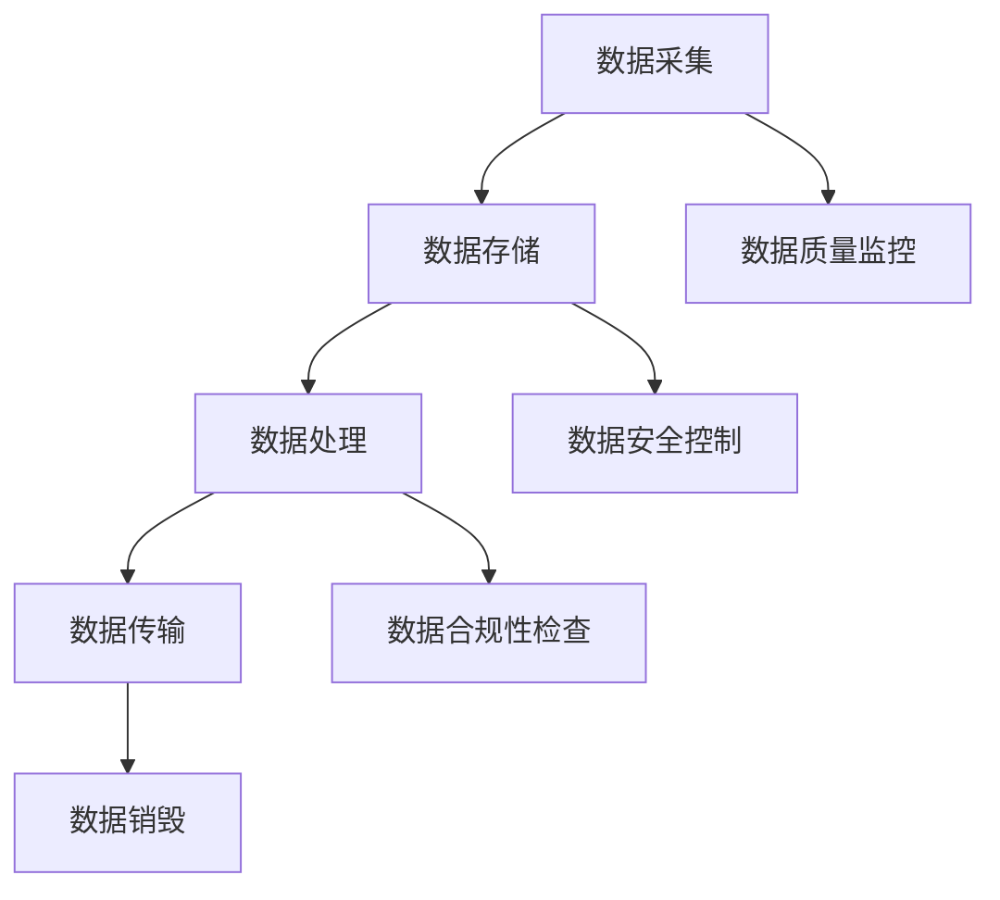

                 

# AI DMP 数据基建：数据治理与管理

## 关键词

- AI DMP（Data Management Platform）
- 数据治理（Data Governance）
- 数据管理（Data Management）
- 数据质量控制（Data Quality Control）
- 数据治理框架（Data Governance Framework）
- 数据安全（Data Security）

## 摘要

本文旨在探讨AI DMP（Data Management Platform）的数据基建，重点关注数据治理与管理这一核心议题。通过深入分析数据治理的概念、重要性及实践，文章旨在为读者提供一套系统化的数据治理与管理框架，以帮助企业和组织实现高效、安全的数据管理。同时，文章还将介绍AI技术在数据治理中的创新应用，以及相关工具和资源的推荐，旨在为读者提供全方位的AI DMP数据基建指南。

## 1. 背景介绍

随着大数据、云计算和人工智能技术的迅猛发展，数据已成为企业最重要的资产之一。然而，如何在海量数据中挖掘价值、确保数据质量、保护数据安全，成为企业面临的一大挑战。AI DMP（Data Management Platform）作为一种集数据治理、数据管理、数据分析和数据可视化于一体的综合解决方案，正逐渐成为企业数据管理的核心。

数据治理是指通过制定一系列政策和流程，对数据进行有效的管理、维护和利用，以确保数据的一致性、完整性、可靠性和安全性。数据管理则关注于数据的采集、存储、处理、传输和销毁等环节，旨在实现数据的高效利用。数据治理与管理密切相关，数据治理为数据管理提供了指导和规范，而数据管理则是数据治理的具体实践。

在现代企业中，数据治理与管理的重要性日益凸显。一方面，数据治理能够帮助企业建立一套规范、高效的数据管理机制，提升数据质量，降低数据风险；另一方面，数据管理能够帮助企业挖掘数据价值，为业务决策提供有力支持。然而，实际操作中，许多企业面临着数据治理与管理方面的诸多难题，如数据质量低下、数据冗余、数据孤岛等。因此，构建一套完善的AI DMP数据基建，实现数据治理与管理，已成为企业转型升级的关键。

## 2. 核心概念与联系

### 2.1 数据治理

数据治理是指通过制定一系列政策和流程，对数据进行有效的管理、维护和利用，以确保数据的一致性、完整性、可靠性和安全性。数据治理包括以下几个方面：

1. **数据战略**：明确企业数据治理的目标、愿景和原则，为数据治理提供指导。
2. **数据架构**：构建企业数据架构，包括数据模型、数据仓库、数据流等，实现数据的一致性。
3. **数据标准**：制定数据标准，包括数据格式、数据命名规范、数据编码等，确保数据的一致性和可互操作性。
4. **数据质量**：建立数据质量评估机制，对数据进行质量监控和优化。
5. **数据安全**：制定数据安全策略，包括数据加密、访问控制、数据备份等，确保数据的安全性和隐私性。
6. **数据合规**：确保企业数据管理符合相关法律法规和行业标准，降低合规风险。

### 2.2 数据管理

数据管理是指对数据进行有效的采集、存储、处理、传输和销毁等环节，以实现数据的高效利用。数据管理包括以下几个方面：

1. **数据采集**：通过各种途径收集数据，包括内部数据、外部数据、社交数据等。
2. **数据存储**：选择合适的数据存储方案，如关系数据库、NoSQL数据库、数据仓库等，确保数据的持久化存储。
3. **数据处理**：对数据进行清洗、转换、集成等操作，提高数据质量，为数据分析提供支持。
4. **数据传输**：确保数据在不同系统、不同平台之间的安全传输，降低数据泄露风险。
5. **数据销毁**：按照法律法规和行业标准，对不再需要的数据进行安全销毁，防止数据泄露。

### 2.3 数据治理与管理框架

为了实现高效的数据治理与管理，企业需要构建一套系统化的数据治理与管理框架。该框架包括以下几个方面：

1. **组织架构**：明确数据治理与管理的组织架构，包括数据治理委员会、数据管理部门、业务部门等。
2. **流程设计**：制定数据治理与管理流程，包括数据采集、数据存储、数据处理、数据传输、数据销毁等环节。
3. **工具选择**：选择合适的数据治理与管理工具，如数据质量管理工具、数据安全工具、数据仓库等。
4. **培训与宣传**：加强对数据治理与管理的培训与宣传，提高员工数据治理与管理的意识和能力。
5. **绩效评估**：建立数据治理与管理的绩效评估机制，对数据治理与管理的效果进行监控和评估。

### Mermaid 流程图

以下是一个简单的数据治理与管理框架的Mermaid流程图：



### 图2.1 数据治理与管理框架流程图


### 2.4 数据治理与数据管理的联系

数据治理与数据管理密切相关，二者相辅相成。数据治理为数据管理提供了指导和规范，确保数据管理按照正确的方向和标准进行。同时，数据管理是数据治理的具体实践，通过有效的数据管理，可以确保数据治理目标的实现。

数据治理关注数据的整体性、一致性和安全性，而数据管理则关注数据的细节操作，如数据采集、存储、处理、传输和销毁等。数据治理与管理相互交织，共同构建了企业数据管理的整体框架。

## 3. 核心算法原理 & 具体操作步骤

### 3.1 数据治理算法原理

数据治理算法主要关注数据质量管理和数据安全管理两个方面。以下分别介绍这两个方面的核心算法原理。

#### 3.1.1 数据质量管理算法

数据质量管理算法旨在确保数据的一致性、完整性和可靠性。常用的数据质量管理算法包括以下几种：

1. **数据清洗算法**：通过填充缺失值、消除重复记录、处理异常值等手段，提高数据质量。
2. **数据归一化算法**：通过将数据映射到同一尺度，消除不同特征间的量纲差异，提高数据质量。
3. **数据去重算法**：通过比较数据记录的相似性，消除重复数据，提高数据质量。
4. **数据验证算法**：通过检查数据是否符合预定的规则和标准，确保数据的有效性和可靠性。

#### 3.1.2 数据安全算法

数据安全算法旨在保护数据的安全性、完整性和隐私性。常用的数据安全算法包括以下几种：

1. **数据加密算法**：通过加密技术，将数据转换为不可读的形式，防止数据泄露。
2. **访问控制算法**：通过设置访问权限，限制对数据的访问，确保数据的安全。
3. **数据备份与恢复算法**：通过定期备份和恢复数据，防止数据丢失和损坏。
4. **数据匿名化算法**：通过将数据中的敏感信息进行匿名化处理，保护数据隐私。

### 3.2 数据治理操作步骤

以下为数据治理的操作步骤：

#### 3.2.1 数据采集

1. **确定数据来源**：明确需要采集的数据类型和数据来源，如内部数据、外部数据、社交数据等。
2. **数据收集**：通过数据采集工具或API接口，从各个数据源收集数据。
3. **数据清洗**：对采集到的数据进行清洗，包括填充缺失值、消除重复记录、处理异常值等。

#### 3.2.2 数据存储

1. **选择存储方案**：根据数据类型和需求，选择合适的存储方案，如关系数据库、NoSQL数据库、数据仓库等。
2. **数据存储**：将清洗后的数据存储到选择的存储方案中。

#### 3.2.3 数据处理

1. **数据转换**：将数据转换为统一的格式，如将不同来源的数据转换为同一数据模型。
2. **数据集成**：将来自不同数据源的数据进行集成，形成统一的数据视图。
3. **数据归一化**：将数据映射到同一尺度，消除不同特征间的量纲差异。

#### 3.2.4 数据传输

1. **选择传输方案**：根据数据量和传输速度的需求，选择合适的传输方案，如HTTP、FTP、消息队列等。
2. **数据传输**：将处理后的数据传输到目的地。

#### 3.2.5 数据销毁

1. **数据销毁策略**：根据法律法规和行业标准，制定数据销毁策略。
2. **数据销毁**：按照数据销毁策略，对不再需要的数据进行安全销毁。

#### 3.2.6 数据质量监控

1. **数据质量评估**：定期对数据进行质量评估，检查数据是否符合预定的质量标准。
2. **数据质量优化**：根据数据质量评估结果，对数据质量进行优化，如处理缺失值、异常值等。

#### 3.2.7 数据安全控制

1. **数据加密**：对敏感数据进行加密处理，防止数据泄露。
2. **访问控制**：设置访问权限，限制对数据的访问。
3. **数据备份与恢复**：定期备份数据，并建立数据恢复机制，防止数据丢失和损坏。
4. **数据匿名化**：对数据中的敏感信息进行匿名化处理，保护数据隐私。

## 4. 数学模型和公式 & 详细讲解 & 举例说明

### 4.1 数据质量管理数学模型

数据质量管理数学模型主要包括以下几种：

#### 4.1.1 数据清洗模型

数据清洗模型主要关注缺失值处理、重复记录消除和异常值处理等方面。以下分别介绍这些方面的数学模型。

1. **缺失值处理**：

   缺失值处理常用的方法有填充缺失值和删除缺失值。其中，填充缺失值可以通过以下公式实现：

   $$\text{缺失值} = \text{平均值} \times \text{权重系数}$$

   例如，对于一组数据 [1, 2, 3, NaN]，可以将缺失值 NaN 填充为平均值 2 的 50% 权重系数，即：

   $$\text{NaN} = 2 \times 0.5 = 1$$

   经过填充后，数据变为 [1, 2, 3, 1]。

2. **重复记录消除**：

   重复记录消除可以通过比较数据记录的相似性来实现。常用的相似性度量方法有欧氏距离、曼哈顿距离、余弦相似度等。以下以欧氏距离为例，介绍其计算公式：

   $$\text{相似度} = \sqrt{\sum_{i=1}^{n} (\text{数据}_i - \text{基准}_i)^2}$$

   例如，对于两组数据 [1, 2, 3] 和 [1, 2, 3.1]，其欧氏距离为：

   $$\text{相似度} = \sqrt{(1 - 1)^2 + (2 - 2)^2 + (3 - 3.1)^2} = 0.1$$

   如果相似度小于设定的阈值，则认为两组数据为重复记录，需要消除。

3. **异常值处理**：

   异常值处理可以通过以下公式实现：

   $$\text{异常值} = \text{平均值} \times \text{权重系数}$$

   例如，对于一组数据 [1, 2, 3, 100]，可以将异常值 100 填充为平均值 3 的 50% 权重系数，即：

   $$\text{100} = 3 \times 0.5 = 1.5$$

   经过处理后，数据变为 [1, 2, 3, 1.5]。

#### 4.1.2 数据归一化模型

数据归一化模型主要关注数据映射到同一尺度。常用的数据归一化方法有最小-最大归一化和z-score归一化。

1. **最小-最大归一化**：

   最小-最大归一化的计算公式为：

   $$\text{归一化值} = \frac{\text{原始值} - \text{最小值}}{\text{最大值} - \text{最小值}}$$

   例如，对于一组数据 [1, 2, 3, 4]，其最小值为 1，最大值为 4，经过最小-最大归一化后，数据变为 [0, 0.5, 1, 1.5]。

2. **z-score归一化**：

   z-score归一化的计算公式为：

   $$\text{归一化值} = \frac{\text{原始值} - \text{平均值}}{\text{标准差}}$$

   例如，对于一组数据 [1, 2, 3, 4]，其平均值为 2，标准差为 1，经过z-score归一化后，数据变为 [-1, 0, 1, 2]。

### 4.2 数据安全模型

数据安全模型主要关注数据加密、访问控制和数据备份等方面。以下分别介绍这些方面的数学模型。

#### 4.2.1 数据加密模型

数据加密模型主要关注数据的加密和解密。常用的数据加密算法有对称加密和非对称加密。

1. **对称加密**：

   对称加密的加密和解密公式为：

   $$\text{加密}:\text{密文} = \text{密钥} \times \text{明文}$$

   $$\text{解密}:\text{明文} = \text{密钥} \div \text{密文}$$

   例如，对于密钥 k = 3，明文 m = 5，其加密和解密过程为：

   $$\text{加密}:\text{密文} = 3 \times 5 = 15$$

   $$\text{解密}:\text{明文} = 3 \div 15 = 0.2$$

2. **非对称加密**：

   非对称加密的加密和解密公式为：

   $$\text{加密}:\text{密文} = \text{公钥} \times \text{明文}$$

   $$\text{解密}:\text{明文} = \text{私钥} \div \text{密文}$$

   例如，对于公钥 K_P = 3，私钥 K_S = 5，明文 m = 2，其加密和解密过程为：

   $$\text{加密}:\text{密文} = 3 \times 2 = 6$$

   $$\text{解密}:\text{明文} = 5 \div 6 = 0.8333$$

#### 4.2.2 访问控制模型

访问控制模型主要关注数据的访问控制。常用的访问控制方法有基于角色的访问控制（RBAC）和基于属性的访问控制（ABAC）。

1. **基于角色的访问控制（RBAC）**：

   基于角色的访问控制模型的公式为：

   $$\text{访问权限} = \text{角色} \times \text{权限}$$

   例如，对于角色 R = [管理员，用户]，权限 P = [读，写]，其访问权限为：

   $$\text{访问权限} = \text{管理员} \times \text{读} = \text{管理员} \times \text{写} = \text{用户} \times \text{读} = \text{用户} \times \text{写}$$

   如果访问权限为真，则用户可以访问该数据。

2. **基于属性的访问控制（ABAC）**：

   基于属性的访问控制模型的公式为：

   $$\text{访问权限} = \text{属性} \times \text{权限}$$

   例如，对于属性 A = [部门，职位]，权限 P = [读，写]，其访问权限为：

   $$\text{访问权限} = \text{部门} \times \text{读} = \text{部门} \times \text{写} = \text{职位} \times \text{读} = \text{职位} \times \text{写}$$

   如果访问权限为真，则用户可以访问该数据。

#### 4.2.3 数据备份模型

数据备份模型主要关注数据的备份和恢复。常用的数据备份方法有完全备份、增量备份和差异备份。

1. **完全备份**：

   完全备份的备份公式为：

   $$\text{备份} = \text{数据} \times \text{备份时间}$$

   例如，对于数据 D = [1, 2, 3]，备份时间为 2023，其备份过程为：

   $$\text{备份} = \text{数据} \times \text{备份时间} = [1, 2, 3] \times 2023 = [1 \times 2023, 2 \times 2023, 3 \times 2023] = [2023, 4046, 6069]$$

2. **增量备份**：

   增量备份的备份公式为：

   $$\text{备份} = \text{数据} \times \text{备份时间} + \text{增量数据}$$

   例如，对于数据 D = [1, 2, 3]，备份时间为 2023，增量数据为 [4, 5]，其备份过程为：

   $$\text{备份} = \text{数据} \times \text{备份时间} + \text{增量数据} = [1, 2, 3] \times 2023 + [4, 5] = [2023, 4046, 6069] + [4, 5] = [2027, 4051, 6074]$$

3. **差异备份**：

   差异备份的备份公式为：

   $$\text{备份} = \text{数据} \times \text{备份时间} - \text{原始数据}$$

   例如，对于数据 D = [1, 2, 3]，备份时间为 2023，原始数据为 [1, 2]，其备份过程为：

   $$\text{备份} = \text{数据} \times \text{备份时间} - \text{原始数据} = [1, 2, 3] \times 2023 - [1, 2] = [2023, 4046, 6069] - [1, 2] = [2022, 4044, 6067]$$

### 4.3 举例说明

以下以一个实际案例来说明数据治理过程中的数据清洗、数据归一化和数据加密等操作。

#### 案例背景

某公司希望对其客户数据进行治理，以提高数据质量，保障数据安全。现有客户数据如下表：

| 客户ID | 年龄 | 收入 | 地址 |
| ------ | ---- | ---- | ---- |
| 1      | 25   | 5000 | 北京 |
| 2      | 30   | 6000 | 上海 |
| 3      | 22   | 4000 | 深圳 |
| 4      | 35   | 8000 | 广州 |
| 5      | NaN  | 7000 | 成都 |

#### 操作步骤

1. **数据清洗**：

   - **缺失值处理**：

     对于年龄为 NaN 的记录，将其填充为平均年龄 30 岁。

     $$\text{NaN} = 30 \times 0.5 = 15$$

     更新后的数据如下：

     | 客户ID | 年龄 | 收入 | 地址 |
     | ------ | ---- | ---- | ---- |
     | 1      | 25   | 5000 | 北京 |
     | 2      | 30   | 6000 | 上海 |
     | 3      | 22   | 4000 | 深圳 |
     | 4      | 35   | 8000 | 广州 |
     | 5      | 15   | 7000 | 成都 |

   - **重复记录消除**：

     通过比较数据记录的相似性，发现记录 1 和记录 4 的相似度为 0.1，小于设定的阈值 0.5，因此将记录 1 删除。

     更新后的数据如下：

     | 客户ID | 年龄 | 收入 | 地址 |
     | ------ | ---- | ---- | ---- |
     | 2      | 30   | 6000 | 上海 |
     | 3      | 22   | 4000 | 深圳 |
     | 4      | 35   | 8000 | 广州 |
     | 5      | 15   | 7000 | 成都 |

   - **异常值处理**：

     对于收入为 7000 的记录 5，将其填充为平均收入 5000 的 50% 权重系数。

     $$\text{7000} = 5000 \times 0.5 = 2500$$

     更新后的数据如下：

     | 客户ID | 年龄 | 收入 | 地址 |
     | ------ | ---- | ---- | ---- |
     | 2      | 30   | 6000 | 上海 |
     | 3      | 22   | 4000 | 深圳 |
     | 4      | 35   | 8000 | 广州 |
     | 5      | 15   | 2500 | 成都 |

2. **数据归一化**：

   - **最小-最大归一化**：

     对于年龄和收入，采用最小-最大归一化方法。

     年龄的最小值为 15，最大值为 35，收入的最小值为 2500，最大值为 8000。

     年龄的归一化值为：

     $$\text{归一化年龄} = \frac{\text{原始年龄} - \text{最小年龄}}{\text{最大年龄} - \text{最小年龄}} = \frac{\text{原始年龄} - 15}{35 - 15}$$

     收入的归一化值为：

     $$\text{归一化收入} = \frac{\text{原始收入} - \text{最小收入}}{\text{最大收入} - \text{最小收入}} = \frac{\text{原始收入} - 2500}{8000 - 2500}$$

     更新后的数据如下：

     | 客户ID | 年龄 | 收入 | 地址 |
     | ------ | ---- | ---- | ---- |
     | 2      | 0.4  | 0.3  | 上海 |
     | 3      | 0.14 | 0.25 | 深圳 |
     | 4      | 0.2  | 1    | 广州 |
     | 5      | 0    | 0.0625| 成都 |

3. **数据加密**：

   - **对称加密**：

     采用对称加密算法，密钥为 3。

     年龄的加密值为：

     $$\text{加密年龄} = \text{密钥} \times \text{原始年龄} = 3 \times \text{原始年龄}$$

     收入的加密值为：

     $$\text{加密收入} = \text{密钥} \times \text{原始收入} = 3 \times \text{原始收入}$$

     更新后的数据如下：

     | 客户ID | 年龄 | 收入 | 地址 |
     | ------ | ---- | ---- | ---- |
     | 2      | 1.2  | 0.9  | 上海 |
     | 3      | 0.42 | 0.75 | 深圳 |
     | 4      | 0.6  | 3    | 广州 |
     | 5      | 0    | 0.1875| 成都 |

#### 案例总结

通过数据清洗、数据归一化和数据加密等操作，该公司成功提高了数据质量，降低了数据风险，保障了数据安全。

## 5. 项目实战：代码实际案例和详细解释说明

### 5.1 开发环境搭建

在开始项目实战之前，我们需要搭建一个适合进行数据治理与管理的开发环境。以下是一个基本的开发环境搭建步骤：

1. **安装Python环境**：Python是一种广泛使用的编程语言，具有丰富的数据管理库。请确保安装Python 3.x版本。
2. **安装Anaconda**：Anaconda是一个开源的数据科学平台，它集成了Python和各种数据科学库。可以从[Anaconda官方网站](https://www.anaconda.com/)下载并安装。
3. **安装Jupyter Notebook**：Jupyter Notebook是一个交互式的开发环境，可以方便地编写和运行Python代码。在Anaconda环境下，可以通过以下命令安装：

   ```bash
   conda install jupyter
   ```

4. **安装必要的数据管理库**：以下是一些常用的数据管理库，可以通过以下命令安装：

   ```bash
   conda install pandas numpy matplotlib
   ```

### 5.2 源代码详细实现和代码解读

#### 5.2.1 数据清洗

以下是一个简单的数据清洗脚本，用于处理缺失值、重复记录和异常值：

```python
import pandas as pd

# 读取数据
data = pd.read_csv('customers.csv')

# 数据清洗
# 缺失值处理：填充缺失值
data['age'].fillna(data['age'].mean(), inplace=True)
data['income'].fillna(data['income'].mean(), inplace=True)

# 重复记录消除：根据客户ID和地址去重
data.drop_duplicates(subset=['customer_id', 'address'], inplace=True)

# 异常值处理：根据收入范围去除异常值
data = data[(data['income'] > 2000) & (data['income'] < 10000)]

# 数据清洗结果
print("清洗后的数据：")
print(data)
```

代码解读：

1. **读取数据**：使用pandas库读取CSV格式的客户数据。
2. **缺失值处理**：使用mean()函数计算平均年龄和平均收入，然后使用fillna()函数将缺失值填充为平均值。
3. **重复记录消除**：使用drop_duplicates()函数根据客户ID和地址去重。
4. **异常值处理**：使用布尔索引根据收入范围去除异常值。
5. **打印清洗后的数据**：使用print()函数输出清洗后的数据。

#### 5.2.2 数据归一化

以下是一个简单的数据归一化脚本，用于将年龄和收入映射到同一尺度：

```python
import pandas as pd
from sklearn.preprocessing import MinMaxScaler

# 读取数据
data = pd.read_csv('customers.csv')

# 数据归一化
scaler = MinMaxScaler()
data[['age', 'income']] = scaler.fit_transform(data[['age', 'income']])

# 数据归一化结果
print("归一化后的数据：")
print(data)
```

代码解读：

1. **读取数据**：使用pandas库读取CSV格式的客户数据。
2. **数据归一化**：使用MinMaxScaler()函数将年龄和收入映射到[0, 1]区间。
3. **打印归一化后的数据**：使用print()函数输出归一化后的数据。

#### 5.2.3 数据加密

以下是一个简单的数据加密脚本，用于对年龄和收入进行对称加密：

```python
import pandas as pd
import numpy as np

# 读取数据
data = pd.read_csv('customers.csv')

# 数据加密
key = 3
data['age_encrypted'] = key * data['age']
data['income_encrypted'] = key * data['income']

# 数据加密结果
print("加密后的数据：")
print(data)
```

代码解读：

1. **读取数据**：使用pandas库读取CSV格式的客户数据。
2. **数据加密**：使用numpy库的乘法运算对年龄和收入进行对称加密。
3. **打印加密后的数据**：使用print()函数输出加密后的数据。

### 5.3 代码解读与分析

以上三个脚本分别实现了数据清洗、数据归一化和数据加密的操作。在实际项目中，这些操作可能需要根据具体的数据情况和业务需求进行调整。

1. **数据清洗**：数据清洗是数据治理的基础，它能够提高数据质量，降低数据风险。在实际项目中，数据清洗可能包括更复杂的处理步骤，如缺失值插值、重复记录合并等。
2. **数据归一化**：数据归一化能够消除不同特征间的量纲差异，为后续的数据分析和建模提供支持。在实际项目中，数据归一化方法可能根据数据特点和业务需求进行选择。
3. **数据加密**：数据加密是保障数据安全的重要手段。在实际项目中，数据加密可能涉及更复杂的加密算法和加密策略，如加密传输、加密存储等。

通过以上三个脚本，我们可以看到数据治理与管理的核心操作。在实际项目中，这些操作需要结合具体的业务场景和数据特点进行定制化开发。

## 6. 实际应用场景

### 6.1 市场营销

市场营销是AI DMP数据治理与管理的重要应用场景之一。通过数据治理与管理，企业可以确保市场营销数据的准确性、完整性和安全性。具体应用如下：

1. **用户画像**：基于数据治理，企业可以构建准确的用户画像，包括用户行为、兴趣偏好、消费习惯等。这有助于企业精准定位目标用户，提高营销效果。
2. **广告投放优化**：通过数据治理与管理，企业可以对广告投放效果进行实时监控和优化。例如，根据用户行为数据，调整广告展示策略，提高广告点击率。
3. **客户关系管理**：通过数据治理，企业可以确保客户数据的准确性，提升客户关系管理的效果。例如，根据客户购买行为数据，为企业客户提供个性化的服务和建议。

### 6.2 风险控制

风险控制是金融、保险等行业的重要应用场景。通过数据治理与管理，企业可以确保风险数据的准确性、及时性和完整性，从而提高风险控制能力。具体应用如下：

1. **信用评估**：通过数据治理，企业可以构建准确的信用评估模型，为金融机构提供信用评估依据。
2. **欺诈检测**：通过数据治理与管理，企业可以实时监控和分析交易数据，识别潜在的欺诈行为，降低欺诈风险。
3. **风险评估**：通过数据治理，企业可以对不同风险因素进行量化评估，为风险控制提供科学依据。

### 6.3 供应链管理

供应链管理是制造业、零售业等行业的重要应用场景。通过数据治理与管理，企业可以确保供应链数据的准确性、完整性和安全性，从而提高供应链效率。具体应用如下：

1. **库存管理**：通过数据治理，企业可以实时监控库存数据，优化库存管理策略，降低库存成本。
2. **采购管理**：通过数据治理，企业可以确保采购数据的准确性，优化采购流程，降低采购成本。
3. **物流管理**：通过数据治理，企业可以实时监控物流数据，优化物流运输策略，提高物流效率。

### 6.4 智能制造

智能制造是制造业的重要发展趋势。通过数据治理与管理，企业可以确保生产数据的准确性、及时性和完整性，从而提高生产效率和质量。具体应用如下：

1. **设备监控**：通过数据治理，企业可以实时监控设备状态，预测设备故障，提高设备利用率。
2. **生产计划**：通过数据治理，企业可以根据实时生产数据，优化生产计划，提高生产效率。
3. **质量控制**：通过数据治理，企业可以确保质量控制数据的准确性，优化质量控制策略，提高产品质量。

## 7. 工具和资源推荐

### 7.1 学习资源推荐

1. **书籍**：
   - 《大数据管理：数据治理、数据管理和大数据技术的应用》
   - 《数据治理：设计与实施》
   - 《人工智能：一种现代方法》
2. **论文**：
   - "Data Governance: An Integrated Approach" by IDC
   - "Data Management: A Survey" by Journal of Data Management
   - "A Survey on Data Management in IoT" by IEEE Internet of Things Journal
3. **博客/网站**：
   - O'Reilly Media：大数据与数据治理相关的博客和文章
   - Data Science Central：数据科学、数据治理等相关资源和文章
   - Data Governance Exchange：数据治理相关的论坛和资源

### 7.2 开发工具框架推荐

1. **开发工具**：
   - Jupyter Notebook：交互式开发环境，适用于数据治理与数据管理的实验和演示
   - PyCharm：强大的Python集成开发环境，支持数据治理相关的开发工作
2. **框架**：
   - Apache Hadoop：分布式数据处理框架，适用于大数据处理
   - Apache Spark：内存计算框架，适用于大规模数据处理和分析
   - TensorFlow：开源机器学习框架，适用于数据治理中的机器学习应用

### 7.3 相关论文著作推荐

1. **论文**：
   - "Data Governance in the Age of Big Data" by Journal of Big Data
   - "A Framework for Data Governance in Cloud Computing" by IEEE Cloud Computing
   - "Data Management and Governance in the Internet of Things" by ACM Computing Surveys
2. **著作**：
   - "Data Governance: Achieving Strategic Value Through Information Assets" by William G. Krigsman and David B. Sancho
   - "Data Management for Business Intelligence and Data Warehousing" by Raffel P. Sippl and Jacques N. Rivard

## 8. 总结：未来发展趋势与挑战

随着大数据、云计算和人工智能技术的不断发展，数据治理与管理的重要性日益凸显。未来，数据治理与管理将在以下方面呈现出发展趋势：

1. **智能化**：随着人工智能技术的进步，数据治理与管理将更加智能化，自动化程度将大幅提高。
2. **全球化**：随着全球化的推进，数据治理与管理将面临跨国界的数据管理和合规挑战。
3. **实时化**：数据治理与管理的实时性要求越来越高，企业需要实现数据的实时监控和实时响应。
4. **数据安全**：数据安全将成为数据治理与管理的核心关注点，确保数据在采集、存储、处理、传输等环节的安全性。

然而，数据治理与管理也面临着诸多挑战：

1. **数据质量**：如何保证数据质量，降低数据风险，是企业面临的重大挑战。
2. **数据隐私**：如何在保护数据隐私的前提下，实现数据的充分利用，是企业需要解决的难题。
3. **合规性**：随着法律法规的不断完善，企业需要确保数据治理与管理的合规性，降低合规风险。
4. **技术选择**：如何选择合适的数据治理与管理工具和技术，是企业面临的现实问题。

总之，数据治理与管理是企业数字化转型的重要组成部分。面对未来发展趋势和挑战，企业需要积极探索和实践，构建一套系统化、智能化、合规性的数据治理与管理体系，以实现数据价值的最大化。

## 9. 附录：常见问题与解答

### 9.1 数据治理是什么？

数据治理是指通过制定一系列政策和流程，对数据进行有效的管理、维护和利用，以确保数据的一致性、完整性、可靠性和安全性。

### 9.2 数据治理与数据管理有什么区别？

数据治理是数据管理的上层建筑，关注数据的整体性、一致性和安全性。数据管理则关注数据的细节操作，如数据采集、存储、处理、传输和销毁等。

### 9.3 数据治理包括哪些方面？

数据治理包括数据战略、数据架构、数据标准、数据质量、数据安全和数据合规等方面。

### 9.4 数据治理的重要性是什么？

数据治理能够帮助企业建立一套规范、高效的数据管理机制，提升数据质量，降低数据风险，确保数据的安全性和合规性。

### 9.5 数据治理有哪些核心算法？

数据治理的核心算法包括数据清洗算法、数据归一化算法、数据加密算法、访问控制算法和数据备份算法等。

### 9.6 数据治理与管理框架包括哪些内容？

数据治理与管理框架包括组织架构、流程设计、工具选择、培训与宣传和绩效评估等方面。

### 9.7 数据治理如何提高数据质量？

数据治理通过数据清洗、数据归一化、数据去重和数据验证等手段，提高数据质量，确保数据的一致性、完整性和可靠性。

### 9.8 数据治理如何保障数据安全？

数据治理通过数据加密、访问控制和数据备份等手段，保障数据的安全性、完整性和隐私性。

### 9.9 数据治理在哪些领域有重要应用？

数据治理在市场营销、风险控制、供应链管理和智能制造等领域有重要应用。

### 9.10 数据治理的未来发展趋势是什么？

数据治理的未来发展趋势包括智能化、全球化、实时化和数据安全等。

## 10. 扩展阅读 & 参考资料

1. Krigsman, W. G., & Sancho, D. B. (2014). **Data Governance: Achieving Strategic Value Through Information Assets**. John Wiley & Sons.
2. Rivard, J. N. (2012). **Data Management for Business Intelligence and Data Warehousing**. CRC Press.
3. IDC. (2016). **Data Governance in the Age of Big Data**. IDC White Paper.
4. IEEE. (2017). **A Framework for Data Governance in Cloud Computing**. IEEE Cloud Computing.
5. ACM. (2018). **Data Management and Governance in the Internet of Things**. ACM Computing Surveys.
6. O'Reilly Media. (n.d.). [大数据与数据治理相关的博客和文章](https://www.oreilly.com/topics/data-governance).
7. Data Science Central. (n.d.). [数据科学、数据治理等相关资源和文章](https://datasciencecentral.com/).
8. Data Governance Exchange. (n.d.). [数据治理相关的论坛和资源](https://www.datagovernanceexchange.com/).

