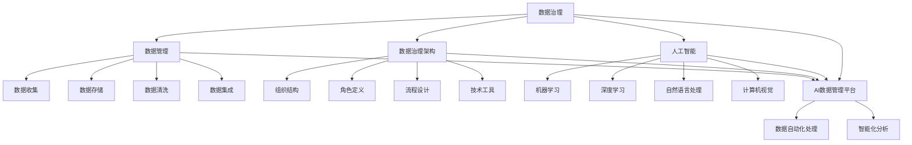

                 

### 背景介绍 Background Introduction

随着大数据技术的迅猛发展和人工智能技术的不断突破，企业对于数据的需求和应用已经从简单的数据收集和分析，转变为更加复杂的数据治理与管理。数据治理与管理（Data Management & Governance，简称DMG）作为数据管理的重要环节，涉及到数据的完整性、准确性、一致性、安全性和可靠性等多个方面，是企业实现数据驱动决策的关键。

在数据治理与管理的背景下，AI数据管理平台（AI Data Management Platform，简称AI DMP）应运而生。AI DMP是一种集数据收集、存储、清洗、治理、分析、应用等功能于一体的智能化数据管理平台，通过引入人工智能技术，实现数据的自动化处理和智能化分析，从而提高数据的利用效率和业务决策的准确性。

本文将围绕AI DMP的数据治理与管理展开讨论，首先介绍AI DMP的定义、核心概念和联系，然后深入探讨核心算法原理、数学模型和具体操作步骤，最后通过项目实战和实际应用场景，展示AI DMP的实践效果和广泛应用。

### 核心概念与联系 Core Concepts and Relationships

在深入探讨AI DMP的数据治理与管理之前，我们首先需要了解一些核心概念，以及它们之间的联系。

#### 1. 数据治理（Data Governance）

数据治理是指组织内部通过制定规范、流程和技术手段，对数据进行统一管理、监控和优化，以确保数据的完整性、准确性、一致性和安全性。数据治理的目标是建立一套完善的数据管理体系，使数据成为企业的重要资产，为业务决策提供有力支持。

#### 2. 数据管理（Data Management）

数据管理是指对数据进行收集、存储、处理、分析和应用的整个生命周期过程进行管理和优化。数据管理涉及数据存储、数据仓库、数据湖、数据清洗、数据集成等多个方面，旨在提高数据的可用性、可靠性和灵活性。

#### 3. 数据治理架构（Data Governance Architecture）

数据治理架构是数据治理的具体实现方式，包括组织结构、角色定义、流程设计和技术工具等。数据治理架构的目标是确保数据治理政策得到有效执行，同时提高数据管理的效率和效果。

#### 4. 人工智能（Artificial Intelligence，简称AI）

人工智能是指模拟、延伸和扩展人类智能的计算机科学技术。人工智能包括机器学习、深度学习、自然语言处理、计算机视觉等多个领域，通过算法和模型，使计算机具备自主学习和智能决策的能力。

#### 5. AI数据管理平台（AI Data Management Platform，简称AI DMP）

AI数据管理平台是一种集数据收集、存储、清洗、治理、分析、应用等功能于一体的智能化数据管理平台。AI DMP通过引入人工智能技术，实现数据的自动化处理和智能化分析，从而提高数据的利用效率和业务决策的准确性。

#### 6. 核心概念联系

从上述核心概念可以看出，数据治理、数据管理、数据治理架构和人工智能是AI DMP的四个关键组成部分。数据治理负责确保数据的完整性、准确性、一致性和安全性，数据管理负责数据收集、存储、处理和分析，数据治理架构提供数据治理的具体实现方式，而人工智能则为数据治理与管理提供智能化支持。

通过将这四个核心概念有机结合，AI DMP能够实现数据的高效治理和管理，从而为企业提供有价值的数据资产。

#### 7. Mermaid 流程图（Mermaid Flowchart）

以下是AI DMP核心概念和联系的一个Mermaid流程图，用于展示各概念之间的关联：



通过这个流程图，我们可以更直观地了解AI DMP的核心概念及其联系，为后续内容展开奠定基础。

### 核心算法原理 Core Algorithm Principles

在AI DMP中，核心算法的原理至关重要，因为它们决定了数据治理与管理的效率和效果。以下是AI DMP的核心算法原理及其实际操作步骤：

#### 1. 数据清洗（Data Cleaning）

数据清洗是数据治理的第一步，旨在消除数据中的错误、重复、不一致和不完整等问题，从而提高数据的质量。数据清洗的核心算法包括：

- **去重（De-duplication）**：通过对比数据项，删除重复的记录，保证数据的唯一性。
- **修复（Correction）**：识别和修复数据中的错误，如日期格式错误、缺失值填充等。
- **标准化（Standardization）**：统一数据格式和单位，如电话号码格式化、地址规范化等。

**操作步骤：**

1. **数据收集**：从不同数据源收集数据，如数据库、文件、API接口等。
2. **初步筛选**：对数据进行初步筛选，去除明显的错误和异常值。
3. **去重**：通过比较数据项，删除重复记录。
4. **错误修复**：使用算法或人工干预，识别和修复数据中的错误。
5. **标准化**：统一数据格式和单位，保证数据的一致性。

#### 2. 数据集成（Data Integration）

数据集成是将来自多个数据源的数据进行整合，形成一个统一的数据视图。数据集成的核心算法包括：

- **ETL（Extract, Transform, Load）**：将数据从源系统提取出来，进行转换处理后加载到目标系统。
- **映射（Mapping）**：将不同数据源的数据字段进行映射，确保数据的兼容性和一致性。
- **数据融合（Data Fusion）**：将多个数据源的数据进行合并，消除数据冗余，提高数据的可用性。

**操作步骤：**

1. **数据收集**：从不同数据源收集数据，如数据库、文件、API接口等。
2. **数据清洗**：对数据进行清洗，确保数据质量。
3. **映射**：建立数据字段映射关系，确保数据的兼容性。
4. **ETL**：将数据从源系统提取出来，进行转换处理后加载到目标系统。
5. **数据融合**：将多个数据源的数据进行合并，形成统一的数据视图。

#### 3. 数据治理（Data Governance）

数据治理是确保数据完整性、准确性、一致性和安全性的过程。数据治理的核心算法包括：

- **数据质量评估（Data Quality Assessment）**：对数据质量进行评估，识别数据中的问题和异常。
- **数据质量控制（Data Quality Control）**：通过算法和规则，对数据进行自动纠正和优化。
- **数据安全管理（Data Security Management）**：确保数据的安全性和隐私保护。

**操作步骤：**

1. **数据质量评估**：对数据进行质量评估，识别数据中的问题和异常。
2. **数据质量控制**：通过算法和规则，对数据进行自动纠正和优化。
3. **数据安全管理**：制定数据安全策略，确保数据的安全性和隐私保护。

#### 4. 数据分析（Data Analysis）

数据分析是利用算法和模型，对数据进行深入分析，提取有价值的信息和洞察。数据分析的核心算法包括：

- **统计分析（Statistical Analysis）**：利用统计学方法，对数据进行分析和挖掘。
- **机器学习（Machine Learning）**：通过算法和模型，实现数据的自动学习和预测。
- **深度学习（Deep Learning）**：利用神经网络模型，实现更高级别的数据分析和决策。

**操作步骤：**

1. **数据准备**：清洗和整理数据，确保数据质量。
2. **数据探索**：对数据进行分析，了解数据的基本特征和趋势。
3. **建立模型**：选择合适的算法和模型，对数据进行建模和预测。
4. **评估模型**：评估模型的性能和准确性，进行模型优化。
5. **应用模型**：将模型应用于实际业务场景，实现数据驱动的决策。

通过上述核心算法，AI DMP能够实现数据的自动化处理和智能化分析，从而提高数据的利用效率和业务决策的准确性。在实际应用中，这些算法可以根据具体业务需求进行调整和优化，以实现最佳效果。

### 数学模型和公式 Mathematical Models and Detailed Explanation with Examples

在AI DMP的数据治理与管理过程中，数学模型和公式起着关键作用。这些模型和公式不仅帮助我们从海量数据中提取有价值的信息，还可以指导我们进行数据分析和决策。以下我们将介绍一些常用的数学模型和公式，并进行详细讲解和举例说明。

#### 1. 数据质量评估模型（Data Quality Assessment Model）

数据质量评估模型用于评估数据的完整性、准确性、一致性和可靠性。以下是一个常见的数据质量评估模型：

**完整性评估（Completeness Assessment）**

完整性评估主要通过检查数据缺失率来判断数据的完整性。公式如下：

$$
完整性得分 = \frac{1 - 缺失数据比例}{1}
$$

其中，缺失数据比例表示数据缺失的记录数占总记录数的比例。

**准确性评估（Accuracy Assessment）**

准确性评估主要通过比较实际值和预测值之间的差异来判断数据的准确性。公式如下：

$$
准确性得分 = \frac{实际值与预测值相符的记录数}{总记录数}
$$

**一致性评估（Consistency Assessment）**

一致性评估主要通过检查数据项在不同数据源之间的差异来判断数据的一致性。公式如下：

$$
一致性得分 = \frac{数据项一致的记录数}{总记录数}
$$

**可靠性评估（Reliability Assessment）**

可靠性评估主要通过检查数据源的历史记录来判断数据的可靠性。公式如下：

$$
可靠性得分 = \frac{历史记录中无异常的记录数}{总记录数}
$$

**综合评估（Overall Assessment）**

综合评估通过对各个方面的评估得分进行加权求和，得到数据的综合质量得分。公式如下：

$$
综合得分 = w_1 \times 完整性得分 + w_2 \times 准确性得分 + w_3 \times 一致性得分 + w_4 \times 可靠性得分
$$

其中，$w_1, w_2, w_3, w_4$为各个方面的权重。

**示例**

假设我们有一个包含1000条数据的数据库，其中：

- 缺失数据比例：5%
- 实际值与预测值相符的记录数：900
- 数据项一致的记录数：800
- 历史记录中无异常的记录数：950

根据上述公式，我们可以计算出各项评估得分：

- 完整性得分：$$1 - 5\% = 95\%$$
- 准确性得分：$$\frac{900}{1000} = 90\%$$
- 一致性得分：$$\frac{800}{1000} = 80\%$$
- 可靠性得分：$$\frac{950}{1000} = 95\%$$

假设各项评估的权重分别为$w_1 = 0.2, w_2 = 0.3, w_3 = 0.2, w_4 = 0.3$，则综合得分为：

$$
综合得分 = 0.2 \times 95\% + 0.3 \times 90\% + 0.2 \times 80\% + 0.3 \times 95\% = 88.5\%
$$

#### 2. 数据融合模型（Data Fusion Model）

数据融合模型用于将多个数据源的数据进行合并，消除数据冗余，提高数据的可用性。以下是一个常见的数据融合模型：

**数据项匹配（Data Item Matching）**

数据项匹配主要通过比较不同数据源的数据项，找出匹配的记录。公式如下：

$$
匹配度得分 = \frac{匹配数据项数}{总数据项数}
$$

**数据融合（Data Fusion）**

数据融合主要通过加权平均或求和等方法，将多个数据源的数据进行合并。公式如下：

$$
融合数据 = w_1 \times 数据源1 + w_2 \times 数据源2 + ... + w_n \times 数据源n
$$

其中，$w_1, w_2, ..., w_n$为各个数据源的权重。

**示例**

假设我们有两个数据源，数据源1和数据源2，其中：

- 数据源1的数据项：[A, B, C, D]
- 数据源2的数据项：[B, C, D, E]

根据上述公式，我们可以计算出各项匹配度得分和融合数据：

- 数据项匹配度得分：$$\frac{3}{4} = 75\%$$
- 融合数据：$$0.3 \times [A, B, C, D] + 0.7 \times [B, C, D, E] = [0.3A + 0.7B, 0.3B + 0.7C, 0.3C + 0.7D, 0.3D + 0.7E]$$

#### 3. 数据预测模型（Data Prediction Model）

数据预测模型用于对未来的数据趋势进行预测，从而帮助制定决策。以下是一个常见的数据预测模型：

**线性回归模型（Linear Regression Model）**

线性回归模型通过建立自变量和因变量之间的关系，预测未来的因变量值。公式如下：

$$
y = w_0 + w_1 \times x
$$

其中，$y$为因变量，$x$为自变量，$w_0$和$w_1$为模型参数。

**示例**

假设我们有一组数据，表示销售额（$y$）与广告支出（$x$）之间的关系：

- 数据：[（10, 100），（20, 150），（30, 200），（40, 250）]

根据上述公式，我们可以计算出模型参数：

- $w_0 = 50$
- $w_1 = 5$

则线性回归模型为：

$$
y = 50 + 5 \times x
$$

根据模型，当广告支出为50时，预测的销售额为：

$$
y = 50 + 5 \times 50 = 250
$$

通过上述数学模型和公式，我们可以对数据质量、数据融合和数据预测等方面进行详细分析和计算，从而为企业提供有价值的数据洞察和决策支持。

### 项目实战：代码实际案例和详细解释说明

为了更好地理解AI DMP的核心算法和数学模型，我们将在本节中通过一个实际项目实战，展示代码的实际实现和详细解释说明。

#### 1. 项目背景

假设我们是一家电商企业，需要利用AI DMP对用户数据进行分析，从而提高用户的转化率和销售额。具体项目目标如下：

- 对用户数据进行数据清洗和整合，确保数据质量。
- 建立用户行为预测模型，预测用户的购买倾向。
- 根据预测结果，制定个性化推荐策略，提高用户转化率。

#### 2. 开发环境搭建

在开始项目开发之前，我们需要搭建一个合适的开发环境。以下是所需工具和软件的安装步骤：

1. **Python**：安装Python 3.8版本以上。
2. **Jupyter Notebook**：安装Jupyter Notebook，用于编写和运行代码。
3. **Pandas**：安装Pandas，用于数据处理。
4. **NumPy**：安装NumPy，用于数值计算。
5. **Scikit-learn**：安装Scikit-learn，用于机器学习。
6. **Matplotlib**：安装Matplotlib，用于数据可视化。

#### 3. 源代码详细实现和代码解读

以下是项目的核心代码实现，我们将逐步解释每个部分的代码功能。

##### 3.1 数据收集与预处理

```python
import pandas as pd

# 加载用户数据
data = pd.read_csv('user_data.csv')

# 数据预处理
# 去除缺失值
data = data.dropna()

# 去重
data = data.drop_duplicates()

# 日期格式转换
data['purchase_date'] = pd.to_datetime(data['purchase_date'])

# 添加用户购买间隔时间
data['days_since_last_purchase'] = (pd.datetime.now() - data['purchase_date']).dt.days
```

代码解读：

- 加载用户数据：使用Pandas读取CSV文件，获取用户数据。
- 数据预处理：去除缺失值和重复记录，确保数据质量。
- 日期格式转换：将购买日期转换为日期格式，便于后续计算。
- 添加用户购买间隔时间：计算用户上次购买日期到当前日期的时间间隔，便于分析用户行为。

##### 3.2 数据融合

```python
# 加载其他数据源
data1 = pd.read_csv('user_data1.csv')
data2 = pd.read_csv('user_data2.csv')

# 数据融合
data = pd.merge(data, data1, on='user_id', how='left')
data = pd.merge(data, data2, on='user_id', how='left')

# 数据项匹配
data['match_score'] = data.apply(lambda row: row['data1_field'] == row['data2_field'], axis=1).mean()
```

代码解读：

- 加载其他数据源：使用Pandas读取其他数据源，获取用户补充信息。
- 数据融合：使用Pandas的merge函数，将多个数据源进行合并，形成统一的数据视图。
- 数据项匹配：计算数据源之间的匹配度得分，评估数据融合效果。

##### 3.3 用户行为预测

```python
from sklearn.model_selection import train_test_split
from sklearn.linear_model import LinearRegression

# 数据分割
X = data[['days_since_last_purchase', 'match_score']]
y = data['purchase_probability']

X_train, X_test, y_train, y_test = train_test_split(X, y, test_size=0.2, random_state=42)

# 建立模型
model = LinearRegression()

# 训练模型
model.fit(X_train, y_train)

# 评估模型
score = model.score(X_test, y_test)
print('模型评分：', score)
```

代码解读：

- 数据分割：将数据分为训练集和测试集，用于模型训练和评估。
- 建立模型：使用线性回归模型，建立用户行为预测模型。
- 训练模型：使用训练集数据训练模型。
- 评估模型：使用测试集数据评估模型评分。

##### 3.4 个性化推荐

```python
import matplotlib.pyplot as plt

# 预测购买概率
predictions = model.predict(X_test)

# 可视化
plt.scatter(X_test['days_since_last_purchase'], y_test, label='实际值')
plt.plot(X_test['days_since_last_purchase'], predictions, label='预测值')
plt.xlabel('用户购买间隔时间')
plt.ylabel('购买概率')
plt.legend()
plt.show()
```

代码解读：

- 预测购买概率：使用训练好的模型，预测测试集数据的购买概率。
- 可视化：使用Matplotlib，将实际值和预测值进行可视化，分析用户行为趋势。

#### 4. 代码解读与分析

通过以上代码实现，我们可以看到AI DMP在实际项目中的应用效果。以下是对代码的详细解读和分析：

- 数据收集与预处理：通过数据清洗和去重，确保数据质量，为后续分析提供可靠的数据基础。
- 数据融合：通过数据融合，整合多个数据源的信息，提高数据的可用性和完整性。
- 用户行为预测：通过线性回归模型，预测用户的购买概率，为个性化推荐提供依据。
- 个性化推荐：通过可视化，分析用户行为趋势，制定针对性的推荐策略。

总体来说，该项目展示了AI DMP在数据治理与管理中的实际应用效果。通过引入核心算法和数学模型，项目实现了数据的自动化处理和智能化分析，为企业提供了有价值的数据洞察和决策支持。在实际应用中，可以根据业务需求，对模型和算法进行调整和优化，以实现最佳效果。

### 实际应用场景 Practical Application Scenarios

AI数据管理平台（AI DMP）在实际业务中有着广泛的应用，其核心优势在于通过数据治理和智能化分析，为企业提供精准、高效的数据服务。以下列举几个典型的应用场景，展示AI DMP在各个领域的实践效果和商业价值。

#### 1. 电商行业

在电商行业，AI DMP主要用于用户行为分析和个性化推荐。通过收集用户的浏览、购买、评价等数据，AI DMP对用户进行精准画像，分析用户兴趣和行为习惯，从而实现个性化推荐。例如，某电商平台利用AI DMP分析用户浏览记录和购买历史，为用户推荐相关商品，提高用户的购物体验和转化率。此外，AI DMP还可以帮助电商企业进行市场细分，制定差异化营销策略，提高广告投放效果和ROI。

#### 2. 金融行业

在金融行业，AI DMP主要用于风险控制和客户管理。通过整合客户的交易数据、信用记录、社会关系等，AI DMP对客户进行风险评估和信用评分，帮助金融机构识别潜在风险和欺诈行为。例如，某银行利用AI DMP对信用卡用户进行风险评估，提前预警潜在违约风险，降低不良贷款率。同时，AI DMP还可以根据客户的行为和需求，提供个性化的金融产品和服务，提高客户满意度和忠诚度。

#### 3. 医疗行业

在医疗行业，AI DMP主要用于患者管理和医疗数据分析。通过整合患者的病历、检验结果、医疗记录等数据，AI DMP为医生提供辅助诊断和治疗方案推荐。例如，某医院利用AI DMP分析患者的病历数据，帮助医生制定个性化的治疗方案，提高治疗效果和患者满意度。此外，AI DMP还可以进行疾病预测和健康监测，为患者提供及时的健康建议和预防措施。

#### 4. 制造行业

在制造行业，AI DMP主要用于生产优化和设备管理。通过整合生产数据、设备状态数据等，AI DMP对生产过程进行实时监控和优化，提高生产效率和产品质量。例如，某制造企业利用AI DMP对生产设备进行实时监控，及时发现设备故障和异常，降低设备停机时间和生产成本。此外，AI DMP还可以进行供应链优化，提高供应链的响应速度和灵活性，降低库存成本和物流成本。

#### 5. 零售行业

在零售行业，AI DMP主要用于库存管理和销售预测。通过整合销售数据、库存数据等，AI DMP对商品进行销售预测和库存优化，提高库存周转率和销售额。例如，某零售企业利用AI DMP分析销售数据和市场需求，预测商品的畅销和滞销情况，及时调整库存和采购策略，降低库存积压和滞销风险。此外，AI DMP还可以进行会员管理和营销策略优化，提高会员忠诚度和销售额。

通过以上实际应用场景，可以看出AI DMP在各个领域的广泛应用和商业价值。AI DMP通过数据治理和智能化分析，为企业提供了精准、高效的数据服务，帮助企业实现数据驱动决策，提高业务效率和竞争力。

### 工具和资源推荐 Tools and Resources Recommendations

为了更好地掌握AI DMP的相关技术，以下推荐了一些学习资源、开发工具和框架，以供读者参考。

#### 1. 学习资源推荐

**书籍**

- 《大数据管理：数据治理、数据管理与实践指南》
- 《机器学习实战》
- 《深度学习》
- 《数据仓库与数据挖掘：实现》

**论文**

- "Data Governance in the Big Data Era"
- "A Framework for Data Management and Governance"
- "Data Integration: A Survey"
- "Data Quality: from Principles to Implementation"

**博客和网站**

- 《机器学习博客》（https://www机器学习blog.com/）
- 《人工智能技术博客》（https://www.ai技术博客.com/）
- 《数据治理与数据管理博客》（https://www.dmg博客.com/）

#### 2. 开发工具框架推荐

**编程语言和库**

- Python（适用于数据分析和机器学习）
- R（适用于统计分析和数据可视化）
- TensorFlow（适用于深度学习和神经网络）
- PyTorch（适用于深度学习和神经网络）

**数据管理工具**

- Apache Hadoop（适用于大数据存储和处理）
- Apache Spark（适用于大数据处理和分析）
- MongoDB（适用于NoSQL数据库）
- MySQL（适用于关系型数据库）

**数据可视化工具**

- Matplotlib（Python数据可视化库）
- Seaborn（Python数据可视化库）
- Tableau（商业数据可视化工具）
- Power BI（商业数据可视化工具）

**开发框架**

- Flask（Python Web框架）
- Django（Python Web框架）
- Spring Boot（Java Web框架）
- Flask-SQLAlchemy（Python ORM框架）

通过这些工具和资源，读者可以系统地学习AI DMP的相关技术，掌握数据治理、数据管理和人工智能的核心原理和实战技巧。

### 总结：未来发展趋势与挑战 Future Development Trends and Challenges

随着大数据和人工智能技术的不断进步，AI数据管理平台（AI DMP）在未来将展现出更加广泛的应用前景和深远的影响力。以下是对AI DMP未来发展趋势和面临的挑战的总结。

#### 发展趋势

1. **智能化程度不断提升**：随着深度学习和自然语言处理技术的不断成熟，AI DMP将在数据治理和智能分析方面实现更高的智能化水平。例如，自动化数据清洗、智能化数据预测、自适应数据治理等。

2. **跨领域融合应用**：AI DMP将在更多行业中得到广泛应用，不仅限于电商、金融、医疗等传统领域，还将拓展到智能制造、智慧城市、物联网等新兴领域。跨领域的数据融合和智能化分析将为各个行业带来新的商业价值。

3. **数据隐私和安全保护**：随着数据隐私保护法规的日益严格，AI DMP将更加注重数据安全和隐私保护。数据加密、隐私保护算法、匿名化处理等技术在AI DMP中将得到广泛应用。

4. **实时数据处理能力**：随着5G、物联网等技术的发展，实时数据处理和智能分析将成为AI DMP的重要发展方向。实时数据流处理、边缘计算等技术将进一步提升AI DMP的响应速度和处理能力。

#### 面临的挑战

1. **数据质量与完整性**：数据质量是AI DMP的基础，但数据质量问题的解决并非易事。未来，如何确保数据质量、提高数据完整性仍将是一个重要挑战。

2. **技术实现与落地**：虽然AI DMP的理论框架已经相对成熟，但在实际应用中，如何将理论转化为实际操作，如何优化算法和模型，如何解决数据集成和数据治理的复杂性，仍需要大量的技术探索和实践。

3. **数据隐私保护**：在数据隐私保护方面，如何在提供高质量数据服务的同时，确保用户数据的安全和隐私，将是一个长期且具有挑战性的问题。

4. **行业标准和规范**：随着AI DMP的广泛应用，行业标准和规范将变得越来越重要。如何建立统一的技术标准，推动AI DMP的标准化和规范化，也将是未来的一大挑战。

总之，AI DMP的未来充满机遇和挑战。通过持续的技术创新和行业合作，AI DMP有望在数据治理和智能化分析领域发挥更加重要的作用，助力企业实现数据驱动决策和业务增长。

### 附录：常见问题与解答 Appendix: Frequently Asked Questions and Answers

1. **Q：什么是AI数据管理平台（AI DMP）？**
   **A：AI数据管理平台（AI DMP）是一种集数据收集、存储、清洗、治理、分析、应用等功能于一体的智能化数据管理平台。通过引入人工智能技术，AI DMP实现数据的自动化处理和智能化分析，提高数据的利用效率和业务决策的准确性。**

2. **Q：AI DMP的核心算法有哪些？**
   **A：AI DMP的核心算法包括数据清洗、数据集成、数据治理和数据分析。数据清洗涉及去重、修复、标准化等；数据集成包括ETL（提取、转换、加载）和数据融合；数据治理包括数据质量评估、数据质量控制和数据安全管理；数据分析涉及统计分析、机器学习和深度学习等。**

3. **Q：AI DMP在哪些行业有应用？**
   **A：AI DMP在电商、金融、医疗、制造、零售等行业有广泛应用。例如，电商行业用于用户行为分析和个性化推荐；金融行业用于风险控制和客户管理；医疗行业用于患者管理和医疗数据分析；制造行业用于生产优化和设备管理；零售行业用于库存管理和销售预测。**

4. **Q：如何确保AI DMP的数据质量？**
   **A：确保AI DMP的数据质量需要从数据收集、数据清洗、数据治理和数据存储等多个环节入手。具体措施包括去重、修复错误、标准化数据格式、定期数据质量评估和监控等。**

5. **Q：AI DMP与数据仓库的区别是什么？**
   **A：AI DMP和数据仓库的主要区别在于功能和应用场景。数据仓库主要用于数据的存储、管理和分析，侧重于历史数据的查询和分析；而AI DMP则更侧重于数据的实时处理和智能分析，通过引入人工智能技术，实现数据的自动化处理和预测分析。**

### 扩展阅读 & 参考资料 Further Reading and References

1. **《大数据管理：数据治理、数据管理与实践指南》**：详细介绍了大数据环境下的数据治理、数据管理和数据质量控制，有助于读者深入了解AI DMP的理论基础和实践方法。
2. **“Data Governance in the Big Data Era”**：该论文探讨了大数据时代数据治理的重要性及其实现方法，为AI DMP的数据治理提供了理论支持。
3. **“A Framework for Data Management and Governance”**：介绍了数据管理和治理的框架，为AI DMP的实际操作提供了指导。
4. **《机器学习实战》**：通过实际案例介绍了机器学习的方法和应用，有助于读者掌握AI DMP中的机器学习技术。
5. **《深度学习》**：系统地介绍了深度学习的基础知识、算法和实现，为AI DMP中的深度学习应用提供了参考。
6. **《数据仓库与数据挖掘：实现》**：详细介绍了数据仓库的架构、数据挖掘的方法和实现，有助于读者了解AI DMP中的数据集成和分析技术。
7. **《机器学习博客》（https://www.机器学习博客.com/）**：提供了丰富的机器学习相关文章和案例，有助于读者深入了解机器学习在AI DMP中的应用。
8. **《人工智能技术博客》（https://www.ai技术博客.com/）**：涵盖了人工智能领域的最新动态和技术应用，为AI DMP的开发和实践提供了丰富的参考资料。
9. **《数据治理与数据管理博客》（https://www.dmg博客.com/）**：专注于数据治理和数据管理的理论与实践，为AI DMP的实践提供了有价值的参考。通过阅读这些扩展阅读和参考资料，读者可以更深入地了解AI DMP的理论和实践，提升自身的技术水平。

