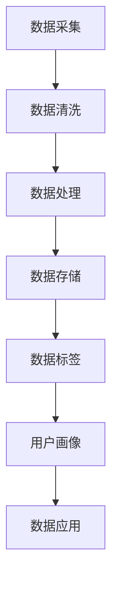

                 

### 背景介绍

随着人工智能技术的发展，数据已成为企业决策的核心驱动力。在此背景下，数据管理平台（Data Management Platform，简称DMP）作为大数据领域的关键工具，逐渐受到广泛关注。DMP的主要功能是收集、处理、存储和分析多源数据，从而为企业提供精准的营销决策支持。

DMP的应用场景非常广泛，主要包括以下几方面：

1. **用户画像构建**：通过收集用户在互联网上的行为数据，如浏览历史、搜索记录、购物偏好等，构建详细且多维的用户画像。这些画像可以帮助企业更好地了解目标用户，实现精准营销。

2. **广告投放优化**：利用DMP对用户进行精准定位，提高广告投放的效果。通过分析用户的兴趣和行为，DMP可以为每个用户制定个性化的广告策略，提高广告点击率和转化率。

3. **内容个性化推荐**：DMP可以帮助企业根据用户的兴趣和行为，推荐与其喜好相关的产品和服务，提升用户满意度和粘性。

4. **客户关系管理**：通过分析客户行为数据，DMP可以帮助企业更好地理解客户需求，优化客户服务策略，提升客户忠诚度。

在我国，随着数字经济的发展，越来越多的企业开始重视数据管理。根据《2020年中国大数据产业发展报告》，我国大数据市场规模已达到约6900亿元，预计到2025年将突破1.2万亿元。在这种背景下，DMP作为大数据领域的关键工具，其市场规模也在逐年扩大。

然而，DMP的应用并非一帆风顺。在实际操作过程中，企业面临着诸多挑战，如数据质量不高、数据整合困难、隐私保护等问题。这些问题不仅影响了DMP的效能，也给企业的数据管理带来了巨大的挑战。

为了解决这些问题，企业需要从技术、管理和战略等多个层面进行深入探索。首先，在技术层面，企业需要不断提升数据采集、处理和分析的能力，采用先进的机器学习和数据挖掘技术，提高数据质量和分析精度。其次，在管理层面，企业需要建立完善的数据管理制度，确保数据的安全性和合规性。最后，在战略层面，企业需要将数据管理纳入整体战略规划，将其作为核心竞争力来培养。

总之，随着人工智能和数据技术的不断发展，DMP将在未来发挥越来越重要的作用。企业只有充分认识到DMP的重要性，并采取有效的措施解决应用过程中面临的问题，才能在数据驱动的营销中占据有利地位。

### 核心概念与联系

要深入理解DMP（数据管理平台）的工作原理，我们首先需要掌握几个核心概念：用户画像、数据标签、数据存储和数据处理。

**用户画像**：用户画像是对用户特征的综合描述，通常包括用户的基本信息、行为数据、兴趣偏好等多个维度。例如，一个用户的用户画像可能包含年龄、性别、职业、地理位置、搜索记录、浏览历史、购买偏好等。用户画像的构建是DMP的基础工作，它有助于企业深入了解用户，实现精准营销。

**数据标签**：数据标签是对数据属性的标注，它可以用来描述和分类数据。例如，一个用户的浏览记录可以被标注为“科技新闻”、“购物网站”等标签。数据标签的引入，使得数据变得更加结构化，方便后续的处理和分析。

**数据存储**：数据存储是DMP的重要组成部分，它负责将收集到的数据进行持久化存储。常见的数据存储技术包括关系型数据库（如MySQL、PostgreSQL）和非关系型数据库（如MongoDB、Redis）。数据存储不仅要保证数据的可靠性，还要具备较高的查询性能，以满足实时分析的需求。

**数据处理**：数据处理是DMP的核心功能之一，它负责对存储好的数据进行清洗、转换、聚合等操作。数据处理通常包括批处理和实时处理两种模式。批处理适用于大规模数据的离线分析，而实时处理则适用于对实时数据的快速响应。

下面，我们将通过Mermaid流程图来展示DMP的核心架构和工作流程。



**Mermaid流程图解释**：

- **A[数据采集]**：这一步涉及从各种数据源（如网站、APP、传感器等）收集数据。数据采集可以采用API接口、网络爬虫等技术手段。

- **B[数据清洗]**：数据清洗是对采集到的数据进行预处理，去除重复、错误、缺失的数据，保证数据的质量。

- **C[数据处理]**：数据处理包括数据清洗后的进一步加工，如数据转换、数据聚合等。这一步通常采用ETL（提取、转换、加载）技术来实现。

- **D[数据存储]**：数据存储是将处理后的数据持久化存储到数据库中，以便后续查询和分析。

- **E[数据标签]**：数据标签是对存储好的数据进行标注，方便分类和查询。例如，可以将用户的行为数据标注为“浏览”、“购买”等标签。

- **F[用户画像]**：用户画像是对数据进行综合分析，构建出详细的用户特征描述。这有助于企业实现精准营销。

- **G[数据应用]**：数据应用是利用用户画像进行具体的业务操作，如广告投放、内容推荐、客户关系管理等。

通过上述流程，我们可以看到DMP是如何将原始数据转化为有价值的信息，并为企业提供决策支持的。DMP的核心架构和工作流程不仅展示了数据从采集到应用的整个过程，也体现了数据驱动营销的基本原理。

在接下来的章节中，我们将进一步探讨DMP的核心算法原理、具体操作步骤，以及数学模型和公式的应用，帮助读者深入理解DMP的工作机制和应用价值。

### 核心算法原理 & 具体操作步骤

DMP（数据管理平台）的核心算法主要包括用户画像构建、数据标签管理、数据聚类分析等。这些算法的实现不仅决定了DMP的性能，也直接影响其为企业提供的决策支持效果。在本节中，我们将详细探讨这些算法的原理和具体操作步骤。

#### 1. 用户画像构建算法

用户画像构建是DMP的核心任务之一。其基本原理是通过分析用户的多种行为数据，提取出具有代表性的特征，从而构建出详细的用户画像。以下是用户画像构建的基本步骤：

**步骤1：数据采集与预处理**
- 采集用户在互联网上的行为数据，如浏览记录、搜索记录、购买行为等。
- 对采集到的数据进行预处理，包括去除重复数据、填补缺失数据、处理异常数据等。

**步骤2：特征提取**
- 根据业务需求，选择适当的特征提取方法。常见的特征提取方法包括基于统计的方法（如TF-IDF）、基于机器学习的方法（如主题模型）等。
- 对提取出的特征进行归一化处理，以消除不同特征之间的尺度差异。

**步骤3：用户画像构建**
- 利用特征向量构建用户画像，通常采用向量空间模型表示。例如，可以使用K-Means算法对用户进行聚类，生成不同的用户群体，并分别构建用户画像。

#### 2. 数据标签管理算法

数据标签管理是DMP的另一项重要功能。其基本原理是通过为数据赋予不同的标签，实现对数据的分类和管理。以下是数据标签管理的基本步骤：

**步骤1：标签定义**
- 根据业务需求，定义数据标签的类别和属性。例如，可以将用户行为数据标签分为“浏览行为”、“购买行为”、“互动行为”等类别。

**步骤2：标签赋值**
- 对采集到的数据进行标签赋值，根据数据的特征和属性，将其归类到相应的标签类别中。例如，如果一个用户的浏览记录包含多个与“购物”相关的关键词，那么可以将该用户的浏览行为标签为“购物”。

**步骤3：标签更新与维护**
- 随着数据的不断更新，定期对标签进行更新和维护，以保持标签的准确性和有效性。例如，可以根据用户最新的行为数据，调整其标签类别。

#### 3. 数据聚类分析算法

数据聚类分析是DMP中的高级功能，其基本原理是将具有相似特征的数据点划分为同一类别。以下是数据聚类分析的基本步骤：

**步骤1：选择聚类算法**
- 根据业务需求和数据特点，选择合适的聚类算法。常见的聚类算法包括K-Means、DBSCAN、层次聚类等。

**步骤2：初始化聚类中心**
- 对于K-Means算法，需要初始化聚类中心。初始化方法包括随机初始化、K-means++初始化等。

**步骤3：迭代计算聚类中心**
- 通过迭代计算，逐步调整聚类中心，直到聚类中心不再发生显著变化。具体方法包括距离计算、重新分配数据点等。

**步骤4：生成聚类结果**
- 根据最终稳定的聚类中心，生成聚类结果，为每个数据点分配所属类别。

#### 4. 用户行为预测算法

用户行为预测是DMP的高级应用，其基本原理是利用历史数据，预测用户未来的行为趋势。以下是用户行为预测的基本步骤：

**步骤1：数据准备**
- 收集用户的历史行为数据，包括浏览记录、购买记录、搜索记录等。

**步骤2：特征工程**
- 对历史行为数据进行特征提取和工程，构建用户行为特征向量。

**步骤3：模型选择**
- 选择合适的预测模型，如线性回归、决策树、神经网络等。

**步骤4：模型训练与评估**
- 利用历史行为数据进行模型训练，并对模型进行评估，选择最优模型。

**步骤5：预测用户行为**
- 利用训练好的模型，预测用户未来的行为趋势，为营销决策提供支持。

通过上述核心算法的具体操作步骤，我们可以看到DMP是如何通过数据采集、处理和分析，构建用户画像，实现对用户的精准定位和营销优化的。这些算法不仅体现了数据驱动营销的基本原理，也为企业在数字经济时代提供了强有力的技术支持。

在下一章节中，我们将深入探讨DMP中使用的数学模型和公式，并举例说明其具体应用，帮助读者更好地理解DMP的技术原理。

### 数学模型和公式 & 详细讲解 & 举例说明

在DMP（数据管理平台）中，数学模型和公式起着至关重要的作用。它们不仅帮助我们对海量数据进行有效分析，还能提高数据预测的准确性和决策的可靠性。本节将详细讲解DMP中常用的数学模型和公式，并通过实际例子来说明其应用。

#### 1. 用户行为预测模型

用户行为预测是DMP的核心应用之一。常见的用户行为预测模型包括线性回归、决策树和神经网络等。以下是这些模型的基本原理和公式：

**（1）线性回归**

线性回归模型是一种简单且常用的预测方法。其基本公式为：

$$
y = \beta_0 + \beta_1x_1 + \beta_2x_2 + ... + \beta_nx_n
$$

其中，$y$ 为预测目标，$x_1, x_2, ..., x_n$ 为输入特征，$\beta_0, \beta_1, \beta_2, ..., \beta_n$ 为模型参数。通过最小化损失函数（如均方误差），我们可以得到最优的参数值。

**（2）决策树**

决策树模型通过构建树形结构来对数据进行分类或回归。其基本结构包括根节点、内部节点和叶子节点。决策树的基本公式为：

$$
y = f(x) = g_1(x) \cdot p_1 + g_2(x) \cdot p_2 + ... + g_n(x) \cdot p_n
$$

其中，$y$ 为预测目标，$x$ 为输入特征，$g_1(x), g_2(x), ..., g_n(x)$ 为决策函数，$p_1, p_2, ..., p_n$ 为概率分布。

**（3）神经网络**

神经网络是一种模拟人脑结构的计算模型，通过多层神经元进行数据转换和预测。其基本公式为：

$$
a_{i}(t) = \sigma \left( \sum_{j} w_{ij}a_{j}(t-1) + b_{i} \right)
$$

其中，$a_{i}(t)$ 为第 $i$ 层第 $t$ 个神经元的输出，$w_{ij}$ 为权重，$b_{i}$ 为偏置，$\sigma$ 为激活函数（如Sigmoid函数）。

**例子1：线性回归模型在用户行为预测中的应用**

假设我们要预测用户是否会购买某产品，输入特征包括用户年龄、收入和浏览时间。我们可以使用线性回归模型来建立预测模型。

$$
y = \beta_0 + \beta_1x_1 + \beta_2x_2
$$

其中，$y$ 表示是否购买（0表示不购买，1表示购买），$x_1$ 表示用户年龄，$x_2$ 表示用户收入。

通过收集历史数据，我们可以训练线性回归模型，得到最优的参数值。例如，假设训练后的模型公式为：

$$
y = 5 + 2x_1 + 3x_2
$$

如果我们有一个新用户，其年龄为25岁，收入为8000元，则预测其是否会购买某产品：

$$
y = 5 + 2 \times 25 + 3 \times 8000 = 155
$$

由于 $y > 0$，我们可以预测该用户会购买某产品。

**例子2：决策树模型在用户行为预测中的应用**

假设我们要预测用户是否会点击广告，输入特征包括用户年龄、浏览时间和广告类型。我们可以使用决策树模型来建立预测模型。

$$
y = g(x) = g_1(x) \cdot p_1 + g_2(x) \cdot p_2
$$

其中，$g_1(x)$ 和 $g_2(x)$ 分别为两个决策函数，$p_1$ 和 $p_2$ 分别为两个概率分布。

通过训练决策树模型，我们可以得到如下的决策规则：

- 如果用户年龄小于30岁，则点击广告的概率为0.6；
- 如果用户年龄大于等于30岁，则点击广告的概率为0.8。

如果我们有一个新用户，其年龄为28岁，则预测其是否会点击广告：

- 由于用户年龄小于30岁，根据决策规则，点击广告的概率为0.6。

**例子3：神经网络模型在用户行为预测中的应用**

假设我们要预测用户是否会购买某产品，输入特征包括用户年龄、收入和浏览时间。我们可以使用神经网络模型来建立预测模型。

$$
a_{i}(t) = \sigma \left( \sum_{j} w_{ij}a_{j}(t-1) + b_{i} \right)
$$

通过训练神经网络模型，我们可以得到如下的权重和偏置：

$$
w_{11} = 0.1, w_{12} = 0.2, b_1 = 0.3 \\
w_{21} = 0.4, w_{22} = 0.5, b_2 = 0.6
$$

如果我们有一个新用户，其年龄为25岁，收入为8000元，浏览时间为30分钟，则预测其是否会购买某产品：

$$
a_1(1) = \sigma (0.1 \cdot 25 + 0.2 \cdot 8000 + 0.3) = 0.9 \\
a_2(1) = \sigma (0.4 \cdot 25 + 0.5 \cdot 8000 + 0.6) = 0.95
$$

根据神经网络的输出，我们可以预测该用户购买某产品的概率为 $0.9 \cdot 0.95 = 0.855$。

通过上述例子，我们可以看到数学模型和公式在DMP中的应用。它们不仅帮助我们对用户行为进行预测，还能为企业的营销决策提供有力支持。在下一章节中，我们将通过实际案例，展示如何使用DMP进行项目开发和实战应用。

### 项目实战：代码实际案例和详细解释说明

在本节中，我们将通过一个实际案例来展示如何使用DMP（数据管理平台）进行项目开发和实战应用。本案例将涵盖数据采集、数据预处理、用户画像构建和数据应用等环节。以下是具体的步骤和代码实现。

#### 1. 开发环境搭建

在开始项目之前，我们需要搭建一个合适的技术环境。以下是所需的开发工具和库：

- **Python**：作为主要编程语言
- **Pandas**：用于数据处理
- **NumPy**：用于数学计算
- **Scikit-learn**：用于机器学习和数据分析
- **MongoDB**：用于数据存储
- **Flask**：用于构建Web应用

安装这些工具和库后，我们可以开始实际的项目开发。

#### 2. 源代码详细实现和代码解读

以下是一个简单的DMP项目示例，包括数据采集、数据预处理、用户画像构建和Web应用。

**代码1：数据采集**

```python
import requests
import pandas as pd

# 假设有一个API用于获取用户数据
url = "https://api.example.com/users"

# 发送GET请求获取用户数据
response = requests.get(url)
data = response.json()

# 将数据转换为Pandas DataFrame
users_df = pd.DataFrame(data['users'])
```

**代码解读**：

这段代码使用`requests`库从API获取用户数据，并将数据转换为Pandas DataFrame。用户数据可能包括用户的ID、年龄、性别、地理位置等信息。

**代码2：数据预处理**

```python
from sklearn.preprocessing import MinMaxScaler

# 对用户数据进行预处理，包括去除缺失值、填充缺失值、数据归一化等
def preprocess_data(df):
    # 去除缺失值
    df = df.dropna()
    
    # 填充缺失值（例如，使用平均值填充）
    df['age'] = df['age'].fillna(df['age'].mean())
    
    # 数据归一化
    scaler = MinMaxScaler()
    df[['age', 'income']] = scaler.fit_transform(df[['age', 'income']])
    
    return df

# 应用预处理函数
users_df = preprocess_data(users_df)
```

**代码解读**：

这段代码定义了一个预处理函数`preprocess_data`，用于处理用户数据。预处理步骤包括去除缺失值、填充缺失值和数据归一化。这些步骤有助于提高数据质量，为后续分析做好准备。

**代码3：用户画像构建**

```python
from sklearn.cluster import KMeans

# 构建用户画像，使用K-Means算法进行聚类
def build_user_profile(df, n_clusters=3):
    # 特征提取（例如，仅使用年龄和收入作为特征）
    features = df[['age', 'income']]
    
    # K-Means聚类
    kmeans = KMeans(n_clusters=n_clusters)
    kmeans.fit(features)
    
    # 将聚类结果添加到用户数据中
    df['cluster'] = kmeans.labels_
    
    return df

# 应用用户画像构建函数
users_df = build_user_profile(users_df)
```

**代码解读**：

这段代码定义了一个用户画像构建函数`build_user_profile`，使用K-Means算法对用户数据进行聚类，生成用户画像。用户画像通过聚类结果（即用户所属的簇）来表示。

**代码4：Web应用**

```python
from flask import Flask, request, jsonify

app = Flask(__name__)

# 建立Web接口，用于获取用户画像
@app.route('/user_profile', methods=['GET'])
def get_user_profile():
    user_id = request.args.get('user_id')
    user_df = users_df[users_df['id'] == int(user_id)]
    profile = user_df[['age', 'income', 'cluster']].to_dict('records')[0]
    return jsonify(profile)

if __name__ == '__main__':
    app.run(debug=True)
```

**代码解读**：

这段代码使用Flask框架构建了一个简单的Web应用。Web应用提供了一个接口，用于获取特定用户的画像信息。用户可以通过发送GET请求，传递用户ID来获取其画像。

#### 3. 代码解读与分析

**代码1** 主要负责从API获取用户数据，并将其转换为Pandas DataFrame。这是数据采集的第一步，也是后续数据处理和分析的基础。

**代码2** 定义了一个预处理函数，用于处理用户数据。预处理步骤包括去除缺失值、填充缺失值和数据归一化。这些步骤有助于提高数据质量，为后续分析做好准备。

**代码3** 定义了一个用户画像构建函数，使用K-Means算法对用户数据进行聚类，生成用户画像。用户画像通过聚类结果（即用户所属的簇）来表示。

**代码4** 使用Flask框架构建了一个简单的Web应用，提供了一个接口，用于获取特定用户的画像信息。用户可以通过发送GET请求，传递用户ID来获取其画像。

通过上述代码，我们可以看到如何使用DMP进行项目开发和实战应用。在实际项目中，DMP的功能和复杂性会更高，但基本的步骤和原理是相似的。在实际应用中，DMP可以帮助企业实现精准营销、优化广告投放、提升客户满意度等。

### 实际应用场景

在当今的数字化时代，数据管理平台（DMP）已经在多个行业和领域得到了广泛应用，为企业的市场营销、客户关系管理和运营优化提供了强大的支持。以下是DMP在几个关键领域的实际应用场景：

#### 1. 互联网广告行业

互联网广告行业是DMP应用最为广泛的领域之一。通过DMP，广告公司可以收集和分析用户在互联网上的行为数据，如浏览历史、搜索记录和点击行为，构建精准的用户画像。这些画像数据可以用于以下几个方面：

- **精准投放**：广告公司可以利用DMP对用户进行精准定位，根据用户的兴趣和行为特征，投放与其高度相关的广告。这大大提高了广告的点击率和转化率，降低了广告投放的成本。
- **优化广告策略**：通过分析用户的反馈和行为数据，广告公司可以不断优化广告内容、投放时间和渠道，提高广告效果。
- **客户细分**：DMP可以帮助广告公司将用户划分为不同的群体，制定个性化的营销策略。例如，根据用户的购买历史和行为，可以将用户分为“潜在客户”、“忠诚客户”和“流失客户”等群体，并采取相应的营销措施。

#### 2. 零售和电商行业

零售和电商行业也是DMP的重要应用领域。通过DMP，零售和电商企业可以实现以下目标：

- **个性化推荐**：DMP可以收集和分析用户的浏览记录、购买行为和偏好，为用户提供个性化的产品推荐。这有助于提升用户体验和粘性，提高销售额。
- **客户关系管理**：DMP可以帮助企业构建详细的客户画像，了解客户的偏好和需求，提供个性化的服务和优惠。这有助于提高客户满意度和忠诚度，降低客户流失率。
- **库存管理**：通过分析销售数据和市场需求，DMP可以帮助企业优化库存管理，减少库存积压和库存短缺。

#### 3. 金融和保险行业

在金融和保险行业，DMP的应用主要体现在以下几个方面：

- **风险管理**：DMP可以帮助金融机构收集和分析客户的财务数据、交易行为和信用记录，评估客户的风险等级，制定相应的风控策略。
- **精准营销**：DMP可以收集和分析客户的消费习惯和偏好，为其提供个性化的金融产品推荐和营销策略。例如，根据客户的收入水平和风险承受能力，推荐合适的理财产品或保险产品。
- **欺诈检测**：DMP可以实时监测客户的交易行为，识别异常行为和潜在欺诈，提高欺诈检测的准确性和效率。

#### 4. 媒体和内容行业

在媒体和内容行业，DMP的应用主要体现在以下几个方面：

- **内容推荐**：DMP可以收集和分析用户的浏览历史、搜索记录和偏好，为用户提供个性化的内容推荐。这有助于提高用户粘性和用户满意度，增加广告收入。
- **广告优化**：通过分析用户的反馈和行为数据，媒体和内容提供商可以不断优化广告策略，提高广告效果和投放效率。
- **用户细分**：DMP可以帮助媒体和内容提供商将用户划分为不同的群体，制定个性化的内容策略和营销措施。例如，根据用户的年龄、性别、地理位置和兴趣爱好，提供不同的内容和服务。

通过上述实际应用场景，我们可以看到DMP在各个行业和领域的重要性。DMP不仅可以帮助企业实现精准营销、优化客户关系管理和提升运营效率，还能为企业的数据驱动决策提供强有力的支持。

### 工具和资源推荐

在DMP（数据管理平台）领域，有许多优秀的工具和资源可以帮助开发者更好地理解和使用DMP。以下是一些值得推荐的工具、书籍、论文和网站。

#### 1. 学习资源推荐

**书籍：**
- 《大数据管理：技术、方法和应用》
- 《数据挖掘：概念与技术》
- 《数据驱动营销：使用数据提高营销效果》

**论文：**
- "Data Management Platforms: A Comprehensive Review"
- "The Impact of Data Management Platforms on Online Advertising Performance"
- "A Survey on Data Management Platforms: Technologies and Applications"

**网站：**
- DMP知识库：[DMP Knowledge Base](https://dmpknowledgebase.com/)
- DMP专家社区：[DMP Experts Community](https://dmpexperts.community/)
- 谷歌DMP指南：[Google DMP Guide](https://support.google.com/doubleclickforpublishers/answer/7282619?hl=en)

#### 2. 开发工具框架推荐

**工具：**
- **Google Analytics**：用于数据收集和分析，是构建DMP的重要基础。
- **Adobe Audience Manager**：一家领先的DMP解决方案提供商，提供了丰富的功能和强大的数据分析能力。
- **Segment**：一个数据收集和传输平台，可以帮助开发者轻松集成多个数据源，构建自定义DMP。

**框架：**
- **Apache Beam**：一个用于大规模数据处理和流处理的框架，适用于构建高性能的DMP系统。
- **Apache Hadoop**：一个分布式数据处理平台，适用于大规模数据存储和处理。
- **Apache Spark**：一个高速的大数据处理引擎，适用于复杂的数据分析和机器学习任务。

#### 3. 相关论文著作推荐

**书籍：**
- 《数据管理平台：技术与实战》
- 《大数据时代的数据管理：技术与策略》

**论文：**
- "Data Management Platforms for Personalized Advertising: A Systematic Review"
- "The Impact of Data Management Platforms on Consumer Privacy"
- "Data Management Platforms: A Research Perspective"

通过上述工具和资源的推荐，开发者可以更深入地了解DMP的技术原理和应用场景，从而更好地构建和优化DMP系统，为企业的数据驱动决策提供强有力的支持。

### 总结：未来发展趋势与挑战

随着人工智能和数据技术的不断进步，DMP（数据管理平台）在未来的发展趋势中无疑将扮演更加重要的角色。以下是DMP在未来可能面临的发展趋势和挑战。

#### 1. 发展趋势

**数据融合与分析能力的提升**：未来的DMP将更加注重数据融合与分析能力。通过集成更多类型的数据源（如社交媒体、物联网数据等），DMP将能够提供更全面和细致的用户画像，为企业提供更精准的营销决策支持。

**实时处理与分析**：随着5G和云计算技术的发展，DMP将实现实时数据处理与分析。这种能力将使得企业能够更迅速地响应市场变化，优化营销策略，提升用户体验。

**自动化与智能化**：未来的DMP将更加依赖自动化和智能化技术。通过机器学习和人工智能算法，DMP将能够自动识别用户行为模式，预测用户需求，实现智能推荐和个性化营销。

**数据隐私保护**：随着全球数据隐私法规的日益严格，DMP将在数据收集和处理过程中更加注重数据隐私保护。采用先进的数据加密和匿名化技术，确保用户数据的安全和合规。

#### 2. 挑战

**数据质量和数据安全**：数据质量和数据安全是DMP应用中的关键挑战。随着数据来源的增多和数据量的扩大，如何保证数据的质量和安全性成为企业面临的重大难题。

**技术复杂度和成本**：DMP系统的构建和运维涉及众多技术和资源，技术复杂度和成本相对较高。企业需要在预算和技术投入之间找到平衡，以确保DMP系统的稳定运行。

**法规合规**：全球范围内的数据隐私法规日益严格，企业需要确保DMP系统的合规性。这不仅要求企业遵循当地的法律法规，还需要应对不同国家或地区之间的数据保护差异。

**人才需求**：DMP的发展对人才的需求越来越高。企业需要招聘和培养具有数据管理、数据分析、人工智能等多方面知识的专业人才，以应对不断变化的市场需求。

综上所述，DMP在未来的发展趋势中充满了机遇与挑战。企业需要紧跟技术发展，积极应对挑战，通过不断提升数据管理能力，实现数据驱动的业务增长。

### 附录：常见问题与解答

在DMP（数据管理平台）的应用过程中，用户可能会遇到一系列问题。以下是一些常见的问题及其解答：

**Q1：什么是DMP？**
A1：DMP（Data Management Platform）是一种数据管理工具，用于收集、处理、存储和分析多源数据，为企业提供精准的营销决策支持。DMP主要通过用户画像构建、数据标签管理、数据聚类分析和用户行为预测等功能，实现数据的深度分析和应用。

**Q2：DMP和CRM有何区别？**
A2：DMP和CRM（Customer Relationship Management，客户关系管理）都是企业数据管理的重要工具，但侧重点不同。DMP主要侧重于数据的收集、处理和分析，用于构建用户画像和实现精准营销。而CRM则侧重于客户关系管理和客户服务，用于管理客户信息、维护客户关系和提升客户满意度。

**Q3：如何评估DMP的效果？**
A3：评估DMP的效果可以从多个维度进行。例如，可以通过分析广告投放效果（如点击率、转化率等）、客户留存率、客户满意度等关键指标来评估DMP的应用效果。此外，还可以通过定期进行用户反馈调查，了解用户对个性化推荐和营销策略的满意度。

**Q4：DMP是否会影响用户隐私？**
A4：DMP在数据收集和处理过程中会严格遵循数据隐私保护法规，确保用户数据的安全和合规。通过数据加密、匿名化和权限控制等技术手段，DMP可以有效保护用户隐私，避免数据泄露和滥用。

**Q5：如何选择适合的DMP工具？**
A5：选择适合的DMP工具需要考虑多个因素，如数据规模、业务需求、技术支持等。首先，需要明确企业对DMP的具体需求，如数据采集、用户画像构建、广告投放优化等。然后，评估不同DMP工具的功能、性能和成本，选择最合适的工具。此外，还需要考虑工具的兼容性、扩展性和用户支持等。

### 扩展阅读 & 参考资料

为了更好地理解和应用DMP（数据管理平台），以下是一些扩展阅读和参考资料，供读者进一步学习：

1. **书籍推荐**：
   - 《大数据管理：技术、方法和应用》
   - 《数据挖掘：概念与技术》
   - 《数据驱动营销：使用数据提高营销效果》

2. **论文推荐**：
   - "Data Management Platforms: A Comprehensive Review"
   - "The Impact of Data Management Platforms on Online Advertising Performance"
   - "A Survey on Data Management Platforms: Technologies and Applications"

3. **网站推荐**：
   - DMP知识库：[DMP Knowledge Base](https://dmpknowledgebase.com/)
   - DMP专家社区：[DMP Experts Community](https://dmpexperts.community/)
   - 谷歌DMP指南：[Google DMP Guide](https://support.google.com/doubleclickforpublishers/answer/7282619?hl=en)

4. **在线课程与教程**：
   - Coursera上的《大数据分析》课程
   - Udemy上的《数据管理平台实战教程》
   - edX上的《数据挖掘与机器学习》课程

通过这些扩展阅读和参考资料，读者可以更深入地了解DMP的技术原理和应用实践，为企业的数据驱动决策提供有力支持。

