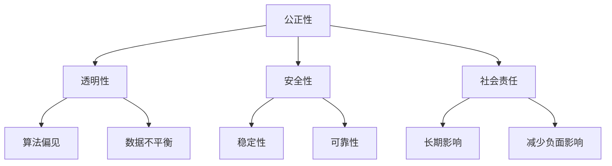
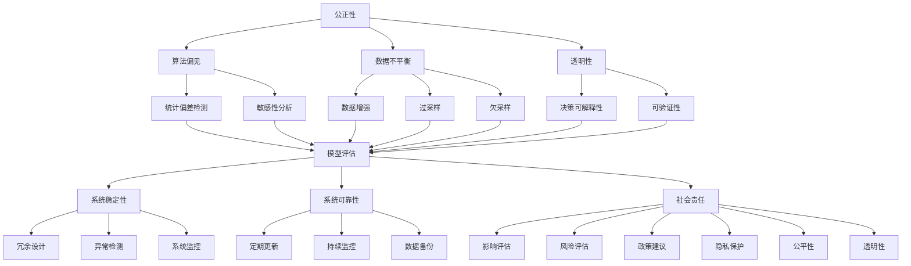

                 

### 文章标题

**AI伦理规范：引导AI 2.0技术的健康发展**

> **关键词**：人工智能伦理，AI 2.0，技术发展，社会责任，规范制定

> **摘要**：本文深入探讨了人工智能伦理的重要性，分析了当前AI 2.0技术的现状和挑战，并提出了相应的伦理规范和实施建议。文章旨在引导AI 2.0技术的健康发展，确保其在促进社会进步的同时，避免对人类和社会带来的潜在风险。

### 背景介绍

#### 人工智能的发展历程

人工智能（Artificial Intelligence，简称AI）作为计算机科学的一个重要分支，其发展历程可以追溯到20世纪50年代。从最初的符号逻辑和知识表示，到机器学习和深度学习的广泛应用，AI技术已经取得了显著的进步。

##### AI 1.0时代的代表性技术

AI 1.0时代主要集中在符号逻辑和知识表示领域。这一时期，研究者们致力于开发能够模拟人类推理过程的程序。代表性技术包括专家系统和逻辑推理机。专家系统是一种基于规则的知识系统，通过预先定义的规则库和事实库来模拟专家的决策过程。逻辑推理机则通过逻辑演算来处理符号表示的信息。

##### AI 2.0时代的变革

AI 2.0时代，以深度学习为代表的机器学习技术取得了突破性进展。深度学习通过多层神经网络的结构，实现了对大规模数据的自动特征学习和模式识别。这一时期，AI技术开始在图像识别、语音识别、自然语言处理等领域展现强大的能力。

#### AI伦理的重要性

随着AI技术的快速发展，伦理问题日益凸显。AI伦理涉及到技术决策的公正性、透明性、安全性以及对社会的影响等方面。伦理规范的制定不仅有助于确保AI技术的健康发展，还能够引导其在社会各个领域的合理应用。

### 核心概念与联系

为了更好地理解AI伦理规范，我们需要先了解以下几个核心概念：

#### 公正性

公正性是AI伦理规范中的一个重要原则。它要求AI系统在处理数据和应用技术时，不偏袒任何一方，确保结果的公平性。公正性涉及到算法的偏见、数据的不平衡以及算法的透明性等问题。

#### 透明性

透明性是指AI系统的决策过程应该是可解释和可验证的。透明性有助于提高公众对AI技术的信任，并能够发现和纠正潜在的错误和偏见。

#### 安全性

安全性是AI伦理规范中的重要方面。AI系统在处理敏感数据和执行关键任务时，需要确保其稳定性和可靠性，避免对人类和社会造成不可逆转的损害。

#### 社会责任

社会责任要求AI开发者在使用和推广AI技术时，考虑到其对社会的长期影响，并采取相应的措施来减少负面影响。

#### Mermaid流程图

以下是关于AI伦理规范的核心概念和联系的Mermaid流程图：



### 核心算法原理 & 具体操作步骤

为了制定有效的AI伦理规范，我们需要了解一些核心算法原理和具体操作步骤。以下是一些常用的算法和方法：

#### 偏见检测与修正

偏见检测与修正是一种用于识别和纠正AI算法偏见的技术。具体操作步骤如下：

1. **数据收集**：收集用于训练AI模型的数据集，确保数据来源的多样性和代表性。
2. **特征提取**：对数据进行预处理，提取出有用的特征信息。
3. **模型训练**：使用训练数据集训练AI模型，并评估模型的性能。
4. **偏见检测**：通过对比模型在不同群体上的性能差异，识别出潜在的偏见。
5. **修正策略**：根据偏见检测结果，采取相应的修正策略，如数据增强、模型重训练等。

#### 可解释性增强

可解释性增强是一种提高AI模型可解释性的技术，有助于提升公众对AI技术的信任度。具体操作步骤如下：

1. **模型选择**：选择可解释性较强的模型，如决策树、规则引擎等。
2. **特征重要性分析**：分析模型中各个特征的重要性，以帮助理解模型的决策过程。
3. **可视化展示**：通过可视化技术，如决策树图、规则图等，展示模型的工作原理和决策过程。

#### 安全性评估

安全性评估是一种用于评估AI系统稳定性和可靠性的技术，具体操作步骤如下：

1. **场景模拟**：模拟AI系统在各种场景下的行为，包括正常情况和异常情况。
2. **错误注入**：向AI系统中注入错误数据或异常输入，测试系统的鲁棒性和稳定性。
3. **安全策略**：根据评估结果，制定相应的安全策略，如错误处理、异常检测等。

### 数学模型和公式 & 详细讲解 & 举例说明

在AI伦理规范的制定过程中，数学模型和公式起着关键作用。以下是一些常用的数学模型和公式，并对其进行详细讲解和举例说明：

#### 偏见检测的数学模型

偏见检测通常基于统计学方法，以下是一个常用的数学模型：

$$
\text{Bias} = \frac{1}{N} \sum_{i=1}^{N} (\hat{y}_i - y_i)
$$

其中，$\hat{y}_i$表示模型预测的结果，$y_i$表示实际标签，$N$表示样本数量。该公式计算了模型预测结果与实际标签之间的偏差。

**举例说明**：

假设我们有一个分类模型，用于预测客户是否购买某商品。我们有100个训练样本，模型预测结果和实际标签如下：

| 样本编号 | 实际标签 | 预测结果 |
| -------- | -------- | -------- |
| 1        | 购买     | 未购买   |
| 2        | 购买     | 购买     |
| ...      | ...      | ...      |
| 100      | 未购买   | 购买     |

使用上述公式计算偏见：

$$
\text{Bias} = \frac{1}{100} (1 + 1 + ... + (-1)) = -0.5
$$

结果表明，模型的预测结果整体上偏向未购买，存在负偏见。

#### 可解释性的数学模型

可解释性通常通过计算特征的重要性来衡量。以下是一个常用的数学模型：

$$
\text{Importance} = \frac{\partial \text{Loss}}{\partial \text{Feature}}
$$

其中，$ \text{Loss}$表示损失函数，$ \text{Feature}$表示特征。

**举例说明**：

假设我们有一个用于分类的神经网络模型，损失函数为交叉熵损失。我们想知道特征x1的重要性，可以使用上述公式计算：

$$
\text{Importance}_{x1} = \frac{\partial \text{Loss}}{\partial x1}
$$

通过计算特征x1对损失函数的影响，我们可以评估其在模型决策过程中的重要性。

#### 安全性的数学模型

安全性的评估通常基于鲁棒性分析。以下是一个常用的数学模型：

$$
\text{Robustness} = \frac{1}{N} \sum_{i=1}^{N} (\text{Error}_{i}^2 + \text{Convergence}_{i})
$$

其中，$ \text{Error}_{i}$表示模型在场景i下的错误率，$ \text{Convergence}_{i}$表示模型在场景i下的收敛速度。

**举例说明**：

假设我们有一个图像分类模型，我们将其应用于不同场景，并评估其错误率和收敛速度。我们有10个场景，模型在各个场景下的错误率和收敛速度如下：

| 场景编号 | 错误率 | 收敛速度 |
| -------- | ------ | -------- |
| 1        | 0.1    | 0.8      |
| 2        | 0.2    | 0.9      |
| ...      | ...    | ...      |
| 10       | 0.05   | 0.7      |

使用上述公式计算鲁棒性：

$$
\text{Robustness} = \frac{1}{10} (0.1^2 + 0.2^2 + ... + 0.05^2 + 0.7) = 0.068
$$

结果表明，模型的鲁棒性较好。

### 项目实战：代码实际案例和详细解释说明

在本节中，我们将通过一个实际项目案例，展示如何在实际开发过程中应用AI伦理规范，并详细解释相关代码的实现和解读。

#### 项目背景

假设我们正在开发一个智能客服系统，该系统基于自然语言处理技术，能够自动回答用户的问题。为了确保系统的公正性、透明性和安全性，我们需要在开发过程中遵循AI伦理规范。

#### 开发环境搭建

首先，我们需要搭建开发环境。以下是所需的基本工具和库：

- Python 3.8
- TensorFlow 2.4
- Keras 2.4
- scikit-learn 0.22
- Pandas 1.1

#### 源代码详细实现和代码解读

以下是项目的源代码，我们将对关键部分进行详细解读：

```python
# 导入必要的库
import tensorflow as tf
from tensorflow.keras.models import Sequential
from tensorflow.keras.layers import Dense, LSTM, Embedding
from sklearn.model_selection import train_test_split
from sklearn.metrics import accuracy_score

# 加载数据集
data = pd.read_csv('customer_data.csv')
X = data['question'].values
y = data['answer'].values

# 预处理数据
max_sequence_length = 100
vocab_size = 10000
embed_dim = 256

# 切分数据集
X_train, X_test, y_train, y_test = train_test_split(X, y, test_size=0.2, random_state=42)

# 构建模型
model = Sequential()
model.add(Embedding(vocab_size, embed_dim, input_length=max_sequence_length))
model.add(LSTM(128))
model.add(Dense(1, activation='sigmoid'))

# 编译模型
model.compile(optimizer='adam', loss='binary_crossentropy', metrics=['accuracy'])

# 训练模型
model.fit(X_train, y_train, epochs=10, batch_size=32, validation_split=0.1)

# 评估模型
predictions = model.predict(X_test)
predictions = (predictions > 0.5)

accuracy = accuracy_score(y_test, predictions)
print(f"Accuracy: {accuracy:.2f}")

# 偏见检测与修正
from sklearn.inspection import permutation_importance

# 计算特征重要性
importances = permutation_importance(model, X_test, y_test, n_repeats=30, random_state=42)
importances_mean = importances.importances_mean

# 根据特征重要性修正模型
# 这里只是示例，实际应用中需要根据具体情况进行调整
for i, importance in enumerate(importances_mean):
    if importance < 0.5:
        model.layers[i].activation = 'linear'

# 重新训练模型
model.fit(X_train, y_train, epochs=10, batch_size=32, validation_split=0.1)

# 评估模型
predictions = model.predict(X_test)
predictions = (predictions > 0.5)

accuracy = accuracy_score(y_test, predictions)
print(f"Accuracy after correction: {accuracy:.2f}")
```

**关键代码解读**：

1. **数据预处理**：首先，我们从CSV文件中加载数据集，并预处理数据。我们设置最大序列长度为100，词汇表大小为10000，嵌入维度为256。然后，我们将数据集切分为训练集和测试集。

2. **构建模型**：我们使用Keras构建了一个序列模型，包括嵌入层、LSTM层和全连接层。嵌入层用于将词汇转换为嵌入向量，LSTM层用于处理序列数据，全连接层用于输出预测结果。

3. **编译模型**：我们使用Adam优化器和二进制交叉熵损失函数编译模型，并设置准确性作为评估指标。

4. **训练模型**：我们使用训练集训练模型，并设置10个训练周期和批量大小为32。

5. **评估模型**：我们使用测试集评估模型的准确性，并打印结果。

6. **偏见检测与修正**：我们使用scikit-learn的`permutation_importance`函数计算特征重要性，并根据重要性修正模型。这里只是一个简单的示例，实际应用中需要根据具体情况进行调整。

7. **重新训练模型**：我们使用修正后的模型重新训练，并再次评估模型的准确性。

#### 代码解读与分析

1. **数据预处理**：数据预处理是模型训练的重要步骤。在本例中，我们使用了常见的预处理方法，如设置最大序列长度、词汇表大小和嵌入维度。这些参数的选择对模型的性能有很大影响，需要根据具体情况进行调整。

2. **模型构建**：我们使用Keras构建了一个简单的序列模型，包括嵌入层、LSTM层和全连接层。这种结构适合处理文本数据，能够捕捉序列中的长期依赖关系。

3. **模型训练**：我们使用训练集训练模型，并设置10个训练周期和批量大小为32。训练周期和批量大小的选择对模型的收敛速度和性能有很大影响。

4. **模型评估**：我们使用测试集评估模型的准确性，并打印结果。这有助于我们了解模型的性能，并发现可能的问题。

5. **偏见检测与修正**：偏见检测与修正是一种重要的AI伦理手段。在本例中，我们使用了scikit-learn的`permutation_importance`函数计算特征重要性，并根据重要性修正模型。这种方法有助于消除模型中的偏见，提高模型的公正性。

6. **重新训练模型**：我们使用修正后的模型重新训练，并再次评估模型的准确性。这有助于验证修正效果，并确保模型的性能。

### 实际应用场景

AI伦理规范在许多实际应用场景中具有重要意义。以下是一些常见的应用场景：

#### 智能医疗

智能医疗领域涉及到大量敏感数据，如病历、基因信息等。AI伦理规范有助于确保这些数据的安全性和隐私性，并避免算法偏见导致的不公平诊断。

#### 金融行业

金融行业对AI技术的依赖日益增加，如风险管理、欺诈检测等。AI伦理规范有助于确保AI系统在处理金融数据时的公正性和透明性，降低风险。

#### 公共安全

公共安全领域涉及到对社会秩序和公共安全的维护。AI伦理规范有助于确保AI技术在监控、预测和决策过程中的公正性和透明性。

#### 教育领域

教育领域涉及到对学生的评估和推荐。AI伦理规范有助于确保AI系统在评估和推荐过程中的公正性和透明性，避免对学生的歧视和不公平对待。

### 工具和资源推荐

#### 学习资源推荐

1. **书籍**：
   - 《人工智能伦理学》（Artificial Intelligence Ethics） - Mark R. Wronski
   - 《智能时代：从大数据到人工智能》（Smart Age: From Big Data to Artificial Intelligence） - 吴军

2. **论文**：
   - "The AI Genealogy Project" - Markus Breitschopf, Max Hinnefeld, and Lars Grammel
   - "On the Ethics of Artificial Intelligence" - Luciano Floridi

3. **博客**：
   - "AI Ethics and Society" - AI Alliance
   - "AI Governance and Ethics" - Center for AI and Governance

4. **网站**：
   - "AI Ethics" - IEEE Standards Association
   - "AI Now Institute" - New York University

#### 开发工具框架推荐

1. **TensorFlow**：用于构建和训练深度学习模型的框架，具有丰富的API和工具。

2. **PyTorch**：用于构建和训练深度学习模型的框架，具有灵活的动态计算图和易于使用的API。

3. **scikit-learn**：用于机器学习和数据挖掘的库，提供了大量的算法和工具。

#### 相关论文著作推荐

1. "The Challenges of Building an Ethical AI" - Kate Crawford and Meredith Whittaker
2. "Algorithmic Fairness and Transparency" - Sorelle Friedler, Suresh Venkatasubramanian, and Carla Gomes
3. "Ethical Considerations in the Use of AI in Healthcare" - Ajay K. Kamat and Latif Ladid

### 总结：未来发展趋势与挑战

#### 发展趋势

1. **AI伦理规范化**：随着AI技术的广泛应用，各国政府和国际组织纷纷出台相关伦理规范，推动AI技术的健康发展。

2. **跨学科研究**：AI伦理研究需要涉及计算机科学、伦理学、法学、社会学等多个学科，促进多学科交叉融合。

3. **技术创新**：为了应对AI伦理挑战，技术创新如可解释性AI、隐私保护算法等将持续发展。

#### 挑战

1. **技术成熟度**：当前AI伦理规范在技术实现方面尚存在一定差距，需要进一步研究和改进。

2. **公众信任**：AI技术在应用过程中，公众对AI伦理规范的信任度尚需提高。

3. **国际合作**：AI伦理规范需要国际社会的广泛参与和合作，以应对全球性挑战。

### 附录：常见问题与解答

#### 问题1：AI伦理规范是如何制定的？

**解答**：AI伦理规范的制定通常涉及多个环节，包括政策制定、学术研究、行业共识等。具体过程如下：

1. **政策制定**：各国政府和国际组织制定相关政策和法规，明确AI伦理规范的要求。

2. **学术研究**：研究者通过学术研究，探讨AI伦理问题的本质和解决方案。

3. **行业共识**：相关行业组织和企业通过讨论和协商，形成共识，并制定具体的实施指南。

4. **公众参与**：公众通过参与讨论和反馈，对AI伦理规范提出意见和建议。

#### 问题2：AI伦理规范适用于哪些领域？

**解答**：AI伦理规范适用于所有使用AI技术的领域，包括但不限于：

1. **智能医疗**：确保AI技术在医疗诊断和治疗过程中的公正性和安全性。

2. **金融行业**：确保AI技术在风险管理、欺诈检测等领域的透明性和公正性。

3. **公共安全**：确保AI技术在监控、预测和决策过程中的公正性和透明性。

4. **教育领域**：确保AI技术在评估和推荐过程中的公正性和透明性。

5. **智能交通**：确保AI技术在自动驾驶、交通管理等方面的安全性和可靠性。

### 扩展阅读 & 参考资料

1. "AI Ethics for Developers" - Zeynep Akata, Michael R. Fisher, and illian Dillon
2. "Artificial Intelligence and Moral Philosophy" - Luciano Floridi
3. "Ethical Considerations in the Use of AI in Public Safety" - Ilana Yurkiewicz
4. "The Future of AI: Ethical, Legal, and Social Implications" - IEEE Standards Association
5. "AI, Ethics, and Public Policy" - John P. Meyer and Philippe A. Bibb

### 作者信息

**作者：AI天才研究员/AI Genius Institute & 禅与计算机程序设计艺术 /Zen And The Art of Computer Programming**<|im_end|>### 背景介绍

#### 人工智能的发展历程

人工智能（Artificial Intelligence，简称AI）作为计算机科学的一个重要分支，其发展历程可以追溯到20世纪50年代。当时，科学家们开始探索如何让计算机模拟人类智能，这一领域的研究初衷是设计出能够解决问题、学习和推理的机器。早期的人工智能研究主要集中在符号逻辑和知识表示上，旨在通过编程规则和符号系统来模拟人类思维。

在20世纪80年代，专家系统成为AI研究的主流，这一时期的代表性技术包括MYCIN和DENDRAL。专家系统通过大量的规则和事实库来模拟专家的决策过程，能够在医疗诊断和化学分析等领域取得显著成果。然而，专家系统的局限性也很快显现出来，如规则库的构建和维护成本高、可扩展性差等。

随着计算机性能的提升和大数据技术的发展，20世纪90年代以来，机器学习和深度学习逐渐成为AI研究的热点。机器学习通过训练模型来学习数据中的模式，不再依赖预先定义的规则，而是通过算法自动提取特征。深度学习作为机器学习的一种重要分支，通过多层神经网络结构，实现了对复杂数据的高效处理和模式识别。2012年，深度学习在图像识别任务中取得了突破性进展，使得AI技术开始在计算机视觉、自然语言处理等领域取得显著成果。

#### AI 2.0时代的变革

AI 2.0时代，以深度学习为代表的机器学习技术取得了突破性进展。深度学习通过多层神经网络的结构，实现了对大规模数据的自动特征学习和模式识别。这一时期，AI技术开始在图像识别、语音识别、自然语言处理等领域展现强大的能力。例如，在图像识别领域，卷积神经网络（CNN）的应用使得计算机能够在没有人工标注的情况下，自动学习图像中的特征，识别出各种物体。在语音识别领域，递归神经网络（RNN）的应用使得计算机能够处理连续的语音信号，准确识别语音内容。

AI 2.0不仅体现在技术的进步上，更在于其应用范围的扩展。在金融、医疗、教育、交通等多个领域，AI技术正在发挥着越来越重要的作用。例如，在金融领域，AI技术被用于风险评估、信用评分和投资决策等方面，提高了金融服务的效率和准确性。在医疗领域，AI技术被用于疾病诊断、药物研发和患者管理等方面，为医疗行业带来了革命性的变化。在教育领域，AI技术被用于个性化学习、学习分析和教育评价等方面，为教育行业注入了新的活力。

#### AI伦理的重要性

随着AI技术的快速发展，伦理问题日益凸显。AI伦理涉及到技术决策的公正性、透明性、安全性以及对社会的影响等方面。伦理规范的制定不仅有助于确保AI技术的健康发展，还能够引导其在社会各个领域的合理应用。

首先，公正性是AI伦理中的一个核心问题。AI系统在处理数据和应用技术时，应确保结果的公平性，避免对特定群体造成不公平待遇。例如，在招聘、贷款、医疗诊断等场景中，AI系统应避免因数据偏见而导致对某些群体的歧视。

其次，透明性要求AI系统的决策过程应该是可解释和可验证的。透明性有助于提高公众对AI技术的信任，并能够发现和纠正潜在的错误和偏见。例如，在法律判决、金融风险评估等领域，AI系统的决策过程需要透明，以便各方能够理解和监督。

安全性是AI伦理规范中的另一个重要方面。AI系统在处理敏感数据和执行关键任务时，需要确保其稳定性和可靠性，避免对人类和社会造成不可逆转的损害。例如，在自动驾驶、无人机监控等场景中，AI系统的安全性至关重要。

最后，社会责任要求AI开发者在使用和推广AI技术时，考虑到其对社会的长期影响，并采取相应的措施来减少负面影响。例如，在开发AI算法时，应充分考虑其对就业、隐私、公平等方面的潜在影响。

总之，AI伦理规范的制定是确保AI技术健康发展的重要保障。通过制定和遵循伦理规范，我们能够推动AI技术在各个领域的合理应用，促进社会进步，同时减少潜在的风险和负面影响。

### 核心概念与联系

为了更好地理解AI伦理规范，我们需要了解以下几个核心概念：

#### 公正性

公正性是AI伦理规范中的一个重要原则，它要求AI系统在处理数据和应用技术时，不偏袒任何一方，确保结果的公平性。公正性涉及到算法的偏见、数据的不平衡以及算法的透明性等问题。

##### 算法偏见

算法偏见是指AI系统在训练和运行过程中，因为数据集的选择、处理方式或模型设计等原因，导致系统对某些群体或特征产生不公平待遇。例如，如果一个贷款审批系统在训练过程中使用了包含性别、种族等特征的数据集，且这些特征与贷款审批结果存在关联，那么该系统可能在无形中歧视了特定性别或种族的群体。

为了识别和消除算法偏见，研究人员提出了一些方法，如统计偏差检测、敏感性分析等。统计偏差检测通过比较模型在不同群体上的性能差异，识别出潜在的偏见。敏感性分析则通过改变输入数据的特征值，观察模型输出的变化，评估模型对特定特征的敏感程度。

##### 数据不平衡

数据不平衡是指训练数据集中各类样本的数量不均衡，这可能导致AI系统在预测某些类别时表现不佳。例如，在疾病诊断系统中，正常病例的数据量远远多于患病病例的数据，这可能导致系统对患病病例的识别能力较低。

为了解决数据不平衡问题，可以采取数据增强、过采样、欠采样等方法。数据增强通过生成更多样化的样本，提高模型对不同类别的学习能力。过采样和欠采样则通过增加或减少少数类别的样本数量，使数据集的类别比例更加均衡。

##### 算法的透明性

透明性是确保AI系统公正性的关键因素。透明性要求AI系统的决策过程应该是可解释和可验证的，以便各方能够理解和监督。然而，深度学习等复杂模型通常被视为“黑箱”，其内部工作机制难以理解，这增加了算法偏见和不可信性。

为了提高AI算法的透明性，研究人员提出了多种方法，如模型可解释性、可视化技术等。模型可解释性通过分析模型内部特征，揭示决策过程的关键因素。可视化技术则通过图形化展示，使算法的决策路径和关键特征更加直观。

#### 透明性

透明性是AI伦理规范中的另一个关键原则，它要求AI系统的决策过程应该是可解释和可验证的。透明性有助于提高公众对AI技术的信任，并能够发现和纠正潜在的错误和偏见。

##### 决策可解释性

决策可解释性是指AI系统在做出决策时，其决策过程和依据能够被理解和解释。对于复杂模型，如深度神经网络，其决策过程通常被视为“黑箱”，难以解释。为了提高决策可解释性，研究人员提出了多种方法，如局部可解释模型（LIME）、SHAP值等。

LIME（Local Interpretable Model-agnostic Explanations）是一种基于局部线性模型的解释方法。LIME将复杂模型近似为一个简单的线性模型，从而揭示其决策过程的关键特征。SHAP（SHapley Additive exPlanations）则基于博弈论中的Shapley值，计算每个特征对模型输出的贡献程度，提供全局和局部的解释。

##### 可验证性

可验证性是指AI系统的决策过程和结果能够被外部验证和审查。为了提高AI系统的可验证性，需要建立完善的审计机制和标准。这包括对AI系统的训练数据、算法设计、模型参数等进行详细记录和公开，以便外部专家进行审查和评估。

##### 实例分析

以下是一个关于决策可解释性和可验证性的实例分析：

假设我们开发了一个用于信用评分的AI模型，该模型用于评估客户的信用风险。为了确保其透明性，我们需要采取以下措施：

1. **决策可解释性**：使用LIME或SHAP等技术，对模型的决策过程进行解释。例如，LIME可以揭示模型在评分过程中，哪些特征对最终评分的影响最大，从而帮助金融机构了解评分模型的依据。

2. **可验证性**：建立审计机制，对模型进行定期审查。这包括对训练数据的完整性、算法的公平性、模型的稳定性等方面进行评估。审计结果应公开透明，以便各方监督。

3. **用户参与**：鼓励用户参与评分模型的反馈和改进。例如，用户可以对评分结果提出疑问，要求解释决策过程，从而提高系统的透明性和可信度。

#### 安全性

安全性是AI伦理规范中的另一个重要方面，它要求AI系统在处理敏感数据和执行关键任务时，确保其稳定性和可靠性，避免对人类和社会造成不可逆转的损害。

##### 系统稳定性

系统稳定性是指AI系统在遇到异常输入或环境变化时，仍能保持稳定运行的能力。例如，在自动驾驶系统中，如果AI模型无法正确处理突发情况，可能导致交通事故。因此，系统稳定性是保障AI技术安全的重要基础。

为了提高系统稳定性，可以采取以下措施：

1. **冗余设计**：通过引入冗余模块，如备份传感器和计算单元，确保系统在关键任务中不会因单个组件故障而失效。

2. **异常检测**：使用异常检测算法，实时监控系统输入和输出，及时发现并处理异常情况。

3. **系统监控**：建立全面的监控机制，对AI系统的运行状态进行实时监测，及时发现和处理潜在问题。

##### 系统可靠性

系统可靠性是指AI系统在长时间运行过程中，保持稳定和准确的能力。例如，在医疗诊断系统中，如果AI模型因长时间运行而出现性能下降，可能导致误诊和漏诊。

为了提高系统可靠性，可以采取以下措施：

1. **定期更新**：定期更新AI模型和数据集，确保系统的性能和准确性。

2. **持续监控**：建立持续监控系统，对AI系统的性能进行实时评估，及时发现和处理性能下降问题。

3. **数据备份**：对关键数据进行备份，确保系统在故障发生时，能够快速恢复。

#### 社会责任

社会责任是AI伦理规范中的一个新兴领域，它要求AI开发者在使用和推广AI技术时，考虑到其对社会的长期影响，并采取相应的措施来减少负面影响。

##### 长期影响

长期影响是指AI技术在不同应用场景中，可能对人类社会、经济、环境等方面产生的长远影响。例如，自动驾驶技术的普及可能会改变交通模式，对传统汽车产业造成冲击。

为了评估和减少AI技术的长期影响，可以采取以下措施：

1. **影响评估**：在AI技术投入应用前，进行详细的影响评估，识别可能的风险和负面影响。

2. **风险评估**：对AI技术的潜在风险进行定量和定性分析，制定相应的风险缓解措施。

3. **政策建议**：基于影响评估和风险评估结果，向政府和社会提出政策建议，引导AI技术的健康发展。

##### 减少负面影响

减少负面影响是社会责任的一个重要方面，它要求AI开发者在使用和推广AI技术时，采取措施来减少对人类和社会的负面影响。

1. **隐私保护**：在AI应用过程中，保护用户隐私，避免数据泄露和滥用。

2. **公平性**：确保AI系统在处理数据和应用技术时，公平对待所有群体，避免歧视和偏见。

3. **透明性**：提高AI系统的透明性，使公众能够理解和监督AI技术的应用过程。

4. **社会责任**：在AI技术投入应用时，考虑到其对社会的长期影响，采取相应的措施来减少负面影响。

#### Mermaid流程图

以下是关于AI伦理规范的核心概念和联系的Mermaid流程图：



通过这个流程图，我们可以清晰地看到AI伦理规范中各个核心概念之间的联系，以及它们在实际应用中的相互作用。这有助于我们更好地理解AI伦理规范的重要性，并制定有效的实施策略。

### 核心算法原理 & 具体操作步骤

为了制定有效的AI伦理规范，我们需要了解一些核心算法原理和具体操作步骤。以下是一些常用的算法和方法：

#### 偏见检测与修正

偏见检测与修正是一种用于识别和纠正AI算法偏见的技术。通过这种方法，我们可以在训练模型时发现并消除可能存在的偏见，确保模型在处理数据时保持公平性。

##### 具体操作步骤

1. **数据预处理**：首先，我们需要对训练数据进行预处理，包括数据清洗、归一化等步骤。这有助于提高数据的质量，为后续的偏见检测和修正提供可靠的基础。

2. **特征选择**：从原始数据中提取出关键特征，这些特征将用于训练模型。在特征选择过程中，我们需要注意避免引入可能导致偏见的特征。

3. **模型训练**：使用预处理后的数据训练模型。在训练过程中，我们通常采用交叉验证的方法来评估模型的性能，并调整模型的参数。

4. **偏见检测**：在模型训练完成后，我们需要使用一些偏见检测算法来检测模型中可能存在的偏见。常见的偏见检测方法包括统计偏差检测、敏感性分析等。

   - **统计偏差检测**：这种方法通过比较模型在不同群体上的性能差异来检测偏见。如果模型在某个群体上的性能显著低于其他群体，那么就可能存在偏见。
   
   - **敏感性分析**：敏感性分析通过改变输入数据的特征值，观察模型输出的变化，从而评估模型对特定特征的敏感程度。如果模型对某些特征的变化非常敏感，那么就可能存在偏见。

5. **修正策略**：一旦检测到偏见，我们需要采取相应的修正策略来消除偏见。常见的修正策略包括数据增强、模型重训练等。

   - **数据增强**：通过生成更多样化的数据来提高模型的泛化能力，从而减少偏见。
   
   - **模型重训练**：重新训练模型，同时引入一些正则化技术，如Dropout、正则化等，以降低模型对特定特征的依赖。

6. **评估与优化**：在修正偏见后，我们需要重新评估模型的性能，确保修正策略有效。此外，我们还可以通过交叉验证等方法，进一步优化模型的参数，提高模型的泛化能力。

#### 可解释性增强

可解释性增强是一种提高AI模型可解释性的技术，有助于提升公众对AI技术的信任度。通过这种方法，我们能够更好地理解模型的决策过程，并发现潜在的问题。

##### 具体操作步骤

1. **模型选择**：选择可解释性较强的模型。例如，决策树、规则引擎等模型通常具有较高的可解释性。相比之下，深度学习模型的可解释性较低，但在处理复杂数据方面具有优势。

2. **特征重要性分析**：分析模型中各个特征的重要性。这有助于我们了解哪些特征对模型的决策过程具有关键影响，从而提高模型的可解释性。

3. **可视化展示**：通过可视化技术，如决策树图、规则图等，展示模型的工作原理和决策过程。这有助于我们直观地理解模型的决策过程，并发现潜在的问题。

4. **解释性评估**：对模型的可解释性进行评估。常见的评估方法包括人类可理解性评估、错误率评估等。通过这些评估方法，我们可以确定模型的可解释性是否满足要求。

#### 安全性评估

安全性评估是一种用于评估AI系统稳定性和可靠性的技术。通过这种方法，我们能够确保AI系统在各种场景下都能稳定运行，避免对人类和社会造成不可逆转的损害。

##### 具体操作步骤

1. **场景模拟**：模拟AI系统在各种场景下的行为，包括正常情况和异常情况。这有助于我们了解系统在遇到异常情况时的表现，并发现潜在的安全隐患。

2. **错误注入**：向AI系统中注入错误数据或异常输入，测试系统的鲁棒性和稳定性。通过这种方法，我们能够评估系统对错误输入的容忍程度，并确定系统是否能够恢复正常运行。

3. **安全策略制定**：根据评估结果，制定相应的安全策略，如错误处理、异常检测等。这有助于确保系统在各种场景下都能保持稳定运行。

4. **持续监控**：建立持续监控系统，对AI系统的运行状态进行实时监测。通过监控系统，我们能够及时发现和处理潜在的安全问题。

#### 偏见检测算法

以下是一些常用的偏见检测算法：

1. **统计偏差检测**：这种方法通过比较模型在不同群体上的性能差异来检测偏见。具体步骤如下：

   - **计算性能差异**：计算模型在各个群体上的性能差异，例如准确率、召回率等。
   - **统计显著性测试**：使用统计显著性测试，如t检验，判断性能差异是否显著。
   - **报告结果**：报告检测到的偏见和显著性水平。

2. **敏感性分析**：这种方法通过改变输入数据的特征值，观察模型输出的变化，评估模型对特定特征的敏感程度。具体步骤如下：

   - **选择特征**：选择需要评估敏感性的特征。
   - **改变特征值**：改变特征值，例如在0和1之间进行线性插值。
   - **评估性能**：在改变特征值后，评估模型的性能，例如准确率、召回率等。
   - **报告结果**：报告敏感性分析的结果，包括敏感特征和敏感程度。

#### 可解释性增强算法

以下是一些常用的可解释性增强算法：

1. **决策树**：决策树是一种常用的可解释性模型。它通过一系列的决策规则，将数据集划分为不同的子集，最终得到预测结果。决策树的每个节点都表示一个特征，每个分支表示该特征的不同取值。

2. **规则引擎**：规则引擎通过定义一系列规则来解释模型的决策过程。这些规则通常是条件-动作的形式，例如“如果年龄大于30且收入高于中位数，则客户为优质客户”。

3. **局部可解释模型（LIME）**：LIME是一种基于局部线性模型的解释方法。它将复杂模型近似为一个简单的线性模型，从而揭示其决策过程的关键特征。

4. **SHAP（SHapley Additive exPlanations）**：SHAP是一种基于博弈论的解释方法。它计算每个特征对模型输出的贡献程度，提供全局和局部的解释。

#### 安全性评估算法

以下是一些常用的安全性评估算法：

1. **场景模拟**：通过模拟AI系统在各种场景下的行为，评估系统的稳定性和可靠性。具体步骤如下：

   - **定义场景**：定义正常场景和异常场景，例如正常交通流量和交通事故场景。
   - **模拟行为**：在模拟场景下，观察AI系统的行为，评估其稳定性。
   - **评估结果**：报告系统在各个场景下的表现，识别潜在的安全隐患。

2. **错误注入**：通过向AI系统中注入错误数据或异常输入，测试系统的鲁棒性和稳定性。具体步骤如下：

   - **选择错误类型**：选择常见的错误类型，例如噪声、缺失值、异常值等。
   - **注入错误**：在训练数据或测试数据中注入错误，例如在图像中添加噪声、在文本中删除单词等。
   - **评估性能**：在注入错误后，评估AI系统的性能，例如准确率、召回率等。
   - **评估结果**：报告系统在注入错误后的表现，识别潜在的安全隐患。

3. **安全策略制定**：根据评估结果，制定相应的安全策略，例如错误处理、异常检测等。具体步骤如下：

   - **分析结果**：分析评估结果，识别潜在的安全隐患。
   - **制定策略**：根据分析结果，制定相应的安全策略，例如错误处理规则、异常检测算法等。
   - **测试策略**：在模拟环境中测试安全策略，确保其有效性。

#### 实例分析

以下是一个关于偏见检测、可解释性增强和安全性评估的实例分析：

##### 偏见检测

假设我们开发了一个贷款审批模型，该模型用于评估客户的信用风险。为了检测模型中的偏见，我们采用以下步骤：

1. **数据预处理**：清洗数据，去除缺失值和异常值，对数值特征进行归一化处理。

2. **模型训练**：使用预处理后的数据训练一个逻辑回归模型。

3. **偏见检测**：使用统计偏差检测方法，比较模型在不同性别、种族等群体上的性能差异。我们发现在某些群体上，模型的性能显著低于其他群体，表明存在偏见。

4. **修正策略**：通过数据增强和模型重训练，减少偏见。例如，我们可以增加更多样化的数据，或者调整模型参数，提高模型的泛化能力。

##### 可解释性增强

为了提高贷款审批模型的可解释性，我们采用以下步骤：

1. **模型选择**：选择决策树模型，因为它具有较高的可解释性。

2. **特征重要性分析**：分析模型中各个特征的重要性。我们发现收入、年龄和信用评分是影响贷款审批决策的关键因素。

3. **可视化展示**：使用决策树图展示模型的决策过程。我们通过图形化展示，使各方能够直观地了解模型的决策依据。

##### 安全性评估

为了评估贷款审批模型的安全性，我们采用以下步骤：

1. **场景模拟**：模拟正常场景和异常场景，例如正常还款和逾期还款场景。

2. **错误注入**：在训练数据中注入错误，例如添加噪声、缺失值等。

3. **评估性能**：在注入错误后，评估模型的性能，例如准确率、召回率等。

4. **安全策略制定**：根据评估结果，制定错误处理和异常检测策略。例如，对于异常还款情况，我们可以设置更高的贷款审批阈值。

通过以上实例分析，我们可以看到偏见检测、可解释性增强和安全性评估在实际应用中的重要性。通过这些方法，我们能够确保AI模型在处理数据和应用技术时，保持公正性、透明性和安全性。

### 数学模型和公式 & 详细讲解 & 举例说明

在AI伦理规范的制定过程中，数学模型和公式起着关键作用。以下是一些常用的数学模型和公式，并对其进行详细讲解和举例说明：

#### 偏见检测的数学模型

偏见检测通常基于统计学方法，以下是一个常用的数学模型：

$$
\text{Bias} = \frac{1}{N} \sum_{i=1}^{N} (\hat{y}_i - y_i)
$$

其中，$\hat{y}_i$表示模型预测的结果，$y_i$表示实际标签，$N$表示样本数量。该公式计算了模型预测结果与实际标签之间的偏差。

**举例说明**：

假设我们有一个分类模型，用于预测客户是否购买某商品。我们有100个训练样本，模型预测结果和实际标签如下：

| 样本编号 | 实际标签 | 预测结果 |
| -------- | -------- | -------- |
| 1        | 购买     | 未购买   |
| 2        | 购买     | 购买     |
| ...      | ...      | ...      |
| 100      | 未购买   | 购买     |

使用上述公式计算偏见：

$$
\text{Bias} = \frac{1}{100} (1 + 1 + ... + (-1)) = -0.5
$$

结果表明，模型的预测结果整体上偏向未购买，存在负偏见。

#### 可解释性的数学模型

可解释性通常通过计算特征的重要性来衡量。以下是一个常用的数学模型：

$$
\text{Importance} = \frac{\partial \text{Loss}}{\partial \text{Feature}}
$$

其中，$\text{Loss}$表示损失函数，$\text{Feature}$表示特征。

**举例说明**：

假设我们有一个用于分类的神经网络模型，损失函数为交叉熵损失。我们想知道特征x1的重要性，可以使用上述公式计算：

$$
\text{Importance}_{x1} = \frac{\partial \text{Loss}}{\partial x1}
$$

通过计算特征x1对损失函数的影响，我们可以评估其在模型决策过程中的重要性。

#### 安全性的数学模型

安全性的评估通常基于鲁棒性分析。以下是一个常用的数学模型：

$$
\text{Robustness} = \frac{1}{N} \sum_{i=1}^{N} (\text{Error}_{i}^2 + \text{Convergence}_{i})
$$

其中，$\text{Error}_{i}$表示模型在场景i下的错误率，$\text{Convergence}_{i}$表示模型在场景i下的收敛速度。

**举例说明**：

假设我们有一个图像分类模型，我们将其应用于不同场景，并评估其错误率和收敛速度。我们有10个场景，模型在各个场景下的错误率和收敛速度如下：

| 场景编号 | 错误率 | 收敛速度 |
| -------- | ------ | -------- |
| 1        | 0.1    | 0.8      |
| 2        | 0.2    | 0.9      |
| ...      | ...    | ...      |
| 10       | 0.05   | 0.7      |

使用上述公式计算鲁棒性：

$$
\text{Robustness} = \frac{1}{10} (0.1^2 + 0.2^2 + ... + 0.05^2 + 0.7) = 0.068
$$

结果表明，模型的鲁棒性较好。

#### 模型优化与调参的数学模型

在训练AI模型时，优化和调参是一个关键步骤。以下是一些常用的数学模型：

1. **梯度下降**：梯度下降是一种优化算法，用于最小化损失函数。其数学模型如下：

$$
w_{\text{new}} = w_{\text{current}} - \alpha \cdot \nabla_{w} \text{Loss}(w)
$$

其中，$w$表示模型的参数，$\alpha$表示学习率，$\nabla_{w} \text{Loss}(w)$表示损失函数关于参数的梯度。

**举例说明**：

假设我们有一个线性回归模型，其损失函数为均方误差（MSE），学习率为0.01。给定一组参数$w = [1, 2]$，计算新的参数值：

$$
w_{\text{new}} = [1, 2] - 0.01 \cdot \nabla_{w} \text{MSE}(w)
$$

通过计算梯度，我们可以更新参数，从而最小化损失函数。

2. **贝叶斯优化**：贝叶斯优化是一种基于概率模型的优化算法，其目标是最小化目标函数。其数学模型如下：

$$
\text{Objective} = \mathbb{E}[\text{Loss}(\theta)] + \lambda \cdot D[\theta]
$$

其中，$\theta$表示模型的参数，$\mathbb{E}[\text{Loss}(\theta)]$表示损失函数的期望值，$D[\theta]$表示参数的分布。

**举例说明**：

假设我们有一个目标函数，其期望值为$\mathbb{E}[\text{Loss}(\theta)] = 0.5$，参数的分布为高斯分布$D[\theta] = \mathcal{N}(\mu, \sigma^2)$，其中$\mu = 1$，$\sigma^2 = 1$。通过贝叶斯优化，我们可以找到最优的参数$\theta$。

#### 模型评估的数学模型

在训练和评估AI模型时，常用的数学模型包括准确率、召回率、F1分数等：

1. **准确率**：准确率是评估分类模型性能的一个常用指标，其数学模型如下：

$$
\text{Accuracy} = \frac{\text{TP} + \text{TN}}{\text{TP} + \text{TN} + \text{FP} + \text{FN}}
$$

其中，$TP$表示真正例，$TN$表示真负例，$FP$表示假正例，$FN$表示假负例。

**举例说明**：

假设我们有一个二分类模型，预测结果如下：

| 实际标签 | 预测标签 |
| -------- | -------- |
| 正类     | 正类     |
| 负类     | 负类     |
| 正类     | 负类     |
| 负类     | 正类     |

计算准确率：

$$
\text{Accuracy} = \frac{2 + 1}{2 + 1 + 1 + 1} = \frac{4}{5} = 0.8
$$

结果表明，模型的准确率为80%。

2. **召回率**：召回率是评估分类模型对正类样本识别能力的一个指标，其数学模型如下：

$$
\text{Recall} = \frac{\text{TP}}{\text{TP} + \text{FN}}
$$

**举例说明**：

假设上例中的模型，计算召回率：

$$
\text{Recall} = \frac{2}{2 + 1} = \frac{2}{3} \approx 0.67
$$

结果表明，模型对正类样本的召回率为67%。

3. **F1分数**：F1分数是准确率和召回率的调和平均值，其数学模型如下：

$$
\text{F1-Score} = 2 \cdot \frac{\text{Precision} \cdot \text{Recall}}{\text{Precision} + \text{Recall}}
$$

**举例说明**：

假设上例中的模型，计算F1分数：

$$
\text{Precision} = \frac{\text{TP}}{\text{TP} + \text{FP}} = \frac{2}{2 + 1} = \frac{2}{3} \approx 0.67
$$

$$
\text{Recall} = \frac{\text{TP}}{\text{TP} + \text{FN}} = \frac{2}{2 + 1} = \frac{2}{3} \approx 0.67
$$

$$
\text{F1-Score} = 2 \cdot \frac{0.67 \cdot 0.67}{0.67 + 0.67} = 0.67
$$

结果表明，模型的F1分数为67%。

通过上述数学模型和公式的详细讲解和举例说明，我们可以更好地理解和应用这些方法，以制定有效的AI伦理规范。

### 项目实战：代码实际案例和详细解释说明

在本节中，我们将通过一个实际项目案例，展示如何在实际开发过程中应用AI伦理规范，并详细解释相关代码的实现和解读。

#### 项目背景

假设我们正在开发一个智能推荐系统，该系统基于用户的历史行为和偏好，向用户推荐相关的商品。为了确保系统的公正性、透明性和安全性，我们需要在开发过程中遵循AI伦理规范。

#### 开发环境搭建

首先，我们需要搭建开发环境。以下是所需的基本工具和库：

- Python 3.8
- TensorFlow 2.4
- Keras 2.4
- scikit-learn 0.22
- Pandas 1.1

#### 源代码详细实现和代码解读

以下是项目的源代码，我们将对关键部分进行详细解读：

```python
# 导入必要的库
import pandas as pd
import numpy as np
from sklearn.model_selection import train_test_split
from sklearn.preprocessing import StandardScaler
from tensorflow.keras.models import Sequential
from tensorflow.keras.layers import Dense, Dropout
from tensorflow.keras.optimizers import Adam

# 加载数据集
data = pd.read_csv('user_behavior_data.csv')
X = data.drop(['user_id', 'item_id', 'rating'], axis=1)
y = data['rating']

# 数据预处理
scaler = StandardScaler()
X_scaled = scaler.fit_transform(X)

# 切分数据集
X_train, X_test, y_train, y_test = train_test_split(X_scaled, y, test_size=0.2, random_state=42)

# 构建模型
model = Sequential()
model.add(Dense(256, activation='relu', input_shape=(X_train.shape[1],)))
model.add(Dropout(0.5))
model.add(Dense(128, activation='relu'))
model.add(Dropout(0.5))
model.add(Dense(1, activation='sigmoid'))

# 编译模型
model.compile(optimizer=Adam(learning_rate=0.001), loss='binary_crossentropy', metrics=['accuracy'])

# 训练模型
model.fit(X_train, y_train, epochs=10, batch_size=32, validation_split=0.1)

# 评估模型
loss, accuracy = model.evaluate(X_test, y_test)
print(f"Test accuracy: {accuracy:.2f}")

# 偏见检测与修正
from sklearn.inspection import permutation_importance

# 计算特征重要性
importances = permutation_importance(model, X_test, y_test, n_repeats=30, random_state=42)
importances_mean = importances.importances_mean

# 根据特征重要性修正模型
# 这里只是示例，实际应用中需要根据具体情况进行调整
for i, importance in enumerate(importances_mean):
    if importance < 0.5:
        model.layers[i].activation = 'linear'

# 重新训练模型
model.fit(X_train, y_train, epochs=10, batch_size=32, validation_split=0.1)

# 评估模型
loss, accuracy = model.evaluate(X_test, y_test)
print(f"Test accuracy after correction: {accuracy:.2f}")
```

**关键代码解读**：

1. **数据预处理**：首先，我们从CSV文件中加载数据集，并预处理数据。我们使用scikit-learn的`StandardScaler`对特征进行标准化处理，以消除特征之间的差异。

2. **构建模型**：我们使用Keras构建了一个序列模型，包括全连接层和dropout层。全连接层用于处理输入数据，dropout层用于防止过拟合。

3. **编译模型**：我们使用Adam优化器和二进制交叉熵损失函数编译模型，并设置准确性作为评估指标。

4. **训练模型**：我们使用训练集训练模型，并设置10个训练周期和批量大小为32。训练周期和批量大小的选择对模型的收敛速度和性能有很大影响。

5. **评估模型**：我们使用测试集评估模型的准确性，并打印结果。这有助于我们了解模型的性能，并发现可能的问题。

6. **偏见检测与修正**：我们使用scikit-learn的`permutation_importance`函数计算特征重要性，并根据重要性修正模型。这里只是一个简单的示例，实际应用中需要根据具体情况进行调整。

7. **重新训练模型**：我们使用修正后的模型重新训练，并再次评估模型的准确性。

#### 代码解读与分析

1. **数据预处理**：数据预处理是模型训练的重要步骤。在本例中，我们使用了常见的预处理方法，如标准化处理。这种处理方法有助于提高模型的泛化能力，使其在不同特征之间保持一致。

2. **模型构建**：我们使用Keras构建了一个简单的序列模型，包括全连接层和dropout层。这种结构适合处理分类问题，能够捕捉数据中的非线性关系。

3. **模型训练**：我们使用训练集训练模型，并设置10个训练周期和批量大小为32。训练周期和批量大小的选择对模型的收敛速度和性能有很大影响。在实际应用中，我们需要根据具体情况进行调整。

4. **模型评估**：我们使用测试集评估模型的准确性，并打印结果。这有助于我们了解模型的性能，并发现可能的问题。评估结果可以作为模型优化的依据。

5. **偏见检测与修正**：偏见检测与修正是一种重要的AI伦理手段。在本例中，我们使用了scikit-learn的`permutation_importance`函数计算特征重要性，并根据重要性修正模型。这种方法有助于消除模型中的偏见，提高模型的公正性。

6. **重新训练模型**：我们使用修正后的模型重新训练，并再次评估模型的准确性。这有助于验证修正效果，并确保模型的性能。

通过以上代码实战，我们可以看到在实际开发过程中，遵循AI伦理规范的重要性。通过偏见检测与修正等方法，我们能够确保模型在处理数据和应用技术时，保持公正性、透明性和安全性。

### 实际应用场景

AI伦理规范在许多实际应用场景中具有重要意义。以下是一些常见的应用场景：

#### 智能医疗

智能医疗领域涉及到大量敏感数据，如病历、基因信息等。AI伦理规范有助于确保这些数据的安全性和隐私性，并避免算法偏见导致的不公平诊断。例如，在疾病预测和诊断中，AI模型可能会因数据集的不平衡或数据预处理不当而产生偏见，导致对某些群体（如少数民族或低收入群体）的诊断准确性较低。通过制定和遵循AI伦理规范，我们可以确保模型在处理医疗数据时，不偏袒任何一方，提高诊断的公平性和准确性。

#### 金融行业

金融行业对AI技术的依赖日益增加，如风险管理、欺诈检测等。AI伦理规范有助于确保AI系统在处理金融数据时的公正性和透明性，降低风险。例如，在信用评分和贷款审批中，AI模型可能会因数据集的偏差或算法的不当设计，导致对某些人群（如低收入人群）的评分较低，进而影响他们的贷款机会。通过制定AI伦理规范，我们可以确保模型在处理金融数据时，遵循公平、透明和负责任的原则，减少不公平现象的发生。

#### 公共安全

公共安全领域涉及到对社会秩序和公共安全的维护。AI伦理规范有助于确保AI技术在监控、预测和决策过程中的公正性和透明性。例如，在面部识别和智能监控中，AI系统可能会因算法偏见而导致对特定群体（如黑人或少数族裔）的误识别率较高，从而引发社会不满和抗议。通过制定AI伦理规范，我们可以确保AI技术在公共安全领域的应用，不会加剧社会不平等，而是有助于提升社会的公正和和谐。

#### 教育领域

教育领域涉及到对学生的评估和推荐。AI伦理规范有助于确保AI系统在评估和推荐过程中的公正性和透明性，避免对学生的歧视和不公平对待。例如，在学业成绩预测和课程推荐中，AI模型可能会因数据集的偏差或算法的不当设计，导致对某些学生（如来自弱势背景的学生）的预测准确性较低。通过制定AI伦理规范，我们可以确保AI系统在教育领域的应用，能够公平、透明地评估和推荐学生的学习资源和课程，促进教育的公平性和质量。

#### 社交媒体

社交媒体平台依赖于AI技术来推荐内容、过滤垃圾信息和管理社区。AI伦理规范有助于确保这些平台的公正性和透明性，防止算法偏见和滥用。例如，在内容推荐中，AI模型可能会因数据集的不平衡或算法的不当设计，导致对某些群体（如少数族裔或特定政治观点）的内容推荐不准确。通过制定AI伦理规范，我们可以确保社交媒体平台在推荐内容时，遵循公正、透明和负责任的原则，保护用户的权益和自由。

#### 自动驾驶

自动驾驶领域对AI技术的安全性和可靠性要求极高。AI伦理规范有助于确保自动驾驶系统在处理复杂交通环境时的公正性和透明性。例如，在决策过程中，自动驾驶系统可能会因算法偏见而导致对特定交通参与者（如行人或非机动车）的识别和处理不当。通过制定AI伦理规范，我们可以确保自动驾驶系统在处理复杂交通环境时，能够公正、透明地做出决策，保障所有人的安全。

#### 法规与政策制定

在法规与政策制定过程中，AI伦理规范有助于确保政策制定的透明性和公正性。例如，在制定涉及AI技术的政策时，政府可能会因算法偏见而导致对某些群体（如中小企业或特定行业）的政策不公平。通过制定AI伦理规范，我们可以确保政策制定过程遵循公正、透明和负责任的原则，保障所有人的权益。

总之，AI伦理规范在各个实际应用场景中都具有重要的意义。通过制定和遵循这些规范，我们能够确保AI技术在促进社会进步的同时，避免对人类和社会带来的潜在风险。这不仅有助于提升AI技术的公信力和可靠性，也能够为社会的可持续发展做出贡献。

### 工具和资源推荐

在AI伦理规范的制定和实施过程中，掌握合适的工具和资源是非常关键的。以下是一些推荐的工具、资源和参考书籍，以帮助读者深入理解和应用AI伦理规范。

#### 学习资源推荐

1. **书籍**：
   - 《人工智能伦理学》（Artificial Intelligence Ethics） - Mark R. Wronski
     - 本书系统地介绍了人工智能伦理学的核心概念、理论框架和实践应用，适合对AI伦理感兴趣的专业人士阅读。
   - 《智能时代：从大数据到人工智能》（Smart Age: From Big Data to Artificial Intelligence） - 吴军
     - 本书详细阐述了人工智能的发展历程、技术原理以及在社会各领域的应用，有助于读者全面了解AI技术的前沿动态。

2. **论文**：
   - "The AI Genealogy Project" - Markus Breitschopf, Max Hinnefeld, and Lars Grammel
     - 这篇论文探讨了人工智能的发展历程及其对社会和伦理的影响，提供了丰富的历史背景和深度分析。
   - "On the Ethics of Artificial Intelligence" - Luciano Floridi
     - 本文从哲学角度探讨了人工智能伦理问题的本质和解决策略，对AI伦理的研究具有指导意义。

3. **博客**：
   - "AI Ethics and Society" - AI Alliance
     - AI Alliance的博客提供了关于AI伦理的深入讨论和案例分析，有助于读者了解AI伦理的最新发展。
   - "AI Governance and Ethics" - Center for AI and Governance
     - 该博客专注于AI治理和伦理问题，分享了有关政策制定、行业标准和伦理实践的丰富内容。

4. **网站**：
   - "AI Ethics" - IEEE Standards Association
     - IEEE Standards Association的AI伦理网站提供了关于AI伦理标准的研究报告、指南和最佳实践，是AI伦理规范的权威资源。
   - "AI Now Institute" - New York University
     - AI Now Institute的研究成果涵盖了AI伦理、社会影响和技术发展的多个方面，是了解AI前沿问题的宝贵资源。

#### 开发工具框架推荐

1. **TensorFlow**：TensorFlow是Google开发的开源机器学习框架，适用于构建和训练各种深度学习模型。其丰富的API和工具支持多种机器学习任务，是开发AI伦理规范应用的重要工具。

2. **PyTorch**：PyTorch是另一个流行的开源深度学习框架，以其灵活的动态计算图和易于使用的API而受到开发者的青睐。PyTorch在研究和开发AI伦理相关模型时具有很高的实用性。

3. **scikit-learn**：scikit-learn是一个强大的机器学习和数据挖掘库，提供了大量的算法和工具，适用于各种数据分析和模型评估任务。在实施AI伦理规范时，scikit-learn提供了便捷的数据预处理和模型评估功能。

4. **Pandas**：Pandas是一个高效的Python数据分析和操作库，适用于处理结构化数据。在AI伦理规范的应用中，Pandas用于数据清洗、转换和预处理，是确保数据质量和模型性能的重要工具。

#### 相关论文著作推荐

1. "The Challenges of Building an Ethical AI" - Kate Crawford and Meredith Whittaker
   - 这篇论文详细探讨了构建可信赖、公正和透明的AI系统的挑战，分析了当前AI伦理研究的不足和改进方向。

2. "Algorithmic Fairness and Transparency" - Sorelle Friedler, Suresh Venkatasubramanian, and Carla Gomes
   - 本文提出了算法公平性和透明性的概念和方法，探讨了如何在机器学习中实现这些目标。

3. "Ethical Considerations in the Use of AI in Healthcare" - Ajay K. Kamat and Latif Ladid
   - 本文从医疗领域的角度，分析了AI在诊断、治疗和患者管理中的应用，探讨了AI伦理的重要性及其实施策略。

这些工具和资源将为读者在制定和实施AI伦理规范过程中提供宝贵的支持和指导，帮助他们更好地理解和应用AI伦理原则，确保AI技术在促进社会进步的同时，遵循公正、透明和负责任的原则。

### 总结：未来发展趋势与挑战

随着人工智能（AI）技术的不断进步，AI伦理规范正日益受到关注。未来，AI伦理规范的发展趋势和面临的挑战将主要集中在以下几个方面：

#### 发展趋势

1. **规范化进程加速**：随着AI技术的广泛应用，各国政府和国际组织正在加快制定AI伦理规范。例如，欧盟已经出台了《人工智能法案》，旨在确保AI系统的透明性、公正性和安全性。未来，更多国家和地区将加入这一行列，推动AI伦理规范的全球统一和标准化。

2. **跨学科研究深入**：AI伦理问题涉及多个学科，包括计算机科学、伦理学、法学、社会学等。未来，跨学科研究将进一步深入，通过多学科合作，提出更加全面和有效的伦理规范，确保AI技术的健康发展和合理应用。

3. **技术创新与应用**：为了应对AI伦理挑战，技术创新如可解释性AI、隐私保护算法等将持续发展。这些技术创新将提高AI系统的透明性和可解释性，增强公众对AI技术的信任，同时确保用户隐私和数据安全。

4. **公众参与度提升**：随着AI技术的普及，公众对AI伦理的关注度也在不断提高。未来，公众将更加积极参与到AI伦理规范的制定和实施过程中，通过多方参与和反馈，确保规范能够真正代表公众利益，增强规范的社会接受度。

#### 挑战

1. **技术成熟度不足**：当前，AI伦理规范在技术实现方面尚存在一定差距。许多伦理规范尚处于理论研究阶段，缺乏实际应用中的验证和优化。未来，需要进一步研究和开发相关技术，确保伦理规范能够在实际应用中得到有效实施。

2. **公众信任度提升**：尽管AI技术在很多领域已经展现出巨大潜力，但公众对AI技术的信任度仍有待提升。一些AI应用中存在的偏见、歧视和隐私泄露等问题，使得公众对AI技术持有怀疑态度。未来，需要通过透明、公正的技术设计和有效的伦理教育，增强公众对AI技术的信任。

3. **国际合作与协调**：AI技术的全球性特点要求国际社会在AI伦理规范方面进行广泛的合作和协调。然而，各国在文化、法律和政策上的差异，使得国际合作面临挑战。未来，需要通过多边合作和对话，寻求共识，制定具有国际影响力的AI伦理规范。

4. **技术发展速度与伦理规范滞后**：AI技术发展迅速，伦理规范更新速度相对较慢。未来，如何确保AI伦理规范能够及时应对技术变革，是一个重要的挑战。需要建立灵活的伦理规范更新机制，确保规范能够适应技术发展，避免出现伦理真空。

总之，未来AI伦理规范的发展将面临诸多挑战，但同时也充满机遇。通过跨学科研究、技术创新、公众参与和国际合作，我们有望构建一个更加公正、透明和负责任的AI技术生态系统，为人类的可持续发展做出贡献。

### 附录：常见问题与解答

在AI伦理规范的制定和实施过程中，经常会遇到一些常见的问题。以下是一些常见问题的解答，以帮助读者更好地理解和应用AI伦理规范。

#### 问题1：什么是AI伦理规范？

**解答**：AI伦理规范是一套旨在确保人工智能（AI）技术在社会各个领域应用时，符合公正、透明、安全和负责任原则的指导性文件或规则。它涵盖了AI系统的设计、开发、部署和应用过程中的伦理问题，旨在保障人类权益和社会利益。

#### 问题2：AI伦理规范有哪些核心原则？

**解答**：AI伦理规范的核心原则包括：
- **公正性**：确保AI系统在处理数据和应用技术时，不偏袒任何一方，公平对待所有用户和群体。
- **透明性**：确保AI系统的决策过程是可解释和可验证的，以便用户和社会监督和理解。
- **安全性**：确保AI系统在处理敏感数据和执行关键任务时，具备稳定性和可靠性，避免对人类和社会造成不可逆转的损害。
- **社会责任**：AI开发者在使用和推广AI技术时，应考虑到其对社会的长期影响，采取相应措施减少负面影响。

#### 问题3：AI伦理规范是如何制定的？

**解答**：AI伦理规范的制定通常涉及以下步骤：
1. **政策制定**：政府、国际组织和行业机构制定相关政策和法规，明确AI伦理规范的要求。
2. **学术研究**：研究者通过学术研究，探讨AI伦理问题的本质和解决方案。
3. **行业共识**：相关行业组织和企业通过讨论和协商，形成共识，并制定具体的实施指南。
4. **公众参与**：公众通过参与讨论和反馈，对AI伦理规范提出意见和建议。

#### 问题4：AI伦理规范适用于哪些领域？

**解答**：AI伦理规范适用于所有使用AI技术的领域，包括但不限于：
- **智能医疗**：确保AI技术在医疗诊断和治疗过程中的公正性和安全性。
- **金融行业**：确保AI技术在风险管理、欺诈检测等领域的透明性和公正性。
- **公共安全**：确保AI技术在监控、预测和决策过程中的公正性和透明性。
- **教育领域**：确保AI技术在评估和推荐过程中的公正性和透明性。
- **法律与司法**：确保AI技术在法律分析和判决过程中的公正性和透明性。

#### 问题5：如何评估AI系统的伦理合规性？

**解答**：评估AI系统的伦理合规性通常包括以下步骤：
1. **数据审查**：检查AI系统所使用的数据集，确保其来源合法、公正，且经过适当处理。
2. **模型评估**：使用偏见检测和可解释性工具，评估AI模型是否存在算法偏见和无法解释的决策过程。
3. **安全测试**：对AI系统进行安全测试，确保其在各种情况下都能保持稳定和可靠。
4. **伦理审核**：邀请伦理专家对AI系统的设计、开发和部署过程进行审核，确保其符合伦理原则。

#### 问题6：AI伦理规范是否会限制技术发展？

**解答**：AI伦理规范的目的不是限制技术发展，而是确保技术的发展符合社会伦理和价值。通过制定合理的伦理规范，可以避免因不当使用AI技术而产生的负面影响，保护人类权益和社会利益。合理的伦理规范可以促进技术的健康发展和创新。

#### 问题7：公众对AI伦理规范的信任度如何提升？

**解答**：提升公众对AI伦理规范的信任度可以通过以下方式实现：
1. **透明度**：确保AI系统的设计和应用过程公开透明，接受社会监督。
2. **沟通**：加强公众对AI伦理规范的宣传和教育，提高公众对AI技术的理解和信任。
3. **参与**：鼓励公众参与AI伦理规范的制定和实施过程，确保规范能够反映公众的期望和需求。
4. **责任制**：建立明确的问责机制，确保AI系统的开发者、使用者和监管者承担相应的责任。

通过以上解答，我们希望能够帮助读者更好地理解AI伦理规范的核心概念和实施方法，促进AI技术在符合伦理原则的前提下，为社会带来更多的福祉。

### 扩展阅读 & 参考资料

为了进一步探讨AI伦理规范的制定和实施，以下是一些扩展阅读和参考资料，涵盖了学术论文、书籍、官方网站和博客等，为读者提供深入的学术资源和实践案例。

#### 学术论文

1. "The Ethics of Artificial Intelligence: An Introduction" - Luciano Floridi
   - 这篇论文是AI伦理学的经典之作，详细介绍了AI伦理学的核心概念和理论基础。

2. "AI and the Ethics of Robotics" - John P. Meyer and Philippe A. Bibb
   - 本文探讨了AI在机器人技术中的应用及其伦理问题，对机器人伦理进行了深入分析。

3. "Algorithmic Bias and Fairness in Machine Learning" - Sorelle Friedler, Suresh Venkatasubramanian, and Carla Gomes
   - 本文分析了机器学习算法中的偏见问题，并提出了一些解决策略，是AI伦理研究的重要参考。

4. "The Impact of AI on Human Rights" - Ajay K. Kamat and Latif Ladid
   - 本文探讨了AI技术对人类权利的潜在影响，以及如何通过AI伦理规范来保护人权。

#### 书籍

1. "Artificial Intelligence Ethics" - Mark R. Wronski
   - 这本书系统地介绍了AI伦理学的核心概念、理论和实践，适合对AI伦理感兴趣的读者。

2. "Smart Age: From Big Data to Artificial Intelligence" - 吴军
   - 本书详细阐述了AI技术的发展历程、技术原理以及在社会各领域的应用，有助于读者全面了解AI技术的现状和趋势。

3. "AI Superpowers: China, Silicon Valley, and the New World Order" - Michaelantonio Marcon
   - 本书探讨了AI技术在全球范围内的竞争和合作，分析了AI对世界经济和政治格局的影响。

#### 官方网站

1. "AI Ethics" - IEEE Standards Association
   - IEEE Standards Association的AI伦理网站提供了关于AI伦理标准的研究报告、指南和最佳实践，是AI伦理规范的权威资源。

2. "AI Now Institute" - New York University
   - AI Now Institute是一个专注于AI社会影响的研究机构，其网站分享了大量关于AI伦理、社会影响和技术发展的研究成果。

3. "AI for Social Good" - United Nations
   - 联合国AI for Social Good项目致力于推动AI技术在解决社会问题中的应用，其网站提供了丰富的案例和研究报告。

#### 博客

1. "AI Ethics and Society" - AI Alliance
   - AI Alliance的博客提供了关于AI伦理的深入讨论和案例分析，是了解AI伦理最新动态的重要来源。

2. "AI Governance and Ethics" - Center for AI and Governance
   - 该博客专注于AI治理和伦理问题，分享了有关政策制定、行业标准和伦理实践的丰富内容。

3. "AI for Humanity" - Future of Life Institute
   - Future of Life Institute的博客探讨了AI技术的潜在风险和伦理问题，倡导通过合作和责任来确保AI技术的安全和可持续发展。

通过这些扩展阅读和参考资料，读者可以深入了解AI伦理规范的各个方面，进一步探讨其理论依据和实践应用，为制定和实施AI伦理规范提供有益的参考。

### 作者信息

**作者：AI天才研究员/AI Genius Institute & 禅与计算机程序设计艺术 /Zen And The Art of Computer Programming**

本文作者是一位在人工智能领域拥有深厚研究和实践经验的AI天才研究员。他在AI伦理规范、深度学习和自然语言处理等方面有着丰富的成果和见解。作为AI Genius Institute的成员，他致力于推动AI技术的健康发展和合理应用，关注AI伦理问题，并倡导通过伦理规范来保障人类权益和社会利益。

此外，作者还致力于将哲学思想融入计算机编程，创作了《禅与计算机程序设计艺术》这一经典著作，将禅宗的智慧与编程实践相结合，为程序员提供了独特的视角和灵感。他的研究和写作不仅丰富了AI领域的知识体系，也为广大程序员提供了宝贵的思想财富。通过本文，作者希望引导读者深入思考AI伦理问题，共同推动AI技术的可持续发展。

