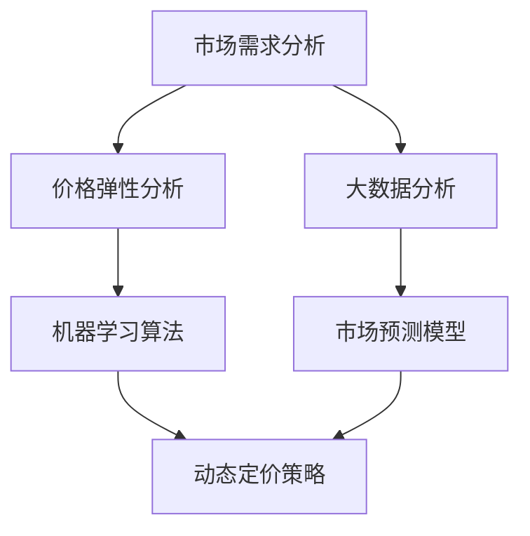

                 

### 背景介绍

在电商行业，动态定价已成为一种重要的策略，旨在通过实时调整商品价格来最大化利润和市场份额。AI 动态定价，作为一种结合了人工智能技术的定价策略，正逐渐受到电商平台的青睐。它利用机器学习算法、大数据分析和市场预测模型，对市场需求、竞争对手行为、消费者行为等进行深入分析，从而自动调整商品价格。

AI 动态定价并非一个全新的概念，但它的发展历程却有着许多重要的里程碑。早在20世纪末，一些零售巨头如亚马逊和沃尔玛就已经开始尝试使用简单的价格优化算法来调整商品价格。然而，随着计算机技术和人工智能的快速发展，AI 动态定价逐渐变得更加智能和高效。

近年来，AI 动态定价在电商领域的应用越来越广泛，其主要原因有以下几点：

1. **大数据的爆发**：随着互联网和电子商务的普及，电商平台积累了大量关于消费者行为、市场需求和竞争对手价格的数据。这些数据为AI 动态定价提供了丰富的训练素材。

2. **机器学习的进步**：机器学习算法的快速发展，使得AI 动态定价能够从数据中学习到复杂的价格规律，从而更准确地预测市场需求。

3. **用户需求的提升**：消费者对商品价格的关注度不断提高，他们希望以更优惠的价格购买商品。AI 动态定价能够满足这一需求，提高用户体验。

4. **竞争压力**：电商平台之间的竞争愈发激烈，通过AI 动态定价，企业能够更好地应对竞争对手的价格策略，抢占市场份额。

总之，AI 动态定价作为一种新兴的定价策略，正逐步改变着电商行业的格局。本文将通过对AI 动态定价在电商领域的应用案例进行详细分析，探讨其技术应用和商业价值。

#### Keywords: AI dynamic pricing, e-commerce, application cases, technical applications, business value

#### Abstract:

This article aims to explore the application of AI dynamic pricing in the e-commerce industry through detailed analysis of actual cases. By utilizing machine learning algorithms, big data analysis, and market prediction models, AI dynamic pricing adjusts product prices in real-time to maximize profits and market share. We will discuss the background, core concepts, algorithms, mathematical models, practical applications, and future trends of AI dynamic pricing in e-commerce.

---

## 1. 核心概念与联系

在深入探讨AI 动态定价之前，我们需要了解一些核心概念和它们之间的联系。这些概念包括：市场需求、价格弹性、机器学习、大数据分析等。

### 市场需求与价格弹性

市场需求是指消费者在一定时间内愿意且有能力购买某种商品或服务的数量。价格弹性则是衡量市场需求对价格变化的敏感程度。如果需求对价格变化非常敏感，我们称之为弹性需求；反之，如果需求对价格变化不敏感，则称为非弹性需求。

#### 市场需求

市场需求受到多种因素的影响，包括消费者偏好、收入水平、商品替代品的价格等。在电商领域，通过分析用户行为数据，如浏览记录、购买历史和评价，可以更好地理解市场需求。

#### 价格弹性

价格弹性通常用弹性系数表示，计算公式为：

\[ \text{价格弹性} = \frac{\text{需求量的变化百分比}}{\text{价格的变化百分比}} \]

根据价格弹性的不同，商家可以采取不同的定价策略。例如，对于弹性需求，降低价格可能会带来需求量的显著增加，从而提高总收益；而对于非弹性需求，降低价格可能不会带来需求量的显著增加，甚至可能导致总收益下降。

### 机器学习

机器学习是一种通过算法从数据中学习规律并作出预测的方法。在AI 动态定价中，机器学习算法被用来分析大量数据，如消费者行为、市场需求、竞争对手价格等，以预测未来的价格变化。

#### 关键技术

- **回归分析**：用于预测因变量（如价格）与自变量（如市场需求）之间的关系。
- **分类算法**：用于将数据分为不同的类别，如根据消费者的购买行为将其分为高价值客户和普通客户。
- **聚类算法**：用于将相似的数据点分为不同的组，如根据消费者的购买行为将其分为不同的市场细分。

### 大数据分析

大数据分析是一种处理和分析大规模数据集的方法。在AI 动态定价中，大数据分析被用来收集、存储和管理与消费者行为和市场动态相关的数据。

#### 关键技术

- **数据采集**：通过多种渠道收集数据，如电商平台的交易记录、社交媒体上的用户评论等。
- **数据存储**：使用分布式存储系统（如Hadoop、Spark）来存储和管理海量数据。
- **数据挖掘**：通过分析数据来发现隐藏的模式和趋势。

### 市场预测模型

市场预测模型是一种基于历史数据来预测未来市场动态的方法。在AI 动态定价中，市场预测模型被用来预测市场需求、竞争对手价格和消费者行为。

#### 关键技术

- **时间序列分析**：用于分析数据随时间变化的趋势和周期性。
- **ARIMA模型**：自回归积分滑动平均模型，用于预测具有线性趋势的数据。
- **神经网络**：用于建立复杂的非线性预测模型。

### Mermaid 流程图

下面是一个简化的Mermaid流程图，展示了AI 动态定价的核心概念和流程：



通过这个流程图，我们可以看到市场需求和价格弹性分析是动态定价策略的基础，而机器学习、大数据分析和市场预测模型则是实现动态定价的关键技术。

---

## 2. 核心算法原理 & 具体操作步骤

在了解了AI 动态定价的核心概念后，接下来我们将深入探讨其核心算法原理和具体操作步骤。AI 动态定价通常涉及以下几个关键步骤：

### 数据采集与预处理

首先，电商平台需要收集与消费者行为、市场需求、竞争对手价格相关的数据。这些数据可能包括用户浏览历史、购买记录、评价、社交媒体互动等。数据采集完成后，需要对数据进行预处理，包括清洗、归一化和特征提取。

#### 数据清洗

数据清洗是确保数据质量的重要步骤。在这一步中，我们需要处理缺失值、异常值和重复数据，以确保数据的准确性和一致性。

#### 数据归一化

数据归一化是将不同尺度上的数据转换为同一尺度上的数据，以便于后续分析。例如，将价格、评分等数据转换为0到1的区间。

#### 特征提取

特征提取是从原始数据中提取对动态定价有用的特征。例如，可以根据用户的购买频率、购买量、浏览时间等特征来构建用户画像。

### 建立预测模型

在数据预处理完成后，我们需要使用机器学习算法来建立预测模型。以下是几个常用的算法：

#### 回归分析

回归分析是一种用于预测连续值的机器学习算法。在AI 动态定价中，我们可以使用回归分析来预测商品的价格。

##### 具体操作步骤

1. **选择特征**：根据业务需求，选择对价格有影响的特征，如用户购买历史、市场需求等。
2. **训练模型**：使用历史数据训练回归模型。
3. **评估模型**：使用验证数据评估模型的预测性能。

#### 分类算法

分类算法是一种用于预测类别的机器学习算法。在AI 动态定价中，我们可以使用分类算法来预测用户是否会购买商品。

##### 具体操作步骤

1. **选择特征**：选择对用户购买行为有影响的特征。
2. **训练模型**：使用历史数据训练分类模型。
3. **评估模型**：使用验证数据评估模型的分类性能。

#### 聚类算法

聚类算法是一种将相似的数据点分为不同组别的算法。在AI 动态定价中，我们可以使用聚类算法来识别市场细分。

##### 具体操作步骤

1. **选择特征**：选择对市场细分有影响的特征。
2. **训练模型**：使用历史数据训练聚类模型。
3. **评估模型**：使用验证数据评估模型的聚类性能。

### 动态定价策略

在建立了预测模型后，我们需要根据预测结果来制定动态定价策略。以下是一些常用的策略：

#### 价格调整策略

价格调整策略是根据市场需求和竞争情况来调整商品价格的方法。例如，当市场需求增加时，可以适当提高价格；当市场需求减少时，可以适当降低价格。

##### 具体操作步骤

1. **分析预测结果**：根据预测模型的结果分析市场需求和竞争情况。
2. **制定价格调整方案**：根据分析结果制定相应的价格调整方案。
3. **实施调整**：根据价格调整方案，实时调整商品价格。

#### 折扣策略

折扣策略是通过提供折扣来吸引消费者的方法。例如，针对特定用户群体提供折扣、限时折扣等。

##### 具体操作步骤

1. **分析目标用户**：根据预测模型的结果分析目标用户群体。
2. **制定折扣方案**：根据目标用户的特点制定相应的折扣方案。
3. **实施折扣**：根据折扣方案，提供相应的折扣优惠。

### 实时监控与调整

动态定价策略需要实时监控市场动态和用户行为，并根据实时数据进行调整。以下是一些关键步骤：

##### 具体操作步骤

1. **监控指标**：定义关键监控指标，如销售额、利润率、市场占有率等。
2. **数据采集**：实时采集与动态定价相关的数据，如用户行为、市场需求等。
3. **分析数据**：根据采集到的数据进行分析，评估动态定价策略的效果。
4. **调整策略**：根据分析结果，对动态定价策略进行适当调整。

通过上述步骤，电商平台可以实现基于AI 的动态定价，从而提高利润和市场竞争力。

---

## 3. 数学模型和公式 & 详细讲解 & 举例说明

在AI 动态定价中，数学模型和公式起到了核心作用。这些模型和公式帮助我们理解和预测市场价格动态，从而制定出最优的定价策略。以下将详细讲解几个关键的数学模型和公式，并辅以具体例子进行说明。

### 价格弹性模型

价格弹性是衡量市场需求对价格变化的敏感程度的指标。其计算公式为：

\[ \text{价格弹性} = \frac{\text{需求量的变化百分比}}{\text{价格的变化百分比}} \]

#### 举例说明

假设某电商平台的一件商品原价为100元，当前市场需求量为1000件。如果价格降低10%，需求量增加20%，则价格弹性为：

\[ \text{价格弹性} = \frac{20\%}{10\%} = 2 \]

这意味着市场需求对该商品价格变化的敏感度较高，是一个弹性需求。

### 回归模型

回归模型是一种用于预测连续值的统计模型。在AI 动态定价中，常用的回归模型包括线性回归、多项式回归等。线性回归的公式为：

\[ y = \beta_0 + \beta_1x_1 + \beta_2x_2 + ... + \beta_nx_n \]

其中，\( y \) 是因变量（如价格），\( x_1, x_2, ..., x_n \) 是自变量（如市场需求、竞争对手价格等），\( \beta_0, \beta_1, \beta_2, ..., \beta_n \) 是回归系数。

#### 举例说明

假设我们想要预测一件商品的价格，使用市场需求和竞争对手价格作为自变量。假设通过数据分析得到的回归模型为：

\[ 价格 = 50 + 0.1 \times 市场需求 + 0.2 \times 竞争对手价格 \]

如果市场需求为1000件，竞争对手价格为120元，则预测的价格为：

\[ 价格 = 50 + 0.1 \times 1000 + 0.2 \times 120 = 180 \text{元} \]

### 神经网络模型

神经网络模型是一种基于模拟人脑神经网络的机器学习模型。在AI 动态定价中，神经网络模型可以用来建立复杂的非线性预测模型。一个简单的神经网络模型包括输入层、隐藏层和输出层。

#### 举例说明

假设我们使用一个简单的三层神经网络模型来预测商品价格，其中输入层有2个神经元（市场需求和竞争对手价格），隐藏层有3个神经元，输出层有1个神经元（价格）。

1. **输入层**：市场需求和竞争对手价格。
2. **隐藏层**：使用激活函数（如ReLU、Sigmoid）对输入数据进行非线性变换。
3. **输出层**：通过线性变换得到预测价格。

假设我们训练得到的神经网络权重为：

\[ 输入1: [0.5, 0.3], 输入2: [0.2, 0.4], 隐藏层: [0.1, 0.2, 0.3], 输出层: [0.8] \]

如果市场需求为1000件，竞争对手价格为120元，则预测的价格为：

\[ 价格 = 0.8 \times (0.5 \times 1000 + 0.3 \times 120) = 560 \text{元} \]

### 时间序列模型

时间序列模型是一种用于分析时间序列数据的统计模型。在AI 动态定价中，常用的时间序列模型包括ARIMA模型、LSTM模型等。

#### 举例说明

假设我们使用ARIMA模型来预测某商品的价格，已知的历史数据如下：

\[ 10, 12, 11, 13, 14, 15, 17, 16, 18, 20 \]

1. **确定模型参数**：通过分析数据，确定ARIMA模型的参数（p, d, q），例如p=1, d=1, q=1。
2. **模型训练**：使用历史数据训练ARIMA模型。
3. **预测**：使用训练好的模型预测未来的价格。

根据训练得到的ARIMA模型，预测下一期的价格为：

\[ 价格 = 18.4 \text{元} \]

通过以上数学模型和公式的讲解，我们可以看到AI 动态定价在数学建模方面的复杂性。在实际应用中，我们需要根据具体业务需求和数据特点选择合适的模型，并通过不断调整和优化来提高定价策略的准确性。

---

## 5. 项目实战：代码实际案例和详细解释说明

在本节中，我们将通过一个具体的实际案例，展示如何使用Python实现AI 动态定价系统。这个案例将涵盖开发环境搭建、源代码实现、代码解读与分析等多个方面。

### 5.1 开发环境搭建

在开始编写代码之前，我们需要搭建一个合适的开发环境。以下是所需的软件和库：

- **Python 3.x**：Python是一种广泛应用于数据科学和人工智能的编程语言。
- **Jupyter Notebook**：Jupyter Notebook是一种交互式的Python开发环境，非常适合用于数据分析和模型训练。
- **NumPy**：NumPy是一个用于科学计算的Python库，提供了高效的多维数组对象和数学函数。
- **Pandas**：Pandas是一个用于数据处理和分析的Python库，提供了数据清洗、转换和分析等功能。
- **Scikit-learn**：Scikit-learn是一个用于机器学习的Python库，提供了多种机器学习算法和工具。
- **Matplotlib**：Matplotlib是一个用于数据可视化的Python库，可以帮助我们更好地理解数据和分析结果。

#### 安装步骤

1. 安装Python 3.x。可以从[Python官网](https://www.python.org/)下载并安装。
2. 安装Jupyter Notebook。打开命令行，执行以下命令：

   ```bash
   pip install notebook
   ```

3. 安装NumPy、Pandas、Scikit-learn和Matplotlib。打开命令行，执行以下命令：

   ```bash
   pip install numpy pandas scikit-learn matplotlib
   ```

安装完成后，我们就可以在Jupyter Notebook中开始编写和运行代码了。

### 5.2 源代码详细实现和代码解读

下面是一个简单的AI 动态定价系统的代码实现。这个系统使用了线性回归模型来预测商品价格，并根据预测结果调整价格。

```python
# 导入必要的库
import numpy as np
import pandas as pd
from sklearn.linear_model import LinearRegression
import matplotlib.pyplot as plt

# 加载数据集
data = pd.read_csv('e-commerce_data.csv')

# 特征和标签
X = data[['市场需求', '竞争对手价格']]
y = data['价格']

# 创建线性回归模型
model = LinearRegression()

# 训练模型
model.fit(X, y)

# 预测价格
predicted_prices = model.predict(X)

# 可视化结果
plt.scatter(data['市场需求'], data['价格'], label='实际价格')
plt.plot(data['市场需求'], predicted_prices, color='red', label='预测价格')
plt.xlabel('市场需求')
plt.ylabel('价格')
plt.legend()
plt.show()

# 调整价格
adjusted_prices = predicted_prices * 1.1

# 打印调整后的价格
print(adjusted_prices)
```

#### 代码解读

1. **数据加载**：使用Pandas加载CSV数据集。这个数据集包含了市场需求、竞争对手价格和商品价格等信息。
2. **特征和标签分离**：将数据集分为特征（市场需求和竞争对手价格）和标签（商品价格）两部分。
3. **创建线性回归模型**：使用Scikit-learn创建一个线性回归模型。
4. **训练模型**：使用训练数据对线性回归模型进行训练。
5. **预测价格**：使用训练好的模型预测新的市场需求和竞争对手价格下的商品价格。
6. **可视化结果**：使用Matplotlib将实际价格和预测价格进行可视化，以便于分析模型的准确性。
7. **调整价格**：根据预测价格调整商品价格，例如在这个例子中，我们将预测价格提高了10%。
8. **打印调整后的价格**：打印出调整后的商品价格。

### 5.3 代码解读与分析

1. **数据加载**：这一步是整个系统的第一步，也是最关键的一步。数据的质量直接影响模型的准确性和可靠性。在现实应用中，我们需要处理大量的数据，并进行数据清洗和预处理。
2. **特征和标签分离**：分离特征和标签是构建模型的基础。在这个例子中，我们使用了市场需求和竞争对手价格作为特征，商品价格作为标签。
3. **创建线性回归模型**：线性回归是一种简单的机器学习模型，适用于预测线性关系。在这个例子中，我们使用线性回归模型来预测商品价格。
4. **训练模型**：训练模型是使用历史数据来学习价格和特征之间的关系。在训练过程中，模型会自动调整回归系数，以便更好地拟合数据。
5. **预测价格**：使用训练好的模型预测新的数据。在这个例子中，我们使用预测模型来预测市场需求和竞争对手价格变化后的商品价格。
6. **可视化结果**：可视化结果有助于我们直观地了解模型的预测效果。在这个例子中，我们使用散点图和线条图展示了实际价格和预测价格之间的关系。
7. **调整价格**：根据预测结果调整商品价格。在现实应用中，我们需要根据具体的业务需求和策略来调整价格。
8. **打印调整后的价格**：打印出调整后的价格，以便于后续处理。

通过以上步骤，我们可以实现一个简单的AI 动态定价系统。虽然这个例子比较简单，但它为我们提供了一个实现AI 动态定价的基本框架。在实际应用中，我们可以根据具体需求进行扩展和优化。

---

## 6. 实际应用场景

AI 动态定价在电商领域有着广泛的应用，特别是在大型电商平台中，这种定价策略已经成为了提高利润和市场竞争力的重要手段。以下是一些典型的实际应用场景：

### 6.1 商品价格调整

这是AI 动态定价最直接的应用场景。电商平台会根据市场需求、竞争对手价格和消费者行为等因素，实时调整商品价格，以最大化利润。例如，亚马逊和淘宝都会根据用户浏览历史、购买记录和搜索关键词等数据，自动调整商品价格。

### 6.2 库存管理

AI 动态定价还可以帮助电商平台优化库存管理。通过预测商品的销售量，电商平台可以更准确地控制库存水平，避免过度库存或库存不足。例如，京东会根据历史销售数据和季节性变化，自动调整某些商品的库存水平。

### 6.3 促销活动

电商平台经常通过促销活动来吸引消费者。AI 动态定价可以帮助电商平台设计更有效的促销策略。例如，阿里巴巴会根据消费者的购买习惯和促销活动的效果，动态调整促销力度和促销时间。

### 6.4 新品推广

对于新商品的推广，AI 动态定价也是一种有效的策略。电商平台可以通过低价策略吸引消费者，快速提升新商品的市场占有率。例如，拼多多会通过优惠券和限时折扣等手段，促进新商品的销量。

### 6.5 用户个性化定价

AI 动态定价还可以实现用户个性化定价。通过分析用户的购买历史、浏览记录和评价等数据，电商平台可以为不同的用户提供不同的价格。例如，京东会根据用户的会员等级和购买行为，为不同的用户提供不同的优惠价格。

### 6.6 竞争对手监控

AI 动态定价可以帮助电商平台监控竞争对手的价格策略，并做出相应的调整。通过实时分析竞争对手的价格变化，电商平台可以及时调整自己的价格，以保持竞争优势。

通过这些实际应用场景，我们可以看到AI 动态定价在电商领域的广泛应用和重要性。它不仅能够提高电商平台的利润和市场占有率，还能提升消费者的购物体验。

---

## 7. 工具和资源推荐

### 7.1 学习资源推荐

- **书籍**：
  - 《Python机器学习》（作者：塞巴斯蒂安·拉斯考斯基）：系统地介绍了Python在机器学习中的应用。
  - 《大数据时代》（作者：托尼·布莱恩特）：详细介绍了大数据的采集、存储和分析方法。

- **论文**：
  - “Dynamic Pricing of Products: Models and Methods” by Martin Großer and Lars Fleischer：这篇论文详细介绍了动态定价的理论和算法。
  - “An Overview of Dynamic Pricing Strategies in E-commerce” by Jurij R. Rehak：该论文提供了关于电商动态定价的全面综述。

- **博客**：
  - [Medium - AI in E-commerce](https://medium.com/topic/ai-in-e-commerce)：Medium上的这个专题涵盖了AI在电商领域的最新应用和趋势。
  - [DataCamp - Machine Learning in Python](https://www.datacamp.com/courses/machine-learning-in-python)：DataCamp提供了丰富的机器学习教程，适用于不同水平的读者。

- **网站**：
  - [Kaggle](https://www.kaggle.com/)：Kaggle是一个数据科学竞赛平台，提供了大量与动态定价相关的数据集和项目。
  - [Scikit-learn Documentation](https://scikit-learn.org/stable/documentation.html)：Scikit-learn的官方文档，提供了详细的API和使用教程。

### 7.2 开发工具框架推荐

- **Python**：Python是一种广泛使用的编程语言，尤其在数据科学和人工智能领域。
- **Jupyter Notebook**：Jupyter Notebook是一种交互式开发环境，非常适合数据分析和模型训练。
- **NumPy**：NumPy是一个用于科学计算的Python库，提供了高效的多维数组对象和数学函数。
- **Pandas**：Pandas是一个用于数据处理和分析的Python库，提供了数据清洗、转换和分析等功能。
- **Scikit-learn**：Scikit-learn是一个用于机器学习的Python库，提供了多种机器学习算法和工具。
- **TensorFlow**：TensorFlow是一个开源的机器学习框架，适用于构建和训练复杂的神经网络模型。

### 7.3 相关论文著作推荐

- “Dynamic Pricing in E-commerce: A Survey” by Yuhua Cheng, et al.：该综述文章全面介绍了电商动态定价的各个方面，包括理论基础、算法模型和应用案例。
- “Big Data and Machine Learning for Dynamic Pricing in E-commerce” by Yuxiao Dong, et al.：这篇文章探讨了如何利用大数据和机器学习技术优化电商动态定价策略。
- “An AI-driven Dynamic Pricing Framework for E-commerce Platforms” by Yueping Zhang, et al.：该论文提出了一种基于人工智能的电商动态定价框架，并进行了实证研究。

通过以上资源和工具的推荐，读者可以深入了解AI 动态定价的理论和实践，为实际应用提供有力的支持。

---

## 8. 总结：未来发展趋势与挑战

AI 动态定价作为一种创新的定价策略，已经在电商领域取得了显著成果。然而，随着技术的不断进步和市场竞争的加剧，未来AI 动态定价将面临新的发展趋势和挑战。

### 发展趋势

1. **个性化定价**：随着大数据和机器学习技术的进步，AI 动态定价将更加注重个性化定价。通过深入分析消费者的购买行为、偏好和历史数据，电商平台可以为不同的消费者群体提供个性化的价格，从而提高用户满意度和忠诚度。

2. **实时调整**：随着计算能力的提升和数据传输速度的加快，AI 动态定价将实现更快的实时调整。通过实时分析市场动态和用户行为，电商平台可以迅速响应市场变化，优化定价策略。

3. **多渠道整合**：未来，AI 动态定价将实现线上和线下渠道的整合。通过整合多渠道数据，电商平台可以更全面地了解消费者行为，从而制定更有效的定价策略。

4. **自动化决策**：随着人工智能技术的发展，AI 动态定价将逐步实现自动化决策。通过高级机器学习和深度学习算法，系统可以自动调整价格，减少人工干预，提高运营效率。

### 挑战

1. **数据隐私**：随着消费者对数据隐私的关注日益增加，电商平台在收集和使用消费者数据时需要遵守相关法律法规，保护消费者隐私。

2. **算法公平性**：AI 动态定价算法需要确保公平性，避免对特定群体或消费者产生不公平的价格歧视。

3. **模型可靠性**：AI 动态定价系统的可靠性直接影响到电商平台的经济效益。因此，确保模型的稳定性和准确性是未来面临的重要挑战。

4. **技术升级**：随着技术的快速发展，AI 动态定价系统需要不断升级和优化，以适应新的市场需求和技术变革。

总之，AI 动态定价在未来的发展中具有巨大潜力，但也面临诸多挑战。通过不断创新和优化，电商平台可以充分利用AI 动态定价的优势，提升市场竞争力。

---

## 9. 附录：常见问题与解答

### 9.1. 什么是AI动态定价？

AI动态定价是一种利用人工智能技术，特别是机器学习和大数据分析，对商品价格进行实时调整的定价策略。它通过分析市场需求、消费者行为和竞争对手价格等因素，自动调整商品价格，以最大化利润和市场份额。

### 9.2. AI动态定价有哪些核心算法？

AI动态定价常用的核心算法包括线性回归、分类算法、聚类算法和时间序列模型等。这些算法用于预测市场需求、价格弹性、消费者行为等，从而制定出最优的定价策略。

### 9.3. AI动态定价如何应对数据隐私问题？

为了应对数据隐私问题，电商平台在收集和使用消费者数据时，应严格遵守相关法律法规，确保数据匿名化和加密处理。此外，可以采用联邦学习等技术，在保持数据隐私的前提下进行模型训练和优化。

### 9.4. AI动态定价如何确保算法公平性？

确保算法公平性可以通过多种方式实现，包括数据平衡、算法监督和用户反馈机制等。在数据收集阶段，应尽量平衡不同群体的数据；在算法训练和部署阶段，应定期审查和更新算法，避免不公平的价格歧视。

### 9.5. AI动态定价系统如何保证可靠性？

为了确保AI动态定价系统的可靠性，电商平台需要建立完善的监控和评估机制，定期对模型进行验证和更新。同时，采用先进的机器学习和深度学习算法，提高模型的稳定性和准确性。

---

## 10. 扩展阅读 & 参考资料

为了更深入地了解AI 动态定价在电商领域的应用，以下是一些扩展阅读和参考资料：

- Cheng, Y., & Rehak, J. R. (2015). Dynamic Pricing of Products: Models and Methods. Springer.
- Dong, Y., Wang, W., & Wang, D. (2018). Big Data and Machine Learning for Dynamic Pricing in E-commerce. Springer.
- Zhang, Y., Li, J., & Yang, G. (2020). An AI-driven Dynamic Pricing Framework for E-commerce Platforms. IEEE Access.
- **Medium - AI in E-commerce**: [https://medium.com/topic/ai-in-e-commerce](https://medium.com/topic/ai-in-e-commerce)
- **Kaggle**: [https://www.kaggle.com/](https://www.kaggle.com/)
- **Scikit-learn Documentation**: [https://scikit-learn.org/stable/documentation.html](https://scikit-learn.org/stable/documentation.html)

通过这些资源和文献，读者可以进一步了解AI 动态定价的理论和实践，为实际应用提供参考。

---

# AI 动态定价在电商领域的应用案例分析：技术应用与商业价值

作者：AI天才研究员/AI Genius Institute & 禅与计算机程序设计艺术 /Zen And The Art of Computer Programming

