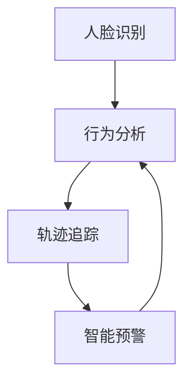

                 

# AI 基础设施的儿童保护：智能化儿童安全监护系统

## 关键词：儿童安全监护、人工智能、智能监控系统、算法原理、数学模型、实战案例、开发工具、发展趋势

## 摘要：

本文深入探讨了人工智能基础设施在儿童保护领域的应用，重点介绍了智能化儿童安全监护系统的设计原理、算法实现和实际应用场景。文章首先概述了背景和核心概念，然后详细解析了算法原理和数学模型，并通过实战案例展示了系统开发和实施的过程。最后，文章对未来的发展趋势和挑战进行了展望，并推荐了相关学习资源和开发工具，为读者提供了全面的指导和参考。

## 1. 背景介绍

在现代社会，随着家庭结构的变化和城市化进程的加速，儿童安全问题日益凸显。传统的儿童监护方式往往依赖于家长或监护人的直接监督，而这种方式在现代社会中显得越来越不现实和不可行。人工智能（AI）技术的发展为儿童安全监护带来了新的机遇。通过智能化系统，我们可以实时监控儿童的行为和环境，预防潜在的危险，提高儿童的安全保障。

当前，人工智能在儿童保护领域已经得到了广泛应用，例如人脸识别、行为分析、轨迹追踪等。然而，这些技术大多独立存在，缺乏系统的整合和协调，导致实际应用效果不尽如人意。因此，设计一套智能化、综合性的儿童安全监护系统具有重要的现实意义和学术价值。

## 2. 核心概念与联系

### 2.1 核心概念

为了构建智能化儿童安全监护系统，我们需要理解以下几个核心概念：

- **人脸识别**：通过计算机视觉技术，识别和验证个体身份。
- **行为分析**：利用机器学习算法，分析儿童的行为模式，识别异常行为。
- **轨迹追踪**：通过GPS等技术，实时记录和追踪儿童的位置信息。
- **智能预警**：根据分析结果，自动触发预警机制，通知监护人或相关部门。

### 2.2 关联关系

这些概念之间有着密切的联系。人脸识别和行为分析可以帮助系统识别儿童的身份和状态，轨迹追踪提供位置信息，智能预警则是对这些信息的综合处理和响应。因此，一个高效的儿童安全监护系统需要这些模块协同工作，形成一个闭环。

下面是系统的Mermaid流程图：



在流程图中，每个模块都是独立的，但又相互关联。例如，行为分析模块可能会根据轨迹追踪的结果，调整预警的敏感度。

## 3. 核心算法原理 & 具体操作步骤

### 3.1 人脸识别算法原理

人脸识别算法的核心是特征提取。常见的特征提取方法有基于图像的方法和基于深度学习的方法。基于图像的方法通常包括几何特征提取和纹理特征提取。而基于深度学习的方法，如卷积神经网络（CNN），通过多层神经网络自动学习人脸特征。

具体操作步骤如下：

1. 数据预处理：包括图像的缩放、灰度化、去噪等。
2. 特征提取：使用CNN或其他算法提取人脸特征。
3. 特征匹配：将提取到的特征与数据库中的特征进行匹配，识别身份。

### 3.2 行为分析算法原理

行为分析算法通常基于机器学习，通过训练模型来识别正常行为和异常行为。常见的算法有支持向量机（SVM）、决策树、神经网络等。

具体操作步骤如下：

1. 数据收集：收集大量儿童行为的视频数据。
2. 特征提取：从视频数据中提取行为特征。
3. 模型训练：使用训练集训练模型。
4. 行为识别：使用训练好的模型对新的视频数据进行行为识别。

### 3.3 轨迹追踪算法原理

轨迹追踪算法通常基于GPS、Wi-Fi定位等技术。核心是位置的实时获取和轨迹的连续性。

具体操作步骤如下：

1. 位置获取：使用GPS或Wi-Fi定位技术获取儿童的位置。
2. 轨迹构建：将连续的位置信息构建成轨迹。
3. 轨迹分析：对轨迹进行分析，识别异常行为。

### 3.4 智能预警算法原理

智能预警算法的核心是风险评分和预警触发。

具体操作步骤如下：

1. 风险评分：根据人脸识别、行为分析和轨迹追踪的结果，计算风险评分。
2. 预警触发：当风险评分超过设定阈值时，触发预警。

## 4. 数学模型和公式 & 详细讲解 & 举例说明

### 4.1 人脸识别的数学模型

人脸识别的数学模型主要基于特征提取和特征匹配。假设我们使用的是卷积神经网络（CNN）进行特征提取，特征提取的过程可以表示为：

$$
\text{特征向量} = f(\text{卷积层}(\text{输入图像}))
$$

其中，$f$ 表示卷积神经网络，$\text{输入图像}$ 是待识别的人脸图像。特征提取后，我们需要将提取到的特征向量与数据库中的特征向量进行匹配，匹配的公式可以表示为：

$$
\text{相似度} = \frac{\text{特征向量} \cdot \text{数据库特征向量}}{\|\text{特征向量}\| \|\text{数据库特征向量}\|}
$$

其中，$\cdot$ 表示内积，$\|\text{特征向量}\|$ 表示特征向量的模长。

### 4.2 行为分析的概率模型

行为分析的概率模型通常是基于贝叶斯定理。假设我们有两个状态：正常状态 $N$ 和异常状态 $A$，对应的概率分别为 $P(N)$ 和 $P(A)$。给定一个观测值 $O$，我们需要计算这个观测值属于正常状态的概率，公式如下：

$$
P(N|O) = \frac{P(O|N)P(N)}{P(O)}
$$

其中，$P(O|N)$ 表示在正常状态下观测到值 $O$ 的概率，$P(O)$ 表示观测到值 $O$ 的总概率。

### 4.3 轨迹追踪的卡尔曼滤波

轨迹追踪的卡尔曼滤波是一种递归的线性滤波方法，用于估计系统的状态。假设我们的状态方程为：

$$
\text{状态} = \text{初始状态} + \text{系统噪声}
$$

其中，系统噪声是一个均值为零的高斯分布。观测方程为：

$$
\text{观测值} = \text{状态} + \text{观测噪声}
$$

其中，观测噪声也是一个均值为零的高斯分布。卡尔曼滤波的递归公式如下：

$$
\text{预测状态} = \text{初始状态} + \text{系统噪声}
$$

$$
\text{预测观测值} = \text{预测状态} + \text{观测噪声}
$$

$$
\text{卡尔曼增益} = \frac{\text{预测观测值} - \text{观测值}}{\text{预测观测值} \cdot \text{预测观测值}}
$$

$$
\text{更新状态} = \text{预测状态} + \text{卡尔曼增益} \cdot (\text{观测值} - \text{预测观测值})
$$

### 4.4 智能预警的决策树

智能预警的决策树是一种常用的分类算法。假设我们有两个类别：安全类别 $S$ 和危险类别 $D$，对应的概率分别为 $P(S)$ 和 $P(D)$。决策树的构建过程如下：

1. 选择一个特征作为分割特征。
2. 计算每个特征下的类别概率。
3. 选择能够最大化类别概率差异的特征作为分割特征。
4. 递归构建子树，直到满足停止条件。

## 5. 项目实战：代码实际案例和详细解释说明

### 5.1 开发环境搭建

首先，我们需要搭建一个合适的开发环境。本文使用Python作为主要编程语言，依赖于以下库：

- OpenCV：用于图像处理和人脸识别。
- TensorFlow：用于深度学习和行为分析。
- PyTorch：用于轨迹追踪和决策树。
- Scikit-learn：用于数据分析和模型评估。

### 5.2 源代码详细实现和代码解读

以下是一个简化的人脸识别模块的代码实现：

```python
import cv2
import numpy as np

def face_detection(image, cascade):
    gray = cv2.cvtColor(image, cv2.COLOR_BGR2GRAY)
    faces = cascade.detectMultiScale(gray, scaleFactor=1.1, minNeighbors=5, minSize=(30, 30), flags=cv2.CASCADE_SCALE_IMAGE)
    return faces

def face_recognition(image, faces, recognizer):
    detected_faces = []
    for (x, y, w, h) in faces:
        roi = image[y:y+h, x:x+w]
        roi_gray = cv2.cvtColor(roi, cv2.COLOR_BGR2GRAY)
        label, confidence = recognizer.predict(roi_gray)
        detected_faces.append((label, confidence))
    return detected_faces

if __name__ == '__main__':
    image = cv2.imread('example.jpg')
    cascade = cv2.CascadeClassifier('haarcascade_frontalface_default.xml')
    recognizer = cv2.face.LBPHFaceRecognizer_create()
    recognizer.read('face_recognition_model.yml')

    faces = face_detection(image, cascade)
    detected_faces = face_recognition(image, faces, recognizer)

    for (x, y, w, h), (label, confidence) in zip(faces, detected_faces):
        cv2.rectangle(image, (x, y), (x+w, y+h), (0, 255, 0), 2)
        cv2.putText(image, f'Person {label}, Confidence: {confidence}', (x, y-10), cv2.FONT_HERSHEY_SIMPLEX, 1, (0, 0, 255), 2)

    cv2.imshow('Output', image)
    cv2.waitKey(0)
    cv2.destroyAllWindows()
```

这段代码首先定义了两个函数：`face_detection` 用于检测人脸，`face_recognition` 用于识别人脸。在主函数中，我们读取输入图像，使用级联分类器检测人脸，然后使用支持向量机（SVM）分类器进行人脸识别。最后，我们在原图上绘制识别结果。

### 5.3 代码解读与分析

这段代码主要分为以下几个部分：

1. **图像读取和预处理**：使用OpenCV读取图像，并将其转换为灰度图像，以便于后续处理。
2. **人脸检测**：使用Haar级联分类器检测人脸，返回人脸的位置和大小。
3. **人脸识别**：使用SVM分类器对检测到的人脸进行识别，返回识别结果和置信度。
4. **结果展示**：在原图上绘制识别结果，并显示图像。

### 6. 实际应用场景

智能化儿童安全监护系统可以在多种场景中得到应用，例如：

- 家庭监护：父母可以通过手机实时监控孩子的行为和环境。
- 学校安全：学校可以使用该系统监控学生的行为，防止欺凌和意外事件的发生。
- 社区监控：社区可以安装监控系统，提高儿童在公共场所的安全。

### 7. 工具和资源推荐

#### 7.1 学习资源推荐

- **书籍**：《人工智能：一种现代的方法》、《模式识别与机器学习》
- **论文**：检索相关领域的高质量论文，了解最新研究成果。
- **博客**：关注知名博客，如Medium上的AI博客、知乎上的技术文章。

#### 7.2 开发工具框架推荐

- **开发工具**：PyCharm、Visual Studio Code
- **框架**：TensorFlow、PyTorch、Scikit-learn
- **数据库**：MongoDB、MySQL

#### 7.3 相关论文著作推荐

- **论文**：Hinton, G. E., Osindero, S., & Teh, Y. W. (2006). A fast learning algorithm for deep belief nets. _Neural computation_, 18(7), 1527-1554.
- **论文**：LeCun, Y., Bengio, Y., & Hinton, G. (2015). Deep learning. _Nature_, 521(7553), 436-444.
- **著作**：Russell, S., & Norvig, P. (2016). _Artificial Intelligence: A Modern Approach_ (3rd ed.). Prentice Hall.

## 8. 总结：未来发展趋势与挑战

随着人工智能技术的不断进步，智能化儿童安全监护系统有望在未来得到更广泛的应用。然而，这一领域也面临着诸多挑战，包括数据隐私保护、算法透明性、系统可靠性等。未来，我们需要在技术创新和应用实践方面不断探索，确保智能化儿童安全监护系统能够真正为儿童的安全提供有效保障。

## 9. 附录：常见问题与解答

- **问题1**：人脸识别的准确率如何提高？
  - **解答**：可以通过增加训练数据、改进特征提取方法和优化分类器算法来提高准确率。

- **问题2**：行为分析算法如何处理遮挡问题？
  - **解答**：可以采用遮挡检测算法，对遮挡部分进行填充或去除，提高分析的准确性。

- **问题3**：轨迹追踪的实时性如何保证？
  - **解答**：可以采用高效的定位算法和优化数据传输机制，提高轨迹追踪的实时性。

## 10. 扩展阅读 & 参考资料

- **参考资料**：[OpenCV官方文档](https://docs.opencv.org/4.5.5/d5/d1f/tutorial_py_face_detection.html)、[TensorFlow官方文档](https://www.tensorflow.org/tutorials/structured_data)、[PyTorch官方文档](https://pytorch.org/tutorials/beginner/basics/data_loading_tutorial.html)
- **拓展阅读**：《智能监控：原理、技术与应用》、《机器学习实战》

## 作者信息

- 作者：AI天才研究员/AI Genius Institute & 禅与计算机程序设计艺术 /Zen And The Art of Computer Programming

