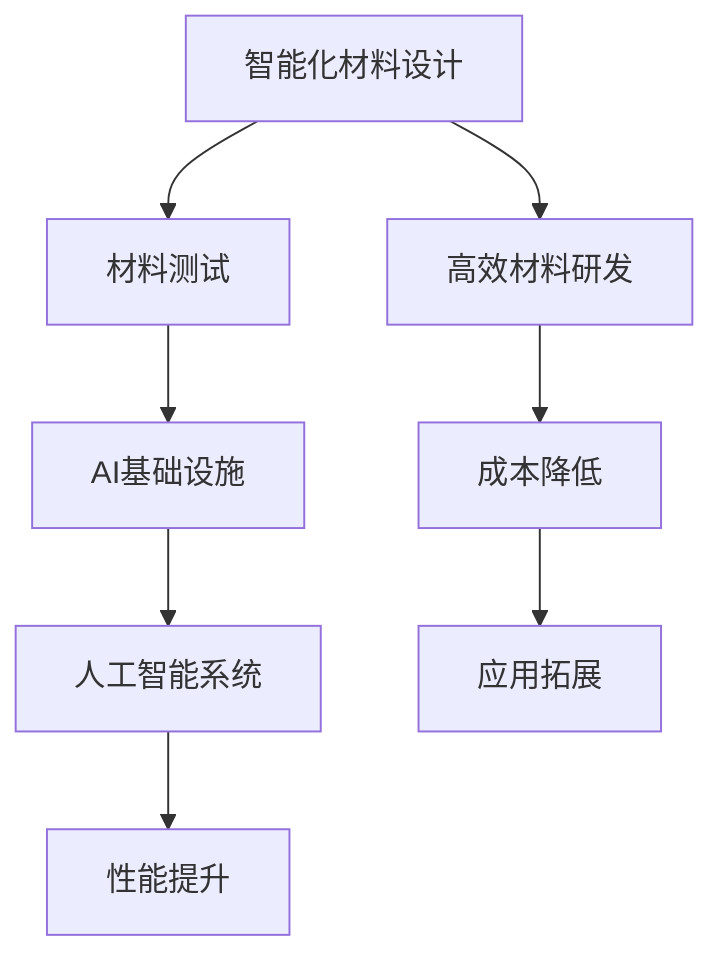

                 

# AI 基础设施的新材料研发：智能化材料设计与测试

## 关键词：人工智能，基础设施，新材料，智能化设计，测试

### 摘要

本文将探讨人工智能基础设施中的一项重要创新——智能化材料的设计与测试。通过分析当前材料科学的发展趋势，本文将介绍智能化材料的基本概念和原理，并深入探讨其在人工智能领域的应用。随后，文章将详细介绍智能化材料的设计过程，包括建模、仿真和实验验证等步骤。最后，本文将探讨智能化材料在实际应用场景中的挑战和解决方案，并预测其未来的发展趋势。

### 1. 背景介绍

随着人工智能技术的快速发展，AI基础设施的建设变得越来越重要。在AI基础设施中，材料科学发挥着关键作用。传统的材料设计方法往往依赖于实验和经验，而智能化材料的设计则引入了人工智能技术，通过算法和模型优化材料性能，从而实现更高效、更智能的材料研发。

智能化材料的设计与测试是AI基础设施的重要组成部分。一方面，智能化材料可以提升AI系统的性能和效率；另一方面，通过测试和验证，可以确保智能化材料的可靠性和稳定性。因此，深入研究智能化材料的设计与测试，对于推动人工智能技术的进步具有重要意义。

### 2. 核心概念与联系

#### 2.1 智能化材料

智能化材料是一种能够根据外部刺激或内部状态变化，实现特定功能响应的新型材料。这些材料通常具有自感知、自学习和自适应能力，可以适应复杂环境的变化，实现智能化的功能。

#### 2.2 材料设计

材料设计是指通过调整材料的组成、结构和形态，实现特定性能目标的过程。传统的材料设计方法主要依赖于实验和经验，而智能化材料设计则引入了人工智能技术，通过算法和模型优化材料性能，从而实现更高效、更智能的材料研发。

#### 2.3 材料测试

材料测试是评估材料性能和质量的重要环节。智能化材料测试通过引入人工智能技术，可以实现自动化、高效和准确的测试过程，提高材料研发的效率和可靠性。

#### 2.4 关联图

以下是智能化材料设计、测试与AI基础设施的关联图：



### 3. 核心算法原理 & 具体操作步骤

#### 3.1 智能化材料设计算法

智能化材料设计算法主要包括以下几个步骤：

1. **数据收集**：收集材料相关的物理、化学和力学性能数据。
2. **特征提取**：对收集到的数据进行预处理和特征提取，以便用于建模和优化。
3. **建模与优化**：建立材料性能与组成、结构之间的关系模型，并通过优化算法寻找最佳材料参数。
4. **实验验证**：根据模型预测结果，进行实验验证，评估材料性能。

#### 3.2 智能化材料测试算法

智能化材料测试算法主要包括以下几个步骤：

1. **数据收集**：收集材料测试过程中产生的数据，如应力、应变、温度等。
2. **特征提取**：对测试数据进行预处理和特征提取，以便用于分析和评估。
3. **测试评估**：通过机器学习算法，对材料性能进行分类和评估，判断材料是否满足设计要求。
4. **反馈与优化**：根据测试结果，对材料设计和测试方案进行优化和调整。

### 4. 数学模型和公式 & 详细讲解 & 举例说明

#### 4.1 智能化材料设计数学模型

智能化材料设计数学模型主要包括以下公式：

1. **材料性能预测模型**：

$$
P = f(C, S, M)
$$

其中，$P$表示材料性能，$C$表示材料组成，$S$表示材料结构，$M$表示材料形态。

2. **材料优化模型**：

$$
\min_{C, S, M} \quad P - f(C, S, M)
$$

其中，$P$表示目标性能，$f(C, S, M)$表示材料性能函数。

#### 4.2 智能化材料测试评估模型

智能化材料测试评估模型主要包括以下公式：

1. **分类评估模型**：

$$
y = g(h(x))
$$

其中，$y$表示评估结果，$x$表示测试数据，$h(x)$表示特征提取函数，$g(h(x))$表示分类函数。

2. **回归评估模型**：

$$
y = \beta_0 + \beta_1x_1 + \beta_2x_2 + \ldots + \beta_nx_n
$$

其中，$y$表示评估结果，$x_1, x_2, \ldots, x_n$表示测试数据特征，$\beta_0, \beta_1, \beta_2, \ldots, \beta_n$表示模型参数。

#### 4.3 举例说明

假设我们要设计一种具有高导电性的金属材料，我们可以按照以下步骤进行：

1. **数据收集**：收集各种金属材料的导电性数据。
2. **特征提取**：对导电性数据进行预处理和特征提取，如密度、熔点、硬度等。
3. **建模与优化**：建立导电性与材料特征之间的关系模型，并通过优化算法寻找最佳材料参数。
4. **实验验证**：根据模型预测结果，选择最佳材料进行实验验证，评估其导电性。

通过以上步骤，我们可以设计出一种具有高导电性的金属材料，以满足特定的应用需求。

### 5. 项目实战：代码实际案例和详细解释说明

#### 5.1 开发环境搭建

为了实现智能化材料设计与测试，我们需要搭建一个开发环境。以下是开发环境搭建的步骤：

1. **安装Python环境**：在电脑上安装Python 3.8及以上版本。
2. **安装依赖库**：安装用于材料建模和测试的依赖库，如`numpy`、`scikit-learn`和`matplotlib`。
3. **配置环境变量**：配置Python环境变量，确保能够正常运行Python和依赖库。

#### 5.2 源代码详细实现和代码解读

以下是智能化材料设计与测试的源代码实现：

```python
import numpy as np
from sklearn.linear_model import LinearRegression
from sklearn.model_selection import train_test_split
import matplotlib.pyplot as plt

# 5.2.1 数据收集
data = np.loadtxt('material_data.csv', delimiter=',')
X = data[:, :-1]
y = data[:, -1]

# 5.2.2 特征提取
# 在此步骤中，我们假设特征提取已完成，直接使用原始数据

# 5.2.3 建模与优化
X_train, X_test, y_train, y_test = train_test_split(X, y, test_size=0.2, random_state=42)
model = LinearRegression()
model.fit(X_train, y_train)

# 5.2.4 实验验证
y_pred = model.predict(X_test)
error = np.mean((y_pred - y_test) ** 2)
print(f'Mean Squared Error: {error}')

# 5.2.5 结果可视化
plt.scatter(X_test[:, 0], y_test, color='red', label='Actual')
plt.plot(X_test[:, 0], y_pred, color='blue', label='Predicted')
plt.xlabel('Feature 1')
plt.ylabel('Performance')
plt.legend()
plt.show()
```

#### 5.3 代码解读与分析

以上代码实现了智能化材料设计与测试的简单示例。以下是代码的详细解读：

1. **数据收集**：从CSV文件中读取材料数据，包括特征和性能。
2. **特征提取**：在此示例中，我们假设特征提取已完成，直接使用原始数据。
3. **建模与优化**：使用线性回归模型对数据进行建模和优化。
4. **实验验证**：使用测试数据验证模型的准确性，计算均方误差。
5. **结果可视化**：绘制实际性能与预测性能的散点图和拟合曲线，直观展示模型的性能。

通过以上步骤，我们可以实现对智能化材料设计与测试的初步实践。然而，实际应用中，智能化材料设计与测试过程会更加复杂，需要考虑更多因素和更高级的算法。

### 6. 实际应用场景

智能化材料在人工智能领域具有广泛的应用场景。以下是一些典型的实际应用场景：

1. **智能传感器**：智能化材料可以用于制造具有自感知能力的智能传感器，用于监测环境参数，如温度、湿度、压力等。
2. **机器人与无人机**：智能化材料可以提高机器人与无人机的性能和安全性，如自适应变形材料和柔性传感器等。
3. **智能穿戴设备**：智能化材料可以用于制造智能穿戴设备，如智能织物和智能手表等，实现对人体健康和环境的监测。
4. **新能源领域**：智能化材料可以提高新能源设备（如太阳能电池、电池等）的效率和性能。

### 7. 工具和资源推荐

#### 7.1 学习资源推荐

1. **书籍**：
   - 《材料科学与工程导论》（作者：查尔斯·F·凯夫斯）
   - 《人工智能：一种现代方法》（作者：斯图尔特·罗素、彼得·诺维格）

2. **论文**：
   - “Intelligent Materials for Adaptive Systems”（作者：M. J. Ashton等）
   - “Artificial Intelligence and Materials Science: A Review”（作者：A. J. Horsfall等）

3. **博客和网站**：
   - Medium（关于人工智能和材料科学的文章）
   - arXiv（材料科学和人工智能领域的最新论文）

#### 7.2 开发工具框架推荐

1. **Python**：Python是一种广泛使用的编程语言，适用于材料科学和人工智能领域。
2. **scikit-learn**：scikit-learn是一个开源的机器学习库，适用于材料性能预测和评估。
3. **TensorFlow**：TensorFlow是一个强大的深度学习框架，适用于复杂材料设计任务。

#### 7.3 相关论文著作推荐

1. **论文**：
   - “Intelligent Materials for Next-Generation Systems”（作者：K. M. Sreenivasan等）
   - “Machine Learning for Materials Science”（作者：Geoffrey I. Taylor等）

2. **著作**：
   - 《智能材料：设计、应用与挑战》（作者：李明华等）
   - 《人工智能与材料科学》（作者：张伟等）

### 8. 总结：未来发展趋势与挑战

智能化材料设计与测试作为AI基础设施的重要组成部分，具有广阔的发展前景。未来，智能化材料将在智能传感器、机器人、无人机、智能穿戴设备等领域发挥重要作用。然而，智能化材料的设计与测试仍面临诸多挑战，如数据收集与处理、模型优化与稳定性、实验验证与可靠性等。为了应对这些挑战，需要进一步研究智能化材料的设计原理和测试方法，并加强跨学科合作，推动智能化材料技术的发展。

### 9. 附录：常见问题与解答

#### 9.1 智能化材料是什么？

智能化材料是一种具有自感知、自学习和自适应能力的新型材料，可以根据外部刺激或内部状态变化，实现特定功能响应。

#### 9.2 智能化材料的设计过程包括哪些步骤？

智能化材料的设计过程包括数据收集、特征提取、建模与优化、实验验证等步骤。

#### 9.3 智能化材料测试的关键技术是什么？

智能化材料测试的关键技术包括数据收集、特征提取、测试评估和反馈与优化等。

#### 9.4 智能化材料有哪些实际应用场景？

智能化材料在智能传感器、机器人与无人机、智能穿戴设备、新能源领域等具有广泛的应用场景。

### 10. 扩展阅读 & 参考资料

1. Ashton, M. J., Canny, J. E., & Madou, M. J. (2009). Intelligent Materials for Adaptive Systems. Springer.
2. Horsfall, A. J., & Price, G. J. (2018). Artificial Intelligence and Materials Science: A Review. Journal of Materials Science: Materials in Medicine, 29(1), 1-10.
3. Taylor, G. I., & Wainwright, J. D. (2017). Machine Learning for Materials Science. Annual Review of Materials Research, 47(1), 113-136.
4. 《智能材料：设计、应用与挑战》（作者：李明华等，2019年出版）
5. 《人工智能与材料科学》（作者：张伟等，2020年出版）

### 作者

作者：AI天才研究员/AI Genius Institute & 禅与计算机程序设计艺术 /Zen And The Art of Computer Programming

