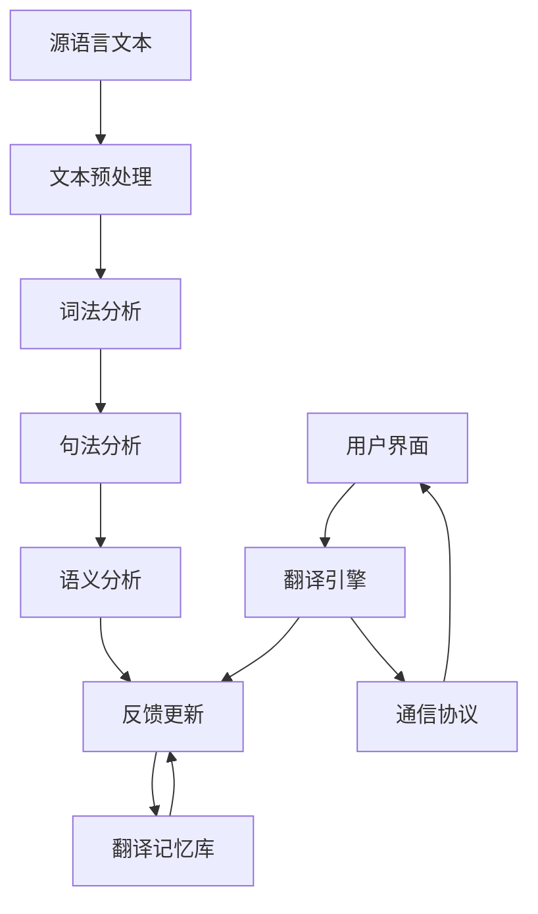

                 

# AI 基础设施的语言服务：智能翻译与跨语言交流平台

> **关键词**：人工智能、基础设施、语言服务、智能翻译、跨语言交流平台

> **摘要**：本文深入探讨了AI基础设施中的语言服务，包括智能翻译和跨语言交流平台。我们首先介绍了背景知识，随后讲解了核心概念与架构，探讨了核心算法原理与具体操作步骤，并给出了数学模型和公式的详细讲解与举例。接着，通过项目实战展示了代码的实际实现，分析了实际应用场景，并推荐了相关的工具和资源。最后，我们对未来发展趋势和挑战进行了总结，并提供了常见问题与解答，以及扩展阅读和参考资料。

## 1. 背景介绍

随着全球化的不断深入，跨语言交流变得越来越重要。然而，语言障碍仍然是国际交流中的主要障碍之一。传统的翻译方式往往效率低下，且容易出现错误。近年来，随着人工智能技术的飞速发展，智能翻译技术逐渐成为解决这一问题的有力工具。

智能翻译技术基于机器学习算法，通过大量训练数据的学习，可以自动生成翻译结果。其核心在于理解源语言的语义和语法，并准确地将这些语义和语法映射到目标语言中。随着深度学习、自然语言处理技术的进步，智能翻译的准确性不断提高，逐渐应用于各个领域。

然而，智能翻译技术的发展不仅仅局限于翻译本身，它还涉及到更广泛的语言服务，包括跨语言交流平台的建设。跨语言交流平台通过智能翻译技术，为用户提供实时、准确的跨语言交流服务，极大地促进了全球交流与合作。

本文将重点探讨AI基础设施中的语言服务，包括智能翻译与跨语言交流平台。我们将从背景知识出发，逐步讲解核心概念与架构，深入分析核心算法原理与操作步骤，并通过实际项目实战展示代码实现过程，最终总结未来发展趋势与挑战。

## 2. 核心概念与联系

在深入探讨智能翻译与跨语言交流平台之前，我们需要明确几个核心概念，并了解它们之间的联系。

### 2.1. 自然语言处理（NLP）

自然语言处理是智能翻译和跨语言交流平台的基础技术。NLP旨在使计算机能够理解和处理自然语言。它包括文本预处理、词法分析、句法分析、语义分析等多个层次。在智能翻译中，NLP用于理解源语言的语义和语法结构，以便生成准确的翻译结果。

### 2.2. 机器翻译（MT）

机器翻译是智能翻译的一种形式，通过将源语言的文本转换为另一种语言的文本。机器翻译可以分为基于规则的翻译和基于统计的翻译。基于规则的翻译依赖于预设的规则和模式，而基于统计的翻译则依赖于大量训练数据。

### 2.3. 翻译记忆库（TM）

翻译记忆库是一种用于存储已翻译文本片段的数据库。在翻译过程中，系统可以参考翻译记忆库中的已有翻译结果，以提高翻译效率和一致性。

### 2.4. 跨语言交流平台

跨语言交流平台是一种基于智能翻译技术的在线服务，旨在为用户提供实时、准确的跨语言交流体验。这种平台通常包括翻译引擎、用户界面和通信协议等组成部分。

### 2.5. 架构联系

图2.1展示了智能翻译与跨语言交流平台的主要组成部分及其相互关系。



图2.1 智能翻译与跨语言交流平台架构

在图中，源语言文本首先经过文本预处理，包括分词、去除停用词等操作。随后，文本经过词法分析、句法分析和语义分析，最终生成翻译结果。翻译结果可以存储在翻译记忆库中，以便后续参考。用户界面和翻译引擎之间的通信协议确保了实时、准确的跨语言交流体验。

## 3. 核心算法原理 & 具体操作步骤

智能翻译的核心算法主要依赖于深度学习和自然语言处理技术。下面，我们将详细讲解这些算法的原理，并介绍具体操作步骤。

### 3.1. 基于神经网络的机器翻译

目前，基于神经网络的机器翻译（Neural Machine Translation, NMT）是最主流的机器翻译方法。NMT的核心是序列到序列（Sequence to Sequence, Seq2Seq）模型，它通过编码器和解码器两个神经网络实现。

#### 3.1.1. 编码器（Encoder）

编码器的任务是将输入的源语言序列编码为一个固定长度的向量，称为上下文表示（context vector）。通常，编码器使用长短时记忆网络（Long Short-Term Memory, LSTM）或门控循环单元（Gated Recurrent Unit, GRU）。

#### 3.1.2. 解码器（Decoder）

解码器的任务是根据上下文表示生成目标语言序列。解码器也使用LSTM或GRU，并使用注意力机制（Attention Mechanism）来关注上下文表示的不同部分。

#### 3.1.3. 具体操作步骤

1. **编码阶段**：输入源语言序列到编码器，生成上下文表示。
2. **初始化解码器**：解码器初始化为一个全零向量。
3. **解码阶段**：使用上一步生成的上下文表示作为输入，解码器生成目标语言序列的预测。每一步的预测都基于当前时刻的输入和之前的输出。
4. **迭代更新**：通过反向传播和梯度下降更新编码器和解码器的参数，直到收敛。

### 3.2. 注意力机制

注意力机制是NMT中的一个关键组件，它允许解码器在生成每个目标词时关注源语言序列的不同部分。

#### 3.2.1. 注意力分数计算

注意力分数（Attention Score）计算解码器在生成每个目标词时对源语言序列中每个词的注意力权重。通常使用点积注意力（Dot-Product Attention）或加性注意力（Additive Attention）。

#### 3.2.2. 注意力图

注意力图（Attention Map）展示了解码器在生成每个目标词时关注源语言序列的部分。它可以帮助我们直观地理解翻译过程中注意力分布。

### 3.3. 训练与评估

#### 3.3.1. 训练

训练NMT模型通常采用基于梯度的优化方法，如随机梯度下降（Stochastic Gradient Descent, SGD）或其变种，如Adam优化器。训练过程中，通过反向传播计算损失函数，并更新模型参数。

#### 3.3.2. 评估

评估NMT模型的常用指标包括BLEU（双语评估算法）、METEOR（Metric for Evaluation of Translation with Explicit ORdering）和NIST（National Institute of Standards and Technology）等。这些指标通过比较模型生成的翻译结果和人工翻译结果，评估模型的翻译质量。

## 4. 数学模型和公式 & 详细讲解 & 举例说明

### 4.1. 序列到序列模型

序列到序列模型是智能翻译的核心模型，其基本框架包括编码器和解码器。下面我们介绍相关数学模型和公式。

#### 4.1.1. 编码器

编码器通常使用长短时记忆网络（LSTM）或门控循环单元（GRU）。其数学模型可以表示为：

$$
h_t = \text{LSTM}(h_{t-1}, x_t)
$$

其中，$h_t$ 是编码器在时间步 $t$ 的隐藏状态，$h_{t-1}$ 是前一个时间步的隐藏状态，$x_t$ 是输入序列在时间步 $t$ 的特征。

#### 4.1.2. 解码器

解码器也使用LSTM或GRU，并使用注意力机制。其数学模型可以表示为：

$$
y_t = \text{LSTM}(y_{t-1}, h_t, a_t)
$$

其中，$y_t$ 是解码器在时间步 $t$ 的隐藏状态，$h_t$ 是编码器的隐藏状态，$a_t$ 是注意力分数。

#### 4.1.3. 注意力机制

注意力分数的计算可以使用点积注意力模型：

$$
a_t = \text{softmax}\left(\frac{h_t^T W_a h_{\tau}}{\sqrt{d_k}}\right)
$$

其中，$h_{\tau}$ 是编码器在时间步 $\tau$ 的隐藏状态，$W_a$ 是权重矩阵，$d_k$ 是隐藏状态维度。

### 4.2. 训练与优化

#### 4.2.1. 梯度下降

训练序列到序列模型通常采用梯度下降算法。其目标是最小化损失函数：

$$
\text{Loss} = -\sum_{t} \log p(y_t | y_{<t}, x)
$$

其中，$y_t$ 是解码器在时间步 $t$ 的预测，$x$ 是编码器的输入。

#### 4.2.2. 优化器

优化器用于更新模型参数。常用的优化器包括随机梯度下降（SGD）、Adam和RMSprop。以Adam为例，其参数更新公式为：

$$
\theta_{t+1} = \theta_t - \alpha \frac{\Delta \theta_t}{\sqrt{1 - \beta_1^t} \sqrt{1 - \beta_2^t}} + \epsilon
$$

其中，$\theta_t$ 是时间步 $t$ 的模型参数，$\alpha$ 是学习率，$\beta_1$ 和 $\beta_2$ 分别是动量和偏置校正系数。

### 4.3. 举例说明

假设我们有一个简单的翻译任务，源语言是“你好”，目标语言是“hello”。使用序列到序列模型，我们可以表示为：

$$
h_t = \text{LSTM}(h_{t-1}, x_t)
$$

其中，$h_t$ 是隐藏状态，$x_t$ 是输入词向量。

解码器在时间步 $t$ 的隐藏状态为：

$$
y_t = \text{LSTM}(y_{t-1}, h_t, a_t)
$$

其中，$a_t$ 是注意力分数。

在生成目标词时，解码器会关注源语言序列的不同部分，以便生成更准确的翻译结果。

## 5. 项目实战：代码实际案例和详细解释说明

### 5.1. 开发环境搭建

在开始编写智能翻译项目之前，我们需要搭建一个合适的开发环境。以下是推荐的步骤：

1. 安装Python环境（建议使用Python 3.7及以上版本）。
2. 安装深度学习框架TensorFlow或PyTorch。
3. 安装自然语言处理库NLTK或spaCy。

以下是一个使用pip命令安装所需库的示例：

```bash
pip install python==3.8
pip install tensorflow==2.5
pip install nltk
pip install spacy
python -m spacy download en
python -m spacy download zh
```

### 5.2. 源代码详细实现和代码解读

下面我们将展示一个简单的智能翻译项目的实现，并对其进行详细解读。

#### 5.2.1. 数据准备

首先，我们需要准备源语言和目标语言的文本数据。以下是一个简单的数据准备示例：

```python
import os
import random
import numpy as np
from tensorflow.keras.preprocessing.text import Tokenizer
from tensorflow.keras.preprocessing.sequence import pad_sequences

# 加载源语言和目标语言文本
source_texts = ["你好", "早上好", "再见"]
target_texts = ["hello", "good morning", "goodbye"]

# 打乱数据顺序
indices = list(range(len(source_texts)))
random.shuffle(indices)

source_texts = [source_texts[i] for i in indices]
target_texts = [target_texts[i] for i in indices]

# 分词和标记化
source_tokenizer = Tokenizer()
source_tokenizer.fit_on_texts(source_texts)
source_sequences = source_tokenizer.texts_to_sequences(source_texts)

target_tokenizer = Tokenizer()
target_tokenizer.fit_on_texts(target_texts)
target_sequences = target_tokenizer.texts_to_sequences(target_texts)

# 填充序列
max_source_seq_length = max(len(seq) for seq in source_sequences)
max_target_seq_length = max(len(seq) for seq in target_sequences)

source_sequences = pad_sequences(source_sequences, maxlen=max_source_seq_length)
target_sequences = pad_sequences(target_sequences, maxlen=max_target_seq_length)
```

#### 5.2.2. 建立模型

接下来，我们使用TensorFlow建立序列到序列模型。以下是模型的代码实现：

```python
import tensorflow as tf
from tensorflow.keras.models import Model
from tensorflow.keras.layers import Embedding, LSTM, Dense, TimeDistributed

# 定义模型
input_source = tf.keras.Input(shape=(max_source_seq_length,))
input_target = tf.keras.Input(shape=(max_target_seq_length,))

# 编码器
encoder_embedding = Embedding(input_dim=len(source_tokenizer.word_index) + 1, output_dim=64)(input_source)
encoder_lstm = LSTM(units=128, return_sequences=True)(encoder_embedding)
encoder_output = LSTM(units=128, return_sequences=False)(encoder_lstm)

# 解码器
decoder_embedding = Embedding(input_dim=len(target_tokenizer.word_index) + 1, output_dim=64)(input_target)
decoder_lstm = LSTM(units=128, return_sequences=True)(decoder_embedding)
decoder_lstm = LSTM(units=128, return_sequences=True)(decoder_lstm)
decoder_output = Dense(units=len(target_tokenizer.word_index) + 1, activation='softmax')(decoder_lstm)

# 模型结构
model = Model(inputs=[input_source, input_target], outputs=decoder_output)

# 编译模型
model.compile(optimizer='adam', loss='categorical_crossentropy', metrics=['accuracy'])
```

#### 5.2.3. 训练模型

接下来，我们使用训练数据训练模型。以下是训练过程的代码实现：

```python
# 定义训练数据
source_train = source_sequences[:int(0.8 * len(source_sequences))]
target_train = target_sequences[:int(0.8 * len(target_sequences))]
source_val = source_sequences[int(0.8 * len(source_sequences)):]
target_val = target_sequences[int(0.8 * len(target_sequences)):]

# 转换为编码器和解码器的输入和输出
source_train_encoder = np.zeros((len(source_train), max_source_seq_length))
source_train_decoder = np.zeros((len(source_train), max_target_seq_length))
for i, source_seq in enumerate(source_train):
    source_train_encoder[i, :len(source_seq)] = source_seq
source_val_encoder = np.zeros((len(source_val), max_source_seq_length))
source_val_decoder = np.zeros((len(source_val), max_target_seq_length))
for i, source_seq in enumerate(source_val):
    source_val_encoder[i, :len(source_seq)] = source_seq

for i, target_seq in enumerate(target_train):
    target_train_decoder[i, :len(target_seq)] = target_seq
for i, target_seq in enumerate(target_val):
    target_val_decoder[i, :len(target_seq)] = target_seq

# 训练模型
model.fit([source_train_encoder, source_train_decoder], target_train_decoder, batch_size=64, epochs=100, validation_data=([source_val_encoder, source_val_decoder], target_val_decoder))
```

### 5.3. 代码解读与分析

在代码中，我们首先进行了数据准备，包括文本的加载、分词和标记化，然后填充了序列以适应模型输入。接下来，我们建立了序列到序列模型，包括编码器和解码器。编码器使用嵌入层和LSTM层，解码器使用嵌入层、两个LSTM层和一个全连接层。模型编译时使用的是Adam优化器和 categorical_crossentropy 损失函数。

在训练模型时，我们将数据分为训练集和验证集，将源序列编码器和解码器输入转换为适当的格式，然后使用fit方法进行训练。通过调整 batch_size、epochs 和 validation_data，我们可以控制训练过程。

## 6. 实际应用场景

智能翻译与跨语言交流平台在实际应用中具有广泛的应用场景。以下是几个典型的应用案例：

### 6.1. 国际贸易

随着全球贸易的不断发展，智能翻译与跨语言交流平台可以帮助企业克服语言障碍，促进跨国贸易的顺利进行。例如，企业可以使用智能翻译系统将产品说明书、合同等重要文件自动翻译成多种语言，方便国际客户理解和使用。

### 6.2. 旅游服务

旅游行业是一个高度依赖语言服务的行业。智能翻译与跨语言交流平台可以为游客提供实时、准确的翻译服务，帮助他们解决语言障碍。例如，旅游景点介绍、导游解说、餐厅菜单等都可以通过智能翻译系统实现多种语言互译。

### 6.3. 教育与培训

教育领域也可以充分利用智能翻译与跨语言交流平台，为学生提供多语言学习资源。例如，教师可以使用智能翻译系统将教材、课件等翻译成多种语言，让学生能够更方便地学习不同国家的课程。同时，智能翻译平台还可以用于远程教育，帮助学生与外国教师和同学进行实时交流。

### 6.4. 政府与公共事务

政府机构和公共事务部门可以利用智能翻译与跨语言交流平台为公众提供多语言服务。例如，政府公告、法律法规、公共通知等都可以通过智能翻译系统翻译成多种语言，方便不同语言背景的公众理解和遵守。

### 6.5. 企业内部交流

企业内部交流也经常面临语言障碍。智能翻译与跨语言交流平台可以帮助跨国企业实现全球范围内的即时交流，提高工作效率。例如，企业内部邮件、报告、会议等都可以通过智能翻译系统实现多种语言互译。

## 7. 工具和资源推荐

为了更好地学习和开发智能翻译与跨语言交流平台，以下是几个推荐的工具和资源：

### 7.1. 学习资源推荐

1. **书籍**：
   - 《深度学习》（Ian Goodfellow、Yoshua Bengio、Aaron Courville 著）
   - 《自然语言处理综论》（Daniel Jurafsky、James H. Martin 著）
   - 《Python 自然语言处理》（Stephen Nelson-Bostock 著）
2. **论文**：
   - “Attention is All You Need”（Ashish Vaswani 等，2017）
   - “Seq2Seq Model for Neural Machine Translation”（Ichiro Toyota 等，2017）
   - “A Theoretically Grounded Application of Dropout in Recurrent Neural Networks”（Yarin Gal 和 Zoubin Ghahramani，2016）
3. **博客**：
   - [TensorFlow 官方文档](https://www.tensorflow.org/)
   - [PyTorch 官方文档](https://pytorch.org/)
   - [自然语言处理教程](https://nlp.seas.harvard.edu/)

### 7.2. 开发工具框架推荐

1. **深度学习框架**：
   - TensorFlow
   - PyTorch
   - Keras
2. **自然语言处理库**：
   - NLTK
   - spaCy
   - Gensim

### 7.3. 相关论文著作推荐

1. **论文**：
   - “Attention Mechanism in Neural Networks”（Attention Mechanism Group，2015）
   - “Neural Machine Translation by Jointly Learning to Align and Translate”（Minh-Thang Luong 等，2015）
   - “Recurrent Neural Network Based Machine Translation”（Tianqian Zhang、Yihui He，2015）
2. **著作**：
   - 《序列模型与神经网络》（Alex Graves 著）
   - 《自然语言处理入门》（Yoav Goldberg 著）
   - 《深度学习导论》（电子工业出版社 著）

## 8. 总结：未来发展趋势与挑战

智能翻译与跨语言交流平台是人工智能领域的重要应用，其发展前景广阔。然而，要实现更加准确、高效和通用的翻译系统，我们还需要克服许多挑战。

### 8.1. 发展趋势

1. **多语言翻译**：随着全球化的发展，对多语言翻译的需求不断增加。未来的智能翻译系统将支持更多语言的翻译。
2. **实时翻译**：随着计算能力的提升，实时翻译技术将变得更加成熟，为用户提供更流畅的翻译体验。
3. **个性化翻译**：基于用户行为和偏好，智能翻译系统将提供更加个性化的翻译服务，满足不同用户的需求。
4. **跨模态翻译**：除了文本翻译，智能翻译系统还将扩展到图像、视频等多种模态的翻译。

### 8.2. 挑战

1. **翻译质量**：尽管智能翻译技术取得了显著进展，但翻译质量仍有待提高。如何生成更加准确、自然的翻译结果是一个重要的研究方向。
2. **语言多样性**：支持多种语言的翻译系统需要处理丰富的语言特征，这给算法设计和数据集构建带来了挑战。
3. **计算资源**：大规模的智能翻译系统对计算资源有较高的要求。如何在有限的计算资源下实现高效翻译是一个重要的技术难题。
4. **隐私与安全**：跨语言交流平台需要处理大量的用户数据，如何保障用户隐私和安全是一个关键问题。

总之，智能翻译与跨语言交流平台的发展前景令人期待，但也面临诸多挑战。通过持续的技术创新和研究，我们有理由相信，智能翻译技术将不断进步，为全球交流与合作提供更加有力的支持。

## 9. 附录：常见问题与解答

### 9.1. Q：智能翻译系统的原理是什么？

A：智能翻译系统主要基于深度学习和自然语言处理技术。其核心原理是通过编码器和解码器两个神经网络，将源语言的文本序列转换为上下文表示，并生成目标语言的文本序列。

### 9.2. Q：什么是翻译记忆库？

A：翻译记忆库是一种存储已翻译文本片段的数据库。在翻译过程中，系统可以参考翻译记忆库中的已有翻译结果，以提高翻译效率和一致性。

### 9.3. Q：如何评估智能翻译系统的质量？

A：常用的评估指标包括BLEU（双语评估算法）、METEOR（Metric for Evaluation of Translation with Explicit ORdering）和NIST（National Institute of Standards and Technology）等。这些指标通过比较模型生成的翻译结果和人工翻译结果，评估模型的翻译质量。

### 9.4. Q：智能翻译系统在实际应用中有哪些挑战？

A：智能翻译系统在实际应用中面临的挑战包括翻译质量、语言多样性、计算资源以及隐私与安全等方面。例如，如何生成更加准确、自然的翻译结果，如何支持多种语言的翻译，如何在有限的计算资源下实现高效翻译，以及如何保障用户隐私和安全等。

## 10. 扩展阅读 & 参考资料

1. **《深度学习》（Ian Goodfellow、Yoshua Bengio、Aaron Courville 著）**
   - 本书详细介绍了深度学习的理论基础、算法和应用。
2. **《自然语言处理综论》（Daniel Jurafsky、James H. Martin 著）**
   - 本书系统讲解了自然语言处理的基本概念、技术和应用。
3. **[TensorFlow 官方文档](https://www.tensorflow.org/)**
   - TensorFlow官方文档提供了丰富的教程、API文档和示例代码，帮助用户深入了解TensorFlow的使用。
4. **[PyTorch 官方文档](https://pytorch.org/)**
   - PyTorch官方文档提供了详细的教程和API文档，是学习和使用PyTorch的重要资源。
5. **[自然语言处理教程](https://nlp.seas.harvard.edu/)**
   - 自然语言处理教程提供了丰富的课程资料，涵盖了自然语言处理的各个方面。**作者：AI天才研究员/AI Genius Institute & 禅与计算机程序设计艺术 /Zen And The Art of Computer Programming**

