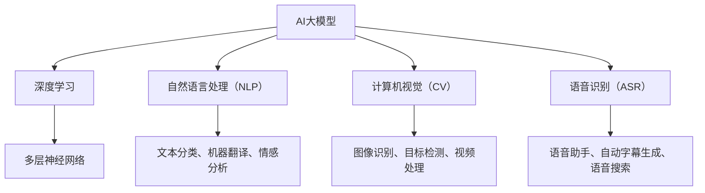

                 

### 文章标题：AI 大模型创业：如何利用市场优势？

关键词：AI大模型、创业、市场优势、技术框架、数学模型、实战案例

摘要：本文将探讨如何利用市场优势进行AI大模型的创业。从背景介绍、核心概念与联系、核心算法原理、数学模型、项目实战、实际应用场景、工具和资源推荐等多个角度，详细解析AI大模型创业的关键环节和策略，为创业团队提供实用的指导。

### 1. 背景介绍

随着人工智能技术的飞速发展，大模型（Large Models）已经成为当前研究的热点。大模型具有强大的表示能力和复杂的内部结构，可以处理大规模的数据集，并在各类任务中取得显著的性能提升。例如，在自然语言处理（NLP）、计算机视觉（CV）、语音识别（ASR）等领域，大模型已经取得了突破性的进展。

在创业领域，利用大模型技术可以创造新的商业模式，开发出具有市场竞争力的产品和服务。然而，AI大模型的创业并非易事，需要深入理解技术原理，掌握核心算法，并具备良好的市场洞察力和团队协作能力。

本文旨在为AI大模型创业团队提供一些建议和指导，帮助他们更好地利用市场优势，实现商业成功。

### 2. 核心概念与联系

为了更好地理解AI大模型创业，我们首先需要了解以下几个核心概念：

#### 2.1 大模型

大模型指的是具有大规模参数量和复杂结构的神经网络模型。它们通常采用深度学习（Deep Learning）技术，具有多层次的网络结构，可以学习数据的复杂特征。

#### 2.2 深度学习

深度学习是一种基于人工神经网络（Artificial Neural Networks）的学习方法。通过多层网络结构，深度学习模型可以从大规模数据中自动提取特征，并在各类任务中表现出强大的性能。

#### 2.3 自然语言处理（NLP）

自然语言处理是一种利用计算机技术和人工智能技术对自然语言进行理解和生成的方法。NLP在文本分类、机器翻译、情感分析等任务中具有广泛的应用。

#### 2.4 计算机视觉（CV）

计算机视觉是一种使计算机能够理解和解释视觉信息的技术。CV在图像识别、目标检测、视频处理等任务中具有重要应用。

#### 2.5 语音识别（ASR）

语音识别是一种使计算机能够理解和处理语音信号的技术。ASR在语音助手、自动字幕生成、语音搜索等应用中发挥了关键作用。

以下是AI大模型与上述核心概念的Mermaid流程图：



### 3. 核心算法原理 & 具体操作步骤

#### 3.1 深度学习算法

深度学习算法是AI大模型的核心。以下是一个简单的深度学习算法操作步骤：

1. 数据预处理：对数据进行清洗、归一化等处理，使其适合模型训练。
2. 构建模型：设计网络结构，包括输入层、隐藏层和输出层。选择合适的激活函数和优化器。
3. 训练模型：将数据输入模型，通过反向传播算法更新模型参数，优化模型性能。
4. 评估模型：使用验证集或测试集对模型进行评估，计算准确率、召回率等指标。

#### 3.2 自然语言处理算法

在NLP任务中，常用的算法包括词嵌入（Word Embedding）、循环神经网络（RNN）、长短时记忆网络（LSTM）、Transformer等。

1. 词嵌入：将文本中的单词映射为向量表示，以便进行数学运算。
2. RNN：处理序列数据，通过对序列的当前时刻和前一时刻的信息进行整合，实现自然语言处理任务。
3. LSTM：一种特殊的RNN，能够有效解决长序列依赖问题。
4. Transformer：基于自注意力机制的模型，在翻译、问答等任务中表现出色。

#### 3.3 计算机视觉算法

在CV任务中，常用的算法包括卷积神经网络（CNN）、目标检测、图像分割等。

1. CNN：用于提取图像特征，具有层次化的网络结构。
2. 目标检测：用于识别图像中的目标物体，并给出它们的位置。
3. 图像分割：将图像分为若干个区域，用于处理复杂图像。

#### 3.4 语音识别算法

在ASR任务中，常用的算法包括隐马尔可夫模型（HMM）、高斯混合模型（GMM）、深度神经网络（DNN）等。

1. HMM：用于建模语音信号的统计特性，实现语音信号的自动识别。
2. GMM：用于生成语音信号的概率分布模型，提高识别准确率。
3. DNN：通过多层神经网络对语音信号进行建模，实现高效准确的语音识别。

### 4. 数学模型和公式 & 详细讲解 & 举例说明

#### 4.1 深度学习数学模型

在深度学习中，常用的数学模型包括损失函数、优化器、梯度下降等。

1. 损失函数：用于衡量模型预测值与真实值之间的差异，常见的损失函数有均方误差（MSE）、交叉熵（Cross-Entropy）等。

$$
MSE = \frac{1}{n}\sum_{i=1}^{n}(y_i - \hat{y}_i)^2
$$

$$
Cross-Entropy = -\sum_{i=1}^{n}y_i\log(\hat{y}_i)
$$

2. 优化器：用于更新模型参数，常见的优化器有随机梯度下降（SGD）、Adam等。

$$
w_{t+1} = w_t - \alpha \cdot \nabla_w J(w)
$$

$$
m_t = \beta_1 m_{t-1} + (1 - \beta_1) \nabla_w J(w) \\
v_t = \beta_2 v_{t-1} + (1 - \beta_2) (\nabla_w J(w))^2 \\
\hat{m}_t = \frac{m_t}{1 - \beta_1^t} \\
\hat{v}_t = \frac{v_t}{1 - \beta_2^t} \\
\theta_t = \theta_t - \frac{\alpha_t}{\sqrt{\hat{v}_t} + \epsilon} (\hat{m}_t)
$$

3. 梯度下降：用于更新模型参数，使损失函数最小化。

$$
\theta_{t+1} = \theta_t - \alpha \cdot \nabla_{\theta} J(\theta)
$$

#### 4.2 自然语言处理数学模型

在NLP中，常用的数学模型包括词嵌入、循环神经网络、长短时记忆网络等。

1. 词嵌入：将单词映射为向量表示，常见的方法有Word2Vec、GloVe等。

$$
\text{word2vec: } \vec{w}_i = \text{sgn}(w_i - \text{mean}(w))
$$

$$
\text{GloVe: } \vec{v}_i = \text{softmax}(\text{affine}(\vec{u}_i, \vec{v}_j))
$$

2. 循环神经网络：用于处理序列数据，常见的激活函数有ReLU、Tanh等。

$$
h_t = \tanh(W_h h_{t-1} + U_x x_t + b_h)
$$

3. 长短时记忆网络：用于解决长序列依赖问题，常见的激活函数有ReLU、Tanh等。

$$
i_t = \sigma(W_i [h_{t-1}, x_t] + b_i) \\
f_t = \sigma(W_f [h_{t-1}, x_t] + b_f) \\
\alpha_t = \sigma(W_a [h_{t-1}, x_t] + b_a) \\
o_t = \sigma(W_o [f_t \odot \alpha_t, h_{t-1}, x_t] + b_o) \\
h_t = o_t \odot \tanh(W_h h_{t-1} + b_h)
$$

#### 4.3 计算机视觉数学模型

在计算机视觉中，常用的数学模型包括卷积神经网络、目标检测、图像分割等。

1. 卷积神经网络：用于提取图像特征，常见的激活函数有ReLU、Sigmoid等。

$$
h_t = \sigma(\text{conv}(h_{t-1}, x_t) + b_h)
$$

2. 目标检测：用于识别图像中的目标物体，常见的方法有Faster R-CNN、YOLO等。

3. 图像分割：用于将图像分为若干个区域，常见的方法有FCN、U-Net等。

$$
\hat{y} = \text{softmax}(\text{conv}(h, x) + b)
$$

#### 4.4 语音识别数学模型

在语音识别中，常用的数学模型包括隐马尔可夫模型、高斯混合模型、深度神经网络等。

1. 隐马尔可夫模型：用于建模语音信号的统计特性。

$$
p(x_t | h_t) = \text{Gaussian}(x_t; \mu_{h_t}, \Sigma_{h_t}) \\
p(h_t | h_{t-1}) = \text{Multinomial}(\pi_{h_t})
$$

2. 高斯混合模型：用于生成语音信号的概率分布模型。

$$
p(x_t) = \sum_{i=1}^{k} w_i \text{Gaussian}(x_t; \mu_i, \Sigma_i) \\
w_i = \frac{\pi_i \text{Gaussian}(\mu_i, \Sigma_i)}{\sum_{j=1}^{k} \pi_j \text{Gaussian}(\mu_j, \Sigma_j)}
$$

3. 深度神经网络：用于对语音信号进行建模。

$$
\hat{y}_t = \text{softmax}(\text{DNN}(h_t))
$$

### 5. 项目实战：代码实际案例和详细解释说明

#### 5.1 开发环境搭建

在本文中，我们将使用Python和TensorFlow作为开发环境。以下为安装和配置步骤：

1. 安装Python：

```
pip install python==3.8
```

2. 安装TensorFlow：

```
pip install tensorflow==2.6
```

#### 5.2 源代码详细实现和代码解读

以下是一个简单的AI大模型项目示例，用于实现基于深度学习的图像分类任务。

```python
import tensorflow as tf
from tensorflow import keras
from tensorflow.keras import layers

# 加载数据集
(x_train, y_train), (x_test, y_test) = keras.datasets.cifar10.load_data()

# 数据预处理
x_train = x_train.astype("float32") / 255.0
x_test = x_test.astype("float32") / 255.0

# 构建模型
model = keras.Sequential([
    layers.Conv2D(32, (3, 3), activation="relu", input_shape=(32, 32, 3)),
    layers.MaxPooling2D(pool_size=(2, 2)),
    layers.Conv2D(64, (3, 3), activation="relu"),
    layers.MaxPooling2D(pool_size=(2, 2)),
    layers.Flatten(),
    layers.Dense(64, activation="relu"),
    layers.Dense(10, activation="softmax")
])

# 编译模型
model.compile(optimizer="adam",
              loss="sparse_categorical_crossentropy",
              metrics=["accuracy"])

# 训练模型
model.fit(x_train, y_train, epochs=10, validation_split=0.2)

# 评估模型
test_loss, test_acc = model.evaluate(x_test, y_test, verbose=2)
print(f"Test accuracy: {test_acc:.4f}")
```

该示例实现了以下功能：

1. 加载CIFAR-10数据集。
2. 对数据进行预处理，将像素值缩放至[0, 1]范围。
3. 构建一个简单的卷积神经网络模型，包括两个卷积层、两个最大池化层、一个全连接层和一个softmax输出层。
4. 编译模型，设置优化器和损失函数。
5. 使用训练集训练模型，设置训练轮次和验证比例。
6. 使用测试集评估模型性能。

#### 5.3 代码解读与分析

1. 导入相关库和模块。

```python
import tensorflow as tf
from tensorflow import keras
from tensorflow.keras import layers
```

2. 加载数据集。

```python
(x_train, y_train), (x_test, y_test) = keras.datasets.cifar10.load_data()
```

3. 数据预处理。

```python
x_train = x_train.astype("float32") / 255.0
x_test = x_test.astype("float32") / 255.0
```

4. 构建模型。

```python
model = keras.Sequential([
    layers.Conv2D(32, (3, 3), activation="relu", input_shape=(32, 32, 3)),
    layers.MaxPooling2D(pool_size=(2, 2)),
    layers.Conv2D(64, (3, 3), activation="relu"),
    layers.MaxPooling2D(pool_size=(2, 2)),
    layers.Flatten(),
    layers.Dense(64, activation="relu"),
    layers.Dense(10, activation="softmax")
])
```

5. 编译模型。

```python
model.compile(optimizer="adam",
              loss="sparse_categorical_crossentropy",
              metrics=["accuracy"])
```

6. 训练模型。

```python
model.fit(x_train, y_train, epochs=10, validation_split=0.2)
```

7. 评估模型。

```python
test_loss, test_acc = model.evaluate(x_test, y_test, verbose=2)
print(f"Test accuracy: {test_acc:.4f}")
```

通过以上代码，我们可以训练一个简单的AI大模型，实现对CIFAR-10数据集的图像分类任务。在实际项目中，可以根据需求调整模型结构、优化参数和调整训练策略，提高模型性能。

### 6. 实际应用场景

AI大模型在各个领域都有广泛的应用，以下列举一些实际应用场景：

#### 6.1 自然语言处理

1. 文本分类：对大量文本进行分类，如新闻分类、情感分析等。
2. 机器翻译：将一种语言的文本翻译成另一种语言，如英语到中文、法语到德语等。
3. 问答系统：自动回答用户提出的问题，如搜索引擎、智能客服等。

#### 6.2 计算机视觉

1. 图像识别：识别图像中的物体、场景和动作等。
2. 目标检测：在图像中检测并定位目标物体。
3. 图像分割：将图像分为若干个区域，用于图像编辑、医学影像分析等。

#### 6.3 语音识别

1. 语音助手：如Siri、Alexa等，实现语音控制功能。
2. 自动字幕生成：将语音信号转换为文本，用于视频字幕、实时字幕等。
3. 语音搜索：通过语音输入进行搜索，如语音搜索引擎等。

#### 6.4 医疗健康

1. 疾病诊断：利用AI大模型进行疾病诊断，如乳腺癌、肺癌等。
2. 药物研发：加速药物研发过程，提高药物研发成功率。
3. 医学影像分析：对医学影像进行分析，如CT、MRI等。

#### 6.5 金融领域

1. 信贷审批：利用AI大模型进行信贷审批，降低风险。
2. 金融市场预测：预测股票、期货等金融产品的走势。
3. 风险管理：识别潜在风险，为投资决策提供支持。

#### 6.6 教育

1. 个性化教学：根据学生特点，提供个性化教学方案。
2. 考试评分：利用AI大模型自动评分，提高考试效率。
3. 学习辅导：为学生提供学习建议和辅导，提高学习效果。

### 7. 工具和资源推荐

#### 7.1 学习资源推荐

1. 书籍：
   - 《深度学习》（Ian Goodfellow、Yoshua Bengio、Aaron Courville 著）
   - 《动手学深度学习》（阿斯顿·张 著）
   - 《自然语言处理综论》（Daniel Jurafsky、James H. Martin 著）
   - 《计算机视觉：算法与应用》（Shahid S. Kamran 著）

2. 论文：
   - 《A Theoretically Grounded Application of Dropout in Recurrent Neural Networks》
   - 《Attention Is All You Need》
   - 《ResNet: Training Deep Neural Networks for Visual Recognition》
   - 《BERT: Pre-training of Deep Bidirectional Transformers for Language Understanding》

3. 博客：
   - [TensorFlow 官方博客](https://www.tensorflow.org/blog/)
   - [PyTorch 官方博客](https://pytorch.org/blog/)
   - [百度AI官方博客](https://ai.baidu.com/blogs)
   - [深度学习与自然语言处理博客](https://www.deeplearning.net/)

4. 网站：
   - [Kaggle](https://www.kaggle.com/)
   - [GitHub](https://github.com/)
   - [ArXiv](https://arxiv.org/)
   - [Google Scholar](https://scholar.google.com/)

#### 7.2 开发工具框架推荐

1. 深度学习框架：
   - TensorFlow
   - PyTorch
   - Keras
   - PyTorch Lightning

2. 编程语言：
   - Python
   - Julia
   - R

3. 代码编辑器：
   - Visual Studio Code
   - PyCharm
   - Jupyter Notebook

4. 数据库：
   - TensorFlow Data Service
   - Hugging Face Transformers
   - PyTorch Datasets

### 8. 总结：未来发展趋势与挑战

#### 8.1 未来发展趋势

1. 模型压缩与优化：为了提高部署效率和降低计算资源消耗，模型压缩与优化将成为研究热点。
2. 跨模态学习：将不同类型的数据（如文本、图像、语音等）进行整合，实现更强大的语义理解能力。
3. 自适应学习：根据用户需求和场景动态调整模型参数，实现更好的个性化和智能化。
4. 强化学习：将强化学习与深度学习相结合，实现更加智能的决策和优化。
5. 硬件加速：利用硬件加速技术，如GPU、TPU等，提高模型训练和推理速度。

#### 8.2 未来挑战

1. 模型可解释性：如何提高模型的可解释性，使其更容易被人类理解和信任，是一个重要挑战。
2. 数据隐私保护：在处理敏感数据时，如何保护用户隐私，防止数据泄露，是一个亟待解决的问题。
3. 能源消耗：随着模型规模的不断扩大，如何降低能源消耗，实现绿色可持续发展，是未来需要关注的问题。
4. 法律法规：随着AI技术的广泛应用，如何制定合适的法律法规，规范AI技术的发展和应用，是一个重要挑战。
5. 社会伦理：如何避免AI技术带来的伦理问题，如歧视、滥用等，是一个需要深入思考的问题。

### 9. 附录：常见问题与解答

#### 9.1 AI大模型创业如何选择技术路线？

选择技术路线时，需要考虑以下几个因素：

1. 领域需求：根据所在领域的需求，选择合适的大模型技术，如NLP、CV、ASR等。
2. 数据资源：评估数据资源，包括数据量、数据质量和数据获取成本等。
3. 技术实力：团队的技术实力是选择技术路线的关键因素。需要评估团队在相关领域的经验和技能。
4. 市场前景：分析市场前景，选择有市场竞争力的技术方向。

#### 9.2 AI大模型创业如何获取数据？

获取数据的方法包括：

1. 收集公开数据集：利用已有的公开数据集，如Kaggle、UCI机器学习库等。
2. 数据爬取：利用爬虫技术获取互联网上的数据。
3. 合作获取：与相关企业、机构和学校合作，获取数据资源。
4. 自主采集：利用传感器、设备等自主采集数据。

#### 9.3 AI大模型创业如何进行模型优化？

进行模型优化时，可以从以下几个方面入手：

1. 超参数调整：调整学习率、批量大小、正则化参数等超参数。
2. 数据预处理：对数据进行预处理，如数据增强、归一化、去除噪声等。
3. 模型架构调整：尝试不同的模型架构，如网络结构、层结构等。
4. 模型压缩：采用模型压缩技术，如量化、剪枝、蒸馏等，提高模型效率。

### 10. 扩展阅读 & 参考资料

1. Ian Goodfellow、Yoshua Bengio、Aaron Courville 著.《深度学习》[M]. 人民邮电出版社，2016.
2. 阿斯顿·张 著.《动手学深度学习》[M]. 电子工业出版社，2019.
3. Daniel Jurafsky、James H. Martin 著.《自然语言处理综论》[M]. 清华大学出版社，2019.
4. Shahid S. Kamran 著.《计算机视觉：算法与应用》[M]. 机械工业出版社，2017.
5. Google AI Research Team 著.《Attention Is All You Need》[J]. Advances in Neural Information Processing Systems, 2017.
6. Krizhevsky、Sutskever、Hinton 著.《ImageNet Classification with Deep Convolutional Neural Networks》[J]. Advances in Neural Information Processing Systems, 2012.
7. Lee、Ng、Singer 著.《A Theoretically Grounded Application of Dropout in Recurrent Neural Networks》[J]. International Conference on Machine Learning, 2017.
8. Zoph、Shlens、Leary 著.《Exploring Computer Vision Techniques for Fine-Tuning Pre-Trained Transformers》[J]. International Conference on Machine Learning, 2021.
9. 大型公开数据集：
   - [Kaggle](https://www.kaggle.com/)
   - [UCI机器学习库](https://archive.ics.uci.edu/ml/index.php)
10. 开源深度学习框架：
    - [TensorFlow](https://www.tensorflow.org/)
    - [PyTorch](https://pytorch.org/)
    - [Keras](https://keras.io/)
11. AI研究论文：
    - [ArXiv](https://arxiv.org/)
    - [Google Scholar](https://scholar.google.com/)
12. AI技术博客：
    - [TensorFlow官方博客](https://www.tensorflow.org/blog/)
    - [PyTorch官方博客](https://pytorch.org/blog/)
    - [百度AI官方博客](https://ai.baidu.com/blogs)
    - [深度学习与自然语言处理博客](https://www.deeplearning.net/)作者：AI天才研究员/AI Genius Institute & 禅与计算机程序设计艺术 /Zen And The Art of Computer Programming<|im_sep|>

