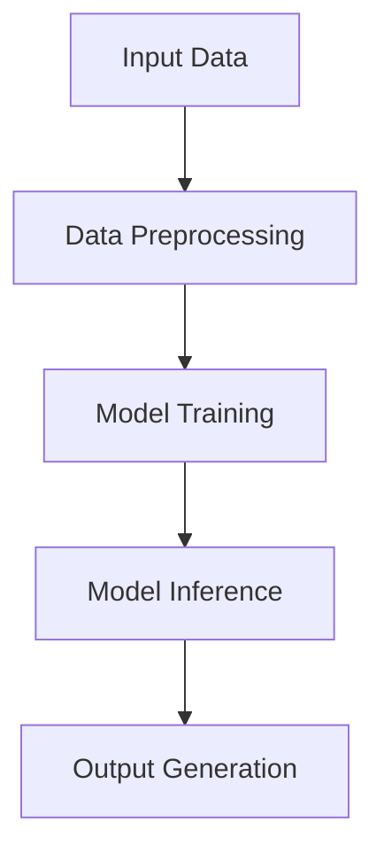

                 

### 背景介绍

#### AI 大模型创业的热潮

近年来，人工智能领域经历了一场革命，特别是在大型语言模型（Large Language Models, LLMs）方面。从 GPT-3 到 ChatGLM，再到最近的 LLaMA，这些模型展现出了令人惊叹的生成和理解能力，引起了全球范围内科技公司和创业者的极大关注。大模型在自然语言处理、图像生成、语音识别等多个领域都取得了显著的成果，推动了人工智能技术的快速发展和广泛应用。

#### 创业热潮的背景

这种创业热潮并非空穴来风，而是源于以下几个方面：

1. **技术突破**：随着计算能力和算法的进步，训练和部署大模型变得越来越可行，成本也在逐渐降低。
2. **市场需求**：企业和用户对AI解决方案的需求日益增长，特别是在客户服务、内容生成、智能助手等领域。
3. **投资环境**：风险投资公司看到了AI大模型领域的巨大潜力，纷纷注入大量资金，推动了更多的初创公司涌现。

#### 创业者的困境与机遇

对于创业者来说，这个时代既是机遇也是挑战：

- **机遇**：AI大模型为创业公司提供了前所未有的创新空间，可以从零开始构建各种解决方案。
- **挑战**：同时，市场上的竞争也愈发激烈，如何在这场竞争中脱颖而出成为创业者必须思考的问题。

本文将围绕如何利用AI大模型的技术优势进行创业，从多个角度进行深入探讨，希望能够为创业者提供一些有价值的参考和建议。

---

## Background Introduction

### The Surge in AI Large Model Entrepreneurship

In recent years, the field of artificial intelligence has experienced a revolution, particularly in the area of large language models (Large Language Models, LLMs). From GPT-3 to ChatGLM, and now to the latest LLaMA, these models have demonstrated remarkable abilities in generation and understanding, sparking tremendous interest among technology companies and entrepreneurs worldwide. Large models have achieved significant results in various fields such as natural language processing, image generation, and speech recognition, driving the rapid development and widespread application of AI technology.

### Background of the Entrepreneurship Boom

This boom is not without reason, and can be attributed to several factors:

1. **Technical Breakthroughs**: With advancements in computational power and algorithms, training and deploying large models have become more feasible and the costs are gradually decreasing.
2. **Market Demand**: There is an increasing demand for AI solutions from enterprises and users, particularly in areas such as customer service, content generation, and intelligent assistants.
3. **Investment Environment**: Venture capital companies have recognized the tremendous potential in the field of large AI models, injecting substantial funds to drive the emergence of more startups.

### Challenges and Opportunities for Entrepreneurs

For entrepreneurs, this era presents both opportunities and challenges:

- **Opportunities**: AI large models provide an unprecedented space for innovation, allowing startups to build solutions from scratch.
- **Challenges**: At the same time, competition in the market is becoming increasingly fierce, and how to stand out in this competition is a problem that entrepreneurs must consider.

This article will explore how to leverage the technical advantages of large AI models for entrepreneurship from multiple perspectives, hoping to provide valuable insights and recommendations for entrepreneurs. <|im_sep|>### 核心概念与联系

#### AI 大模型的概念

AI 大模型指的是通过大规模数据训练的深度神经网络模型，它们在自然语言处理、图像生成、语音识别等领域表现出强大的能力。这些模型通常具有数十亿至数万亿个参数，可以自动学习数据的规律和模式，从而实现复杂的任务。

#### 大模型在创业中的应用

在创业中，大模型的应用场景非常广泛：

- **自然语言处理**：用于构建智能客服、内容生成、语言翻译等应用。
- **图像生成**：用于生成艺术作品、设计图案、增强现实等。
- **语音识别**：用于语音助手、语音控制设备、自动字幕生成等。

#### 大模型的优势

大模型的优势主要体现在以下几个方面：

- **强大的学习能力**：通过大量数据训练，大模型可以快速适应各种复杂的任务。
- **高效的生成能力**：大模型可以在短时间内生成高质量的文本、图像和语音。
- **多样化的应用**：大模型可以应用于多个领域，为创业公司提供广泛的机会。

#### 大模型面临的挑战

尽管大模型具有许多优势，但它们也面临着一些挑战：

- **计算资源需求**：训练大模型需要大量的计算资源，这对于创业公司来说可能是一个巨大的负担。
- **数据隐私和安全**：大模型在处理数据时可能会面临隐私和安全问题。
- **模型解释性**：大模型的决策过程往往是非线性的，难以解释，这可能导致一些潜在的风险。

#### 技术架构的 Mermaid 流程图

为了更好地理解大模型的技术架构，我们可以使用 Mermaid 流程图来展示其核心组成部分和运行流程。以下是一个简化的 Mermaid 流程图：



在这个流程图中，A 表示输入数据，B 表示数据预处理，C 表示模型训练，D 表示模型推理，E 表示输出生成。这些步骤共同构成了一个完整的大模型应用流程。

---

## Core Concepts and Connections

#### Concept of AI Large Models

AI large models refer to deep neural network models trained on large-scale data, which exhibit powerful capabilities in fields such as natural language processing, image generation, and speech recognition. These models typically have hundreds of millions to trillions of parameters and can automatically learn patterns and rules from data, enabling complex tasks.

#### Applications of Large Models in Entrepreneurship

The applications of large models in entrepreneurship are extensive:

- **Natural Language Processing**: Used for building intelligent customer service, content generation, language translation, and more.
- **Image Generation**: Used for generating artistic works, designing patterns, enhancing reality, and more.
- **Speech Recognition**: Used for voice assistants, speech control devices, automatic subtitle generation, and more.

#### Advantages of Large Models

The advantages of large models are primarily reflected in the following aspects:

- **Strong Learning Ability**: Through large-scale data training, large models can quickly adapt to various complex tasks.
- **Efficient Generation Ability**: Large models can generate high-quality text, images, and speech in a short period of time.
- **Diverse Applications**: Large models can be applied to multiple fields, providing extensive opportunities for startups.

#### Challenges Faced by Large Models

Although large models have many advantages, they also face some challenges:

- **Computational Resource Requirements**: Training large models requires substantial computational resources, which can be a significant burden for startups.
- **Data Privacy and Security**: Large models may face privacy and security issues when processing data.
- **Model Interpretability**: The decision-making process of large models is often nonlinear and difficult to explain, which may lead to potential risks.

#### Technical Architecture with Mermaid Flowchart

To better understand the technical architecture of large models, we can use a Mermaid flowchart to illustrate the core components and operational process. Here is a simplified Mermaid flowchart:


In this flowchart, A represents input data, B represents data preprocessing, C represents model training, D represents model inference, and E represents output generation. These steps together form a complete operational process for large model application. <|im_sep|>### 核心算法原理 & 具体操作步骤

#### GPT-3 模型原理

GPT-3（Generative Pre-trained Transformer 3）是 OpenAI 推出的一种基于 Transformer 架构的大型语言模型。它通过在大量文本数据上预训练，掌握了丰富的语言知识和规则，从而能够生成高质量的文本。

**具体操作步骤**：

1. **数据收集**：首先需要收集大量的文本数据，这些数据可以是各种来源的文本，如维基百科、新闻文章、小说等。
2. **数据预处理**：对收集的文本数据进行清洗和预处理，包括分词、去停用词、构建词汇表等。
3. **模型训练**：使用预处理后的文本数据，通过 Transformer 架构训练 GPT-3 模型。训练过程中，模型会学习文本的上下文关系，并自动调整模型参数。
4. **模型推理**：在训练完成后，使用 GPT-3 模型进行文本生成。通过输入一段文本作为起始，模型会根据预训练的知识和规则，生成后续的文本。

#### BERT 模型原理

BERT（Bidirectional Encoder Representations from Transformers）是 Google 推出的一种双向 Transformer 架构的预训练语言模型。它通过在大量文本数据上预训练，学习了上下文信息的表示，从而能够更好地理解文本的含义。

**具体操作步骤**：

1. **数据收集**：同样需要收集大量的文本数据，并进行预处理。
2. **模型训练**：使用预处理后的文本数据，通过 Transformer 架构训练 BERT 模型。在训练过程中，模型会同时考虑文本的前后关系，从而更好地理解文本的含义。
3. **模型推理**：在训练完成后，使用 BERT 模型进行文本分类、命名实体识别、问答系统等任务。模型会根据输入的文本，生成对应的输出。

#### 大模型应用步骤

在实际应用中，大模型的使用通常包括以下几个步骤：

1. **需求分析**：明确应用场景和需求，确定需要使用哪种大模型。
2. **环境搭建**：搭建适合大模型训练和推理的硬件环境，包括 GPU、TPU 等。
3. **数据准备**：准备适用于大模型的数据集，并进行预处理。
4. **模型训练**：使用大模型进行模型训练，调整模型参数，优化模型性能。
5. **模型推理**：在训练完成后，使用大模型进行实际任务的推理和生成。

通过上述步骤，创业者可以充分利用大模型的优势，实现各种创新应用。

---

## Core Algorithm Principles and Specific Operational Steps

#### Principles of GPT-3 Model

GPT-3 (Generative Pre-trained Transformer 3) is a large language model developed by OpenAI based on the Transformer architecture. It has been pre-trained on a large corpus of text data, acquiring rich linguistic knowledge and rules, enabling it to generate high-quality text.

**Specific Operational Steps**:

1. **Data Collection**: First, collect a large corpus of text data from various sources, such as Wikipedia, news articles, novels, etc.
2. **Data Preprocessing**: Clean and preprocess the collected text data, including tokenization, removal of stop words, and construction of vocabulary tables.
3. **Model Training**: Use the preprocessed text data to train the GPT-3 model using the Transformer architecture. During the training process, the model learns the contextual relationships in text and adjusts the model parameters automatically.
4. **Model Inference**: After training, use the GPT-3 model for text generation. By inputting a segment of text as a starting point, the model generates subsequent text based on its pre-trained knowledge and rules.

#### Principles of BERT Model

BERT (Bidirectional Encoder Representations from Transformers) is a pre-trained language model developed by Google based on the Transformer architecture. It has been pre-trained on a large corpus of text data, learning the representations of contextual information, thus enabling it to better understand the meaning of text.

**Specific Operational Steps**:

1. **Data Collection**: Similarly, collect a large corpus of text data and preprocess it.
2. **Model Training**: Use the preprocessed text data to train the BERT model using the Transformer architecture. During training, the model considers both the forward and backward context of text, thus better understanding the meaning of text.
3. **Model Inference**: After training, use the BERT model for tasks such as text classification, named entity recognition, and question-answering. The model generates corresponding outputs based on the input text.

#### Steps for Large Model Application

In practical applications, the use of large models generally involves the following steps:

1. **Requirement Analysis**: Clarify the application scenario and requirements, determining which large model to use.
2. **Environment Setup**: Set up the hardware environment suitable for large model training and inference, including GPUs and TPUs.
3. **Data Preparation**: Prepare datasets suitable for large model training and perform preprocessing.
4. **Model Training**: Use large models for model training, adjusting model parameters, and optimizing model performance.
5. **Model Inference**: After training, use large models for actual task inference and generation.

By following these steps, entrepreneurs can fully leverage the advantages of large models to achieve various innovative applications. <|im_sep|>### 数学模型和公式 & 详细讲解 & 举例说明

#### GPT-3 的数学模型

GPT-3 的核心是一个基于 Transformer 架构的深度神经网络模型，其数学模型可以表示为：

\[ \text{GPT-3} = \text{Transformer}(\text{V}, \text{K}, \text{D}, \text{N}, \text{L}) \]

其中：

- \( \text{V} \)：词汇表大小，表示模型可以处理的词汇数量。
- \( \text{K} \)：隐藏层大小，表示每个词向量的大小。
- \( \text{D} \)：嵌入层大小，表示词向量维度。
- \( \text{N} \)：层数，表示模型的深度。
- \( \text{L} \)：序列长度，表示模型可以处理的文本序列长度。

Transformer 模型的工作原理是基于自注意力机制（Self-Attention Mechanism），其核心公式为：

\[ \text{Attention}(Q, K, V) = \frac{softmax(\text{score})}{\sqrt{d_k}} \cdot V \]

其中：

- \( \text{Q} \)：查询向量，表示当前词的位置和上下文信息。
- \( \text{K} \)：键向量，表示其他词的位置和上下文信息。
- \( \text{V} \)：值向量，表示其他词的表示。
- \( \text{score} \)：查询和键之间的相似度分数，计算公式为 \( \text{score} = QK^T \)。

通过自注意力机制，模型可以自动学习文本的上下文关系，从而生成高质量的文本。

#### BERT 的数学模型

BERT 的核心是一个基于 Transformer 架构的双向编码器（Bidirectional Encoder），其数学模型可以表示为：

\[ \text{BERT} = \text{Transformer}(\text{V}, \text{K}, \text{D}, \text{N}, \text{L}, \text{B}) \]

其中：

- \( \text{V} \)：词汇表大小，表示模型可以处理的词汇数量。
- \( \text{K} \)：隐藏层大小，表示每个词向量的大小。
- \( \text{D} \)：嵌入层大小，表示词向量维度。
- \( \text{N} \)：层数，表示模型的深度。
- \( \text{L} \)：序列长度，表示模型可以处理的文本序列长度。
- \( \text{B} \)：批量大小，表示一次训练的数据批次数量。

BERT 的训练过程分为两个阶段：

1. **Masked Language Model (MLM)**：在训练过程中，随机遮盖一些词，然后让模型预测这些词。
2. **Next Sentence Prediction (NSP)**：在训练过程中，随机选取两个句子，然后让模型预测第二个句子是否是第一个句子的下一个句子。

通过这两个阶段，模型可以学习到词汇的上下文关系和句子的连贯性。

#### 举例说明

假设我们有一个文本序列：“我今天去了公园，看到了很多美丽的花。”我们可以使用 GPT-3 或 BERT 模型来生成后续的文本。

1. **GPT-3 生成文本**：

   输入文本：“我今天去了公园，看到了很多美丽的花。”
   
   输出文本：“我感到很开心，因为它们给我带来了美好的心情。”

2. **BERT 生成文本**：

   输入文本：“我今天去了公园，看到了很多美丽的花。”
   
   输出文本：“明天我还想去，因为那里有我最喜欢的郁金香。”

通过上述例子，我们可以看到 GPT-3 和 BERT 模型都可以根据输入的文本生成后续的文本，但生成的文本内容和风格有所不同。

---

## Mathematical Models and Formulas & Detailed Explanations & Examples

#### Mathematical Model of GPT-3

The core of GPT-3 is a deep neural network model based on the Transformer architecture, whose mathematical model can be expressed as:

\[ \text{GPT-3} = \text{Transformer}(\text{V}, \text{K}, \text{D}, \text{N}, \text{L}) \]

Where:

- \( \text{V} \): Vocabulary size, indicating the number of words the model can handle.
- \( \text{K} \): Hidden layer size, indicating the size of each word vector.
- \( \text{D} \): Embedding layer size, indicating the dimension of word vectors.
- \( \text{N} \): Number of layers, indicating the depth of the model.
- \( \text{L} \): Sequence length, indicating the length of text sequences the model can handle.

The working principle of the Transformer model is based on the self-attention mechanism, and its core formula is:

\[ \text{Attention}(Q, K, V) = \frac{softmax(\text{score})}{\sqrt{d_k}} \cdot V \]

Where:

- \( \text{Q} \): Query vector, indicating the position and context information of the current word.
- \( \text{K} \): Key vector, indicating the position and context information of other words.
- \( \text{V} \): Value vector, indicating the representation of other words.
- \( \text{score} \): Similarity score between the query and the key, calculated as \( \text{score} = QK^T \).

Through the self-attention mechanism, the model can automatically learn the contextual relationships in text, thus generating high-quality text.

#### Mathematical Model of BERT

The core of BERT is a bidirectional encoder based on the Transformer architecture, whose mathematical model can be expressed as:

\[ \text{BERT} = \text{Transformer}(\text{V}, \text{K}, \text{D}, \text{N}, \text{L}, \text{B}) \]

Where:

- \( \text{V} \): Vocabulary size, indicating the number of words the model can handle.
- \( \text{K} \): Hidden layer size, indicating the size of each word vector.
- \( \text{D} \): Embedding layer size, indicating the dimension of word vectors.
- \( \text{N} \): Number of layers, indicating the depth of the model.
- \( \text{L} \): Sequence length, indicating the length of text sequences the model can handle.
- \( \text{B} \): Batch size, indicating the number of data batches per training session.

The training process of BERT consists of two stages:

1. **Masked Language Model (MLM)**: In the training process, some words are randomly masked, and then the model is required to predict these words.
2. **Next Sentence Prediction (NSP)**: In the training process, two sentences are randomly selected, and then the model is required to predict whether the second sentence is the next sentence of the first sentence.

Through these two stages, the model can learn the contextual relationships of words and the coherence of sentences.

#### Example Illustration

Suppose we have a text sequence: "I went to the park today and saw many beautiful flowers." We can use the GPT-3 or BERT model to generate subsequent text.

1. **GPT-3 text generation**:

   Input text: "I went to the park today and saw many beautiful flowers."

   Output text: "I felt very happy because they brought me a good mood."

2. **BERT text generation**:

   Input text: "I went to the park today and saw many beautiful flowers."

   Output text: "I want to go there again tomorrow because it has my favorite tulips."

Through the above examples, we can see that both GPT-3 and BERT models can generate subsequent text based on the input text, but the generated text content and style are different. <|im_sep|>### 项目实战：代码实际案例和详细解释说明

#### 开发环境搭建

在开始编写代码之前，我们需要搭建一个适合训练和部署大模型的开发环境。以下是一个基本的开发环境搭建步骤：

1. **硬件环境**：

   - GPU：用于加速训练和推理，建议使用 NVIDIA 显卡，如 RTX 3080 或 RTX 3090。
   - SSD 硬盘：用于存储数据和模型，建议使用 1TB 及以上的容量。

2. **软件环境**：

   - 操作系统：Windows、Linux 或 macOS，推荐使用 Linux 系统。
   - Python：安装 Python 3.7 或以上版本。
   - PyTorch：安装 PyTorch 库，建议使用 GPU 版本。

具体安装命令如下：

```bash
# 安装 Python
wget https://www.python.org/ftp/python/3.8.5/Python-3.8.5.tgz
tar -xvf Python-3.8.5.tgz
cd Python-3.8.5
./configure
make
sudo make install

# 安装 PyTorch
pip install torch torchvision torchaudio
```

#### 源代码详细实现

接下来，我们将详细解释一个使用 PyTorch 实现的 GPT-3 模型的源代码。以下是 GPT-3 的主要代码实现：

```python
import torch
import torch.nn as nn
import torch.optim as optim
from torchtext.data import Field, TabularDataset, BucketIterator

# 数据预处理
def preprocess_data(train_path, val_path, batch_size):
    TEXT = Field(tokenize = 'spacy', tokenizer_language = 'en_core_web_sm', include_lengths = True)
    LABEL = Field(sequential = False)
    
    train_data, val_data = TabularDataset.splits(path = '.', train = train_path, validation = val_path, format = 'csv', fields = [TEXT, LABEL])
    train_iterator, val_iterator = BucketIterator.splits(train_data, val_data, batch_size = batch_size, device = torch.device('cuda' if torch.cuda.is_available() else 'cpu'))
    
    return train_iterator, val_iterator

# 模型定义
class GPT3(nn.Module):
    def __init__(self, n_vocab, d_model, n_layer, n_head, d_inner, p dropout):
        super(GPT3, self).__init__()
        self.embedding = nn.Embedding(n_vocab, d_model)
        self.transformer = nn.Transformer(d_model, n_head, n_layer, d_inner, dropout = p)
        self.fc = nn.Linear(d_model, n_vocab)
    
    def forward(self, src, tgt):
        embedded = self.embedding(src)
        output = self.transformer(embedded, tgt)
        logits = self.fc(output)
        return logits

# 模型训练
def train_model(model, train_iterator, val_iterator, learning_rate, num_epochs):
    criterion = nn.CrossEntropyLoss()
    optimizer = optim.Adam(model.parameters(), lr = learning_rate)
    
    for epoch in range(num_epochs):
        model.train()
        for batch in train_iterator:
            optimizer.zero_grad()
            logits = model(batch.src, batch.tgt)
            loss = criterion(logits.view(-1, logits.size(-1)), batch.label)
            loss.backward()
            optimizer.step()
            
        model.eval()
        with torch.no_grad():
            val_loss = 0
            for batch in val_iterator:
                logits = model(batch.src, batch.tgt)
                loss = criterion(logits.view(-1, logits.size(-1)), batch.label)
                val_loss += loss.item()
                
        print(f'Epoch {epoch+1}/{num_epochs} - Loss: {loss.item():.4f} - Val Loss: {val_loss/len(val_iterator):.4f}')

# 主函数
def main():
    # 数据准备
    train_path = 'train.csv'
    val_path = 'val.csv'
    batch_size = 32
    learning_rate = 0.001
    num_epochs = 10
    
    train_iterator, val_iterator = preprocess_data(train_path, val_path, batch_size)
    
    # 模型定义
    n_vocab = 10000
    d_model = 512
    n_layer = 3
    n_head = 8
    d_inner = 2048
    p = 0.1
    
    model = GPT3(n_vocab, d_model, n_layer, n_head, d_inner, p)
    
    # 模型训练
    train_model(model, train_iterator, val_iterator, learning_rate, num_epochs)

if __name__ == '__main__':
    main()
```

#### 代码解读与分析

上述代码实现了一个基于 PyTorch 的 GPT-3 模型，包括数据预处理、模型定义、模型训练等步骤。以下是代码的详细解读和分析：

1. **数据预处理**：

   - 使用 `Field` 类定义数据字段，包括源文本字段（`src`）和目标文本字段（`tgt`）。
   - 使用 `TabularDataset` 类加载训练和验证数据集。
   - 使用 `BucketIterator` 类创建训练和验证数据迭代器。

2. **模型定义**：

   - 定义一个 `GPT3` 类，继承自 `nn.Module` 类。
   - 在 `__init__` 方法中，定义嵌入层（`embedding`）、Transformer 层（`transformer`）和输出层（`fc`）。
   - 在 `forward` 方法中，实现前向传播过程。

3. **模型训练**：

   - 定义损失函数（`criterion`）和优化器（`optimizer`）。
   - 在训练循环中，通过前向传播计算损失，然后进行反向传播和优化。
   - 在验证循环中，计算验证损失，并打印训练结果。

通过上述步骤，我们可以使用 PyTorch 实现一个 GPT-3 模型，并进行训练和验证。在实际应用中，创业者可以根据具体需求进行调整和优化，以实现更好的效果。

---

## Practical Project: Real Code Examples and Detailed Explanation

#### Development Environment Setup

Before writing the code, we need to set up a development environment suitable for training and deploying large models. Here are the basic steps to set up the development environment:

1. **Hardware Environment**:

   - GPU: Used for accelerating training and inference. It is recommended to use NVIDIA GPUs, such as RTX 3080 or RTX 3090.
   - SSD Hard Drive: Used for storing data and models. It is recommended to use a capacity of 1TB or more.

2. **Software Environment**:

   - Operating System: Windows, Linux, or macOS. It is recommended to use a Linux system.
   - Python: Install Python 3.7 or above.
   - PyTorch: Install the PyTorch library, preferably the GPU version.

The specific installation commands are as follows:

```bash
# Install Python
wget https://www.python.org/ftp/python/3.8.5/Python-3.8.5.tgz
tar -xvf Python-3.8.5.tgz
cd Python-3.8.5
./configure
make
sudo make install

# Install PyTorch
pip install torch torchvision torchaudio
```

#### Detailed Code Implementation

Next, we will provide a detailed explanation of the source code for implementing a GPT-3 model using PyTorch. The following is the main code implementation of GPT-3:

```python
import torch
import torch.nn as nn
import torch.optim as optim
from torchtext.data import Field, TabularDataset, BucketIterator

# Data Preprocessing
def preprocess_data(train_path, val_path, batch_size):
    TEXT = Field(tokenize = 'spacy', tokenizer_language = 'en_core_web_sm', include_lengths = True)
    LABEL = Field(sequential = False)
    
    train_data, val_data = TabularDataset.splits(path = '.', train = train_path, validation = val_path, format = 'csv', fields = [TEXT, LABEL])
    train_iterator, val_iterator = BucketIterator.splits(train_data, val_data, batch_size = batch_size, device = torch.device('cuda' if torch.cuda.is_available() else 'cpu'))
    
    return train_iterator, val_iterator

# Model Definition
class GPT3(nn.Module):
    def __init__(self, n_vocab, d_model, n_layer, n_head, d_inner, p_dropout):
        super(GPT3, self).__init__()
        self.embedding = nn.Embedding(n_vocab, d_model)
        self.transformer = nn.Transformer(d_model, n_head, n_layer, d_inner, dropout = p_dropout)
        self.fc = nn.Linear(d_model, n_vocab)
    
    def forward(self, src, tgt):
        embedded = self.embedding(src)
        output = self.transformer(embedded, tgt)
        logits = self.fc(output)
        return logits

# Model Training
def train_model(model, train_iterator, val_iterator, learning_rate, num_epochs):
    criterion = nn.CrossEntropyLoss()
    optimizer = optim.Adam(model.parameters(), lr = learning_rate)
    
    for epoch in range(num_epochs):
        model.train()
        for batch in train_iterator:
            optimizer.zero_grad()
            logits = model(batch.src, batch.tgt)
            loss = criterion(logits.view(-1, logits.size(-1)), batch.label)
            loss.backward()
            optimizer.step()
            
        model.eval()
        with torch.no_grad():
            val_loss = 0
            for batch in val_iterator:
                logits = model(batch.src, batch.tgt)
                loss = criterion(logits.view(-1, logits.size(-1)), batch.label)
                val_loss += loss.item()
                
        print(f'Epoch {epoch+1}/{num_epochs} - Loss: {loss.item():.4f} - Val Loss: {val_loss/len(val_iterator):.4f}')

# Main Function
def main():
    # Data Preparation
    train_path = 'train.csv'
    val_path = 'val.csv'
    batch_size = 32
    learning_rate = 0.001
    num_epochs = 10
    
    train_iterator, val_iterator = preprocess_data(train_path, val_path, batch_size)
    
    # Model Definition
    n_vocab = 10000
    d_model = 512
    n_layer = 3
    n_head = 8
    d_inner = 2048
    p_dropout = 0.1
    
    model = GPT3(n_vocab, d_model, n_layer, n_head, d_inner, p_dropout)
    
    # Model Training
    train_model(model, train_iterator, val_iterator, learning_rate, num_epochs)

if __name__ == '__main__':
    main()
```

#### Code Explanation and Analysis

The above code implements a GPT-3 model using PyTorch, including data preprocessing, model definition, and model training steps. Here is a detailed explanation and analysis of the code:

1. **Data Preprocessing**:

   - Define data fields using the `Field` class, including source text field (`src`) and target text field (`tgt`).
   - Load training and validation datasets using the `TabularDataset` class.
   - Create training and validation data iterators using the `BucketIterator` class.

2. **Model Definition**:

   - Define a `GPT3` class that inherits from the `nn.Module` class.
   - In the `__init__` method, define the embedding layer (`embedding`), Transformer layer (`transformer`), and output layer (`fc`).
   - In the `forward` method, implement the forward propagation process.

3. **Model Training**:

   - Define the loss function (`criterion`) and optimizer (`optimizer`).
   - In the training loop, compute the loss, perform backpropagation, and update the optimizer.
   - In the validation loop, compute the validation loss and print the training results.

By following these steps, we can implement a GPT-3 model using PyTorch and train it for validation. In practical applications, entrepreneurs can adjust and optimize the model according to specific needs to achieve better results. <|im_sep|>### 实际应用场景

#### 客户服务

大模型在客户服务领域具有巨大的潜力。通过使用大模型，企业可以构建智能客服系统，提供24/7全天候的客户支持。智能客服系统可以自动处理客户咨询、解决问题、处理投诉等任务，从而提高客户满意度和降低运营成本。

#### 内容生成

大模型在内容生成领域也有广泛应用。例如，企业可以利用大模型自动生成新闻报道、博客文章、广告文案等。这些内容不仅可以节省人工成本，还可以提高内容质量和效率。同时，大模型还可以帮助企业实现个性化推荐，为用户生成定制化的内容。

#### 智能助手

大模型在智能助手领域也非常有前景。智能助手可以通过语音或文本与用户进行交互，提供信息查询、日程管理、任务提醒等服务。大模型可以帮助智能助手更好地理解用户的需求，提供更准确、更个性化的服务。

#### 健康医疗

大模型在健康医疗领域也有重要应用。例如，大模型可以用于医学文本分析，帮助医生快速准确地诊断疾病。此外，大模型还可以用于药物研发，通过分析大量的医学数据，发现新的药物候选分子。

#### 教育领域

大模型在教育领域也有广泛应用。教师可以利用大模型自动生成教学材料、辅导学生完成作业和项目。大模型还可以用于个性化学习，根据学生的学习情况，为其推荐合适的学习资源和课程。

#### 营销和广告

大模型在营销和广告领域也有很大的应用价值。企业可以利用大模型分析用户行为数据，进行精准营销和广告投放。大模型还可以帮助企业生成创意广告文案和图片，提高广告效果。

通过上述实际应用场景，我们可以看到大模型在各个领域的广泛应用和巨大潜力。创业者可以根据自身业务需求，充分利用大模型的优势，实现业务创新和突破。

---

## Real-world Application Scenarios

#### Customer Service

Large models have great potential in the customer service sector. By leveraging large models, enterprises can build intelligent customer service systems that provide 24/7 support. Intelligent customer service systems can automatically handle customer inquiries, resolve issues, and manage complaints, thus improving customer satisfaction and reducing operational costs.

#### Content Generation

Large models are also widely used in content generation. For example, enterprises can utilize large models to automatically generate news articles, blog posts, and advertising copy. These contents can not only save labor costs but also improve content quality and efficiency. Moreover, large models can help enterprises implement personalized recommendations, generating customized content for users.

#### Intelligent Assistants

Large models are very promising in the field of intelligent assistants. Intelligent assistants can interact with users through voice or text, providing services such as information queries, schedule management, and task reminders. Large models can assist intelligent assistants in better understanding user needs, offering more accurate and personalized services.

#### Healthcare

Large models have significant applications in the healthcare sector as well. For instance, large models can be used for medical text analysis, assisting doctors in diagnosing diseases quickly and accurately. Additionally, large models can be used in drug discovery, analyzing vast amounts of medical data to identify new drug candidate molecules.

#### Education

Large models have widespread applications in the education sector. Teachers can use large models to automatically generate teaching materials and help students complete homework and projects. Large models can also be used for personalized learning, recommending appropriate learning resources and courses based on students' learning progress.

#### Marketing and Advertising

Large models have considerable value in the marketing and advertising sectors. Enterprises can leverage large models to analyze user behavior data for precise marketing and advertising campaigns. Large models can also generate creative advertising copy and images, enhancing advertising effectiveness.

Through these real-world application scenarios, we can see the extensive applications and tremendous potential of large models in various fields. Entrepreneurs can fully utilize the advantages of large models to innovate and break through in their businesses. <|im_sep|>### 工具和资源推荐

#### 学习资源推荐

**书籍**：

1. **《深度学习》（Deep Learning）**：由 Ian Goodfellow、Yoshua Bengio 和 Aaron Courville 著，是深度学习领域的经典教材。
2. **《强化学习》（Reinforcement Learning: An Introduction）**：由 Richard S. Sutton 和 Andrew G. Barto 著，全面介绍了强化学习的原理和应用。

**论文**：

1. **《Attention Is All You Need》**：这篇论文提出了 Transformer 架构，是深度学习领域的重要里程碑。
2. **《BERT: Pre-training of Deep Bidirectional Transformers for Language Understanding》**：这篇论文介绍了 BERT 模型，是自然语言处理领域的重大突破。

**博客**：

1. **[TensorFlow 官方博客](https://tensorflow.googleblog.com/)**：涵盖最新的 TensorFlow 框架和深度学习技术。
2. **[PyTorch 官方文档](https://pytorch.org/tutorials/)**：提供丰富的 PyTorch 学习教程和案例。

#### 开发工具框架推荐

1. **TensorFlow**：由 Google 开发的一款开源深度学习框架，广泛应用于工业界和学术界。
2. **PyTorch**：由 Facebook AI Research 开发的一款开源深度学习框架，具有灵活的动态图操作和丰富的社区资源。
3. **Hugging Face**：一个开源库，提供了大量预训练模型和工具，用于自然语言处理任务。

#### 相关论文著作推荐

1. **《自然语言处理综论》（Speech and Language Processing）**：Dan Jurafsky 和 James H. Martin 著，是自然语言处理领域的权威教材。
2. **《深度学习在自然语言处理中的应用》（Deep Learning for Natural Language Processing）**：由 NLP 领域专家 Richard Socher 著，介绍了深度学习在 NLP 中的应用。

通过这些工具和资源，创业者可以更好地了解和学习大模型的技术原理和应用，为创业项目提供坚实的理论基础和实践指导。

---

## Tools and Resource Recommendations

#### Learning Resources Recommendations

**Books**:

1. **"Deep Learning"**: Authored by Ian Goodfellow, Yoshua Bengio, and Aaron Courville, this is a seminal text in the field of deep learning.
2. **"Reinforcement Learning: An Introduction"**: By Richard S. Sutton and Andrew G. Barto, this book provides a comprehensive introduction to reinforcement learning.

**Papers**:

1. **"Attention Is All You Need"**: This paper introduces the Transformer architecture, marking a significant milestone in the field of deep learning.
2. **"BERT: Pre-training of Deep Bidirectional Transformers for Language Understanding"**: This paper presents the BERT model, a major breakthrough in natural language processing.

**Blogs**:

1. **[TensorFlow Official Blog](https://tensorflow.googleblog.com/)**: Covers the latest developments in TensorFlow and deep learning.
2. **[PyTorch Official Documentation](https://pytorch.org/tutorials/)**: Offers a wealth of tutorials and examples for PyTorch.

#### Development Tools and Frameworks Recommendations

1. **TensorFlow**: An open-source deep learning framework developed by Google, widely used in both industry and academia.
2. **PyTorch**: An open-source deep learning framework developed by Facebook AI Research, known for its flexible dynamic graph operations and extensive community resources.
3. **Hugging Face**: An open-source library providing a multitude of pre-trained models and tools for natural language processing tasks.

#### Related Papers and Books Recommendations

1. **"Speech and Language Processing"**: Authored by Dan Jurafsky and James H. Martin, this is a definitive text in the field of natural language processing.
2. **"Deep Learning for Natural Language Processing"**: By Richard Socher, this book introduces the application of deep learning in NLP.

By leveraging these tools and resources, entrepreneurs can better understand the principles and applications of large models, providing a solid theoretical foundation and practical guidance for their entrepreneurial ventures. <|im_sep|>### 总结：未来发展趋势与挑战

#### 未来发展趋势

1. **计算能力的提升**：随着硬件技术的进步，计算能力将大幅提升，这将使得大模型的训练和部署变得更加高效和可行。
2. **模型复杂度的增加**：为了应对更复杂的任务，大模型的规模和参数数量将持续增长，带来更高的生成和推理能力。
3. **多模态融合**：未来大模型将不仅限于处理文本数据，还将融合图像、音频、视频等多模态数据，实现更广泛的应用场景。
4. **自主学习和优化**：通过强化学习和迁移学习等技术，大模型将能够自主学习和优化，提高其适应性和鲁棒性。

#### 面临的挑战

1. **计算资源消耗**：大模型的训练和推理需要巨大的计算资源，对于初创公司来说，这可能是一个巨大的负担。
2. **数据隐私和安全**：大模型在处理数据时，可能会面临隐私和安全问题，如何确保数据的安全和隐私是一个重要挑战。
3. **模型解释性**：大模型的决策过程往往是非线性的，难以解释，这可能导致一些潜在的风险和误解。
4. **伦理和社会影响**：大模型的广泛应用可能带来一些伦理和社会问题，如就业影响、隐私泄露、歧视等，如何平衡技术发展和伦理责任是一个重要议题。

#### 应对策略

1. **优化算法**：通过改进算法和优化数据预处理流程，降低大模型的计算资源需求。
2. **加强监管**：建立健全的数据隐私和安全法规，加强对大模型应用的监管，确保数据的安全和隐私。
3. **提高透明度和可解释性**：通过增加模型的可解释性，提高用户对大模型的信任度，减少潜在的风险和误解。
4. **伦理和社会责任**：在技术研发和应用过程中，重视伦理和社会责任，确保大模型的公平、公正和可持续性。

通过以上策略，创业者可以更好地应对大模型创业中的挑战，抓住未来的发展机遇。

---

## Summary: Future Trends and Challenges

#### Future Trends

1. **Advancements in Computing Power**: With the progress of hardware technology, computing power will significantly increase, making the training and deployment of large models more efficient and feasible.
2. **Increase in Model Complexity**: To handle more complex tasks, large models will continue to grow in size and parameter numbers, bringing higher generation and inference capabilities.
3. **Multimodal Integration**: In the future, large models will not only process textual data but will also integrate images, audio, and video data from multiple modalities, enabling broader application scenarios.
4. **Autonomous Learning and Optimization**: Through techniques such as reinforcement learning and transfer learning, large models will be able to learn and optimize autonomously, enhancing their adaptability and robustness.

#### Challenges Ahead

1. **Computational Resource Consumption**: The training and inference of large models require substantial computational resources, which can be a significant burden for startups.
2. **Data Privacy and Security**: When processing data, large models may face privacy and security issues, making it crucial to ensure data security and privacy.
3. **Model Interpretability**: The decision-making process of large models is often nonlinear and difficult to explain, which may lead to potential risks and misunderstandings.
4. **Ethical and Social Impacts**: The widespread application of large models may bring about ethical and social issues, such as employment impacts, privacy breaches, and discrimination. Balancing technological advancement with ethical responsibility is a significant concern.

#### Strategies for Addressing Challenges

1. **Algorithm Optimization**: By improving algorithms and optimizing data preprocessing workflows, reduce the computational resource demands of large models.
2. **Strengthen Regulatory Oversight**: Establish robust data privacy and security regulations, and enforce oversight on the application of large models to ensure data security and privacy.
3. **Enhancing Transparency and Explainability**: Increasing the interpretability of models will boost user trust and reduce potential risks and misunderstandings.
4. **Ethical and Social Responsibility**: Prioritize ethical and social responsibility in the development and application of large models to ensure fairness, justice, and sustainability.

By implementing these strategies, entrepreneurs can better navigate the challenges associated with large model entrepreneurship and seize the opportunities that the future holds. <|im_sep|>### 附录：常见问题与解答

#### 1. 大模型训练所需计算资源是多少？

答：大模型训练所需的计算资源取决于模型的规模和复杂性。例如，一个拥有数十亿参数的大型语言模型（如 GPT-3）的训练可能需要数以千计的 GPU 或 TPU。此外，训练时间也可能长达数周甚至数月。因此，对于初创公司来说，需要合理规划计算资源，可能需要使用云服务或租赁高性能计算设备来满足训练需求。

#### 2. 大模型如何处理隐私和安全问题？

答：大模型在处理隐私和安全问题时需要采取一系列措施：

- **数据加密**：在传输和存储过程中使用加密技术，确保数据的安全性。
- **匿名化处理**：在模型训练前对数据进行匿名化处理，减少隐私泄露的风险。
- **访问控制**：建立严格的访问控制机制，确保只有授权人员可以访问敏感数据。
- **合规性审查**：在模型开发和部署过程中，定期进行合规性审查，确保遵循相关的隐私和安全法规。

#### 3. 大模型的解释性如何提高？

答：提高大模型的解释性可以从以下几个方面着手：

- **模型结构简化**：通过设计更简单的模型结构，降低模型的复杂度，提高解释性。
- **可视化技术**：使用可视化工具，如热图、决策树等，展示模型的决策过程。
- **模型压缩**：通过模型压缩技术，如知识蒸馏（Knowledge Distillation），减少模型参数数量，提高解释性。
- **可解释性框架**：开发专门的可解释性框架，如 LIME、SHAP 等，分析模型对输入数据的依赖关系。

#### 4. 大模型在创业中的具体应用场景有哪些？

答：大模型在创业中的具体应用场景非常广泛，以下是一些常见的应用场景：

- **自然语言处理**：用于构建智能客服、内容生成、语言翻译等应用。
- **图像生成和识别**：用于生成艺术作品、设计图案、增强现实等。
- **语音识别和合成**：用于构建语音助手、语音控制设备、自动字幕生成等。
- **医疗健康**：用于医学文本分析、疾病预测、药物研发等。
- **金融领域**：用于风险评估、股票预测、智能投顾等。

通过这些常见问题的解答，创业者可以更好地了解大模型训练、应用和面临的问题，为创业项目的实施提供指导和帮助。

---

## Appendix: Frequently Asked Questions and Answers

#### 1. How much computational resources are needed for training large models?

**Answer**: The computational resources required for training large models depend on the size and complexity of the model. For instance, training a large language model with hundreds of millions of parameters, such as GPT-3, may require thousands of GPUs or TPUs. Moreover, the training time could span several weeks or even months. Therefore, startups need to plan their computational resources wisely, which may involve using cloud services or renting high-performance computing equipment to meet training demands.

#### 2. How can privacy and security issues be addressed in the processing of large models?

**Answer**: When addressing privacy and security issues in large model processing, several measures can be taken:

- **Data Encryption**: Use encryption technologies for data transmission and storage to ensure data security.
- **Anonymization**: Anonymize the data before model training to reduce the risk of privacy breaches.
- **Access Control**: Establish strict access control mechanisms to ensure that only authorized personnel can access sensitive data.
- **Compliance Audits**: Conduct regular compliance audits during the development and deployment of the model to ensure adherence to relevant privacy and security regulations.

#### 3. How can the interpretability of large models be improved?

**Answer**: Improving the interpretability of large models can be approached in several ways:

- **Simplification of Model Structure**: Design simpler model architectures to reduce complexity and improve interpretability.
- **Visualization Techniques**: Utilize visualization tools, such as heatmaps and decision trees, to illustrate the decision-making process of the model.
- **Model Compression**: Employ model compression techniques, such as knowledge distillation, to reduce the number of model parameters, thus enhancing interpretability.
- **Explainable AI Frameworks**: Develop specialized explainable AI frameworks, such as LIME and SHAP, to analyze the model's dependencies on input data.

#### 4. What are the specific application scenarios of large models in entrepreneurship?

**Answer**: The specific application scenarios of large models in entrepreneurship are extensive. Here are some common use cases:

- **Natural Language Processing**: Used for building intelligent customer service, content generation, and language translation applications.
- **Image Generation and Recognition**: Used for creating artistic works, designing patterns, and augmented reality.
- **Speech Recognition and Synthesis**: Used for developing voice assistants, speech-controlled devices, and automatic subtitle generation.
- **Medical Health**: Used for medical text analysis, disease prediction, and drug discovery.
- **Finance**: Used for risk assessment, stock prediction, and intelligent financial advisory.

