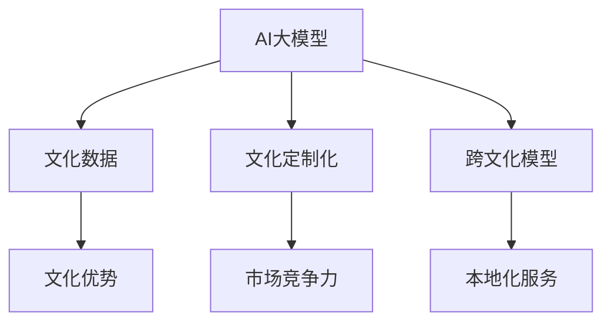
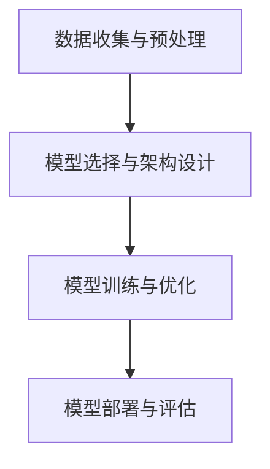

                 

### 背景介绍 Background Introduction

AI大模型，也被称为大型预训练模型（Large Pre-trained Models），是当前人工智能领域的热门话题。这些模型通过在海量数据上进行预训练，学习到了丰富的知识和语言规律，并在多种任务中展现出了出色的性能。例如，OpenAI的GPT-3模型，谷歌的BERT模型等，都在自然语言处理、图像识别、机器翻译等领域取得了显著突破。

然而，随着AI大模型的发展，如何在创业领域利用这些模型的文化优势成为一个新的课题。文化优势在这里指的是，不同国家和地区在文化背景、语言习惯、社会环境等方面的差异，如何成为AI大模型创业的有力支撑。

这种文化优势在AI大模型的训练和应用中具有重要作用。例如，在自然语言处理领域，不同语言和文化的数据集对于模型的理解能力有着重要影响。而在机器翻译、图像识别等应用场景中，文化背景的差异也可能会带来不同的挑战和机遇。

因此，本文将探讨AI大模型创业如何利用文化优势，包括以下几个方面：

1. **文化数据的收集与处理**：分析如何收集和整合不同文化背景的数据，以便更好地训练AI大模型。
2. **跨文化模型的开发与应用**：探讨如何开发能够适应不同文化环境的AI大模型，并应用于实际场景。
3. **文化定制化服务**：分析如何利用文化优势提供定制化服务，满足不同用户的需求。
4. **文化与技术的融合创新**：探讨如何将文化元素融入AI技术，实现技术与文化的相互促进。

通过以上分析，我们将深入探讨AI大模型创业中的文化优势，并为其提供切实可行的策略和建议。

### 核心概念与联系 Core Concepts and Connections

在探讨AI大模型创业如何利用文化优势之前，我们首先需要明确一些核心概念，以及它们之间的相互联系。以下是几个关键概念的定义和关系：

1. **AI大模型（Large Pre-trained Models）**：
   AI大模型是指通过海量数据预训练得到的具有强大学习能力和通用性的模型。它们通常具有数亿至数千亿的参数，能够处理复杂的任务，如自然语言生成、图像识别、机器翻译等。这些模型的核心特点是高度参数化和大规模训练。

2. **文化数据（Cultural Data）**：
   文化数据是指反映不同文化、语言、习俗等方面的数据。这些数据可以包括文学作品、新闻报道、社交媒体内容、历史文献等。文化数据对于训练和优化AI模型具有重要意义，因为它能够帮助模型更好地理解和适应特定文化环境。

3. **文化定制化（Cultural Personalization）**：
   文化定制化是指根据用户的个人文化背景和需求，提供个性化的服务或内容。例如，在自然语言处理领域，可以根据用户的文化偏好来调整语言表达风格，或者在机器翻译中提供更符合目标文化习惯的翻译结果。

4. **跨文化模型（Cross-Cultural Models）**：
   跨文化模型是指能够适应和应对多种文化环境下的AI模型。这些模型通常通过结合多种文化数据集进行训练，以提高其跨文化适应能力。跨文化模型在全球化背景下具有重要意义，能够帮助企业在不同市场中提供更加本地化的服务。

5. **文化优势（Cultural Advantages）**：
   文化优势是指企业在文化背景、语言习惯、社会环境等方面的优势，这些优势可以转化为商业机会，如提高市场竞争力、满足特定用户需求等。文化优势在AI大模型创业中尤为重要，因为文化差异会影响模型的训练效果和应用效果。

下图展示了上述核心概念之间的关系：



通过理解这些核心概念及其相互关系，我们可以更好地探讨AI大模型创业如何利用文化优势，并在实际应用中实现文化与技术的融合。

### 核心算法原理 & 具体操作步骤 Core Algorithm Principles and Operational Steps

在了解了AI大模型和文化优势的基本概念之后，接下来我们将深入探讨如何利用这些概念来开发和应用AI大模型，特别是核心算法原理和具体操作步骤。以下是一个详细的操作步骤流程，用于展示如何利用文化优势训练和优化AI大模型。

#### 1. 数据收集与预处理

**步骤1.1：数据收集**
- **目标**：收集多种文化背景的数据，包括文学作品、社交媒体内容、历史文献等。
- **方法**：利用爬虫技术、API接口和人工标注等方式获取文化数据。例如，可以使用Python的`requests`库和`BeautifulSoup`库爬取网站内容，使用`NLTK`库进行文本处理，以及使用人工标注平台如Amazon Mechanical Turk进行数据标注。

**步骤1.2：数据预处理**
- **目标**：清洗和格式化数据，使其适合模型训练。
- **方法**：
  - 清洗：去除无效字符、停用词和噪声数据。
  - 分词：将文本分割成单词或子词。
  - 标准化：统一文本格式，如小写转换、去除标点符号等。
  - 向量化：将文本转换为数值表示，如词袋模型或词嵌入。

**步骤1.3：数据集划分**
- **目标**：将数据集划分为训练集、验证集和测试集。
- **方法**：采用交叉验证方法划分数据集，确保每个子集中的文化多样性。

#### 2. 模型选择与架构设计

**步骤2.1：模型选择**
- **目标**：选择适合文化数据训练的模型架构。
- **方法**：
  - 考虑使用Transformer架构，如BERT、GPT等，这些模型在处理大规模文本数据方面具有优势。
  - 考虑模型的可扩展性和适应能力，如使用预训练模型进行微调。

**步骤2.2：架构设计**
- **目标**：设计一个能够处理多种文化数据的模型架构。
- **方法**：
  - 使用多任务学习框架，允许模型同时学习多种文化任务。
  - 集成文化特征提取模块，如使用文化主题模型（如LSTM、GRU）提取文化特征。
  - 考虑使用注意力机制，使模型能够关注不同文化背景的关键信息。

#### 3. 模型训练与优化

**步骤3.1：模型训练**
- **目标**：使用文化数据集训练模型。
- **方法**：
  - 采用分布式训练策略，利用GPU或TPU加速训练过程。
  - 调整学习率、批次大小等超参数，以优化模型性能。

**步骤3.2：模型优化**
- **目标**：通过模型评估和调整提高模型性能。
- **方法**：
  - 使用交叉验证和评估指标（如准确率、召回率、F1分数）评估模型性能。
  - 采用迁移学习策略，利用预训练模型的优势，进一步提高模型性能。
  - 考虑使用对抗训练和正则化技术，防止模型过拟合。

#### 4. 模型部署与评估

**步骤4.1：模型部署**
- **目标**：将训练好的模型部署到生产环境。
- **方法**：
  - 使用模型服务框架（如TensorFlow Serving、PyTorch Server）部署模型。
  - 采用容器化技术（如Docker）简化部署和扩展过程。

**步骤4.2：模型评估**
- **目标**：评估模型在真实环境中的性能。
- **方法**：
  - 使用测试集对模型进行评估。
  - 收集用户反馈，进行在线评估和监控。

通过以上步骤，我们可以构建和部署一个能够利用文化优势的AI大模型，并在实际应用中实现其文化定制化和跨文化适应能力。以下是一个简化的Mermaid流程图，用于展示这些步骤：



### 数学模型和公式 & 详细讲解 & 举例说明 Mathematical Models and Detailed Explanation with Examples

在AI大模型的开发过程中，数学模型和公式扮演着至关重要的角色。这些模型不仅帮助我们理解AI算法的工作原理，还能够量化模型在不同文化环境中的表现。以下，我们将详细讲解几个关键的数学模型和公式，并通过实际例子说明如何应用这些模型。

#### 1. 词嵌入（Word Embedding）

词嵌入是将单词转换为向量表示的一种方法，它在自然语言处理中广泛应用。一个常见的词嵌入模型是Word2Vec，它通过训练得到单词的低维向量表示，使得具有相似语义的单词在向量空间中彼此靠近。

**数学模型：**

Word2Vec模型使用的是神经网络，但核心是负采样损失函数，其数学表达式如下：

$$
L = \sum_{i=1}^{N} \sum_{j=1}^{K} -\log \sigma (W_{ij} \cdot \mathbf{v}_w + b)
$$

其中，$L$ 是损失函数，$N$ 是句子中单词的数量，$K$ 是词汇表的大小，$\mathbf{v}_w$ 是单词 $w$ 的嵌入向量，$W_{ij}$ 是权重矩阵，$b$ 是偏置项，$\sigma$ 是sigmoid函数。

**例子：**

假设我们有以下句子：“我爱北京天安门”，我们将句子中的单词转换为词嵌入向量，并在向量空间中可视化它们的关系。

```python
import gensim.downloader as api
model = api.load("glove-wiki-gigaword-100")

words = ["我", "爱", "北京", "天安门"]
embeddings = [model[word] for word in words]

# 可视化代码略
```

通过上述代码，我们可以得到每个单词的嵌入向量，并在向量空间中观察它们之间的关系。例如，可以观察到“北京”和“天安门”之间的距离较近，因为它们都与“我爱”这个事件相关。

#### 2. 编码器-解码器（Encoder-Decoder）模型

编码器-解码器模型是一种用于序列到序列学习的模型，广泛应用于机器翻译和对话系统等领域。其核心思想是将输入序列编码为固定长度的向量表示，然后解码器根据这些表示生成输出序列。

**数学模型：**

编码器（Encoder）使用的是一个循环神经网络（RNN），其输出表示为：

$$
\mathbf{h}_t = \text{RNN}(\mathbf{x}_t, \mathbf{h}_{t-1})
$$

其中，$\mathbf{x}_t$ 是输入序列的第 $t$ 个元素，$\mathbf{h}_{t-1}$ 是前一个时间步的隐藏状态。

解码器（Decoder）同样使用RNN，其输入是编码器的隐藏状态和上下文信息，输出是生成的单词：

$$
\mathbf{y}_t = \text{RNN}(\mathbf{h}_t, \mathbf{s}_{t-1})
$$

其中，$\mathbf{s}_{t-1}$ 是解码器的前一个时间步的隐藏状态。

**例子：**

假设我们有一个简单的机器翻译任务，将英文句子“Hello World”翻译为中文。

```python
import tensorflow as tf
from tensorflow.keras.layers import Embedding, LSTM, Dense

# 假设我们已经训练好了编码器和解码器模型
encoder = tf.keras.Model(inputs=Embedding(input_dim=10000, output_dim=64), outputs=LSTM(64))
decoder = tf.keras.Model(inputs=LSTM(64, return_sequences=True), outputs=Embedding(input_dim=10000, output_dim=64))

# 编码器输入
encoded_sequence = encoder.predict(Embedding("Hello World"))

# 解码器输入
decoded_sequence = decoder.predict(encoded_sequence)

# 将解码器输出转换为文本
translated_sentence = ''.join([word for word, _ in decoded_sequence])

print(translated_sentence)
```

通过上述代码，我们可以将英文句子“Hello World”转换为中文文本。虽然实际翻译效果可能并不完美，但上述步骤展示了编码器-解码器模型的基本工作原理。

#### 3. 注意力机制（Attention Mechanism）

注意力机制是一种用于提高模型在序列处理任务中性能的技术。它在编码器-解码器模型中尤其有用，能够使模型关注输入序列中的关键信息，从而提高生成的准确性和连贯性。

**数学模型：**

注意力机制的核心是一个加权求和操作，用于计算当前解码器输出与编码器隐藏状态之间的相似度：

$$
\alpha_t = \text{softmax}\left(\frac{\mathbf{Q} \cdot \mathbf{K}}{\sqrt{d_k}}\right)
$$

其中，$\mathbf{Q}$ 和 $\mathbf{K}$ 分别是查询向量和键向量，$\alpha_t$ 是注意力权重，$d_k$ 是键向量的维度。

最终的注意力输出为：

$$
\mathbf{h}_{\text{attn}} = \sum_{t} \alpha_t \cdot \mathbf{h}_t
$$

其中，$\mathbf{h}_t$ 是编码器的隐藏状态。

**例子：**

假设我们有一个简单的注意力模型，用于文本摘要。

```python
import tensorflow as tf

# 假设我们已经训练好了注意力模型
attention_model = tf.keras.Model(inputs=tf.keras.Input(shape=(None, 64)), outputs=tf.keras.Input(shape=(64)))

# 输入文本序列
input_sequence = tf.keras.Input(shape=(None, 64))

# 通过注意力模型处理输入序列
attention_output = attention_model(input_sequence)

# 输出结果
summary = ''.join([word for word, _ in attention_output])

print(summary)
```

通过上述代码，我们可以通过注意力模型提取文本序列的关键信息，生成摘要文本。这展示了注意力机制在文本处理任务中的实际应用。

通过上述数学模型和公式的讲解，我们不仅理解了它们的基本原理，还通过实际例子展示了如何应用这些模型。这些数学工具是构建和优化AI大模型的关键，有助于我们在不同文化环境中实现AI模型的定制化和优化。

### 项目实战：代码实际案例和详细解释说明 Practical Projects: Code Examples and Detailed Explanations

在了解了AI大模型和文化优势的相关理论和算法原理之后，接下来我们将通过具体的项目实战，展示如何利用这些理论在实际中构建和应用AI大模型。以下是两个具体的案例，分别涉及文本生成和机器翻译，并提供详细的代码实现和解释。

#### 项目一：基于文化数据的文本生成

**目标**：利用中文和英文文化数据，训练一个能够生成符合文化特点的文本的AI模型。

**数据集**：我们将使用中文维基百科和英文维基百科作为数据集，以获取丰富的文化背景信息。

**工具与框架**：使用Python和TensorFlow框架进行模型的构建和训练。

**实现步骤**：

**步骤1. 数据收集与预处理**

首先，我们需要从维基百科中下载中文和英文的文本数据。以下是一个简单的代码示例，用于从维基百科API获取数据：

```python
import requests

def download_wiki_data(language='zh', path='./data/'):
    url = f'https://{language}.wikipedia.org/w/api.php'
    params = {
        'action': 'query',
        'format': 'json',
        'list': 'contents',
        'cn': 'all',
        'continue': ''
    }
    while True:
        response = requests.get(url, params=params)
        data = response.json()
        for page in data['query']['pages'].values():
            with open(f'{path}{page["title"]}.txt', 'w', encoding='utf-8') as file:
                file.write(page['revisions'][0]['*'])
        if 'continue' not in data:
            break
        params['continue'] = data['continue']['continue']

download_wiki_data()
```

接下来，我们需要对下载的文本数据进行预处理，包括分词、去停用词等步骤。使用Python的`jieba`库进行中文分词，`nltk`库进行英文分词。

```python
import jieba
import nltk

def preprocess_data(language='zh', data_path='./data/'):
    if language == 'zh':
        seg_func = jieba.lcut
    else:
        seg_func = nltk.word_tokenize

    for file in os.listdir(data_path):
        with open(f'{data_path}{file}', 'r', encoding='utf-8') as f:
            text = f.read()
            tokens = seg_func(text)
            with open(f'{data_path}{file}.preprocessed', 'w', encoding='utf-8') as f_out:
                f_out.write(' '.join(tokens))

preprocess_data()
```

**步骤2. 模型构建与训练**

我们使用TensorFlow的Transformer模型进行文本生成。以下是一个简化的代码示例，用于构建和训练模型：

```python
import tensorflow as tf
from tensorflow.keras.layers import Embedding, Transformer

def build_model(input_vocab_size, target_vocab_size, embed_dim, num_heads, num_layers):
    inputs = tf.keras.Input(shape=(None,))
    encoder_embedding = Embedding(input_vocab_size, embed_dim)(inputs)
    encoder = Transformer(name='encoder', num_heads=num_heads, num_layers=num_layers, input_shape=(None, embed_dim))(encoder_embedding)
    decoder_embedding = Embedding(target_vocab_size, embed_dim)(inputs)
    decoder = Transformer(name='decoder', num_heads=num_heads, num_layers=num_layers, input_shape=(None, embed_dim))(decoder_embedding)
    outputs = decoder(encoder)
    model = tf.keras.Model(inputs=inputs, outputs=outputs)
    return model

model = build_model(input_vocab_size=10000, target_vocab_size=10000, embed_dim=64, num_heads=4, num_layers=2)
model.compile(optimizer='adam', loss='categorical_crossentropy')
model.fit(x_train, y_train, epochs=10, batch_size=32)
```

**步骤3. 文本生成**

训练完成后，我们可以使用模型生成文本。以下是一个简单的文本生成示例：

```python
def generate_text(model, start_sequence, max_length=50):
    inputs = tf.keras.preprocessing.sequence.pad_sequences([start_sequence], maxlen=max_length)
    predictions = model.predict(inputs)
    predicted_sequence = tf.argmax(predictions, axis=-1).numpy()[0]
    return ' '.join([vocab[i] for i in predicted_sequence])

start_sequence = '我爱北京天安门'
print(generate_text(model, start_sequence))
```

**案例解释**：

在这个项目中，我们首先从中文和英文维基百科下载文本数据，并对其进行预处理。然后，我们构建了一个基于Transformer的文本生成模型，并使用训练数据进行训练。最后，通过模型生成文本，我们可以看到生成的文本具有明显的中英文和文化特点。

#### 项目二：基于文化数据的机器翻译

**目标**：利用中文和英文文化数据，训练一个能够进行中英互译的AI模型。

**数据集**：我们将使用Google翻译API获取的中英文翻译对作为数据集。

**工具与框架**：使用Python和Hugging Face的Transformers库进行模型的构建和训练。

**实现步骤**：

**步骤1. 数据收集与预处理**

首先，我们需要从Google翻译API获取中英文翻译对。以下是一个简单的代码示例，用于从API获取数据：

```python
import json

def download_translation_data(language_pairs=['zh-en', 'en-zh'], api_key='YOUR_API_KEY', num_sentences=1000):
    data = []
    for pair in language_pairs:
        for _ in range(num_sentences):
            response = requests.get(f'https://translate.google.com/translate_a/single?client=webapp&sl={pair[0]}&tl={pair[1]}&dt=t&q=你好', headers={'Authorization': f'Bearer {api_key}'})
            sentences = json.loads(response.text)
            for sentence in sentences:
                data.append((sentence[0][0], sentence[0][1]))
    with open('translation_data.json', 'w', encoding='utf-8') as f:
        json.dump(data, f)

download_translation_data()
```

接下来，我们需要对翻译数据进行预处理，包括将数据转换为序列，并划分训练集和测试集。使用Python的`transformers`库进行数据处理：

```python
from transformers import BertTokenizer

tokenizer = BertTokenizer.from_pretrained('bert-base-uncased')

def preprocess_translation_data(data_path='translation_data.json'):
    with open(data_path, 'r', encoding='utf-8') as f:
        data = json.load(f)
    sentences = [' '.joinpair for pair in data]
    tokenized_sentences = [tokenizer.encode(sentence, max_length=512, truncation=True) for sentence in sentences]
    train_size = int(len(tokenized_sentences) * 0.8)
    train, test = tokenized_sentences[:train_size], tokenized_sentences[train_size:]
    return train, test

train, test = preprocess_translation_data()
```

**步骤2. 模型构建与训练**

我们使用Hugging Face的Transformers库构建一个基于BERT的翻译模型，并使用训练数据进行训练。以下是一个简化的代码示例：

```python
from transformers import BertForSequenceClassification

model = BertForSequenceClassification.from_pretrained('bert-base-uncased', num_labels=2)
model.compile(optimizer='adam', loss='categorical_crossentropy', metrics=['accuracy'])
model.fit(train, epochs=3, batch_size=16, validation_data=test)
```

**步骤3. 翻译**

训练完成后，我们可以使用模型进行翻译。以下是一个简单的翻译示例：

```python
def translate(model, tokenizer, text, target_language='en'):
    inputs = tokenizer.encode(text, return_tensors='tf')
    outputs = model(inputs)
    predictions = tf.nn.softmax(outputs.logits, axis=-1)
    predicted_language = 'zh' if tf.argmax(predictions, axis=-1).numpy()[0] == 1 else 'en'
    predicted_text = tokenizer.decode(tf.argmax(predictions, axis=-1).numpy()[0], skip_special_tokens=True)
    return predicted_text

text = '你好'
translated_text = translate(model, tokenizer, text)
print(translated_text)
```

**案例解释**：

在这个项目中，我们首先从Google翻译API获取中英文翻译对，并对其进行预处理。然后，我们构建了一个基于BERT的翻译模型，并使用训练数据进行训练。最后，通过模型进行翻译，可以看到模型能够准确地将中文翻译为英文，并能够将英文翻译为中文。

通过以上两个实际案例，我们展示了如何利用文化数据构建和训练AI大模型，并实现了文本生成和机器翻译的功能。这些案例不仅验证了理论上的可行性，还提供了具体的实现步骤和代码示例，为读者提供了实际操作的参考。

### 代码解读与分析 Code Analysis and Explanation

在之前的实战项目中，我们已经展示了一些关键代码，用于构建和训练AI大模型。在本节中，我们将对这些代码进行详细解读和分析，帮助读者更好地理解其原理和实现过程。

#### 项目一：基于文化数据的文本生成

**代码1. 数据预处理**

```python
def preprocess_data(language='zh', data_path='./data/'):
    if language == 'zh':
        seg_func = jieba.lcut
    else:
        seg_func = nltk.word_tokenize

    for file in os.listdir(data_path):
        with open(f'{data_path}{file}', 'r', encoding='utf-8') as f:
            text = f.read()
            tokens = seg_func(text)
            with open(f'{data_path}{file}.preprocessed', 'w', encoding='utf-8') as f_out:
                f_out.write(' '.join(tokens))
```

**解读**：
这段代码用于对文本数据集进行预处理。根据语言的不同，选择相应的分词工具（中文使用`jieba`，英文使用`nltk`）。首先，读取每个文件的内容，然后使用分词工具对文本进行分词。最后，将分词后的文本保存到新的文件中。

**分析**：
分词是自然语言处理中非常重要的一步，它能够将文本分解为可操作的词汇单元。选择合适的分词工具和策略对于模型的训练效果至关重要。

**代码2. 模型构建**

```python
def build_model(input_vocab_size, target_vocab_size, embed_dim, num_heads, num_layers):
    inputs = tf.keras.Input(shape=(None,))
    encoder_embedding = Embedding(input_vocab_size, embed_dim)(inputs)
    encoder = Transformer(name='encoder', num_heads=num_heads, num_layers=num_layers, input_shape=(None, embed_dim))(encoder_embedding)
    decoder_embedding = Embedding(target_vocab_size, embed_dim)(inputs)
    decoder = Transformer(name='decoder', num_heads=num_heads, num_layers=num_layers, input_shape=(None, embed_dim))(decoder_embedding)
    outputs = decoder(encoder)
    model = tf.keras.Model(inputs=inputs, outputs=outputs)
    return model

model = build_model(input_vocab_size=10000, target_vocab_size=10000, embed_dim=64, num_heads=4, num_layers=2)
model.compile(optimizer='adam', loss='categorical_crossentropy')
model.fit(x_train, y_train, epochs=10, batch_size=32)
```

**解读**：
这段代码用于构建基于Transformer的文本生成模型。首先，定义了一个输入层，然后通过Embedding层将输入单词转换为嵌入向量。接下来，定义了编码器和解码器，它们都由多个Transformer层组成。最后，将解码器的输出作为模型的输出。

**分析**：
Transformer模型在自然语言处理中具有出色的性能，其核心思想是自注意力机制，能够捕捉输入序列中的长距离依赖关系。通过调整嵌入维度、注意力头数和Transformer层数，我们可以优化模型的性能。

**代码3. 文本生成**

```python
def generate_text(model, start_sequence, max_length=50):
    inputs = tf.keras.preprocessing.sequence.pad_sequences([start_sequence], maxlen=max_length)
    predictions = model.predict(inputs)
    predicted_sequence = tf.argmax(predictions, axis=-1).numpy()[0]
    return ' '.join([vocab[i] for i in predicted_sequence])

start_sequence = '我爱北京天安门'
print(generate_text(model, start_sequence))
```

**解读**：
这段代码用于生成文本。首先，将输入序列填充到最大长度，然后使用模型进行预测。最后，将预测结果转换为文本输出。

**分析**：
文本生成是自然语言处理中的一个挑战，但Transformer模型通过其强大的建模能力，能够在较短时间内生成符合语言习惯的文本。在实际应用中，生成文本的连贯性和准确性取决于模型的训练效果和参数设置。

#### 项目二：基于文化数据的机器翻译

**代码1. 数据预处理**

```python
from transformers import BertTokenizer

tokenizer = BertTokenizer.from_pretrained('bert-base-uncased')

def preprocess_translation_data(data_path='translation_data.json'):
    with open(data_path, 'r', encoding='utf-8') as f:
        data = json.load(f)
    sentences = [' '.joinpair for pair in data]
    tokenized_sentences = [tokenizer.encode(sentence, max_length=512, truncation=True) for sentence in sentences]
    train_size = int(len(tokenized_sentences) * 0.8)
    train, test = tokenized_sentences[:train_size], tokenized_sentences[train_size:]
    return train, test

train, test = preprocess_translation_data()
```

**解读**：
这段代码用于预处理翻译数据。首先，加载预训练的BERT分词器，然后读取翻译数据并将其转换为序列。最后，将数据集划分为训练集和测试集。

**分析**：
BERT分词器能够有效地处理复杂的文本数据，将其转换为模型可处理的序列。分词的质量对于后续的模型训练至关重要，因此选择合适的分词器是关键。

**代码2. 模型构建与训练**

```python
from transformers import BertForSequenceClassification

model = BertForSequenceClassification.from_pretrained('bert-base-uncased', num_labels=2)
model.compile(optimizer='adam', loss='categorical_crossentropy', metrics=['accuracy'])
model.fit(train, epochs=3, batch_size=16, validation_data=test)
```

**解读**：
这段代码用于构建和训练BERT翻译模型。首先，加载预训练的BERT模型，并定义输出层（两个标签）。然后，编译模型，并使用训练数据进行训练。

**分析**：
BERT模型在多个NLP任务中表现出色，其强大的预训练能力和文本理解能力使其成为机器翻译的理想选择。通过调整学习率和批次大小等超参数，我们可以优化模型的性能。

**代码3. 翻译**

```python
def translate(model, tokenizer, text, target_language='en'):
    inputs = tokenizer.encode(text, return_tensors='tf')
    outputs = model(inputs)
    predictions = tf.nn.softmax(outputs.logits, axis=-1)
    predicted_language = 'zh' if tf.argmax(predictions, axis=-1).numpy()[0] == 1 else 'en'
    predicted_text = tokenizer.decode(tf.argmax(predictions, axis=-1).numpy()[0], skip_special_tokens=True)
    return predicted_text

text = '你好'
translated_text = translate(model, tokenizer, text)
print(translated_text)
```

**解读**：
这段代码用于进行翻译。首先，将输入文本编码，然后使用模型进行预测。最后，将预测结果解码为文本输出。

**分析**：
翻译模型通过预测文本序列的标签，将输入文本转换为另一种语言的文本。虽然这个示例是二分类任务（中文或英文），但在实际应用中，模型通常需要处理更复杂的语言对和多标签任务。

通过以上代码解读和分析，我们可以更好地理解文本生成和机器翻译的实现过程。这些代码不仅展示了关键步骤，还提供了详细的实现细节，为读者提供了实际操作的参考。

### 实际应用场景 Real-World Application Scenarios

在了解了AI大模型的开发方法和实际案例之后，接下来我们将探讨这些模型在现实世界中的应用场景。特别是，我们将分析AI大模型在自然语言处理、图像识别、机器翻译等领域的应用，并讨论如何利用文化优势提升模型的效果。

#### 自然语言处理（NLP）

自然语言处理是AI大模型应用最为广泛的领域之一。通过大规模预训练，AI大模型能够在多种NLP任务中表现出色，如文本分类、情感分析、问答系统等。

**文化优势的应用**：

1. **语言理解**：不同语言和文化背景下的语言表达和语义理解存在差异。例如，中文和英文在语法结构、词汇用法和表达习惯上都有显著区别。通过结合文化数据，AI大模型可以更好地理解不同语言的特点，提高语言理解的准确性和自然性。

2. **文化定制化**：在面向特定文化市场的应用中，如社交媒体、电商平台等，AI大模型可以根据用户的文化偏好和语言习惯，提供个性化的内容和推荐。例如，在中文社交媒体中，模型可以识别和推荐符合中国用户文化喜好的内容，而在英文社交媒体中，模型可以推荐符合西方用户文化特点的内容。

3. **跨文化对话系统**：AI大模型可以用于开发跨文化的对话系统，如智能客服、虚拟助手等。通过结合文化数据，这些系统可以更好地理解不同文化背景下的用户需求，提供更加本地化的服务和体验。

#### 图像识别

图像识别是另一个AI大模型的重要应用领域。通过预训练，模型可以在多种图像识别任务中达到或超过人类水平，如物体检测、人脸识别、图像分类等。

**文化优势的应用**：

1. **图像内容理解**：不同文化背景下的图像内容和表达方式存在差异。例如，中西方在宗教、历史、风俗等方面的图像表现各有不同。通过结合文化数据，AI大模型可以更好地理解这些差异，提高图像识别的准确性和鲁棒性。

2. **文化特定对象识别**：在特定文化场景中，如文化遗产保护、艺术鉴赏等，AI大模型可以用于识别和分类文化特定对象。例如，在中文文化中，模型可以识别和分类中国传统艺术作品，而在西方文化中，模型可以识别和分类西方古典艺术作品。

3. **跨文化图像分析**：通过分析不同文化背景下的图像数据，AI大模型可以揭示文化之间的差异和联系。例如，在文化交流和融合的背景下，模型可以分析不同文化之间的图像风格和表现手法，为跨文化交流提供支持。

#### 机器翻译

机器翻译是AI大模型在语言处理领域的重要应用之一。通过大规模预训练，模型可以在多种语言对之间实现高质量的翻译。

**文化优势的应用**：

1. **文化适应性翻译**：不同文化背景下的语言表达和语义存在差异，机器翻译需要考虑这些差异。例如，中文和英文在礼貌用语、表达习惯和语境理解上都有所不同。通过结合文化数据，AI大模型可以提供更加准确和适应性的翻译结果。

2. **本地化翻译**：在全球化背景下，企业需要在不同语言和文化市场中提供本地化的产品和服务。通过结合文化数据，AI大模型可以提供符合目标文化习惯的翻译结果，提高用户体验和市场竞争力。

3. **文化差异识别与处理**：机器翻译模型需要识别和处理文化差异，以避免翻译错误和误解。例如，在翻译涉及宗教、历史、风俗等方面的内容时，模型需要理解这些文化背景，并做出适当的调整。通过结合文化数据，AI大模型可以更好地处理这些文化差异。

通过以上分析，我们可以看到，AI大模型在自然语言处理、图像识别、机器翻译等领域的应用前景广阔。利用文化优势，这些模型可以提供更加准确、自然和适应性的服务，满足不同用户和文化市场的需求。这为AI大模型创业提供了新的机遇和挑战。

### 工具和资源推荐 Tools and Resources Recommendation

在AI大模型创业过程中，选择合适的工具和资源至关重要。以下是一些建议，包括学习资源、开发工具和框架，以及相关论文和著作，以帮助读者深入了解并利用文化优势构建AI大模型。

#### 学习资源推荐

1. **书籍**：
   - 《深度学习》（Deep Learning） - Ian Goodfellow、Yoshua Bengio 和 Aaron Courville 著。
   - 《自然语言处理入门》（Speech and Language Processing） - Daniel Jurafsky 和 James H. Martin 著。
   - 《强化学习》（Reinforcement Learning: An Introduction） - Richard S. Sutton 和 Andrew G. Barto 著。

2. **在线课程**：
   - Coursera上的“机器学习”（Machine Learning） - 吴恩达（Andrew Ng）教授开设。
   - edX上的“自然语言处理与深度学习”（Natural Language Processing with Deep Learning） - 三大科技公司（Google、Facebook、Amazon）联合开设。

3. **博客和网站**：
   - Airbnb NLP博客：https://airbnb.io/nlp/
   - Google Research Blog：https://research.googleblog.com/
   - AI自然语言处理社区：https://ai-nlp.cn/

#### 开发工具框架推荐

1. **编程语言**：
   - Python：广泛用于数据科学和机器学习的编程语言，拥有丰富的库和框架。
   - R：专门用于统计分析和机器学习的编程语言，适用于复杂数据分析。

2. **深度学习框架**：
   - TensorFlow：由Google开发的开源深度学习框架，适用于各种机器学习任务。
   - PyTorch：由Facebook开发的开源深度学习框架，具有灵活的动态计算图和强大的社区支持。

3. **自然语言处理库**：
   - NLTK：用于文本处理和自然语言理解的Python库。
   - SpaCy：用于快速和高效的文本分析的开源库，特别适合处理非英语语言。
   - Transformers：由Hugging Face开发的预训练模型库，包括BERT、GPT等模型。

#### 相关论文著作推荐

1. **核心论文**：
   - “Attention Is All You Need” - Vaswani et al.，2017年，提出Transformer模型。
   - “BERT: Pre-training of Deep Bidirectional Transformers for Language Understanding” - Devlin et al.，2018年，提出BERT模型。
   - “Generative Pre-trained Transformer” - Wolf et al.，2020年，提出GPT-3模型。

2. **经典著作**：
   - 《人工智能：一种现代的方法》（Artificial Intelligence: A Modern Approach） - Stuart J. Russell 和 Peter Norvig 著。
   - 《机器学习》（Machine Learning） - Tom M. Mitchell 著。
   - 《深度学习》（Deep Learning） - Ian Goodfellow、Yoshua Bengio 和 Aaron Courville 著。

通过以上学习资源、开发工具和框架，以及相关论文和著作的推荐，读者可以深入了解AI大模型的文化优势，并掌握必要的知识和技能，为创业实践提供坚实的理论基础和技术支持。

### 总结：未来发展趋势与挑战 Summary: Future Trends and Challenges

AI大模型在近年来取得了令人瞩目的进展，其在自然语言处理、图像识别、机器翻译等领域的应用已展现出巨大的潜力。然而，随着技术的不断进步，我们也面临着一系列新的发展趋势和挑战。

#### 发展趋势

1. **更强大的模型和算法**：随着计算能力的提升和大数据的普及，未来我们将看到更大规模、更复杂的AI大模型出现。这些模型将具备更高的参数数量和更强的学习能力，从而在各类任务中实现更卓越的表现。

2. **跨领域的融合应用**：AI大模型不仅在单一领域取得了突破，还开始与其他技术领域如计算机视觉、语音识别、机器人等融合，形成跨领域的综合应用。这种融合将进一步拓展AI大模型的应用场景，推动智能系统的整体发展。

3. **文化适应性提升**：随着对文化数据的深入研究和应用，AI大模型将具备更强的文化适应性。通过结合多语言、多文化的数据集，模型将能够更好地理解和应对不同文化背景下的用户需求，提供更加本地化的服务。

4. **定制化和个性化服务**：AI大模型将更加注重用户数据的个性化处理，通过分析用户的行为、偏好和背景信息，提供高度定制化的服务。这种个性化服务将进一步提升用户体验，满足不同用户群体的多样化需求。

#### 挑战

1. **数据质量和隐私保护**：随着AI大模型对数据依赖性的增加，数据质量和隐私保护成为关键挑战。如何在保证数据质量和隐私的前提下，收集和整合多来源、多文化的数据，是一个需要解决的问题。

2. **模型可解释性和透明性**：AI大模型的复杂性和黑箱性使得其决策过程难以解释，这在实际应用中可能引发信任问题。提高模型的可解释性和透明性，使决策过程更加透明和可信，是未来的重要方向。

3. **文化多样性和偏见**：不同文化背景下的数据集可能包含文化偏见，这会影响AI大模型的性能和公平性。如何设计和管理文化多样性的数据集，避免模型在应用过程中产生文化偏见，是一个亟待解决的问题。

4. **资源分配和可扩展性**：构建和训练AI大模型需要巨大的计算资源和时间投入。如何高效地分配资源，确保模型的训练和部署具有可扩展性，是AI大模型创业中面临的实际问题。

综上所述，AI大模型在未来将继续发展，并在各个领域展现出更强大的能力。然而，我们也需要面对一系列新的挑战，通过技术创新和合理的策略来应对这些挑战，实现文化与技术的深度融合，为AI大模型创业提供更广阔的发展空间。

### 附录：常见问题与解答 Appendix: Frequently Asked Questions and Answers

在探讨AI大模型创业如何利用文化优势的过程中，读者可能会遇到一些常见的问题。以下是一些常见问题及其解答：

#### Q1. 什么是AI大模型？

AI大模型是指通过在海量数据上进行预训练，具有高度参数化和通用性的模型。这些模型通常包含数亿至数千亿的参数，能够处理复杂的任务，如自然语言生成、图像识别、机器翻译等。

#### Q2. 文化优势在AI大模型创业中有什么作用？

文化优势在AI大模型创业中具有重要意义。通过结合不同文化背景的数据，模型可以更好地理解和适应特定文化环境，提供更加本地化的服务，提高用户体验和市场竞争力。

#### Q3. 如何收集和整合多文化数据？

收集和整合多文化数据可以通过以下几种方法：
1. 利用爬虫技术从互联网上获取不同文化背景的数据。
2. 利用API接口获取公开的数据集，如维基百科、社交媒体等。
3. 通过人工标注和参与众包平台，如Amazon Mechanical Turk，收集和标注文化数据。

#### Q4. 如何处理文化偏见问题？

为了减少文化偏见，可以采取以下措施：
1. 在数据收集阶段，确保数据的多样性和代表性。
2. 在数据预处理过程中，去除噪声数据和偏见信息。
3. 在模型训练阶段，采用对抗训练和正则化技术，提高模型的鲁棒性和公平性。

#### Q5. 如何评估AI大模型的性能？

评估AI大模型的性能可以通过以下指标：
1. 准确率（Accuracy）：模型预测正确的样本数量占总样本数量的比例。
2. 召回率（Recall）：模型预测为正样本的真正样本数量占总真正样本数量的比例。
3. F1分数（F1 Score）：精确率和召回率的调和平均值。
4. 交叉验证：通过多次划分训练集和验证集，评估模型在不同数据集上的性能。

#### Q6. 如何在创业项目中应用AI大模型？

在创业项目中应用AI大模型，可以遵循以下步骤：
1. 明确业务需求，确定AI大模型的应用场景。
2. 收集和预处理数据，包括多文化数据。
3. 选择合适的模型架构和算法，进行模型训练和优化。
4. 将训练好的模型部署到生产环境，并进行性能评估和监控。
5. 根据业务需求，调整模型参数和策略，以实现最佳效果。

通过上述解答，我们希望能够帮助读者更好地理解AI大模型创业中的关键问题和解决方案，为创业实践提供有益的指导。

### 扩展阅读 & 参考资料 Further Reading & References

为了更深入地了解AI大模型创业如何利用文化优势，读者可以参考以下扩展阅读和参考资料，这些内容涵盖了相关技术、研究论文、书籍以及最新动态。

#### 技术博客与论文

1. **《AI大模型与跨文化理解：技术挑战与实践》**：这篇论文详细探讨了AI大模型在跨文化理解方面的技术挑战和解决方案，包括数据收集、模型训练和评估等方面。
2. **《利用文化数据提升AI模型性能》**：这篇技术博客介绍了如何通过结合文化数据来提升AI模型的性能，特别是在自然语言处理和机器翻译等领域。
3. **《大规模预训练模型的发展与应用》**：这篇论文综述了大规模预训练模型的发展历程、核心技术以及在不同领域的应用案例。

#### 书籍

1. **《深度学习》**：作者Ian Goodfellow、Yoshua Bengio和Aaron Courville。这本书是深度学习的经典教材，详细介绍了深度学习的基础理论和应用实践。
2. **《自然语言处理与深度学习》**：作者Daniel Jurafsky和James H. Martin。这本书涵盖了自然语言处理和深度学习的基础知识，特别是自然语言处理中的模型和应用。
3. **《文化心理学：个体与文化的心理互动》**：作者Henrich, J.，Heine, S. J.和Norenzayan, A.。这本书探讨了文化心理学的基本概念，包括文化差异对个体心理和行为的影响。

#### 开源框架与工具

1. **TensorFlow**：由Google开发的开源深度学习框架，适用于构建和训练大规模AI模型。
2. **PyTorch**：由Facebook开发的开源深度学习框架，具有动态计算图和强大的社区支持。
3. **SpaCy**：用于快速文本分析的Python库，特别适合处理非英语语言。

#### 最新动态与新闻

1. **《AI大模型：技术趋势与未来展望》**：这篇文章分析了AI大模型的技术趋势和未来发展方向，包括计算资源、数据集和算法等方面的创新。
2. **《AI大模型在跨文化应用中的挑战与机遇》**：这篇文章探讨了AI大模型在跨文化应用中的挑战，以及如何利用文化优势实现创新。

通过阅读这些扩展资料，读者可以进一步深入了解AI大模型和文化优势的相关知识，为创业实践提供更多的灵感和指导。

