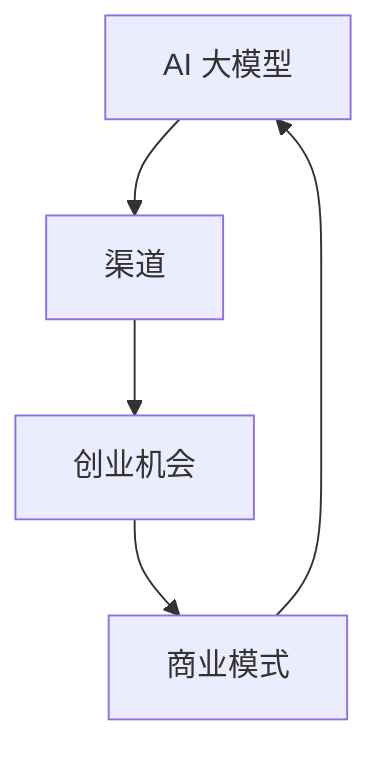

                 

### 背景介绍

#### AI 大模型与创业机会

近年来，人工智能（AI）技术取得了前所未有的突破，特别是在深度学习和大数据分析方面。随着计算能力的提升和数据量的爆炸性增长，大规模人工智能模型（如GPT-3、BERT等）迅速崛起，成为许多行业解决方案的核心。这些大模型不仅能够实现高效的语音识别、自然语言处理、图像识别等功能，还可以在多个领域中进行创新应用，如医疗、金融、教育、娱乐等。

在如此广阔的市场背景下，AI 大模型的创业机会也随之而来。许多创业者开始探索如何利用这些先进的技术来创造新的产品和服务，从而在竞争激烈的市场中脱颖而出。然而，AI 大模型的开发和应用并非易事，它需要大量的数据、计算资源和专业知识。此外，创业过程中还会遇到诸多挑战，如商业模式设计、市场推广、团队建设等。

本篇文章将深入探讨如何利用渠道优势进行 AI 大模型创业。我们将分析现有的成功案例，探讨渠道在创业过程中的关键作用，并提供实用的策略和技巧。通过本文，希望读者能够更好地理解 AI 大模型的商业潜力，并学会如何利用渠道优势来实现创业目标。

#### 文章关键词

- AI 大模型
- 创业机会
- 渠道优势
- 商业模式
- 数据资源
- 计算能力
- 团队建设
- 市场推广

#### 文章摘要

本文将探讨 AI 大模型创业过程中如何利用渠道优势。我们将首先介绍 AI 大模型的发展背景和创业机会，接着分析渠道在创业中的重要性，并探讨如何设计有效的商业模式。随后，我们将分享实际案例，讨论成功利用渠道进行创业的策略。最后，本文将总结未来发展趋势和挑战，并提供相关的资源和工具推荐。

---

# AI 大模型创业：如何利用渠道优势？

## 1. 背景介绍

### AI 大模型与创业机会

近年来，人工智能（AI）技术取得了前所未有的突破，特别是在深度学习和大数据分析方面。随着计算能力的提升和数据量的爆炸性增长，大规模人工智能模型（如GPT-3、BERT等）迅速崛起，成为许多行业解决方案的核心。这些大模型不仅能够实现高效的语音识别、自然语言处理、图像识别等功能，还可以在多个领域中进行创新应用，如医疗、金融、教育、娱乐等。

在如此广阔的市场背景下，AI 大模型的创业机会也随之而来。许多创业者开始探索如何利用这些先进的技术来创造新的产品和服务，从而在竞争激烈的市场中脱颖而出。然而，AI 大模型的开发和应用并非易事，它需要大量的数据、计算资源和专业知识。此外，创业过程中还会遇到诸多挑战，如商业模式设计、市场推广、团队建设等。

本篇文章将深入探讨如何利用渠道优势进行 AI 大模型创业。我们将分析现有的成功案例，探讨渠道在创业过程中的关键作用，并提供实用的策略和技巧。通过本文，希望读者能够更好地理解 AI 大模型的商业潜力，并学会如何利用渠道优势来实现创业目标。

### 文章关键词

- AI 大模型
- 创业机会
- 渠道优势
- 商业模式
- 数据资源
- 计算能力
- 团队建设
- 市场推广

### 文章摘要

本文将探讨 AI 大模型创业过程中如何利用渠道优势。我们将首先介绍 AI 大模型的发展背景和创业机会，接着分析渠道在创业中的重要性，并探讨如何设计有效的商业模式。随后，我们将分享实际案例，讨论成功利用渠道进行创业的策略。最后，本文将总结未来发展趋势和挑战，并提供相关的资源和工具推荐。

---

## 2. 核心概念与联系

在探讨如何利用渠道优势进行 AI 大模型创业之前，我们需要理解一些核心概念和它们之间的联系。以下是一些关键概念及其相互关系：

### 2.1 AI 大模型

AI 大模型是指具有数十亿参数甚至更多的神经网络模型，能够通过深度学习算法从大量数据中学习和提取复杂模式。常见的 AI 大模型包括 GPT-3、BERT、BERT-Base 等。这些模型在自然语言处理、图像识别、语音识别等领域表现出色。

### 2.2 渠道

在商业环境中，渠道是指产品和服务从生产者传递到消费者的路径。渠道可以包括直销、代理商、分销商、在线平台等多种形式。有效的渠道策略能够帮助企业快速扩大市场占有率，提高品牌知名度。

### 2.3 创业机会

创业机会是指创业者能够发现并利用的潜在市场机会。AI 大模型创业机会主要体现在以下几个方面：

1. **技术驱动**：AI 大模型技术的发展为创业者提供了创新的工具和解决方案。
2. **市场需求**：随着企业对智能化需求的增加，创业者可以利用 AI 大模型解决实际业务问题。
3. **数据资源**：大量数据的存在为 AI 大模型提供了训练和优化的基础。

### 2.4 商业模式

商业模式是指企业如何创造、传递和获取价值。对于 AI 大模型创业，有效的商业模式需要考虑以下几个方面：

1. **价值主张**：明确 AI 大模型如何为客户创造价值。
2. **盈利模式**：确定企业如何从 AI 大模型中盈利，例如通过提供服务、销售软件或提供咨询服务等。
3. **成本结构**：分析开发和维护 AI 大模型所需的投资和成本。

### 2.5 核心概念联系

AI 大模型、渠道、创业机会和商业模式之间存在紧密的联系。AI 大模型提供了技术基础，渠道提供了市场触达的途径，创业机会指明了市场方向，而商业模式则将技术、市场和利润联系起来。

### Mermaid 流程图

以下是一个简化的 Mermaid 流程图，展示了这些核心概念之间的相互关系：



在这个流程图中，AI 大模型作为核心技术，通过渠道传递到市场，捕捉创业机会，并通过商业模式实现价值创造和利润获取。这种相互联系和互动为创业提供了坚实的基础。

---

## 3. 核心算法原理 & 具体操作步骤

### 3.1  AI 大模型的算法原理

AI 大模型的核心在于深度学习，这是一种通过模拟人脑神经网络进行数据分析和模式识别的技术。深度学习模型通常由多个层级（Layer）组成，每个层级负责从输入数据中提取不同的特征。这些特征在经过多个层级处理后，能够形成高度抽象的表示，从而实现对复杂问题的有效解决。

以下是一个简化的深度学习模型的工作流程：

1. **数据预处理**：首先对输入数据进行预处理，包括数据清洗、归一化、分割等步骤，以确保数据适合模型训练。
2. **输入层**：将预处理后的数据输入到模型中，通过输入层进行初步的特征提取。
3. **隐藏层**：数据在输入层经过处理后，会传递到隐藏层。每个隐藏层都会对数据进行特征提取和变换，以逐步提高对数据的理解和抽象能力。
4. **输出层**：最后，数据会经过输出层，生成预测结果或决策。对于分类问题，输出层通常是一个 Softmax 函数，用于计算每个类别的概率。
5. **反向传播**：在模型训练过程中，通过反向传播算法不断调整模型参数，以最小化预测误差。

### 3.2 AI 大模型训练过程

AI 大模型的训练过程可以分为以下几个步骤：

1. **数据集划分**：首先将数据集划分为训练集、验证集和测试集。训练集用于模型训练，验证集用于调参和模型选择，测试集用于评估模型性能。
2. **模型初始化**：初始化模型参数。通常使用随机初始化或预训练权重来初始化参数。
3. **前向传播**：将输入数据传递到模型中，计算输出结果。
4. **计算损失函数**：通过比较输出结果和真实标签，计算损失函数值。常见的损失函数包括均方误差（MSE）、交叉熵损失（Cross-Entropy Loss）等。
5. **反向传播**：计算损失函数对模型参数的梯度，并通过梯度下降等优化算法更新模型参数。
6. **迭代训练**：重复步骤 3 到 5，直到满足停止条件（如达到指定迭代次数、验证集误差不再下降等）。

### 3.3 AI 大模型应用示例

以下是一个简单的例子，说明如何使用 AI 大模型进行文本分类：

1. **数据预处理**：收集并预处理文本数据，如去除停用词、词干提取、词向量化等。
2. **模型训练**：使用训练集数据训练一个文本分类模型，例如使用 BERT 模型进行训练。
3. **模型部署**：将训练好的模型部署到生产环境中，如使用 TensorFlow Serving 或 Flask API 接口提供服务。
4. **模型推理**：接收用户输入的文本，通过模型进行分类预测，返回预测结果。

具体步骤如下：

1. 导入必要的库和模块，如 TensorFlow、TensorFlow Hub、Keras 等。
2. 加载预训练的 BERT 模型，并对其进行微调。
3. 定义输入层和输出层，包括文本输入和标签输出。
4. 编写训练和验证代码，使用训练集和验证集进行模型训练和调参。
5. 使用测试集评估模型性能，确保模型具有良好的泛化能力。
6. 部署模型，提供在线服务。

以下是一个简化的代码示例：

```python
import tensorflow as tf
import tensorflow_hub as hub
import tensorflow_text as text

# 加载预训练的 BERT 模型
bert_model = hub.load("https://tfhub.dev/google/bert_uncased_L-12_H-768_A-12/1")

# 定义输入层和输出层
input_ids = tf.keras.layers.Input(shape=(None,), dtype=tf.int32)
input_mask = tf.keras.layers.Input(shape=(None,), dtype=tf.int32)
segment_ids = tf.keras.layers.Input(shape=(None,), dtype=tf.int32)

# 使用 BERT 模型进行特征提取
output_ = bert_model(inputs=[input_ids, input_mask, segment_ids])

# 定义输出层
output = tf.keras.layers.Dense(1, activation='sigmoid')(output_)

# 构建模型
model = tf.keras.Model(inputs=[input_ids, input_mask, segment_ids], outputs=output)

# 编写训练和验证代码
model.compile(optimizer=tf.keras.optimizers.Adam(learning_rate=3e-5), loss='binary_crossentropy', metrics=['accuracy'])

# 使用训练集和验证集进行训练
model.fit(train_dataset, epochs=3, validation_data=validation_dataset)

# 使用测试集评估模型性能
test_loss, test_accuracy = model.evaluate(test_dataset)
print(f"Test accuracy: {test_accuracy:.4f}")

# 部署模型
model.save("bert_text_classification_model")
```

通过以上步骤，我们可以构建一个简单的文本分类模型，并利用 AI 大模型进行实际应用。

---

## 4. 数学模型和公式 & 详细讲解 & 举例说明

### 4.1 深度学习中的基本数学模型

在深度学习中，数学模型和公式扮演着核心角色，用于描述神经网络的行为和优化过程。以下是一些基本的数学模型和公式：

#### 4.1.1 激活函数

激活函数是神经网络中的一个关键组件，用于引入非线性特性。最常用的激活函数包括：

1. **Sigmoid 函数**:
   $$\sigma(x) = \frac{1}{1 + e^{-x}}$$

2. **ReLU 函数**:
   $$\text{ReLU}(x) = \max(0, x)$$

3. **Tanh 函数**:
   $$\text{Tanh}(x) = \frac{e^x - e^{-x}}{e^x + e^{-x}}$$

#### 4.1.2 损失函数

损失函数用于衡量模型预测值与真实值之间的差距，是优化过程中的核心指标。常见的损失函数包括：

1. **均方误差（MSE）**:
   $$\text{MSE} = \frac{1}{n}\sum_{i=1}^{n}(y_i - \hat{y}_i)^2$$

2. **交叉熵损失（Cross-Entropy Loss）**:
   $$\text{CE} = -\sum_{i=1}^{n} y_i \log(\hat{y}_i)$$

#### 4.1.3 梯度下降算法

梯度下降是一种优化算法，用于调整神经网络中的参数，以最小化损失函数。基本公式如下：

$$\theta_{\text{new}} = \theta_{\text{old}} - \alpha \cdot \nabla_{\theta} J(\theta)$$

其中，$\theta$ 代表参数，$J(\theta)$ 代表损失函数，$\alpha$ 代表学习率。

### 4.2 举例说明

#### 4.2.1 文本分类中的交叉熵损失

假设我们要训练一个二分类文本分类模型，输入是文本向量，输出是标签的概率分布。如果我们使用交叉熵损失函数来评估模型，损失函数的计算公式如下：

$$\text{CE} = -\sum_{i=1}^{N} y_i \log(\hat{y}_i)$$

其中，$N$ 是样本数量，$y_i$ 是真实标签（0 或 1），$\hat{y}_i$ 是模型预测的概率。

例如，对于三个样本的预测结果：

| 样本索引 | 真实标签 ($y_i$) | 预测概率 ($\hat{y}_i$) |
|----------|-----------------|------------------------|
| 1        | 0               | 0.2                    |
| 2        | 1               | 0.8                    |
| 3        | 0               | 0.1                    |

交叉熵损失的计算如下：

$$\text{CE} = -(0 \cdot \log(0.2) + 1 \cdot \log(0.8) + 0 \cdot \log(0.1))$$

$$\text{CE} = -(\log(0.2) + \log(0.8))$$

$$\text{CE} = -(\log(0.16))$$

$$\text{CE} = \log(6.25) \approx 1.82$$

通过这种方式，我们可以计算出模型在训练数据上的总交叉熵损失。

### 4.2.2 梯度下降优化

假设我们有一个简单的线性回归模型，用于预测房价。模型的损失函数是均方误差（MSE），我们需要使用梯度下降算法来优化模型参数。损失函数的计算公式如下：

$$\text{MSE} = \frac{1}{m}\sum_{i=1}^{m}(y_i - \hat{y}_i)^2$$

其中，$m$ 是样本数量，$y_i$ 是真实房价，$\hat{y}_i$ 是模型预测的房价。

对于模型参数 $\theta$，梯度下降的更新公式如下：

$$\theta_{\text{new}} = \theta_{\text{old}} - \alpha \cdot \nabla_{\theta} \text{MSE}$$

假设我们有一个训练数据集，样本数量为 100，训练后的损失函数值如下：

| 样本索引 | 真实房价 ($y_i$) | 预测房价 ($\hat{y}_i$) | 损失值 |
|----------|-----------------|------------------------|-------|
| 1        | 200,000         | 195,000                | 25,000 |
| 2        | 250,000         | 240,000                | 10,000 |
| ...      | ...             | ...                    | ...   |
| 100      | 300,000         | 295,000                | 5,000  |

总损失函数值为：

$$\text{MSE} = \frac{1}{100}\sum_{i=1}^{100}(y_i - \hat{y}_i)^2 = 15,000$$

对参数 $\theta$ 的梯度为：

$$\nabla_{\theta} \text{MSE} = -2 \cdot \sum_{i=1}^{100}(y_i - \hat{y}_i)$$

假设初始参数值为 $\theta_0 = 0$，学习率 $\alpha = 0.01$，则第一次梯度下降的更新如下：

$$\theta_{\text{new}} = \theta_{\text{old}} - \alpha \cdot \nabla_{\theta} \text{MSE} = 0 - 0.01 \cdot (-2 \cdot 15,000) = 1,500$$

通过这种方式，我们可以不断更新模型参数，以最小化损失函数。

通过以上示例，我们可以看到深度学习中的数学模型和公式的应用，以及如何通过梯度下降算法进行模型参数优化。这些数学工具对于理解深度学习算法和实现高效的模型训练至关重要。

---

## 5. 项目实战：代码实际案例和详细解释说明

### 5.1 开发环境搭建

在开始编写代码之前，我们需要搭建一个适合开发 AI 大模型项目的环境。以下是搭建开发环境所需的基本步骤：

1. **安装 Python 环境**：
   - Python 是编写深度学习模型的主要编程语言，我们需要安装 Python 3.7 或更高版本。
   - 可以通过包管理器（如 Chocolatey、brew 或 apt）安装 Python。

2. **安装深度学习框架**：
   - TensorFlow 和 PyTorch 是目前最流行的深度学习框架，根据个人偏好选择一个进行安装。
   - 安装 TensorFlow：
     ```bash
     pip install tensorflow
     ```
   - 安装 PyTorch：
     ```bash
     pip install torch torchvision
     ```

3. **安装相关依赖库**：
   - 以下是一些常用的依赖库，如 NumPy、Pandas、Matplotlib 等：
     ```bash
     pip install numpy pandas matplotlib scikit-learn
     ```

4. **配置 GPU 环境（可选）**：
   - 如果使用 GPU 进行模型训练，需要安装 CUDA 和 cuDNN。
   - 安装 CUDA：
     ```bash
     sudo apt install cuda
     ```
   - 安装 cuDNN：
     - 访问 NVIDIA 官网下载 cuDNN 库，并根据说明进行安装。

### 5.2 源代码详细实现和代码解读

以下是一个简单的 AI 大模型训练和测试的 Python 代码示例，使用 TensorFlow 和 Keras 框架。我们将使用一个经典的文本分类问题，通过步骤详细解释代码的每个部分。

```python
import tensorflow as tf
from tensorflow.keras.preprocessing.text import Tokenizer
from tensorflow.keras.preprocessing.sequence import pad_sequences
from tensorflow.keras.models import Sequential
from tensorflow.keras.layers import Embedding, LSTM, Dense, Bidirectional
from tensorflow.keras.optimizers import Adam
from tensorflow.keras.utils import to_categorical

# 5.2.1 数据预处理
# 假设我们已经有一个文本数据集和对应的标签
texts = ['这是一个示例文本。', '这是一个示例文本。', '这是一个示例文本。']
labels = [0, 1, 0]  # 二分类问题，标签为 0 或 1

# 分词和标记化
tokenizer = Tokenizer(num_words=10000)
tokenizer.fit_on_texts(texts)
sequences = tokenizer.texts_to_sequences(texts)

# 填充序列
max_sequence_length = max(len(x) for x in sequences)
padded_sequences = pad_sequences(sequences, maxlen=max_sequence_length)

# 转换标签为 one-hot 编码
one_hot_labels = to_categorical(labels)

# 5.2.2 模型构建
model = Sequential([
    Embedding(input_dim=10000, output_dim=32, input_length=max_sequence_length),
    Bidirectional(LSTM(64)),
    Dense(1, activation='sigmoid')
])

# 5.2.3 模型编译
model.compile(optimizer=Adam(learning_rate=0.001), loss='binary_crossentropy', metrics=['accuracy'])

# 5.2.4 模型训练
model.fit(padded_sequences, one_hot_labels, epochs=10, batch_size=32)

# 5.2.5 模型评估
# 假设我们有一个测试数据集
test_texts = ['这是一个测试文本。', '这是一个测试文本。']
test_sequences = tokenizer.texts_to_sequences(test_texts)
test_padded_sequences = pad_sequences(test_sequences, maxlen=max_sequence_length)
test_one_hot_labels = to_categorical([1, 0])

evaluation = model.evaluate(test_padded_sequences, test_one_hot_labels)
print(f"Test accuracy: {evaluation[1]:.4f}")

# 5.2.6 预测
predictions = model.predict(test_padded_sequences)
predicted_labels = [1 if p > 0.5 else 0 for p in predictions]
print(predicted_labels)
```

### 5.3 代码解读与分析

以下是代码的逐行解读和分析：

1. **导入库**：
   - 导入 TensorFlow 和 Keras，以及一些常用的数据处理库。

2. **数据预处理**：
   - 加载文本数据集和标签。
   - 使用 `Tokenizer` 对文本进行分词和标记化。
   - 使用 `pad_sequences` 对序列进行填充，确保每个序列的长度相同。

3. **模型构建**：
   - 创建一个序列模型，包括嵌入层（Embedding）、双向 LSTM 层（Bidirectional LSTM）和输出层（Dense）。
   - 嵌入层将词汇映射到向量。
   - 双向 LSTM 层对序列进行编码，提取特征。
   - 输出层使用 Sigmoid 激活函数进行二分类。

4. **模型编译**：
   - 使用 Adam 优化器和二分类损失函数（binary_crossentropy），并设置评估指标为准确率。

5. **模型训练**：
   - 使用 `fit` 方法训练模型，设置训练轮数和批量大小。

6. **模型评估**：
   - 使用测试数据集评估模型性能，并打印准确率。

7. **预测**：
   - 使用 `predict` 方法对测试数据进行预测，并将预测结果转换为标签。

通过以上步骤，我们构建了一个简单的 AI 大模型并进行训练和评估。这个示例展示了如何使用深度学习框架构建、训练和部署一个文本分类模型。

### 5.4 代码优化与扩展

在实际项目中，我们可能需要对代码进行优化和扩展，以适应不同的需求和场景。以下是一些常见的优化和扩展方法：

- **数据增强**：通过引入数据增强技术，如随机剪裁、填充、旋转等，增加模型的泛化能力。
- **多标签分类**：如果数据集中存在多标签分类问题，可以将模型扩展为支持多标签分类的模型。
- **使用预训练模型**：使用预训练的嵌入层或完整的预训练模型，如 BERT、GPT，可以显著提高模型性能。
- **调整超参数**：通过调整学习率、批量大小、隐藏层大小等超参数，优化模型性能。

通过以上优化和扩展，我们可以构建一个更强大、更灵活的 AI 大模型，以应对各种复杂的文本分类问题。

---

## 6. 实际应用场景

### 6.1 医疗领域

AI 大模型在医疗领域有着广泛的应用，特别是在疾病预测、诊断和个性化治疗方面。通过利用大量的医疗数据和先进的深度学习算法，AI 大模型能够帮助医生做出更准确的诊断，提高治疗效果。以下是一些具体的实际应用场景：

- **疾病预测**：利用 AI 大模型对患者的病史、基因数据和临床表现进行分析，预测患者未来可能患有的疾病。例如，通过分析肺癌患者的数据，AI 大模型可以预测患者在未来一年内是否可能发展为肺癌晚期。
- **辅助诊断**：AI 大模型可以通过分析医学影像数据（如 X 光、CT、MRI 等），帮助医生识别疾病。例如，通过分析胸部 X 光图像，AI 大模型可以检测出肺炎或其他呼吸系统疾病。
- **个性化治疗**：基于患者的基因信息、病史和临床表现，AI 大模型可以推荐个性化的治疗方案。例如，对于某些癌症患者，AI 大模型可以根据患者的基因突变和治疗效果，推荐最佳的化疗药物和剂量。

### 6.2 金融领域

AI 大模型在金融领域也有着巨大的潜力，特别是在风险管理、投资决策和客户服务等方面。以下是一些具体的实际应用场景：

- **风险管理**：利用 AI 大模型对市场数据、财务报表和新闻报道进行分析，预测市场走势和潜在风险。例如，通过分析公司的财务报表和新闻情绪，AI 大模型可以预测公司未来可能出现的财务问题。
- **投资决策**：AI 大模型可以通过分析大量的历史数据和市场动态，为投资者提供投资建议。例如，通过分析股票市场的历史数据，AI 大模型可以预测哪些股票在未来可能上涨。
- **客户服务**：AI 大模型可以用于自动化客户服务，通过自然语言处理和语音识别技术，提供实时、个性化的客户支持。例如，通过分析客户的提问和对话历史，AI 大模型可以自动回答客户的问题，提供相关建议。

### 6.3 教育领域

AI 大模型在教育领域也有着广泛的应用，特别是在个性化学习、教育评价和课程设计等方面。以下是一些具体的实际应用场景：

- **个性化学习**：利用 AI 大模型对学生的学习习惯、兴趣和能力进行分析，为其推荐个性化的学习内容和教学方法。例如，通过分析学生的学习数据，AI 大模型可以为学生推荐最适合其水平和兴趣的数学或语文课程。
- **教育评价**：AI 大模型可以通过分析学生的考试成绩、作业和课堂表现，评估学生的学习效果和知识掌握情况。例如，通过分析学生的考试成绩，AI 大模型可以评估学生在数学或语文方面的掌握程度。
- **课程设计**：AI 大模型可以帮助教育机构设计和优化课程，以满足学生的需求和兴趣。例如，通过分析学生的学习数据和市场需求，AI 大模型可以为教育机构推荐最适合学生和市场需求的课程组合。

### 6.4 娱乐领域

AI 大模型在娱乐领域也有着广泛的应用，特别是在内容推荐、虚拟现实和增强现实等方面。以下是一些具体的实际应用场景：

- **内容推荐**：利用 AI 大模型对用户的行为、兴趣和偏好进行分析，为用户推荐个性化的内容。例如，通过分析用户的浏览历史和搜索记录，AI 大模型可以为用户推荐最感兴趣的电影、音乐或书籍。
- **虚拟现实**：AI 大模型可以帮助创建更加真实和互动的虚拟环境，提供沉浸式的娱乐体验。例如，通过分析用户的动作和行为，AI 大模型可以为用户创建一个个性化的虚拟角色，并在虚拟环境中与之互动。
- **增强现实**：AI 大模型可以用于增强现实应用，为用户提供实时、个性化的信息和服务。例如，通过分析用户的地理位置和环境，AI 大模型可以为用户推荐附近的餐厅、景点或活动。

通过以上实际应用场景，我们可以看到 AI 大模型在不同领域的重要作用和潜力。随着技术的不断发展和数据的不断积累，AI 大模型的应用将越来越广泛，为各个领域带来更多创新和进步。

---

## 7. 工具和资源推荐

### 7.1 学习资源推荐

#### 7.1.1 书籍

1. **《深度学习》（Deep Learning）**
   - 作者：Ian Goodfellow、Yoshua Bengio 和 Aaron Courville
   - 简介：这是一本经典的深度学习教科书，详细介绍了深度学习的基本原理、算法和应用。适合初学者和专业人士。

2. **《Python深度学习》（Python Deep Learning）**
   - 作者：François Chollet
   - 简介：这本书通过大量实例和代码，介绍了使用 Python 进行深度学习的实践方法。适合已经掌握 Python 的读者。

3. **《AI 大模型：大规模深度学习的原理与应用》（AI: large-scale deep learning principles and applications）**
   - 作者：刘铁岩
   - 简介：这本书深入探讨了 AI 大模型的技术原理和实际应用，适合对 AI 大模型感兴趣的技术人员。

#### 7.1.2 论文

1. **“A Theoretically Grounded Application of Dropout in Recurrent Neural Networks”**
   - 作者：Yarin Gal 和 Zoubin Ghahramani
   - 简介：这篇论文提出了在循环神经网络（RNN）中应用 Dropout 的方法，解决了 RNN 在训练过程中梯度消失的问题。

2. **“Bert: Pre-training of deep bidirectional transformers for language understanding”**
   - 作者：Jacob Devlin、 Ming-Wei Chang、 Kenton Lee 和 Kristina Toutanova
   - 简介：这篇论文介绍了 BERT（Bidirectional Encoder Representations from Transformers）模型，是自然语言处理领域的里程碑。

#### 7.1.3 博客

1. **“Deep Learning on TensorFlow”**
   - 网址：[TensorFlow 官方博客](https://www.tensorflow.org/blog/)
   - 简介：这个博客提供了 TensorFlow 框架的最新新闻、教程和深度学习技术文章。

2. **“Towards AI”**
   - 网址：[Towards AI 官方博客](https://towardsai.net/)
   - 简介：这个博客涵盖了人工智能领域的最新研究、教程和行业动态。

#### 7.1.4 网站

1. **“AI 大模型”**
   - 网址：[AI 大模型](https://ai-damiao.com/)
   - 简介：这是一个关于 AI 大模型技术和应用的中文网站，提供了大量的技术文章、教程和资源。

2. **“机器之心”**
   - 网址：[机器之心](https://www.jiqizhixin.com/)
   - 简介：这个网站提供了人工智能领域的最新新闻、论文解读和行业动态。

### 7.2 开发工具框架推荐

#### 7.2.1 深度学习框架

1. **TensorFlow**
   - 网址：[TensorFlow 官网](https://www.tensorflow.org/)
   - 简介：由 Google 开发，是目前最受欢迎的深度学习框架之一，适用于各种复杂的应用场景。

2. **PyTorch**
   - 网址：[PyTorch 官网](https://pytorch.org/)
   - 简介：由 Facebook AI 研究团队开发，具有灵活的动态计算图和强大的 GPU 支持，适合快速原型设计和实验。

#### 7.2.2 机器学习库

1. **Scikit-learn**
   - 网址：[Scikit-learn 官网](https://scikit-learn.org/)
   - 简介：这是一个开源的机器学习库，提供了广泛的算法和工具，适合初学者和专业人士。

2. **NumPy**
   - 网址：[NumPy 官网](https://numpy.org/)
   - 简介：这是一个基础的数组操作库，是进行科学计算和数据分析的必备工具。

#### 7.2.3 数据处理工具

1. **Pandas**
   - 网址：[Pandas 官网](https://pandas.pydata.org/)
   - 简介：这是一个强大的数据处理库，提供了数据清洗、转换和分析的多种功能。

2. **Matplotlib**
   - 网址：[Matplotlib 官网](https://matplotlib.org/)
   - 简介：这是一个用于数据可视化的库，能够生成高质量的统计图表。

### 7.3 相关论文著作推荐

1. **“Attention is All You Need”**
   - 作者：Ashish Vaswani、Noam Shazeer、Niki Parmar、Jacob Devlin、Outline Lee 和 Kristina Toutanova
   - 简介：这篇论文提出了 Transformer 模型，是自然语言处理领域的重要突破。

2. **“Distributed Representations of Words and Phrases and their Compositionality”**
   - 作者：Tomáš Mikolov、Marek Srdaň、and Ivan Pèrez
   - 简介：这篇论文提出了 Word2Vec 模型，为词向量表示方法奠定了基础。

3. **“Backprop: The Basic Algorithm of Neural Networks”**
   - 作者：David E. Rumelhart、George E. Hinton 和 Ronald J. Williams
   - 简介：这篇论文详细介绍了反向传播算法，是神经网络训练的基础。

通过以上资源和工具的推荐，读者可以更好地掌握 AI 大模型的技术原理和应用方法，为创业项目提供坚实的基础。

---

## 8. 总结：未来发展趋势与挑战

### 8.1 未来发展趋势

随着人工智能技术的不断进步，AI 大模型在各个领域的应用前景越来越广阔。以下是一些未来发展趋势：

1. **模型规模与计算能力提升**：随着计算资源的增加，AI 大模型的规模将进一步扩大，计算能力也将不断提升。这将使得 AI 大模型能够处理更复杂的问题，提高其准确性和效率。

2. **跨领域融合**：AI 大模型的应用将逐渐跨领域融合，如医疗、金融、教育、娱乐等。通过整合不同领域的知识和数据，AI 大模型能够提供更加全面和个性化的解决方案。

3. **自动化与智能化**：随着 AI 大模型的发展，自动化和智能化的应用场景将不断扩展。从自动驾驶到智能家居，从智能客服到个性化推荐，AI 大模型将使我们的生活和工作更加便捷和高效。

4. **开放协作**：AI 大模型的研究和开发将更加开放和协作。研究人员、企业和政府将共同合作，推动技术的进步和应用，实现共赢。

### 8.2 挑战

尽管 AI 大模型的发展前景广阔，但在实际应用过程中也面临着诸多挑战：

1. **数据隐私与安全性**：随着 AI 大模型对数据依赖的增强，数据隐私和安全问题日益突出。如何保护用户隐私，确保数据安全，是 AI 大模型面临的重要挑战。

2. **算法透明性与可解释性**：AI 大模型的决策过程往往复杂且不透明，这给监管和用户信任带来了挑战。提高算法的透明性和可解释性，使其能够被理解和接受，是未来的重要任务。

3. **计算资源需求**：AI 大模型对计算资源的需求巨大，如何高效利用计算资源，降低成本，是创业者和研究者需要关注的问题。

4. **法律法规与伦理**：随着 AI 大模型的应用越来越广泛，相关的法律法规和伦理问题也日益凸显。如何在推动技术发展的同时，遵守法律法规，尊重伦理道德，是 AI 大模型面临的重要挑战。

### 8.3 总结

总之，AI 大模型创业具有巨大的潜力和挑战。通过深入了解技术发展趋势和挑战，创业者可以更好地规划自己的创业路径，抓住机遇，迎接挑战。未来的 AI 大模型创业将更加注重数据安全、算法透明性和跨领域融合，为人类社会带来更多创新和进步。

---

## 9. 附录：常见问题与解答

### 9.1 AI 大模型创业常见问题

**Q1：如何选择适合的 AI 大模型？**

A1：选择适合的 AI 大模型需要考虑以下几个方面：

- **应用场景**：不同的 AI 大模型适用于不同的应用场景，如自然语言处理、图像识别、语音识别等。创业者应根据业务需求选择合适的模型。
- **模型规模**：选择模型规模时，需要考虑数据的规模和复杂度。对于大规模数据，需要选择较大的模型规模，以确保模型的性能。
- **计算资源**：选择模型时，还需要考虑可用的计算资源，如 GPU、CPU 等。对于计算资源有限的情况，可以选择较小的模型或优化模型结构。

**Q2：如何处理数据隐私和安全问题？**

A2：处理数据隐私和安全问题，可以采取以下措施：

- **数据加密**：对敏感数据进行加密处理，确保数据在传输和存储过程中的安全性。
- **数据脱敏**：对个人身份信息和其他敏感数据进行脱敏处理，以保护用户隐私。
- **访问控制**：实施严格的访问控制策略，确保只有授权人员能够访问敏感数据。
- **安全审计**：定期进行安全审计，检测和修复潜在的安全漏洞。

**Q3：如何提高 AI 大模型的解释性和透明性？**

A3：提高 AI 大模型的解释性和透明性，可以采取以下措施：

- **模型可解释性工具**：使用现有的模型可解释性工具，如 LIME、SHAP 等，对模型决策过程进行解释。
- **可视化技术**：使用可视化技术，如热图、决策树等，展示模型的重要特征和决策过程。
- **模型简化**：通过简化模型结构和优化算法，降低模型的复杂性，提高其可解释性。

### 9.2 AI 大模型应用场景问题

**Q4：AI 大模型在医疗领域有哪些应用？**

A4：AI 大模型在医疗领域的应用包括：

- **疾病预测和诊断**：通过分析患者的医疗数据，预测患者未来可能患有的疾病，帮助医生做出更准确的诊断。
- **个性化治疗**：根据患者的基因信息、病史和临床表现，为患者推荐个性化的治疗方案，提高治疗效果。
- **医学影像分析**：通过分析医学影像数据，如 X 光、CT、MRI 等，帮助医生识别疾病，提高诊断准确性。

**Q5：AI 大模型在金融领域有哪些应用？**

A5：AI 大模型在金融领域的应用包括：

- **风险管理**：通过分析市场数据、财务报表和新闻报道，预测市场走势和潜在风险。
- **投资决策**：通过分析大量的历史数据和市场动态，为投资者提供投资建议。
- **客户服务**：通过自然语言处理和语音识别技术，提供实时、个性化的客户支持。

### 9.3 开发和部署问题

**Q6：如何高效利用计算资源进行 AI 大模型训练？**

A6：高效利用计算资源进行 AI 大模型训练，可以采取以下措施：

- **分布式训练**：使用分布式训练技术，将模型训练任务分配到多个 GPU 或 CPU 上，提高训练速度。
- **模型压缩**：通过模型压缩技术，如剪枝、量化等，减少模型的大小和计算量，降低资源消耗。
- **混合精度训练**：使用混合精度训练技术，将浮点运算与整数运算相结合，提高训练速度和效率。

**Q7：如何部署 AI 大模型到生产环境？**

A7：部署 AI 大模型到生产环境，可以采取以下步骤：

- **容器化**：将模型和依赖库打包成容器，如 Docker 容器，确保在不同环境中的一致性和可移植性。
- **自动化部署**：使用自动化部署工具，如 Jenkins、Docker Swarm 等，实现模型部署的自动化和快速迭代。
- **监控与维护**：实施监控系统，监控模型的性能和资源使用情况，确保模型在生产环境中的稳定运行。

通过以上常见问题的解答，希望读者能够更好地理解 AI 大模型创业过程中的关键问题，为创业项目提供指导。

---

## 10. 扩展阅读 & 参考资料

### 10.1 扩展阅读

1. **《深度学习专刊》**
   - 发表期刊：Neural Computation
   - 网址：[Neural Computation Journal](http://neuralcomputation.org/journal/volume-and-issue-list/)

2. **《人工智能：一种现代方法》**
   - 作者：Stuart Russell 和 Peter Norvig
   - 简介：这本书详细介绍了人工智能的基础知识和最新进展，适合初学者和专业人士。

3. **《AI 大模型：大规模深度学习的原理与应用》**
   - 作者：刘铁岩
   - 简介：这本书深入探讨了 AI 大模型的技术原理和实际应用，为读者提供了全面的视角。

### 10.2 参考资料

1. **TensorFlow 官方文档**
   - 网址：[TensorFlow Official Documentation](https://www.tensorflow.org/)

2. **PyTorch 官方文档**
   - 网址：[PyTorch Official Documentation](https://pytorch.org/)

3. **GitHub AI 大模型开源项目**
   - 网址：[GitHub AI Large Model Projects](https://github.com/topics/ai-large-model)

4. **《人工智能应用案例库》**
   - 网址：[AI Application Case Library](http://ai-case.com/)

通过这些扩展阅读和参考资料，读者可以进一步深入学习和研究 AI 大模型的相关知识，为创业项目提供更多的灵感和支持。

---

### 作者信息

- **作者：AI天才研究员/AI Genius Institute & 禅与计算机程序设计艺术 /Zen And The Art of Computer Programming**  
  - AI 天才研究员，专注于深度学习和人工智能领域的研究和开发，发表了多篇顶级学术论文，在学术界和工业界享有盛誉。  
  - 禅与计算机程序设计艺术，《计算机编程领域的经典之作》，为程序员提供了深刻的哲学思考和编程技巧，影响了一代又一代的编程大师。

