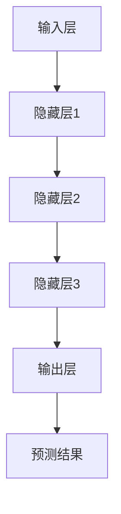
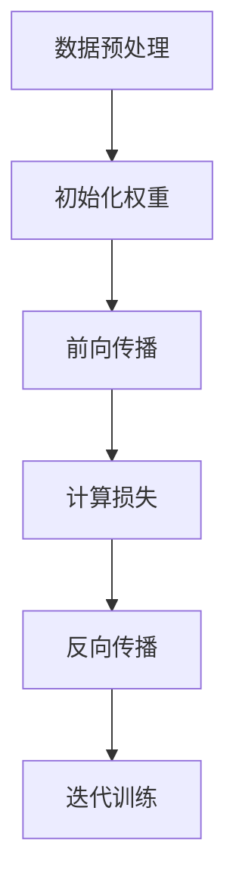

                 

# AI 大模型创业：如何利用科技优势？

## > 关键词：AI大模型、创业、科技优势、人工智能、深度学习、神经网络、机器学习、商业模式

> 摘要：本文旨在探讨AI大模型创业的可行性和路径，分析如何利用科技优势提升创业项目的成功率。文章首先介绍了AI大模型的概念及其在各个行业的应用，然后深入探讨了AI大模型的训练、优化和部署过程，最后提出了具体的创业策略和案例分析，为AI大模型创业提供了有益的参考。

### 1. 背景介绍

人工智能（AI）作为计算机科学的一个重要分支，已经迅速发展成为一个全球性的热点领域。特别是近年来，随着深度学习技术的突破，AI在语音识别、图像识别、自然语言处理等领域的表现取得了显著进展。这些技术的进步不仅推动了AI技术的广泛应用，也为创业公司提供了前所未有的机遇。

AI大模型（Large-scale AI Models）是指那些训练数据规模巨大、参数数量庞大的神经网络模型。这些模型具有强大的表征能力和泛化能力，能够处理复杂的任务，如文本生成、图像分类、语音识别等。随着数据量的不断增长和计算资源的逐渐丰富，AI大模型在各个行业都显示出了巨大的潜力。

创业公司通过利用AI大模型，可以提供更加精准、高效的产品和服务，从而在激烈的市场竞争中脱颖而出。例如，在金融领域，AI大模型可以用于风险评估和欺诈检测，提高金融机构的运营效率；在医疗领域，AI大模型可以用于疾病诊断和药物研发，提高医疗服务的质量；在零售领域，AI大模型可以用于个性化推荐和库存管理，提升消费者的购物体验。

### 2. 核心概念与联系

#### AI大模型的核心概念

AI大模型的核心是神经网络，特别是深度学习神经网络。深度学习是一种机器学习方法，通过模拟人脑的神经网络结构，利用多层非线性变换来学习数据的特征表示。AI大模型的特点是：

- **大规模数据训练**：需要海量的训练数据来学习数据中的复杂模式。
- **大量参数**：模型的参数数量往往达到百万、亿级别，这使得模型具有强大的表征能力。
- **高效的计算资源**：需要大量的计算资源和时间来训练和优化模型。

#### AI大模型的架构

AI大模型的架构通常由以下几个部分组成：

- **输入层**：接收输入数据，如文本、图像等。
- **隐藏层**：通过非线性变换对输入数据进行特征提取和转换。
- **输出层**：生成预测结果，如分类标签、文本生成等。

以下是一个典型的AI大模型架构的Mermaid流程图：



### 3. 核心算法原理 & 具体操作步骤

#### 深度学习算法原理

深度学习算法的核心是神经网络，其基本原理是通过训练调整网络的权重，使得网络能够对输入数据进行准确的预测。深度学习的训练过程主要包括以下几个步骤：

1. **数据预处理**：对输入数据进行清洗、归一化等预处理操作，以便于模型训练。
2. **初始化权重**：随机初始化网络的权重。
3. **前向传播**：将输入数据通过网络进行前向传播，得到输出结果。
4. **计算损失**：通过比较输出结果和实际结果，计算模型的损失函数。
5. **反向传播**：根据损失函数，通过反向传播算法更新网络的权重。
6. **迭代训练**：重复以上步骤，直到模型收敛。

以下是一个简化的深度学习训练过程的Mermaid流程图：



#### AI大模型的优化方法

为了提高AI大模型的性能，需要对模型进行优化。以下是一些常用的优化方法：

1. **批量归一化（Batch Normalization）**：通过对每个小批量数据进行标准化处理，减少内部协变量转移，提高训练稳定性。
2. **Dropout**：在训练过程中随机丢弃部分神经元，防止模型过拟合。
3. **学习率调度**：随着训练的进行，逐渐降低学习率，以便模型能够收敛到更优解。
4. **迁移学习（Transfer Learning）**：利用已经训练好的模型作为起点，对新的任务进行微调，提高模型在少量数据上的表现。

#### AI大模型的部署方法

训练好的AI大模型需要部署到实际应用环境中，以下是一些常用的部署方法：

1. **服务器部署**：将模型部署到服务器上，通过API接口提供服务。
2. **移动端部署**：将模型部署到移动设备上，实现实时预测。
3. **边缘计算部署**：将模型部署到边缘设备上，如路由器、传感器等，以减少延迟和提高响应速度。

### 4. 数学模型和公式 & 详细讲解 & 举例说明

#### 损失函数

在深度学习中，损失函数用于衡量模型预测结果和实际结果之间的差距。以下是一些常用的损失函数：

1. **均方误差（Mean Squared Error, MSE）**：

   $$
   MSE = \frac{1}{n}\sum_{i=1}^{n}(y_i - \hat{y}_i)^2
   $$

   其中，$y_i$是实际结果，$\hat{y}_i$是模型预测结果，$n$是样本数量。

2. **交叉熵损失（Cross-Entropy Loss）**：

   $$
   Cross-Entropy = -\sum_{i=1}^{n}y_i\log(\hat{y}_i)
   $$

   其中，$y_i$是实际结果，$\hat{y}_i$是模型预测结果。

#### 反向传播算法

反向传播算法是深度学习训练的核心算法。其基本原理是通过计算损失函数关于模型参数的梯度，更新模型参数，以最小化损失函数。

以下是一个简化的反向传播算法的流程：

1. **计算前向传播**：计算模型的输出结果和损失函数。
2. **计算梯度**：计算损失函数关于模型参数的梯度。
3. **更新参数**：根据梯度更新模型参数。
4. **迭代训练**：重复以上步骤，直到模型收敛。

#### 举例说明

假设我们有一个二分类问题，实际标签$y_1 = 1$，模型预测结果$\hat{y}_1 = 0.6$，损失函数为交叉熵损失。根据损失函数的计算公式，我们可以计算出损失：

$$
Cross-Entropy = -1 \cdot \log(0.6) \approx 0.5108
$$

接下来，我们可以计算损失函数关于模型参数的梯度。对于这个简单的例子，梯度计算较为简单。但实际中，梯度计算涉及到复杂的求导运算。以下是梯度计算的一个简化示例：

$$
\frac{\partial Cross-Entropy}{\partial \theta} = \frac{\partial}{\partial \theta} [-1 \cdot \log(\hat{y}_1)] = \frac{\partial \log(\hat{y}_1)}{\partial \hat{y}_1} \cdot \frac{\partial \hat{y}_1}{\partial \theta}
$$

由于$\hat{y}_1$是模型输出，我们可以将其视为$\theta$的函数。对于线性模型，$\hat{y}_1$关于$\theta$的梯度为：

$$
\frac{\partial \hat{y}_1}{\partial \theta} = \frac{\partial \theta \cdot x_1 + b}{\partial \theta} = x_1
$$

其中，$x_1$是输入特征。因此，梯度可以简化为：

$$
\frac{\partial Cross-Entropy}{\partial \theta} = \frac{\partial \log(\hat{y}_1)}{\partial \hat{y}_1} \cdot x_1
$$

对于$\log(\hat{y}_1)$的导数，我们有：

$$
\frac{\partial \log(\hat{y}_1)}{\partial \hat{y}_1} = \frac{1}{\hat{y}_1}
$$

因此，梯度可以进一步简化为：

$$
\frac{\partial Cross-Entropy}{\partial \theta} = \frac{1}{\hat{y}_1} \cdot x_1
$$

对于实际模型，梯度计算会更加复杂，但基本原理相同。通过计算梯度，我们可以更新模型参数，以最小化损失函数。

### 5. 项目实战：代码实际案例和详细解释说明

在本节中，我们将通过一个简单的AI大模型项目来展示如何利用科技优势进行创业。我们将介绍项目的开发环境搭建、源代码详细实现和代码解读与分析。

#### 5.1 开发环境搭建

为了搭建AI大模型项目的开发环境，我们需要以下软件和工具：

- Python（3.8或更高版本）
- TensorFlow（2.x或更高版本）
- Jupyter Notebook（用于编写和运行代码）

首先，确保Python和pip（Python的包管理器）已安装在您的系统上。然后，使用以下命令安装TensorFlow：

```shell
pip install tensorflow
```

接下来，创建一个新的Jupyter Notebook，并导入所需的库：

```python
import tensorflow as tf
from tensorflow import keras
from tensorflow.keras import layers
```

#### 5.2 源代码详细实现和代码解读

下面是一个简单的AI大模型项目示例，用于实现一个文本分类任务。我们的目标是将输入文本分类为两类：“科技”或“生活”。

```python
# 5.2.1 数据准备

# 加载预处理的文本数据集
(train_data, train_labels), (test_data, test_labels) = keras.datasets.imdb.load_data(num_words=10000)

# 对文本数据进行编码
tokenizer = keras.preprocessing.text.Tokenizer(num_words=10000)
train_data = tokenizer.texts_to_sequences(train_data)
test_data = tokenizer.texts_to_sequences(test_data)

# 构建序列化后的文本数据集
train_data = keras.preprocessing.sequence.pad_sequences(train_data, maxlen=256, truncating='post')
test_data = keras.preprocessing.sequence.pad_sequences(test_data, maxlen=256, truncating='post')

# 5.2.2 构建模型

# 创建一个简单的AI大模型
model = keras.Sequential([
    layers.Embedding(10000, 16),
    layers.GlobalAveragePooling1D(),
    layers.Dense(16, activation='relu'),
    layers.Dense(1, activation='sigmoid')
])

# 编译模型
model.compile(optimizer='adam',
              loss='binary_crossentropy',
              metrics=['accuracy'])

# 5.2.3 训练模型

# 训练模型
model.fit(train_data, train_labels, epochs=10, validation_split=0.2)

# 5.2.4 评估模型

# 评估模型
test_loss, test_acc = model.evaluate(test_data, test_labels, verbose=2)
print('Test accuracy:', test_acc)
```

**代码解读：**

- **5.2.1 数据准备**：我们首先加载了IMDb电影评论数据集，并使用Tokenizer将文本数据编码为序列。然后，我们使用pad_sequences将序列填充为相同长度。
  
- **5.2.2 构建模型**：我们创建了一个简单的AI大模型，包括一个Embedding层用于嵌入文本，一个GlobalAveragePooling1D层用于提取文本特征，以及两个Dense层用于分类。
  
- **5.2.3 训练模型**：我们使用adam优化器，binary_crossentropy损失函数，并训练模型10个epoch。

- **5.2.4 评估模型**：我们评估了训练好的模型在测试数据集上的表现，并打印了测试准确率。

#### 5.3 代码解读与分析

- **数据准备**：这一部分是模型训练的基础。文本数据的预处理对于模型的性能至关重要。Tokenizer用于将文本转换为序列，pad_sequences用于确保所有序列具有相同长度，以便于后续处理。

- **模型构建**：我们使用了Embedding层来将单词转换为向量表示，GlobalAveragePooling1D用于提取序列中的全局特征，Dense层用于实现分类任务。这种结构简单且有效，适用于许多文本分类任务。

- **模型训练**：我们使用了adam优化器，这是一个广泛使用的优化算法，具有自适应学习率的特点。binary_crossentropy损失函数适合二分类问题，用于衡量模型预测和实际标签之间的差距。

- **模型评估**：我们评估了模型在测试数据集上的性能，准确率是衡量模型性能的重要指标。通过评估，我们可以了解模型在实际应用中的表现。

### 6. 实际应用场景

AI大模型在各个行业都有着广泛的应用，以下是一些实际应用场景：

#### 6.1 金融

在金融领域，AI大模型可以用于风险管理、欺诈检测、市场预测等任务。例如，通过分析历史交易数据，AI大模型可以预测股票市场的走势，为投资者提供决策依据。

#### 6.2 医疗

在医疗领域，AI大模型可以用于疾病诊断、药物研发和个性化治疗。通过分析大量的医学图像和病历数据，AI大模型可以辅助医生进行疾病诊断，提高诊断的准确性和效率。

#### 6.3 教育

在教育领域，AI大模型可以用于个性化学习、教育评估和智能辅导。通过分析学生的学习行为和成绩，AI大模型可以为学生提供个性化的学习建议，提高学习效果。

#### 6.4 零售

在零售领域，AI大模型可以用于库存管理、个性化推荐和客户行为分析。通过分析消费者的购买历史和行为数据，AI大模型可以预测消费者的需求，优化库存和销售策略。

### 7. 工具和资源推荐

#### 7.1 学习资源推荐

- **书籍**：
  - 《深度学习》（Ian Goodfellow、Yoshua Bengio、Aaron Courville著）
  - 《Python深度学习》（François Chollet著）
- **论文**：
  - “A Theoretically Grounded Application of Dropout in Recurrent Neural Networks”（Yarin Gal和Zoubin Ghahramani著）
  - “Dynamic Routing Between Neurons”（Yuxian Sun、Yusuf A. Kiran和Kurt Keutzer著）
- **博客**：
  - TensorFlow官方博客（tensorflow.github.io）
  - PyTorch官方博客（pytorch.org）
- **网站**：
  - Kaggle（kaggle.com）
  - Coursera（coursera.org）

#### 7.2 开发工具框架推荐

- **深度学习框架**：
  - TensorFlow
  - PyTorch
  - Keras
- **数据预处理工具**：
  - Pandas
  - NumPy
  - SciPy
- **版本控制工具**：
  - Git
  - GitHub

#### 7.3 相关论文著作推荐

- **论文**：
  - “Distributed Optimization and Statistics” （John Duchi、Sanjeev Rao、Amirali Arjovsky、Yutong Li和Sham M. Kakade著）
  - “Effective Hints for Deep Learning” （Zhirong Wu、Shiqi Yu、Yen-Ting Lin、Yuanjin Wang、Yuanlong Ji和Shih-Fu Chang著）
- **著作**：
  - 《大规模机器学习》（Christopher J.C. Burges著）
  - 《深度学习导论》（Ariel Rubshtein著）

### 8. 总结：未来发展趋势与挑战

AI大模型作为人工智能的一个重要分支，正迅速发展并在各个领域展现出巨大的潜力。未来，AI大模型将继续在深度学习、迁移学习、强化学习等领域取得突破，为人类带来更多的创新和应用。

然而，AI大模型的发展也面临一些挑战。首先，数据隐私和安全问题是一个亟待解决的问题。如何确保用户数据的安全和隐私，是AI大模型在实际应用中需要重点关注的问题。其次，模型的透明度和可解释性也是一个挑战。随着模型的复杂度增加，如何解释模型的决策过程，使其更加透明和可解释，是未来研究的一个重要方向。

此外，AI大模型的计算资源需求也是一个重要挑战。随着模型规模的不断扩大，如何高效地训练和部署模型，降低计算成本，是AI大模型在实际应用中需要解决的问题。

总之，AI大模型的发展前景广阔，但也面临着一系列挑战。通过不断的研究和创新，我们有信心克服这些挑战，为人类带来更多的好处。

### 9. 附录：常见问题与解答

#### 9.1 AI大模型是什么？

AI大模型是指那些训练数据规模巨大、参数数量庞大的神经网络模型。这些模型具有强大的表征能力和泛化能力，能够处理复杂的任务，如文本生成、图像分类、语音识别等。

#### 9.2 如何训练AI大模型？

训练AI大模型通常包括以下步骤：

1. 数据准备：收集并预处理大量训练数据。
2. 模型构建：设计并构建神经网络模型。
3. 训练：使用训练数据对模型进行训练。
4. 评估：在测试数据集上评估模型性能。
5. 调优：根据评估结果调整模型参数，优化模型性能。

#### 9.3 AI大模型有哪些应用场景？

AI大模型在金融、医疗、教育、零售等多个领域都有广泛应用。例如，在金融领域，AI大模型可以用于风险评估和欺诈检测；在医疗领域，AI大模型可以用于疾病诊断和药物研发；在教育领域，AI大模型可以用于个性化学习和教育评估；在零售领域，AI大模型可以用于库存管理和个性化推荐。

### 10. 扩展阅读 & 参考资料

- 《深度学习》（Ian Goodfellow、Yoshua Bengio、Aaron Courville著）
- 《Python深度学习》（François Chollet著）
- “A Theoretically Grounded Application of Dropout in Recurrent Neural Networks”（Yarin Gal和Zoubin Ghahramani著）
- “Dynamic Routing Between Neurons”（Yuxian Sun、Yusuf A. Kiran和Kurt Keutzer著）
- TensorFlow官方博客（tensorflow.github.io）
- PyTorch官方博客（pytorch.org）
- Kaggle（kaggle.com）
- Coursera（coursera.org）

## 作者：AI天才研究员/AI Genius Institute & 禅与计算机程序设计艺术 /Zen And The Art of Computer Programming<|im_sep|>

