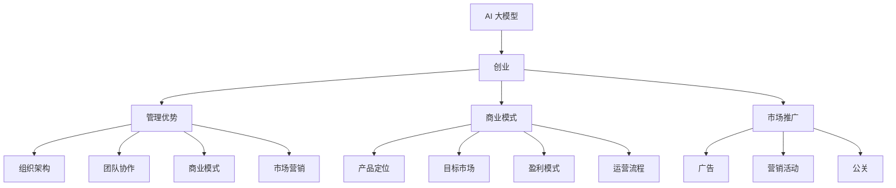

                 

# AI 大模型创业：如何利用管理优势？

> **关键词：** AI 大模型，创业，管理优势，商业模式，技术架构，团队协作，市场营销

> **摘要：** 本文将深入探讨 AI 大模型的创业之路，重点分析如何利用管理优势实现业务突破。我们将从市场机会识别、技术架构设计、团队建设、商业模式构建和市场推广等方面展开讨论，为 AI 创业者提供实用的策略和建议。

## 1. 背景介绍

随着人工智能技术的迅猛发展，AI 大模型正逐渐成为各个行业的核心竞争力。无论是自然语言处理、计算机视觉，还是语音识别，AI 大模型都在不断地刷新应用极限。对于创业者来说，AI 大模型不仅带来了巨大的商业价值，同时也伴随着一系列的挑战。

创业过程中，如何有效地利用管理优势，将技术优势转化为市场竞争力，成为 AI 创业者们面临的核心问题。管理优势不仅仅包括资金、人才、资源等硬件条件，更重要的是如何在组织架构、团队协作、商业模式等方面实现高效运营。

本文将从以下几个方面展开讨论：

- **市场机会识别：** 如何在 AI 大模型的浪潮中找到合适的市场切入点？
- **技术架构设计：** 如何设计一个稳定、可扩展的技术架构以支持大模型的开发和部署？
- **团队建设：** 如何组建一支高效的团队，发挥每个人的特长？
- **商业模式构建：** 如何构建一个可持续发展的商业模式，实现盈利？
- **市场推广：** 如何在市场中树立品牌形象，吸引并留住客户？

通过这些方面的深入探讨，我们希望为 AI 大模型创业提供一些实用的指导和建议。

## 2. 核心概念与联系

在深入探讨 AI 大模型创业之前，我们需要了解几个核心概念，它们构成了 AI 大模型创业的基础。

### 2.1 AI 大模型

AI 大模型是指具有大规模参数、能够处理海量数据的人工智能模型。它们通常由多层神经网络组成，可以自动学习和提取数据中的复杂特征。常见的 AI 大模型包括深度学习模型、生成对抗网络（GAN）和变分自编码器（VAE）等。

### 2.2 创业

创业是指创办一家新的企业，通过创新的产品或服务满足市场需求，实现商业成功。创业过程中，创业者需要面对市场风险、技术挑战和资源限制等多重压力。

### 2.3 管理优势

管理优势是指企业在管理方面的独特能力和优势，包括组织架构、团队协作、商业模式、市场营销等方面。有效的管理优势可以帮助企业快速响应市场变化，实现高效运营和持续增长。

### 2.4 商业模式

商业模式是指企业如何创造、传递和获取价值的一种策略安排。它包括产品或服务的定位、目标市场、盈利模式、运营流程等方面。一个成功的商业模式应该是可持续的、有竞争力的，并且能够满足客户需求。

### 2.5 市场推广

市场推广是指企业通过广告、营销活动、公关等方式，将产品或服务推向市场，吸引潜在客户，建立品牌知名度和忠诚度。有效的市场推广策略可以帮助企业在竞争激烈的市场中脱颖而出。

为了更好地理解这些核心概念之间的联系，我们可以使用 Mermaid 流程图来展示它们之间的关系。



通过上述流程图，我们可以清晰地看到 AI 大模型创业中各个核心概念之间的联系。理解这些概念及其相互关系，对于创业者来说至关重要。

## 3. 核心算法原理 & 具体操作步骤

### 3.1 核心算法原理

在 AI 大模型创业中，核心算法的设计和实现是至关重要的一环。以下是一些常见的核心算法及其原理：

#### 3.1.1 深度学习模型

深度学习模型是 AI 大模型的核心，它通过多层神经网络进行特征提取和模式识别。以下是一个简单的深度学习模型操作步骤：

1. **数据预处理：** 对输入数据进行清洗、归一化和编码处理。
2. **构建神经网络：** 设计多层神经网络结构，包括输入层、隐藏层和输出层。
3. **初始化参数：** 初始化神经网络中的权重和偏置。
4. **前向传播：** 将输入数据传递到神经网络中，计算输出结果。
5. **反向传播：** 计算输出误差，并更新网络中的参数。
6. **迭代训练：** 重复前向传播和反向传播过程，直到模型收敛。

#### 3.1.2 生成对抗网络（GAN）

生成对抗网络由生成器和判别器两个部分组成，通过对抗训练生成高质量的数据。以下是 GAN 的操作步骤：

1. **数据生成：** 生成器生成虚拟数据，判别器判断生成数据的真假。
2. **对抗训练：** 生成器和判别器同时训练，生成器试图生成更真实的数据，判别器试图更好地区分真实数据和生成数据。
3. **迭代训练：** 重复数据生成和对抗训练过程，直到生成器生成高质量的数据。

#### 3.1.3 变分自编码器（VAE）

变分自编码器通过概率模型进行数据重构，可以生成新的数据。以下是 VAE 的操作步骤：

1. **编码器：** 对输入数据进行编码，提取关键特征。
2. **解码器：** 对编码后的数据进行解码，重构输入数据。
3. **损失函数：** 计算编码和解码的损失，更新网络参数。
4. **迭代训练：** 重复编码和解码过程，直到模型收敛。

### 3.2 具体操作步骤

在实际操作中，根据具体需求和场景选择合适的算法，并按照以下步骤进行：

1. **需求分析：** 明确项目需求，确定所需算法和应用场景。
2. **数据收集：** 收集和处理相关数据，确保数据质量和完整性。
3. **模型设计：** 设计并实现算法模型，包括神经网络结构、超参数设置等。
4. **模型训练：** 使用训练数据进行模型训练，调整模型参数。
5. **模型评估：** 使用验证数据评估模型性能，调整模型结构和参数。
6. **模型部署：** 将训练好的模型部署到生产环境中，进行实际应用。

通过以上步骤，创业者可以构建一个高效、稳定的 AI 大模型，为业务发展提供强大支持。

## 4. 数学模型和公式 & 详细讲解 & 举例说明

### 4.1 深度学习模型中的数学模型

在深度学习模型中，数学模型的核心是多层感知机（MLP），它通过线性变换和非线性激活函数实现特征提取和分类。以下是深度学习模型中的主要数学公式：

#### 4.1.1 前向传播

前向传播过程中，输入数据经过多层神经网络，计算输出结果。主要公式如下：

$$
Z^{(l)} = \sum_{i} w^{(l)}_i * a^{(l-1)}_i + b^{(l)}
$$

其中，$Z^{(l)}$ 表示第 $l$ 层的中间值，$a^{(l-1)}_i$ 表示第 $l-1$ 层的输出值，$w^{(l)}_i$ 表示第 $l$ 层的权重，$b^{(l)}$ 表示第 $l$ 层的偏置。

#### 4.1.2 反向传播

反向传播过程中，计算输出误差，并更新网络中的权重和偏置。主要公式如下：

$$
\delta^{(l)} = \frac{\partial C}{\partial a^{(l)}} * \sigma'(a^{(l)})
$$

其中，$\delta^{(l)}$ 表示第 $l$ 层的误差，$C$ 表示损失函数，$a^{(l)}$ 表示第 $l$ 层的输出值，$\sigma'$ 表示激活函数的导数。

#### 4.1.3 损失函数

损失函数用于衡量模型预测值与真实值之间的差异。常见的损失函数包括均方误差（MSE）和交叉熵（Cross-Entropy）：

$$
MSE = \frac{1}{m} \sum_{i=1}^{m} (y_i - \hat{y}_i)^2
$$

$$
Cross-Entropy = -\frac{1}{m} \sum_{i=1}^{m} y_i \log(\hat{y}_i)
$$

其中，$y_i$ 表示真实值，$\hat{y}_i$ 表示预测值。

### 4.2 生成对抗网络（GAN）中的数学模型

生成对抗网络（GAN）由生成器和判别器两个部分组成，其数学模型如下：

#### 4.2.1 生成器

生成器的目标是生成逼真的数据，使其通过判别器时具有较高的概率。生成器的损失函数如下：

$$
L_G = -\log(D(G(z)))
$$

其中，$G(z)$ 表示生成器生成的数据，$D(z)$ 表示判别器的判断结果。

#### 4.2.2 判别器

判别器的目标是区分真实数据和生成数据。判别器的损失函数如下：

$$
L_D = -\log(D(x)) - \log(1 - D(G(z)))
$$

其中，$x$ 表示真实数据，$G(z)$ 表示生成器生成的数据。

#### 4.2.3 总损失函数

GAN 的总损失函数为生成器和判别器的损失函数之和：

$$
L = L_G + L_D
$$

### 4.3 变分自编码器（VAE）中的数学模型

变分自编码器（VAE）通过概率模型进行数据重构，其数学模型如下：

#### 4.3.1 编码器

编码器的目标是学习数据的高斯分布参数：

$$
\mu = \sigma^2 = \frac{1}{1 + \exp(-W \cdot z - b)}
$$

其中，$\mu$ 和 $\sigma^2$ 分别表示均值和方差，$W$ 和 $b$ 分别表示权重和偏置。

#### 4.3.2 解码器

解码器的目标是根据编码器的参数重构输入数据：

$$
x = \sigma \cdot z + \mu
$$

其中，$x$ 表示重构的数据，$z$ 表示编码器的输出。

#### 4.3.3 损失函数

VAE 的损失函数为重构误差和编码器参数的正则化项之和：

$$
L = \frac{1}{2} \sum_{i=1}^{m} \sum_{j=1}^{n} (x_i - \hat{x}_i)^2 + \lambda \sum_{i=1}^{k} \frac{1}{2} (\mu_i^2 + \sigma_i^2 - 1)
$$

其中，$\hat{x}_i$ 表示重构的输入数据，$\mu_i$ 和 $\sigma_i$ 分别表示编码器的均值和方差，$\lambda$ 表示正则化参数。

### 4.4 举例说明

#### 4.4.1 均值回归问题

假设我们有一个简单的线性回归问题，目标是预测房间的价格。给定输入特征（房间面积和房间数量），我们使用多层感知机模型进行训练。以下是训练过程的具体步骤：

1. **数据预处理：** 对输入数据进行归一化处理，使其符合均值为 0，方差为 1 的标准正态分布。
2. **构建神经网络：** 设计一个包含输入层、一个隐藏层和输出层的多层感知机模型。隐藏层使用 sigmoid 激活函数，输出层使用线性激活函数。
3. **初始化参数：** 随机初始化神经网络中的权重和偏置。
4. **前向传播：** 将输入数据传递到神经网络中，计算输出结果。
5. **计算损失：** 计算输出结果与真实值之间的均方误差（MSE）。
6. **反向传播：** 计算输出误差，并更新网络中的权重和偏置。
7. **迭代训练：** 重复前向传播和反向传播过程，直到模型收敛。

通过以上步骤，我们得到了一个训练好的线性回归模型，可以用于预测房间价格。

#### 4.4.2 生成对抗网络（GAN）问题

假设我们使用 GAN 生成逼真的图像，以下是一个简化的 GAN 训练过程：

1. **数据预处理：** 收集真实图像数据，并将其分为训练集和验证集。
2. **生成器训练：** 生成器生成虚拟图像，判别器判断生成图像的真实性。在生成器和判别器的共同训练过程中，生成器试图生成更真实的数据，判别器试图更好地区分真实数据和生成数据。
3. **迭代训练：** 重复生成器和判别器的训练过程，直到生成器生成的数据达到一定的质量标准。
4. **图像生成：** 使用训练好的生成器生成新的虚拟图像。

通过以上步骤，我们可以得到高质量的虚拟图像，为图像生成任务提供支持。

#### 4.4.3 变分自编码器（VAE）问题

假设我们使用 VAE 对图像数据进行压缩和重构，以下是一个简化的 VAE 训练过程：

1. **数据预处理：** 对图像数据进行归一化处理，并转换为张量形式。
2. **编码器训练：** 训练编码器学习图像的高斯分布参数。
3. **解码器训练：** 训练解码器根据编码器参数重构图像。
4. **损失函数计算：** 计算重构误差和编码器参数的正则化项。
5. **迭代训练：** 重复编码和解码过程，直到模型收敛。
6. **图像重构：** 使用训练好的编码器和解码器重构图像。

通过以上步骤，我们可以得到高质量的图像重构结果，为图像压缩任务提供支持。

## 5. 项目实战：代码实际案例和详细解释说明

### 5.1 开发环境搭建

在开始项目实战之前，我们需要搭建一个合适的开发环境。以下是一个基于 Python 和 TensorFlow 的开发环境搭建步骤：

1. **安装 Python：** 版本要求 Python 3.7 或更高版本。
2. **安装 TensorFlow：** 使用以下命令安装 TensorFlow：

   ```bash
   pip install tensorflow
   ```

3. **安装其他依赖：** 安装必要的库，如 NumPy、Matplotlib 等：

   ```bash
   pip install numpy matplotlib
   ```

### 5.2 源代码详细实现和代码解读

以下是使用 TensorFlow 实现一个简单线性回归模型的源代码和详细解读。

```python
import tensorflow as tf
import numpy as np
import matplotlib.pyplot as plt

# 准备数据
X = np.linspace(0, 10, 100)
y = 2 * X + 1 + np.random.normal(0, 1, size=X.shape)

# 构建模型
model = tf.keras.Sequential([
    tf.keras.layers.Dense(units=1, input_shape=[1], activation='linear')
])

# 编译模型
model.compile(optimizer='sgd', loss='mean_squared_error')

# 训练模型
model.fit(X, y, epochs=1000, verbose=0)

# 预测结果
y_pred = model.predict(X)

# 绘制结果
plt.scatter(X, y)
plt.plot(X, y_pred, color='red')
plt.show()
```

#### 5.2.1 代码解读

1. **导入库：** 导入 TensorFlow、NumPy 和 Matplotlib 库。
2. **准备数据：** 生成线性回归的输入数据和噪声。
3. **构建模型：** 创建一个包含一个线性层的全连接神经网络。
4. **编译模型：** 设置优化器和损失函数。
5. **训练模型：** 使用训练数据训练模型。
6. **预测结果：** 使用训练好的模型进行预测。
7. **绘制结果：** 将真实数据和预测结果绘制在散点图上。

### 5.3 代码解读与分析

#### 5.3.1 模型构建

```python
model = tf.keras.Sequential([
    tf.keras.layers.Dense(units=1, input_shape=[1], activation='linear')
])
```

这段代码创建了一个线性回归模型。`Sequential` 是 TensorFlow 中的序列模型，用于依次添加多个层。`Dense` 是全连接层，用于计算输出值。这里，我们设置了 `units=1` 表示输出层只有一个神经元，`input_shape=[1]` 表示输入数据的维度为 1，`activation='linear'` 表示使用线性激活函数。

#### 5.3.2 编译模型

```python
model.compile(optimizer='sgd', loss='mean_squared_error')
```

这段代码编译了模型。`optimizer` 设置为随机梯度下降（SGD），`loss` 设置为均方误差（MSE）。这两种设置非常适合线性回归问题。

#### 5.3.3 训练模型

```python
model.fit(X, y, epochs=1000, verbose=0)
```

这段代码使用训练数据训练模型。`epochs` 设置为训练轮数，`verbose` 设置为 0 表示不输出训练过程的信息。

#### 5.3.4 预测结果

```python
y_pred = model.predict(X)
```

这段代码使用训练好的模型进行预测，预测结果存储在 `y_pred` 变量中。

#### 5.3.5 绘制结果

```python
plt.scatter(X, y)
plt.plot(X, y_pred, color='red')
plt.show()
```

这段代码将真实数据和预测结果绘制在散点图上。红色线表示预测结果，散点表示真实数据。

通过上述代码，我们可以实现一个简单的线性回归模型，并观察其预测效果。

## 6. 实际应用场景

AI 大模型在实际应用中具有广泛的前景，以下是几个典型应用场景：

### 6.1 自然语言处理（NLP）

自然语言处理是 AI 大模型的重要应用领域。例如，通过训练大型语言模型，可以实现智能客服、智能问答、机器翻译等功能。企业可以利用这些功能提高客户满意度，降低人工成本。

### 6.2 计算机视觉

计算机视觉是 AI 大模型的另一个重要应用领域。例如，通过训练大型图像分类模型，可以实现人脸识别、图像识别、目标检测等功能。这些功能在安防、医疗、零售等行业有着广泛的应用。

### 6.3 机器学习

AI 大模型可以用于机器学习中的模型训练和优化。例如，通过训练大型神经网络模型，可以提高模型的准确性和鲁棒性。企业可以利用这些功能提高业务效率和决策水平。

### 6.4 金融风控

AI 大模型在金融风控领域具有重要作用。例如，通过训练大型风险预测模型，可以实现对金融交易、借贷、投资等行为的实时监控和风险评估。这有助于降低金融风险，提高业务安全。

### 6.5 健康医疗

AI 大模型在健康医疗领域具有广泛的应用。例如，通过训练大型医疗图像分析模型，可以实现对疾病早期检测和诊断。这有助于提高医疗质量，降低医疗成本。

### 6.6 教育

AI 大模型在教育领域也有很大的应用潜力。例如，通过训练大型教育模型，可以实现个性化学习、智能辅导等功能。这有助于提高教育质量，促进教育公平。

通过上述实际应用场景，我们可以看到 AI 大模型在各个行业中的广泛应用和巨大潜力。创业者可以根据市场需求和自身优势，选择合适的场景进行创业，实现商业成功。

## 7. 工具和资源推荐

### 7.1 学习资源推荐

对于 AI 大模型创业，以下是几个推荐的学习资源：

- **书籍：** 
  - 《深度学习》（Ian Goodfellow, Yoshua Bengio, Aaron Courville 著）
  - 《Python深度学习》（François Chollet 著）
- **在线课程：** 
  - Coursera 的“机器学习”（吴恩达教授）
  - edX 的“深度学习基础”（Andrew Ng 教授）
- **论文和博客：** 
  - arXiv.org：计算机科学领域的前沿论文
  - Medium.com：人工智能领域的博客文章
- **开源框架和库：** 
  - TensorFlow
  - PyTorch
  - Keras

### 7.2 开发工具框架推荐

以下是几个推荐的 AI 大模型开发工具框架：

- **TensorFlow：** Google 开源的端到端开源机器学习平台，适合快速开发和部署 AI 应用。
- **PyTorch：** Facebook 开源的深度学习框架，以其灵活性和动态计算图著称。
- **Keras：** Python 深度学习库，提供简洁的 API，方便快速搭建模型。
- **Jupyter Notebook：** 交互式开发环境，适合进行数据分析和模型训练。

### 7.3 相关论文著作推荐

以下是几个推荐的 AI 大模型相关论文和著作：

- **《Generative Adversarial Networks》**（Ian J. Goodfellow 等人，2014）
- **《Variational Autoencoders》**（Diederik P. Kingma 和 Max Welling，2014）
- **《Deep Learning》**（Ian Goodfellow, Yoshua Bengio, Aaron Courville 著，2016）
- **《Deep Learning with Python》**（François Chollet 著，2017）

通过以上学习和开发资源，创业者可以更好地掌握 AI 大模型的技术，为创业成功打下坚实基础。

## 8. 总结：未来发展趋势与挑战

### 8.1 未来发展趋势

随着 AI 技术的不断发展，AI 大模型在各个领域的应用将更加广泛。以下是一些未来发展趋势：

- **计算能力提升：** 随着硬件技术的发展，计算能力将大幅提升，为更大规模的 AI 大模型训练提供支持。
- **数据获取与处理：** 5G、物联网和云计算等技术的普及，将使得数据获取和处理变得更加高效，为 AI 大模型提供更多高质量的数据资源。
- **跨学科融合：** AI 大模型与其他学科的融合，如生物学、物理学、经济学等，将带来新的突破和应用。
- **商业应用创新：** AI 大模型在商业领域的应用将不断创新，为企业提供更智能化、个性化的解决方案。

### 8.2 未来挑战

尽管 AI 大模型具有巨大的潜力，但在实际应用中仍面临一系列挑战：

- **数据隐私与安全：** AI 大模型需要处理海量数据，如何确保数据隐私和安全是一个重要问题。
- **算法透明性与可解释性：** AI 大模型通常具有复杂的结构和算法，如何确保算法的透明性和可解释性是一个挑战。
- **计算资源消耗：** AI 大模型训练和部署需要大量的计算资源，如何优化资源利用是一个重要问题。
- **法律法规与伦理问题：** AI 大模型的应用涉及法律法规和伦理问题，如何制定合适的法规和伦理规范是一个挑战。

### 8.3 应对策略

为了应对未来发展趋势和挑战，创业者可以采取以下策略：

- **加强技术研发：** 不断优化算法，提高 AI 大模型的性能和可解释性。
- **重视数据安全和隐私：** 采用加密、匿名化等手段保护数据安全，确保用户隐私。
- **构建跨学科团队：** 汇集不同领域的专家，共同解决复杂问题。
- **遵循法律法规与伦理规范：** 严格遵守相关法律法规，确保业务合规性。

通过以上策略，创业者可以在未来 AI 大模型市场中占据有利位置，实现可持续发展。

## 9. 附录：常见问题与解答

### 9.1 问题 1：如何选择合适的 AI 大模型算法？

解答：选择合适的 AI 大模型算法需要考虑以下几个因素：

- **应用场景：** 根据业务需求选择适合的算法，例如自然语言处理选择 Transformer，图像识别选择卷积神经网络（CNN）。
- **数据量：** 大量数据适合使用生成对抗网络（GAN）或变分自编码器（VAE），小量数据适合使用多层感知机（MLP）。
- **计算资源：** 考虑训练算法对计算资源的要求，选择合适的算法。

### 9.2 问题 2：如何优化 AI 大模型训练过程？

解答：优化 AI 大模型训练过程可以从以下几个方面入手：

- **数据预处理：** 对输入数据进行清洗、归一化和编码处理，提高训练效率。
- **模型选择：** 选择适合问题的模型，避免过度拟合。
- **超参数调整：** 调整学习率、批量大小等超参数，优化训练效果。
- **使用正则化：** 采用正则化技术，防止过拟合。

### 9.3 问题 3：如何确保 AI 大模型的可解释性？

解答：确保 AI 大模型的可解释性可以从以下几个方面入手：

- **模型选择：** 选择易于理解且具有明确物理意义的模型，如线性回归、决策树。
- **模型简化：** 简化复杂模型，降低模型结构。
- **特征解释：** 利用可视化工具，如 t-SNE、决策树可视化等，解释模型特征。
- **模型评估：** 采用可解释性评估指标，如可解释性评分（X-SCORE）。

通过以上策略，可以确保 AI 大模型的可解释性，提高业务决策的透明度。

## 10. 扩展阅读 & 参考资料

为了更深入地了解 AI 大模型创业的相关知识和实践，以下是几个扩展阅读和参考资料：

- **书籍：** 《AI 大模型：理论与实践》（作者：李航）、《深度学习实践指南》（作者：李航）。
- **论文：** “Generative Adversarial Nets”（作者：Ian Goodfellow 等人，2014）、《Deep Learning》（作者：Ian Goodfellow, Yoshua Bengio, Aaron Courville，2016）。
- **网站：** TensorFlow 官网（[www.tensorflow.org](https://www.tensorflow.org/)）、PyTorch 官网（[www.pytorch.org](https://www.pytorch.org/)）。
- **在线课程：** Coursera 上的“机器学习”（吴恩达教授）和 edX 上的“深度学习基础”（Andrew Ng 教授）。

通过以上资源和书籍，创业者可以进一步学习和掌握 AI 大模型的相关知识和实践，为创业成功奠定坚实基础。

### 致谢

最后，感谢您阅读本文。本文旨在为 AI 大模型创业者提供实用的策略和建议，帮助您在创业过程中取得成功。如果您有任何建议或反馈，请随时联系我们。我们期待与您共同探讨 AI 大模型领域的未来发展。

**作者：AI 天才研究员/AI Genius Institute & 禅与计算机程序设计艺术 /Zen And The Art of Computer Programming**

