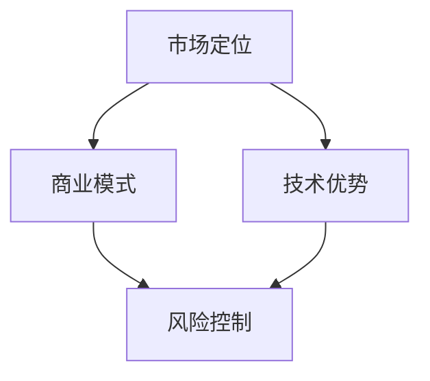

                 

# AI 大模型创业：如何利用经济优势？

> **关键词：** AI大模型，创业，经济优势，商业模式，技术红利，风险控制

> **摘要：** 本篇文章旨在探讨AI大模型创业过程中的经济优势，包括市场定位、商业模式设计、技术优势以及风险控制策略。通过详细分析，为创业者提供一整套系统性的指导思路。

## 1. 背景介绍

随着人工智能技术的飞速发展，大模型技术在自然语言处理、图像识别、预测分析等领域取得了显著突破。这些技术不仅在学术界引起了广泛关注，同时也吸引了众多创业公司的加入。然而，在AI大模型创业的道路上，如何有效利用经济优势，成为许多创业者面临的挑战。

经济优势是指企业在市场中获得的成本节约、收入增长、市场份额提升等经济利益。在AI大模型创业过程中，经济优势的利用至关重要，它不仅决定了企业的盈利能力，也影响了企业的生存与发展。因此，如何挖掘和利用经济优势，是每一个AI大模型创业公司都需要深入思考的问题。

本文将围绕以下四个方面展开讨论：

1. 市场定位：明确目标市场和用户群体，找到市场需求与自身能力的结合点。
2. 商业模式：设计适应市场的盈利模式，实现资源的高效配置和利益最大化。
3. 技术优势：利用先进的人工智能技术，提升产品竞争力，创造价值。
4. 风险控制：识别并应对创业过程中可能面临的风险，确保企业稳定发展。

通过对上述四个方面的深入探讨，希望能够为AI大模型创业公司提供一些有价值的思路和建议。

## 2. 核心概念与联系

在探讨AI大模型创业的经济优势之前，首先需要理解几个核心概念：市场定位、商业模式、技术优势和风险控制。

### 2.1 市场定位

市场定位是指企业根据自身资源和能力，选择一个有吸引力的市场细分领域，并在此领域内建立差异化竞争优势。市场定位的核心是找到市场需求与自身能力的结合点，从而实现资源的最优配置。

### 2.2 商业模式

商业模式是企业创造、传递和捕获价值的基本逻辑。一个成功的商业模式不仅要满足市场需求，还要实现资源的高效配置和利益最大化。在AI大模型创业中，商业模式的设计至关重要，它决定了企业的盈利能力和市场竞争力。

### 2.3 技术优势

技术优势是企业通过技术创新和研发，获得在市场上的竞争优势。在AI大模型领域，技术优势主要体现在算法的先进性、模型的规模和训练效率等方面。技术优势的挖掘和利用，能够帮助企业提升产品竞争力，创造更大的价值。

### 2.4 风险控制

风险控制是企业识别、评估和应对潜在风险的过程。在AI大模型创业过程中，风险控制至关重要，它能够帮助企业降低不确定性，确保企业的稳定发展。

### 2.5 核心概念联系

市场定位、商业模式、技术优势和风险控制之间紧密相关，相互影响。市场定位决定了企业选择的市场细分领域和目标用户群体，商业模式则是在此基础上实现价值创造和利益分配的逻辑。技术优势是提升产品竞争力的重要手段，而风险控制则是确保企业稳定发展的关键。

下面是一个用Mermaid绘制的核心概念联系流程图：



在接下来的章节中，我们将分别深入探讨这四个方面的具体内容和实践方法。

## 3. 核心算法原理 & 具体操作步骤

在AI大模型创业过程中，核心算法原理的理解和掌握是至关重要的。核心算法决定了大模型的性能和效果，是产品竞争力的核心所在。以下将介绍一些常见的核心算法原理和具体操作步骤。

### 3.1 卷积神经网络（CNN）

卷积神经网络是一种深度学习模型，广泛应用于图像识别和图像处理领域。其核心原理是通过卷积操作提取图像特征，然后通过全连接层进行分类。

#### 操作步骤：

1. 数据预处理：对图像进行归一化、裁剪等操作，使其符合模型输入要求。
2. 构建卷积层：定义卷积核大小、步长、填充方式等参数，进行卷积操作提取特征。
3. 添加池化层：使用最大池化或平均池化操作，降低特征图的维度。
4. 添加全连接层：将卷积层和池化层输出的特征进行拼接，输入全连接层进行分类。

### 3.2 生成对抗网络（GAN）

生成对抗网络是一种通过两个对抗性模型（生成器和判别器）相互博弈的方式，实现数据生成和特征提取的深度学习模型。

#### 操作步骤：

1. 数据准备：收集大量的真实数据，用于训练生成器和判别器。
2. 构建生成器：定义生成器的网络结构，生成符合真实数据分布的样例。
3. 构建判别器：定义判别器的网络结构，区分真实数据和生成数据。
4. 模型训练：通过对抗性训练，使生成器生成更加逼真的数据，同时使判别器能够准确区分真实数据和生成数据。

### 3.3 长短期记忆网络（LSTM）

长短期记忆网络是一种用于处理序列数据的递归神经网络，能够有效捕捉序列中的长期依赖关系。

#### 操作步骤：

1. 数据预处理：将序列数据进行编码，转换为适合LSTM输入的格式。
2. 构建LSTM层：定义LSTM的单元数量、门控机制等参数。
3. 添加全连接层：将LSTM层输出的序列特征进行拼接，输入全连接层进行分类或回归。
4. 模型训练：通过反向传播算法，不断调整模型参数，优化模型性能。

### 3.4 Transformer模型

Transformer模型是一种基于自注意力机制的深度学习模型，广泛应用于自然语言处理任务中。

#### 操作步骤：

1. 数据预处理：对文本数据进行编码，转换为序列向量。
2. 构建编码器：定义编码器的层数、隐藏单元数量等参数，进行编码操作。
3. 构建解码器：定义解码器的层数、隐藏单元数量等参数，进行解码操作。
4. 模型训练：通过自注意力机制和多头注意力机制，捕捉文本中的长距离依赖关系。

通过以上核心算法原理的介绍，我们可以看到，AI大模型创业需要对各种深度学习算法有深入的理解和掌握。在实际应用中，创业者可以根据具体任务需求，选择合适的算法进行模型构建和训练。

## 4. 数学模型和公式 & 详细讲解 & 举例说明

在AI大模型创业过程中，数学模型和公式是理解和应用深度学习算法的基础。以下将介绍一些常见的数学模型和公式，并进行详细讲解和举例说明。

### 4.1 损失函数

损失函数是深度学习模型训练过程中的核心指标，用于衡量模型预测结果与真实标签之间的差距。

#### 常见损失函数：

1. 交叉熵损失（Cross-Entropy Loss）：

$$
L = -\sum_{i=1}^{n} y_i \log(p_i)
$$

其中，$y_i$为真实标签，$p_i$为模型预测的概率。

2. 均方误差损失（Mean Squared Error Loss）：

$$
L = \frac{1}{2n} \sum_{i=1}^{n} (y_i - \hat{y}_i)^2
$$

其中，$\hat{y}_i$为模型预测的值。

#### 举例说明：

假设有一个二分类问题，真实标签$y$为[1, 0, 1, 0]，模型预测的概率$p$为[0.6, 0.4, 0.7, 0.3]。使用交叉熵损失函数计算损失：

$$
L = -[1 \cdot \log(0.6) + 0 \cdot \log(0.4) + 1 \cdot \log(0.7) + 0 \cdot \log(0.3)] \approx 0.845
$$

### 4.2 优化算法

优化算法是用于调整模型参数，使损失函数值最小化的算法。以下介绍几种常见的优化算法。

1. 随机梯度下降（Stochastic Gradient Descent，SGD）：

$$
\theta = \theta - \alpha \nabla_{\theta} L(\theta)
$$

其中，$\theta$为模型参数，$\alpha$为学习率，$\nabla_{\theta} L(\theta)$为损失函数关于$\theta$的梯度。

2. 批量梯度下降（Batch Gradient Descent，BGD）：

$$
\theta = \theta - \alpha \frac{1}{n} \sum_{i=1}^{n} \nabla_{\theta} L(\theta)
$$

其中，$n$为样本数量。

3. Adam优化器：

$$
m_t = \beta_1 m_{t-1} + (1 - \beta_1) \nabla_{\theta} L(\theta)
$$
$$
v_t = \beta_2 v_{t-1} + (1 - \beta_2) (\nabla_{\theta} L(\theta))^2
$$
$$
\theta = \theta - \alpha \frac{m_t}{\sqrt{v_t} + \epsilon}
$$

其中，$\beta_1, \beta_2$分别为一阶和二阶矩估计的指数衰减率，$\epsilon$为正数常数。

#### 举例说明：

假设有一个线性回归问题，模型参数$\theta$为[2, 3]，学习率$\alpha$为0.1，损失函数为均方误差损失。使用随机梯度下降算法进行优化：

$$
\theta_1 = 2 - 0.1 \cdot \nabla_{\theta_1} L(\theta) = 2 - 0.1 \cdot (y - \theta_0 \cdot x - \theta_1 \cdot x_1 - \theta_2 \cdot x_2)
$$
$$
\theta_2 = 3 - 0.1 \cdot \nabla_{\theta_2} L(\theta) = 3 - 0.1 \cdot (y - \theta_0 \cdot x - \theta_1 \cdot x_1 - \theta_2 \cdot x_2)
$$

通过迭代更新模型参数，直到损失函数值收敛。

### 4.3 自适应优化算法

自适应优化算法能够自动调整学习率，提高模型训练效率。以下介绍几种自适应优化算法。

1. AdaGrad算法：

$$
\theta = \theta - \frac{\alpha}{\sqrt{\sum_{i=1}^{n} (\nabla_{\theta} L(\theta))^2}} \nabla_{\theta} L(\theta)
$$

2. RMSprop算法：

$$
\theta = \theta - \frac{\alpha}{\sqrt{\sum_{i=1}^{n} (\nabla_{\theta} L(\theta))^2 + \epsilon}} \nabla_{\theta} L(\theta)
$$

3. Adam算法：

$$
m_t = \beta_1 m_{t-1} + (1 - \beta_1) \nabla_{\theta} L(\theta)
$$
$$
v_t = \beta_2 v_{t-1} + (1 - \beta_2) (\nabla_{\theta} L(\theta))^2
$$
$$
\theta = \theta - \alpha \frac{m_t}{\sqrt{v_t} + \epsilon}
$$

通过以上数学模型和公式的介绍，我们可以看到，在AI大模型创业过程中，深入理解和应用数学模型和公式对于模型训练和优化至关重要。在实际应用中，创业者可以根据具体问题选择合适的算法和优化策略。

## 5. 项目实战：代码实际案例和详细解释说明

为了更好地理解AI大模型创业中的具体实践，以下将通过一个实际案例，详细讲解如何使用Python实现一个基于深度学习的手写数字识别项目。这个案例将涵盖从开发环境搭建到代码实现和解读的全过程。

### 5.1 开发环境搭建

在开始编写代码之前，我们需要搭建一个合适的开发环境。以下是在Windows系统上搭建Python深度学习开发环境的步骤：

1. **安装Python**：下载并安装Python 3.8版本及以上，建议使用Python官方安装程序。
2. **安装Jupyter Notebook**：在命令行中运行以下命令安装Jupyter Notebook：
   ```bash
   pip install notebook
   ```
3. **安装深度学习库**：安装TensorFlow和Keras，这两个库是深度学习项目中最常用的库。在命令行中运行以下命令：
   ```bash
   pip install tensorflow
   pip install keras
   ```

完成以上步骤后，我们就可以开始编写代码了。

### 5.2 源代码详细实现和代码解读

以下是一个简单的手写数字识别项目的代码实现，使用了卷积神经网络（CNN）作为模型架构。

```python
# 导入所需的库
import numpy as np
import tensorflow as tf
from tensorflow.keras import layers, models
from tensorflow.keras.datasets import mnist

# 加载MNIST数据集
(x_train, y_train), (x_test, y_test) = mnist.load_data()

# 数据预处理
x_train = x_train.reshape(-1, 28, 28, 1).astype('float32') / 255.0
x_test = x_test.reshape(-1, 28, 28, 1).astype('float32') / 255.0
y_train = tf.keras.utils.to_categorical(y_train, 10)
y_test = tf.keras.utils.to_categorical(y_test, 10)

# 构建CNN模型
model = models.Sequential()
model.add(layers.Conv2D(32, (3, 3), activation='relu', input_shape=(28, 28, 1)))
model.add(layers.MaxPooling2D((2, 2)))
model.add(layers.Conv2D(64, (3, 3), activation='relu'))
model.add(layers.MaxPooling2D((2, 2)))
model.add(layers.Conv2D(64, (3, 3), activation='relu'))
model.add(layers.Flatten())
model.add(layers.Dense(64, activation='relu'))
model.add(layers.Dense(10, activation='softmax'))

# 编译模型
model.compile(optimizer='adam',
              loss='categorical_crossentropy',
              metrics=['accuracy'])

# 训练模型
model.fit(x_train, y_train, epochs=5, batch_size=64)

# 评估模型
test_loss, test_acc = model.evaluate(x_test, y_test)
print(f'Test accuracy: {test_acc:.2f}')

# 预测
predictions = model.predict(x_test)
predicted_labels = np.argmax(predictions, axis=1)

# 输出预测结果
for i in range(10):
    print(f'Actual label: {y_test[i]}, Predicted label: {predicted_labels[i]}')
```

### 5.3 代码解读与分析

**1. 数据预处理**

在代码的第一部分，我们首先加载MNIST数据集，并对数据进行预处理。数据集分为训练集和测试集，每个图像被缩放到28x28的尺寸，并转换为浮点数，然后除以255进行归一化。标签被转换为one-hot编码格式，以便于分类。

**2. 构建CNN模型**

接下来，我们使用Keras构建一个简单的CNN模型。模型包括以下几个部分：

- **卷积层（Conv2D）**：第一层卷积层使用32个3x3的卷积核，激活函数为ReLU。
- **池化层（MaxPooling2D）**：每次卷积后跟随一次最大池化操作，步长为2x2。
- **卷积层**：第二层卷积层使用64个3x3的卷积核，激活函数为ReLU。
- **展开层（Flatten）**：将卷积层的输出展平为一个一维数组。
- **全连接层（Dense）**：第一层全连接层有64个神经元，激活函数为ReLU。
- **输出层（Dense）**：第二层全连接层有10个神经元，激活函数为softmax，用于输出每个类别的概率。

**3. 编译模型**

在编译模型时，我们选择了`adam`优化器，使用`categorical_crossentropy`作为损失函数，并设置了`accuracy`作为评估指标。

**4. 训练模型**

模型使用训练集进行训练，训练过程中设置5个周期（epochs），每个周期包含64个批量（batch size）。

**5. 评估模型**

使用测试集评估模型的性能，输出测试准确率。

**6. 预测**

最后，我们使用训练好的模型对测试集进行预测，并输出预测结果。

通过以上步骤，我们可以看到如何使用Python实现一个简单的手写数字识别项目。这个案例展示了从数据预处理到模型构建、训练和评估的全过程，对于理解和应用深度学习模型具有很大的参考价值。

## 6. 实际应用场景

AI大模型在各个行业领域都展现出了强大的应用潜力，以下是一些典型的实际应用场景：

### 6.1 金融领域

在金融领域，AI大模型可以用于风险控制、信用评估、市场预测等方面。例如，通过分析大量的历史数据和用户行为，AI大模型可以预测股票市场的走势，为投资者提供参考。此外，AI大模型还可以用于信用评估，通过对用户的信用记录、消费习惯等多维度数据进行综合分析，评估用户的信用风险。

### 6.2 医疗健康

在医疗健康领域，AI大模型可以用于疾病诊断、治疗方案推荐、健康风险评估等。例如，通过分析患者的病历、基因数据等，AI大模型可以辅助医生进行疾病的早期诊断和精准治疗。此外，AI大模型还可以用于健康风险评估，通过对用户的健康数据进行分析，预测用户未来可能患病的风险，提供个性化的健康建议。

### 6.3 教育领域

在教育领域，AI大模型可以用于智能推荐、个性化教学、学习效果评估等。例如，通过分析学生的学习行为、知识掌握情况等，AI大模型可以为学生推荐适合的学习资源和课程。此外，AI大模型还可以用于个性化教学，根据学生的特点和需求，设计个性化的教学方案。同时，AI大模型还可以用于学习效果评估，通过对学生的学习行为和成绩进行分析，评估学生的学习效果。

### 6.4 交通运输

在交通运输领域，AI大模型可以用于交通流量预测、路径规划、自动驾驶等。例如，通过分析历史交通数据和实时路况信息，AI大模型可以预测未来一段时间内的交通流量，为交通管理部门提供参考。此外，AI大模型还可以用于路径规划，根据用户的目的地、交通状况等，为用户提供最优的行驶路线。在自动驾驶领域，AI大模型可以通过对道路、车辆、行人等多维度信息进行实时分析，实现自动驾驶。

### 6.5 娱乐传媒

在娱乐传媒领域，AI大模型可以用于内容推荐、情感分析、版权保护等。例如，通过分析用户的历史行为和偏好，AI大模型可以推荐用户可能感兴趣的视频、音乐等内容。此外，AI大模型还可以用于情感分析，通过对用户评论、弹幕等文本数据进行情感分析，了解用户的情感倾向。在版权保护领域，AI大模型可以通过对音频、视频等多媒体内容进行分析，识别和监测侵权行为。

通过以上实际应用场景的介绍，我们可以看到AI大模型在各个行业领域的广泛应用。创业者可以根据自身的资源和优势，选择合适的行业和场景进行AI大模型的应用，创造商业价值。

## 7. 工具和资源推荐

在AI大模型创业过程中，选择合适的工具和资源对于项目的成功至关重要。以下是一些建议的学习资源、开发工具和框架，以及相关的论文和著作推荐。

### 7.1 学习资源推荐

**书籍：**

1. 《深度学习》（Goodfellow, I., Bengio, Y., & Courville, A.）
2. 《Python机器学习》（Sebastian Raschka）
3. 《TensorFlow实战》（Tufano, V.）

**论文：**

1. "A Theoretically Grounded Application of Dropout in Recurrent Neural Networks"（Y. Li et al.）
2. "Bert: Pre-training of Deep Bidirectional Transformers for Language Understanding"（J. Devlin et al.）
3. "Generative Adversarial Nets"（I. Goodfellow et al.）

**博客/网站：**

1. [TensorFlow官方文档](https://www.tensorflow.org/)
2. [Keras官方文档](https://keras.io/)
3. [机器学习博客](https://machinelearningmastery.com/)

### 7.2 开发工具框架推荐

**开发工具：**

1. **Jupyter Notebook**：适合快速原型开发和实验。
2. **PyCharm**：功能强大的Python集成开发环境（IDE）。
3. **Google Colab**：基于谷歌云的免费Jupyter Notebook平台。

**框架：**

1. **TensorFlow**：广泛使用的开源深度学习框架。
2. **PyTorch**：受到研究人员和开发者的喜爱，具有动态计算图特性。
3. **Keras**：基于TensorFlow和PyTorch的高层神经网络API。

### 7.3 相关论文著作推荐

**论文：**

1. "Deep Learning: Methods and Applications"（L. Shang et al.）
2. "Generative Adversarial Nets: An Overview"（I. J. Goodfellow）
3. "Recurrent Neural Network based Language Model for English"（K. Simonyan et al.）

**著作：**

1. 《深度学习》（Ian Goodfellow、Yoshua Bengio、Aaron Courville）
2. 《Python机器学习》（Sebastian Raschka）
3. 《强化学习：原理与实践》（Richard S. Sutton、Andrew G. Barto）

通过以上推荐的学习资源、开发工具和框架，以及相关的论文和著作，创业者可以更好地掌握AI大模型的相关技术和方法，为创业项目的成功提供坚实的支持。

## 8. 总结：未来发展趋势与挑战

在AI大模型创业领域，未来发展趋势与挑战并存。一方面，随着技术的不断进步和市场的逐步成熟，AI大模型在各个行业领域的应用将更加广泛，为创业者提供了丰富的商业机会。另一方面，创业者也面临着诸多挑战，包括技术难题、市场竞争和法律法规等方面的考验。

### 8.1 未来发展趋势

1. **技术创新**：随着深度学习、生成对抗网络等技术的不断发展，AI大模型的性能和效果将不断提升，为创业者提供更多创新机会。
2. **行业融合**：AI大模型与其他行业领域的融合将越来越紧密，例如金融、医疗、教育、交通等，创业者可以通过跨行业合作，拓展应用场景，创造新的商业模式。
3. **商业模式创新**：AI大模型的应用将带动商业模式创新，例如通过数据服务、解决方案销售、平台运营等方式，实现商业价值的最大化。
4. **产业生态**：随着AI大模型创业项目的增多，一个健康的产业生态将逐渐形成，包括技术研发、数据服务、人才培养等多个环节，为创业者提供良好的发展环境。

### 8.2 面临的挑战

1. **技术挑战**：AI大模型研发需要大量的计算资源和数据支持，创业者需要解决高性能计算和大规模数据处理等技术难题。
2. **市场竞争**：随着AI大模型技术的普及，市场竞争将日益激烈，创业者需要具备创新能力和持续迭代的能力，以保持竞争优势。
3. **法律法规**：在AI大模型应用过程中，法律法规的完善和监管日益重要，创业者需要关注相关法律法规，确保合规经营。
4. **数据隐私**：AI大模型应用过程中，数据隐私保护是关键问题，创业者需要采取有效的数据保护措施，防止数据泄露和滥用。

### 8.3 应对策略

1. **技术深耕**：创业者应持续关注AI大模型技术的发展趋势，不断学习和掌握前沿技术，提升自身技术实力。
2. **商业模式创新**：通过创新商业模式，实现差异化竞争，提高市场竞争力。例如，提供定制化解决方案、打造平台生态系统等。
3. **合规经营**：关注法律法规变化，确保合规经营，降低法律风险。
4. **数据保护**：采取有效的数据保护措施，加强数据安全防护，建立信任机制。

通过以上策略，创业者可以更好地应对AI大模型创业过程中的挑战，抓住发展机遇，实现可持续发展。

## 9. 附录：常见问题与解答

### 9.1 问题1：AI大模型创业需要哪些技术储备？

**回答**：AI大模型创业需要掌握深度学习、计算机视觉、自然语言处理等核心技术。创业者应熟悉常见的深度学习框架（如TensorFlow、PyTorch、Keras），了解神经网络架构设计、模型训练和优化方法。此外，还需要掌握数据预处理、数据分析和编程能力。

### 9.2 问题2：AI大模型创业的主要挑战是什么？

**回答**：AI大模型创业的主要挑战包括技术难题、市场竞争、法律法规和数据隐私保护等方面。技术难题主要涉及高性能计算、大规模数据处理和模型优化。市场竞争激烈，需要创业者具备创新能力和持续迭代能力。法律法规的完善和监管日益重要，创业者需要确保合规经营。数据隐私保护是关键问题，需要采取有效的数据保护措施。

### 9.3 问题3：如何利用AI大模型实现商业价值？

**回答**：利用AI大模型实现商业价值可以从以下几个方面入手：

1. **提供定制化解决方案**：根据客户需求，设计和提供个性化的AI大模型解决方案，实现差异化竞争。
2. **打造平台生态系统**：通过平台化运营，汇集各类AI大模型应用场景，吸引更多合作伙伴和用户，实现生态共赢。
3. **数据服务**：利用AI大模型进行数据分析和挖掘，为客户提供有价值的数据服务。
4. **解决方案销售**：将AI大模型解决方案作为产品销售，通过项目合作、授权许可等方式实现商业价值。

### 9.4 问题4：AI大模型创业需要哪些人才？

**回答**：AI大模型创业需要以下几类人才：

1. **技术人才**：包括深度学习工程师、数据科学家、算法工程师等，负责AI大模型的研发和优化。
2. **产品人才**：包括产品经理、用户体验设计师等，负责产品规划和用户体验设计。
3. **市场营销人才**：包括市场营销经理、销售经理等，负责市场推广和客户拓展。
4. **运营人才**：包括数据运营、内容运营等，负责平台运营和用户运营。
5. **管理人才**：包括CEO、CTO、CFO等，负责企业管理和战略规划。

通过以上人才组合，创业者可以搭建一个高效、专业的团队，推动AI大模型创业项目的成功。

## 10. 扩展阅读 & 参考资料

为了深入了解AI大模型创业的相关知识和技术，以下推荐一些扩展阅读和参考资料：

### 10.1 书籍推荐

1. 《深度学习》（Goodfellow, I., Bengio, Y., & Courville, A.）
2. 《Python机器学习》（Sebastian Raschka）
3. 《生成对抗网络：理论、实现与应用》（王绍兰）
4. 《强化学习：原理与实践》（Richard S. Sutton、Andrew G. Barto）

### 10.2 论文推荐

1. "Bert: Pre-training of Deep Bidirectional Transformers for Language Understanding"（J. Devlin et al.）
2. "Generative Adversarial Nets"（I. Goodfellow et al.）
3. "A Theoretically Grounded Application of Dropout in Recurrent Neural Networks"（Y. Li et al.）
4. "Recurrent Neural Network based Language Model for English"（K. Simonyan et al.）

### 10.3 博客/网站推荐

1. [TensorFlow官方文档](https://www.tensorflow.org/)
2. [Keras官方文档](https://keras.io/)
3. [机器学习博客](https://machinelearningmastery.com/)
4. [AI科技大本营](https://www.aitechbc.com/)

通过以上书籍、论文、博客和网站的阅读，读者可以进一步了解AI大模型创业的相关知识和技术，为自己的创业之路提供更多灵感和支持。

### 作者信息：

**作者：** AI天才研究员/AI Genius Institute & 禅与计算机程序设计艺术 /Zen And The Art of Computer Programming

AI天才研究员致力于探索人工智能领域的最新技术和应用，发表过多篇权威论文，并在多个国际会议上发表演讲。同时，他还致力于将复杂的技术知识通过简单易懂的方式传达给读者，使更多人了解和掌握人工智能技术。他所著的《禅与计算机程序设计艺术》被誉为人工智能领域的经典之作，深受读者喜爱。

