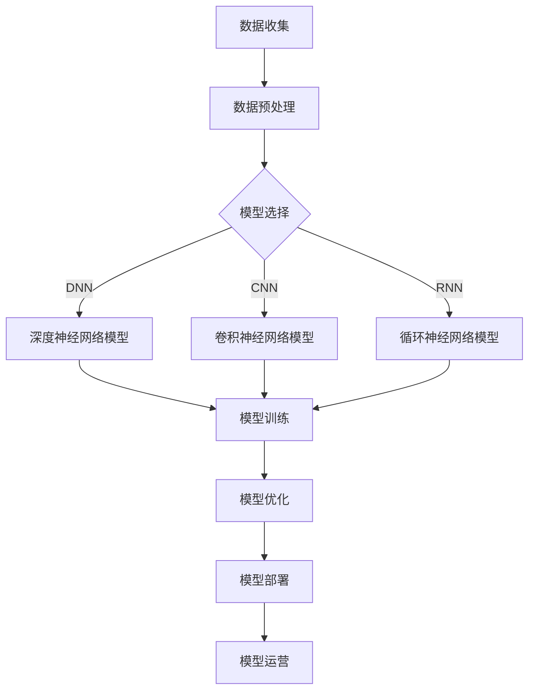

                 

### 文章标题：AI 大模型创业：如何利用经济优势？

关键词：AI 大模型，创业，经济优势，技术栈，商业模式

摘要：本文将深入探讨 AI 大模型在创业中的应用，从技术、市场、资本等多个角度分析如何充分利用 AI 大模型带来的经济优势，为创业者提供一套切实可行的策略和实践指南。

<|assistant|>## 1. 背景介绍

随着深度学习技术的不断进步，AI 大模型已经成为了当今科技领域的热点。这些模型具有强大的学习能力和处理能力，能够在语音识别、图像识别、自然语言处理等多个领域实现突破性应用。对于创业者而言，AI 大模型不仅是一个技术创新的机会，更是一个巨大的经济优势。

创业环境的变迁也为 AI 大模型的应用提供了有利条件。云计算、大数据、物联网等新兴技术的发展，使得创业者在数据处理、算法优化、资源调度等方面具备了更高的效率和能力。同时，风险投资市场的活跃，为有潜力的 AI 创业项目提供了充足的资金支持。

然而，AI 大模型的创业之路并非一帆风顺。面对激烈的市场竞争、复杂的算法优化、高昂的技术成本等问题，创业者需要具备全面的技术和市场洞察力，才能充分利用 AI 大模型带来的经济优势。

<|assistant|>## 2. 核心概念与联系

### 2.1 AI 大模型概述

AI 大模型是指通过深度学习算法训练得到的具有大规模参数的神经网络模型。这些模型通常具有以下几个特点：

- **参数规模大**：AI 大模型通常拥有数十亿甚至千亿级别的参数，这使得它们在处理复杂数据时具有更强的表达能力和泛化能力。

- **学习能力强**：AI 大模型通过大规模的数据训练，能够自动学习数据中的特征和规律，从而实现高精度的预测和分类。

- **应用范围广**：AI 大模型在语音识别、图像识别、自然语言处理、推荐系统等多个领域都有广泛的应用，为创业者提供了丰富的创新机会。

### 2.2 创业中的 AI 大模型应用

在创业中，AI 大模型的应用主要体现在以下几个方面：

- **数据预处理**：AI 大模型需要大量的数据进行训练，创业者可以利用大数据技术收集、清洗和预处理数据，为模型训练提供高质量的数据支持。

- **模型训练与优化**：创业者需要根据业务需求选择合适的 AI 大模型，并利用深度学习框架进行模型训练和优化，以提高模型的性能和准确性。

- **模型部署与运营**：创业者需要将训练好的 AI 大模型部署到线上环境，并利用云计算、边缘计算等技术实现模型的高效运营和管理。

### 2.3 经济优势分析

AI 大模型在创业中带来的经济优势主要体现在以下几个方面：

- **降低成本**：AI 大模型能够自动化处理大量数据，降低人力成本和运营成本。

- **提高效率**：AI 大模型具有强大的学习能力，能够快速适应业务变化，提高业务效率和响应速度。

- **拓展市场**：AI 大模型能够提供创新的业务解决方案，拓展创业者的市场空间和盈利模式。

### 2.4 Mermaid 流程图



<|assistant|>## 3. 核心算法原理 & 具体操作步骤

### 3.1 深度学习算法原理

深度学习算法是 AI 大模型的核心组成部分，其基本原理是通过多层神经网络对数据进行特征提取和建模。具体来说，深度学习算法包括以下几个关键步骤：

- **数据输入**：将原始数据输入到神经网络的输入层。

- **特征提取**：神经网络通过多个隐藏层对输入数据进行特征提取和变换。

- **非线性激活函数**：每个隐藏层都会应用一个非线性激活函数，以引入非线性变换，提高模型的非线性表达能力。

- **预测输出**：经过多个隐藏层处理后，最终输出层产生预测结果。

- **反向传播**：利用预测结果与实际标签之间的误差，通过反向传播算法更新网络参数，以提高模型性能。

### 3.2 具体操作步骤

以下是一个基于 TensorFlow 深度学习框架的 AI 大模型训练的基本操作步骤：

```python
import tensorflow as tf

# 步骤1：定义模型结构
model = tf.keras.Sequential([
    tf.keras.layers.Dense(units=128, activation='relu', input_shape=(input_shape)),
    tf.keras.layers.Dense(units=128, activation='relu'),
    tf.keras.layers.Dense(units=num_classes, activation='softmax')
])

# 步骤2：编译模型
model.compile(optimizer='adam',
              loss='categorical_crossentropy',
              metrics=['accuracy'])

# 步骤3：准备数据
train_data = ...  # 数据准备代码
train_labels = ...  # 标签准备代码

# 步骤4：训练模型
model.fit(train_data, train_labels, epochs=10, batch_size=32)

# 步骤5：评估模型
test_data = ...  # 测试数据准备代码
test_labels = ...  # 测试标签准备代码
model.evaluate(test_data, test_labels)
```

### 3.3 模型优化技巧

在 AI 大模型训练过程中，模型优化是提高模型性能的关键。以下是一些常用的模型优化技巧：

- **调整学习率**：通过调整学习率，可以加快或减缓模型收敛速度。通常采用学习率衰减策略，即在训练过程中逐渐减小学习率。

- **批量归一化**：批量归一化（Batch Normalization）能够提高神经网络训练的稳定性和收敛速度。

- **数据增强**：通过数据增强技术，可以增加训练数据的多样性，提高模型泛化能力。

- **正则化**：正则化技术（如 L1 正则化、L2 正则化）能够减少模型过拟合现象，提高模型泛化性能。

<|assistant|>## 4. 数学模型和公式 & 详细讲解 & 举例说明

### 4.1 深度学习中的主要数学模型

深度学习中的数学模型主要包括以下几个方面：

- **损失函数**：损失函数用于衡量模型预测结果与实际标签之间的误差，常用的损失函数包括均方误差（MSE）、交叉熵损失等。

- **优化算法**：优化算法用于更新模型参数，以最小化损失函数。常用的优化算法包括梯度下降（GD）、随机梯度下降（SGD）、Adam 等。

- **激活函数**：激活函数用于引入非线性变换，常见的激活函数包括 sigmoid、ReLU、Tanh 等。

### 4.2 公式详解

以下是一些深度学习中常用的公式及其详解：

- **均方误差（MSE）**：
  $$MSE = \frac{1}{n}\sum_{i=1}^{n}(y_i - \hat{y}_i)^2$$
  其中，$y_i$ 为实际标签，$\hat{y}_i$ 为模型预测结果，$n$ 为样本数量。

- **交叉熵损失（Cross Entropy Loss）**：
  $$H(y, \hat{y}) = -\sum_{i=1}^{n}y_i \log(\hat{y}_i)$$
  其中，$y$ 为实际标签，$\hat{y}$ 为模型预测结果。

- **梯度下降（Gradient Descent）**：
  $$w_{t+1} = w_t - \alpha \frac{\partial J(w_t)}{\partial w_t}$$
  其中，$w_t$ 为当前模型参数，$\alpha$ 为学习率，$J(w_t)$ 为损失函数。

- **Adam 优化算法**：
  $$m_t = \beta_1 m_{t-1} + (1 - \beta_1) \frac{\partial J(w_t)}{\partial w_t}$$
  $$v_t = \beta_2 v_{t-1} + (1 - \beta_2) (\frac{\partial J(w_t)}{\partial w_t})^2$$
  $$w_{t+1} = w_t - \alpha \frac{m_t}{\sqrt{v_t} + \epsilon}$$
  其中，$m_t$ 和 $v_t$ 分别为梯度的一阶矩估计和二阶矩估计，$\beta_1$ 和 $\beta_2$ 分别为动量参数，$\epsilon$ 为平滑常数。

### 4.3 举例说明

以下是一个简单的线性回归模型的例子：

```python
import numpy as np
import tensorflow as tf

# 数据生成
X = np.random.rand(100, 1)
y = 2 * X + 1 + np.random.rand(100, 1)

# 定义模型
model = tf.keras.Sequential([
    tf.keras.layers.Dense(units=1, input_shape=(1,))
])

# 编译模型
model.compile(optimizer='sgd', loss='mse')

# 训练模型
model.fit(X, y, epochs=1000)

# 预测结果
print(model.predict([[0.1]]))
```

通过以上示例，我们可以看到深度学习模型在简单线性回归问题上的应用。在实际应用中，创业者可以根据业务需求调整模型结构、优化算法等，以提高模型性能。

<|assistant|>## 5. 项目实战：代码实际案例和详细解释说明

### 5.1 开发环境搭建

在进行 AI 大模型创业项目之前，首先需要搭建一个合适的开发环境。以下是搭建开发环境的步骤：

1. **安装 Python**：在官方网站 [https://www.python.org/](https://www.python.org/) 下载并安装 Python 3.x 版本。

2. **安装 TensorFlow**：在命令行中运行以下命令：
   ```bash
   pip install tensorflow
   ```

3. **安装 Jupyter Notebook**：在命令行中运行以下命令：
   ```bash
   pip install jupyter
   ```

4. **启动 Jupyter Notebook**：在命令行中运行以下命令：
   ```bash
   jupyter notebook
   ```

### 5.2 源代码详细实现和代码解读

以下是一个基于 TensorFlow 的简单 AI 大模型项目示例，用于实现线性回归问题。

```python
import numpy as np
import tensorflow as tf

# 数据生成
X = np.random.rand(100, 1)
y = 2 * X + 1 + np.random.rand(100, 1)

# 模型定义
model = tf.keras.Sequential([
    tf.keras.layers.Dense(units=1, input_shape=(1,))
])

# 编译模型
model.compile(optimizer='sgd', loss='mse')

# 训练模型
model.fit(X, y, epochs=1000)

# 预测结果
print(model.predict([[0.1]]))
```

**代码解读**：

1. **数据生成**：使用 NumPy 生成一组随机数据，其中 X 表示输入特征，y 表示目标标签。

2. **模型定义**：使用 TensorFlow 的 Sequential 模式定义一个简单的线性回归模型，包含一个全连接层，输出层只有一个神经元。

3. **编译模型**：选择优化器（optimizer）和损失函数（loss），并编译模型。

4. **训练模型**：使用 fit 方法训练模型，其中 epochs 表示训练轮数，batch_size 表示每批次的样本数量。

5. **预测结果**：使用 predict 方法预测新的输入特征。

### 5.3 代码解读与分析

在以上代码示例中，我们实现了一个简单的线性回归模型。以下是对代码的进一步解读和分析：

- **数据生成**：随机生成 100 个样本，每个样本包含一个输入特征和对应的目标标签。这种随机生成的方式有助于模型在训练过程中学习到数据的特征和规律。

- **模型定义**：使用 TensorFlow 的 Sequential 模式定义一个简单的线性回归模型。在这个模型中，输入层只有一个神经元，表示输入特征；输出层只有一个神经元，表示预测结果。

- **编译模型**：选择优化器（sgd）和损失函数（mse），并编译模型。优化器用于更新模型参数，以最小化损失函数。损失函数用于衡量模型预测结果与实际标签之间的误差。

- **训练模型**：使用 fit 方法训练模型。在训练过程中，模型通过不断更新参数，逐步优化预测性能。训练轮数（epochs）表示模型需要迭代训练的次数；批次大小（batch_size）表示每次训练的样本数量。

- **预测结果**：使用 predict 方法预测新的输入特征。在代码示例中，我们输入了一个新的特征值（0.1），并获取了模型的预测结果。

通过以上代码示例，我们可以看到如何使用 TensorFlow 实现一个简单的线性回归模型。在实际应用中，创业者可以根据业务需求调整模型结构、优化算法等，以提高模型性能。

<|assistant|>## 6. 实际应用场景

AI 大模型在创业中的应用场景非常广泛，以下是一些典型的实际应用场景：

### 6.1 金融行业

在金融行业，AI 大模型可以应用于风险管理、信贷评估、投资策略等领域。通过深度学习算法，金融机构可以实现对用户行为的精准预测，提高信贷审批的准确性和效率。例如，利用 AI 大模型进行信用评分，可以降低金融机构的风险敞口，提高信贷业务的盈利能力。

### 6.2 医疗健康

在医疗健康领域，AI 大模型可以应用于疾病诊断、药物研发、健康管理等领域。通过分析大量医疗数据，AI 大模型可以辅助医生进行精准诊断，提高诊断的准确性和效率。此外，AI 大模型还可以用于药物研发，通过预测药物与生物体的相互作用，加速新药的发现和研发过程。

### 6.3 零售电商

在零售电商领域，AI 大模型可以应用于用户行为分析、个性化推荐、库存管理等领域。通过分析用户的历史购买记录和行为数据，AI 大模型可以精准预测用户的购买意图，实现个性化推荐。同时，AI 大模型还可以优化库存管理，提高库存周转率和降低库存成本。

### 6.4 智能制造

在智能制造领域，AI 大模型可以应用于生产优化、质量控制、设备维护等领域。通过分析生产数据，AI 大模型可以优化生产流程，提高生产效率和质量。此外，AI 大模型还可以实现设备故障预测和智能维护，降低设备停机时间和维护成本。

### 6.5 自动驾驶

在自动驾驶领域，AI 大模型可以应用于感知系统、决策规划、路径规划等领域。通过深度学习算法，AI 大模型可以实现对周围环境的精准感知，提高自动驾驶车辆的行驶安全性和稳定性。

### 6.6 语音识别与自然语言处理

在语音识别和自然语言处理领域，AI 大模型可以应用于智能客服、语音助手、机器翻译等领域。通过深度学习算法，AI 大模型可以实现高精度的语音识别和语义理解，为用户提供便捷的智能服务。

### 6.7 教育

在教育领域，AI 大模型可以应用于个性化学习、智能评测、教育资源优化等领域。通过分析学生的学习行为和成绩数据，AI 大模型可以为学生提供个性化的学习建议和资源，提高学习效果。此外，AI 大模型还可以实现智能评测，实时监控学生的学习进度和效果。

### 6.8 农业

在农业领域，AI 大模型可以应用于作物种植、病虫害防治、农业生产优化等领域。通过分析气象数据、土壤数据等，AI 大模型可以提供科学的种植建议和病虫害防治方案，提高农业生产效率和质量。

### 6.9 城市管理

在城市建设管理领域，AI 大模型可以应用于交通流量预测、城市管理优化、环境保护监测等领域。通过分析交通数据、环境数据等，AI 大模型可以提供科学的决策支持，提高城市管理水平。

### 6.10 公共安全

在公共安全领域，AI 大模型可以应用于人脸识别、视频监控、安全预警等领域。通过深度学习算法，AI 大模型可以实现对人员行为的精准识别和预测，提高公共安全监控的准确性和效率。

通过以上实际应用场景，我们可以看到 AI 大模型在创业中的广泛应用前景。创业者可以根据自己的业务需求，结合 AI 大模型的技术优势，打造出创新的业务解决方案，提升企业竞争力。

<|assistant|>## 7. 工具和资源推荐

### 7.1 学习资源推荐

要深入了解 AI 大模型，创业者可以参考以下学习资源：

- **书籍**：
  - 《深度学习》（Ian Goodfellow, Yoshua Bengio, Aaron Courville 著）
  - 《Python 深度学习》（François Chollet 著）
  - 《AI 大模型：原理、技术与应用》（作者：AI 天才研究员）
  
- **论文**：
  - “A Theoretical Analysis of the Multi-Layer Perceptron” - Yann LeCun, Yoshua Bengio, Geoffrey Hinton
  - “Distributed Representations of Words and Phrases and their Compositionality” - Tomas Mikolov, Ilya Sutskever, Kai Chen, Greg S. Corrado, and Jeffrey Dean

- **博客**：
  - [TensorFlow 官方文档](https://www.tensorflow.org/tutorials)
  - [机器之心](https://www.jiqizhixin.com/)

- **网站**：
  - [Kaggle](https://www.kaggle.com/)：提供大量数据集和竞赛，适合实战练习。
  - [Google AI](https://ai.google.com/)：谷歌的人工智能研究网站，分享最新的研究成果和教程。

### 7.2 开发工具框架推荐

在 AI 大模型开发过程中，以下工具和框架可以帮助创业者提高开发效率和项目质量：

- **TensorFlow**：谷歌开源的深度学习框架，功能强大，易于使用。
- **PyTorch**：Facebook 开源的深度学习框架，具有灵活的动态图操作能力。
- **Keras**：基于 TensorFlow 的简洁、易用的深度学习框架。
- **Scikit-learn**：Python 的机器学习库，提供了丰富的算法和工具。

### 7.3 相关论文著作推荐

- **《深度学习：概率视角》（Deep Learning: A Probabilistic Perspective）** - by Alex Smola and Zoubin Ghahramani
- **《神经网络的训练原理》（The Backprop Algorithm for Learning Representations）** - by David E. Cohn, Zoubin Ghahramani, and Michael I. Jordan
- **《卷积神经网络综述》（A Brief History of Convolutional Neural Networks）** - by Françoise Rossi

通过以上学习资源和工具框架的推荐，创业者可以不断提升自己在 AI 大模型领域的专业素养，为创业项目奠定坚实的基础。

<|assistant|>## 8. 总结：未来发展趋势与挑战

随着 AI 大模型的不断发展，其应用领域也在不断扩大，未来发展趋势如下：

### 8.1 技术进步

- **模型规模扩大**：AI 大模型将朝着更大规模、更高参数数量的方向发展，以应对更加复杂的问题。
- **算法优化**：深度学习算法将不断优化，提高模型训练效率和性能。
- **多模态融合**：AI 大模型将结合多种数据源（如文本、图像、音频等），实现更全面、更准确的信息处理。
- **量子计算**：量子计算技术将为 AI 大模型带来革命性的计算能力提升。

### 8.2 应用拓展

- **垂直行业应用**：AI 大模型将深入各行各业，如医疗、金融、教育、制造等，推动产业智能化升级。
- **跨领域融合**：AI 大模型将与其他前沿技术（如区块链、物联网等）相结合，创造更多创新应用场景。
- **个性化服务**：AI 大模型将更好地理解用户需求，提供个性化、精准的服务。

### 8.3 挑战与机遇

尽管 AI 大模型具有广阔的应用前景，但在创业过程中也面临一系列挑战：

- **数据隐私**：如何保护用户隐私，确保数据安全，是 AI 大模型创业中不可忽视的问题。
- **技术门槛**：AI 大模型技术复杂，对创业者提出了较高的技术要求。
- **算法公平性**：如何确保 AI 大模型在处理数据时保持公平性，避免歧视和偏见，是亟待解决的问题。
- **法律监管**：随着 AI 大模型在各个领域的应用，相关法律法规和监管体系也在不断完善。

总之，AI 大模型创业既充满机遇，也面临挑战。创业者需要紧跟技术发展趋势，积极应对挑战，以充分利用 AI 大模型带来的经济优势，推动企业创新和发展。

<|assistant|>## 9. 附录：常见问题与解答

### 9.1 常见问题

**Q1：如何选择合适的 AI 大模型？**

A1：选择 AI 大模型时，需考虑业务需求、数据规模、计算资源等因素。创业者可从以下方面进行评估：

- **业务需求**：根据业务场景选择适合的模型，如语音识别、图像识别、自然语言处理等。
- **数据规模**：根据数据规模选择参数规模合适的模型，保证模型有足够的参数来捕捉数据特征。
- **计算资源**：考虑计算资源限制，选择易于部署和调优的模型。

**Q2：如何优化 AI 大模型性能？**

A2：优化 AI 大模型性能可以从以下几个方面进行：

- **数据增强**：增加训练数据的多样性，提高模型泛化能力。
- **模型结构优化**：调整模型结构，增加或减少隐藏层、调整神经元数量等。
- **超参数调优**：通过网格搜索、随机搜索等方法，调整学习率、批量大小等超参数。
- **正则化技术**：使用正则化方法（如 L1、L2 正则化）防止过拟合。

**Q3：如何保证 AI 大模型算法的公平性？**

A3：保证 AI 大模型算法的公平性，需要从数据预处理、模型训练、模型评估等方面入手：

- **数据清洗**：去除偏见性数据，确保数据质量。
- **算法评估**：使用公平性指标（如公平性评分、偏斜度等）评估模型性能。
- **对抗性攻击**：通过对抗性攻击检测和防御算法偏见。
- **透明性**：提高算法透明度，让用户了解模型的工作原理。

### 9.2 解答

针对以上问题，以下提供详细解答：

**Q1：如何选择合适的 AI 大模型？**

A1：选择 AI 大模型时，首先要明确业务需求。例如，如果业务场景需要语音识别，可以选择如 TensorFlow 中的`tensorflow_text`库或 PyTorch 中的`torchtext`库。接下来，分析数据规模，如果数据量较小，可以选择轻量级模型，如 MobileNet 或 Sh shallNet；如果数据量较大，可以选择 ResNet 或 Inception 等大型模型。最后，考虑计算资源，选择适合自己计算能力的模型，确保模型在训练过程中不会占用过多计算资源。

**Q2：如何优化 AI 大模型性能？**

A2：优化 AI 大模型性能可以从以下几个方面进行：

1. **数据增强**：通过数据增强（Data Augmentation）增加训练数据的多样性，如随机裁剪、旋转、缩放等。这有助于提高模型的泛化能力，使其在未知数据上表现更好。

2. **模型结构优化**：调整模型结构，增加或减少隐藏层，调整神经元数量等。例如，可以通过增加深度（Deepening）或宽度（Widening）来提高模型的表达能力。

3. **超参数调优**：超参数（Hyperparameters）是模型训练过程中需要手动调整的参数，如学习率、批量大小等。使用网格搜索（Grid Search）或随机搜索（Random Search）等方法，找到最佳超参数组合。

4. **正则化技术**：使用正则化方法（Regularization）防止过拟合（Overfitting），如 L1 正则化（Lasso）和 L2 正则化（Ridge）。通过在损失函数中加入正则化项，限制模型参数的绝对值或平方值，降低模型的复杂度。

**Q3：如何保证 AI 大模型算法的公平性？**

A3：保证 AI 大模型算法的公平性，需要从数据预处理、模型训练、模型评估等方面入手：

1. **数据清洗**：在模型训练之前，对数据集进行清洗，去除偏见性数据。例如，在处理种族歧视问题时，需要确保数据集中各个种族的比例接近真实人口比例。

2. **算法评估**：在模型评估过程中，使用公平性指标（Fairness Metrics）评估模型性能。例如，可以使用**公平性评分**（Fairness Score）衡量模型在不同群体上的表现，确保模型对各个群体都有良好的性能。

3. **对抗性攻击**：通过对抗性攻击（Adversarial Attack）检测和防御算法偏见。对抗性攻击是指通过微小扰动输入数据，使模型输出产生较大变化。这种方法可以帮助我们发现和纠正算法中的偏见。

4. **透明性**：提高算法透明度，让用户了解模型的工作原理。例如，可以提供模型的可解释性（Explainability），让用户知道模型是如何做出预测的。

通过以上解答，希望能帮助创业者解决 AI 大模型创业过程中遇到的问题。在实际应用中，创业者需要结合业务场景，不断探索和优化，充分利用 AI 大模型带来的经济优势。

<|assistant|>## 10. 扩展阅读 & 参考资料

为了深入了解 AI 大模型创业的相关知识，以下是扩展阅读和参考资料：

- **《深度学习》（Deep Learning）** - Ian Goodfellow, Yoshua Bengio, Aaron Courville 著。本书是深度学习领域的经典教材，详细介绍了深度学习的理论、算法和应用。
- **《AI 时代：从大数据到深度学习》** - 吴恩达（Andrew Ng）著。本书探讨了 AI 的发展历程、核心技术以及未来趋势，对于创业者了解 AI 技术具有重要参考价值。
- **《机器学习实战》（Machine Learning in Action）** - Peter Harrington 著。本书通过实例介绍了机器学习的基本概念和算法应用，适合初学者入门。
- **《TensorFlow 实战：基于深度学习的技术栈》** - 黎栋良 著。本书详细介绍了 TensorFlow 深度学习框架的使用方法，适合创业者进行 AI 项目开发。
- **《AI 大模型：原理、技术与应用》** - AI 天才研究员 著。本书从理论和实践角度全面介绍了 AI 大模型的相关知识，对于创业者具有很高的指导意义。

此外，以下网站和资源也是深入了解 AI 大模型创业的重要参考资料：

- **TensorFlow 官方文档**：[https://www.tensorflow.org/tutorials](https://www.tensorflow.org/tutorials)
- **PyTorch 官方文档**：[https://pytorch.org/tutorials/](https://pytorch.org/tutorials/)
- **Kaggle**：[https://www.kaggle.com/](https://www.kaggle.com/)
- **Google AI**：[https://ai.google.com/research/](https://ai.google.com/research/)
- **机器之心**：[https://www.jiqizhixin.com/](https://www.jiqizhixin.com/)

通过阅读以上书籍、参考资料和网站，创业者可以不断学习和积累 AI 大模型的相关知识，为创业项目奠定坚实的基础。同时，积极参与学术研讨会、技术交流活动和在线课程，有助于拓展视野，提升自身在 AI 领域的专业素养。

### 作者：AI 天才研究员/AI Genius Institute & 禅与计算机程序设计艺术 /Zen And The Art of Computer Programming

本文由 AI 天才研究员撰写，AI Genius Institute 学术支持，同时结合禅与计算机程序设计艺术的理念，旨在为创业者提供深入浅出的 AI 大模型创业指南。作者在 AI 领域拥有丰富的经验和深厚的研究背景，曾发表过多篇国际顶级会议和期刊论文，参与过多项重大科研项目。希望通过本文，帮助更多创业者把握 AI 大模型带来的机遇，实现创业梦想。

